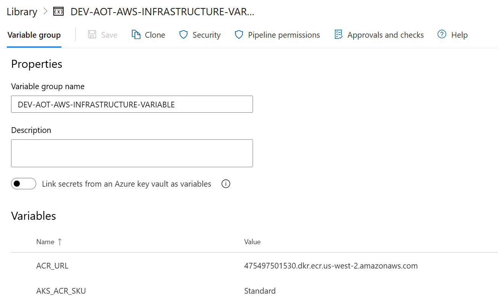
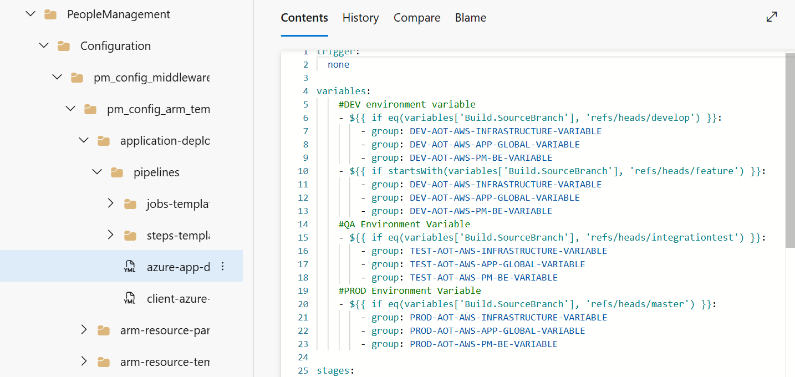
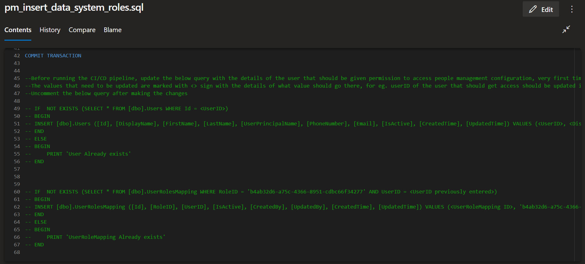
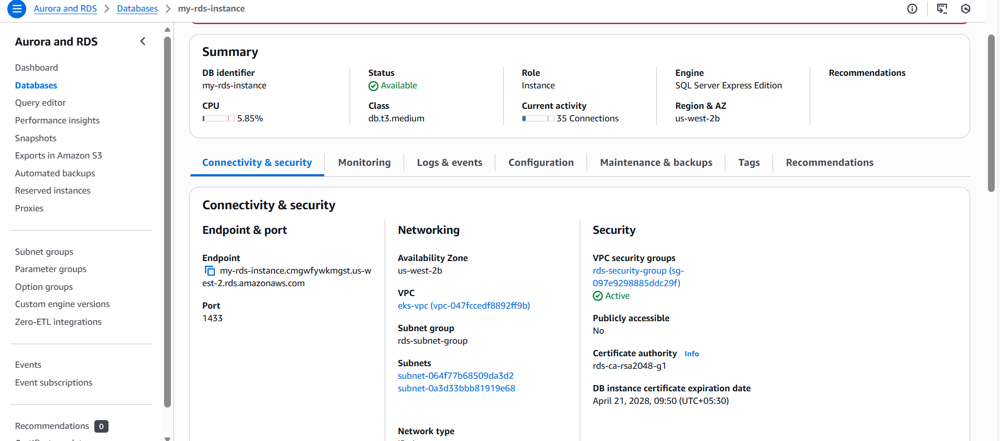
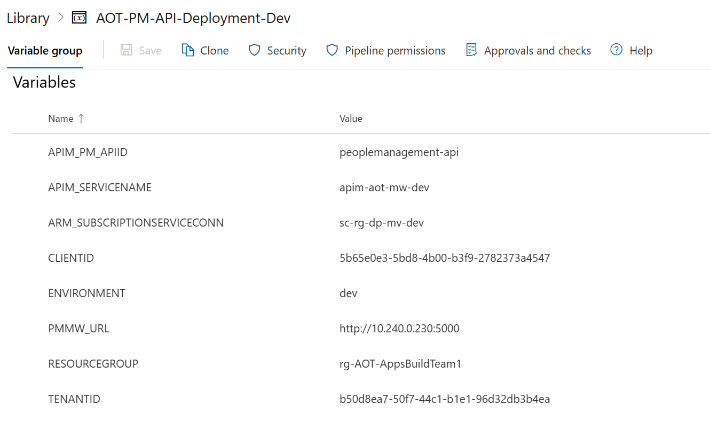
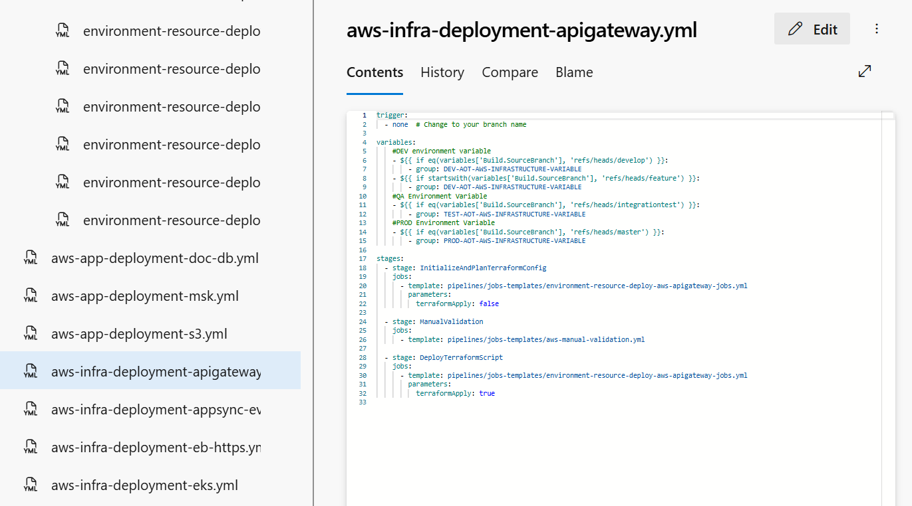
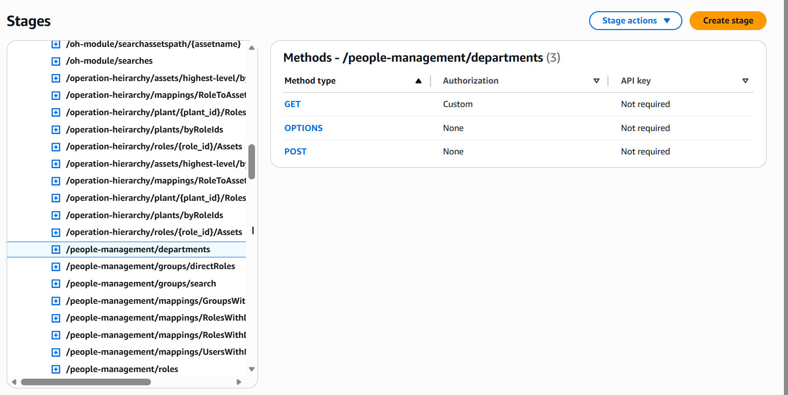

Accenture Operations Twin

People Management

BACKEND DEPLOYMENT GUIDE (AZURE)

Release Version: 2.5

| **Field** | **Value** |
| --- | --- |
| **Asset / Solution Name** | Accenture Operations Twin / People Management |
| **Domain / Area** | Identity and Access Management |
| **Owner (Team/Person)** | Tournier, Florian |
| **Reviewers** | Susarla, Aditya, Rishabh Joshi |
| **Status** | Published / Complete |
| **Confidentiality** | Internal / Confidential |
| **Source of Truth** | [Summary - Overview](https://dev.azure.com/DigitalPlantProject/Marilyn%20V) |
| **Related Assets / Alternatives** | People Management Architecture Blueprint, People Management API Reference |

## Introduction

Accenture Operations Twin (AOT) is a collection of software accelerators and tools that can be assembled to deliver client solutions. AOT accelerates the integration of product, process, and live data from disparate IT and OT systems, creating a comprehensive and contextualized view of operations to enable better decisions and optimized processes.

People Management is an AOT component that helps in managing the users, their roles, and permissions. It is a digital representation of the organizational hierarchy. The permissions would include access to data and functionality in AOT. This component is duly integrated with the clients active directory to avoid duplicity.

The People Management functionality can be integrated with other AOT components such as Smart KPIs and Intelligent Advisor. The integration requires personal data such as role and department to be fetched from Azure and displayed in AOT. To accomplish this objective, People Management APIs must be deployed in the backend. []\{#OLE_LINK1 .anchor\}

### Purpose

Through this document, a user will gain an understanding of how to deploy the backend for People Management for AOT on Azure while creating the resources (SQL Server, SQL DB, API management platform) required to manage the necessary APIs:

-   Infrastructure as Code Database (IaC DB)

-   Swagger file deployment

As explained in subsequent sections, the creation of these requirements is handled through two separate pipelines.

###  Target Audience

This tutorial is designed for use by developers with the following skills:

-   Python

-   Pipelines

-   Swagger Document

### Related Links

-   [AOT PM Documentation](https://industryxdevhub.accenture.com/assetdetails/64)

-   [AOT Documentation](https://industryxdevhub.accenture.com/asset-home;search_text=aot)

-   [AOT Release Notes](https://industryxdevhub.accenture.com/assetdetails/45)

### Prerequisites 

-   Azure license/subscription to create resources for implementation

-   Azure DevOps repository for extractor code, and pipeline files

-   A service connection on Azure DevOps for running terraformtemplates

-   A library to hold the parameters needed to run the template pipeline

-   Azure service connections for SonarQube and Container Registry

-   Storage Account

-   Azure Kubernetes Cluster

-   Container Registry

-   Namespace in the AKS cluster for environments

-   Kubernetes Service Connection for AKS Cluster

-   Sonar project and key

### 

## Glossary

| **Term / Acronym** | **Definition** |
| --- | --- |
| AOT (Accenture Operations Twin) | A suite of software accelerators and tools designed to integrate product, process, and live data from various IT and OT systems, providing a comprehensive view of operations for better decision-making and process optimization. |
| Azure | Microsoft\'s cloud computing platform is used for deploying, managing, and scaling applications and resources such as databases, containers, and APIs. |
| Backend Deployment | The process of setting up and configuring server-side components, databases, APIs, and infrastructure required for the People Management system to function. |
| SQL Server / SQL DB | Relational database services on Azure used to store and manage data for People Management, including user roles, departments, and permissions. |
| API Gateway | AWS service for publishing, securing, and managing APIs, enabling integration between People Management and other AOT components. |
| TerraformTemplate | Azure Resource Manager template; a JSON or YAML file that defines the infrastructure and configuration for Azure resources, used for automated deployments. |
| Pipeline | A set of automated steps in Azure DevOps for building, testing, and deploying code and infrastructure, such as databases and APIs. |
| Swagger File | An OpenAPI specification document that describes the structure and endpoints of an API, used for automated API deployment and documentation. |
| Docker Container | A lightweight, portable unit that packages application code and dependencies, enabling consistent deployment across environments. |
| Kubernetes Cluster (AKS) | Azure Kubernetes Service; a managed container orchestration service for deploying, scaling, and managing Docker containers. |
| Service Connection | A secure link between Azure DevOps and Azure resources, allowing pipelines to deploy and manage infrastructure. |
| SonarQube | A tool for continuous inspection of code quality, used to detect bugs, vulnerabilities, and code smells in the deployment process. |
| Artifact | A file or set of files produced by a pipeline, such as a Docker image, that is used in subsequent deployment stages. |
| Active Directory (AD) | Microsoft\'s directory service for managing users, groups, and access permissions, integrated with People Management to avoid duplicity and ensure secure access. |
| Infrastructure as Code (IaC) | The practice of managing and provisioning computing infrastructure through machine-readable definition files, rather than manual processes. |
| Variable Library | A collection of configuration values stored in Azure DevOps, used to parameterize pipeline deployments for different environments. |

## 

# Required Pipelines

| **Pipeline** | **Purpose** |
| --- | --- |
| AOT-PeopleManagement-IaC-DB-and-MS | This pipeline is used to deploy resources like SQL Server/Database and insert data into the SQL DB created. |
| AOT-PM-API-Deployment-Using-SwaggerFile | This pipeline is used to deploy the APIs in the API Management using a swagger file. These pipelines are created and then both pipelines are run. Steps to create and deploy both pipelines are discussed in the subsequent sections of this document. The backend deployment for People Management takes about 30 minutes to complete. |

### 

## AOT-PeopleManagement-IaC-DB-&amp;-MS

In this pipeline, the stages mentioned below get executed. These stages have jobs and their location listed below them. The related YML files can be found at the following file path:

> Consumption\\DataAccess\\PeopleManagement\\Configuration\\pm_config_middleware\\

#### Stage 1---CreateAzureEnvironment_SQL

*EnvironmentRGDeployment*- If SQL Server and Database do not exist, it uses the ARM templates listed below to create them.

-   pm_config_arm_templates\\application-deployment\\pipelines\\azure-app-deployment-pipelines.yml*-* This contains the path and parameters to the First stage EnvironmentRGDeployment.

-   pm_config_arm_templates\\application-deployment\\pipelines\\steps-templates\\resource-deploy-steps.yml*-* This contains parameters to deploy SQL Server and SQL Database.

#### Stage 2---CreateImage

*DockerContainerBuildAndPush*- To create the table in the SQL Database created in the previous step, build a docker image and push the image to the container registry. Then create an Artifact for the next stage.

> pm_config_ms\\pipeline\\jobimagebuildtemplate.yml

#### Stage 3---DeployApplication_MS

*KubernetesDeployment*- Use the Artifact created in the previous step and the deploying docker container.

> pm_config_ms\\pipeline\\jobapplicationdeployemplate.yml

#### Stage 4---DeployApplication_DB

*DeployDB*- Run DB setup scripts to insert data for System Roles, AOT Roles, Departments, AD Groups, Users, and their respective mappings, if they do not already exist.

> pm_config_arm_templates\\application-deployment\\pipelines\\jobs-templates\\environment-deploy-jobs.yml

#### 

### Deployment Steps

1.  

2.  Create three libraries in the DevOps portal.

    a.  DEV-AOT-AWS-INFRASTRUCTURE-VARIABLE

    b.  DEV-AOT-AWS-APP-GLOBAL-VARIABLE

    c.  DEV-AOT-AWS-PM-BE-VARIABLE

3.  Update the libraries with the corresponding values from the sheet [AOT_Azure_PM_Backend_Deployment_Variables.xlsx](https://ts.accenture.com/:x:/r/sites/GlobalDocTemplates/Published%20Documents/AOT/Linked%20Files/AOT%20PM%20Backend%20Deployment%20Guide/AOT_Azure_PM_Backend_Deployment_Variables.xlsx?d=wb7f850b4bf0e4bcbbb2efa66a52d9ce4&amp;csf=1&amp;web=1&amp;e=BarNl8).

4.  Update the pipeline file with the relevant library name.

> 
5.  Go through all steps configured in all the YML files present in the below-listed paths and verify that configured values are updated as per the current request.

> Consumption\\DataAccess\\PeopleManagement\\Configuration\\pm_config_middleware\\pm_config_arm_templates\\application-deployment\\pipelines
>
> Consumption\\DataAccess\\PeopleManagement\\Configuration\\pm_config_middleware\\pm_config_ms\\pipeline

6.  Open the YML files and verify the parameters are available under CreateAzureEnvironment_SQL, CreateImage, DeployApplication_MS, and DeployApplication_DB stages.

7.  Open the file under the following path:

> Consumption\\DataAccess\\PeopleManagement\\Configuration\\pm_config_middleware\\pm_config_db\\pm_insert_data_system_roles.sql

8.  Update the commented SQL query with the details of the user that should be permitted to access the people management configuration the first time the application is deployed. As shown in the image below, the values indicated must be replaced with actual values and then the code must be uncommented.

> Post-deployment, the user added here can explore People Management UI and create the departments and roles as per the requirement.
>
> 
9.  Create the pipeline from the following pipeline file and run it.

> Consumption\\DataAccess\\PeopleManagement\\Configuration\\pm_config_middleware\\pm_config_arm_templates\\application-deployment\\pipelines\\client-azure-app-deployment-pipelines.yml

10. In the AWS Console, validate that the following set of resources was created.

> 
## 

## AOT-PM-API-Deployment-Using-Swaggerfile

In this pipeline, the following stages get executed and the jobs are listed below them.

#### AOTApiDeployment

*ApiImportAutomation*- Use Swagger Document to create API. To Execute these jobs, go to this file path:

> /Processing/Middleware-IaC/Middleware-IaC-templates/terraform-files/config/apigateway-config

This file path contains the following YML files:

| **YML File** | **Description** |
| --- | --- |
| environment-resource-deploy-aws-apigateway-jobs.yml | This contains the path and parameters to the First step AOTApiDeployment. |
| /pipeline/pmapideployment.yml | This contains jobs to use the swagger document to create APIs in API Management and update their policies. |
| aot_pm_config_ms_swagger.json | This file contains API details to create APIs in API Management and update their policies. |
| Azure PowerShell script: Backend-URL | People management middleware policy : YML FilesYML files and their description. |

#### Deployment Steps

-   Create a library in DevOps portal e.g., AOT-PM-API-Deployment-Dev.

-   Update the Library with all the relevant values from the following table..

| **Parameters** | **Description** |
| --- | --- |
| APIM_PM_APIID | API ID Name |
| APIM_SERVICENAME | Name of APIM Service |
| ARM_SUBSCRIPTIONSERVICECONN | Service Connection Name |
| CLIENTID | Client ID of the service Principal |
| ENVIRONMENT | Environment Name |
| PMMW_URL | People Management Middleware URL |
| RESOURCEGROUP | Resource Group Name |
| TENANTID | Tenant ID of the service Principal &gt; 
|  |
| - | Update the pipeline file with the relevant library name. &gt; 
|  |
| - | Go through all steps configured in all the YML files present at the below-listed paths and verify that the configured values are updated as per the current request. &gt; /Processing/Middleware-IaC/Middleware-IaC-templates/infrastructure-deployment/aws-infra-deployment-apigateway.yml &gt; &gt; /Consumption/DataAccess/PeopleManagement/Configuration/pm_config_middleware/pm_config_ms/pipeline/pmapideployment.yml |
| - | Open the YML files and verify the parameters are available under the AOTApiDeployment stage, which has the following job: &gt; *ApiImportAutomation: Use Swagger Document to create API* |
| - | Create the pipeline from the following pipeline file and run it. &gt; /Processing/Middleware-IaC/Middleware-IaC-templates/infrastructure-deployment/aws-infra-deployment-apigateway.yml |
| - | In the Azure portal, validate that the correct set of APIs was created in API management and their policies were updated as well. &gt; 
|  |
