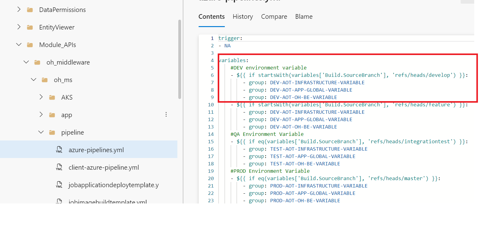
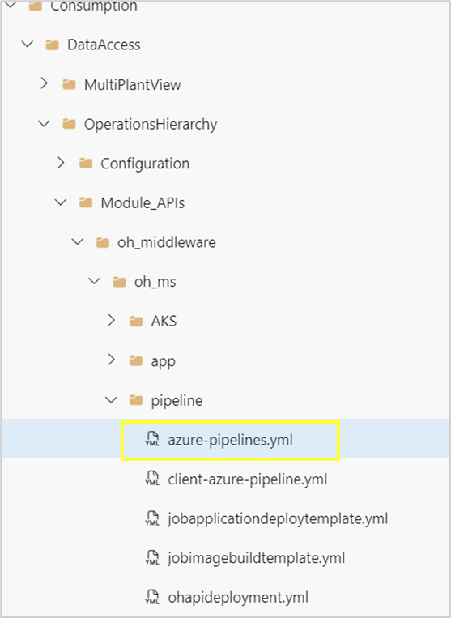
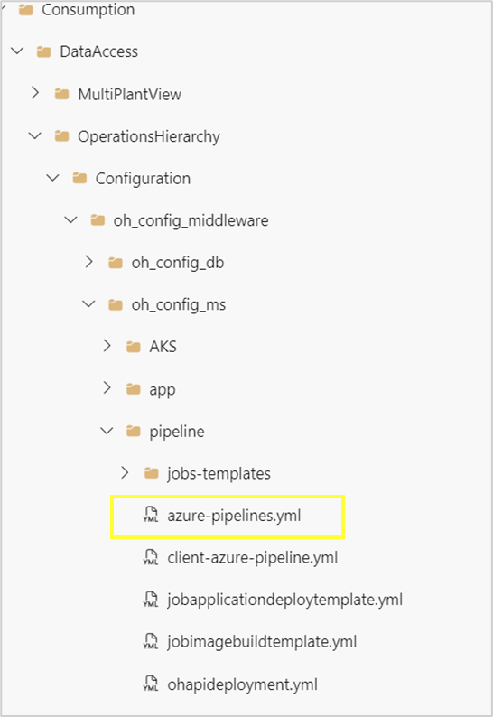
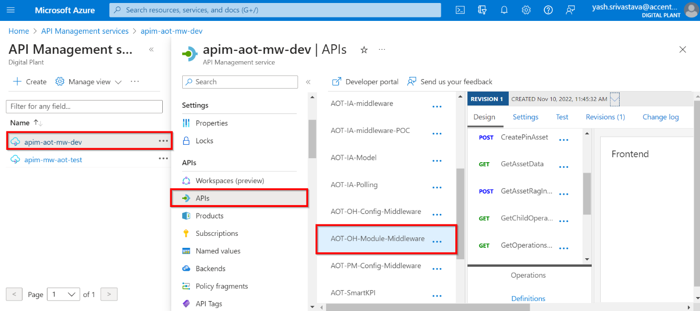
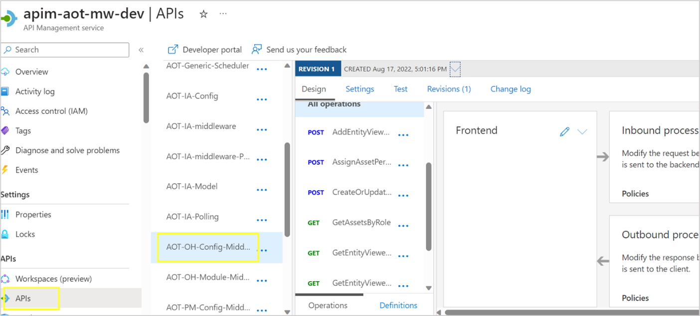

Accenture Operations Twin

Operations Hierarchy

BACKEND DEPLOYMENT GUIDE

Release Version: 2.5

**Metadata Table**

| **Field** | **Value** |
| --- | --- |
| **Asset / Solution Name** | Accenture Operations Twin / Operations Hierarchy |
| **Domain / Area** | Digital Twin / Asset Management |
| **Owner (Team/Person)** | Tournier, Florian |
| **Reviewers** | Ranganathan, Balamurugan |
| **Status** | Published / Approved |
| **Confidentiality** | Internal / Confidential |
| **Source of Truth** | [Summary - Overview](https://dev.azure.com/DigitalPlantProject/Marilyn%20V) |
| **Related Assets / Alternatives** | Operations Hierarchy UI Guide, Operations Hierarchy API Reference |

## Introduction

Accenture Operations Twin (AOT) is a collection of software accelerators and tools that can be assembled to deliver client solutions. AOT accelerates the integration of product, process, and live data from disparate IT and OT systems, creating a comprehensive and contextualized view of operations to enable better decisions and optimized processes.

Operations Hierarchy (OH) is an AOT component that helps the user navigate through the plant\'s asset hierarchy and view 360-degree information associated with each node. It is a two-dimensional or a tree-view representation of the plant\'s actual layout. An ideal operations hierarchy representation would start with a Company-level node, followed by Region, Plant, Line, Unit, System, Subsystem, Equipment, and so on. When integrated with other AOT components, the OH can be used to view detailed information like insights and filtered KPIs related to each level or node.

### Purpose

This guide describes the deployment of the Operations Hierarchy Module APIs *Infrastructure as Code Microservice (IaC MS)* and Swagger file deployment.

Through this document, a user will gain an understanding of how to deploy the backend for Operations Hierarchy on AOT\'s CDF (Cognite Data Fusion) version, while creating the resources (API management platform) required to manage the necessary APIs. The backend deployment for Operations Hierarchy takes about ten minutes to complete.

### Target Audience

Developers deploying the AOT/OH application.:

### Prerequisites 

-   Familiarity with Python, Azure Pipelines, and Swagger document.

-   Azure license/subscription to create resources for implementation.

-   Azure DevOps repository for extractor code, ARM templates, and pipeline files.

-   A service connection on Azure DevOps for running ARM templates.

-   A library to hold the parameters needed to run the template pipeline.

-   Azure service connections for SonarQube and Container Registry.

-   Storage Account

-   Azure Kubernetes Cluster

-   Container Registry

-   Namespace in the AKS cluster for environments

-   Kubernetes Service Connection for AKS Cluster

-   Sonar project and key

### 

## Contacts

-   [florian.tournier@accenture.com](mailto:florian.tournier@accenture.com)

-   [b.h.ranganathan@accenture.com](mailto:b.h.ranganathan@accenture.com)

-   [rishabh.b.joshi@accenture.com](mailto:rishabh.b.joshi@accenture.com)

### Related Links

-   [AOT Documentation](https://industryxdevhub.accenture.com/asset-home;search_text=aot)

-   OH [Documentation](https://industryxdevhub.accenture.com/assetdetails/76)

-   [[AOT Release Notes]](https://industryxdevhub.accenture.com/assetdetails/45)

### 

## 

### Glossary

| Term | Definition |
| --- | --- |
| Service Connection | A secure connection in Azure DevOps that enables pipelines to access and deploy resources in Azure or other external services. |
| ARM Template | Azure Resource Manager template used to define the infrastructure and configuration for Azure resources in a declarative manner. |
| Pipeline Library | A central repository in Azure DevOps for storing parameters, secrets, and variables required by pipelines. |
| SonarQube | An open-source platform for continuous inspection of code quality, used to detect bugs, vulnerabilities, and code smells. |
| Container Registry | A service for storing and managing container images, such as Docker images, that are used in deployments. |
| Storage Account | An Azure resource that provides scalable cloud storage for data objects including blobs, files, queues, and tables. |
| Azure Kubernetes Cluster (AKS) | A managed Kubernetes service in Azure for running and orchestrating containerized applications. |
| Namespace | A logical partition within a Kubernetes cluster that isolates resources and workloads for different environments or teams. |
| Kubernetes Service Connection | A service connection in Azure DevOps specifically configured to interact securely with an AKS cluster. |
| API Management (APIM) | An Azure service for publishing, securing, transforming, and monitoring APIs. |
| Swagger File | A machine-readable file (OpenAPI Specification) that describes the structure and endpoints of an API for documentation and automation. |
| Artifact | A packaged output from a pipeline stage, such as a built image or deployment file, used as an input for subsequent stages. |

## 

# Deployment Pipeline

The deployment depends on the pipelines listed below to create the environment, build the image, run test cases, and deploy the APIs in the API Management using a swagger file.

-   AOT- OperationsHierarchy-Module-IaC-MS

-   AOT- OperationsHierarchy-Config-IaC-MS

The outcome of this pipeline will enable the user to validate the deployed APIs on the APIM. There are three stages of the pipeline. Each stage serves a specific purpose as described below.

1.  DockerContanerBuildAndPush (jobimagebuildtemplate.yml) is used to create an image. To run test cases:

    a.  Run a SonarQube check.

    b.  Build the docker image.

    c.  Push the image to the container registry.

    d.  Create the Artifact for the next stage.

2.  KubernetesDeployment (jobapplicationdeploytemplate.yml) is used to deploy the application. Use:

    a.  the Artifact created in the previous step.

    b.  the deploying docker container.

3.  ApiImportAutomation (ohapideployment.yml) is used for APIM integration. Use the Swagger Document to import and create the API.

The YML files listed above can be found at the following file paths:

-   Consumption/DataAccess/OperationsHierarchy/Module_APIs/oh_middleware/oh_ms/pipeline

-   Consumption/DataAccess/OperationsHierarchy/Configuration/oh_config_middleware/oh_config_ms/pipeline

## 

# Deployment Steps

1.  Create a library in the DevOps portal with the following three variable groups.

    a.  DEV-AOT-INFRASTRUCTURE-VARIABLE

    b.  DEV-AOT-APP-GLOBAL-VARIABLE

    c.  DEV-AOT-OH-BE-VARIABLE

2.  Update the library with the corresponding variables as listed in [AOT_Cognite_OH_Backend_Deployment_Variables.xlsx](https://ts.accenture.com/:x:/r/sites/GlobalDocTemplates/Published%20Documents/AOT/Linked%20Files/AOT%20OH%20Backend%20Deployment%20Guide/AOT_Cognite_OH_Backend_Deployment_Variables.xlsx?d=w2f5f19733c354ed6ac19348d246c4643&amp;csf=1&amp;web=1&amp;e=udEB0o).

3.  Update the pipeline file with the relevant library name as shown.

> 
4.  

5.  Check each YML file found in the folder below to verify that the configured values in each step are updated as necessary.

    a.  Consumption/DataAccess/OperationsHierarchy/Module_APIs/oh_middleware/oh_ms/pipeline/

    b.  Consumption/DataAccess/OperationsHierarchy/Configuration/oh_config_middleware/oh_config_ms/pipeline

6.  Open the YML files and verify that the parameters are present under the *CreateImage*, *DeployApplication*, and *ApiImportAutomation* stages.

7.  Create and then run the pipeline from the following pipeline files:

    a.  Consumption/DataAccess/OperationsHierarchy/Module_APIs/oh_middleware/oh_ms/pipeline/azure-pipelines.yml

    b.  Consumption/DataAccess/OperationsHierarchy/Configuration/oh_config_middleware/oh_config_ms/pipeline/azure-pipelines.yml

8.  

9.  In the Azure portal, validate that the correct set of APIs was created in API management and that their policies were updated for both OH Module Middleware and OH Config Middleware respectively.

> 
>
> 
