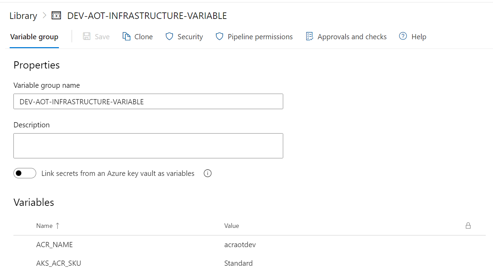
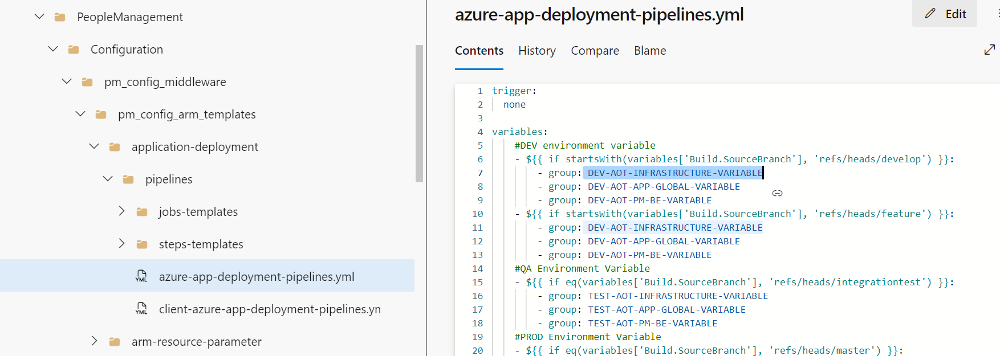
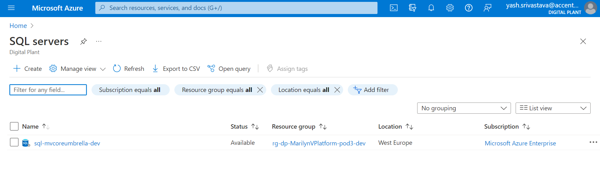
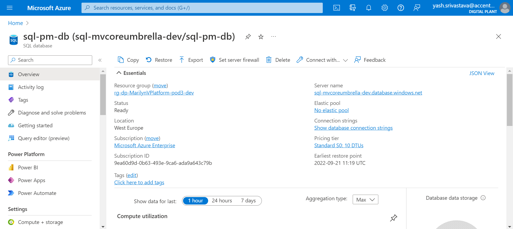
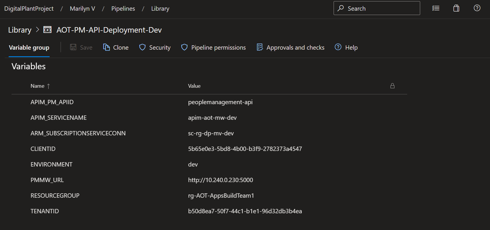
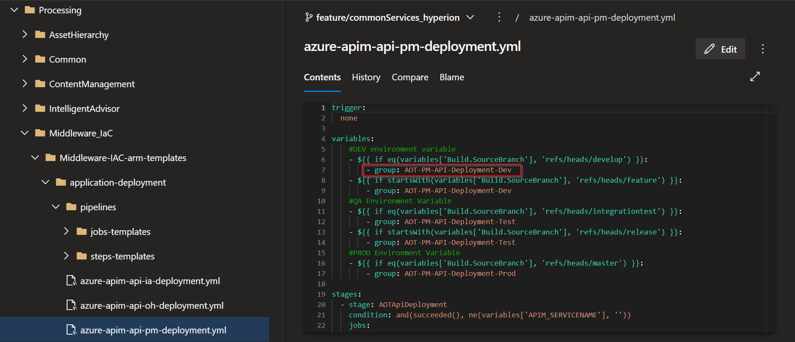
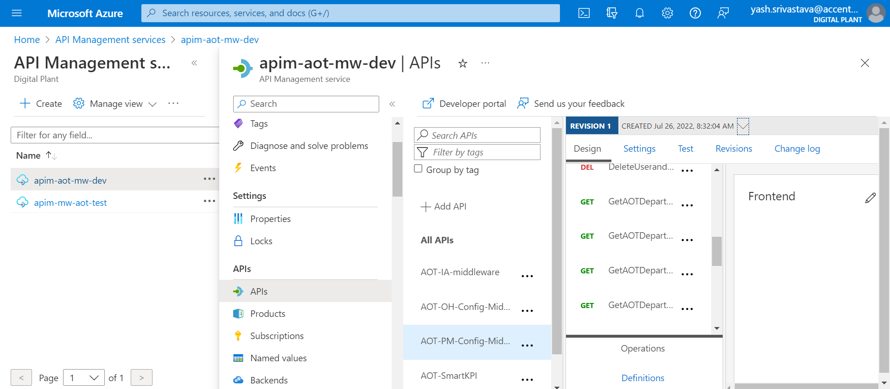

Accenture Operations Twin

People Management

BACKEND DEPLOYMENT GUIDE

Release Version: 2.4

| **Field** | **Value** |
| --- | --- |
| **Asset / Solution Name** | Accenture Operations Twin / People Management |
| **Domain / Area** | Identity and Access Management |
| **Owner (Team/Person)** | Tournier, Florian |
| **Reviewers** | Susarla, Aditya, Rishabh Joshi |
| **Status** | Draft / In Progress |
| **Confidentiality** | Internal / Confidential |
| **Source of Truth** | [Summary - Overview](https://dev.azure.com/DigitalPlantProject/Marilyn%20V) |
| **Related Assets / Alternatives** | People Management Architecture Blueprint, People Management API Reference |

## Introduction

Accenture Operations Twin (AOT) is a collection of software accelerators and tools that can be assembled to deliver client solutions. AOT accelerates the integration of product, process, and live data from disparate IT and OT systems, creating a comprehensive and contextualized view of operations to enable better decisions and optimized processes.

People Management is an AOT component that helps in managing the users, their roles, and permissions. It is a digital representation of the organizational hierarchy. The permissions would include access to data and functionality in AOT. This component is duly integrated with the client\'s active directory to avoid duplicity.

AOT's People Management functionality can be integrated with other AOT components such as Smart KPIs and Intelligent Advisor. The integration requires personal data such as role and department to be fetched from Azure and displayed in AOT. To accomplish this objective, People Management APIs must be deployed in the backend.

### Target Audience

This tutorial is designed for use by developers with the following skills:

-   Python

-   Pipelines

-   Swagger Document

### Purpose

Through this document, a user will gain an understanding of how to deploy the backend for People Management while creating the resources (SQL Server, SQL DB, API management platform) required to manage the necessary APIs:

-   Infrastructure as Code Database (IaC DB)

-   Swagger file deployment

As explained in subsequent sections, the creation of these requirements is handled through two separate pipelines.

### Related Links

-   [AOT PM Documentation](https://industryxdevhub.accenture.com/assetdetails/64)

-   [AOT Documentation](https://industryxdevhub.accenture.com/asset-home;search_text=aot)

-   [AOT Release Notes](https://industryxdevhub.accenture.com/assetdetails/45)

### Prerequisites 

-   Azure license/subscription to create resources for implementation

-   Azure DevOps repository for extractor code, ARM templates, and pipeline files

-   A service connection on Azure DevOps for running ARM templates

-   A library to hold the parameters needed to run the template pipeline

-   Azure service connections for SonarQube and Container Registry

-   Storage Account

-   Azure Kubernetes Cluster

-   Container Registry

-   Namespace in the AKS cluster for environments

-   Kubernetes Service Connection for AKS Cluster

-   Sonar project and key

## 

## 

### Glossary

| **Term** | **Definition** |
| --- | --- |
| AOT (Accenture Operations Twin) | A suite of software accelerators and tools designed to integrate product, process, and live data from various IT and OT systems, providing a unified view of operations for better decision-making and process optimization. |
| Backend Deployment | The process of setting up the server-side infrastructure and APIs required for People Management, including databases, API management, and integration with other AOT components. |
| API (Application Programming Interface) | A set of protocols and tools for building and integrating application software, allowing different components to communicate and share data. |
| Swagger File | A specification for defining APIs, used here to automate the deployment of People Management APIs in the backend. |
| Infrastructure as Code (IaC) | The practice of managing and provisioning computing infrastructure through machine-readable definition files, rather than manual hardware configuration. |
| ARM Template | Azure Resource Manager template; a JSON file that defines the resources needed for an Azure solution, used for automated deployment. |
| Azure DevOps | A cloud-based platform for software development, providing tools for source control, pipelines, and collaboration. |
| SQL Server / SQL Database | Microsoft's relational database management system and its databases, used to store and manage People Management data. |
| Docker Image | A lightweight, standalone, and executable software package that includes everything needed to run an application, used here for deploying backend services. |
| Kubernetes Cluster (AKS) | A group of nodes running containerized applications managed by Kubernetes, with Azure Kubernetes Service (AKS) providing the orchestration. |
| API Management (APIM) | A platform for publishing, managing, securing, and analyzing APIs, used to expose People Management APIs. |
| Service Connection | A configuration in Azure DevOps that allows pipelines to access external services securely. |
| Variable Library | A collection of key-value pairs used to store configuration parameters for pipelines and deployments. |
| Artifact | A file or set of files produced during a pipeline run, such as a Docker image, used in subsequent deployment stages. |
| Active Directory (AD) | Microsoft's directory service for managing users, groups, and permissions within an organization. |
| SonarQube | An open-source platform for continuous inspection of code quality, used here for code analysis in pipelines. |
| Namespace | A way to organize resources within a Kubernetes cluster, often used to separate environments. |
| Resource Group | A container in Azure that holds related resources for an Azure solution. |
| Client ID / Tenant ID | Identifiers for Azure service principals, used for authentication and authorization in deployments. |
| Middleware | Software that connects different applications or services, enabling communication and data management. |
| YAML (YML) File | A human-readable data serialization format used for configuration files, such as pipeline definitions. |

## Required Pipelines

| **Pipeline** | **Purpose** |
| --- | --- |
| AOT-PeopleManagement-IaC-DB-&amp;-MS | This pipeline is used to deploy resources like SQL Server/Database and insert data into the SQL DB created. |
| AOT-PM-API-Deployment-Using-SwaggerFile | This pipeline is used to deploy the APIs in the API Management using a swagger file. These pipelines are created and then both pipelines are run. Steps to create and deploy both pipelines are discussed in the subsequent sections of this document. The backend deployment for People Management takes about 30 minutes to complete. |

### AOT-PeopleManagement-IaC-DB-&amp;-MS

In this pipeline, the stages mentioned below get executed. These stages have jobs and their location listed below them. The related YML files can be found at the following file path:

Consumption\\DataAccess\\PeopleManagement\\Configuration\\pm_config_middleware\\

#### Stage 1---CreateAzureEnvironment_SQL

*EnvironmentRGDeployment*- If SQL Server and Database don't exist, it uses the ARM templates listed below to create them.

-   pm_config_arm_templates\\application-deployment\\pipelines\\azure-app-deployment-pipelines.yml*-* This contains the path and parameters to the First stage 'EnvironmentRGDeployment'.

-   pm_config_arm_templates\\application-deployment\\pipelines\\steps-templates\\resource-deploy-steps.yml*-* This contains parameters to deploy SQL Server and SQL Database.

#### Stage 2---CreateImage

*DockerContainerBuildAndPush*- To create the table in the SQL Database created in the previous step, build a docker image and push the image to the container registry. Then create an Artifact for the next stage.

  -----------------------------------------------------------------------
  -----------------------------------------------------------------------

*KubernetesDeployment*- Use the Artifact created in the previous step and the deploying docker container.

  -----------------------------------------------------------------------
  -----------------------------------------------------------------------

*DeployDB*- Run DB setup scripts to insert data for System Roles, AOT Roles, Departments, AD Groups, Users, and their respective mappings, if they do not already exist.

  ---------------------------------------------------------------------------------------------------------
  ---------------------------------------------------------------------------------------------------------

#### Deployment Steps

1.  

2.  Create three libraries in the DevOps portal.

    a.  DEV-AOT-INFRASTRUCTURE-VARIABLE

    b.  DEV-AOT-APP-GLOBAL-VARIABLE

    c.  DEV-AOT-PM-BE-VARIABLE

3.  Update the libraries with the corresponding values from the sheet [AOT Cognite PM Backend Deployment Variables.xlsx](https://ts.accenture.com/:x:/r/sites/GlobalDocTemplates/Published%20Documents/AOT/Linked%20Files/AOT%20PM%20Backend%20Deployment%20Guide/AOT_Cognite_PM_Backend_Deployment_Variables.xlsx?d=waefc0f7c1a1a4a3f9d2eeb3553fbfb77&amp;csf=1&amp;web=1&amp;e=G5AHWb).

4.  Update the pipeline file with the relevant library name.

> 
5.  Go through all steps configured in all the YML files present in the below-listed paths and verify that configured values are updated as per the current request.

| Consumption\\DataAccess\\PeopleManagement\\Configuration\\pm_config_middleware\\pm_config_arm_templates\\application-deployment\\pipelines |
| --- |
| Consumption\\DataAccess\\PeopleManagement\\Configuration\\pm_config_middleware\\pm_config_ms\\pipeline |

6.  Open the YML files and verify the parameters are available under CreateAzureEnvironment_SQL, CreateImage, DeployApplication_MS, and DeployApplication_DB stages.

7.  Open the file under the following path:

  -------------------------------------------------------------------------------------------------------------------------------

| 8. | Update the commented SQL query with the details of the user that should be permitted to access the people management configuration the first time the application is deployed. The values that must be updated are marked with a \ sign with the details of what value should go there, e.g., the userID of the user that should get access should be updated in \' \' in the place of \. Then uncomment the commented code. &gt; Post-deployment, the user added here can explore People Management UI and create the departments and roles as per the requirement. &gt; &gt; 
|  |
| --- | --- |
| 9. | Create the pipeline from the following pipeline file and run it. Consumption\\DataAccess\\PeopleManagement\\Configuration\\pm_config_middleware\\pm_config_arm_templates\\application-deployment\\pipelines\\client-azure-app-deployment-pipelines.yml 10. In the Azure portal, validate that the following set of resources was created. &gt; **SQL Server:** &gt; &gt; 
> &gt; **SQL** **Database:** &gt; &gt; 
|  |

## 

## AOT-PM-API-Deployment-Using-Swaggerfile

In this pipeline, the following stages get executed and the jobs are listed below them.

#### AOTApiDeployment

*ApiImportAutomation*- Use Swagger Document to create API. To Execute these jobs, go to this file path:

  --------------------------------------------------------------------------------
  --------------------------------------------------------------------------------

| **YML File** | **Description** |
| --- | --- |
| azure-apim-api-pm-deployment.yml | This contains the path and parameters to the First step 'AOTApiDeployment'. |
| pipelines/jobs-templates/pmapideployment.yml | This contains jobs to use the swagger document to create APIs in API Management and update their policies. |
| Swagger-Import-Script-Peoplemanagement | This file contains API details to create APIs in API Management and update their policies. |
| Azure PowerShell script: Backend-URL | People management middleware policy : YML FilesYML files and their description. |

#### Deployment Steps

1.  Create a library in DevOps portal e.g., AOT-PM-API-Deployment-Dev.

2.  Update the Library with all the relevant values, as shown in the following table.

| **Parameters** | **Description** |
| --- | --- |
| APIM_PM_APIID | API ID Name |
| APIM_SERVICENAME | Name of APIM Service |
| ARM_SUBSCRIPTIONSERVICECONN | Service Connection Name |
| CLIENTID | Client ID of the service Principal |
| ENVIRONMENT | Environment Name |
| PMMW_URL | People Management Middleware URL |
| RESOURCEGROUP | Resource Group Name |
| TENANTID | Tenant ID of the service Principal &gt; 
|  |
| 3. | Update the pipeline file with the relevant library name. &gt; 
|  |
| 4. | Go through all steps configured in all the YML files present at the below-listed paths and verify that the configured values are updated as per the current request. Processing\\Middleware_IaC\\Middleware-IAC-arm-templates\\application-deployment\\azure-apim-api-pm-deployment.yml Processing\\Middleware_IaC\\Middleware-IAC-arm-templates\\application-deployment\\pipelines\\jobs-templates\\pmapideployment.yml |
| 5. | Open the YML files and verify the parameters are available under the AOTApiDeployment stage, which has the following job: *ApiImportAutomation: Use Swagger Document to create API* |
| 6. | Create the pipeline from the following pipeline file and run it. Processing\\Middleware_IaC\\Middleware-IAC-arm-templates\\application-deployment\\azure-apim-api-pm-deployment.yml 7. |
| 8. | In the Azure portal, validate that the correct set of APIs was created in API management and their policies were updated as well. &gt; 
|  |
