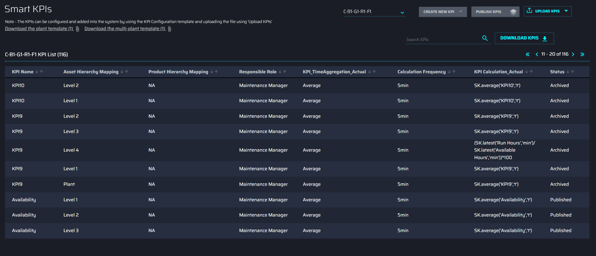
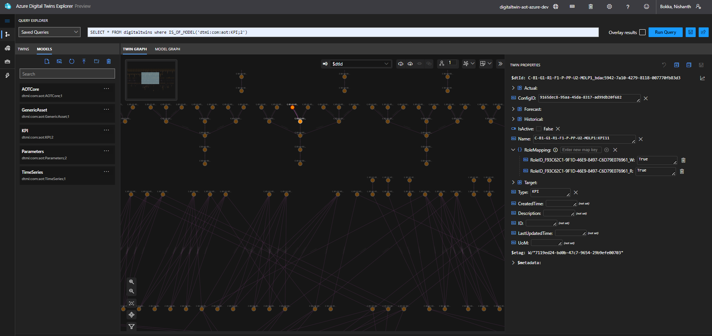
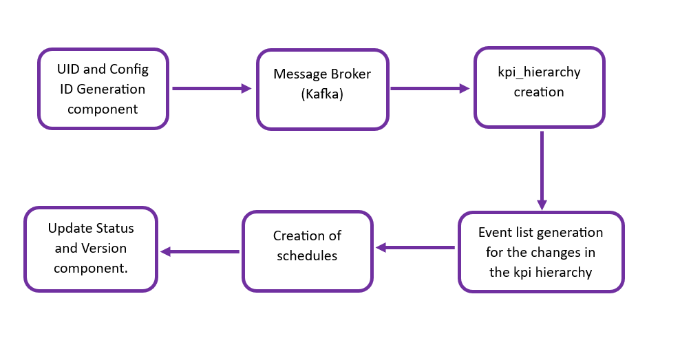
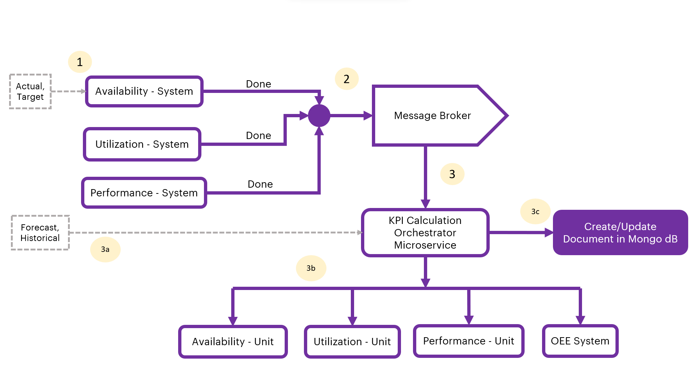
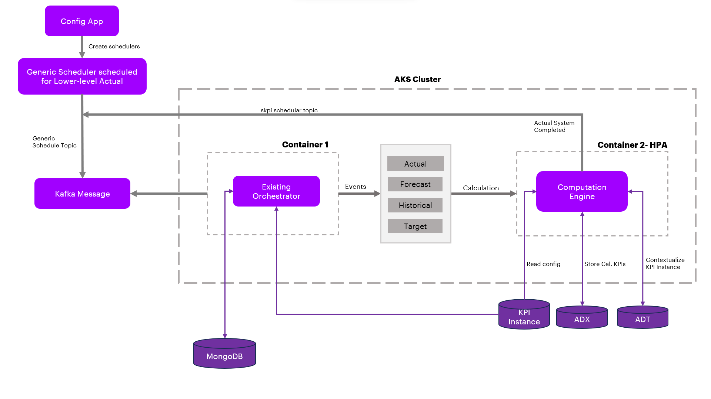
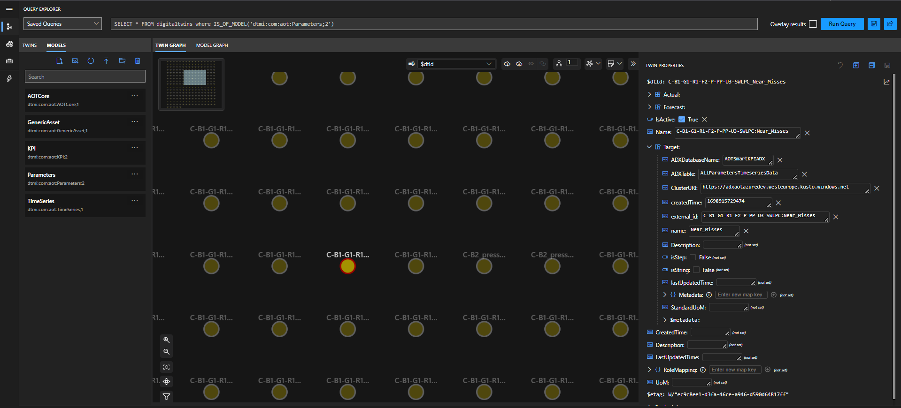
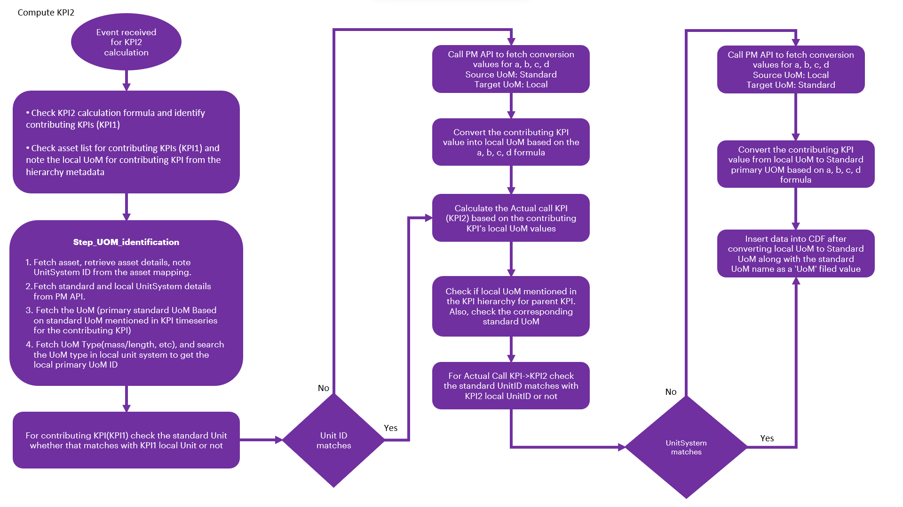
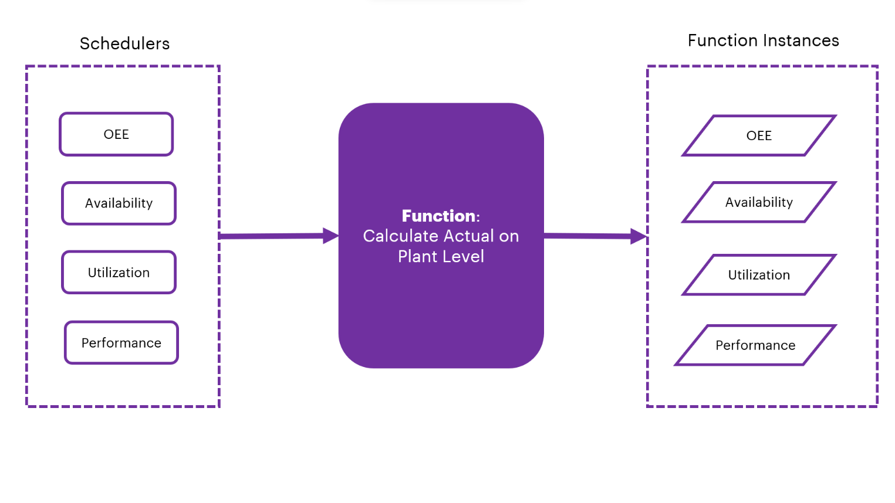
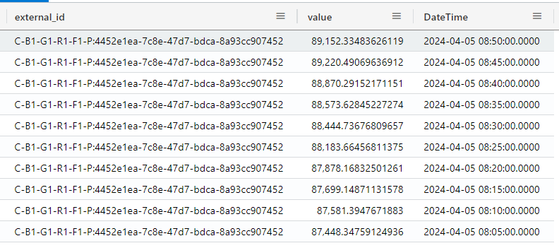

Accenture Operations Twin

KPI Hierarchy and Calculation

TECHNICAL OVERVIEW (AZURE)

Release Version 2.5

**Metadata Table**

| **Field** | **Value** |
| --- | --- |
| **Asset / Solution Name** | Smart KPIs KPI Hierarchy and Calculation Technical Overview |
| **Domain / Area** | Performance Metrics |
| **Owner (Team/Person)** | Tournier, Florian |
| **Reviewers** | Susarla, Aditya |
| **Status** | Complete / Approved |
| **Confidentiality** | Internal / Confidential |
| **Source of Truth** | [Summary - Overview](https://dev.azure.com/DigitalPlantProject/Marilyn%20V) |
| **Related Assets / Alternatives** | Smart KPIs API Reference, Smart KPIs Admin Guide |

## Introduction

Accenture Operations Twin (AOT) is a collection of software accelerators and tools that are assembled to deliver client solutions. AOT accelerates the integration of product, process, and live data from disparate IT and OT systems, creating a comprehensive and contextualized view of operations to enable better decisions and optimized processes.

Key Performance Indicators (KPIs) are measurable factors that are tracked to measure performance, stimulate actions, and drive business productivity. The factors listed in the table below are used to form each KPI.

| **Factor** | **Description** |
| --- | --- |
| Actual Value | The current value of the KPI calculated using the actual calculation logic defined in the KPI config template. |
| Historical Benchmark | Best performance value observed in the last 12 months. |
| Target Value | Desired performance/value of the KPI. |
| Forecast | Forecast for the current time interval, which is calculated as a 7-day moving average. AOT is integrated with Azure Resources where Schedulers are used to calculate the KPI data using the factors above and to insert data points into the timeseries. For the scheduler to work, a KPI Hierarchy must first be established. |

### 

## Purpose

This document explains:

-   what happens behind the scenes when the Smart KPIs Config tool UI is used to upload the Smart KPIs Config Template.

-   the KPI Hierarchy that must be in place before using Define KPI.

-   how the contributing and influencing relationships between KPIs are established.

-   how the relationships between KPIs and assets are established.

-   how schedulers are created, scheduled, and executed.

### Prerequisites

-   For Scheduling and Sequencing:

    -   A new env variable AZURE_WEBPUB_CS_API must be created in the environment variable library.

    -   A new key-value pair SMARTKPI_HUB_NAME: AOT_SMARTKPI_NOTIFICATION_HUB must be created in the env variable library.

    -   Because the structure has changed, any collections and documents matching the deployment date that are present in the Cosmos DB should be removed before deployment so that a new collection and documents can be created with the correct date and time stamp. If this step is skipped, the collection and documents will be created the following day.

-   The reader must be familiar with the Smart KPIs config template. Refer to the [Smart KPIs Administration Guide](https://industryxdevhub.accenture.com/assetdetails/42) for more information.

### Target Audience

-   Client Delivery Teams planning to deliver AOT

### Contacts

-   [nithya.arumugham@accenture.com](mailto:nithya.arumugham@accenture.com)

-   [thejash.s.suresh@accenture.com](mailto:thejash.s.suresh@accenture.com)

-   [hanuman.prasad.gali@accenture.com](mailto:hanuman.prasad.gali@accenture.com)

-   [nishanth.bokka@accenture.com](mailto:nishanth.bokka@accenture.com)

### Related Links

-   [AOT Documentation](https://industryxdevhub.accenture.com/asset-home;search_text=AOT)

-   [AOT Simulator and IoTHub Extractor Deployment Guide](https://industryxdevhub.accenture.com/assetdetails/46)

-   [AOT UoM Technical Reference](https://industryxdevhub.accenture.com/assetdetails/87)

-   [AOT Generic Scheduler Technical Overview](https://industryxdevhub.accenture.com/assetdetails/83)

### 

## Glossary

| **Term** | **Definition** |
| --- | --- |
| AOT (Accenture Operations Twin) | A suite of software accelerators and tools designed to integrate product, process, and live data from IT and OT systems, providing a comprehensive view of operations for better decision-making and process optimization. |
| KPI (Key Performance Indicator) | Measurable factors tracked to assess performance, stimulate actions, and drive business productivity. KPIs are calculated using actual values, historical benchmarks, target values, and forecasts. |
| Actual Value | The current value of a KPI, calculated using the logic defined in the KPI configuration template. |
| Historical Benchmark | The best performance value observed in the last 12 months. |
| Target Value | The desired performance or value for a KPI. |
| Forecast | The predicted value for the current time interval, typically calculated as a 7-day moving average. |
| KPI Hierarchy | A structure storing all KPIs along with their relationships (contributing, influencing, parent status) and associations with assets. |
| Asset Hierarchy | The organizational structure of assets, created via Azure Data Factory pipelines, representing relationships from company level down to individual assets. |
| Parameter Hierarchy | Structure of parameters (leaf nodes) created by simulators, each associated with an asset and used in KPI calculations. |
| Contributing KPI | A KPI that directly affects the value or performance of another KPI. |
| Influencing KPI | A KPI that indirectly affects the value or performance of another KPI. |
| Scheduler | Azure-based service that triggers KPI calculations and inserts data points into time series databases according to defined frequencies. |
| Orchestrator Microservice | Service that manages the scheduling, sequencing, and execution of KPI calculations, handling event-driven flows and communication between components. |
| UID/Config ID | Unique identifiers generated for each KPI during hierarchy creation, used for tracking and configuration. |
| Configuration Module | Component that detects changes in roles, influencing KPIs, and calculation logic, generating events for further processing. |
| UoM (Unit of Measurement) | Standardized measurement units used for KPIs and assets, configurable to match client requirements and converted using defined APIs and formulas. |
| OT KPI | KPIs based on time-series data from operational technology assets, calculated continuously. |
| Non-OT KPI | KPIs based on event-driven data, typically linked to significant operational events, supporting shift-based calculations. |
| Kafka Message | Event-driven messages exchanged between services (e.g., Scheduler, Orchestrator, Computation Engine) to manage calculation status and workflow. |
| Computation Engine | Service responsible for calculating Actual, Historical, and Forecast values for KPIs at various hierarchy levels. |
| Cosmos DB | Azure database service used to store collections and documents related to KPI calculations and hierarchy. |
| Azure Blob Storage | Cloud storage service used to store templates and processed files for KPI hierarchy and configuration. |
| WebPubSub Service | Azure service used for real-time notifications and auto-refreshing KPI calculations in the UI. |
| API (Application Programming Interface) | Defined endpoints and protocols used for interacting with backend services (e.g., UoM APIs, Computation Engine APIs). |
| Batch KPI | KPIs based on event-driven time-series data from operational technology assets, calculated continuously. |

## 

# KPI Hierarchies

A KPI hierarchy is used to store all the AOT KPIs along with any defined relationships such as contributing, influencing, and parent status. AOT\'s Create KPI Hierarchy function, which is called as a part of the creation API in the SmartKPI Host App, picks the template uploaded by the user from Azure Blob Storage, processes the data, generates UID/Config_ID details (if not present), checks for contributor, influencer relationship and parent status, and creates the KPI hierarchy by adding assets, relationships, and metadata information.

The bullet points on the right describe the flow. To understand how the files are structured, see the [sample files](https://ts.accenture.com/:u:/r/sites/GlobalDocTemplates/Published%20Documents/AOT/Linked%20Files/Sample_KPI_Files_AOT_1_1.zip?csf=1&amp;web=1&amp;e=ddLBlG). The image below shows the KPI Hierarchy in SmartKPI.

-   Once the file has been uploaded, the first step is to create the KPI hierarchy so that relationships between the KPIs as well as assets are established.

-   After the creation of the KPI hierarchy, Events are created for each asset hierarchy level and attribute combination e.g., Plant Actual, Plant Forecast, etc.

-   Each lowest level KPI is then created as a schedule, e.g., the lowest level of the Actual attribute has different schedules for Availability, Utilization, Performance, etc.

-   These schedules are then executed based on the calculation frequency of each KPI and buffer time.

-   The KPIs are then computed using available data. In this case, the data is simulated because no client data exists.

The following image depicts the KPI details in the Azure Digital Twins (ADT) Explorer.

## Hierarchy Flows

The below diagrams represent asset hierarchy, KPI hierarchy, and parameters in ADT.

  -------------------------------------------------------------------------------------------------------------------------------------------------------------------------------------------------------------------------------------------------------------------------------------------------------------------------------------------------------------------------------------------------------------------------------------------------

The Create KPI Hierarchy function consists of the following components:

-   UID and Config ID Generation Component

-   KPI Hierarchy component

-   Event list generation for the changes in the kpi_hierarchy

-   Creation of schedules

-   Update Status and Version component.

The flow diagram depicts the order of flow from one component to another. These components are discussed further in the subsequent sections.

#### UID/Config ID Generation

To generate the UID and Config ID, files must be located and retrieved from the Azure Blob Storage.

-   When successfully retrieved, the files are further processed by using the ThreadPoolExecuter, which enables parallel processing of multiple files.

-   Each Blob is read into a Pandas DataFrame. The UID/Config_Id generation component then checks for the existence of necessary worksheets and required columns within the DataFrame. The columns checked typically include \'KPI Name\', \'UID\', and \'Config_ID\'.

-   After checking the columns, the UIDs and Config IDs are updated into the DataFrame. This process repeats for every KPI in the Data Frame using the following conditions:

-   If a KPI name is already present in the global_dict, the existing UID is updated and a new Config_ID is generated.

-   If a KPI name is not present, it generates a new UID and Config_ID and updates the global_dict accordingly.

-   The updated data frame is uploaded to the Azure Blob Storage. When uploading, the component ensures that the data structure of the file in the blob and file location are correct.

-   To view responses from the file processing stage, the completion status, and error messages, a detailed response dictionary is constructed.

####  KPI Hierarchy

The KPI Hierarchy is created based on the template uploaded manually. The component downloads the latest template based on the filename provided. It loads the data into the list collection and creates/updates the following:

-   Asset hierarchy based on the Add, Update, and Archive flags mentioned in the template.

-   Parameters from the KPI_Calculation_Actual column

-   Metadata of all KPIs

-   \'KPI_for\' relation with assets and products under asset_mapping and Product_mapping columns in the KPI config template.

-   Contributing relationship between the KPIs based on the Excel Sheet criteria attached which is titled \'attached_sheet\'.

-   Contributing relationships in the timeseries in case of an Update scenario.

-   Influencing relationships in the timeseries in the case of the Update scenario.

-   A change_list to generate the events for the Configuration module.

####  Configuration Module 

The configuration module is activated after the KPI Hierarchy function is created or updated. The configuration module then performs the following functions:

-   Detecting changes in:

-   User Roles/Responsible Role

-   Influencing KPIs

-   KPI Calculation Logic

-   Generating corresponding events and dispatching events to a message broker (Kafka) for further consumption by the data permission service.

####  Update Status and Version

This component receives the file path and file status as input from the template. Files are retrieved from the specified path in the Blob storage. The Thread Pool Executor is utilized to process these files in parallel.

-   The KPI Hierarchy is retrieved and converted into the data frame using the flat table.

-   The status and version are updated for every row in the Config template as per the Config ID.

-   The updated file is uploaded to the Azure Blob Storage.

-   A detailed response dictionary is constructed which includes the responses from the file processing stage, the completion status, and error messages,

## KPI Calculations

Once the KPI hierarchy is created, the calculation of all the KPIs is performed. For this calculation, a consumer-publisher concept is used to orchestrate the calculation flow. Additionally, to communicate with the Orchestrator Event hubs, WebPubSub message service is used, which is also used for notifications.

The KPI calculations involve various concepts and stages that work simultaneously and interdependently and are described in the subsequent sections.

### Scheduling and Sequencing

As part of the KPI notification service, Event-HUB messages are published using the WebPubSub service to help auto-refresh KPI calculations in the UI. In this process, each asset-calculation message will be published in the scheduling-sequencing topic. Each message should have a specific scope (e.g., Orchestrator Scope or Instance Value Scope) that will identify and distinguish the message sent to the notification service. To maintain an uninterrupted flow of even hub messages, the Smart KPI component generates a new token every hour.

The KPI Calculation Orchestrator Microservice (orchestrate -- service) handles the scheduling and sequencing of calculations. The flow is as follows:

-   A message (process starting or process complete/failed) is received at one of the Actual system levels:

    -   OEE

    -   Availability

    -   Utilization

    -   Performance Systems

-   The message is sent to the message broker.

-   The message broker passes the event to the Consumer, which then calls the orchestrate service.

-   The corresponding Actual System (Availability System)\'s Historical and Forecast Azure functions are called asynchronously.

-   The dependent relationship of the Availability System (i.e., OEE System and Availability Unit) is checked.

-   The dependent KPIs are iterated, and the existence of Mongo dB contributor documents is checked for each iteration. If the documents do not exist, then the Mongo dB document is created. If documents do exist, then they are updated accordingly. If the KPI calculation fails, it is retrieved as allowed by the configuration file. If retries are unsuccessful, then the MongoDB document will be updated with the \'Failure\' status, \"Failure reason\" and the retry count.

Note that the next level of hierarchy (e.g., Availability Unit) will only be called after all contributors have been already calculated and the last time slices of each contributor have been calculated. Otherwise, iteration is skipped, and no event is pushed to the message broker topic.

**Figure**: Event Driven-Scheduling and Sequencing Flow Diagram

#### Orchestrator Microservice

The following diagram depicts the architecture of the orchestrator service in further detail.

When the user uploads the template from the UI for KPI calculations, the Generic Scheduler schedules the Lower level KPI and produces the events for low-level Actual based on the calculation frequency.

The Orchestrator service supports the common model approach which means it will support any kind of backend resources like Azure, cognite, AWS, etc.

The Orchestrator service supports OT, Batch and Non-OT KPI events by consuming the events or messages from the Kafka topic and calling for the \"Actual\", \"Forecast\" and \"Historical\" Calculations.

-   Actual - Computed based on the KPI_Calculation_Actual column provided in the KPI Template.

-   Forecast - Moving average of 7 days data.

-   Historical Calculation - Identify the min /max from the last 365/366 days of data.

Note that the Forecast and Historical depend on the Actual calculation.

##### 

#### Kafka Messages

The following table describes how the Orchestrator services receive and send Kafka messages depending on the status.

| **Status** | **Code** |
| --- | --- |
| **INITIATED** | \{ |
| The following code depicts how the Orchestrator Service receives Kafka Messages from the Generic Scheduler when the status equals INITIATED. In the example, Actual Productivity is computed based on parameters ((AvailableHours/ScheduledHours)\*100) so the low-level KPIs will be scheduled by this generic scheduler. Based on the schedule, the general schedular producer sends the Kafka message to the respective Orchestrator service which in turn sends the Kafka message to the Computation Engine to perform the computation. | \"Type\": \"Calculation Event\", \"Scopes\": \[\"Smart KPI Orchestration\"\], \"Timestamp\": \"2023-08-24 09:31:16\", \"Version\": \"1\", \"Payload\": \[\{ \"Attribute\": \"Actual\", \"uid\": \"f7c66e19-03a3-44b2-af5a-5bd4de87af2d\", \"kpi_config_id\": \"\" \"timestamp\": \"2023-08-24 09:31:16\", \"Status\": \"Initiated\", \"Level\": \"System\", \"kpiname\": \"Actual Productivity\" \}\] \} |
| **STARTED** | \{ |
| The following code depicts how the Orchestrator Service receives Kafka Messages from the Computation Engine when the status equals *STARTED*. After receiving the message, the document (record/file) in the Mongo DB is updated with the status *ONGOING*. | \"Type\": \"Calculation Event\", \"Scopes\": \[\"Smart KPI Orchestration\"\], \"Timestamp\": \"2023-08-24 09:31:16\", \"Version\": \"1\", \"Payload\": \[\{ \"Attribute\": \"Actual\", \"uid\": \"f7c66e19-03a3-44b2-af5a-5bd4de87af2d\", \"kpi_config_id\": \"\" \"timestamp\": \"2023-08-24 09:31:16\", \"Status\": \"Started\", \"Level\": \"System\", \"kpiname\": \"Actual Productivity\" \}\] \} |
| **COMPLETED** | \{ |
| The following code depicts how the Orchestrator Service receives Kafka Messages from the Computation Engine when the status equals *COMPLETED*. | \"Type\": \"Calculation Event\", |
| After receiving the message, the document (record or file) in the Mongo DB is updated with the status *COMPLETED*. | \"Scopes\": \[\"Smart KPI Orchestration\"\], |
| A Kafka message is triggered when the KPI\'s contributing relationships are identified. This Kafka message initiates the computation of the contributing KPIs as well. Additionally, another Kafka event is created which triggers the computations of the forecast, historical, and target values of the KPI (Actual Productivity) | \"Timestamp\": \"2023-08-24 09:31:16\", \"Version\": \"1\", \"Payload\": \[\{ \"Attribute\": \"Actual\", \"uid\": \"f7c66e19-03a3-44b2-af5a-5bd4de87af2d\", \"kpi_config_id\": \"\" \"timestamp\": \"2023-08-24 09:31:16\", \"Status\": \"Completed\", \"Level\": \"System\", \"kpiname\": \"Actual Prodcutivity\", \"actual_starttime\": \"2023-08-24 09:20:00\", \"actual_endtime\": \"2023-08-24 09:30:00\", \"execution_endtime\": \"2023-08-24 09:31:16\" \}\]\} |

##### 

#### Table Details

The Orchestrator service uses the following tables from the \"sqldb-skpi-dev\" to manage Upper-level calls.

| **Table** | **Description** |
| --- | --- |
| KPIMaster | This table stores information about KPI details. |
| MasterRelationship | This table stores information about contributors. |
| RelationshipKPI | This table stores the information (list) of the contributing KPIs of the source KPI. |

##### API Specifications

The orchestrator microservice uses the POST KPI upper-level call API to manage upper-level KPI calls efficiently.

| PROTOCOL | HTTPS |
| --- | --- |
| PATH (Internal API) |  |
| METHOD | POST |
| CONTENT TYPE | application / json |
| Sample JSON Request and Response | Not Applicable |

##### Result

| HTTP Code | Result Description |
| --- | --- |
| 200 | successful operation |

##### Error Management

| HTTP Code | Error Code | Error Description |
| --- | --- | --- |
| 500 | 500 | Invalid Data |
| 400 | 401 | &gt; Unauthorized User or Header Token missing |
| 400 | 400 | &gt; Bad request |

### 

## Simulated Value Creation

When deployed, the source system collects real-time data from hundreds of assets and then sends the asset-related data to ADT using the Azure function app. However, during development, when real-time data does not exist, simulators may be used to simulate data coming from the assets. If no live stream of data exists for the input, then values for the lowest contributing KPI parameters are simulated using Azure\'s IoT Hub.

Simulators are scheduled to run once per hour (this can be configured as needed) to get one simulated value per hour. Floating point values are configured according to a particular range (Upper Limit/Lower Limit) and this range is configurable in IoT Hub. For demonstration purposes, the Simulated values are stored in a corresponding parameter ID as shown below.

### Execution of Scheduled Functions

Calculation frequency can be categorized as either Same Frequency or Different Frequency across all levels of plant, unit, and system. A bottom-up approach is followed when computing the KPIs. The order of calculations is as per the KPI hierarchy mentioned earlier. The execution of scheduled KPIs might go as follows:

-   If the generation frequency is one hour, then data points are inserted into the time series parameter scheduled fifteen minutes after the top of every hour (e.g., 01:15, 02:15).

-   If the calculation frequency is one hour, then all lower-level functions are scheduled to start thirty minutes after every hour (e.g., 01:30, 02:30).

-   Once the lowest level call gets triggered by the scheduler, Forecast, and Historical functions calls for that KPI happen respectively.

-   All unit-level functions are called as per the lower level (system level) contribution relationships.

-   All plant-level functions are called as per the lower level (Unit level) contribution relationships.

-   If the calculation frequency is \'Same Frequency\', then the individual frequency parameter for all levels is ignored and the calculation will be executed at the interval set by the calculation frequency. For example, if the calculation frequency is five minutes, then all levels execute at five minutes.

-   If the calculation frequency is \'Different Frequency\', then calculation happens at the interval defined for each level regardless of the value of the calculation frequency.

-   The createOrUpdateKPI_Relation_Asset action creates a relationship between the KPI and the assets.

-   The createOrUpdateParameter_Relation_Asset action creates a relationship between the Parameter and the assets.

-   The Relationship_With_KPIs action creates or updates the relationship between the KPI and any other KPIs that it contributes to or influences:

    -   Contributing KPIs directly affect the value/performance of the selected KPI e.g., availability, performance, and utilization for OEE at the plant level.

    -   Influencing KPIs indirectly affects the value/performance of the selected KPI e.g., the number of safety incidents for OEE at the plant level.

### UoM Configuration 

AOT\'s standard UoM, which is integrated with all AOT components, can be modified to meet client requirements. This customization is accomplished by configuring the required UoM in the KPI configuration template as follows:

-   Every asset must have a configured UoM.

-   All assets below plant level inherit the UoM configuration of the plant they belong to.

-   The UoM values in the template must match the standard UoM used by the plant.

After the user logs in, all the stored data (e.g., KPIs, calculation logic, timeseries) is converted from standard to local UoM and displayed on the UI in the local UoM configured in the template.

#### UoM APIs

The APIs used in the UoM implementation are as follows:

| \# | API Description |
| --- | --- |
| 1 | GetUnitSystems This API fetches all the unitSystem IDs with their unit system details along with a flag \'isStandard\'. For a particular unit system, this flag will be *True*, for the rest it will be *False*. |
| 2 | GetUoMByUnitSystemId This API fetches the UoM list based on the UnitSystemID mentioned in the query parameter. |
| 3 | GetUoMConversions This API fetches all the conversion a, b, c,- d values irrespective of unit systems. For more information on UoM APIs, refer to the [Units of Measurement Technical Reference](https://industryxdevhub.accenture.com/assetdetails/87). |
| ### | UoM Conversion Formula The UoM conversion is done by the following formula: y=a+bx/cx+d Where: |
| - | y= target UoM data |
| - | x=source UoM data, |
| - | a, b, c, and d= pre-defined values to convert from source UoM to target. The Actual calculation formula consists of all contributors: child1, child2, child3 |

#### Conversion Procedure

The following steps describe the process of converting the standard AOT UoM to the user-configured (local) UoM.

1.  Using the GetUnitSystems API, the linked assets are fetched from child1 and the local UnitSystemID for the child1 is determined.

2.  From the child1 timeseries, the standard UoM is determined.

3.  For conversion, the GetUnitSystem API gets all the unitSystemIDs and based on the \'isStandard\' flag the standard unitSystemID is fetched as well.

4.  The standard unitSystemID is passed to the GetUoMByUnitSystemId API as a query parameter. Consequently, the API fetches a list of all UoMs. The step is repeated for the local unitSystemID.

5.  Using the standard UoM list and putting the Primary flag as \'True\', the UoM type is obtained.

6.  Based on the UoM type and setting the Primaryflag as \'True\' the UoM from the local UoM list is fetched.

7.  For child KPIs/parameters, the standard primary UoM (as specified in the timeseries) is converted to the local Primary UoM, and all KPI calculations are performed.

8.  For the parent KPI, the local UoM is determined from the KPI hierarchy. Note that it can be either secondary or primary local UoM. Next, the parent\'s local UoM\'s UoMType is determined from the local UoM list and the UoMType is fetched. Note that no primary flag check is done in this case.

9.  Based on the local UoM type and by setting the Primary flag as \'True\', the equivalent standard UoM id is determined from the standard UoM list.

10. The parent KPI data is converted from local UoM to standard Primary UoM before inserting into ADX.

For the conversion procedure:

-   During insertion, one extra field is inserted in the parent KPI\'s timeseries as \'UoM\' and the standard Primary UoM is set as its value for that KPI. Additionally, unless the first round of KPI calculation is completed for a KPI, the UoM field will not be inserted into its corresponding timeseries.

-   Steps 1 to 8 apply to any type of contributor (KPI/Parameter).

-   In step 8, local UoM (primary/secondary) must be picked from the corresponding config ID of the KPI.

-   From the backend perspective, in the UoM APIs, the \'MeasurementUnit\' field is used (and not the \'Symbol\' field) to compare the data mentioned in the \'UoM\' column of the template. Also, since the UoMs are case-sensitive, the UoM provided by the user in the template should match the UoM configured in the UoM tool.

-   The Standard UnitSystem is set the first time of the configuration and cannot be changed later. Similarly, when a UoM has been set as Primary in the Standard UoM list, it cannot be changed.

-   The user must always use the local primary unit to configure the template formula. In the template, the UoM column may still specify the Secondary/Primary local UoM.

-   Checking UoM from any one asset among the assets listed in the asset mapping list for any KPI is enough to identify the local UoM SystemID for that KPI.

-   In the timeseries, the \'data and the timeseries metadata\' field is named \'UoM\' and is set based on the Standard UoM system for both KPI and Parameter. This field should have the corresponding value of the \'MeasurementUnit\' field.

-   The conversion procedure is applicable for both Single-Plant and Multi-Plant.

-   Cache is used to store data for UoM APIs to enhance performance.

##### Example

**Plant 1 KPIs**

| **KPI Name** | **UoM** **Asset Mapping** **Calculation Logic** |
| --- | --- |
| KPI1 | UoM1 Asset1, Asset2 Parameter1 + Parameter2 |
| KPI1 | UoM1.1 Uni1, Unit2 Average(KPI1) |
| KPI2 | UoM2 Asset1, Asset2 Latest(KPI1)\*0.5 |
| KPI3 | UoM3 Asset1, Asset2 KPI1 + KPI2 **\ Units of measurement** |
| **Unit** | **SI (primary)** **Field** |
| Mass | g, kg (primary), mg Lb |
| Length | m, cm (primary), mm, km, yards, miles Yards, miles |
| MT | UoM1, UoM1.1 (primary) \- |
| MT2 | UoM2 (primary) \- |
| MT3 | UoM3, UoM3.1 (primary) \- **Flow** 
|  |

### 

## Computation Engine

The Computation Engine is designed to efficiently calculate key performance indicators (KPIs) such as Availability, Utilization, Performance, and OEE across various levels in an asset hierarchy. The engine has three main components: Calculate Actual and Target, Calculate Historical, and Calculate Forecast. Each of these components is responsible for performing calculations at multiple levels, from the Low level to the High level. The KPI calculations are automatically triggered by the schedulers once the KPI hierarchy is created, ensuring accuracy and consistency at every level.

The Computation Engine supportsOT KPIs,Non-OT KPIs and Batch KPIs, which differ in their data sources and calculation methods:

-   OT KPIs rely on time-series data points sourced from specific parameters. These parameters represent continuous data streams that capture asset performance over time.

-   Non-OT KPIs are driven by event-based data, typically linked to significant operational events, providing flexibility for event-driven monitoring. Non-OT KPIs support shift-based calculations.

-   For Batch KPIs, the system uses event-based data from Cosmos DB to determine time ranges and compute KPIs using the corresponding time-series data.\
    

#### 

### Workflow of the Calculation Process

The calculation process follows a step-by-step approach to compute the KPIs for each asset within a hierarchy:

1.  Initial Trigger: The Calculate Actual function is triggered based on a predefined schedule. 

2.  Data Retrieval: Upon activation, the function retrieves specific KPI details and accesses the corresponding asset mapping along with contributing parameters.

    a.  For OT KPIs, the system gathers time-series data for parameters which is simulated through a simulator and ingested into Azure Data Explorer, which may span across different periods, providing insights into real-time performance.

    b.  For Non-OT KPIs, the system accesses event-based data from cosmos DB to capture relevant events that drive the KPI calculations. 

    c.  For Batch KPIs, the system accesses event-based data from Cosmos DB to identify the start and end times. These timestamps are then used to gather time-series data for relevant parameters, which are generated by a simulator and ingested into Azure Data Explorer. The data may span multiple time periods. Based on the defined calculation functions, the KPI computations are then performed.

3.  Data Processing: For each asset, the system checks data points available for the time period it is supposed to compute based on contributing parameters (for OT KPIs) or identifies the relevant events (for non-OT KPIs and Batch KPIs) that trigger the computation.

4.  Result Computation: The Unit of Measurement (UoM) defined in the template helps in converting the computed value from the AOT standard system format to the user-configured format based on the need. By default, all the computed values are converted to AOT standard format.

5.  Data Insertion: After computation, the resulting data point is added to the KPI time series for OT KPIs and Batch KPIs, or the relevant event data is recorded for Non-OT KPIs, facilitating further calculations for both Actual and Target values.

6.  Completion Notification: Once the calculation is complete, a message is queued in the message queue for processing by the Orchestrator.

7.  Subsequent Actions: After the Actual calculation, the Orchestrator automatically triggers the Historical and Forecast functions as the next steps.

####  Hierarchical Calculation Breakdown

In a typical five-level asset hierarchy, the system performs a total of 15 calculations---three for each KPI (Actual, Historical, and Forecast). This ensures that the KPIs are accurately calculated and updated across all levels, from individual assets to plants.

-   OT KPIs are calculated based on ongoing time-series data. These calculations typically occur continuously as the system gathers data points at different time intervals, allowing for real-time monitoring.

-   Non-OT KPIs, on the other hand, are driven by specific event-based data. These KPIs are computed based on triggered events at Level 4 configurations, offering flexibility in event-driven monitoring.

#### Key Functional Components

-   Calculate Actual: This function is responsible for calculating the real-time KPI values based on the most recent data available. For OT KPIs, this involves time-series data for parameters, while for non-OT KPIs, this function processes event-based data and for Batch KPIs, this involves both events and timeseries data.

-   Calculate Historical: This function calculates past KPI values to provide historical performance value. The calculation relies on time-series data for OT KPIs, Batch KPIs and historical event data for non-OT KPIs. The historical calculation computes the KPI by using the specified time period, retrieving and processing timeseries data, and determining the maximum or minimum benchmark based on the KPI configuration.

-   Calculate Forecast: The forecast function predicts future KPI values based on available data. For OT KPIs and Batch KPIs, the forecast is based on time-series data, while for non-OT KPIs, the forecast may depend on historical events. The forecast is computed by calculating the last 7 days moving average data (grouped by external_id) for a given time period, and the result is then ingested back into the database as the forecasted value.

The Orchestrator plays a crucial role in managing and processing the messages generated after each calculation step. It ensures smooth transitions between the different stages of calculation---Actual, Historical, and Forecast---and guarantees that all necessary data is computed accurately at every level of the hierarchy, whether the calculations are based on time-series data for OT KPIs or event data for non-OT KPIs or using both for Batch KPIs.

#### Calculation Flow for KPI Hierarchy

1.  Low-Level Calculation: The process begins at the Low level with the Calculate Actual function, which computes the KPI values for individual assets.

    a.  For OT KPIs, this involves computing the values based on time-series data. 

    b.  For non-OT KPIs, the values are computed based on relevant events that trigger the KPI calculation. 

    c.  For Batch KPIs, the values are computed based on the relevant events that trigger the calculation using time-series data.

2.  High-Level Integration: The calculations at higher levels integrate the results from lower levels, ensuring accurate aggregation of KPI values across the entire asset hierarchy. 

This combination of event-based and time-series-based data sources ensures the Computation Engine can handle OT, non-OT KPIs and Batch KPIs, offering a robust solution for both continuous performance monitoring and event-driven tracking across various levels of the asset hierarchy. \

#### Orchestrator Tables

The Orchestrator service uses the following tables from the \" sqldb-skpi-dev\" and \"AOTSmartKPIADX\" to manage Upper-level calls.

| **Table** | **Description** |
| --- | --- |
| KPIMaster | This table stores information about KPI details. |
| MasterRelationship | This table stores information about contributors. |
| RelationshipKPI | This table stores information on the relationship list contributing to source KPI. |
| AllParametersTimeseriesData | This table stores information on low-level KPI parameters. |
| KPIAcutalTimeseriesData | This table stores information on the actual data of KPs. |
| KPIForecastTimeseriesData | This table stores information on the Forecast data of KPIs. |
| KPIHistoricalTimeseriesData | This table stores information on the Historical data of KPIs. |

#### POST Web PubSub API 

The computation engine microservice calls the POST Web PubSub API to send a notification to the UI for auto-refreshing the tiles.

##### API Specifications

| PROTOCOL | HTTPS |
| --- | --- |
| PATH (Internal API) |  |
| METHOD | POST |
| CONTENT TYPE | application / json |
| Sample JSON Request and Response | Not Applicable |
| #### | Result |
| **HTTP Code** | **Result Description** |
| 200 | successful operation |

##### Error Management

| HTTP Code | Error Code | Error Description |
| --- | --- | --- |
| 500 | 500 | Invalid Data |
| 400 | 401 | &gt; Unauthorized User or Header Token missing |
| 400 | 400 | &gt; Bad request |

