

Accenture Operations Twin

Operations Hierarchy

UI GUIDE

Release Version: 2.5

**Metadata Table**

| **Field** | **Value** |
| --- | --- |
| **Asset / Solution Name** | Accenture Operations Twin / Operations Hierarchy |
| **Domain / Area** | Digital Twin / Asset Management |
| **Owner (Team/Person)** | Tournier, Florian |
| **Reviewers** | Ranganathan, Balamurugan |
| **Status** | Approved / Complete |
| **Confidentiality** | Internal / Confidential |
| **Source of Truth** | [Summary - Overview](https://dev.azure.com/DigitalPlantProject/Marilyn%20V) |
| **Related Assets / Alternatives** | Operations Hierarchy Deployment Guide, Operations Hierarchy API Reference |

## Introduction

Accenture Operations Twin (AOT) is a set of software accelerators for the rapid implementation of customized factory-to-cloud Operations Twin applications. An Operations twin accelerates the integration of product, process, and live data from disparate IT and OT systems, creating a comprehensive and contextualized view of operations to enable better decisions and optimized processes.

Operations Hierarchy (OH) is a component of AOT that helps the user to navigate through the plant\'s hierarchy and to view 360-degree information associated with each node. A node, also known as an entity, could be a Line, Unit, System, Sub-system, Equipment, or something similar. The UI provides a unified view that helps the business user to explore the contextualized data that in turn would help to speed up the problem investigation and analysis.

The OH Entity Viewer allows customization of the visualized UI. An authenticated user can define an unlimited number of tabs with subsequent asset data to be visualized. Because OH is integrated with AOT\'s People Management (PM) component, only data that the user is allowed to see, as dictated by the PM configuration, will be displayed.

### Purpose

This document explains how to use the Operations Hierarchy component of the AOT UI, including the Entity Viewer.

### Target Audience

AOT Business users

### Prerequisites

The following must be deployed before using the UI:

-   Backend-APIs

-   OH Database

-   OH UI

-   OH Entity Viewer Template Upload Config UI

### Contacts

-   [rishabh.b.joshi@accenture.com](mailto:rishabh.b.joshi@accenture.com)

-   [b.h.ranganathan@accenture.com](mailto:b.h.ranganathan@accenture.com)

-   [naveenkumar.na@accenture.com](mailto:pavithra.umesh@accenture.com)

###  Related Links

-   [AOT on CDF](https://operationstwin.accenturedigitalplant.com/)

-   [AOT on Azure](https://aot-azure.accenturedigitalplant.com/)

-   [AOT Release Notes](https://industryxdevhub.accenture.com/assetdetails/45)

-   [AOT OH Resources](https://industryxdevhub.accenture.com/asset-home;search_text=operations%20hierarchy)

-   [Sample Configuration Template](https://ts.accenture.com/:x:/r/sites/GlobalDocTemplates/Published%20Documents/AOT/Linked%20Files/AOT_OH_Entity_Viewer_Template_Configuration.xlsx?d=wcf5564a3de4a4ef3821cee56cfcbf659&amp;csf=1&amp;web=1&amp;e=TsHsze)

### Glossary

| Term / Acronym | Brief Definition |
| --- | --- |
| **AOT (Accenture Operations Twin)** | Software suite for integrating and contextualizing factory-to-cloud operations data. |
| **Operations Hierarchy (OH)** | AOT component for navigating plant hierarchy and viewing contextualized asset data. |
| **Entity Viewer** | Customizable UI for visualizing asset data, with tabs defined by the user. |
| **Asset** | An asset refers to any item or entity within the plant\'s operational hierarchy. |
| **Node** | A node relates to the position of any item or entity within the hierarchy structure. |
| **RAG Status** | Red, Amber, Green indicator for asset KPIs, refreshed based on events. |
| **KPI (Key Performance Indicator)** | Metrics to assess asset status or performance, visualized with RAG status. |
| **Entity Viewer Template** | Configuration file (.xlsx, .xlsm, .csv) for customizing the Entity Viewer UI. |

## 

# Launch the Application

### Operations Hierarchy

The Operations Hierarchy can be viewed by clicking the \'Hierarchy\' icon from the Side Navigation Panel. The panel expands to display the Operation Hierarchy details.

The features of the Operations Hierarchy component are discussed further in the [Operations Hierarchy Interface](#section-3) section.

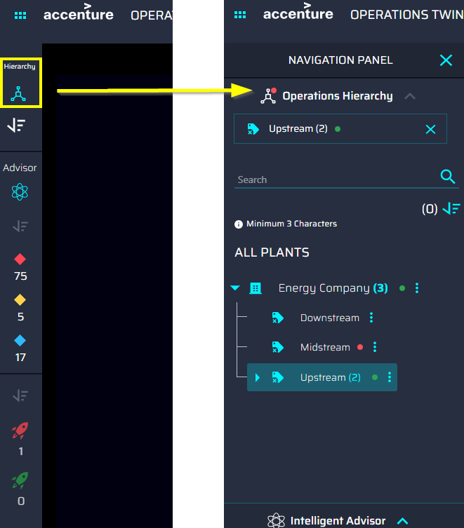

### 

## Entity Viewer

The Entity Viewer component can be accessed in two different ways: the 6-dot menu expands to show the Overview and Operations Hierarchy.

1.  The Overview option launches the overview page, which displays tiles for every AOT component. Clicking the Operations Hierarchy tile (3) launches the Entity Viewer page.

2.  The Operations Hierarchy option directly leads to the Entity Viewer Configuration page.

The Entity Viewer is discussed further in the [Entity Viewer Interface](#entity-viewer-interface) section.

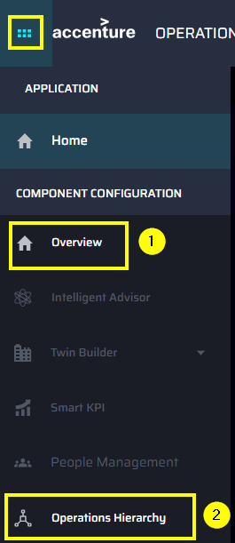

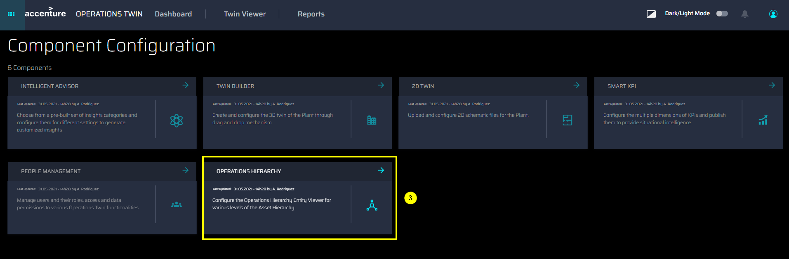

## 

# Operations Hierarchy Interface

### Structure and Status

As shown on the right, the tree structure view includes the following details:

1.  Parent asset name with the count of subsequent child assets.

2.  The arrow controls for expansion and collapse of the tree structure.

3.  Child asset name with the count of subsequent child assets.

4.  An icon indicating the type of asset. See the table far right.

5.  Status of the asset. If an asset has any of the conditions listed below, then a colored dot appears next to the name of the asset.

-   The related KPI has an RAG status of red, amber, or green.

-   The related Insight is of high or medium priority.

-   RAG status gets refreshed based on the asset Id\'s associated with the events received within specific time intervals (can be set in Azure Pipeline library)

> The status indicator is also shown in the SELECTED ITEMS pane when an affected asset is selected.
>
> Note: If there are no insights/KPIs on that asset, then no color dot is displayed.

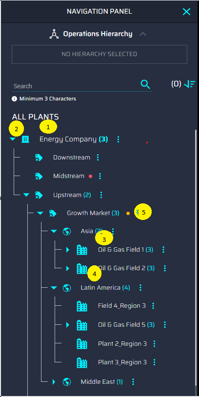

| **Icon** | **Asset** |
| --- | --- |
| 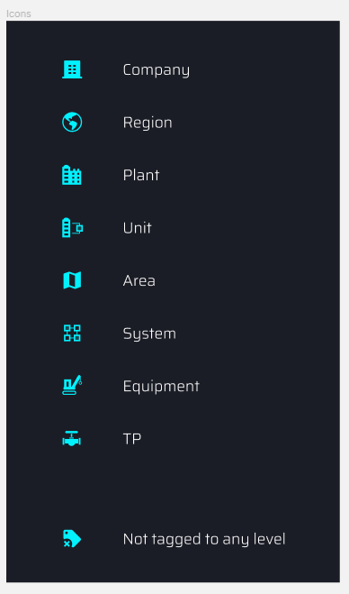
| Company |
| 
| Region |
| 
| Plant |
| 
| Unit |
| 
| Area |
| 
| System |
| 
| Equipment |
| 
| Instrument |
| 
| Not Tagged to any Level |

## 

# 

### Search

Entering at least three characters into the search bar returns a list of the ten closest matches to the query. For retrieving the results beyond the top ten search results, the user will have to refine the search using the Filter option.

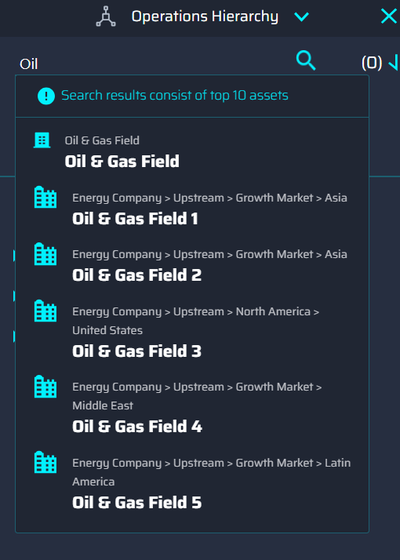

###  Filter

1.  Clicking the icon expands the \'filters\' pane.

2.  Multiple options can be selected at once.

3.  Clicking the APPLY button adds the selections to the Active Filters list.

4.  Filters may be cleared one at a time from the Active Filters list.

5.  Clicking the CLEAR button removes all the filters.

> 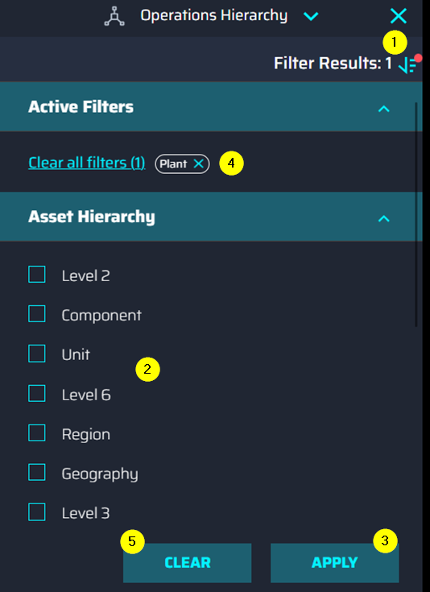

### Selection

Clicking on any asset selects it. The numbered list below corresponds with the callouts on the screenshot on the right.

1.  The selected asset is shown under the selected items list with the count of child assets. The selection will be highlighted in the tree view.

2.  Clicking the 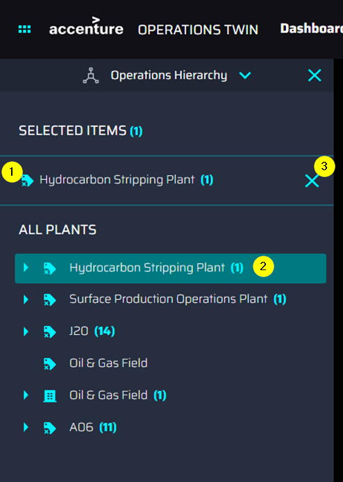
icon deselects the asset, removing it from the Selected Items list and clearing the highlight.

3.  By clicking on the arrow, the asset can be expanded to view child items.

4.  Clicking the vertical ellipsis menu on any of the entities presents a popup with the option to view details and pin the item.

    -   Clicking the Details link opens the Entity Viewer UI for the selected asset on the right side of the OH panel.

    -   The Pin Item function is planned for a future release.

5.  The Load More option allows the user to view more child items block by block if available.

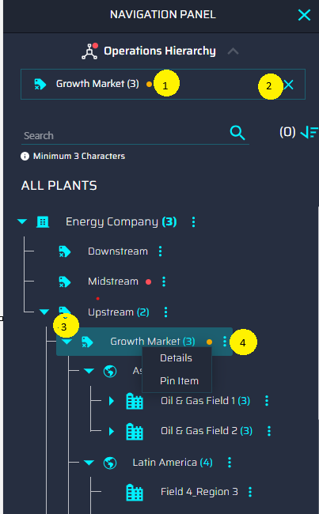

## Entity Viewer Interface

The Entity Viewer visualizes the configuration information provided by the user through a config template. The interface is customizable, and the content displayed depends on the configurations provided by the user in the template. The points below list the features of the Entity Viewer Template Upload screen that are highlighted in the screenshot below

1.  

2.  **Mult-Plant/Plant-level dropdown** - Dropdown selection for Multi-Plant/Plant options. By default, the Multi-Plant option is selected after loading the app.

3.  **Asset Hierarchical level dropdown** - Dropdown selection for Asset Hierarchical Level options based on the selected option on the Multi-Plant/Plant level dropdown. One of the options must be chosen if Multi-Plant was chosen in step one.

4.  **Upload Template** - Calls a pop-up window depending on these two scenarios.

    a.  If only the first dropdown has a selected option, this button will launch a pop-up window that has a note saying the user should select an option in the Asset Hierarchical level dropdown.

    b.  If two dropdowns have selected options, this button will launch a pop-up window used to upload the configuration template file.

        Note that the template file that will be uploaded should have the name format as follows:

> *EntityViewer\_(Selected option in Multi-Plant/Plant Dropdown)\_(Selected option in Asset Hierarchical Level Dropdown).*

5.  **Download Template** - This feature downloads templates from the selected option.

    a.  If the user only selects an option from the Multi-Plant/Plant dropdown, it will download all available latest templates of Asset Hierarchical Level under the selected option.

    b.  If the user selects an option on both dropdowns, it will download the latest template from the specific selected options. If the selected option does not have any available template uploaded, it will automatically download the Unconfigured Template file.

6.  **Templates table** -- The Templates table displays the following information:

    a.  The total number of templates is shown at the top of the table.

    b.  The header row shows the fields of the template (Asset hierarchy level, Version, Created on, Updated on, Plant, Created by, Updated by).

    c.  If ten or more templates have been uploaded, then the arrows on the right can be used to navigate between pages.

    d.  The templates can be sorted based on the columns by clicking on the arrows.

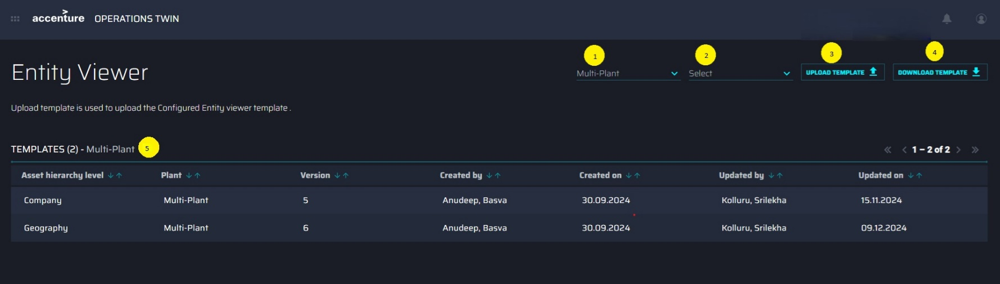

### Entity Viewer Configuration

To configure the Entity Viewer UI, a configuration template must be uploaded by the user. This is done via the Entity Viewer Template Upload screen, which can be accessed by clicking on Operations Hierarchy in the side menu. Clicking the Upload Template button on the Entity Viewer page launches a pop-up window used to upload the [configuration template file](https://ts.accenture.com/:x:/r/sites/GlobalDocTemplates/Published%20Documents/AOT/Linked%20Files/AOT_OH_Entity_Viewer_Template_Configuration.xlsx?d=wcf5564a3de4a4ef3821cee56cfcbf659&amp;csf=1&amp;web=1&amp;e=TsHsze) to the Entity Viewer.

The user may drag and drop files or browse to select the file to upload.

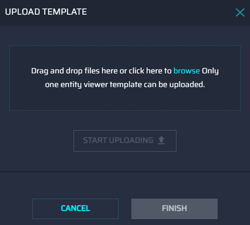

Once a valid file has been specified, the *START UPLOADING* button is enabled.

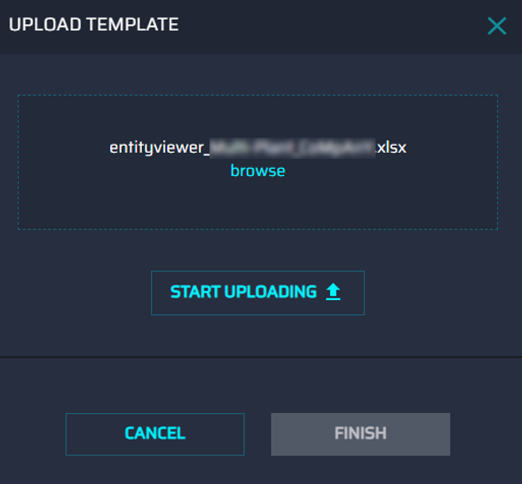

As soon as the upload starts, the progress is displayed at the bottom. Upload time is proportional to the file size but is typically a couple of seconds.

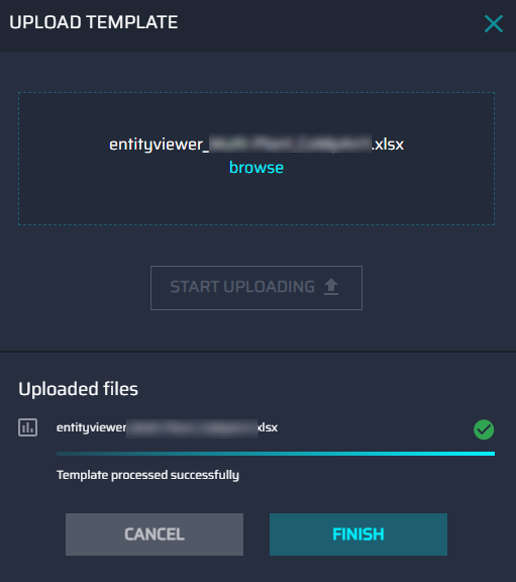

-   Only one file can be uploaded at a time.

-   Only files with .xlsx, .xlsm, and .csv extensions are supported.

-   If the file name format is not the same as the standard naming for a template, then an error is displayed that includes an example of the correct file naming.

-   If the file is found to have invalid configurations, then an error is displayed that includes a description of the error and the row in which the error was found.

## 

## Sample Configuration

The video on the side shows an example of the Entity Viewer details page with the GENERAL and WORKORDERS tabs configured.

-   The *GENERAL* tab displays details about the general info, metadata, and related insights.

-   The *WORKORDERS* tab displays the description of the WorkOrders, WorkOrders history, and a pie chart visualization of Control Maintenance versus Predictive Maintenance.

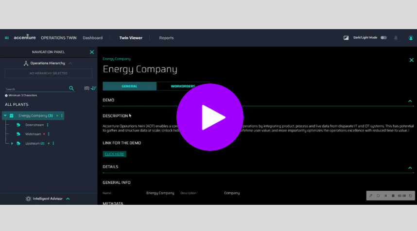

[VIDEO LINK](https://greetings.accenture.com/watch/NkAx684eQgpZhPp9xZAyzR?)
