

Accenture Operations Twin

SAP PM Asset Hierarchy Extractor

DEPLOYMENT GUIDE

## 
Release Version: 2.5 \{#release-version-2.5 .TOC-Heading\}

**Metadata Table**

| **Field** | **Value** |
| --- | --- |
| **Asset / Solution Name** | Accenture Operations Twin / Data Integration Accelerators |
| **Domain / Area** | Data Processing / Extractors |
| **Owner (Team/Person)** | Tournier, Florian |
| **Reviewers** | Joshi, Rishabh |
| **Status** | Completed / Published |
| **Confidentiality** | Internal / Confidential |
| **Source of Truth** | [Summary - Overview](https://dev.azure.com/DigitalPlantProject/Marilyn%20V) |
| **Related Assets / Alternatives** | AOT Extractors Architecture Blueprint, AOT Extractors Getting tarted |

## Introduction

Accenture Operations Twin (AOT) is a collection of software accelerators and tools, including extractors, that are assembled to deliver client solutions. AOT accelerates the integration of the product, process, and live data from disparate IT and OT systems, creating a comprehensive and contextualized view of operations to enable better decisions and optimized processes.

AOT extractors are data integration accelerators that are developed to automate and ease the process of extracting data from enterprise source systems and moving it to CDF RAW. The SAP PM Asset Hierarchy Extractor gives users the power to send SAP data to CDF without having to manually run commands. Once the configuration file is built, the extractor can refer to the Root Functional Location, extract the asset hierarchy from SAP PM, and push that data to CDF RAW.

The SAP PM extractor grants a user the flexibility to configure one or more source systems as well as the Cognite details that enable data extraction. After the data is extracted, it is processed and transformed into a format that Cognite recognizes. Finally, the processed and transformed data is pushed to CDF RAW.

### Purpose

This document explains how to extract data from the source and load it into CDF RAW. It covers prerequisites, configuration, and deployment steps for the Extractor in both cloud and on-premises environments. After reading, developers will know how to set up, run, and verify data flow from the source system to CDF.

### Target Audience

This guide is designed for use by developers with the following skills:

-   Sonar Qube

-   Cognite Data Fusion

-   SAP PM

### Contacts

-   [rishabh.b.joshi@accenture.com](mailto:rishabh.b.joshi@accenture.com)

-   [hanuman.prasad.gali@accenture.com](mailto:hanuman.prasad.gali@accenture.com)

### Related Links

-   [How to create OData Service](https://blogs.sap.com/2019/10/07/creation-of-odata-services-for-beginners/)

-   [Release Notes](https://industryxdevhub.accenture.com/assetdetails/45)

### Glossary

| Term | Definition |
| --- | --- |
| SAP PM | Systems, Applications, and Products in Data Processing -- Plant Maintenance module, used for managing maintenance activities and processes in an organization. |
| CDF RAW | Cognite Data Fusion RAW layer, a staging area for raw extracted data before processing or transformation. |
| Extractor | A tool or program used to retrieve data from a source system for further processing or loading into another system. |
| Function Module | A reusable set of code in SAP that can be invoked by other programs to perform specific tasks, with defined input and output parameters. |
| Open Data Protocol (OData) | A standard protocol for building and consuming RESTful APIs, enabling data access and manipulation over the web. |
| Transport and Package | Mechanisms in SAP for bundling and moving development objects between systems (e.g., from development to production). |
| t-code | Transaction code in SAP, a shortcut used to access specific application functions or screens directly. |

## SAP PM Configuration

SAP PM configuration includes the following deployment tasks:

-   Function Module

-   Open Data Protocol

-   Transport and Package

### Function Module

Subprograms that contain a set of reusable source code statements with importing and exporting parameters and exceptions.

#### Create Function Module 

1.  In SAP, use t-code \"se37\" to access the Function Builder.

2.  In the name field, enter the name of the function module, and then click Create.

3.  Choose the ZCOGNITE function group and enter a short text description.

4.  Click Save.

#### Create Structures and Tables 

1.  Enter t-code \"se11\".

2.  Select the Data Type Radio button and enter a new name for Structure and click Create.

3.  Select the Structure Radio Button and press Enter.

4.  Enter a Short Description and add the required fields in the rows for the structure and their description.

5.  Click on Save and open t-code \"se11\" for table creation.

6.  Select the Data Type Radio button and enter a new name for Structure and click Create.

7.  Select the Table Radio Button and press Enter.

8.  Enter a Short Description, Select the Line Type radio button, and enter the name of the structure created.

9.  Now add details like Primary Key, Secondary Key, Attributes, etc., if needed, and Click on Save.

10. Update Function ModuleUse t-code \"se37\" to access the function module.

11. In the name field, enter the name of the function module that you have created, and then click the Change button.

12. In the Tables tab, import the Table created in the above step by clicking on the Insert Row Button.

> 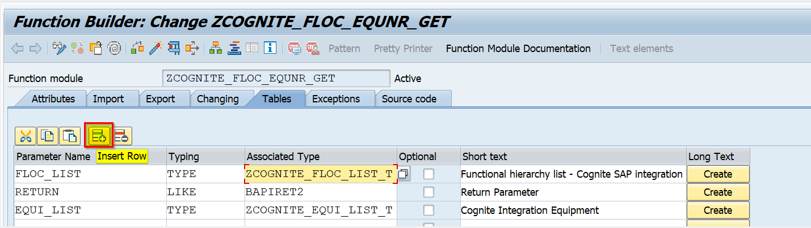
1.  

13. Edit the source code to suit the use case.

> 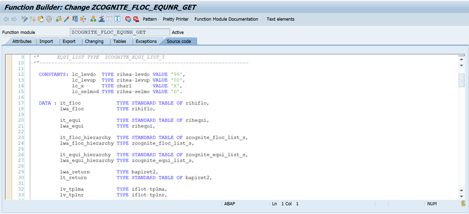
14. In the Import tab, enter any parameters (e.g. Root Functional Location) that will be needed during the execution of the function module.

> 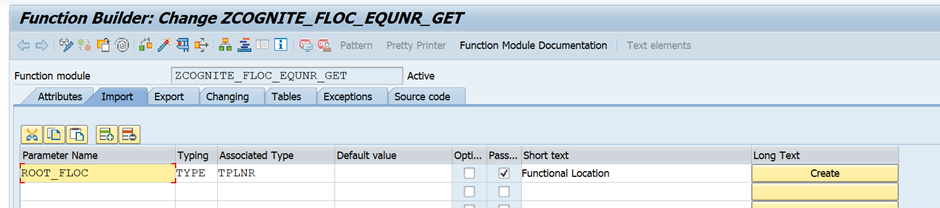
15. Execute the function model using F8 or the button highlighted in the screenshot below.

> 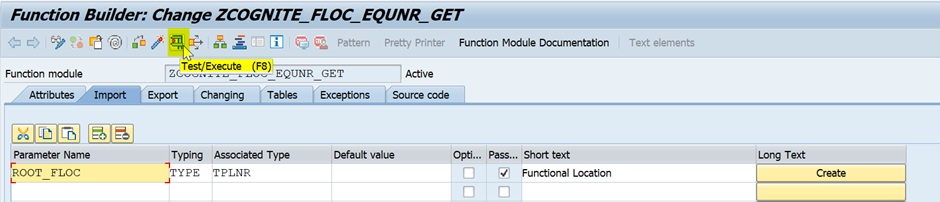
16. Enter the parameter and execute it using F8 or the button highlighted in the screenshot below.

> 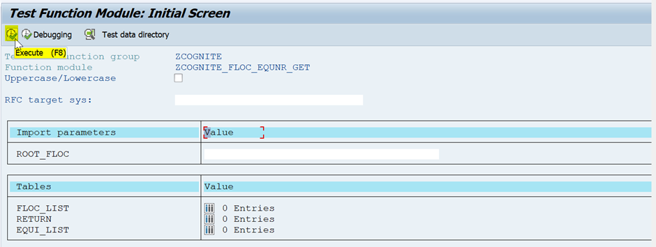
### 

## Open data protocol

OData is a Web protocol for querying and updating data, applying, and building on Web technologies such as HTTP, Atom Publishing Protocol (AtomPub), and RSS (Really Simple Syndication) to provide access to information from a variety of applications.

#### Create Open Data Protocol 

1.  Open the t-code \"SEGW\" and create a new project using the highlighted Create Project button.

> 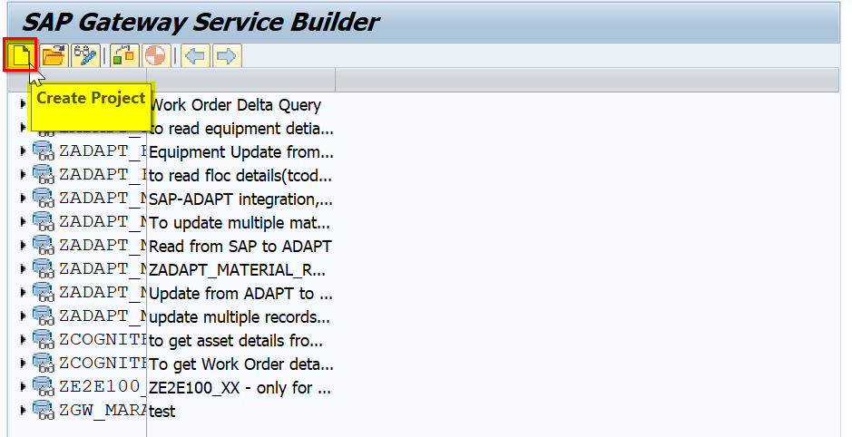
2.  Create a new Entity type and Entity sets using the Import option\&gt;DDIC structure by right-clicking on the Data Model.

> 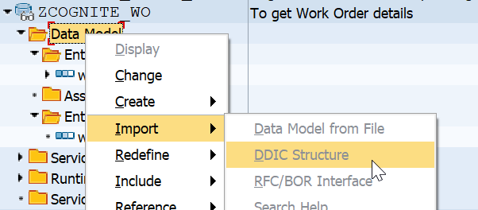
3.  Enter the name and the ABAP structure that was created during the creation of the function module.

> 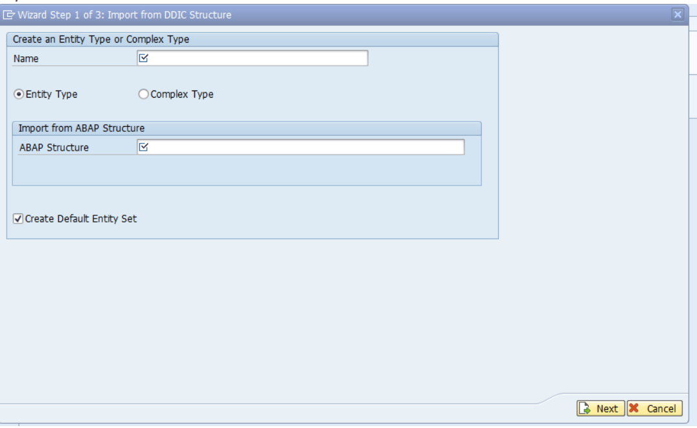
4.  After creation, it will look similar to the image below.

> 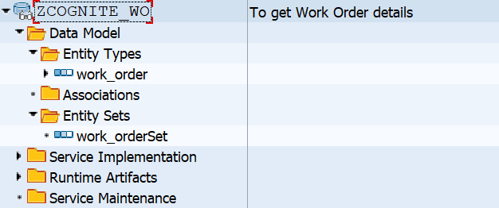
5.  

6.  Use the red and white Generate Runtime Object button to launch the Model and Service Definition window.

> 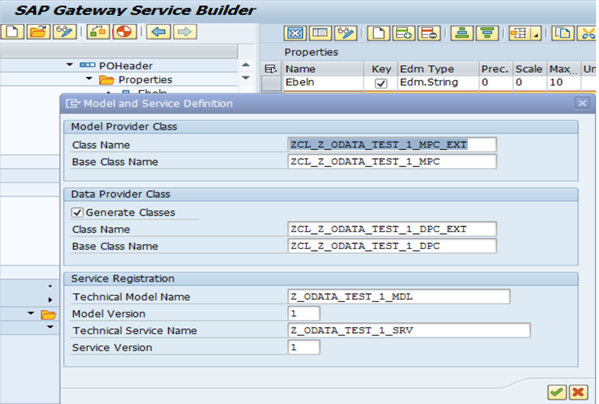

7.  Check for the successful creation of the service and model.

> 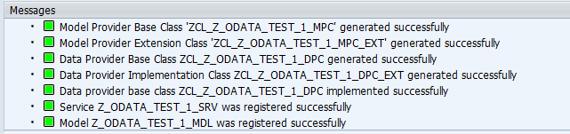
8.  Use the t-code \"IWFND/MAINT_SERVICE\" to activate and maintain the nodes.

> 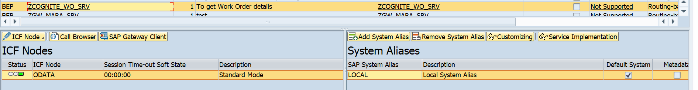
### 

## Transport and package

An SAP Transport is a kind of \'Container / Collection\' of changes that are made in the development system. It also records information regarding the type of change, the purpose of transport, the request category, and the target system.

#### Create Transport and Package 

A Workbench request and a package to carry the TADIR objects are required to transport any OData service.

1.  Use the t-code \"SE01\" to open the Transport Organizer window, click on Create, and select Workbench Request.

> 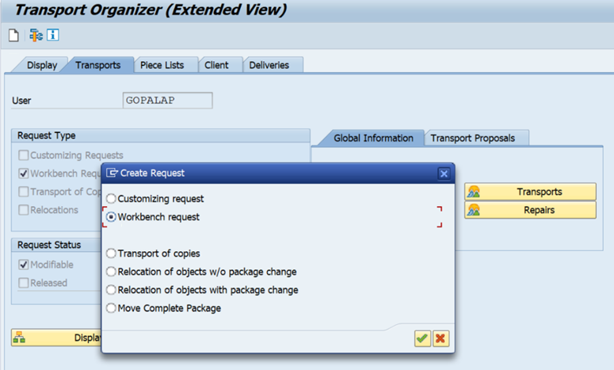

2.  Use the t-code \"SE80\" to create the package. Select the package from the dropdown list that is under Repository Browser. To create a package, enter the package name and click on the Display Icon.

> 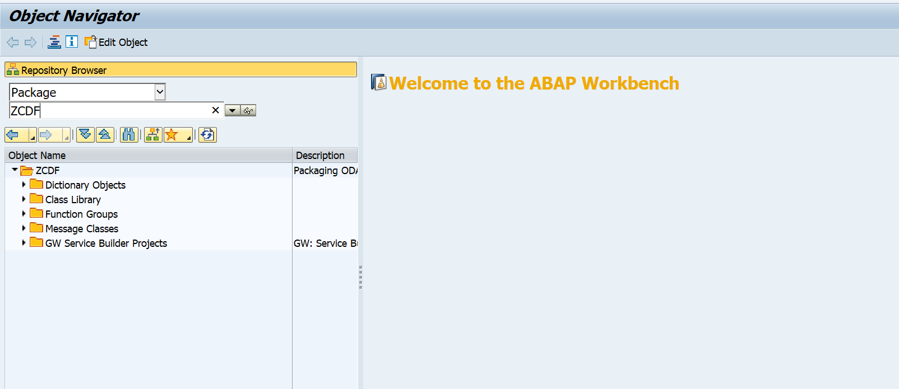
3.  

4.  To capture all the details, ADD the new ZCDF package into the previous transport while creating the new package. Standard OData Service TADIR Objects are listed in the table below.

| **Short Description** | **Program ID** **Object Type** **Object Name** |
| --- | --- |
| Package | R3TR DEVC Z\*\*\*\_PKG |
| SAP Gateway: Model Metadata | R3TR IWSG Z\\_SRV_0001 |
| SAP Gateway: Service Groups Metadata | R3TR IWOM Z\\_MDL_0001_BE |
| ICF Service | R3TR SICF \\*\*\*\*\*\*\* |
| 5. | While creating the SEGW project, add everything to the workbench request. The final package is now created. &gt; 
|  |
| 6. | Validate the final transport request once it is successfully created. &gt; 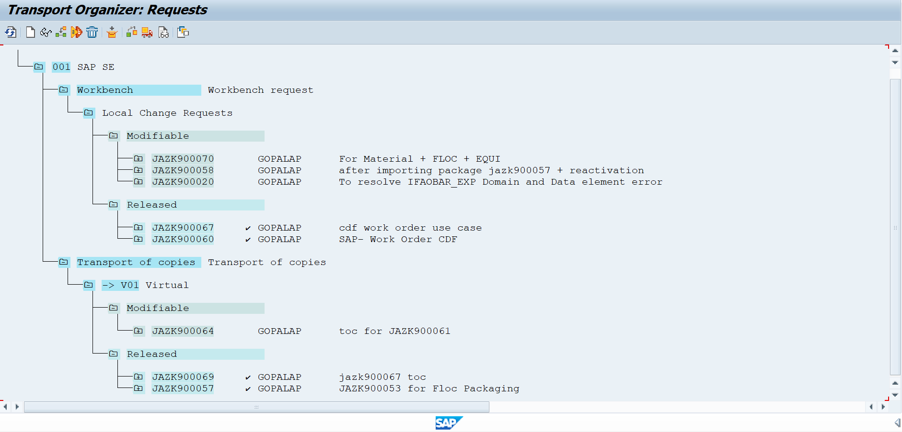
|  |

## 

# Cloud Deployment

Two pipelines are needed to deploy the extractor to an AKS Cluster. This section includes step-by-step guidance for:

-   Prerequisites that need to be fulfilled before the Extractor can be deployed and used.

-   Setting up the Azure DevOps environment.

-   Creating a Build Pipeline for Dockerizing the Extractor Package.

-   Creating a Release Pipeline for deploying the Docker image to the AKS cluster.

-   Validating in CDF RAW if the RAW table has the right data.

### Prerequisites 

-   [Lens](https://k8slens.dev/)

-   A cloud subscription with the following: 

    -   SAP PM ABAP resource to validate the Client environment to make necessary configuration changes.

    -   Azure license/subscription to create resources for implementation.

    -   Azure DevOps repository for extractor code and pipeline files.

    -   Azure service connections for SonarQube and Container Registry.

    -   Namespace in the AKS cluster for environments.

    -   Kubernetes Service Connection for AKS Cluster.

    -   Sonar project and key.

### Configure Azure DevOps

Before creating the pipelines, the Azure DevOps environment must be prepared.

1.  Create an Azure Key Vault.

2.  Add the following secrets in the Azure Key Vault created in the previous step:

| **Secret** | **Description** |
| --- | --- |
| ClientId | Provide the Client Id for Cognite Data Fusion |
| ClientSecret | Provide the Client Secret for Cognite Data Fusion |
| SapUserName | Provide the Sap Username to perform authentication with the SAP system |
| SapPassword | Provide the Sap Password to perform authentication with the SAP system |
| SapKey | Provide the sap key to perform authentication with the SAP system |
| 3. | Create a key vault library in Azure DevOps and add the secrets created in the previous step. &gt; 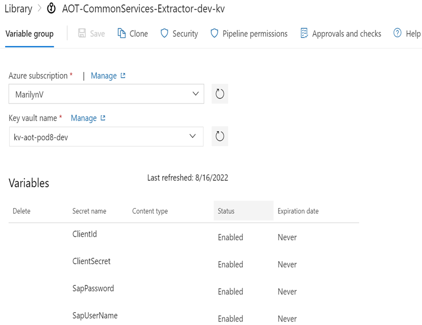
|  |
| 4. | Create a Library/Variable Group in Azure DevOps with the following parameters: |
| **Variable** | **Description** |
| COGNITE_HOST | Provide the host details for Cognite data fusion. |
| COGNITE_PROJECT | Provide the project name for Cognite data fusion. |
| SCOPES | Provide the scopes for Cognite data fusion. |
| TENANT_ID | Provide the tenant ID for Cognite data fusion. |
| SAP_PM_CONFIG_FILENAME | Provide the configuration filename that is used to run the extractor. The filenames are environment-specific e.g., sap_dev_config.yaml, sap_itest_config.yaml and sap_prod_config.yaml. |
| CONTAINER_REGISTRY_SERVICE_CONNECTION | Provide container registry service connection for build and release pipeline. |
| SONARQUBE_SERVICE_CONNECTION | Provide service connection for SonarQube |
| SAP_CLI_PROJECT_KEY | Provide SonarQube project key for SAP PM extractor. |
| SAP_CLI_PROJECT_NAME | Provide SonarQube project name for SAP PM extractor. |
| 5. | Navigate to the pipelines file location \"Source/Extractors/sap-extractor/pipeline/Dev/azure-pipelines.yml\" and ensure that the pipeline refers to the libraries created in the previous steps. &gt; 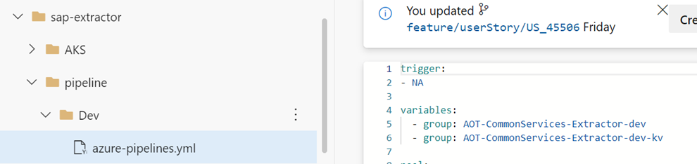
|  |
| 6. | Configure the following parameters in the configuration file for the SAP extractor: |
| - | Provide timer value in seconds to schedule the extractor. &gt; 
|  |
| - | Mandatory Cognite-related config parameters: |
| **Parameter** | **Description** |
| host | Use the hostname for Cognite data fusion (CDF) added in the Azure DevOps library in earlier steps |
| project | Use the project name for CDF added in the Azure DevOps library in earlier steps |
| idp-authentication. client-id | Use the client Id for CDF added in the Azure DevOps key vault library in earlier steps |
| idp-authentication. secret | Use the client secret for CDF added in the Azure DevOps key vault library in earlier steps |
| idp-authentication. scopes | Use the scopes for CDF added in the Azure DevOps library in earlier steps |
| idp-authentication. tenant | Use the tenant Id for CDF added in the Azure DevOps library in earlier steps &gt; 
|  |
| - | Mandatory SAP PM config parameters: |
| **Parameter** | **Description** |
| host | Provide a hostname for the SAP system |
| port | Provide a port number for the SAP system |
| endpoint | Provide an endpoint to connect to the SAP system |
| key | Use an SAP key to perform authentication with the SAP system added in the Azure DevOps library in the earlier steps |
| Key_column | Provide a unique column name present in the data |
| assets.destination.database | Provide a database name in CDF where the table would be created |
| assets.destination.table | Provide a table name where asset hierarchy data will be uploaded |
| full_load | Provide a Boolean value. When the full load is true, then full load functionality is executed. And when full load is false, then incremental load functionality is executed. |
| Change_date | Provide the date of the last run of the extractor. It will be used for incremental load functionality. |
| IMaintPlant | Provide a name for the maintenance plant from SAP |
| ITplnr | Provide a name of the Functional location from SAP |
| IFullLoad | Provide a full load value, this parameter is required for RFC |
| Extractor_Last_Run_Table | Provide an extractor last run table name that will be used in CDF RAW |
| Extractor_key | Provide an asset hierarchy type whose last run date is required that is stored in Extractor_Last Run table from CDF RAW |
| Log_Table | Provide a log table name that will be used in CDF RAW &gt; 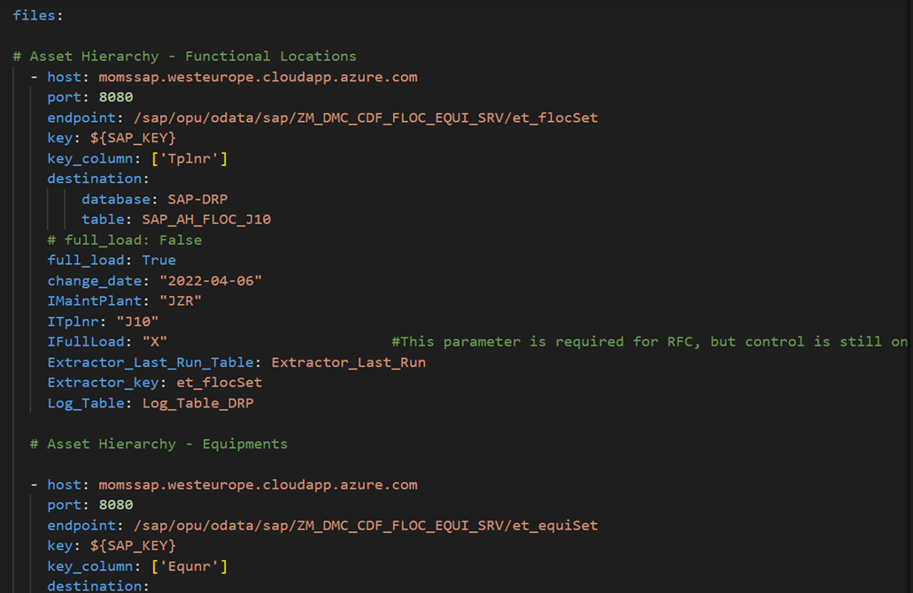
Note that the SAP PM Extractor allows the configuration of multiple SAP Systems. Also, multiple root asset details can be configured to fetch asset hierarchy data from the SAP systems. |
| - | Extraction pipeline-related config parameters: |
| **Parameter** | **Description** |
| datasetexternal_id | Provide the External id of the Dataset in Cognite data fusion (CDF) |
| dataset_name | Provide the name of the Dataset in CDF |
| external_id | Provide external id of CDF extraction pipeline |
| ep_name | Provide a name for the CDF extraction pipeline |
| contacts.name | Optional - Provide the name of the contact to whom the extraction pipeline notification should be sent. |
| contacts.email | Optional - Provide the email of the contact to whom the extraction pipeline notification should be sent. |
| contacts.sendnotification | Optional - Provide notification value. If the send notification value is true, then mail is sent to the respective mail Id else no mail is sent. &gt; 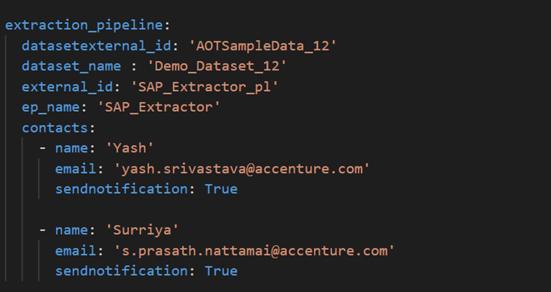
|  |

### Create a Build Pipeline

The Build Pipeline is used to Dockerize the Extractor Package. The artifacts created here are used in the release pipeline for deployment. To create a build pipeline, follow the below steps:

1.  Navigate to Azure DevOps, select pipelines, and then select New Pipeline.

2.  Select Azure Repos Git and then select the Repository Name that contains SAP Extractor code and pipeline files.

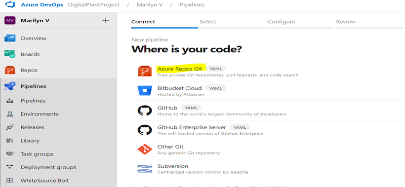

3.  Select \'Existing Azure Pipelines YAML file\'.

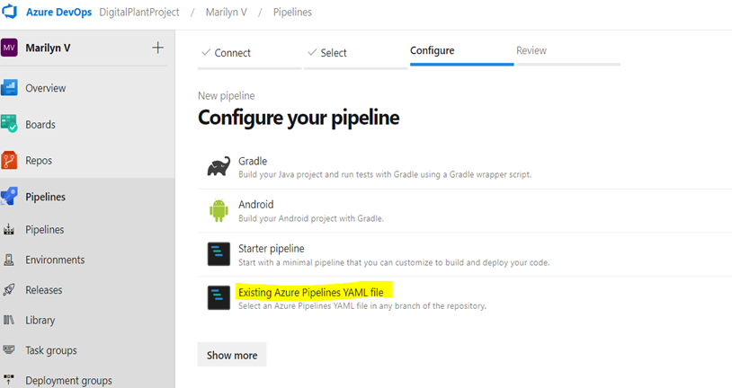

4.  

5.  Select the branch and provide the pipeline file path as \"Source/Extractors/sap-extractor/pipeline/Dev/azure-pipelines.yml\" and click on Continue.

> 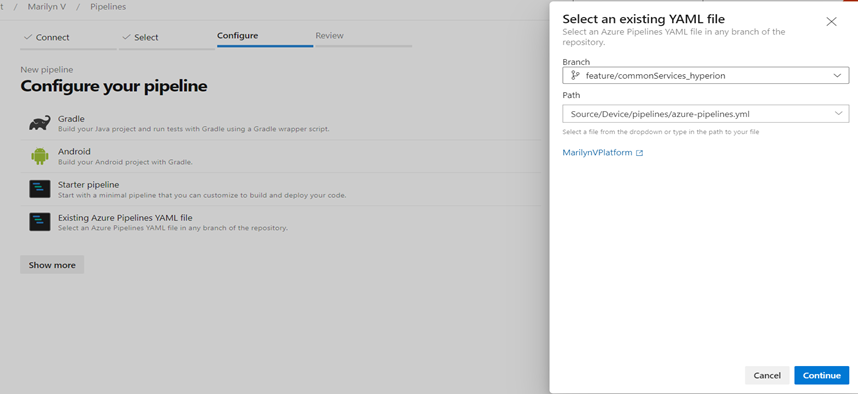
6.  Review and save.

7.  Run the pipeline and wait for its successful completion.

> 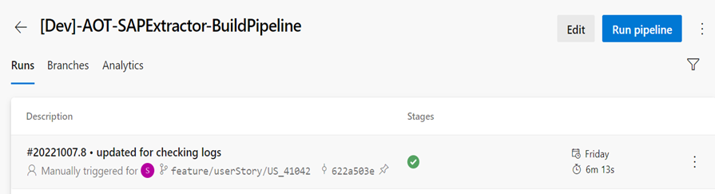
### 

## Create a Release Pipeline

The Release pipeline deploys the Docker Image of the SAP PM Extractor created by the build pipeline to the AKS Cluster. Follow the steps below to create the SAP PM Extractor release pipeline:

1.  Create a release pipeline with two tasks for AKS Cluster.

    -   task with delete command

    -   task with create command

2.  Update the value of the service connection for the AKS cluster in the tasks.

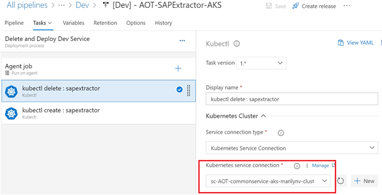

3.  Update the AKS file location in the tasks.

> 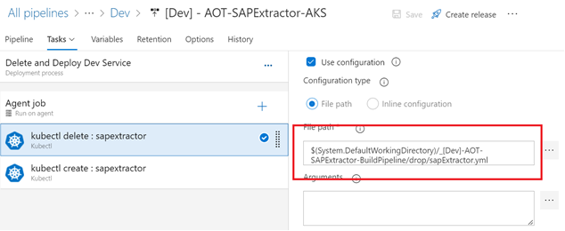
4.  If this is the first run, then disable the delete task from the pipeline.

> 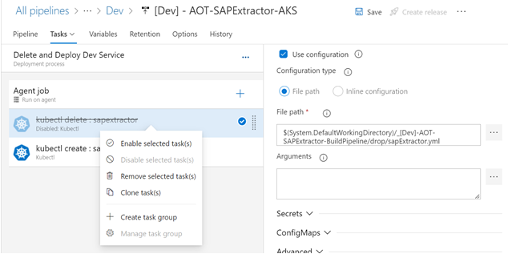
5.  

6.  Create a release from the release pipeline created in the previous step.

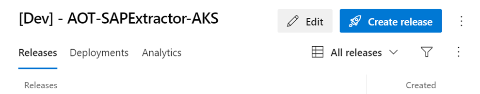

7.  Once the release is completed, confirm successful deployment on Azure DevOps.

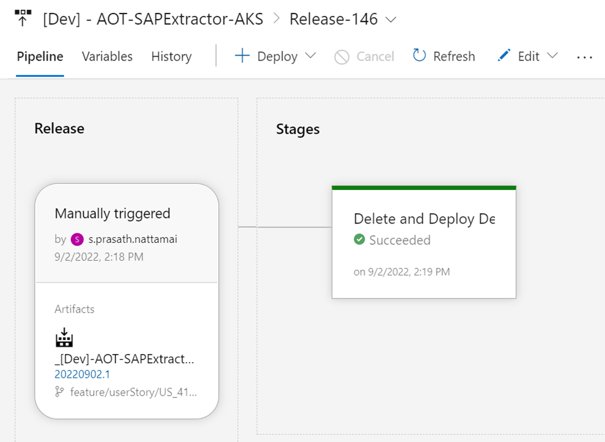

8.  After deployment is complete, validate the successful deployment to the AKS cluster in the Azure portal.

> 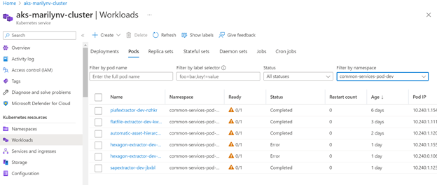
9.  Validate SAP PM Extractor logs on the [Lens](https://k8slens.dev/) app.

> 
10. If everything looks good and the AKS POD has been created, re-enable the delete task that was previously disabled.

> 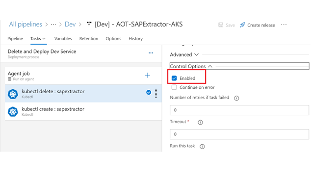
11. Validate the creation of the database and table with asset hierarchy data on CDF Portal.

> 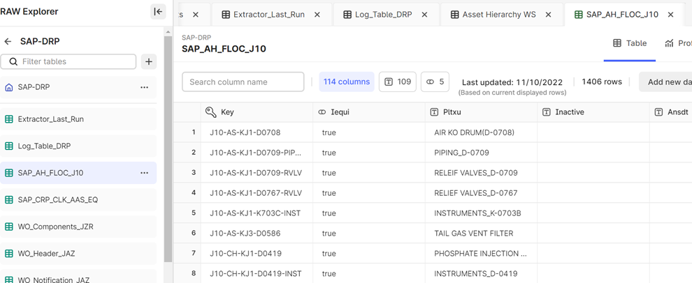
12. On Deployment Completion, an extraction pipeline is created in CDF based on the details provided in the configuration file. Success/Failure messages can be visualized on the CDF portal. Also, a notification is sent to the respective email address.

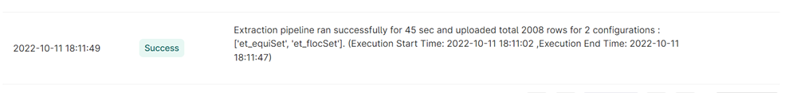

> 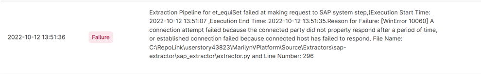
## 

# On-Prem Deployment

The SAP PM Extractor Windows Service is created to give users the option of deploying SAP PM Extractor on-premises. The SAP PM Extractor Windows service is installed through a batch script that runs all the necessary commands that are required for the installation. SAP PM Extractor extracts asset hierarchy data from one or more SAP systems and inserts it into CDF RAW.

### Prerequisites

-   SAP PM server username, password, and SAP key

-   Web API URL for each SAP PM asset hierarchy

-   Install Python

### Install the Extractor 

1.  Edit **sap_config.yaml** file to update the following:

-   Add the path of a log file to store extractor logs

> 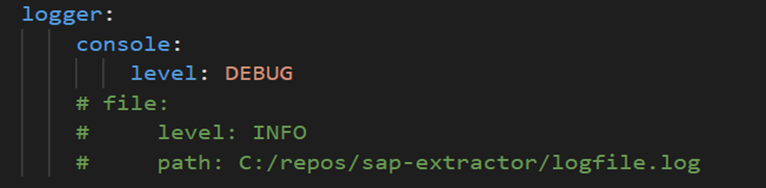
-   Add timer value in seconds to schedule the extractor

> 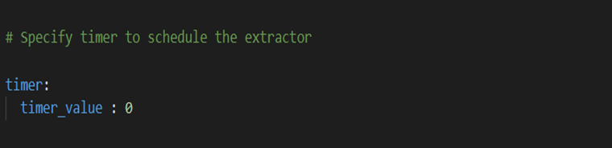
-   Add ALL Cognite-related details described in the table below.

| **Parameter** | **Description** |
| --- | --- |
| host | Provide the hostname for Cognite data fusion (CDF) |
| project | Provide the project name for CDF |
| idp-authentication. client-id | Provide the client Id for CDF |
| idp-authentication. secret | Provide the client secret for CDF |
| idp-authentication. scopes | Provide the scopes for CDF |
| idp-authentication. tenant | Provide the tenant Id for CDF |
| - | Add extraction pipeline-related details. |
| **Parameter** | **Description** |
| datasetexternal_id | Provide the external Id of the dataset in CDF. |
| dataset_name | Provide the name of the dataset in CDF. |
| external_id | Provide external Id of CDF extraction pipeline. |
| ep_name | Provide the name of the CDF extraction pipeline. |
| contacts.name | Optionally, provide the name of the contact to whom the extraction pipeline notification should be sent. |
| contacts.email | Optionally, provide the email of the contact to whom the extraction pipeline notification should be sent. |
| contacts.sendnotification | Optionally, provide notification value. If the send notification value is true, then mail is sent to the respective mail Id else no mail is sent. |
| - | Add ALL SAP PM system configurations |
| **Parameter** | **Description** |
| host | Provide a hostname for the SAP system. |
| port | Provide a port number for the SAP system. |
| endpoint | Provide an endpoint to connect to the SAP system. |
| key | Provide an SAP key to perform authentication with the SAP system added in the Azure DevOps library in earlier steps. |
| Key_column | Provide a unique column name present in the data. |
| assets.destination.database | Provide a database name in CDF where the table would be created. |
| assets.destination.table | Provide a table name where asset hierarchy data will be uploaded. |
| full_load | Provide a Boolean value. When the full load is true, then full load functionality is executed. And when full load is false, then incremental load functionality is executed. |
| Change_date | Provide the date of the last run of the extractor. It will be used for incremental load functionality |
| IMaintPlant | Provide the name of the maintenance plant from SAP. |
| ITplnr | Provide a name of the Functional location from SAP. |
| IFullLoad | Provide a full load value, this parameter is required for RFC. |
| Extractor_Last_Run_Table | Provide an extractor last run table name that will be used in CDF RAW. |
| Extractor_key | Provide an asset hierarchy type whose last run date is required that is stored in Extractor_Last Run table from CDF RAW. |
| Log_Table | Provide a log table name that will be used in CDF RAW. |
| 2. | Edit the WSInstallation.bat file to add the absolute path of the Python folder and SAPWindowsService.py file as shown below. &gt; 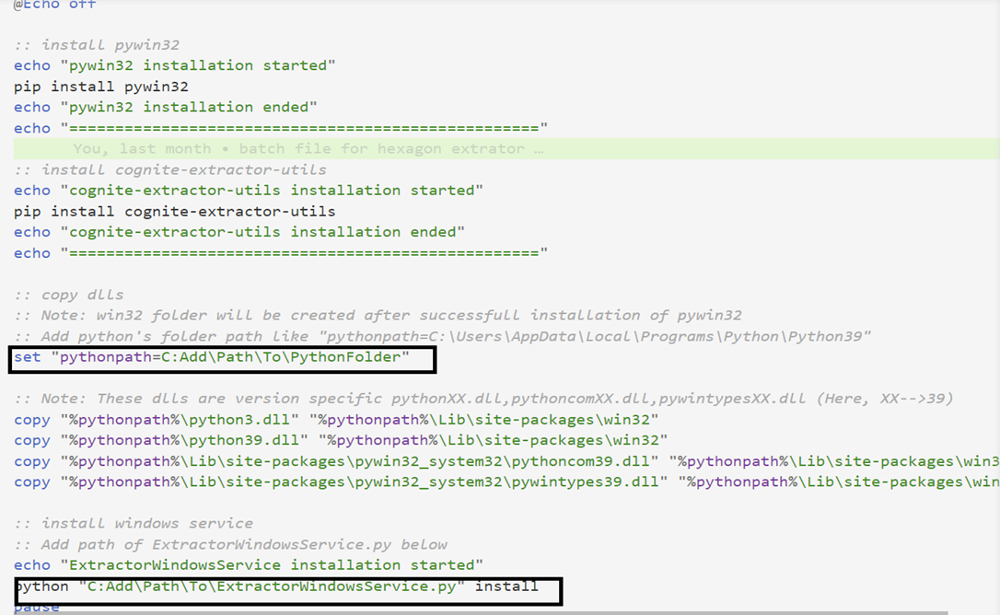
3. |
| 4. | To install the SAP Extractor on the premise, right-click on the WSInstallation.bat file and select Run as Administrator. It will install all the required Python modules and SAP extractor as a windows service. &gt; 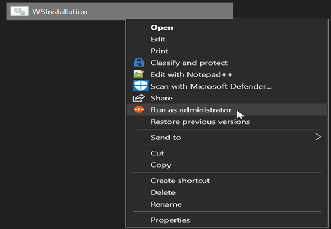
|  |
| 5. | Verify the following libraries are installed correctly in the system. |
| - | pywin32 module |
| - | cognite-extractor-utils module |
| - | pythonX.dll |
| - | pythonXX.dll |
| - | pythoncomXX.dll |
| - | pywintypesXX.dll &gt; 
|  |

### Start the Extractor 

1.  Click the Start button, search for \"Services\", and select Run as Administrator.

> 
2.  Search for the \"SAPExtractor\" service name, right-click on it, and select Start.

> 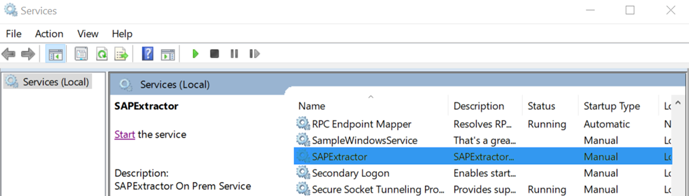
3.  Once the SAPExtractor starts running, check the logs in the log file on the given path in the configuration file.

4.  Validate the creation of the database and tables with asset hierarchy data on the CDF portal.

> 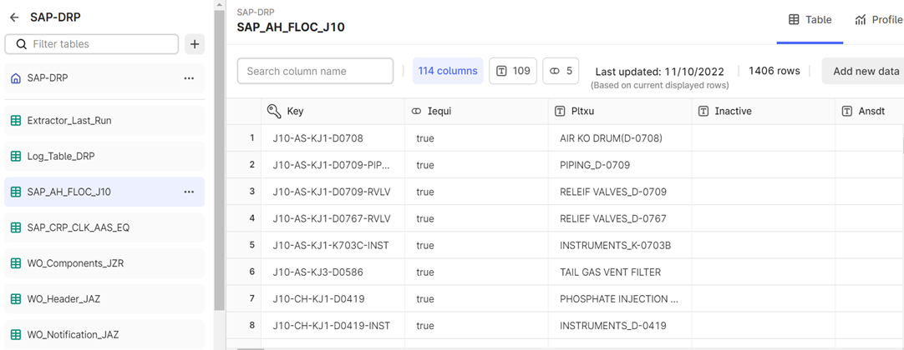
5.  Validate the creation of the extraction pipeline with a success message on the CDF portal.

> 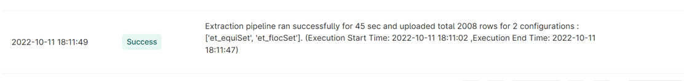
### 

## Stop the Extractor 

1.  Click the Start button, search for \"Services\", and select Run as Administrator.

> 
2.  Search for the \"SAPExtractor\" service name, right-click on it, and select Stop.

> 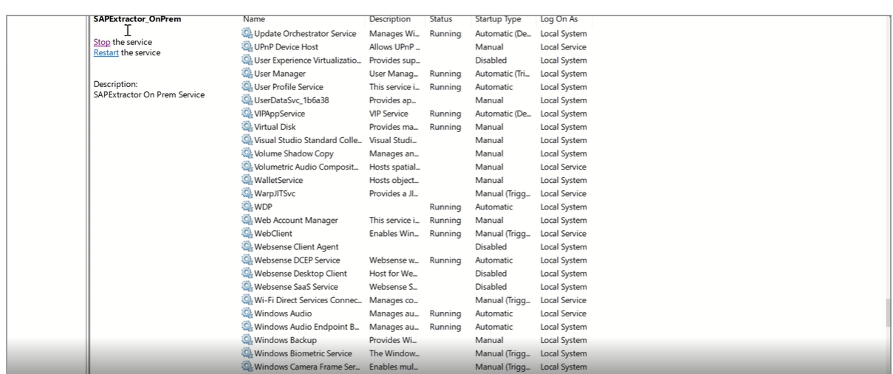
