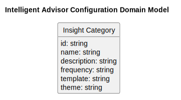
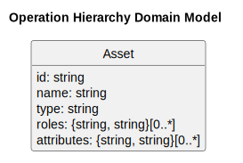
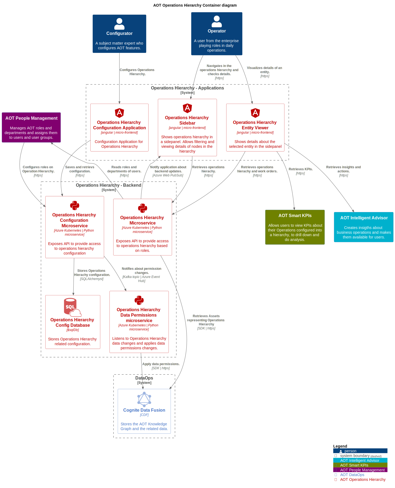

Industrial AI Foundation

General Architecture

OVERVIEW

Release Version: 2.5

**Metadata Table**

| **Field** | **Value** |
| --- | --- |
| **Asset / Solution Name** | Industrial AI Foundation / IAI |
| **Domain / Area** | Digital Twin / Architecture |
| **Owner (Team/Person)** | Tournier, Florian |
| **Reviewers** | Susarla, Aditya, Takó, István |
| **Status** | Draft / In Progress |
| **Confidentiality** | Internal / Confidential |
| **Source of Truth** | [[Summary - Overview]](https://dev.azure.com/DigitalPlantProject/Marilyn%20V) **Related Assets / Alternatives** |

## 

## Introduction

Industrial AI Foundation (IAI) is a collection of software accelerators and tools that can be assembled to deliver client solutions. IAI accelerates the integration of product, process, and live data from disparate IT and OT systems, creating a comprehensive and contextualized view of operations to enable better decisions and optimized processes.

### Purpose

The purpose of this document is to provide an overview of IAI's architecture. After reading, the target audience should understand the overall architecture of the system and the technical implementation of its modules.

### Target Audience

Software architects, developers, and integrators with IT background, familiarity with a digital twin, data ingestion, data contextualization, knowledge graph, advanced analytics, artificial intelligence, Cognite, and Azure services and artifacts.

### Prerequisites

Familiarity with Cognite Data Fusion (CDF)

### Contacts

-   [istvan.tako@accenture.com](mailto:istvan.tako@accenture.com)

-   [janos.puskas@accenture.com](mailto:janos.puskas@accenture.com)

### Related Links

-   [IAI Documents](https://industryxdevhub.accenture.com/asset-home;search_text=AOT) 

-   [Release Notes](https://industryxdevhub.accenture.com/assetdetails/45) 

-   [Official CDF Documentation](https://docs.cognite.com/cdf/)

-   [IAI Twin Builder and Twin Viewer Architecture Blueprint](https://industryxdevhub.accenture.com/assetdetails/47)

-   [IAI_People Management_Context Diagram](https://ts.accenture.com/:u:/r/sites/GlobalDocTemplates/Published%20Documents/AOT/Linked%20Files/AOT_People%20Management_Context.svg?csf=1&amp;web=1&amp;e=jiA5Ip)

-   [IAI People Management Architecture Blueprint](https://industryxdevhub.accenture.com/assetdetails/64)

### 

## Glossary

| **Term** | **Description** |
| --- | --- |
| Ingestion | Consuming data taken from external systems and storing it in the central data model of the DataOps platform |
| Data model | The data model is the central point of the DataOps platform on which IAI features are built and executed. It is optimized for modeling operations data and creating a knowledge graph. |
| Contextualization | Contextualization means creating relationships between entities inside the Knowledge Graph, this way giving a more complete context to each entity (data entry). The more complete the knowledge graph becomes the more possibilities for finding patterns and gaining knowledge will be. A trivial example would be measurements stored in a timeseries linked to an asset, representing a piece of equipment, on which the measurements were performed. |
| Business Logic | The business logic can appear in several forms inside IAI, including Insight generator data analytics models and KPI value calculation functions. The logic can involve advanced analytics, AI, ML, or conventional business logic to consume and manipulate the knowledge graph. |
| APIs | Exposes data and business logic toward the external world. |
| Applications | Business applications, reports, and dashboards are implemented on top of the business logic and knowledge graph of the solution. |

## Structure

As illustrated right, IAI can be simplified into the following building blocks:

1.  Data is provided by external systems. These can be all the existing IT and OT systems within a business.

2.  The provided data is brought into IAI by extracting, transforming, and loading it. The raw data is transformed and brought together in one coherent domain model.

3.  The contextualization layer facilitates a fast and scalable contextualization of data. Relationships between discrete data elements coming from siloed data sources need to be built and stored to make possible logical navigation and reasoning, hence transforming the data into knowledge.

4.  The contextualized data is stored and provided as a knowledge graph. The knowledge graph is also the domain model of the business.

5.  Applications and advanced analytics models live on top of the knowledge graph. The individual applications are interoperating with other business applications via the application integration layer. This involves collaboration between the IAI applications but also with external applications.

6.  IAI provides a People Management module.

7.  At any point in time where data is generated and/or exchanged stream analytics possibility is provided.

![Diagram showing the architecture of Accenture Operations Twin (AOT) system. At the bottom, external data sources feed into ETL (Extract, Transform, Load) processes, followed by a contextualization layer. Above this is the AOT Knowledge Graph, which connects to multiple components: Smart KPIs, Intelligent Advisor, Operations Hierarchy, 3D Visualizer, advanced analytics models, applications, and People Management. At the top is an application integration layer. A vertical stream analytics section runs along the left side, indicating real-time data processing. Arrows show bidirectional data flow between layers and components.](./media/IAI_Architecture_General/image2.png)

## 

# Enterprise Landscape

The diagram below shows how IAI is integrated into the customer\'s ecosystem. Click the image to enlarge it.

![Diagram titled \'AOT System Landscape\' showing components and interactions within the Accenture Operations Twin (AOT) ecosystem. On the left, roles include Configurator, Operator, and System Administrator linked to Identity Provider. The center section, labeled \'Operations Twin Features,\' contains interconnected modules: AOT Platform Tools, AOT 3D Visualizer, AOT Smart KPIs, AOT Intelligent Advisor, AOT Operations Hierarchy, AOT Reporting, AOT People Management, and AOT DataOps. Arrows indicate data and message flows between these modules and external systems on the right, including Integrated Systems and Source Systems. The diagram highlights how insights, KPIs, and operational data are managed and exchanged across the AOT platform.](./media/IAI_Architecture_General/image6.svg)

-   IAI DataOps realizes the data ingestion, contextualization, and hosting of the IAI Knowledge Graph.

-   Operations Twin features (Smart KPIs, Intelligent Advisor, Operations Hierarchy, 3D Visualizer, Reporting) are the sub-systems of IAI that make building Business Applications possible.

-   PM and Platform Tools are hosting cross-cutting, auxiliary features used by the Operations Twin features (People and Permission Management, Job Scheduling, Integration patterns with external systems, Localization and Internationalization, Integration of Data Analytics Models)

-   IAI integrates with the Source system to ingest data, with other business applications to collaborate, and with Data Analytics services.

## 

# Components and Services

The diagram below shows how IAI systems are realized on top of Azure services.

![Diagram showing the architecture of an AOT (Accenture Operations Twin) system across multiple layers: Sources, On-prem/On-edge/On-cloud/SaaS, CDF Backend, Azure Backend, and Applications. The flow begins with simulators and external systems feeding data into cognitive extractors and various connectors (SAP PM, language platforms, machine builders). The CDF Backend includes a CDF Data Model, transformations, and contextualization via entity matching pipelines. Data then moves to the Azure Backend for machine learning training and execution, with a message broker handling communication. The backend connects to Kubernetes services and applications such as AOT App, which includes modules like Smart KPI, Intelligent Advisor, 3D Visualizer, Operations Hierarchy, People Management, and Reporting. Arrows indicate data flow and interactions, with a security layer and CI/CD pipeline spanning the bottom. A legend at the bottom color-codes components like Smart KPIs, DataOps, Intelligent Advisor, 3D Visualization, Operations Hierarchy, People Management, Reporting, and Platform Tools.](./media/IAI_Architecture_General/image8.svg)

-   Real-time data to be integrated via an arbitrary edge component and middleware into an IoT Hub instance. From here we channel the data into stream analytics for eventual analytics jobs to process it. Finally, it flows into the Knowledge graph, more precisely into ADX and wherever such an update is needed into ADT as well.

-   The stream analytics component provides us the possibility to identify outstanding data points near-real time and to generate events into the Event Hub (Message Broker) whenever needed.

-   Batch data to be integrated via Data Factory. Assuming that there will be some sort of edge environment the Data Factory Integration runtime would be deployed there.

-   The Knowledge Graph in case of Azure will be composed of multiple services. ADT is the central piece keeping the connection and context between the objects of the system. ADX is primarily responsible for timeseries data, events, and records. ADLS will host the nonstructured data, while SQL Databases will hold configuration and master data.

-   On Azure the primary Machine Learning model execution environment is Azure ML Ops. These are the services that we are leveraging for teaching a model, deploying to cloud execution and on Edge execution and execute on top of the Knowledge Graph or the live data stream.

-   The microservices responsible for the business logic are impacted only on data access layer level. The executed business logic does not depend on the underlying DataOps platform.

The subsystems shown above are described in the sections that follow.

## DataOps

The DataOps system of IAI ingests data from various source systems and stores in a knowledge graph to maintain the Operations Twin. Furthermore, it contains the infrastructure and tooling for contextualization as well.

IAI sub-systems including Smart KPIs, Intelligent Advisor, 3D Visualizer, and Operations Hierarchy can use this knowledge graph to perform their operations.

| **Principle** | **Description** |
| --- | --- |
| Data Integration | &gt; DataOps platforms facilitate the seamless integration of data from various sources, including databases, APIs, cloud services, and more. They often provide connectors and ETL (Extract, Transform, Load) capabilities to ensure data flows smoothly. |
| Data Quality and Governance | &gt; These platforms enforce data quality standards and governance policies, ensuring that data is accurate, consistent, and compliant with regulations. They may include data profiling, cleansing, and validation tools. |
| Automation | &gt; Automation is a central component of DataOps. Platforms automate repetitive tasks such as data ingestion, transformation, and deployment, reducing manual effort and minimizing errors. |
| Collaboration | &gt; DataOps emphasizes collaboration between different teams, including data engineers, data scientists, analysts, and business stakeholders. DataOps platforms provide features for sharing and collaborating on data-related projects. |
| Version Control | &gt; Like software development, DataOps platforms often incorporate version control systems to track changes in data pipelines, making it easier to manage and roll back to previous versions when needed. |
| Monitoring and Logging | &gt; Comprehensive monitoring and logging capabilities help track the performance of data pipelines, detect anomalies, and troubleshoot issues in real time. |
| Scalability and Flexibility | &gt; DataOps platforms are designed to scale with growing data volumes and evolving business needs. They can handle both batch and real-time data processing. |
| Security | &gt; Robust security features, including access controls, encryption, and authentication, are essential to protect sensitive data within the platform. |
| Compliance and Auditing | &gt; DataOps platforms assist in maintaining compliance with data privacy regulations by tracking and auditing data access and changes. |
| Cost Management | &gt; They often include cost management tools to optimize data storage and processing expenses in cloud environments. |

The DataOps system of IAI is responsible for extracting data from external data sources, transforming and storing it in the knowledge graph. Furthermore, it holds tools for scaling the data contextualization work. The diagram below depicts the general context of the DataOps system.

![Diagram titled \'AOT DataOps Context\' showing relationships between components in the Accenture Operations Twin system. At the center is AOT DataOps, which ingests data from source systems (ETL) and stores it in a knowledge graph, providing infrastructure and tooling for contextualization. Below, Source Systems supply data to maintain the Operations Twin. Above, three modules---AOT Smart KPIs (for viewing KPIs in a hierarchy), AOT Intelligent Advisor (for creating insights about business operations), and AOT Operations Hierarchy (for displaying hierarchy details)---all use the knowledge graph provided by AOT DataOps. Arrows indicate data flow and dependencies.](./media/IAI_Architecture_General/image10.svg)

CDF is where the data is normalized and enriched by adding connections between data resources of various types and stored in a graph index in the cloud. For more information see the [Official Cognite Documentation](https://docs.cognite.com/cdf/).

### 

## DataOps using Cognite Data Fusion

The data is extracted from the source system using Cognite out-of-the-box and IAI-provided extractors, and is loaded into RAW, Cognite's data staging area. Using Cognite Transformations which are Spark SQL-based scripts the data from the staging area is transformed, contextualized, and built into the Knowledge Graph, the central point of the system. The Knowledge Graph data is consumed by the different IAI subsystems using the CDF APIs and SDKs. In the diagram right, data flows from bottom to top.

Cognite Data Fusion is a Software-as-a-Service offering, it doesn't require deployment only integration with the IAI systems. Integration consists of configuring Azure Active Directory integration between IAI and CDF, enabling data access through the common AD.

The following tables describe the role and functionality of the different components of the DataOps module:

| **Name** | **Responsibility** |
| --- | --- |
| Cognite provided [Extractors](https://docs.cognite.com/cdf/integration/concepts/extraction/) | Extractors connect to source systems and push data in its original format to Cognite Data Fusion (CDF) as part of the data integration workflow. Data can be extracted with prebuilt Cognite extractors or by creating a customer extractor using Python and .NET utilities packages and SDKs. |
| IAI provided Extractors | Using the Cognite-provided extractor utilities, IAI has built a set of extractors for operations twin use cases. See the subsection below for details. |
| [RAW](https://developer.cognite.com/dev/concepts/resource_types/raw/) | The RAW database and tables hold the source data in its original form to reduce source system queries for the same data for different use cases and minimize the data extractors\' logic. |
| data staging area |  |
| [Transformation](https://docs.cognite.com/cdf/integration/guides/transformation/transformations/) Services | A Transformation Service moves or enriches data from a source system, between data models, or from the Cognite Data Fusion (CDF) staging area into CDF by transforming data into CDF\'s data model or user-defined data models. |
| [Contextualization](https://docs.cognite.com/cdf/integration/concepts/contextualization/) Services | The advanced contextualization tools in Cognite Data Fusion enable users to combine machine learning with a powerful rules engine and the users' domain expertise to map data from different source systems to each other in a custom data model. |
| [Knowledge Graph](https://docs.cognite.com/cdf/learn/cdf_basics/cdf_basics_datamodel) | A data model is an abstract model that organizes data elements and standardizes how they relate to one another and the properties of real-world entities. The CDF data model collects industrial data by resource types that let users define the data elements, specify their attributes, and model the relationships between them. The different resource types are used to both store and organize data. |
| [API](https://api-docs.cognite.com/) | Cognite\'s RESTful web API enables users to access (read and write) resources in Cognite Data Fusion. |
| [SDK](https://developer.cognite.com/sdks/) | Cognite has a large number of Software Development Kits (SDKs), both adapted to specific programming languages and specific use cases. All Cognite SDKs are open-source and available on GitHub. |

![Diagram titled \'AOT DataOps with Cognitive Extractor\' showing the flow of data and components in the Accenture Operations Twin system. At the top are three modules: AOT Intelligent Advisor (creates insights), AOT Smart KPIs (views KPIs in hierarchy), and AOT Operations Hierarchy (displays hierarchy details). These connect to the Cognitive Data Fusion DataOps Platform, which includes the CDF API and AOT Knowledge Graph. Below are Contextualization Services and Transformation Services for refining and transforming data. Further down is the IAW Extractor for entity matching and pushing data to the CDF. At the bottom, various extractors (SAP PM, PI AF, Hexagon, Files, and CDF Extractors) pull data from source systems like SAP PM, PI AF, Hexagon, and file storage. Arrows indicate data flow from source systems through extractors, contextualization, and transformation into the knowledge graph, supporting insights and KPIs. A legend color-codes components for Smart KPIs, DataOps, Intelligent Advisor, and Operations Hierarchy.](./media/IAI_Architecture_General/image12.svg)

## 

## Extractors

Part of the Ingestion layer, IAI's Extractors are data integration accelerators designed to extract data from a client source system and load it into the CDF RAW database and tables. They include reusable code developed using the Cognite Custom Extractor framework and can be readily built and deployed on the cloud or locally.

Cognite DataOps platform delivers a set of [Standard Extractors](https://docs.cognite.com/cdf/integration/concepts/extraction/) and a Custom Extractor Framework that enables the development of Custom Extractors for a source system that is not supported by default. Third-party services can also use the Cognite Python SDKs or other Extract Transform and Load (ETL) tools, such as Azure Data Factory, to build custom extractors. The IAI team has currently developed three extractors and plans to release more extractors in the future.

| **Source System-Specific Extractors** | **Flat File Extractors** |
| --- | --- |
| SAP PM Extractor | Azure Blob Storage |
| OSI PI AF Extractor | Local File System Hexagon Extractor Once the data from the extractors are in CDF RAW, one of the options to transform the raw data into the CDF knowledge graph (Digital Twin) structure is to use the [transformation services](https://docs.cognite.com/cdf/integration/guides/transformation/transformations) that are built into CDF. IAI provides the possibility to dynamically create deployment pipelines to automate the deployment, configuration, and scheduling of the Spark SQL queries used by the CDF Transformation service. The CDF Transformation service is based on the configuration provided by the users in a configuration file. In the configuration file, the user can specify all necessary parameters of a Transformation that would help to create and update the Knowledge Graph in Cognite Data Fusion. Some of the necessary parameters of a transformation are listed in the table on the right. |
| ### | Configuration Parameters |
| - | External ID |
| - | Transformation Name |
| - | Spark SQL Query for Running the Transformation |
| - | CDF Database Name |
| - | CDF Database Table Name |
| - | CDF DataSetId |
| - | Schedule Time for Transformation Schedule One of the main use cases of the Transformation in IAI is the creation of the Asset Hierarchy, which is a treelike structure representing a client's facility. The extractors extract the Asset Hierarchy from the client's source system--typically SAP PM--and then transform it into a CDF knowledge graph structure. In some cases, multiple asset hierarchies must be standardized and merged to form the complete representation of the plant in the CDF Data model/knowledge graph. The knowledge graph can be enhanced with additional data coming from: |
| - | Other source systems using the Transformation and contextualization services |
| - | An extractor (e.g., time series from sensors, events from alerting systems, etc.) |
| - | External services (Azure Functions, Databricks, Azure Data Factory, etc.) See also: [IAI Extractors Architecture Blueprint](https://industryxdevhub.accenture.com/assetdetails/46) |

### 

# Intelligent Advisor

IAI's Intelligent Advisor (IA) is an AI-based solution that enables users of all types -- from shop floor workers to top management -- to focus on their most critical issues, with real-time generated, prioritized, and contextualized insights and recommendations. It can help all levels of the value chain by predicting useful insights, highlighting the root causes notifying relevant colleagues, recommending appropriate actions, and ultimately improving the performance of end-to-end operations.

The diagram on the right shows the context of the Intelligent Advisor system within the IAI landscape. Click the image to enlarge it.

The IA enables the IAI user to run analytics models on the Knowledge Graph, which identifies patterns/issues and creates Insights. The configuration of IA consists of two domain objects:

-   Insight Category

-   Insight Template

The Insight categories represent the different types of Insights to be created. They are linked with a relationship to the Insight Templates that represent the configuration of the Insight screens with all the linked data to be displayed.

![Diagram titled \'AOT Intelligent Advisor Context\' showing how the Intelligent Advisor interacts with other components in the Accenture Operations Twin system. At the center is AOT Intelligent Advisor, which creates insights about business operations. Connected components include: Operator (views insights and takes actions), Intelligent Advisor Configurator (configures insight categories and templates), AOT 3D Visualizer (retrieves insights and actions information), AOT Reporting (retrieves insights and actions), AOT DataOps (provides knowledge graph data), AOT Smart KPIs (consumes KPI events), AOT People Management (reads roles and departments), AOT Operations Hierarchy (reads hierarchy details), MLOps (executes ML models), and SAP PM (creates work orders). Arrows indicate data flow and functional relationships among these modules.](./media/IAI_Architecture_General/image14.svg)

### Domain Model

There are two parts to the Intelligent Advisor domain model -- the operational model and the configuration model. Information related to the configuration model is kept in the Insight Category entity. Kept information includes:

-   Identifiers that help to identify the related data analytics model

-   Frequency for executing the model

-   Insight template to be used for visualizing the generated insights

-   The theme of the generated insights

### Full IA Domain Model

The full domain model unites configuration with operational objects.

![Diagram titled \'Intelligent Advisor Domain Model\' showing an entity-relationship structure for insights and actions. Central entities include Insight and Action, each with attributes like id, title, description, timestamps, roles, and collaborators. Connected entities are Insight Category, Asset, Insight History, Action History, Work Order, and Insight History Item. Relationships are labeled, such as \'Category of,\' \'Insight for,\' \'Action of,\' and \'History of.\' Each entity box lists its properties, and arrows indicate cardinality and data flow between components.](./media/IAI_Architecture_General/image18.svg)

### Intelligent Advisor on CDF and Azure

IA combines the following functional components:

-   Insight generation engine

-   Collaboration

-   Actions

-   Advisor panel

-   Insight Details

-   Insight lifecycle management

The following diagrams show the CDF / Azure-based architecture of Intelligent Advisor including:

-   Containers that are specific to the Intelligent Advisor backend services and micro-frontends.

-   Containers provided by the Platform Tools that are common and shared.

-   Containers that represent the IAI knowledge graph, in this specific case the CDF data model provided by the DataOps system of IAI.

The diagram on the right shows the individual components of the system with the most relevant connections highlighted. The color coding is explained in the legend. Click the image to enlarge it.\
![Large, detailed flowchart illustrating the AOT (Accenture Operations Twin) Intelligent Advisor workflow. The diagram contains multiple color-coded boxes representing roles, processes, and system components. Blue boxes indicate Intelligent Advisor functions, orange boxes represent data ingestion and processing steps, and green boxes show configuration tasks. Lines and arrows connect these elements, showing relationships and data flow between roles, insights, actions, and supporting systems. The layout emphasizes how insights are generated, categorized, and acted upon within the AOT ecosystem.](./media/IAI_Architecture_General/image20.svg)

The tables below define the responsibility of each of the components found in the diagram above.

#### Applications

  ------------------------------------------------------------------------------------------------------------------------------------------------------------------------------------------------------------------------------------------------------------------------------------------------------------------------------------------------------------------------------------------------------------------

| Intelligent Advisor Configuration Application | The Intelligent Advisor Configuration Application is a standalone configuration application used to create insight category configurations. Two categories exist: KPI based and Predictive. Each insight category will have a different configuration page but with common and specific fields based on the selected category. |
| --- | --- |
| Intelligent Advisor Sidepanel Application | Intelligent Advisor Sidepanel Application is a small micro-frontend application where insights and actions can be viewed and edited. |
| Intelligent Advisor Insight Details Application | An application where a detailed view of an insight is shown together with recommendations, related actions, comments, graphical representation, and impacted KPIs. |

#### Microservices

  -----------------------------------------------------------------------------------------------------------------------------------------------------------------------------------------------------------------------------------------------------------------------------------------------------------------------------------------------------------------------------------------------------------------------------------------------------------------

| Intelligent Advisor Configurations | The Intelligent Advisor Configurations microservice provides APIs for creating and saving insight configurations. |
| --- | --- |
| Scheduler | Based on a configuration, the scheduler will invoke the machine learning microservice to generate recommendations. |
| Data Model | A microservice that is responsible for the execution of machine learning models. It is triggered by the Scheduler microservice on a periodic interval using a Kafka topic. When the execution finishes, a new message is published on the output Kafka topic. This microservice can either execute the model using a platform tool machine learning implementation or an in-memory module. |
| Insight generator engine | This microservice consumes messages generated by the Data Model microservice and based on the output value will decide if insights need to be created. |
| Intelligent Advisor Microservice | The IA Microservice provides APIs used to access insights and actions based on assigned roles. |

#### Data Storage

  -----------------------------------------------------------------------------------------------------------------------------------------------------------------------------------------------------------------

| Knowledge Graph | The KG represents the various entities of IAI (Assets, KPIs, Insights, Actions, etc.) and the relationship between these entities. |
| --- | --- |
| Knowledge Data | Stored knowledge data includes instances of Insights and Actions. |
| Intelligent Advisor Configuration Database | The IA config DB stores the insight categories configuration. |
| Scheduler Configuration Database | The scheduler config db stores the current configuration of the Scheduler microservice. |
| Sequence generator Database | The sequence generator db stores a unique sequence for each generated insight. |

### IA Insight Generation Interactions

The diagram on the right shows the flow of the insight generation inside IAI.

Using the IA Configuration Application, a user can create a configuration object used to generate the insight based on a predefined frequency. The Scheduler microservice is responsible for triggering the Data Analytics microservice which in turn will execute the MLOps service to create predictions. The output of the ML model execution is compared against the KPI values and the Insight generator engine will decide if a new Insight must be generated or not.

![Flowchart illustrating the Intelligent Advisor integration with AOT (Accenture Operations Twin). The diagram is divided into sections for UI and backend components. At the top, two blue boxes represent Intelligent Advisor UI applications for configuration and independent insights. Below, backend components include Intelligent Advisor Configurator, Scheduler microservices, Data Model microservice, and SQL Scheduler Configuration Database. Additional boxes show Insight generation engine, ML Ops, Cognite Data Fusion, and notification services. Arrows indicate data flow and interactions between components, highlighting how insights are generated, scheduled, and managed within the system.](./media/IAI_Architecture_General/image22.svg)

### Deployment

The following two deployment diagrams explain where each of these system components is hosted. The second of the two diagrams shows communication connections that are not shown in the first diagram.

![The diagram shows the Integrated Service Deployment Program as a top-down hierarchy. At the top is the program title, followed by three main categories: Policy, Security &amp; Compliance, and Audit &amp; Governance. Below these is a Risk Management section with items such as Data Privacy, Access Control, Audit Logging, Encryption Standards, and Cloud Policy. The largest section, Operations, includes controls for repositories, workflow integration, versioning, quality assurance, and monitoring. On the right, side panels highlight Admin Console, API Gateway, and Compliance Testing. Icons and color coding distinguish governance (orange) from standard controls (blue).](./media/IAI_Architecture_General/image24.svg)

![The diagram represents the Integrated Service Deployment Program as a complex flowchart with interconnected paths. At the top is the program title, leading to categories such as Policy, Security &amp; Compliance, and Audit &amp; Governance. Below these, a Risk Management section includes items like Data Privacy, Access Control, Audit Logging, Encryption Standards, and Cloud Policy. The central area, labeled Operations, contains controls for repositories, workflow integration, versioning, quality assurance, and monitoring. Multiple arrows show dependencies and relationships between these components. On the right, side panels highlight Admin Console, API Gateway, and Compliance Testing, while additional governance elements appear on the left. Color coding distinguishes governance items (orange) from standard controls (blue), and icons such as shields, recycle symbols, and clouds indicate function types.](./media/IAI_Architecture_General/image26.svg)

## Smart KPIs

The Smart KPIs system of IAI configures KPIs that are built on top of each other. The KPIs are calculated based on the configured formula and contributors, these being either parameters received from sensors, other calculated KPIs, or any other values provided by the IAI Knowledge Graph. The calculated KPIs are stored in the IAI Knowledge Graph and exposed through APIs to the Smart KPI Dashboard application, other IAI applications, and third-party custom applications. The diagram below shows the context of the Smart KPIs system within the IAI landscape. Click the image to enlarge it.

![The diagram titled "AOT Smart KPIs Context" shows a central green box labeled AOT Smart KPIs, which allows users to view KPIs about their operations in a hierarchy for drill-down analysis. Surrounding it are eight connected boxes: Operator (blue) for daily operations, Smart KPI Configurator (purple) for configuring KPIs and dependencies, AOT Intelligent Advisor (cyan) for business insights, AOT 3D Visualizer (teal) for visualizing facilities in 3D, and AOT Reporting (green) for dashboards and reports. Below, AOT DataOps (blue) manages data ingestion and knowledge graphs, AOT People Management (magenta) handles roles and assignments, and AOT Operations Hierarchy (red) displays hierarchy details. Arrows indicate data flow and relationships among these components, forming a context map for KPI management.](./media/IAI_Architecture_General/image28.svg)

As shown above, Operators and Smart KPIs configurators are the usual users of the Smart KPIs system. The Intelligent Advisor, 3D Visualization, and reporting systems are consumers of Smart KPIs. The following systems are the dependencies:

-   **DataOps** - provides the Knowledge Graph data for the KPI calculation.

-   **Operations Hierarchy** - provides the primary means for contextualizing KPI Instances (providing the scope of the KPI Instances).

-   **People Management** - provides the user roles and departments for implementing the proper data permissions of the system.\
    See also the following Smart KPIs resources at [IX Developer Hub](https://industryxdevhub.accenture.com/assetdetails/42):

-   IAI Smart KPIs UI Guide

-   IAI Smart KPIs Administration Guide

-   IAI KPI Hierarchy and Calculation Technical Overview

### 

## Domain Model

The Smart KPIs domain model consists of two parts, the configuration, and the operational models. The configuration domain model has just one entity, the KPI Definition. This entity defines the following topics of KPI configuration:

-   Definition of KPI

-   Role and department

-   Formulas for calculations

-   Application Context (which is primarily the list of assets for which the KPI is calculated)

-   Calculation frequency

-   Unit of Measure

-   RAG Configuration

-   Status and version

-   Additional custom attribute

-   Contributor and influencer KPI Definitions, which are relationships towards other KPI Definitions

![The diagram titled "AOT Smart KPIs Configuration Domain Model" shows a central box labeled KPI Definition containing a list of attributes such as id, name, description, department, formulaActual, formulaForecast, formulaHistoricalBenchmark, formulaTarget, responsibleRole, assetHierarchyLevel, mappedAssets, calculationFrequency, sensitivity, status, version, dependentAssetHierarchyLevel, ragConfig, unitOfMeasurement, and attributes. To the right, two connected elements labeled Contributors and Influencers are linked to the KPI Definition box with cardinality indicators: "1" near KPI Definition and "\*" near Contributors and Influencers, showing one-to-many relationships. The layout illustrates how KPI definitions relate to contributors and influencers in the domain model.](./media/IAI_Architecture_General/image30.svg)

![The diagram titled "AOT Smart KPIs Operational Domain Model" shows a central box labeled KPI Instance with attributes such as id, name, description, isActive, roles, and attributes. It connects to two roles: Contributors and Influencers, with one-to-many relationships indicated by cardinality markers. To the left, boxes for Asset and Parameter define supporting elements, each linked to KPI Instance. At the bottom, a Numeric Timeseries box stores timestamped values and connects to KPI Instance for Actuals, Forecast, Historic benchmark, and Target data. Arrows illustrate relationships among assets, parameters, KPI instances, and timeseries, forming a structured operational model for KPI management.](./media/IAI_Architecture_General/image32.svg)

The operational model consists of two main entities (KPI Instance and Parameter), one auxiliary entity (Numeric Timeseries), and one entity from the Operations Hierarchy system (Asset).

The KPI instance is created based on a KPI Definition. Besides the generic information, it includes 4 timeseries (Actual, Historic benchmark, Target, and Forecast) stored as Numeric Timeseries, the Contributor and Influencer relationships towards other KPI Instances, and references to Assets for defining the context of the KPI Instance.

Parameters are information provided by external systems used in the calculation formulas of KPIs.

### 

## The Smart KPIs Full Domain Model

The full domain model is a combination of the configuration and operational domain models. The link between the two is realized by the relationship between the KPI Definition and KPI Instances.\
![The diagram titled "AOT Smart KPIs Domain Model" shows a hierarchical structure starting with a large box labeled KPI Definition, which lists attributes such as id, name, description, department, formulas for actual, forecast, historical benchmark, and target, plus roles, hierarchy levels, contexts, calculation frequency, sensitivity, status, version, RAG configuration, unit of measurement, and attributes. Below it, an arrow labeled Instances connects to a second box, KPI Instance, containing fields like id, name, description, isActive, roles, and attributes. KPI Instance links to Contributors and Influencers with one-to-many relationships, and also connects to Asset and Parameter boxes on the left, which define supporting data. At the bottom, a Numeric Timeseries box stores timestamped values and links to KPI Instance for Actuals, Forecast, Historic benchmark, and Target. Arrows and cardinality markers illustrate relationships among all components.](./media/IAI_Architecture_General/image34.svg)

### 

## Smart KPIs on CDF and Azure

In this detailed architecture, we describe how is Smart KPIs implemented on top of Cognite Data Fusion combined with Azure service. CDF provides the DataOps services, while Azure is the place for hosting the IAI platform services and web applications.

In the following diagrams, we will see CDF and Azure-based detailed architecture of Smart KPIs. It consists of:

-   containers that are specific to Smart KPIs

-   containers that are common and shared, hence provided by the Platform Tools

-   the container that represents the IAI knowledge graph, in this specific case the CDF data model (provided by the DataOps system of IAI).

The diagram on the right shows the individual components with the most relevant connections highlighted. Check the legend to learn the color coding.

Click the image to enlarge it.

![The diagram titled "AOT Smart KPIs Container Diagram" shows a complex architecture with multiple interconnected components. At the top are two user roles: Smart KPI Configurator and Smart KPI Dashboard User, each linked to backend services. Below, the central section labeled Smart KPIs Backend contains green boxes for core services such as Smart KPI Configuration, Smart KPI Microservices, and Smart KPI Execution Services, which handle KPI setup, calculations, and orchestration. Surrounding these are related modules: AOT Intelligent Advisor (blue) for insights, AOT 3D Visualizer (gray) for 3D context, and AOT Reporting (green) for dashboards. Additional orange boxes represent Notification Microservice, Azure Data Storage, and DataOps Integration, while purple and teal boxes handle Wrangler Management and Graph Data Fusion for knowledge graph operations. Arrows indicate data flow and dependencies among services, forming a layered structure that connects user interfaces, backend logic, and data infrastructure.](./media/IAI_Architecture_General/image36.svg)

The tables below describe the role and functionality of the different components of the SmartKPIs module.

#### Applications

| &gt; **Name** | &gt; **Responsibility** |
| --- | --- |
| &gt; Smart KPIs Configuration Application | &gt; The Smart KPIs Configuration Application is a standalone web application, which can be accessed by Smart KPIs admin users to configure the SmartKPIs calculation engine. It interacts with the Configuration API and microservice to read and write configuration to the system. |
| &gt; SmartKPIs Dashboard Application | &gt; The Smart KPIs Dashboard application is a micro-frontend application embedded into the IAI business application. It provides a visualization layer of the SmartKPIs on a Dashboard. It interacts with the SmartKPIs API and microservice to retrieve KPI data. |

#### Microservices

| &gt; **Name** | &gt; **Responsibility** |
| --- | --- |
| &gt; Smart KPIs microservice | &gt; The Smart KPIs microservice is a data access microservice. It enables KPI data querying for authenticated users based on their role assignments. It is used by the SmartKPIs Dashboard application but also by other modules of IAI (Intelligent Advisor, 3D viewer, etc.) or 3^rd^ party consumers. |
| &gt; Smart KPIs Configuration | &gt; The Smart KPIs Configuration microservice enables admin users to read the current configuration of the Smart KPIs engine and then create/update/archive the configuration using Excel configuration templates uploaded to the system. These templates are processed by the configuration microservice and stored in IAI configuration storage. |
| &gt; Smart KPIs Orchestrator | &gt; The Smart KPIs Orchestrator microservice works based on the KPI configuration provided by the admin users. It is event-based, processing calculation events and, based on the formulas provided by the configuration and the different interdependencies between the KPIs the orchestrator, identifies when all requirements for a KPI calculation are met, and then triggers this KPI calculation. |
| &gt; Smart KPIs Calculation Microservice | &gt; The Smart KPIs Calculation microservice is responsible for calculating the KPI values based on the KPI configuration. It can evaluate the KPI calculation formula, read all the contributing values, and make the calculation which is then saved back to the IAI DataOps storage. This microservice can calculate actual, forecast, historical benchmark, and planned values of a KPI. |
| &gt; Smart KPIs Data Permissions | &gt; The data permissions microservice is triggered by the Orchestrator or by the Scheduler microservice, It makes the different KPI calculations of a KPI instance (actual, forecast, historical benchmark, planned) |
| &gt; Notification | &gt; The Notification microservice is a common microservice part of the Platform Tools of IAI. It facilitates communication between the IAI Backend and Frontend. It is used by the SmartKPIs engine to send notifications to the front end whenever a KPI calculation is completed. These notifications are used by the front end to refresh KPI data only if it changes. |

#### Data Storage

| &gt; **Name** | &gt; **Responsibility** |
| --- | --- |
| &gt; Cognite Data Model / Knowledge Graph | &gt; Represents the different entities of IAI (Assets, KPIs, Insights, Actions, etc.) and the relationship between these entities. In the case of Smart KPIs each Smart KPI instance is represented as an entity in the graph, and it is contextualized to the asset it belongs to and to the other KPI instances which are contributors or influencers of this KPI and this KPI instance is a contributor/influencer for. |
| &gt; Configuration Database | &gt; Stores the current configuration of the SmartKPIs engine. |
| &gt; Orchestration Database | &gt; Stores the intermediate data and the status of KPI calculations. It is maintained by the Orchestration service. It can be used also as a log of past calculations. |
| &gt; Template Storage Blob | &gt; Blob storage is used to store the XLS configuration templates uploaded by the user. |

### Calculation Interactions

The diagram on the right shows the interaction between the system components when performing KPI calculations.

#### Flow

1.  The CDF platform triggers the calculation functions for KPIs that have only parameter contributors.

2.  The calculation function:

    a.  reads the input values

    b.  calculates the new KPI value

    c.  saves it back into the knowledge graph.

3.  Whenever the calculation is finished for a KPI Definition (which represents a KPI type for a given set of assets) the calculation function raises an event.

4.  The orchestrator services notice the event about the performed KPI calculation and will try to trigger subsequent KPI calculations for those KPIs which depend on the KPIs we just calculated in step 2.

  ---------------------------------------------------------------------------------------------------------------------------------------------------------------------------------------------------------------------------------------------------------------------------------------------------------------------------------------------------------------------------------------------------------------------------------------------------------------------------------------------------------------------------------------------------------------------------------------------------------------------------------------------------------------------------------------------------------------------------------------------------------------------------------------------------------------------------------------------------------------------------------------------------------------------------------------------------------------------------------------------------------------------------------------------------------------------------------------------------------------------------------------------------------------------------------------------------------------------------------
  ---------------------------------------------------------------------------------------------------------------------------------------------------------------------------------------------------------------------------------------------------------------------------------------------------------------------------------------------------------------------------------------------------------------------------------------------------------------------------------------------------------------------------------------------------------------------------------------------------------------------------------------------------------------------------------------------------------------------------------------------------------------------------------------------------------------------------------------------------------------------------------------------------------------------------------------------------------------------------------------------------------------------------------------------------------------------------------------------------------------------------------------------------------------------------------------------------------------------------------

### Deployment

Two diagrams have been created to illustrate where the system components are hosted in relation to one another. Click each image to enlarge it.

| **Components** | **Connections** |
| --- | --- |
| ![The diagram titled "AOT Smart KPIs Deployment Architecture" shows a layered structure of components and containers. At the top right, a Customer Experience box includes roles for Smart KPI Configurator, Smart KPI Dashboard User, and AOT Execution Application, each linked to configuration and execution tasks. Below, the main section labeled AOS Cluster contains multiple containers: Smart KPI Orchestration, Smart KPI Configuration, Notification Microservice, SQL Schema, KPI Execution Services, and DataOps Integration, all handling orchestration, notifications, and data processing. Additional boxes represent AOT Connectors for External Domains and Azure Data Storage for persistence. At the bottom, a Cognite Data Fusion (CDF) section connects to KPI Calculation Functions and DataOps Knowledge Graph, supporting KPI hierarchy calculations and data fusion. Arrows indicate relationships and data flows between user-facing components, backend services, and external data sources. Color coding distinguishes roles, orchestration services, and data layers.](./media/IAI_Architecture_General/image40.svg)
| ![The diagram titled "AOT Cloud KPI Deployment Diagram" shows a large architecture map with multiple layers and interconnected components. On the far left, a Customer Experience section includes roles such as Smart KPI Configurator and Dashboard User, linked to configuration and execution services. The central area labeled AOS Cluster contains containers for orchestration and processing, including Smart KPI Configuration, Smart KPI Orchestration, Notification Microservice, SQL Schema, KPI Execution Services, and DataOps Integration. These components manage KPI setup, calculations, notifications, and data handling. At the bottom, connectors for external domains and Azure Data Storage provide persistence and integration. On the far right, a Cognite Data Fusion (CDF) section connects to KPI Calculation Functions and DataOps Knowledge Graph, supporting KPI hierarchy calculations and data fusion. Arrows indicate data flows and dependencies across user interfaces, backend services, and external systems. Color coding differentiates roles, orchestration services, and data layers.](./media/IAI_Architecture_General/image42.svg)
|  |

## Operations Hierarchy

The Operations Hierarchy (OH) sub-system provides the means to store logical and physical operational units in the IAI Knowledge Graph, manipulate, and visualize them.

The OH is populated primarily from the source systems (other systems from the client ecosystem, responsible for defining daily operations). However, adjustments are also possible from within the IAI applications themselves. The OH is usually the backbone of the Knowledge Graph in a production environment, therefore, all the other business applications depend on it within IAI.

![The diagram titled "AOT Operations Hierarchy Context" shows a central red box labeled AOT Operations Hierarchy, which displays operations hierarchy and provides details for each node. Surrounding it are eight connected components: Operator (blue) for daily operations, Operations Hierarchy Configurator (blue) for configuring hierarchy, AOT Smart KPIs (green) for viewing KPIs and drill-down analysis, AOT Intelligent Advisor (cyan) for business insights, AOT 3D Visualizer (olive) for visualizing facilities in 3D, and AOT Reporting (green) for dashboards and reports. Below, AOT DataOps (blue) manages data ingestion and contextualization, and AOT People Management (purple) handles roles and assignments. Arrows indicate data flows such as retrieving asset hierarchy, associating KPIs, and saving roles for authorization. Color coding differentiates roles, hierarchy management, and reporting functions.](./media/IAI_Architecture_General/image44.svg)

### Domain Model

The Asset object is the only object in the OH domain model.

### Operations Hierarchy on CDF and Azure

![The diagram titled "AOT Operations Hierarchy Container Diagram" shows a layered architecture for operations hierarchy management. At the top are two user roles: Configurator and Operator, linked to three application-level components: Operations Hierarchy Configuration Application, Sidebar, and Entity Viewer, which handle configuration, navigation, and entity details. Below, the backend section includes containers such as Operations Hierarchy Configuration Microservice, Operations Hierarchy Microservice, Operations Hierarchy Config Database (SQL), and Data Permission Microservice, responsible for storing configurations, exposing APIs, and managing permissions. On the left, AOT People Management manages roles and departments, while on the right, AOT Smart KPIs and AOT Intelligent Advisor retrieve hierarchy data for KPIs and insights. At the bottom, Cognite Data Fusion integrates with the backend to store the AOT knowledge graph and related data. Arrows indicate data flows for configuration, retrieval, and updates across applications, backend services, and external systems. Color coding differentiates user roles, applications, backend services, and data integration layers.](./media/IAI_Architecture_General/image48.svg)

The tables below describe the role and functionality of the different components of the Operations Hierarchy module.

#### Applications

| **Name** | **Responsibility** |
| --- | --- |
| Operations Hierarchy Configuration Application | Operations Hierarchy Configuration Application provides the possibility to configure the OH and the roles assigned to the nodes of it |
| Operations Hierarchy Side-panel Application | The Operations Hierarchy side panel application is responsible for visualizing the OH as an advanced tree view. It is a micro-frontend application that needs to be embedded into a host application. |
| Entity Viewer Application | The Entity Viewer Application is responsible for showing detailed information about a selected node from the OH combining information both from the OH and other parts of the Knowledge Graph. It is a micro-frontend application that needs to be embedded into a host application. |

#### Microservices

| **Name** | **Responsibility** |
| --- | --- |
| Operations Hierarchy Microservice | This microservice is a data access microservice. It enables OH data querying for authenticated users based on their role assignments. |
| Operations Hierarchy Configuration Microservice | The configuration microservice provides the possibility of configuring the OH and the roles assigned to the OH nodes. |
| Operations Hierarchy Data Permissions Microservice | Whenever a role assignment to OH is changed an event is raised so that the PH Permission Manager microservice can apply the right permissions on the relevant OH nodes. Likewise, the DataOps platform is also raising events whenever changes are applied in the OH so that the OH Permission Manager can react to it by applying the right permissions. |

#### Data Storage

| **Name** | **Responsibility** |
| --- | --- |
| Cognite Data Fusion / Knowledge Graph | Stores the operations hierarchy as the backbone of the knowledge graph. |
| Configuration Database | Stores configuration for the Operations Hierarchy. |

### 

## Deployment

The following diagrams show how the OH sub-system is deployed. Click the image to enlarge it.

![The diagram titled "AOT Operations Hierarchy Component Diagram" shows a multi-layer architecture for operations hierarchy management. At the top left, a Customer Experience section includes browser-based components such as AOT Sidebar Application, Operations Hierarchy Configuration Application, and Operations Hierarchy Entity Viewer, which handle configuration, navigation, and entity details. The middle section labeled Azure App Service contains hosted services for these applications, including configuration and hierarchy management. Below, the AKS Cluster section lists microservice containers: Operations Hierarchy Configuration, Operations Hierarchy, Notification Microservice, and Data Permission Microservice, responsible for configuration, API exposure, notifications, and permissions. A SQL Database component stores hierarchy configuration data. At the bottom, a Cognite Data Fusion (CDF) box integrates with the backend to store the AOT knowledge graph and related data. Arrows indicate data flows between user-facing applications, backend services, and external data sources. Color coding differentiates applications, microservices, and data layers.](./media/IAI_Architecture_General/image50.svg)

![The diagram titled "AOT Operations Hierarchy Deployment Diagram" shows a multi-layered architecture for deploying operations hierarchy services. At the top, a Customer's Browser section includes components such as AOT Smart KPIs Widget and multiple Operations Hierarchy Widgets for configuration, sidebar navigation, and entity view. Below, the Azure App Services layer hosts APIs and applications for hierarchy configuration and management. The central section labeled AOS Cluster contains containers for backend services, including Operations Hierarchy Microservice, Configuration Microservice, Data Permission Microservice, and Notification Microservice, which handle orchestration, permissions, and notifications. At the bottom, Cognite Data Fusion (CDF) integrates with KPI calculation functions and stores the AOT knowledge graph. Arrows indicate data flows for configuration, API calls, and event handling across browser, app services, backend containers, and external data systems. Color coding differentiates UI components, backend services, and integration layers.](./media/IAI_Architecture_General/image52.svg)

## Platform Tools

### Data Analytics Models

Data Analytics Models are algorithms that identify patterns for specific use cases in the data. There are multiple types of models, implemented and hosted in different ways. The IAI Data Analytics Model provides patterns to utilize these algorithms within the IAI solution.

One of the use cases of advanced analytics/machine learning models in IAI is to enhance the Intelligent Advisor microservice's ability to create predictions of the possible functional state of an asset and react accordingly to the output.

#### Model Execution Pattern

The generic Data Analytics Model execution microservice provides a generic way of integrating models into the IAI solution. The following diagram shows the approach and the generic reusable components. Click the image to enlarge.

![The diagram titled "AOT ML Model Execution Scenario" shows the workflow for triggering and running machine learning models. At the top, an AOT External System box initiates ML execution by sending an event to the Data Model Microservice API, which runs models and generates outputs. Below, three model handlers are shown: Model-1 Handler, Model-2 Handler, and Model-3 Handler, each responsible for invoking and managing ML execution for its respective model. The left side includes an In-memory ML Engine for executing Model-3 locally, while the bottom section shows MLOps Model-2 and MLOps Model-3 components for creating infrastructure, training, and deploying models. At the center, Cognite Data Fusion (CDF) stores the AOT knowledge graph and related data, supporting model input and output exchange. Arrows indicate steps such as fetching model input, sending execution results, and consuming predictions when finished. Color coding differentiates external systems, APIs, handlers, and ML infrastructure.](./media/IAI_Architecture_General/image54.svg)

#### MLOps

Machine Learning Operations (MLOps) is a functionality of Machine Learning engineering that focuses on streamlining the process of deploying machine learning models into production reliably and efficiently and maintaining and monitoring them. MLOps contains different pipelines for developing, publishing, training, evaluating, and registering Machine Learning models. It also provides services that can be used to gather insights and analytical data about the models' performances.

The following diagram depicts the end-to-end process of ML model training, deployment, and execution.

![The diagram titled "AOT ML Model Execution Flow" shows the process of preparing, training, and deploying machine learning models. On the left, AOT CDF Storage provides raw data pulled via a Python script into Azure ML Studio, where data moves through stages: raw data blob, processed data blob, scoring data blob, and training data blob. These feed into Score Model and Trained Model, which is then deployed in AOT AKS (Kubernetes Service). On the right, the AOT IA (Intelligent Advisor) section includes microservices for insight generation: the Insight Generator Engine and Data Analytics Model Execution Microservice, which call the Azure ML endpoint, receive predictions, and trigger insight generation based on evaluation rules. At the far right, External Data Sources save timeseries data to storage and later receive generated insights. Arrows indicate data flow between storage, ML Studio, Kubernetes, insight services, and external systems. Color coding distinguishes storage, ML processing, insight generation, and external data integration.](./media/IAI_Architecture_General/image55.png)

-   The process of training models must be fed with training data. ML Ops has connectors to other Azure resources for reading data.

-   Once the model is trained and the expected score is reached the model can be deployed into a Kubernetes service to be executed.

-   Execution of the model happens using the "Data Analytics model execution service".

-   The first example of such an integration is the Predictive failure model for Intelligent Advisor.

##### 

#### MLOps Model training

A training data set is used to train the model. This set is made up of information taken from different data sources which is then transformed and pre-processed so that it can be used for training. There can be subsets of data used for training, validation, or testing the model. As part of the training process, an appropriate algorithm must be chosen to train the model before its performance is evaluated using the validation and test steps.

Version control systems can be used to track changes to the code, data, or configuration files. This helps track the history of model evolution, giving the possibility to observe the performance over multiple versions of the model or start over from a specific version. After the model is evaluated and deployed, using analytical tools we can extract performance data and use it to retrain the model making it better.

![The diagram titled "AOT MLOps -- Learning Process" illustrates the machine learning lifecycle within an MLOps framework. At the top, a section labeled Machine Learning Data Source contains two blue boxes: Static files and Business data, representing input sources. Below, the Machine Learning (Re)training Pipeline shows four sequential steps in blue boxes: Train model, Validate model, Deploy model, and Monitor model, connected by arrows indicating workflow. A curved arrow loops back from Monitor model to Train model, labeled "Retrain model," showing iterative improvement. Color coding uses orange for section titles and blue for process steps, with a dashed border around the entire MLOps structure.](./media/IAI_Architecture_General/image57.svg)

##### MLOps Model Deployment

The ML model can be deployed in a Kubernetes service in the following ways:

-   Direct deployment inside the Data Model microservice as a .pkl file that will be loaded into memory and executed inside that microservice.

-   Deployment in a separate AKS that will be exposed by an endpoint and consumed by the Data Model microservice through HTTP API.

-   Direct deployment of the model on an edge machine.

##### Model Execution

In IAI, ML model execution is controlled by the Data Model Microservice. This microservice listens for a message from an event hub (pushed either by an IAI or external system) that contains information such as the model type and identification data needed to execute the model. Then, based on the type, a specific handler will be invoked which takes care of calling the appropriate MLOps model, providing all the necessary data as input to execute it. When it completes, another message containing the result is pushed to the event hub which can be consumed by an IAI or external system.

![The diagram titled "AOT MLOps -- Deployment" shows the architecture for deploying machine learning components across cloud and edge environments. At the top, Azure \[Azure cloud platform\] hosts two main sections: AOT backend and ML Container, both running on Kubernetes. Inside AOT backend, a blue box labeled Data Model Microservice (Azure Kubernetes \| Python microservice) provides a service to decouple event stream production from consumption. In the ML Container, an orange box labeled ML Engine (Azure Kubernetes \| Python microservice) executes ML models. On the right, an Edge platform section includes another orange ML Engine (Python) for executing ML models locally. Icons represent containerized services, and color coding differentiates data handling (blue) from ML execution (orange). The layout emphasizes separation of backend orchestration, ML processing, and edge deployment within the Azure ecosystem.](MD\IAI\_pandoc_extract\IAI_Architecture_General/media/image59.svg)
### 

## Internationalization and Localization

Internationalization describes designing a product in a way that it may be readily consumed across multiple countries. This process is used by companies looking to expand their global footprint beyond their domestic market understanding consumers abroad may have different tastes or habits.

Localization is the adaptation of a product or service to meet the needs of a particular language, culture, or desired population\'s \"look and feel.\" A successfully localized service or product appears to have been developed within the local culture. Provide the possibility that users can select the preferred language that all IAI application front ends will display the application in.

The optimal solution is building a CMS system that can add new languages and translations at run time, has a microservice architecture, and is platform agnostic. Implementing this solution as a separate component can be a sub-system asset that can be delivered and reused in other applications.

The vision for this as a simple example from Front End to Back End is that when a User Logs in the IAI Application Platform can select the desired language. The system should store the user preferences in the localization system. There should also be a caching mechanism that allows the micro-frontend to load only once on initialization of the language translations and then apply them on run time so that there will be only one call to the database.

Based on CMS System architecture, in the localization database, we store data across multiple tables:

-   A Languages table stores a list of languages and their ISO code (i18n) ex: en-US, es-PR, de-CZ.

-   The Translations table stores all the string assets from the application that will be mapped to a certain language ID providing a key to identify the element with a unique name in the UI and the corresponding language translation.

-   A User preferences table that stores the user-chosen language for the IAI UI.

| **Name** | **Responsibility** |
| --- | --- |
| Localization Configuration Application | The application makes it possible to manage UoM systems for IAI. |
| Localization microservice | The microservice makes it possible to manage and retrieve information about IAI UoM systems. The individual business applications of IAI use it for calculating and displaying data with the users' desired UoM system. |
| Localization Configuration Database | Stores UoM configuration. The container diagram below provides insights into how to use the internationalization component across IAI. ![The diagram titled "AOT Localization and Application Context" shows how localization integrates with AOT applications. At the top left, a Localization Configurator configures languages and translations, while an Operator accesses AOT applications. Below, the Localization Configuration Application enables language setup and translation, connected to a Localization Microservice (Azure Kubernetes \| Python microservice) that stores and provides localization configuration. At the bottom, a SQL Localization Configuration Database stores and retrieves localization data. On the right, the AOT Applications section includes six UI components: Reporting Power BI UI for hosting reports, Operations Hierarchy UI for viewing hierarchy nodes, Intelligent Advisor UI for insights and actions, 3D Visualizer UI for factory visualization, Smart KPI UI for KPI drill-down analysis, and People Management UI for managing roles and departments. Arrows indicate data flows for storing, retrieving, and applying localization information across applications and backend services. Color coding differentiates roles, localization services, and application UIs.](./media/IAI_Architecture_General/image61.svg)
|  |

#### 

## Scheduling service

The Scheduler Service in IAI is a microservice in Python that is implemented in a multiprocessing/multi-thread manner. All tasks that need to be executed will be stored as scheduler configurations in the SQL Database.

The API of the microservice exposes the possibility to create, modify, and delete tasks. Every time a task is created the scheduler instantiates and schedules the task to run at the desired time. When a task is modified the scheduler determines the process of the current task and stops it, and then instantiates a new task with the new settings. When a Task is deleted, the scheduler identifies its process and terminates it. Every Task operation is also reflected in the database configuration of the scheduler. When a task is executed, it raises an event as a message through the Message Broker, and then writes an execution log to SQL Table to use later in case of system stop/restart. When the system starts/restarts, the Microservice loads all the tasks to be executed.

![The diagram titled "AOT Platform Tools, Scheduler Service" illustrates how scheduling jobs are managed within the AOT system. At the top, a blue box labeled AOT Service represents any service that needs to create scheduler jobs. This connects downward to the Scheduler Service -- Backend, which contains two main components: Scheduler Microservice (orange) that triggers services through API calls based on a configured schedule, and Scheduler Configuration Database (orange) that stores schedule configurations using Azure SQL Database. Arrows indicate data flow: the microservice reads configurations from the database and creates events via HTTPS. At the bottom, a blue box labeled Event Consumer represents subscribers that consume event messages and trigger actual jobs or workloads. Additional annotations specify technologies such as Azure Kubernetes, Python microservice, SQLAlchemy, Kafka topic, and Azure Event Hub. The layout shows a clear sequence from service request to backend scheduling and event consumption.](./media/IAI_Architecture_General/image63.svg)

#### 

### Microservices

| &gt; **Name** | &gt; **Responsibility** |
| --- | --- |
| &gt; Scheduler Microservice | &gt; This microservice has the role of triggering events based on user-defined schedules. It exposes an API to set up the required scheduler jobs and when, based on the configuration, the time elapses it creates the triggering messages, which are sent to a Kafka topic. These events are consumed by subscribers to the topic which triggers business logic in the backend (KPI calculations, Insight creation, etc.) |

#### Data Storage

| &gt; **Name** | &gt; **Responsibility** |
| --- | --- |
| &gt; Scheduler Configuration Database | &gt; Stores the scheduler configuration and historical information about scheduler executions. |

## 3D Visualization

As shown in the diagram below, the 3D system of IAI provides 3D visualization of the Plant(s) with contextualized data (KPIs and Insights) displayed on the 3D model with the possibility to drill down inside the visualization.\
The 3D module has two main components:

-   A 3D Visualizer Micro-Frontend integrated into the IAI business app

-   A 3D Builder application where the 3D model can be configured and the data from the Knowledge Graph contextualized to it.

![The diagram titled "AOT 3D Visualizer Context" shows a central black box labeled AOT 3D Visualizer, which visualizes facilities and processes in 3D using context data from the Operations Twin. At the top, two blue boxes represent user roles: Operator, who views 3D models and context data, and 3D Configurator, who uploads and configures models. Surrounding the visualizer are five connected components: AOT Intelligent Advisor (green) for insights and actions, AOT Smart KPIs (green) for KPI analysis, AOT People Management (purple) for managing roles and departments, AOT Operations Hierarchy (red) for hierarchy details, and 3DCE Core (gray) for 3D model content management. Arrows indicate data flows such as reading KPIs, roles, hierarchy, and insights. Color coding differentiates roles, visualization, and supporting systems.](./media/IAI_Architecture_General/image65.svg)

See also: [3D Builder and Viewer Architecture Blueprint](https://industryxdevhub.accenture.com/assetdetails/47)

### Consumers and Dependencies

Operators and 3D Configurators are the usual users of the 3D system. They can explore the 3D models with contextualized data in the case of Operators or configure the visualization itself by setting the layout of plant(s), connections between the different models, and adding the data context links to build up the visualization. Dependencies for 3D visualization include Operations Hierarchy, People Management, Smart KPI, and Intelligent Advisor.

### Implementation

In this detailed architecture, we describe how is IAI implemented on top of Cognite Data Fusion combined with Azure services. CDF provides the DataOps services, while Azure is the place for hosting the IAI platform services and web applications.

The tables below describe the role and functionality of the different components of the 3D module:

#### Applications

| **Name** | **Responsibility** |
| --- | --- |
| 3D Visualizer Application | It is a micro-frontend application that is integrated into the IAI Business Application, and it has the role of displaying the 3D models of the Plant or any other asset from the hierarchy. It also provides all the contextualized data of the asset and provides the users with the drill-down functionality, going deeper into the 3D model to see the subcomponents of the model and the contextualized data. |
| 3D Builder/Configuration Application | This is a stand-alone micro-frontend application that combines all the tools necessary to upload, manage, enhance, and contextualize 3D models and create layouts from these models. The different tools are Unity3D and/or React-based components which enable Model Management, Point of Interest editing/mapping, Model mapping, and Twin builder. |

#### Microservices

| **Name** | **Responsibility** |
| --- | --- |
| 3D Configuration Microservice | This microservice provides access to the saved data (3D models, mappings, etc.) and the possibility to modify the data. |

#### Data storage

| **Name** | **Responsibility** |
| --- | --- |
| 3D Models and Mappings Storage | Stores 3D visualization-related data (3D models, mapping files, POI, etc.). Both the CDF and Azure architectures of 3D Builder and Viewer consist of: |
| - | containers that are specific to the 3D module. |
| - | containers that are common and shared, hence provided by the Platform Tools. |
| - | the different other modules of IAI (Smart KPIs, Intelligent Advisor, Operations Hierarchy, etc.) providing the data to be displayed on the 3D View. The diagram below describes the individual components of the system with the most relevant connections highlighted. Check the legend of the diagrams to learn the color coding. Click the image to enlarge it. ![The diagram titled "AOT 3D Visualizer Container Diagram with 3DCE Integration" shows a layered architecture for 3D visualization and configuration. At the top left, a blue box labeled Operator represents a user viewing 3D models, while on the top right, 3D Configurator configures and contextualizes models. Below these roles, the 3D Visualization System includes three Unity3D project components: Viewer, Builder, and Mapper, enabling visualization, object creation, and mapping. The middle layer contains two main applications: 3D Visualizer Application for displaying models and 3D Editor and Configurator Application for editing and configuring. Beneath them, the backend section includes 3D Configuration Microservice, which exposes APIs for configuration, and 3D Models Storage for storing assets. On the far right, 3DCE Core provides content management for 3D models. Connected modules include AOT Intelligent Advisor for insights, AOT Smart KPIs for KPI analysis, AOT People Management for roles, and AOT Operations Hierarchy for hierarchy details. Arrows indicate data flows for configuration, visualization, and integration across components. Color coding differentiates roles, visualization, backend services, and external systems.](./media/IAI_Architecture_General/image67.svg)
|  |

### Deployment Diagrams

![The diagram titled "AOT 3D Visualizer Deployment without Connections" shows a layered architecture for deploying 3D visualization tools. At the top, under Customer's Computer, a browser hosts three applications: AOT Business Application for navigation and micro-visualizations, 3D Editor and Configuration Application for editing models and mapping, and 3D Visualizer Application for displaying 3D views of factory processes. Below, the Azure layer includes three Azure App Service components: servers for the 3D Visualizer, Business Application, and 3D Configuration Application, plus an API for endpoints. The next layer, AKS Cluster, contains the 3D Configuration Container and microservice for managing mappings and layouts. At the bottom, storage and persistence components include AOT Cosmos Database for configuration data and AOT Blob Storage for 3D models. Color coding distinguishes platform services, visualization components, and backend storage.](./media/IAI_Architecture_General/image68.png)

![The diagram titled "AOT 3D Visualizer Deployment" shows a layered architecture for deploying 3D visualization tools with connected components. At the top, under Customer's Computer, a browser hosts three applications: AOT Business Application for navigation and micro-hosted apps, 3D Editor and Configuration Application for managing models and mappings, and 3D Visualizer Application for displaying 3D factory views. Arrows indicate resource hosting and API calls. Below, the Azure layer includes three Azure App Service components for hosting the visualizer, business app, and configuration app, plus an API for endpoints. The next layer, AKS Cluster, contains the 3D Configuration Container and microservice for managing mappings and layouts. At the bottom, storage and persistence components include AOT Cosmos Database for configuration data and AOT Blob Storage for 3D models. Color coding differentiates platform services, visualization components, and backend storage.](./media/IAI_Architecture_General/image69.png)

## People Management

The role of the People Management (PM) module is to enable admin users to administer a user's access to data and functionality in the platform. The People Management Configuration Application allows admin users to create and manage IAI Roles, link active directory groups to IAI Roles, and change user permissions.

### Components

-   Functional permissions: Permissions to access configuration pages of various components. Access to configuration screens will be restricted to only users with admin roles.

-   Data permissions: Permission defined to IAI business objects (asset hierarchy, KPIs, Insights, etc.) based on roles and responsibilities. The users have access only to the data their roles are mapped to.

Data permissions are managed using custom metadata entries on each CDF object (e.g., Asset, Timeseries, Events, etc.) inside the Knowledge Graph. All the Roles that have owner or viewer access to that object will have the access rights represented on the object's metadata.

Managing these metadata entries on the objects is the responsibility of the module the data belongs to (e.g., KPIs which are represented as Timeseries in the Knowledge Graph will be managed by the SmartKPIs module). The access rights of an object might be influenced by the access rights of objects from another module (e.g., Insights linked to KPIs will influence the access rights of the KPI objects).

Since data permissions in IAI are influenced by changes happening in different modules and changes on a data object of one module may impact the data permissions of an object in a different module, we have introduced an event-driven change feed architecture, where each IAI module can publish their changes related to data permissions (e.g. owner changed, etc.) of objects and any dependent module can subscribe to these changes and update the data permissions of its objects accordingly. This change feed consists of:

-   Event Broker that stores the published events and notifies the subscribers of any new events

-   Event Publisher microservices, which publish module-related configuration or object create/update events to the Message Broker

-   Event Subscriber microservices, which process the events from the feed and make the necessary data permissions-related updates to the relevant objects.

### Layers

-   People Management Configuration UI: interface provided to admin users where IAI Roles can be created and managed, different Active directory groups can be linked to IAI Roles, user permissions can be changed, etc.

-   People Management APIs and Backend services: enable querying and updating of User and Role information, mapping the Roles to Active Directory Groups, checking of user authorizations, etc.

-   All IAI backend services will use People Management services/APIs to determine the exact data access the IAI user has and limit the returned datasets only to the data accessible by the user based on their role.

-   CDF DataOps platform: where the data is stored and tagged (in CDF resource metadata) with all the relevant information, enabling the user to access the data and also determines the level of access (read/write)

For user Authentication Azure Active Directory is used. For user Authorization, each IAI micro-frontend will need to determine the user\'s access privileges to the functionality and data based on the user\'s IAI roles. There are two ways a user can be linked to AOR roles, thus have access to IAI applications and data:

-   the user is a member of at least one AD Group, which is assigned to at least one IAI role

-   the user is directly assigned to a Role in IAI

To enable fast authorization of the user to IAI, each microservice needs to store a local cache of user roles and AD group-role mappings.

See also: [IAI People Management Architecture Blueprint](https://industryxdevhub.accenture.com/assetdetails/64)

## Applications 

The IAI application pages can be divided into two categories: Business and Configuration.

The diagram below shows the IAI Application landscape. Click the image to enlarge it.

![The diagram titled "AOT Micro-Frontend Dependency Structure" shows a browser-based architecture for AOT applications. At the top, a Browser Local Storage component connects to multiple Micro-Frontend Dependency Resolvers, each representing a feature such as Operations Hierarchy, Smart KPIs, Insight Details, 3D Visualizer, Intelligent Advisor Skills Panel, and Reporting Widgets. Each resolver is linked to an AOT Service Provider layer that handles authentication and navigation. Below, corresponding applications include Reporting Configuration, People Management Configuration, Smart KPI Configuration, Intelligent Advisor Configuration, 3D Editor, and Operations Hierarchy Configuration, all integrated with the service provider for authentication and navigation. At the bottom, arrows point to AOT API and Push Notification Service, indicating backend communication. Color coding differentiates micro-frontends, service providers, and configuration applications, while arrows show data flow between layers.](./media/IAI_Architecture_General/image72.svg)

### Host App

The IAI Host App is built from embedded micro-frontend (MFE) applications. Each MFE has a well-defined purpose and is viable on its own. The IAI Host App is responsible for hosting the embedded MFEs, ensuring authentication, and channeling information between components. It is also responsible for facilitating navigation logic, resolving dependencies, and maintaining the URL.\

**Embedded MFEs**

| &gt; **Name** | &gt; **Description** |
| --- | --- |
| &gt; Operation Hierarchy | &gt; A side panel with a tree view displaying the asset hierarchy. |
| &gt; Smart KPI | &gt; Displays the list of the calculated actual, forecasted, and historical KPI values for the selected asset, along with the description, calculation formula, and trendline charts. It is possible to drill down for a selected KPI to view the details of the influencing and contributing KPI values. |
| &gt; Intelligent Advisor Side Panel | &gt; Displays the list of active Insights in a side panel. |
| &gt; Insight details | &gt; Displays the details of a selected insight from the side panel, such as description, actions, contributors, and even KPI details if the insight was generated based on one. |
| &gt; 3D Visualizer | &gt; Displays the 3D model of a plant or area configured in the 3D editor, along with adding insight, actions, and alerts on top of it. |
| &gt; Entity Viewer | &gt; Displays a detailed dashboard for a selected asset. |
| &gt; Reporting | &gt; This visualizes reports defined in the system. |

### 

## Configuration Apps

The IAI Configuration applications are a set of stand-alone MFE applications that allow the configuration of specific modules.

####  Stand-alone MFEs

| &gt; **Name** | &gt; **Description** |
| --- | --- |
| &gt; Smart KPI Config App | &gt; Allows the configuration of Smart KPIs either by uploading an Excel file or by configuring the KPIs manually. The user can download the Excel template for the base KPI configurations via file download. It is also possible to download the current configuration as an Excel file. The KPI configurations can have various statuses and when published, they become available in CDF for use. |
| &gt; 3D Editor App | &gt; The 3D editor defines a plant or area layout as a 3D model, which can be viewed and analyzed in the 3D viewer. |
| &gt; Intelligent Advisor Config App | &gt; Allows the user to maintain the insight category and template configuration used by Intelligent Advisor. |
| &gt; People Management Config App | &gt; The role of the People Management module is to enable admin users to administer a user's access to data and functionality in the platform. &gt; &gt; The People Management Configuration Application allows admin users to create and manage IAI Roles, link Active directory groups to IAI Roles, and change user permissions.\ &gt; People management has two components: 1. Functional permissions to access the configuration pages of various components. This will be a custom development and is part of IAI. 2. Data permissions defined to data points inside CDF (asset hierarchy, KPIs, Insights, etc.) that are based on roles and responsibilities. The users have access only to the data to which their permissions are mapped. |
| &gt; Reporting Configuration Application | &gt; This configures reports to be presentable in IAI. The reports are preconfigured in their environment (currently PowerBI), however, whether they are visible and to whom are visible are controlled by IAI. |

## 

# Appendix

### Guiding Principles

| **Principle** | **Meaning** |
| --- | --- |
| Keep it short and simple | Minimize the number of capabilities to fulfill the requirements and select a component landscape that is easy to develop, lightweight in run-time, and cost-effective to operate. |
| Don't repeat yourself | Reuse components and consolidate the component selection based on their reusability potential through the component landscape. |
| Fit for purpose | The solution should do what it needs to do -- no more and no less. |
| Don't reinvent the wheel | Look for all technology options for each capability that you need to implement and choose a packaged or open-source solution before considering a custom solution. |
| Prepare for failure | Recognize that every component, every process, and every person in your solution might become unavailable, and design the solution in a way that gracefully handles those situations. Evaluate failure modes and design a remediation that balances the cost of prevention with the cost of failure. |
| Divide and conquer | Define precise interfaces between applications to improve maintainability. Separate different functions from each other and implement them in separate components. |
| Black box | Don't expose the implementation details of one component to another. Define interfaces between functional components and hide implementation complexity behind the interfaces. |

### Patterns

| **Pattern** | **Description** |
| --- | --- |
| Micro-frontends | Individual features are going to be implemented as separate stand-alone micro-frontend applications. - The configuration applications are going to be completely stand-alone, while the different distinct components of the business application are implemented as embeddable micro-frontend applications. These are loaded into the main web application as independent units. - All micro-frontend applications can be developed individually by different teams, without following any restrictions for the other components. - The embeddable micro-frontends perform synchronization and data exchange between each other through a standardized way using event-based publish-subscribe communication. |
| Stateless middleware | Each execution starts from scratch without any contextual knowledge of the previous execution |
| Operations data in Cognite | Using CDF as a backend provides a contextualized way to store the operations data. |
| Lazy loading/initialization | Objects are initialized at the first usage, instead of a time and resource-consuming initialization phase. |
| Event-based asynchronous | This enables the advantages of multithreaded applications while hiding many of the complex issues inherent in the multithreaded design. Using a class that supports this pattern can allow the execution of long-running tasks in the background without blocking tasks, running multiple tasks in parallel, and waiting for available resources. |
| Publish-subscribe | This is a messaging pattern where senders of messages---called publishers---do not program the messages to be sent directly to specific receivers---called subscribers---but instead categorize published messages into classes without any information about the subscribers. The subscribers decide on the reception of the different data by subscribing to different topics. |
| Adapter pattern | By applying this pattern to containers, communication between containers is kept consistent. Having a standard way of communicating via a set of contracts helps to make requests in the same way and lets the user expect the same response format. |

