

Industrial AI Foundation

Automatic Asset Hierarchy Accelerator

DEPLOYMENT GUIDE

Release Version 2.5

**Metadata Table**

| **Field** | **Value** |
| --- | --- |
| **Asset / Solution Name** | Industrial AI Foundation / Data Integration Accelerators |
| **Domain / Area** | Extractors / Data Processing |
| **Owner (Team/Person)** | Tournier, Florian |
| **Reviewers** | Joshi, Rishabh |
| **Status** | Published / Complete |
| **Confidentiality** | Internal / Confidential |
| **Source of Truth** | [Summary - Overview](https://dev.azure.com/DigitalPlantProject/Marilyn%20V) |
| **Related Assets / Alternatives** | IAI Extractors Architecture Blueprint, IAI Extractors Getting Started |
## 

## Introduction

Industrial AI Foundation (IAI) is a collection of software accelerators and tools, including extractors, which can be assembled to deliver client solutions. IAI accelerates the integration of product, process, and live data from disparate IT and OT systems, creating a comprehensive and contextualized view of operations to enable better decisions and optimized processes.

IAI\'s Automatic Asset Hierarchy accelerator has been specifically developed to simplify the process of creating the asset hierarchies required by Cognite Data Fusion (CDF). It can be used in combination with other extractors or by other means if the RAW data is already available in CDF. After an extractor or any other manual source has inserted data into the CDF table, this accelerator can be used to trigger the auto-creation of the Asset Hierarchy in CDF. Based on CDF Transformations, the user can use [Spark SQL queries](https://docs.cognite.com/cdf/integration/guides/transformation/write_sql_queries) to transform data from the CDF staging area and RAW, into [the CDF data model](https://docs.cognite.com/cdf/learn/cdf_basics/cdf_basics_datamodel). The accelerator supports four types of Transformation namely Asset Hierarchies, Events, Relationships, and Labels. Also, it supports multiple action types available for these transformations.

### Purpose

This document explains how to configure and run the automatic asset hierarchy element and verify the resulting transformation and asset hierarchy, events, relationships, or label actions in CDF. It also provides an understanding of the process of configuring the automatic asset hierarchy element and validating it in CDF. After reading the document, a developer should be able to perform these tasks successfully.

### Target Audience

Developers with the following skills:

-   Azure Pipeline creation

-   SonarQube

-   CDF

### Prerequisites

-   Azure license/subscription to create resources for implementation

-   Azure DevOps repository for extractor code and pipeline files

-   Azure service connections for SonarQube and Container Registry

-   Namespace in the AKS cluster for environments

-   Kubernetes Service Connection for AKS Cluster

-   SonarQube project name and key

-   [Lens](https://k8slens.dev/) app

### Contacts 

-   [hanuman.prasad.gali@accenture.com](mailto:hanuman.prasad.gali@accenture.com)

-   [rishabh.b.joshi@accenture.com](mailto:rishabh.b.joshi@accenture.com)

### Related Links

-   [How to Create an Azure Pipeline](https://docs.microsoft.com/en-us/azure/devops/pipelines/create-first-pipeline?view=azure-devops&amp;tabs=javascript%2Ctfs-2018-2%2Cbrowser)

-   [How to Create a Release Pipeline](https://docs.microsoft.com/en-us/azure/devops/pipelines/release/?view=azure-devops)

### Glossary

| Term | Definition |
| --- | --- |
| Kubernetes Service Connection | A configuration that enables secure communication between Azure DevOps and a Kubernetes (AKS) cluster for deploying applications. |
| AKS Cluster | Azure Kubernetes Service cluster, a managed container orchestration service offered by Microsoft Azure. |
| SonarQube Project Name and Key | Identifiers used in SonarQube to manage and track code quality metrics for a specific project. |
| Lens App | A desktop application that provides a graphical interface for managing and monitoring Kubernetes clusters. |
| Azure Pipeline | A continuous integration and delivery (CI/CD) service in Azure DevOps used to automate build, test, and deployment processes. |
| Release Pipeline | A workflow in Azure DevOps that automates the deployment of applications to various environments after build completion. |
| Automatic Asset Hierarchy Accelerator | A tool that dynamically creates, schedules, and manages asset hierarchies in CDF based on configuration files. |
| Transformation Destination Type | The target type in CDF where transformed data is sent, such as asset, event, or relationship. |
| Transformation Action Type | The operation performed in CDF, such as creation, update, or deletion of assets or relationships. |
| Extraction Pipeline | A process that extracts data from a source system, transforms it, and loads it into CDF, providing run status notifications. |
## Background

Like IAI extractors, this accelerator is dynamic and config file-driven. Configurations like transformation details (external ID, name, query, schedule, Transformation Destination type, Transformation Action Type) and CDF environment details can be added to the config file so that the respective transformation is created, scheduled, and run as per the configured details. In return, asset hierarchies, events, relationships, and labels are created, updated, or deleted as necessary. When combined with extractors, the Automatic Asset Hierarchy element helps to automate the flow from AH Data extraction from the source system to Asset Hierarchy creation in CDF.

IAI\'s Automatic Asset Hierarchy accelerator has Extraction pipeline functionality to get an overview of both successful and failed pipeline runs on CDF UI. On every run, the extractor sends a Success/Failed detailed message about the run and notifies the list of contacts about the same based on the configurations.

Main features of the Automatic Asset Hierarchy creation:

-   User configurable based on the business needs

-   The timer option allows automatic operation on a configurable interval

-   Deployable On-Cloud with little user effort

-   Built-in validations and exception handling simplify configuration

-   Supports creating multiple transformations destination type and respective action type in CDF

Both a build pipeline and a release pipeline are needed to deploy the Automatic Asset Hierarchy Accelerator to an AKS Cluster. Before creating the pipelines, the environment must be prepared.

## 

# Prepare Azure

-   Create an Azure Key Vault.

-   Add the following secrets to the new Azure Key Vault:

-   **ClientId**: Provide the Client ID for CDF.

-   **ClientSecret**: Provide the Client Secret for CDF.

> 
-   Create a key vault library in Azure DevOps and add the secrets created in the previous step.

> 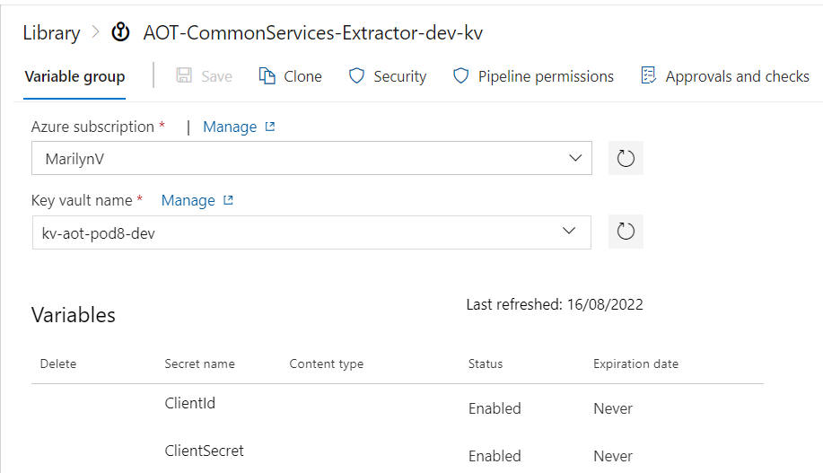

-   Create a Library/Variable Group in Azure DevOps with the following parameters:

| **Parameter** | **Description** |
| --- | --- |
| COGNITE_HOST | Provide the host details for Cognite data fusion |
| COGNITE_PROJECT | Provide the project name for Cognite data fusion |
| SCOPES | Provide the scopes for Cognite data fusion |
| TOKEN_URL | Provide the token URL for Cognite data fusion |
| CONTAINER_REGISTRY_SERVICE_CONNECTION | Provide container registry service connection for build and release pipeline. |
| SONARQUBE_SERVICE_CONNECTION | Provide service connection for SonarQube |
| AUTOMATIC_ASSET_HR_CLI_PROJECT_KEY | Provide SonarQube project key for Automatic Asset Hierarchy Accelerator |
| AUTOMATIC_ASSET_HR_CLI_PROJECT_NAME | Provide SonarQube project name for Automatic Asset Hierarchy Accelerator |
| AUTOMATIC_AH_CONFIG_FILENAME | Provide the configuration filename that is used to run the extractor. The filenames are environment-specific for assethierarchy_dev_config.YAML, assethierarchy_itest_config.YAML and assethierarchy_prod_config.YAML &gt; 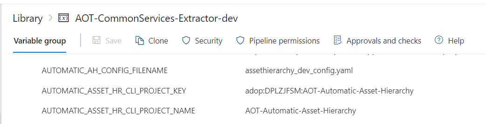
|  |
| - | Navigate to the pipeline file location \"Source/Extractors/AutomaticAssetHierarchy/pipeline/Dev/azure-pipelines.yml\" and ensure that the pipeline refers to the libraries created in the previous steps. &gt; 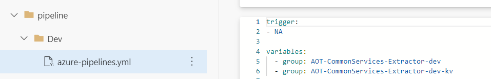
|  |

## 

# Prepare Accelerator Config File

Configure the parameters for Cognite, transformation, and extraction in the configuration file for the Automatic Asset Hierarchy Accelerator.

Parameters are mandatory unless specified as optional.

### Cognite Parameters

| **Parameter** | **Description** |
| --- | --- |
| host | Use the hostname for Cognite data fusion (CDF) added in the Azure DevOps library in earlier steps |
| project | Use the project name for CDF added in the Azure DevOps library in earlier steps |
| idp-authentication. client-id | Use the client ID for CDF added in the Azure DevOps key vault library in earlier steps |
| idp-authentication. secret | Use the client secret for CDF added in the Azure DevOps key vault library in earlier steps |
| idp-authentication. scopes | Use the scopes for CDF added in the Azure DevOps library in earlier steps |
| idp-authentication. token_url | Use the token_url for CDF added in the Azure DevOps library in earlier steps 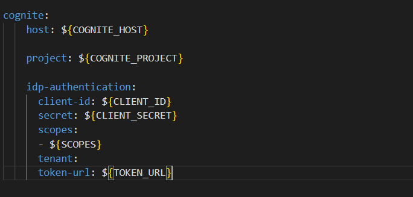
|  |

### Transformation Parameters

The transformation parameters are listed in the table below.

| **Parameter** | **Description** |
| --- | --- |
| Transformation_External_Id | Provide the external ID of Transformation. |
| Transformation_Name | Provide the name of Transformation. |
| Transformation_Type | Provide the destination type of the Transformation. AvailableOptions: \[\'asset hierarchies\', \'labels\', \'events\', \'relationships\'\]. Refer note below. |
| Action_Type | Provide the action type of the transformation. AvailableOptions: \[\'create\', \'create or update\', \'update\', \'delete\'\]. Refer note below. |
| SQLQuery | Provide the Spark SQL query for the transformation. |
| CDF_DataSetExternalID | Provide the CDF Dataset External ID to be linked to asset hierarchy/events/labels/relationships |
| Schedule.Schedule_Time | Optional - Provide the Cron expression to schedule the transformation at a given time. |
| Schedule.Is_paused | Optional - Provide a Boolean value. If true, the transformation is paused. The table below lists the destinations and available actions for a transformation. |
| **Transformation Type** | **Action Type** |
| asset hierarchies | create or update, delete |
| labels | Create, delete |
| events | Update, delete, create, create or update |
| relationships | Update, delete, create, create or update Note that: |
| - | Transformation Type (Destination) is the CDF Resource Type that a user wants to ingest data into. |
| - | The Action Type tells how the user wants to handle data that is already present at the destination. |
| - | CDF offers a variety of Destination and Action Types. Each Destination Type has its own set of Action Types. 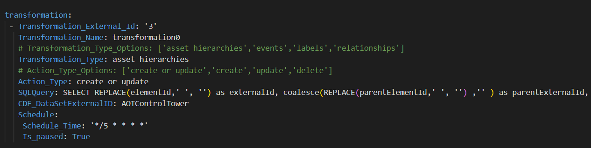
|  |

### Extraction Parameters

| **Parameter** | **Description** |
| --- | --- |
| datasetexternal_id | Provide the external ID of the Dataset in Cognite data fusion (CDF) |
| dataset_name | Provide the name of the Dataset in CDF |
| external_id | Provide the external ID of the CDF extraction pipeline |
| ep_name | Provide the name of the CDF extraction pipeline |
| contacts.name | Optional - Provide the name of the contact to whom the extraction pipeline notification should be sent. |
| contacts.email | Optional - Provide the email of the contact to whom the extraction pipeline notification should be sent. |
| contacts.sendnotification | Optional - Provide notification value. If the send notification value is true, then mail is sent to the respective mail ID else no mail is sent. 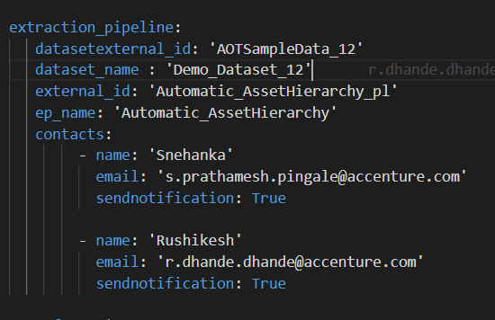
|  |

## Create a Build Pipeline

The Build Pipeline is used to Dockerize the Extractor Package. The artifacts created here are used in the release pipeline for deployment.

1.  Navigate to Azure DevOps, select \"Pipelines\", and then select \"New Pipeline.\"

> 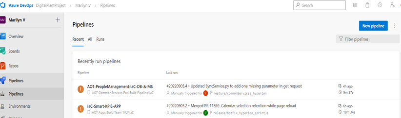

2.  Select \"Azure Repos Git\" then Select Repository Name that contains Automatic Asset Hierarchy Accelerator code and pipeline files and then select \"Existing Azure Pipelines YAML file.\"

> 

3.  

4.  Select the branch and provide the pipeline file path as \"Source/Extractors/AutomaticAssetHierarchy/pipeline/Dev/azure-pipelines.yml\" and then select Continue.

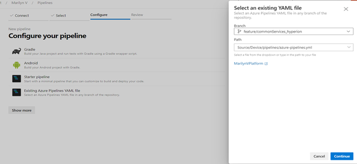

5.  Review and save.

6.  Run the pipeline and wait for its successful completion.

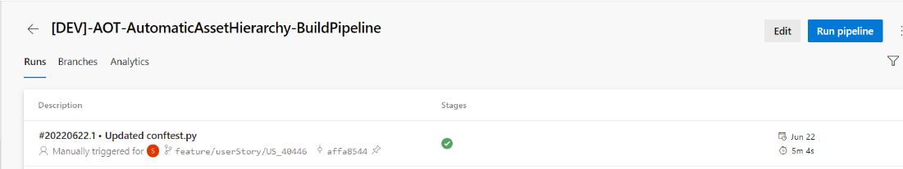

## 

# Create a Release Pipeline

The Release pipeline deploys the Docker Image of the Automatic Asset Hierarchy Accelerator created by the build pipeline to the AKS Cluster.

1.  Create a release pipeline with two tasks for the AKS Cluster.

    -   The task with the delete command

    -   The task with create command

2.  Update the value of the service connection for the AKS cluster in the tasks.

> 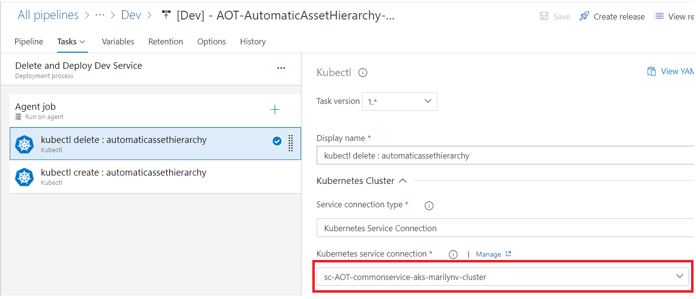

3.  Update the AKS file location in the tasks.

> 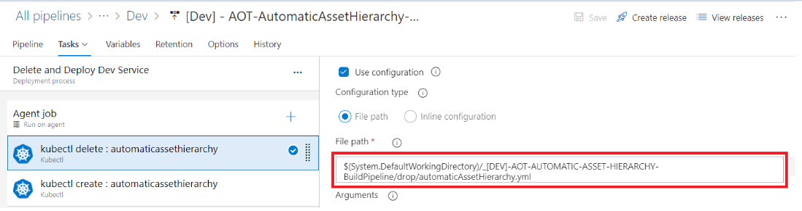
4.  

5.  Disable the delete task after running the pipeline the first time.

> 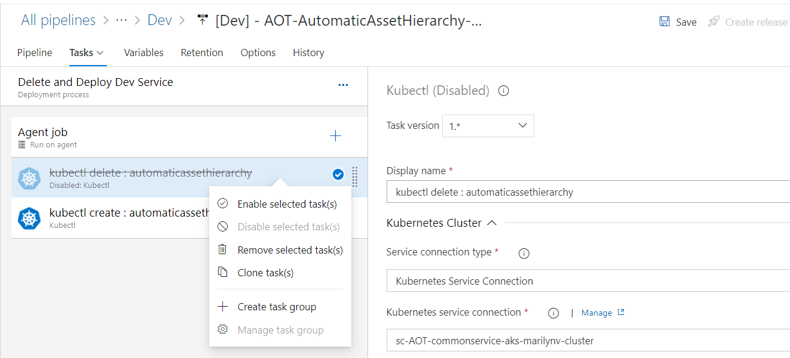

6.  Create a release from the release pipeline created in the previous step.

> 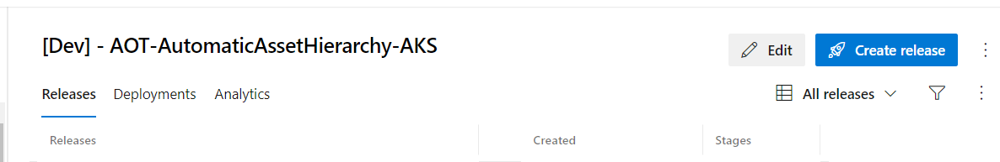

7.  Once the release is completed, confirm that the deployment was successful on Azure DevOps.

> 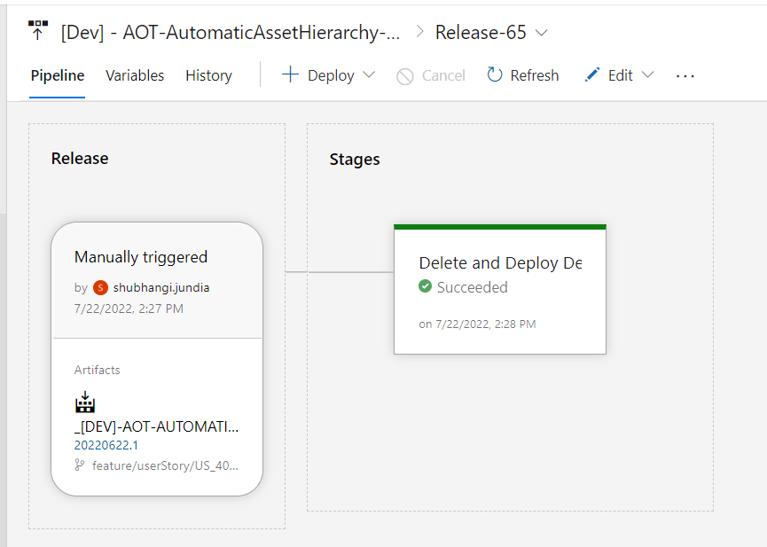
8.  

9.  After deployment, validate successful deployment to the AKS cluster in the Azure portal.

> 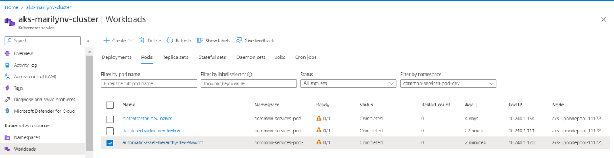

10. Use [Lens](https://k8slens.dev/) to validate Automatic Asset Hierarchy Accelerator logs.

> 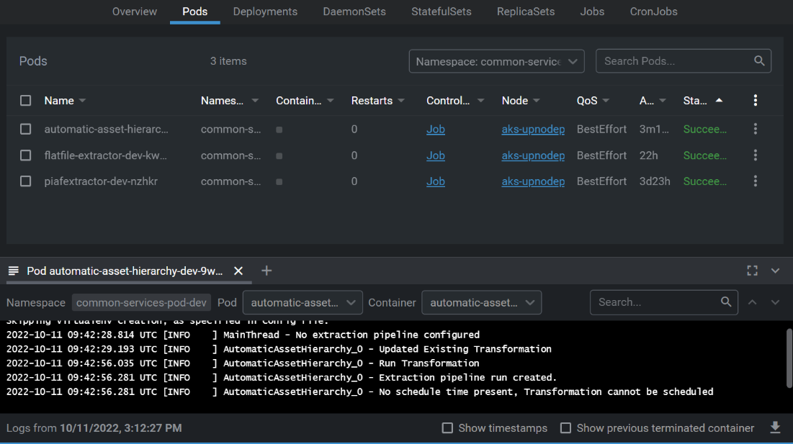
11. 

12. If everything looks good and AKS POD is created, enable the delete task that was previously disabled.

> 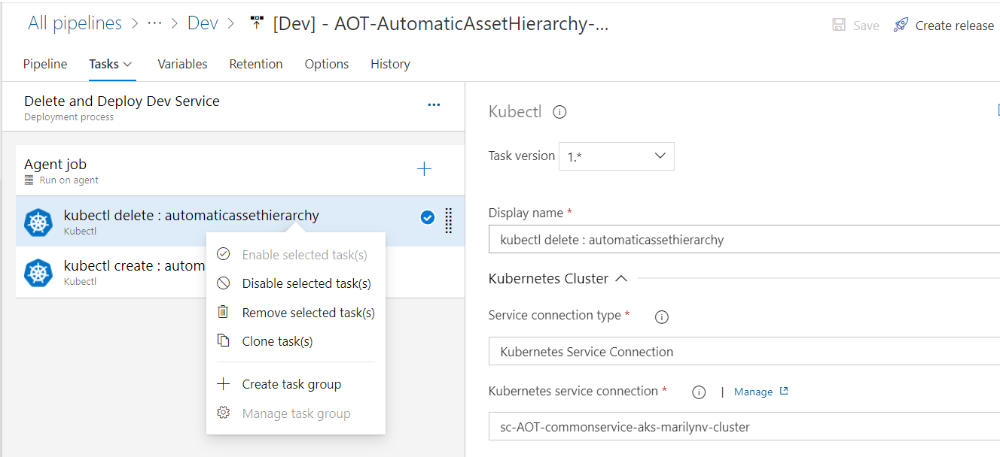

13. Validate successful transformation run in CDF.

> 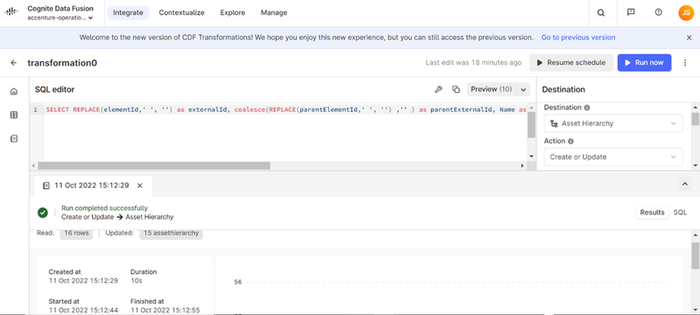
## 

# Result

When the deployment is completed, an extraction pipeline is created in CDF based on the details provided in the configuration file.

Success/Failure message is visible on the CDF portal and a notification email has been sent.

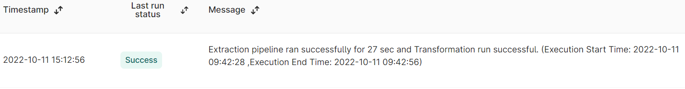

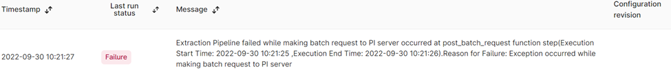
