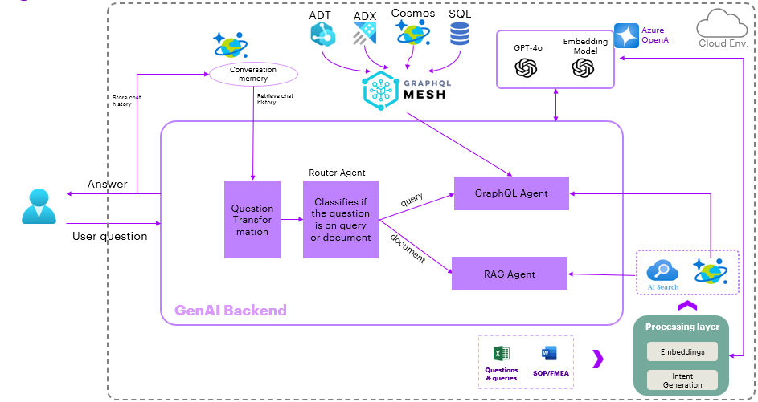
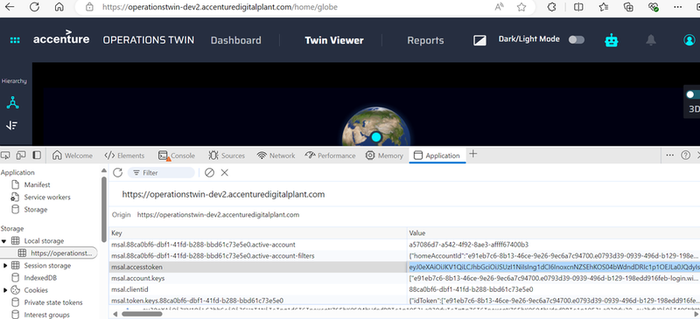
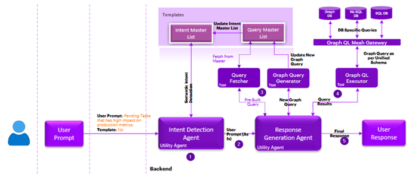

Industrial AI Foundation

Digital Twin Assistant

ARCHITECTURE AND IMPLEMENTATION GUIDE

Release Version: 2.5

## Introduction

Industrial AI Foundation (IAI) is a collection of software accelerators and tools, including Smart KPIs, that can be assembled to deliver client solutions. IAI accelerates the integration of product, process, and live data from disparate IT and OT systems, creating a comprehensive and contextualized view of operations to enable better decisions and optimized processes.

The Digital Twin Assistant is a GenAI based system that may be used to answer questions using the standard operating procedures (SOP) in combination with operations data such as insights and actions. It takes the natural language question, queries all the sources, and provides the answer in a natural response.

### Purpose

This document explains the architecture and integration of the generative AI based Digital Twin Assistant that is integrated into the user interfaces for the IAI components

### Target Audience

Software architects, developers, and integrators with IT backgrounds.

### Prerequisites

-   Python 3.10

-   Install the libraries provided in requirements file from the repository

-   Azure Repository Access

###  Features

A GenAI framework to improve operational performance and reduce the time in analyses to make decision making faster and efficiently and:

-   is integrated with Structured and unstructured sources to provide actionable insights.

-   stores context history to provide users with continuous dialogue as a chat agent.

-   additionally provides links to the insights/actions/KPIs relevant to the answer(if any).

-   retrieves the contextual responses based on the user access by people management.

-   provides responses in the users time zone by applying proper conversion for user\'s convenience.

### Business Contacts

-   [florian.tournier@accenture.com](mailto:florian.tournier@accenture.com)

-   [laura.mosconi@accenture.com](mailto:laura.mosconi@accenture.com)

### Technical Contacts

-   [laura.mosconi@accenture.com](mailto:laura.mosconi@accenture.com)

-   [varun.balachandra@accenture.com](mailto:varun.balachandra@accenture.com)

-   [sri.harsha.asetti@accenture.com](mailto:sri.harsha.asetti@accenture.com)

### Related Links

-   [IAI Repo](https://dev.azure.com/DigitalPlantProject/Marilyn%20V/_git/MarilynVPlatform)

-   [Data processing Repo](https://dev.azure.com/DigitalPlantProject/Marilyn%20V/_git/AOT-Azure?path=/Ingestion/GenAI-Functionapp)

-   [GenAI API Repo](https://dev.azure.com/DigitalPlantProject/Marilyn%20V/_git/AOT-Azure?path=/Consumption/DataAccess/GenAI/GenAIQueryAPI/genai_middleware/genai_ms/app/gen_ai)

### 

## Glossary

| Term | Definition |
| --- | --- |
| Azure OpenAI | Microsoft\'s cloud-based platform providing access to large language models such as GPT-4o and text-embedding-3-small for building AI-driven applications. |
| LLM (Large Language Model) | A type of artificial intelligence model trained on vast amounts of text data to understand and generate human-like language. |
| Azure Cosmos DB | A globally distributed, multi-model database service from Microsoft, used here to store query mappings and user chat history. |
| GraphQL Queries | Requests for specific data structures made using the GraphQL query language, stored in the Cosmos DB collection for mapping questions. |
| User Chat History | A record of interactions between users and the AI system, maintained for context and continuity in responses. |
| AI Search | Microsoft\'s cognitive search solution, leveraging vector databases to store and retrieve semantic embeddings from unstructured documents. |
| Embeddings | Numerical representations of text data that capture semantic meaning, enabling efficient similarity searches in vector databases. |
| Semantic Ranker | A feature that improves search accuracy by ranking results based on semantic relevance rather than keyword matching alone. |
| Storage Account | Cloud-based service for storing various types of data, such as files, blobs, and backups, integral to data management in Azure. |

### Cloud Resources

| **Resource** | **Function** |
| --- | --- |
| Azure OpenAI: | LLM models used are gpt-4o, text-embedding-3-small |
| Azure Cosmos DB: | Collections created are graphql_queries(to store query and question mapping), user_chat_history(to store context history) |
| AI Search: | A vector database to store the embeddings of the unstructured documents (with semantic-ranker enabled) |
| Storage account: | A container to store the queries and unstructured docs. |
| Function app: | A HTTP trigger-based function to facilitate the ingestion of queries to cosmos and unstructured docs to AI Search (whenever required) |
| Kubernetes Service: | To deploy the GenAI Implementation API |

### Deployment

The docker file and the CI/CD pipeline are available in IAI\'s-Azure repo. The resource group APIs and connection strings in the pipeline variable group library must be updated before deploying to the environment.

## 

# High level Architecture

This diagram illustrates how the digital twin assistant enables queries across structured data sources like ADT, ADX, Cosmos DB, and SQL as well as unstructured data sources. The process begins with a user prompt, which is converted into a query. A router agent directs structured requests to the GraphQL Agent (via GraphQL Mesh) and unstructured requests to the RAG agent, which uses AI Search for content retrieval. The Processing Layer handles embeddings and intent detection using Azure OpenAI/GPT-4o, while Conversation Memory maintains chat context. This results in unified, context-aware answers from both structured and unstructured enterprise data.

## 

# Authentication and Authorization

API requires authorization using a Bearer Token (Access token) to secure access to its resources. The token varies by environment.

-   DEV Environment - [AccentureOperationsTwinUI](https://operationstwin-dev2.accenturedigitalplant.com/home/globe)

-   Test Environment - [AccentureOperationsTwinUI](https://operationstwin-test.accenturedigitalplant.com/home/globe)

To access protected endpoints of the GenAI API, include the access token in the Authorization header of your HTTP requests.

If an invalid or expired JWT token is provided, the API will fail as it will be unable to connect to the underlying data sources.

## 

# Implementation

[]\{#_Toc201239208 .anchor\}There are two main components in the implementation. The first component involves data processing, which can be executed either as a one-time operation or on a scheduled basis. This step focuses on ingesting unstructured documents for use by the GenAI system, as well as obtaining the query-question mapping required for agents to learn how to query structured data effectively.

The second component is the GenAI API, which leverages the ingested sources to provide answers to user questions.

### Ingestion

**Structured sources**

The structured source used in the implementation is GraphQL Mesh which retrieves the results with a graph query language.

Get the list of questions and query mapping. These will be used as examples for the GenAI to query the right answers.

The GenAI system utilizes a templatized approached to handle structured queries for which an intent to tagged for each of the example questions.

Run the intent creation algorithm (available at the repo location [generate intent](https://dev.azure.com/DigitalPlantProject/Marilyn%20V/_git/AOT-Azure?path=/Consumption/DataAccess/GenAI/GenAIQueryAPI/genai_middleware/genai_ms/app/gen_ai/algo/tools_utils/utils/generate_intent.py)), review the intents so that they are clear and precise.

-   Example intents:

    -   Question: What are the issues faced in the plant? Intent: Plant Issues

    -   Question: Which role is responsible for this equipment: Intent: Equipment responsibility

-   Manually change them if necessary. (This step can be also done while doing the testing of the consumption API in a repetitive fashion until the intents are consistently matching the right question).

-   Store the intents and queries to the blob container

**\
Unstructured documents**

Get the list of SOPs/FMEA documents and store them in a blob container.

The current implementation only handles word/pdf documents and ignores any images present in the documents.

To establish communication to the resources, add all the connection strings and or api keys in the file main_function/helper_variables.py as follows:

-   Blob storage : to read the queries excel file and unstructured docs (word/pdf)

-   Azure OpenAI: to utilize the text-embedding-three-small model to create embeddings of the unstructured docs

-   AI Search: to store the embeddings of the unstructured docs

-   Azure Cosmos DB : to store the queries and intents.

-   function input:

    -   a json of two key-value pairs, if the key is not present - the function considers it as True

    -   \{\"process_queries\":True,\"process_docuemts\":False\} -- Runs only the ingestion of query and question mappings

    -   \{\"process_docuemts\":True\} -- Runs the ingestion for both queries and unstructured docs.

    -   \{\} -Runs the ingestion for both

### 

## 

### Consumption

**Approach**

It is a multi-agentic implementation developed with Langchain framework combining structured and unstructured sources.

**Agents**

| **Name** | **Description** |
| --- | --- |
| Rephrase Agent | Prompt for this can be found at the function rephrase in the file [IAI_template.py](https://dev.azure.com/DigitalPlantProject/Marilyn%20V/_git/AOT-Azure?path=/Consumption/DataAccess/GenAI/GenAIQueryAPI/genai_middleware/genai_ms/app/gen_ai/AOT_template.py). Its purpose is to transform/rephrase the question using the chat history to have the context memory accessible to the agents further down the pipeline |
| Router Agent | Prompt for this can be found at the function route_classify in the file [IAI_template.py](https://dev.azure.com/DigitalPlantProject/Marilyn%20V/_git/AOT-Azure?path=/Consumption/DataAccess/GenAI/GenAIQueryAPI/genai_middleware/genai_ms/app/gen_ai/AOT_template.py). Its purpose is to determine which of the two sources the question can be answered from GraphQL (or) Unstructured. |
| GraphQL Agent | This is a complex agent which uses a templatized approach, a combination of intent detection, template filling and database Query agents. |
| RAG Agent | The Agent creates the embedding of the user question using the text-embedding-three-small model. The embedding is passed to the AI Search service to retrieve the top three ranked embeddings. The Agent uses the text associated with these top three embeddings to formulate the final answer for the user question.|

**Execution** 
The implementation steps are executed with the LangChain agent executor. The prompt for this can be found at sql_agent_base_prompt_intent in the file [base_prompts.py](https://dev.azure.com/DigitalPlantProject/Marilyn%20V/_git/AOT-Azure?path=/Consumption/DataAccess/GenAI/GenAIQueryAPI/genai_middleware/genai_ms/app/gen_ai/algo/prompt_template/base_prompts.py)
1. Detect the intent of the user question from the available list of master intents. Prompt for this can be found at the function intent_classify in the file [IAI_template.py](https://dev.azure.com/DigitalPlantProject/Marilyn%20V/_git/AOT-Azure?path=/Consumption/DataAccess/GenAI/GenAIQueryAPI/genai_middleware/genai_ms/app/gen_ai/AOT_template.py)
2. Pass the detected intent along with the user question to the Response Agent.
3. The Agent first looks for the mapped questions and queries for the detected intent and then fetches the pre-built query (or) creates the query for the user question and fill in the templates of the mapped query with parameters available in the question.
4. The created query is passed to the query execution tool and retrieves the results in the form of a json.
5. The Agent formulates the final response for the user questions utilizing the query results.

**Consumption API** 
Input -- \{\"User_Query\":\" What are the issues faced in the plant?\",\"TimeZone\":\"4:30PM IST\"\} |
