

ACCENTURE OPERATIONS TWIN

CDF Environment

APPLICATION DEPLOYMENT GUIDE

Release Version: 2.5

**Metadata Table**

| **Field** | **Value** |
| --- | --- |
| **Asset / Solution Name** | Industrial AI Foundation / Application Deployment |
| **Domain / Area** | Cognite Data Fusion / Deployment |
| **Owner (Team/Person)** | Tournier, Florian |
| **Reviewers** | Shivananda, Prashanth |
| **Status** | Complete / Approved |
| **Confidentiality** | Internal / Confidential |
| **Source of Truth** | [[Summary - Overview]](https://dev.azure.com/DigitalPlantProject/Marilyn%20V) |
| **Related Assets / Alternatives** | IAI Azure Deployment Guide |

## Introduction

Industrial AI Foundation (IAI) is a collection of software accelerators and tools that can be assembled to deliver client solutions. IAI accelerates the integration of product, process, and live data from disparate IT and OT systems, creating a comprehensive and contextualized view of operations to enable better decisions and optimized processes.

IAI can be deployed in both Cognite Data Fusion (CDF) and Azure environment. The Azure environment provides a general-purpose cloud-based platform, and CDF is specialized for industrial data and applications. The environment is selected depending on client requirements.

The deployment in CDF environment assumes an existing CDF subscription. Key initial steps include configuring the necessary network settings, setting up the required storage accounts, and ensuring that all relevant permissions are granted to the deployment service. Additionally, it is important to verify that the deployment environment meets all the prerequisites outlined in the deployment guide.

### Purpose

This guide explains how to deploy the IAI application in the Cognite Data Fusion (CDF) environment.

### Target Audience

Developers/Azure resources with the following skills:

-   Azure Pipeline creation

-   SonarQube

-   Cognite Data Fusion

### Contact

-   [prashanth.shivananda@accenture.com](mailto:prashanth.shivananda@accenture.com)

-   [uha.ratna.mateti@accenture.com](mailto:uha.ratna.mateti@accenture.com)

### Related Links

-   [IAI_CDF_Deployment_Variable_List.xlsx](https://ts.accenture.com/:x:/r/sites/GlobalDocTemplates/Published%20Documents/AOT/Linked%20Files/AOT%20Deployment%20Guide/AOT_CDF_Deployment_Variable_List.xlsx?d=w507259b3e0594eeeb7ce6254e7d9eec7&amp;csf=1&amp;web=1&amp;e=tlp8Hg)

-   [How to Create a Release Pipeline](https://docs.microsoft.com/en-us/azure/devops/pipelines/release/?view=azure-devops)

-   [People Management Backend Deployment Guide](https://industryxdevhub.accenture.com/assetdetails/64)

### [Release Notes](https://industryxdevhub.accenture.com/assetdetails/45)  Glossary

| **Term** | **Definition** |
| --- | --- |
| AAD | Azure Active Directory |
| ACR | Azure Container Registry |
| AIR | Cognite Automatic Identification and Reporting tool |
| AKS | Azure Kubernetes Service |
| APIM | Azure API Management |
| Azure AD | Azure Active Directory |
| CDF | Cognite Data Fusion |
| DNS | Domain Name System |
| IA | Intelligent Advisor |
| NSG | Network Security Group |
| OH | Operation Hierarchy |
| PM | People Management |
| RG | Resource Group |
| SKPI | Smart KPI |
| SKU | Stock Keeping Unit |
| DLQ | Dead letter queue |
| SASL | Simple Authentication and Security Layer |
| DB | Database |
| MS | Micro Service |
| VNet | Virtual Network |
| ARM | Azure Resource Manager |

## Deployment Prerequisites 

An Azure subscription and an Azure DevOps organization must be already in place with necessary roles provided to perform the deployment.

### 

## Creating Azure Pipeline

An Azure pipeline needs to be created using the existent YAML file. The steps to create the Azure pipeline are as follows.

-   In DevOps, select Pipelines.

-   Click on New Pipeline.

-   In Connect, select Azure Repos Git .

-   Next, select the repository in which the new pipeline needs to be created.

-   In Configure section, select the Existing Azure Pipelines YAML file path.

-   Then select the branch and path of the Existing Azure Pipelines YAML file path and click on Continue.

-   Click on save.

-   Finally, click on the three dots on the right and rename the pipeline accordingly.

###  Clone Repository

Clone the repository from git. Connect with the IAI product team for the Git URL.

### CDF 

-   Set up the Azure Subscription.

-   Request a CDF project and authenticate it with a client\'\'\'s Azure AD. [link](https://docs.cognite.com/cdf/access/guides/configure_cdf_azure_oidc/)

-   Create an Azure AD Security group for admin access to configure the CDF project and share the object ID AAD group with the Cognite Team.

-   Register AIR with OpenID Connect. Share the app registration details with Cognite to enable CDF AIR. [link](https://docs.cognite.com/cdf/air/guides/enable_air_oidc/)

### 

## Azure 

-   Create a Resource Group in the Azure portal, where the required resources need to be deployed.

-   Create an app registration and link it with the service connection

-   In the DevOps Portal, create a manual service connection to the Azure portal.

-   Enter the subscription ID and subscription name.

-   The service principal is the Client ID of the app registration that was previously created.

-   Create a secret key in the app registration and pass the value to the service connection in the principal ID.

-   The App registration must be provided with the owner role to the resource group

-   In the Azure resource group, create a role assignment to give the service connector access.

-   After following these steps, the validation is successful.

> 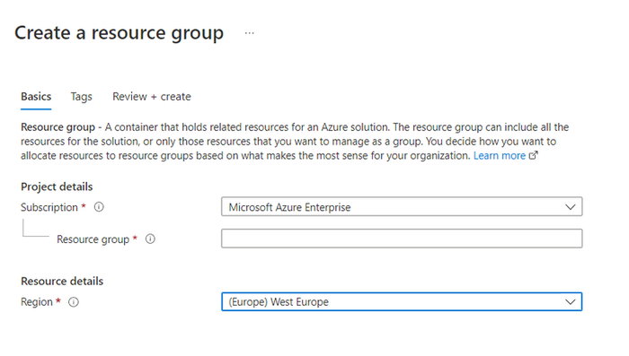
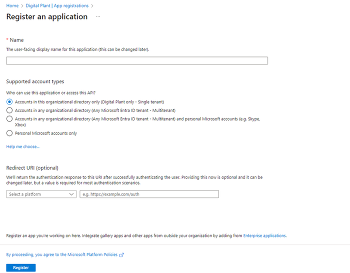

### Service Principal Configuration

Set up the app registration/Service Principal to facilitate the authentication of users to the standalone UI components using the following parameters and configurations:

| **\#** | **Parameters/Configurations** |
| --- | --- |
| 1 | Application ID |
| 2 | Tenant ID |
| 3 | Secret |
| 4 | Goto Authentication in App Registration under Manager and click on Add Platform and select Single page application URLS - \/auth e.g., [link](https://app-hostapp-ui-prod.azurewebsites.net/auth) - \ e.g., [link](https://app-hostapp-ui-prod.azurewebsites.net) - \ e.g., [https://app-entity-viewer-template-upload-\.azurewebsites.net](https://app-entity-viewer-template-upload-.azurewebsites.net) - \ /auth e.g., - \ e.g., - \ e.g., - \ e.g., [https://app-3d-builder-\.azurewebsites.net](https://app-3d-builder-.azurewebsites.net) - \/auth e.g., [https://app-mv-ui-intelligent-advisor-config-\.azurewebsites.net/auth](https://app-mv-ui-intelligent-advisor-config-.azurewebsites.net/auth) - \/auth e.g., - \/auth e.g\... [https://app-smartkpiconfig-\.azurewebsites.net/auth](https://app-smartkpiconfig-.azurewebsites.net/auth) - \ e.g., - \/home/dashboard e.g., [link](https://app-header-micro-app-prod.azurewebsites.net/) |
| 5 | API Permissions See detailed permissions below. |
| 6 | Expose API. Use the screenshot on the right as a guide: |

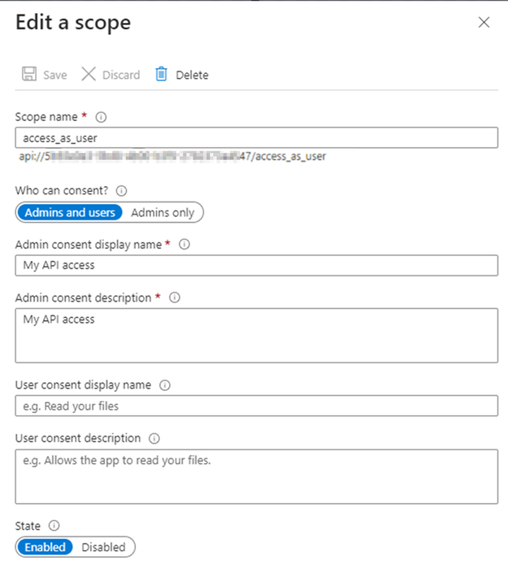

#### Detailed API Permissions

##### Microsoft Delegate

| Group.Read.All | Delegated Read all groups Yes |
| --- | --- |
| User.Read | Delegated Sign in and read user profiles No |
| User.Read.All | Delegated Read all users\'\'\' full profiles Yes |
| #### | Cognite API Delegate |
| DATA.VIEW | Delegated Date view Yes |
| IDENTITY | Delegated Identity Yes |
| user_impersonation | Delegated Impersonate the user Yes |

### Create ARM Service Connection

-   Set Up ARM Service Connection: In the DevOps portal, manually create an ARM service connection using the previously noted client ID and client secret.

-   Assign the Owner access to the recently created App registration on the Azure resource group created earlier.

-   After following these steps, the validation is successful.

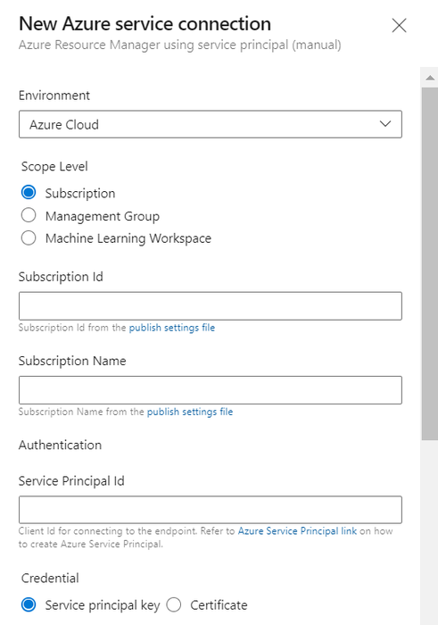

## 

# Infrastructure Deployment 

### 

## Deployment Steps

These are the standard deployment steps followed to deploy various IAI components in the CDF environment.

1.  Navigate to the respective YAML file.

2.  Create and update the infrastructure variable group. For the variables, refer to [IAI_CDF_Deployment_Variable_List.xlsx](https://ts.accenture.com/:x:/r/sites/GlobalDocTemplates/Published%20Documents/AOT/Linked%20Files/AOT%20Deployment%20Guide/AOT_CDF_Deployment_Variable_List.xlsx?d=w507259b3e0594eeeb7ce6254e7d9eec7&amp;csf=1&amp;web=1&amp;e=tlp8Hg)

3.  Add the infrastructure variable group name to the YML file.

4.  

5.  Rename the client files based on the client.

6.  Use the YML file to set up the Azure DevOps pipeline.

### Deployment Details

The following tables provide the pipeline details, the YML file, and any additional information or steps required in addition to the standard deployment procedure described in the previous section.

| **Resource** | **Pre-deployment** | **Cdf Pipeline -YAML File Path** | **Post-deployment** |
| --- | --- | --- | --- |
| AKS Cluster and ACR | Ensure that the Kubernetes version is updated to 1.30.0 or later. | Processing/Middleware_IaC/Middleware-IAC-arm-templates/application-deployment\-azure-app-deployment-pipelines-aks.yml. | 1. Create an AKS Namespace and use the same for secret creation and image tag. 2. After AKS and ACR have been set up, create the Service connections as shown [here](https://ts.accenture.com/:i:/r/sites/GlobalDocTemplates/Published%20Documents/AOT/Linked%20Files/AOT%20Deployment%20Guide/AKS_Cluster_ACR_Service_Connections.png). 3. Create a user username and password, take the Login server and add it in Docker Registry and add the username as Docker ID and password as Docker Password in DevOps. |
| APIM | Ensure that APIM Subnet has a range in AKS VNet that does not overlap with the existing AKS SubNet | Processing/Middleware_IaC/Middleware-IAC-arm-templates/application-deployment\-azure-app-deployment-pipelines-apim.yml | 1. [CORS](#cors-apim) must be updated at APIM level as well. Navigate to Resource Group \&gt; APIM \&gt;APIs\&gt;All APIs 2. In All APIs, go to Inbound processing, click on the three-dot menu, and then click Code editor. 3. Add the [CORS policy script](https://ts.accenture.com/:t:/r/sites/GlobalDocTemplates/Published%20Documents/AOT/Linked%20Files/AOT%20Deployment%20Guide/AOT_APIM_CORS_Policy_Script.txt) to the Code editor and save it. |
| Event Hub | N/A | Processing/Middleware_IaC/Middleware-IAC-arm-templates/application-deployment\-azure-app-deployment-pipelines-eventhub.yml | N/A |
| Cosmos DB | N/A | Processing/Middleware_IaC/Middleware-IAC-arm-templates/application-deployment\- azure-app-deployment-pipelines-cosmosdb.yml | Ensure that VNet is attached to Cosmos DB |
| Pub-Sub | N/A | Processing/Middleware_IaC/Middleware-IAC-arm-templates/application-deployment\- azure-app-deployment-pipelines-pubsub.yml | N/A |
| SQL Server and DB | N/A | Processing/Middleware_IaC/Middleware-IAC-arm-templates/application-deployment\-azure-app-deployment-pipelines-sql-server.yml | Ensure that the SQL server is configured to AKS VNet |
| Storage Account | N/A | Processing/Middleware_IaC/Middleware-IAC-arm-templates/application-deployment\-azure-app-deployment-pipelines-storageaccount.yml | CORS must be updated in the 3d storage account, Refer to the [CORS (Storage Account) section](https://ts.accenture.com/sites/GlobalDocTemplates/AOT/AOT%20Documents/Previous%20Releases/2.4%20Aquarius/AOT_CDF_Deployment_Guide_Aquarius.docx#_CORS_(Storage_Account)) for more information. Provide Storage Blob data contributor to app registration. |

### 

## 

### Create AKS Service Connection

1.  In DevOps portal, under Project Settings select Service Connections.

2.  Click on New Service connection.

3.  Choose a service or connection type as Kubernetes.

4.  Select the Authentication method as KubeConfig.

5.  To Connect to the cluster, login to the Azure portal, navigate to the respective AKS cluster and click on connect.

6.  Run the commands in the command prompt to get the KubeConfig file.

7.  Copy and paste the contents of your KubeConfig file which we get when connected to the AKS cluster.

8.  Next select the name of the AKS cluster and click on verify.

9.  Once the verification is completed, provide the name of the service connection.

10. Click on the checkbox to Grant access permission to all pipelines and then click on verify and save.

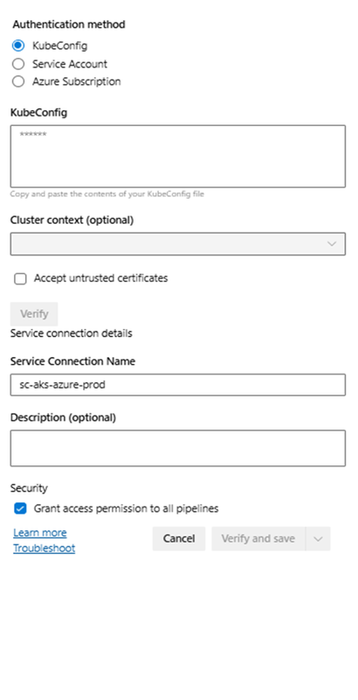

### Create ACR Service Connection

1.  In DevOps portal, Under Project settings select the service connections.

2.  Click on New Service connection.

3.  Choose a service or connection type as Docker Registry.

4.  Select the Registry type as Others.

5.  Login to Azure portal, navigate to the respective resource group and select the container registry and navigate to the Access keys. Enable the access keys if they are not yet enabled.

6.  Provide the name of the service connection.

7.  Click on the checkbox to Grant access permission to all pipelines and then click on verify and save.

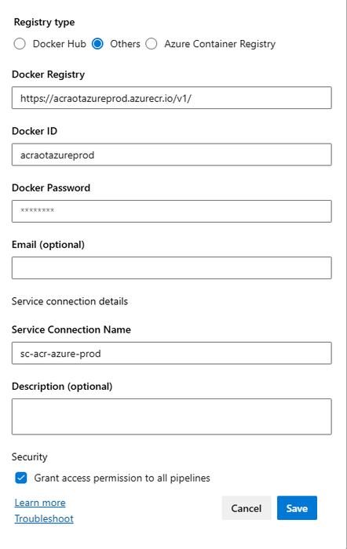

## Data Ingestion 

### Simulators

IAI components use the IoT Hub Simulator for data ingestion. The following are the steps for its deployment:

1.  Navigate to Source/Device/pipelines

2.  Open the YML file that is in the format client-azure-pipelines.yml.

3.  Create a variable group with the variables listed in [IAI_CDF_Deployment_Variable_List.xlsx](https://ts.accenture.com/:x:/r/sites/GlobalDocTemplates/Published%20Documents/AOT/Linked%20Files/AOT%20Deployment%20Guide/AOT_CDF_Deployment_Variable_List.xlsx?d=w507259b3e0594eeeb7ce6254e7d9eec7&amp;csf=1&amp;web=1&amp;e=IeJVVa)

4.  Set up an Azure DevOps pipeline for the YAML file. This will be the build pipeline.

5.  Create a release pipeline based on the build that was created in the previous step.

### Extractors

Currently, IAI components use only the following extractors for Data Ingestion: IoT Hub Extractor and SAP Work Order Extractor.

1.  Navigate to the respective pipeline:

-   IoT Hub Extractor: Source/Extractors/ IoTHubExtractor/pipeline

-   SAP WO Extractor: Source/Extractors/sap-extractor-work-order/pipeline

2.  Create a folder with the name of the environment that is being deployed.

3.  Copy the azure-pipelines.yml file from the Dev folder and paste it to the environment folder. Ensure you to update the names of the variable groups according to the environment.

4.  Navigate to the respective folder:

-   IoT Hub Extractor: Source/Extractors/IoTHubExtractor/AKS

-   SAP WO Extractor: Source/Extractors/sap-extractor-work-order/AKS

5.  Copy the following file from the Dev folder and paste it to the environment folder created in step 2. Update all the appropriate values to ensure the correct image is pulled from the Container registry of the current environment.

-   IoT Hub Extractor: iothubextractor.yml

-   SAP WO Extractor: workorderdata.yml

6.  Create a variable group with the variables listed in [IAI_CDF_Deployment_Variable_List.xlsx](https://ts.accenture.com/:x:/r/sites/GlobalDocTemplates/Published%20Documents/AOT/Linked%20Files/AOT%20Deployment%20Guide/AOT_CDF_Deployment_Variable_List.xlsx?d=w507259b3e0594eeeb7ce6254e7d9eec7&amp;csf=1&amp;web=1&amp;e=IeJVVa)

7.  Set up an Azure DevOps pipeline for the YAML file mentioned in step 3. This will be the build pipeline.

8.  Create a release pipeline based on the build created in the previous step.

The image below shows the extractors for data ingestion.

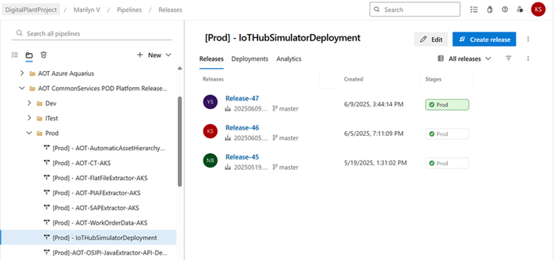

-   When creating a new release pipeline, please add all the tasks and include the **service connection** details inside all tasks.

-   When cloning a release pipeline, please do update the **service connection** details.

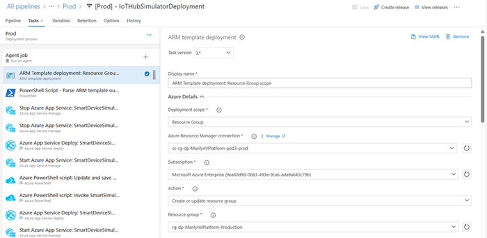

## Backend Deployment

**Prerequisites**

1.  Infrastructure pipelines must be deployed.

2.  A service connection for Docker Registry as described in the previous section.

3.  A service connection for AKS, as described in the previous section.

4.  Some components may require APIM Integration, make sure that the APIM integration stage is included in the template files as shown in the [APIM section](#apim).

5.  The global variable group should be completely updated.

### 

## Application Deployment

| Component | Component Description |
| --- | --- |
| AzureWebPubSub Component | This API is used to publish content updates like publish/subscribe messages in real time between server and connected clients (for example a single page web application) in real-time. Clients can be a list of users, groups, or all users as well. |
| People Management Configuration Component | IAI\'\'\'s People Management functionality can be integrated with other IAI components such as Smart KPIs and Intelligent Advisor. Integration requires personal data like role and department to be fetched from Azure and displayed in IAI. To accomplish this objective, People Management APIs must be deployed in the backend. |
| File Handler Component | File handler microservice contains generic APIs to download and upload files. The download API can be used to download one or more files as zip files from Azure Blob Storage. Whereas upload API can be used to upload a template file and store it in an Azure Blob storage account. |
| Operations Hierarchy Component | These are APIs used to propagate Data Permissions to Asset Hierarchy. |
| MultiPlantView Component(UOM) | MultiPlantView Microservice can be used to retrieve units of measurement details and conversion formulae between various units of measurements. |
| Smart KPIs Component | These are the APIs used for the SmartKPI Dashboard. |
| Generic Scheduler Component | Generic Scheduler microservice is a service designed to facilitate task scheduling, allowing users to schedule tasks to be executed at specific intervals or on specific dates. Service handles the management of tasks and exposes APIs for CRUD operations |
| IA Component | An IA application is a micro-frontend application, and every micro-frontend IA application has a separate microservice for obtaining or updating insights or actions from CDF. |
| Smart KPI CDF Function | The Smart KPI CDF functions generate data based on the calculations at different levels of the hierarchy. |
| IA Middleware CDF Function | This CDF function is used for creating the insight category hierarchy and inserting the data points in the time series. |
| IAI-3D-CMS Component | 3D Content Management System is used in IAI\'\'\'s Twin Builder and Twin Viewer applications. |
| PowerBI Component | This is the independent Power BI Microservice which will allow connecting a publisher Power BI report. |
| ## | Deployment Steps |
| 1. | Navigate to the respective Azure pipeline YAML file path for the application. |
| 2. | Create and add the variable group (s) in the Azure DevOps portal with the corresponding values listed in [IAI_CDF_Deployment_Variable_List.xlsx](https://ts.accenture.com/:x:/r/sites/GlobalDocTemplates/Published%20Documents/AOT/Linked%20Files/AOT%20Deployment%20Guide/AOT_CDF_Deployment_Variable_List.xlsx?d=w507259b3e0594eeeb7ce6254e7d9eec7&amp;csf=1&amp;web=1&amp;e=tlp8Hg) to the YAML file. |
| 3. | Set up the Azure DevOps pipeline with the above YML file. |
| 4. | The variable groups used in the YML file of Azure DevOps Pipeline are categorized as below: |
| a. | **Infrastructure Variable Group**: All the infrastructure-related values are included in this variable group. |
| b. | **Global Variable Group**: The values that are commonly used across all components are included in this variable group. |
| c. | **Component-Specific Variable Groups**: The values that are specific to the component either BE or FE are included in this variable group. The complete list of variables is as follows: |
| - | PROD-IAI-PM-BE-VARIABLE |
| - | PROD-IAI-OH-BE-VARIABLE |
| - | PROD-IAI-SKPI-BEVARIABLE |
| - | PROD-IAI-IA-BE-VARIABLE |
| - | PROD-IAI-UOM-BE-VARIABLE |
| - | PROD-IAI-FILE-HANDLER-BEVARIABLE |
| - | PROD-IAI-PRM-BE-VARIABLE |
| - | PROD-IAI-GS-VARIABLE |
| - | PROD-IAI-POWERBI-VARIABLE |
| - | PROD-IAI-3D-BE-VARIABLE &gt; Refer to the image below to note the alignment of the variables. &gt; &gt; 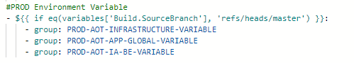
|  |

#### Deployment Details

This section describes the APIs for each application, their pipeline details, and the YML files.

##### People Management and Operations Hierarchy

| Subcomponent | Prerequisites Services Azure Pipeline YAML file path |
| --- | --- |
| Azure WebPubSub Component | Infrastructure pipelines must be deployed. AzureWebPubSub Consumption/DataAccess/\-pm-azure-pipelines.yml \&gt;\&gt; Azure WebPubSub MS |
| People Management Configuration Component | Azure WebPubSub Microservice must be deployed.\ PeopleManagement_ms Consumption/DataAccess/\-pm-azure-pipelines.yml \&gt;\&gt; PM Config MS Update the Client ID in the SQL script to include a to-be admin user from the client environment |
| Operations Hierarchy Component | PM pipeline must be deployed. OperationHierarchy_EntityViewer Consumption/DataAccess/\-pm-azure-pipelines.yml \&gt;\&gt; OH Entity Viewer MS |
| PM pipeline must be deployed. | OperationHierarchy_configuration Consumption/DataAccess/\-pm-azure-pipelines.yml \&gt;\&gt; OH Config MS |
| PM pipeline must be deployed. | OperationHierarchy_DataPermissions Consumption/DataAccess/\-pm-azure-pipelines.yml \&gt;\&gt; OH DP MS |
| OperationHierarchy_configuration and OperationHierarchy_DataPermissions microservices must be deployed. and Asset Hierarchy must be created. | OperationHierarchy_module Consumption/DataAccess/\-pm-azure-pipelines.yml \&gt;\&gt; OH Module MS |

##### Independent Component

| Subcomponent | Prerequisites Services Azure Pipeline YAML file path |
| --- | --- |
| File Handler Component | NA FileHandler Common/\-azure-pipelines.yml \&gt;\&gt; File Handler MS |
| 3D CMS Component | NA aot-3d-cms Common/\-azure-pipelines.yml \&gt;\&gt; 3D CMS |
| Power BI Component | NA PowerBi Common/\-azure-pipelines.yml \&gt;\&gt; Power BI MS |
| Production Manager Component | NA Production Manager Common/\-azure-pipelines.yml \&gt;\&gt; Production Manager |
| Generic Scheduler Component | This pipeline must be deployed before SKPI Pipelines GenericScheduler Common/\-azure-pipelines.yml \&gt;\&gt; Generic Scheduler MS |
| Unit of Measurement | This Pipeline must be deployed before SKPI orchestrator and Data Permission pipelines. N/A Common/\-azure-pipelines.yml \&gt;\&gt; Unit of Measurement MS |

##### Smart KPIs Component

| Subcomponent | Prerequisites | Services | Azure Pipeline YAML file path |
| --- | --- | --- | --- |
| Smart KPIs Component | Ensure that People Management Microservice must be deployed. | Smartkpi_cdf\_\_func | Processing/SmartKPIs/\- skpi-cdf-azure-pipelines-push.yml \&gt;\&gt; SmartKPI CDF Func Processing/SmartKPIs/\-skpi-azure-pipelines.yml \&gt;\&gt; SmartKPI Config MS Processing/SmartKPIs/\- skpi -azure-pipelines.yml\&gt;\&gt; SmartKPI_MS Processing/SmartKPIs/\- skpi -azure-pipelines.yml\&gt;\&gt; SmartKPI Datapermission SVC MS Processing/SmartKPIs/\- skpi -azure-pipelines.yml\&gt;\&gt; SmartKPI Orchestrator SVC MS Processing/SmartKPIs/\- skpi -azure-pipelines.yml\&gt;\&gt; SmartKPI Computation MS |

##### IA Component

| **Subcomponent** | **Prerequisites** | **Services** | **Azure Pipeline YAML file path** |
| --- | --- | --- | --- |
| N/A | Generic Schedular should be deployed. | Ia_CDF_Func | Processing/ IntelligentAdvisor /\- ia-cdf-azure-pipelines-push.yml \&gt;\&gt; IA CDF Func Processing/IntelligentAdvisor/\-ia-azure-pipelines.yml \&gt;\&gt; IA FUNC MS Processing/IntelligentAdvisor/\-ia-azure-pipelines.yml \&gt;\&gt; IA FUNC MS Processing/IntelligentAdvisor/\-ia-azure-pipelines.yml \&gt;\&gt; IA Excel File Upload Processing/IntelligentAdvisor/\-ia-azure-pipelines.yml \&gt;\&gt; IA DB Update Function App Processing/IntelligentAdvisor/\-ia-azure-pipelines.yml \&gt;\&gt; IA Model MS Processing/IntelligentAdvisor/\-ia-azure-pipelines.yml \&gt;\&gt; IA Middleware MS Processing/IntelligentAdvisor/\-ia-azure-pipelines.yml \&gt;\&gt; IA Evaluate MS Processing/IntelligentAdvisor/\-ia-azure-pipelines.yml \&gt;\&gt; IA Action WorkOrder MS Processing/IntelligentAdvisor/\-ia-azure-pipelines.yml \&gt;\&gt; IA KPI Role update MS Processing/IntelligentAdvisor/\-ia-azure-pipelines.yml \&gt;\&gt; IA Config MS Processing/IntelligentAdvisor/\-ia-azure-pipelines.yml \&gt;\&gt; IA Workorder MS |

### 

# UI Artifacts 

UI artifacts must be created before deploying the UI components. The following steps describe how to create the artifacts.

1.  Navigate to Artifacts Tab and create a new feed. ex: test-feed

2.  Depending on the artifact you want to deploy, clone an existing pipeline that deploys the same artifact in another environment.

3.  In the npm publish Task of the cloned pipeline

    a.  Select Choose \"Registry I select here\".

    b.  Make sure to update the registry information in the \'npm publish\'\'\'

4.  If a UI app contains. npmrc file, please make sure to update the path that according to the new feed.

5.  You can get the contents of .npmrc file when you connect to the feed by choosing \"Connect to feed\" and then \"npm\" as the package manager.

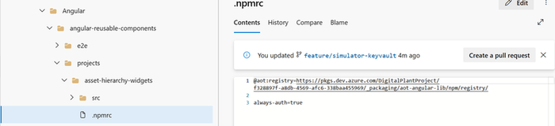

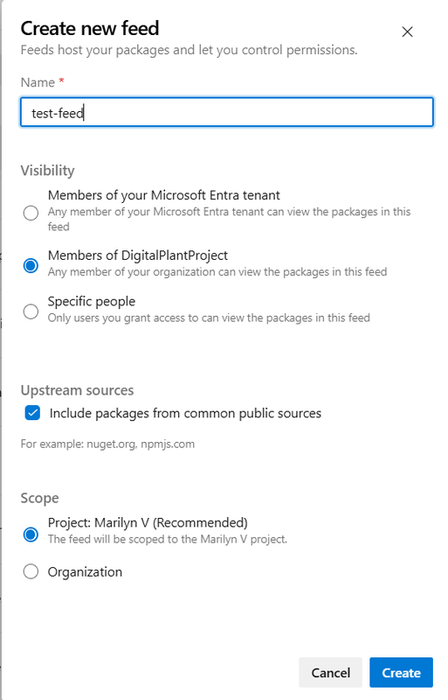

6.  

| **Component** | **Azure Pipeline File Path** |
| --- | --- |
| Hostapp Widget Demo | Consumption/UI/Common/Components/Angular/angular-reusable-components \&gt;\&gt; host-app-widgets |
| Asset Hierarchy Widgets Demo | Consumption/UI/Common/Components/Angular/angular-reusable-components/projects/asset-hierarchy-widgets |
| Smart KPI Widgets Demo | Consumption/UI/Common/Components/Angular/angular-reusable-components \&gt;\&gt; smart-kpis-widgets |
| Template Viewer Widgets Demo | Consumption/UI/Common/Components/Angular/angular-reusable-components \&gt;\&gt; template-viewer-widgets |

## 

# UI Deployment 

**Prerequisites**

Widgets must be deployed.

**Application Deployment**

All UI components are found under the following Repository structure: Consumption/UI.

| **UI Component** | **Description** |
| --- | --- |
| 2D SVG Builder | 2D SVG Builder is an independent React application where users can upload SVG files exported from Figma. Users can configure the 2D schematics by linking files and mapping assets. |
| Twin Builder UI | Twin Builder UI is an independent React Application for 3D CMS and Unity builder app. |
| Twin Viewer UI | Twin Viewer UI is a Micro-frontend app for Unity Visualizer and has integrated the Twin Viewer app into the Host App. |
| MAP MFE UI | Map MFE is a 2D/3D globe visualization micro-frontend application that has been integrated into the host application. |
| SVG Viewer MFE | This is an MFE which can be used to view the configured SVGs and view KPI count, color details and its data. |
| Component-configuration-micro-app | This is a Micro-frontend app. It is a type of navigation component. Using this, the user can see the applications that are accessible to them. The user can also navigate to the applications by clicking on them. |
| Header-micro-app (Header and Menu) | This is the header micro frontend app that has tabs based on user permissions and helps the user to switch between applications. |
| Intelligent-advisor-config-app | This is the micro frontend application used for creating a KPI and predictive failure insight. |
| Intelligent-advisor-micro-app | This pipeline deploys the following IA components: - Insight generation engine - Collaboration - Actions - Advisor panel - Insight Viewer template - Insight lifecycle management |
| Intelligent-advisor-template-viewer-micro-app | This app displays insights-related information based on the details specified in the corresponding specific template. Get the required custom npm package before building the application. - \"@aot/smart-kpis-widgets\": \"\^0.4.1\", - \"@aot/template-viewer-widgets\": \"0.0.3\", |
| Operations-Hierarchy-entity-viewer-micro-app | With this app, an end user can configure the Entity Viewer through the template and visualize the 360-degree information on the UI. |
| Operation-Hierarchy-entity-viewer-template-upload-micro-app | This app is used for the OH Entity Viewer Template Upload Config UI, which is used for preconfiguring data for assets that are viewed as part of Entity Viewer UI. It also performs various operations like uploading the template, downloading the latest available template, and viewing the information associated with the uploaded templates. |
| Operations-Hierarchy-micro-app | Operations Hierarchy is a component of IAI that helps the user to navigate through the plant\'s hierarchy and view 360-degree information associated with each node (Entity). |
| People Management UI | People Management Configuration is part of the PM module that focuses on the management of Departments, Roles, and Users. |
| Reports-micro-app | The Reports MFE is one of the IAI components that will enable different types of users - from shop floor workers to top management - to view Reports and analyze the parameters through real-time generated data, allowing the user to conduct an RCA and collaborate to resolve the problem. |
| Smart-kpi-config | This is a separate application used to configure the KPIs. |
| Smart-kpis-micro-app | Smart-kpis-micro-app is a micro-frontend application that is the landing page of the IAI application. It helps to track performance in the form of KPIs. Get the required custom npm package before building the application. \"@aot/smart-kpis-widgets\": \"\^0.6.6\" |
| HostApps | HostApp is the host application that is the container to host all other Micro-frontend apps. |

### Deployment Steps

1.  Navigate to the corresponding pipeline for the UI component.

2.  Create a variable group with the corresponding variables. Refer to [IAI_CDF_Deployment_Variable_List.xlsx](https://ts.accenture.com/:x:/r/sites/GlobalDocTemplates/Published%20Documents/AOT/Linked%20Files/AOT%20Deployment%20Guide/AOT_CDF_Deployment_Variable_List.xlsx?d=w507259b3e0594eeeb7ce6254e7d9eec7&amp;csf=1&amp;web=1&amp;e=IeJVVa) for the variables.

3.  Open the YML file that is in the specified format for the UI component.

4.  The variable groups used in the YML file of Azure DevOps Pipeline are categorized as below:

    a.  **Infrastructure Variable Group**: All the infrastructure-related values are included in this variable group.

    b.  **Global Variable Group**: The values that are commonly used across all components are included in this variable group.

    c.  **Component-Specific Variable Group**: The values that are specific to the component either BE or FE are included in this variable group.

> The complete list of variables is as follows:

| PROD-IAI-PM-FE-VARIABLE |
| --- |
| PROD-IAI-OH-FE-VARIABLE |
| PROD-IAI-SKPI-FE-VARIABLE |
| PROD-IAI-IA-FE-VARIABLE |
| PROD-IAI-HOSTAPP-VARIABLE |
| PROD-IAI-3D-FE-VARIABLE |

5.  Enable CORS for the app service as needed. We need to add respective origin URLs as shown in the [CORS (App Services)](#section-12) section and their corresponding pipelines.

### Deployment Details

The following tables provide the deployment details for the UI components.

#### Frontend Component

| **Description** | **Directory** **CORS - origin** |
| --- | --- |
| 2D SVG Builder | Consumption/UI/\-3d-ui-azure-pipelines.yml \&gt;\&gt; 2D SVG MFE Eg: [link](https://app-aot-ui-2d-builder-prod.azurewebsites.net) |
| 3D Visualizer | Consumption/UI/\-3d-ui-azure-pipelines.yml \&gt;\&gt; 3D Visualizer \- |
| MAP MFE UI | Consumption/UI/\-3d-ui-azure-pipelines.yml \&gt;\&gt; MAP MFE Eg: [link](https://aot.accenturedigitalplant.com) |

#### 2D and 3D Component

| **Description** | **Directory** **CORS - origin** |
| --- | --- |
| 2D Builder | Consumption/UI/\-configurator-ui-azure-pipelines.yml \&gt;\&gt; 2D Builder \- |
| 3D Builder | Consumption/UI/\-configurator-ui-azure-pipelines.yml \&gt;\&gt; 3D Builder \- |
| SVG Viewer MFE | Consumption/UI/svg-mfe/svg-iac/Application-deployment/\-azure-app-deployment-pipelines.yml Eg: [link](https://aot.accenturedigitalplant.com) |
| Twin Viewer UI | Consumption/UI/3D-Visualizer/3D-Visualizer-iac/Application-deployment/\-azure-app-deployment-pipelines.yml Eg: [link](https://aot.accenturedigitalplant.com) |

#### Host App Configurator

| **Description** | **Directory** | **CORS - origin** |
| --- | --- | --- |
| Component-configuration-micro-app | Consumption/UI/\-hostapp-ui-azure-pipelines.yml \&gt;\&gt; Component Configuration | Eg: [link](https://aot.accenturedigitalplant.com) |
| Header-micro-app (Header and Menu) | Consumption/UI/\-hostapp-ui-azure-pipelines.yml \&gt;\&gt; Header MicroApp | Eg: [link](https://aot.accenturedigitalplant.com) \ \ \ \ \ [link](https://app-peoplemanagementconfig-prod.azurewebsites.net) |
| Reports-micro-app | Consumption/UI/\-hostapp-ui-azure-pipelines.yml \&gt;\&gt; Reports Microapp | Eg: [link](https://aot.accenturedigitalplant.com) |
| HostApp | Consumption/UI/\-hostapp-ui-azure-pipelines.yml \&gt;\&gt; Hostapp | \- |

#### Intelligent Advisor Frontend Component.

| **Description** | **Directory** **CORS - origin** |
| --- | --- |
| Intelligent-advisor-config-app | Consumption/UI/\-ia-ui-azure-pipelines.yml \&gt;\&gt; IA Config \- |
| Intelligent-advisor-micro-app | Consumption/UI/\-ia-ui-azure-pipelines.yml \&gt;\&gt; IA Microapp E.g.: [link](https://aot.accenturedigitalplant.com) |
| Intelligent-advisor-template-viewer-micro-app | Consumption/UI/\-ia-ui-azure-pipelines.yml \&gt;\&gt; IA Template Viewer E.g.: [link](https://aot.accenturedigitalplant.com) |

#### OH and PM Frontend Component

| **Description** | **Directory** **CORS - origin** |
| --- | --- |
| Operations-Hierarchy-entity-viewer-micro-app | Consumption/UI/\-pm-ui-azure-pipelines.yml \&gt;\&gt; OH Entity Viewer E.g.: [link](https://aot.accenturedigitalplant.com) |
| Operation-Hierarchy-entity-viewer-template-upload-micro-app | Consumption/UI/\-pm-ui-azure-pipelines.yml \&gt;\&gt; OH Entity Viewer Template Upload \- |
| Operations-Hierarchy-micro-app | Consumption/UI/\-pm-ui-azure-pipelines.yml \&gt;\&gt; OH Microapp E.g.: [link](https://aot.accenturedigitalplant.com) |
| People Management UI | Consumption/UI/\-pm-ui-azure-pipelines.yml \&gt;\&gt; PM Config \- |

#### SmartKPI Frontend Component

| **Description** | **Directory** **CORS - origin** |
| --- | --- |
| Smart-kpi-config | Consumption/UI/\-skpi-ui-azure-pipelines.yml \&gt;\&gt; SKPI Config |
| Smart-kpis-micro-app | Consumption/UI/\-skpi-ui-azure-pipelines.yml \&gt;\&gt; SKPI Microapp E.g.: [link](https://aot.accenturedigitalplant.com) |

### 

## 

## Other Configurations

### 

## CORS (App Services)

CORS must be updated in all app services.

-   Go to Resource group \&gt;App service\&gt; API\&gt;CORS.

-   Add specific origin URLS as shown in the image.

-   Space must not be present before and after the origin URLs.

.\
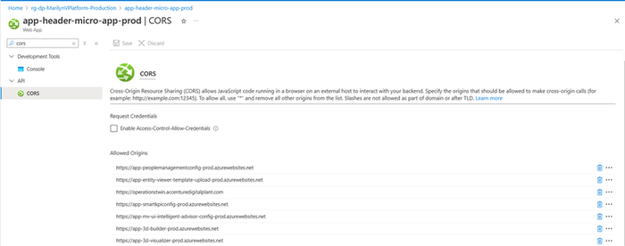

### CORS (APIM)

CORS must also be updated at the APIM level.

-   Navigate to Resource Group \&gt; APIM \&gt;APIS\&gt;All APIs

-   In \"All APIs\", go to Inbound processing.

-   From the three-dot menu, click \"Code editor\"

-   Add corresponding [CORS policy script](https://ts.accenture.com/:t:/r/sites/GlobalDocTemplates/Published%20Documents/AOT/Linked%20Files/AOT%20Azure%20Deployment%20Guide/AOT_Azure_APIM_CORS_Policy_Script.txt) to the Code editor and save it.\
    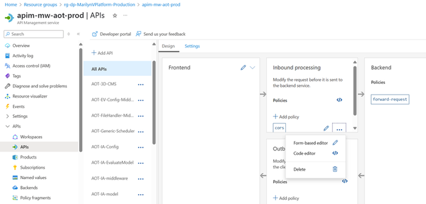

## 

## CORS (Storage Account)

CORS must be added to the 3d storage account.

-   Go to the Resource group\&gt;3d Storage account \&gt;Resource Sharing (CORS).

-   Add specific origin URLS as shown in the image.

-   Space must not be present before and after the origin URLs.

> 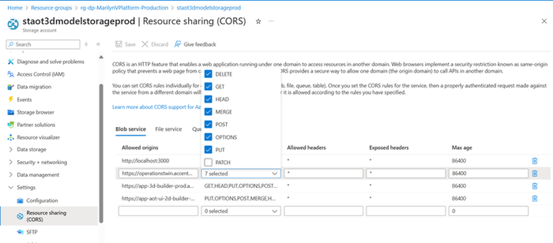

### APIM

Some microservices require APIM Integration. Ensure that the stage for doing this is present in the main YAML file.\
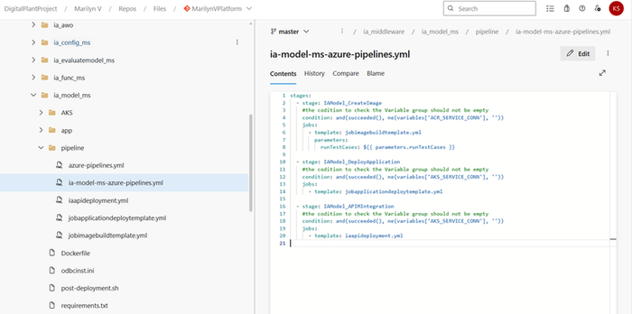

### 

## NSG

An NSG must be attached to the Subnet that is linked to AKS. The Port AKS that is used to contact the event hub should be included.

The Outbound and Inbound Rule assigned on the AKS node must also be assigned to the NSGs.

After the app is deployed, a custom URL can be mapped to the HostApp UI default URL if needed.

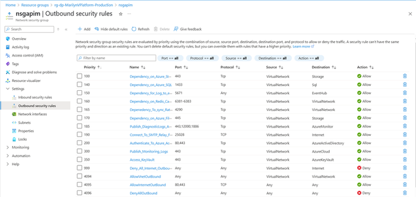

### Client Env 

In the client env, we need to run the system roles script which contains admin roles. One user is assigned admin role, and then this user can update the role for other users through PM UI. The path to find the script is:

IAI\\MarilynVPlatform\\Consumption\\DataAccess\\PeopleManagement\\Configuration\\pm_config_middleware\\pm_config_db\\pm_insert_data_system_roles.sql.

### AAD User Settings

Guest users have the same access as members (most inclusive) and the access must be enabled under user settings.

### HostApp Deployment

The applicationhost.xdt file must be added to the root folder manually by accessing the advanced tools in the app service during HostApp deployment in the wwwroot, which is a folder in the app service folder structure.

### Cosmos DB

We need to get the connection string from the Cosmos DB instance and make sure it is getting updated in the respective 3D backend variable group PROD-IAI-APP-GLOBAL-VARIABLE\

**Key Vault Configurations**

| Creation of key vault for simulator and extractor | For simulator: |
| --- | --- |
|  | - Create a key vault with the client ID and client secret, - Add the key vault name to the variable group used in the simulator release pipeline. - Once the simulator release is executed, it will automatically add the following to the key vault: - DPSConnectionString - SmartDevicesEnrollmentGroupKey - SmartDeviceSimulatorKey - IngestionIotHubConnectionString - Add the saskey of IoTHub in the above key vault. Note: The two endpoints have different saskey values. Use the service endpoint to get the required saskey Follow the same steps for the extractor, but for the IOT hub extractor variable group, update IOThubendpoints and root node name from CDF. |
| Getting the function secret value for the key vault | Encrypt the following value through the base64 encoder and put the encrypted value in the function secret in the key vault. \"\{\"clientidkey\":\"\\",\"clientsecretkey\":\"\\",\"scdfprojectkey\":\"\\",\"stenandidkey\":\"\\"\}\" |

### 

# 

## Interdependencies

The deployment of some IAI components depends on the configuration of other IAI components.

### People Management

| **\#** | **Pipeline** **Dependency** |
| --- | --- |
| 1 | IAI-AzureWebpubsub-ms-Deployment No Dependency |
| 2 | IAI-People Management -IAC-DB &amp; MS IAI-AzureWebpubsub-ms-Deployment should run first and then the service URL of Azure Web PubSub API must be updated in the library. |
| 3 | IAI-FileHandler-MS No Dependency |
| 4 | IAI-OperationsHeirarchy-Config-IaC-MS No Dependency |
| 5 | IAI-DataPermissionConfigMiddleware-MS No Dependency |
| 6 | IAI-EntityViewer-ConfigMiddleware-MS No Dependency |
| 7 | IAI_WorkOrder_Pipeline No Dependency |
| 8 | IAI-OperationsHeirarchy-Module-IaC-MS Dependent on the People Management Component |
| 9 | IAI-UnitOfMeasurement-Config-MS No Dependency |
| 10 | IAI-CommonServices-IotHubSimulator-Prod No Dependency |
| 11 | IAI-ControlTower-IoTHubExtractor-prod No Dependency |

### SmartKPI

| **\#** | **Pipeline** | **Dependency** |
| --- | --- | --- |
| 1 | IAI-Consumer-Smartkpis-datapermission-svc | Ensure that ports 10255 and 9093 are open for connections in VNet. Contributor access for the MongoDB and Storage Blob container |
| 2 | IAI-Middleware-SmartKPIConfig-ms | PM Dev team variable in the library needs to be updated related to Cognite data permissions and the Roles API |
| 3 | IAI-Middleware-Smartkpis-ms | PM Dev team variable in the library needs to be updated related to Cognite data permissions and the Roles API |
| 4 | IAI-SmartKPIS-CDF-Function | No Dependency |
| 5 | IAI-Consumer-KPI-Orchestrator-svc | Ensure ports 10255 and 9093 are open for connections in the VNet. Ensure that contributor access for the MongoDB and Storage Blob container is provided. Azure WebPubSub API |
| 6 | IAI-Computation-Engine | Ensure that contributor access for the MongoDB and Storage Blob container is provided. Azure WebSubPub API |

### Generic Scheduler

| **\#** | **Pipeline** **Dependency** |
| --- | --- |
| 1 | IAI-Generic-Scheduler Smartkpi pipelines have run. |

### Intelligent Advisor 

| **\#** | **Pipeline** **Dependency** |
| --- | --- |
| 1 | IAI-IntelligentAdvisor-CDF No Dependency |
| 2 | IAI-IA-Funct-APIM-MW 26 Timeseries should be created by Smart KPIs Dev Team |
| 3 | IAI-IA-MW-APIM-Deployment IA-Model, SQL DB server, Smartkpi API, Azure WebPubSub API, and People Management API |
| 4 | IAI-IA-Model-APIM-MW 26 Timeseries should be created by Smart KPIs Dev Team |
| 5 | IAI-IA-EvaluateModel-APIM Smartkpi API |
| 6 | IAI-Consumer-IA-Kpi-roleupdate-svc No dependency |
| 7 | IAI-IA-SAP-MW SAP instance |
| 8 | IAI-IA-AWO-MS Azure WebPubSub API and People Management API |
| 9 | IAI-IA-Config-APIM SQL DB server |

### 3D

| **\#** | **Pipeline** **Dependency** |
| --- | --- |
| 1 | IAI-3D-CMS No Dependency |

### POWERBI

| **\#** | **Pipeline** **Dependency** |
| --- | --- |
| 1 | IAI-PowerBI-MS No Dependency |
