

Industrial AI Foundation

Digital Twin Assistant

INTEGRATION GUIDE

Release Version: 2.5

**Metadata Table**

| **Field** | **Value** |
| --- | --- |
| **Asset / Solution Name** | Industrial AI Foundation / Digital Twin Assistant |
| **Domain / Area** | Digital Twin / Gen AI |
| **Owner (Team/Person)** | Tournier, Florian |
| **Reviewers** | Ranganathan, Balamurugan |
| **Status** | Draft / In Progress |
| **Confidentiality** | Internal / Confidential |
| **Source of Truth** | [Summary - Overview](https://dev.azure.com/DigitalPlantProject/Marilyn%20V) |
| **Related Assets / Alternatives** | Operations Hierarchy Deployment Guide, Operations Hierarchy API Reference |
| # | \{#section .TOC-Heading\} |

### Purpose 

This document provides detailed information on how to interact with the Digital Twin Assistant using GraphQL, including the structure of available queries, mutations, and their input and output parameters. The document covers authentication procedures, endpoint usage, and integration guidelines, ensuring that developers and integrators can seamlessly connect their applications to the IAI platform. Additionally, it offers best practices, troubleshooting tips, and examples to help users optimize their use of the GraphQL Mesh APIs for enhanced operational insights and decision-making within complex IT and OT environments.[]\{#_Toc171608331 .anchor\}

**Target Audience**

-   Software architects

-   Developers

-   Integrators with IT backgrounds.

### Prerequisites

-   Download and Install [Node.js](https://nodejs.org/)

-   Download and install [IntelliJ IDEA](https://www.jetbrains.com/idea/download/) (version: 2023.1.1)

-   Azure Repository Access - [ix-graphql-mesh-gateway - Repos](https://dev.azure.com/DigitalPlantProject/Marilyn%20V/_git/AOT-Graphql?path=%2Fix-graphql-mesh-gateway&amp;version=GBdevelop&amp;_a=contents)

-   An API testing tool such as Postman.

-   Access to Azure DevOps, Repos, and access tokens (reach out to Technical Contacts)

### Related Links

-   [GraphQL Official Documentation (v0)](https://the-guild.dev/graphql/mesh/docs)

-   [GraphQL Official Documentation (v1)](https://the-guild.dev/graphql/mesh/v1)

-   [GraphQL GitHub](https://github.com/ardatan/graphql-mesh)

-   [IAI Dev](https://operationstwin-dev2.accenturedigitalplant.com/home/globe)

-   [IAI Test](https://operationstwin-test.accenturedigitalplant.com/home/globe)

### Business Contacts

-   [florian.tournier@accenture.com](mailto:florian.tournier@accenture.com)

-   [laura.mosconi@accenture.com](mailto:laura.mosconi@accenture.com)

### Technical Contacts

-   [laura.mosconi@accenture.com](mailto:laura.mosconi@accenture.com)

-   [janos.puskas@accenture.com](mailto:janos.puskas@accenture.com)

-   [d.choukse@accenture.com](mailto:d.choukse@accenture.com)

### Glossary

| **Term** | **Definition** |
| --- | --- |
| GraphQL | A query language for APIs that enables clients to request exactly the data they need from a single endpoint. |
| REST | Representational State Transfer; a style of web architecture using multiple endpoints for resource access. |
| Endpoint | A specific URL where an API can be accessed by clients to perform operations or retrieve data. |
| OData | Open Data Protocol; a standard for building and consuming RESTful APIs that enables querying and updating data. |
| Schema Generation | The automatic creation of data structure definitions for APIs or databases. |
| Caching | Storing frequently accessed data temporarily to improve performance and reduce load times. |
| Logging | The practice of recording system activities and events for monitoring, troubleshooting, and auditing purposes. |
### Background

The assistant helps bridge the gap between raw data and meaningful, actionable insights by offering intuitive access to real-time status, historical trends, and operational parameters of digital twins. It is particularly valuable in domains such as manufacturing, energy, smart buildings, and industrial IoT, where system complexity and data volume demand a user-friendly and centralized interaction point.

### Key Benefits

-   Exact Data Requests: Clients can specify the exact fields they need.

-   Single Endpoint: Unlike REST, which typically requires multiple endpoints, GraphQL uses a single endpoint.

-   Efficient Fetching: Minimizes over-fetching and under-fetching of data by allowing clients to tailor their queries.

-   Version-less API: No need for versioning since the client decides what to ask for.

-   Simplicity: Knowledge about the complex API structure is not needed to retrieve the required data.

-   Rapid Prototyping: Prototyping becomes quicker and more efficient since you do not have to go under the hood of your API for minor changes.

### Capabilities

-   Search and Discovery: OData, Open API, REST API, Data sources, Schema generation, Filtering, Caching, Renaming and Merging

-   Logging

-   Secure Secrets Management

-   Error management

-   Role-based Access Control

-   Rich set of connectors to integrate with different data sources

## 

# GraphQL Mesh

GraphQL Mesh takes data from a wide array of different formats and integrates them with GraphQL so they can be modified with GraphQL queries and mutations. It supports GraphQL, gRPC, OpenAPI/Swagger, JSON, OData, SOAP/WSDL, MySQL, MongoDB, PostgreSQL, SQLite and Apache Thrift. The GraphQL Mesh API enables connecting and mapping between such multiple systems by only using different queries instead of using different APIs. Furthermore, the developer can modify the output schemas, link types across schemas and merge schema types. Custom GraphQL types and resolvers can also be added as per requirements.

### Authentication and Authorization

The GraphQL Mesh API requires authorization using a Bearer Token (Access token) to secure access to its resources.

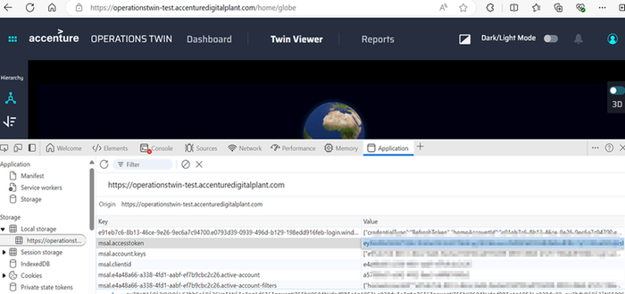

**Including the Bearer Token in API Requests**

-   To access protected endpoints of the GraphQL API, include the access token in the Authorization header of your HTTP requests.

-   Format the header as Bearer \.

-   Replace \ with the actual access_token.

**Handling Authorization Errors**

The API responds with an HTTP 401 Unauthorized error when an invalid or expired JWT token is provided. Check and retry with the correct/valid token.

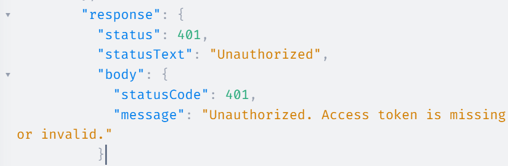

### 

## Installation

1.  Install Nodejs version 20 and set up the environmental variables.

2.  Install Postman.

3.  Clone the Git Repository into the local and choose any IDE of your choice.

4.  Get access to the Azure DevOps and Git Repos.

5.  Go to the IDE, e.g., Visual Studio, where you have cloned the Git repo, and go into the branch folder.

    a.  Branchname: aot-graphql-gateway

    b.  Foldername: ix-graphql-mesh-gateway

6.  Execute the following 2 commands in the VS /terminal.

    a.  Cmd 1: yarn install -- This will read all the dependencies(dependency: Package.json)

    b.  Cmd 2: yarn run start -- This gives the internal servers and sources available along with the HTTP link which redirects to GRAPHQL MESH.

> 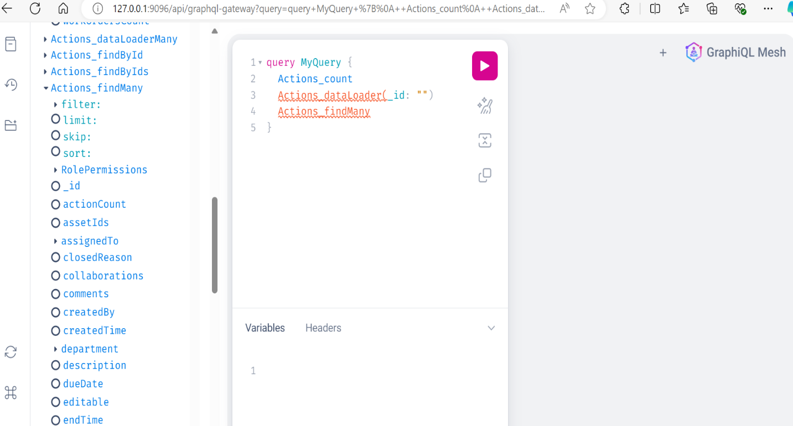

7.  Copy the HTTP URL , paste it into the Postman window, and check how things are working.

8.  In the Postman when you hit the link and click on Query, it displays the result as shown in the figure below.

9.  Package installation:- \'@graphql-mesh/migrate-config-cli\' and the command for installation is \'yarn add \@graphql-mesh/migrate-config-cli\'

10. Then run the command \'npx mesh-migrate-config\'.

> 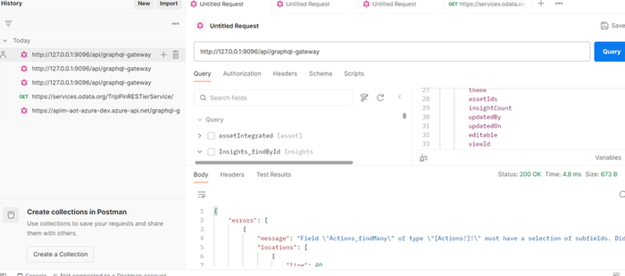
### 

## Query Structure

GraphQL queries are structured in a nested format that mirrors the relationship between the objects in the schema.

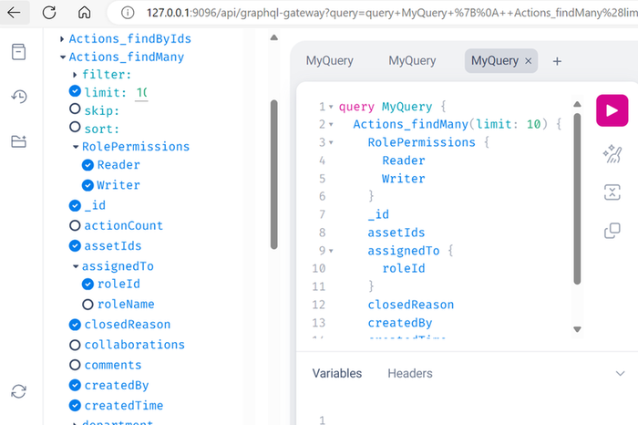

Here the type is Query and the field is Asset_findMany which in turn has different parameters/arguments for filtering, sorting, etc.

The configuration can be viewed in the meshrc.yaml file. The following image shows the file opened in the IDE.

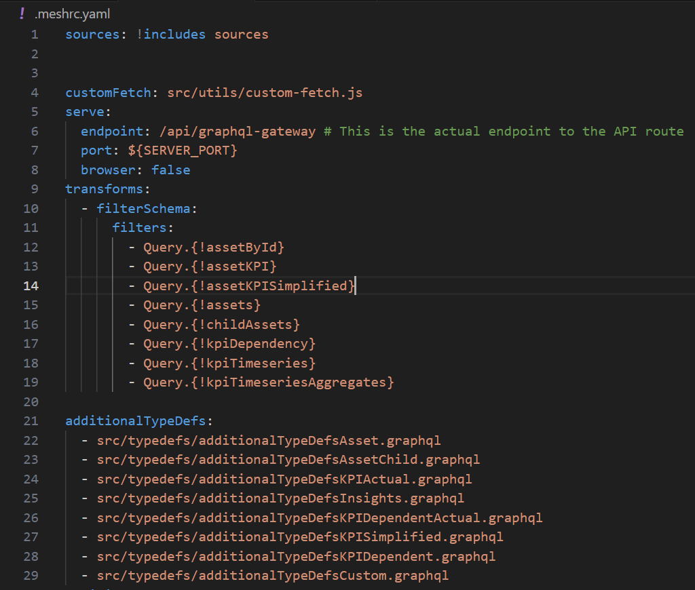

In this yaml file, there is an endpoint: /api/graphql-gateway which acts as a gateway to connect with the other applications and other source systems. Below is the .env file where all the admin details are available such as username, password, sourcesystems, portno., and browser.

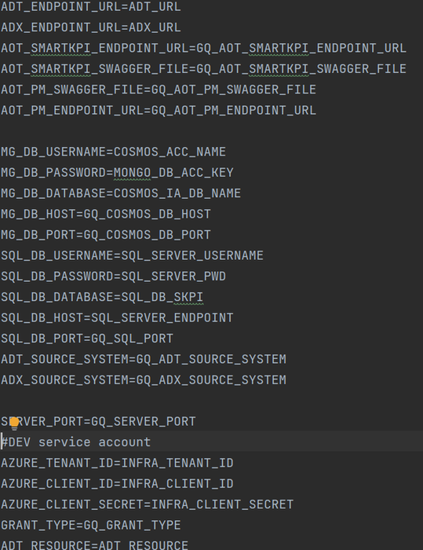

Different source systems such as adt, adx, cosmosdb, aot_pm, aot_smartkpi are available.

These files show the information about the handlers, the type, field, parameters/arguments, method(GET, POST), etc.

The following figure shows the adt.yml file.

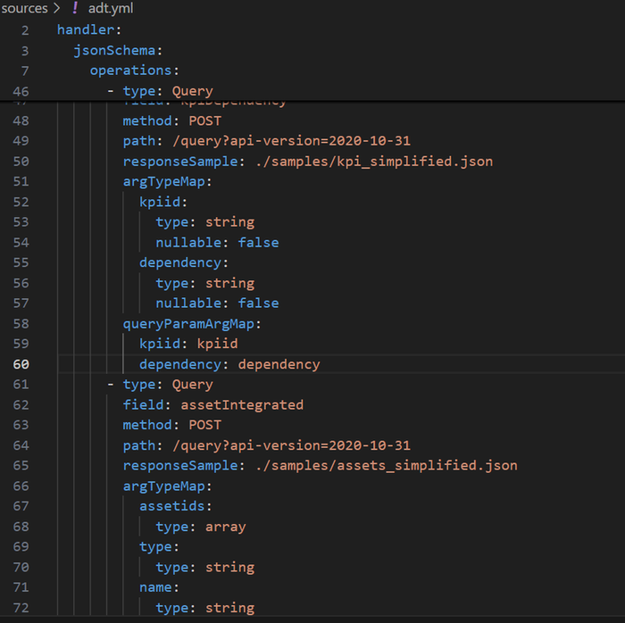

In the above example, the POST method is used, where the responses are fetched from the mentioned path. The components (folders and files) of the query structure are described further in the below table.

| **Folder/File** | **Description** |
| --- | --- |
| mesh (folder) | This folder contains configurations and plugins related to GraphQL Mesh. GraphQL Mesh is used to expose different APIs as a unified GraphQL schema. Inside this folder, different handlers, resolvers, or configuration files define how external services are mapped to GraphQL. Flow: Mesh configurations may call services/APIs defined in other folders (like src or Sources), integrate them, and transform them into GraphQL APIs. |
| example-queries (folder) | This folder contains sample GraphQL queries or requests. It contains .graphql files with example queries that developers can use to test the GraphQL Mesh integration. Flow: These queries are run against the GraphQL API provided by the mesh, often for testing or demonstration purposes. |
| node_modules (folder) | This folder contains all the installed dependencies from npm or yarn. It provides all the packages required by your project, such as GraphQL Mesh, database connectors, and utilities. Flow: Dependencies from package.json are loaded and executed when needed by the project code (usually by the code in src or the mesh configuration). |
| samples (folder) | This folder contains sample data or configurations for testing and reference purposes. It could include example files, test cases, or sample APIs used during development. Flow: These files would be referenced for testing the functionalities of GraphQL Mesh or other APIs. |
| Sources (folder) | This folder contains the API source definitions or configurations. It uses GraphQL Mesh, the Sources folder might define the API endpoints, or other back-end services that are mapped into GraphQL using mesh. Flow: Mesh reads these source definitions to expose them through a unified GraphQL schema. |
| src (folder) | This is where the main application code resides. You\'ll find the core business logic of your project here. It might contain the GraphQL Mesh resolvers, services, or other logic used to define the behavior of the APIs. Flow: Your GraphQL resolvers or logic live here, which directly interacts with the APIs defined in the Sources folder. |
| swagger (folder) | This folder contains Swagger documentation files (OpenAPI specification). Swagger is often used to describe REST APIs. Flow: If you have REST APIs that you\'re mapping to GraphQL, the Swagger documentation defines the API schema that Mesh might use to automatically convert REST endpoints into GraphQL resolvers. |
| .env (file) | The .env file contains environment variables. It likely stores sensitive information such as API keys, database connection strings, and credentials in a secure way. Flow: Throughout your code, these environment variables are accessed to provide dynamic values. For example, process.env in Node.js will refer to variables stored here. |
| .meshrc.yaml (file) | This is the configuration file for GraphQL Mesh. It defines the API sources, plugins, handlers, and transformations for exposing different data sources as a GraphQL schema. Flow: This file controls how Mesh behaves. It reads from Sources and other folders and converts the defined APIs into GraphQL, based on the configuration set in this file. |
| dockerfile (file) | The Dockerfile is used to containerize your application. It contains the instructions for building a Docker image of your application, including the installation of dependencies and setting up the runtime environment. Flow: When you build and run this Dockerfile, it packages your application, so the project can be deployed in a containerized environment. |
| ix-graphql-mesh-gateway-values.yaml (file) | This file contains additional configuration for setting up the GraphQL Mesh Gateway. It could define API routing, security rules, or additional mesh configurations. Flow: This file is used by Mesh to set up the gateway, which is the entry point to expose the combined APIs. |
| package.json (file) | This file defines the project\'s dependencies, scripts, and metadata (name, version, and entry point). Flow: It lists all the npm/yarn packages that your project depends on, as well as scripts that can be executed (e.g., for starting the app or running tests). It\'s a central piece of any Node.js project. |
| readme.md (file) | The README file provides information about the project. It contains documentation on how to set up and run the project, as well as any other useful details for developers. Flow: This file is static and doesn\'t affect the actual code execution, but it\'s essential for understanding the project. |
| yarn.lock (file) | This file locks the specific versions of the packages that your project uses. Flow: It ensures that everyone working on the project has the same versions of dependencies installed when running yarn install. |
### Gateway

The GraphQL Gateway serves as the central query orchestration layer between GenAI clients and various source systems in the digital twin ecosystem. It acts as a unified access point, abstracting the complexity of heterogeneous data sources and providing a developer-friendly, schema-driven interface for querying and managing digital twin-related data.

At the front end, the GenAI client interacts with the GraphQL Gateway through natural language inputs, which are translated into structured GraphQL queries. These queries are dynamically constructed to retrieve contextually relevant information from underlying systems.

The GraphQL Gateway routes the incoming queries to the appropriate source systems. Each system is integrated through an appropriate handler or connector based on its API interface.

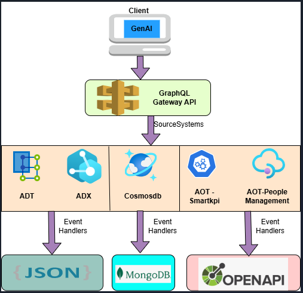

#### Source Systems

| Source System | Dev Env |
| --- | --- |
| ADT |  |
| ADX |  |
| cosmosdb | [cosmos-mongo-db-aot-azure-dev - Microsoft Azure](https://portal.azure.com/#@accenturedigitalplant.com/resource/subscriptions/9ea60d9d-0b63-493e-9ca6-ada9a643c79b/resourceGroups/rg-aot-azure-dev/providers/Microsoft.DocumentDB/databaseAccounts/cosmos-mongo-db-aot-azure-dev/dataExplorer) |
| sqldb | [sql-hostapp-aot-azure-dev - Microsoft Azure](https://portal.azure.com/#@accenturedigitalplant.com/resource/subscriptions/9ea60d9d-0b63-493e-9ca6-ada9a643c79b/resourceGroups/rg-aot-azure-dev/providers/Microsoft.Sql/servers/sql-hostapp-aot-azure-dev/networking) |
| Aot (smartkpi) |  |
| Aot (People Management) |  |
#### Specifications

| PROTOCOL | HTTP |
| --- | --- |
| DEV ENDPOINT URL |  |
| QA ENDPOINT URL |  |
| METHOD | POST |
| CONTENT TYPE | application / json |
| HEADER PARAM VALUE | Authorization: Bearer \ |
#### Result

| HTTP Code | Result Description |
| --- | --- |
| 200 | Service executed successfully |
#### Error Management

| HTTP Code | Error Code Error Description |
| --- | --- |
| 400 | Bad Request Bad Request |
| 401 | Unauthorized Unauthorized. Invalid access token or claim |
| 404 | Not Found Resource not found |
### 

## APIs

The following APIs are involved:

-   Insights API: This API is used to retrieve item revisions from MongoDB. It supports queries such as findMany with arguments like limit, skip, and sort, as well as findByIds to fetch specific items based on their identifiers.

-   Actions API: This API allows users to perform and manage various actions related to the data or system. Details about its specific operations and parameters can be found in the subsequent pages of the documentation.

-   ADT API: The ADT API provides access to and management of Abstract Data Types within the system. It facilitates operations such as creation, retrieval, updating, and deletion of data structures.

-   ADX API: This API enables advanced data exchange capabilities, supporting integration and communication between different components or external systems.

The specifications for each of the above APIs is included on the pages that follow.

#### Insights API

This API facilitates the retrieval of item revisions from MongoDB. It is designed to fetch specific items based on various parameters and arguments. The query, arguments, and parameters are as follows. Note that the blanks in certain columns are intended, as values are not applicable/needed in those cases.

##### SourceSystem

MongoDB

| Query | Arguments |
| --- | --- |
| Insights_findMany | limit, skip, sort |
| Insights_findByIds | id\*, limit, sort |
| Insights_findById | Id\* |
| Insights_countby | groupBy Insights_count |
##### Input Header 

| Parameter | Description M/O Max Length Type |
| --- | --- |
| authorization | Value of the Access Token \[e.g. Bearer \\] M-Public \- String |
##### Input Request

| Parameter | Description M/O Max Length Type |
| --- | --- |
| limit | param added for pagination. default max limit of record is100 O 2 Integer |
| skip | param added for pagination. offset start at 1 O 2 Integer |
| sort | param added for sorting condition. O String |
| groupBy | param added for group by assetIds/name etc for example groupBy: \[\"assetIds\"\] O String \*M/O -- Mandatory/Optional |
#### 

### Actions API

This API facilitates the retrieval of items revisions from MongoDB.

It is designed to fetch specific items based on various parameters/arguments.

##### Source System

MongoDB

| Query | Arguments |
| --- | --- |
| Actions_findMany | limit, skip, sort |
| Actions_findById | Id\* |
| Actions_countBy | groupBy |
| Actions_findByIds | Id\*, limit, sort |
| Actions_count | \- |
##### Input Header

| Parameter | Description M/O Max Length Type |
| --- | --- |
| authorization | Value of the Access Token \[e.g. Bearer \\] M-Public \- String |
##### Input Request

| Parameter | Description M/O Max Length Type |
| --- | --- |
| limit | param added for pagination. default max limit of record is100 O 2 Integer |
| skip | param added for pagination. offset start at 1 O 2 Integer |
| sort | param added for sorting condition. O \- String |
| groupBy | param added for group by assetIds/name etc for example groupBy: \[\"assetIds\"\] O \- String |
#### 

### **ADT** API

This facilitates the retrieval of item revisions from Azure Digital Twin.

It is designed to fetch specific items based on various parameters/arguments.

##### SourceSystem 

ADT

| Query | Arguments |
| --- | --- |
| assetById | assetids |
| assetKPI | assetid |
| assetIntegrated | assetids, type, roleId, name |
| assetKPISimplified | assetid, name |
| childAssets | parentAssetId, type |
##### Input Header

| Parameter | Description M/O Max Length Type |
| --- | --- |
| authorization | Value of the Access Token \[e.g. Bearer \\] M-Public \- String |
##### Input Request

| Parameter | Description | M/O | Type |
| --- | --- | --- | --- |
| assetids | This Param is used to filter based on assetid\'s for example:(assetId:\"C-B1-G1-R1-F1-P-WP1-W5\") | O | String |
| name | This Param is used to filter based on name for example :(name:\"Bagg\") | O | String |
| roleId | This Param is used to fetch roles based on roles added in the query | O | String |
| type | This Param is used to filter based on the type for example: (type:\"Line\") | O | String |
#### 

### **ADX** API

This facilitates the retrieval of item revisions from Azure Digital Twin.

It is designed to fetch specific items based on various parameters/arguments.

##### Source System

**ADX**

| Query | Arguments |
| --- | --- |
| kpiTimeseries | kpiid, start_time,end_time, limit, valueLt, valueGt |
| kpiTimeseriesAggregates | kpiid, start_time,end_time, limit |
##### Input Header

| Parameter | Description M/O Max Length Type |
| --- | --- |
| authorization | Value of the Access Token \[e.g. Bearer \\] M-Public \- String |
##### Input Request

| Parameter | Description M/O Max Length Type |
| --- | --- |
| Kpiid | This param used to filter based on Kpiid O \- String |
| start_time | This param is used to fetch the result from this start_time O \- String |
| end_time | This param is used to fetch the result from this end_time O \- String |
| limit | param added for pagination. The default max limit of record is 100 O 100 Long |
| valueLt | This param is used to give the result which are less than 70 O \70 Float |
#### 

## People Management

The plugin \"UseExtendContext\" is implemented using Envelop.

The plugin enables the cache at the context level to be accessible to all the APIs and email IDs.

-   Login and then use the PM API URL: .

-   Provide the respective token.

-   Take only the roleIds from the result and store them in the form of List. This list will be stored in the cache.

The below figure illustrates the roleIds in the form of a list and this is refreshed every 5 minutes (or as per the intervals specified).

> 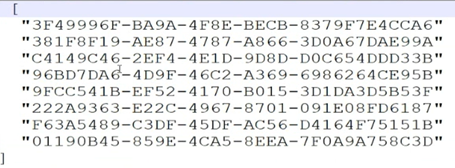
The following example shows the key and the values. Consider the example key as \"[d.chouske@accenture.com](mailto:d.chouske@accenture.com)\".

> 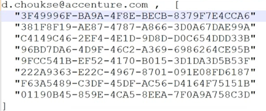
The authorization token is decoded by using the predefined function \"jwt.decode\".

The plugin \"useExtendContext\" is used to extend the plugin and fetch the User roleIds as shown in the images below.

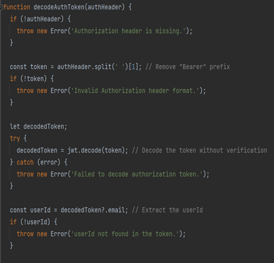

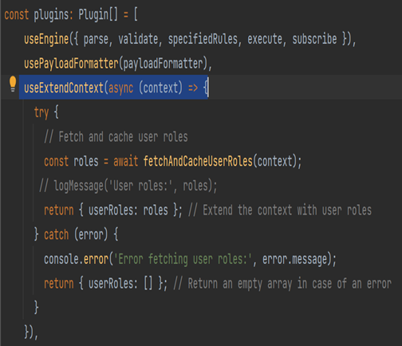

#### 

### Queries

To understand how querying is done, consider the example query \"Which role is responsible for this equipment\"?

-   When the query is done, the user role is fetched from the cache, and then all roles and default filters are also fetched from the context-level cache.

-   If any filters have been specified, then the API hits the arg filter along with other default filters.

-   The API iterates the map function and formats it to get all the roles.

-   The response is per the specified filter. If no filter is specified, then the response is per the default filters.

The following images depict this process.

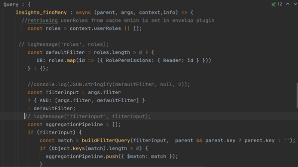

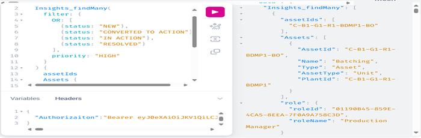

### 

## SmartKPIs

This API is obtained from the Aot-Azure/Swagger file, and the endpoint URL is .

The Deviation API is fetched using this API.

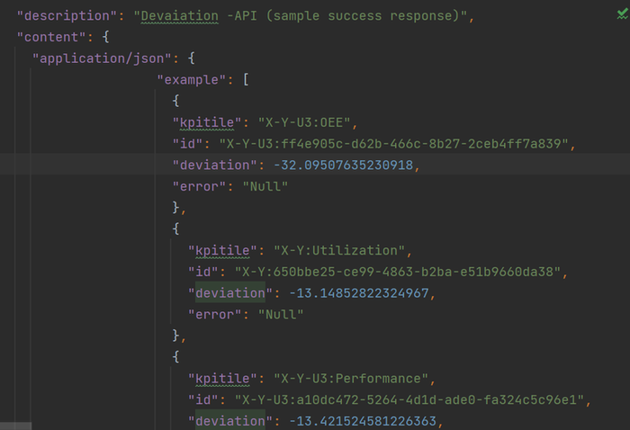

The following figure illustrates the example \"Which KPI had the worst performance for this asset in the last couple of days?\" .

#### Query

  --------------------------------------------------------------------------------------------------------------------------------------------------------------------------------------------------------------------------------------------------------------------
  -------------------------------------------------------------------------------------------------------------------------------------------------------------------------------------------------------------------------------------------- -----------------------

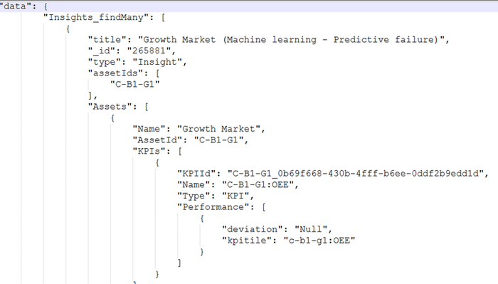

## Migration Options

### GRAPHQL v 0.x

#### Configuration changes

-   Built-in gateway

-   No longer generates executable javascript code in .mesh folder

-   Bare mode

-   Supports meshrc.yaml and .meshrc.json format

#### Deployment

> Use https handler under .mesh to deploy the gateway

#### Packages

> \@graphql-mesh/cli

#### Source handlers

> \@graphql-mesh/\*

### GRAPHQL v 1.x

#### Configuration changes

-   Need to set up Hive gateway

-   Need to build a GRAPHQL SDL for Hive gateway

-   Wrap mode

-   Support mesh.config.js and mesh.config.ts

#### Deployment

> Hive gateway runtime uses web standards (WHATWG Fetch API) for both http client and handling server side.

#### Packages

> \@graphql-mesh/compose-cli and \@graphql-hive/gateway

#### Source handlers

> \@omnigraph/\*
