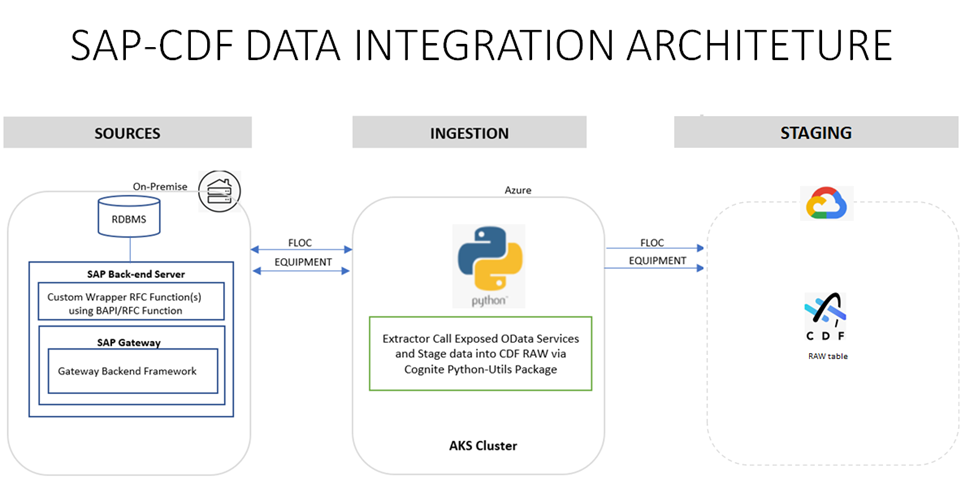
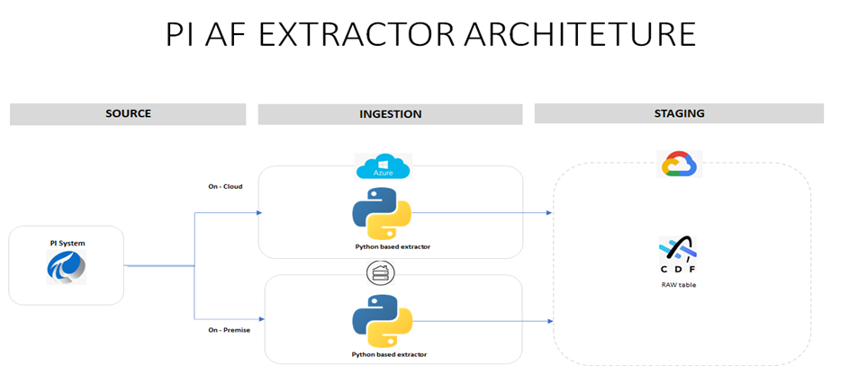
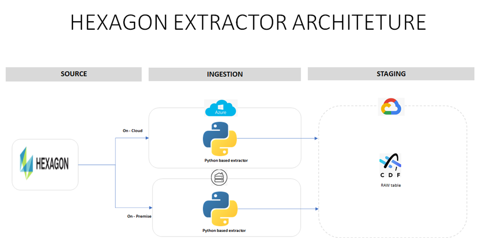
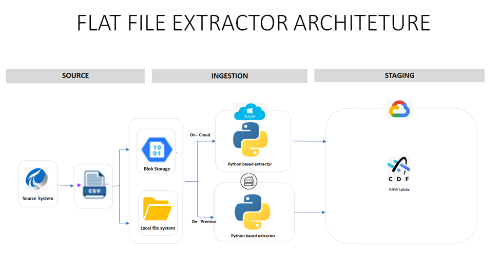

Industrial AI Foundation

EXTRACTORS

ARCHITECTURE BLUEPRINT

Release Version: 2.5

**Metadata Table**

| **Field** | **Value** |
| --- | --- |
| **Asset / Solution Name** | Industrial AI Foundation / Data Integration Accelerators |
| **Domain / Area** | Extractors / Data Processing |
| **Owner (Team/Person)** | Tournier, Florian |
| **Reviewers** | Joshi, Rishabh |
| **Status** | Published / Complete |
| **Confidentiality** | Internal / Confidential |
| **Source of Truth** | [Summary - Overview](https://dev.azure.com/DigitalPlantProject/Marilyn%20V) |
| **Related Assets / Alternatives** | IAI Extractors Getting Started 
|  |

## Introduction

Industrial AI Foundation (IAI) is a collection of software accelerators and tools that can be assembled to deliver client solutions. IAI accelerates the integration of product, process, and live data from disparate informational (IT) and operational (OT) systems, creating a comprehensive and contextualized view of operations to enable better decisions and optimized processes.

IAI includes configurable extractors -- also known as data integration accelerators -- that are designed to extract data from a client source system into Cognite Data Fusion (CDF) RAW. The extractors, which contain reusable code developed with the Cognite Custom Extractor framework, can be readily deployed either in the cloud or on-premises. The source system stores both information technology (IT) and operational technology (OT) data such as asset hierarchy, work order, real-time series, diagrams, and 3D models on the client side. If there is a change in the Asset hierarchy information from the source system, the client can request to extract information to get the latest data. By changing the configuration information in the build, the client can trigger the instance of the application so that the requested asset hierarchy information can be extracted and saved in CDF staging tables.

Built using combinations of Microsoft Azure Services, Cognite\'s Extractor Framework, and Python, IAI\'s Extractors can be triggered as needed to pull data from client source systems (SAP PM, PI AF, Hexagon, AVEVA, Bentley) and then push it into CDF RAW. Cognite Python SDKs or other Extract, Transform, and Load (ETL) tools such as Azure Data Factory (ADF) could also be used to develop a custom extractor to pull data from other unsupported source systems.

Features include extended configurations through config files, a timer mechanism to pull data at specified intervals, validations, and exception handling. The extractors are packaged as a service so they can be readily deployed either on-cloud or on-premises for client implementation.\

**Target Audience**

-   Solution Architect

-   Business Analyst

-   Technical Architect

-   Asset Delivery teams

### Purpose 

This overview document describes the architectural design of the data integration accelerators that are currently in production.

### Related Links

-   [DevOps Wiki](https://dev.azure.com/DigitalPlantProject/Marilyn%20V/_wiki/wikis/Marilyn-V.wiki/1571/Extractors)

-   [Cognite API](https://docs.cognite.com/api/v1/)[Cognite RAW](https://docs.cognite.com/cdf/integration/guides/extraction/raw_explorer/)

-   [Release Notes](https://industryxdevhub.accenture.com/assetdetails/45)

### Contacts

-   [rishabh.b.joshi@accenture.com](mailto:rishabh.b.joshi@accenture.com)

-   [hanuman.prasad.gali@accenture.com](mailto:hanuman.prasad.gali@accenture.com)

### Glossary

| **Term** | **Definition** |
| --- | --- |
| ADF | Azure Data Factory |
| CDF | Cognite Data Fusion, a platform used for integrating, managing, and consuming industrial data. |
| OData | Open Data Protocol, a standard protocol for creating and consuming RESTful APIs. |
| SAP PM | SAP Plant Maintenance, a module in SAP used for managing maintenance activities in industrial plants. |
| Asset Hierarchy | A structured representation of assets, typically showing parent-child relationships and dependencies. |
| PI AF | PI Asset Framework, a system for organizing and contextualizing PI System data. |
| RAW tables | Database tables within Cognite Data Fusion used for storing unprocessed data. |
| Hexagon SDx | A digital platform for managing engineering information and asset data, part of Hexagon\'s suite of industrial solutions. |
| Smart Plant Foundation | An enterprise-level solution for managing plant engineering data, provided by Hexagon. |
| TAG | A unique identifier used to link and classify design properties or assets in industrial data systems. |
| RESTful API | An application programming interface that adheres to the principles of Representational State Transfer, enabling interaction with web services. |
| Extractor | A software component or tool that retrieves and processes data from a source system for integration. |
| Azure Services | Cloud-based computing services provided by Microsoft Azure, used for hosting and managing various applications. |

## 

# SAP PM Extractor

In this extractor, custom packages are installed on [SAP PM](https://help.sap.com/docs/SAP_ERP_SPV/61f8c51bfee94fa78c8835db685249eb/b97cb6535fe6b74ce10000000a174cb4.html?version=6.18.11) to create Open Data Protocol (OData) Services on the source system and those services are used by extractors to extract Work Order and Asset Hierarchy data. The extractor is based on Python and Cognite Extractor utilities and is typically hosted in the cloud using Azure services. The extractor uses an optional timer-based mechanism that can make it run at intervals specified in the configuration file. Its extraction pipeline functionality notifies specified users of successful and failed pipeline runs on CDF UI.

**Figure**: SAP-CDF Data Integration Architecture

## 

# PI AF Extractor

In this extractor, [OSI\'s](https://docs.osisoft.com/bundle/pi-server/page/pi-asset-framework-and-pi-system-explorer.html) PI batch request APIs are used to get user-provided details about the root asset. IAI extractors extract the PI AF data, transform it into data that CDF can consume, and then push the data to CDF RAW tables. The extractor is based on Python and Cognite Extractor Utilities and is typically hosted on Azure Services. Its extraction pipeline functionality notifies specified users of successful and failed pipeline runs on CDF UI.

**Figure**: PI AF Extractor Architecture

## 

# Hexagon Extractor

In this extractor, [Hexagon\'s](https://hexagon.com/) API services provide access to data hosted on a Hexagon SDx or Smart Plant Foundation site. The configurable access is processed through RESTful APIs that are provided in a standardized format using the OData. TAGS are used as unique identifiers and every design property is linked to a TAG. This results in Tag-to-Tag level classification rather than a parent-child relationship.

The user specifies all necessary parameters (hexagon_asset_hierarchy_endpoint, hexagon_token_endpoint, targeted SDx server, client_id, client_secret, grant_type, scope, resource, destination) that enable the extractor to read the correct endpoint from the SDx server. This extractor is based on Python and Cognite Extractor Utilities and is typically hosted on Azure Services.

**Figure**: Hexagon Extractor Architecture

## 

# 

## Flat File Extractors

Flat file extractors extract the CSV file from Azure Blob Storage or a local file system based on different optional parameters given by the user (client) in the config file. The user specifies all necessary parameters in the configuration file that help the extractor pick the correct file from the Blob Storage or local file system. Based on Python and Cognite\'s Extractor Utilities and hosted on Azure Services, this extractor uses an optional timer-based mechanism, which, if configured, keeps checking for files in the Blob or Local directory at the configured interval. Its extraction pipeline functionality notifies specified users of successful and failed pipeline runs on CDF UI.

**Figure**: Flat File Extractor Architecture

## 

# Availability Matrix

The table below summarizes the IAI Data Integration Accelerators that are currently available for both source systems and flat files.

| Data Source/Format | ADF Pipeline Cognite Python SDK/Utils Enhancements Packaging |
| --- | --- |
| PI AF | Flat File, API Call Timer, Validations Cloud, On-prem |
| SAP PM | API Call Flat File, API Call Timer, Validations Cloud, On-prem |
| Hexagon | Flat File, API Call Timer, Validations Cloud, On-prem |
| SAP PM Work Order | Flat File, API Call Timer, Validations Cloud, On-prem |
| Flat File | API Call Timer, Validations Cloud, On-prem |
