

Industrial AI Foundation

Flat File Extractor

DEPLOYMENT GUIDE

Release Version: 2.5

**Metadata Table**

| **Field** | **Value** |
| --- | --- |
| **Asset / Solution Name** | Industrial AI Foundation / Data Integration Accelerators |
| **Domain / Area** | Data Processing |
| **Owner (Team/Person)** | Tournier, Florian |
| **Reviewers** | Joshi, Rishabh |
| **Status** | Published / Complete |
| **Confidentiality** | Internal / Confidential |
| **Source of Truth** | [Summary - Overview](https://dev.azure.com/DigitalPlantProject/Marilyn%20V) |
| **Related Assets / Alternatives** | IAI Extractors Architecture Blueprint, IAI Extractors Getting Started 
|  |

## Introduction

Industrial AI Foundation (IAI) is a collection of software accelerators and tools, including extractors, which can be assembled to deliver client solutions. IAI accelerates the integration of product, process, and live data from disparate IT and OT systems, creating a comprehensive and contextualized view of operations to enable better decisions and optimized processes.

IAI extractors automate and streamline data extraction from enterprise systems to Cognite Data Fusion (CDF) RAW.

IAI\'s Flat File Extractor is used to extract Asset Hierarchy data from one or more CSV files that have been fetched from either blob or local storage. It processes and transforms the extracted data to a format that Cognite recognizes before pushing that data to CDF RAW. IAI\'s Flat File Extractor also provides users the flexibility to pre-configure multiple source systems, root assets, and other required details in a configuration file. A pipeline is used for both containerizing the extractor and running it on an Azure Kubernetes Cluster.

### Purpose

This document explains how to extract data from the source system and load it into CDF RAW using the Flat File extractor. It covers the prerequisites for deploying the Extractor and provides step-by-step instructions for configuring and deploying it either in the cloud or on-premises. After reading the document, a developer should be able to configure and run the Extractor and verify the data flow from the source system to CDF.

###  Target Audience

This guide is designed for use by developers with the following skills:

-   Cognite Data Fusion

-   SonarQube

-   Azure Pipeline creation

### Contacts

-   [hanuman.prasad.gali@accenture.com](mailto:hanuman.prasad.gali@accenture.com)

-   [rishabh.b.joshi@accenture.com](mailto:rishabh.b.joshi@accenture.com)

### Related Links

-   [How to create an Azure Pipeline](https://docs.microsoft.com/en-us/azure/devops/pipelines/create-first-pipeline?view=azure-devops&amp;tabs=javascript%2Ctfs-2018-2%2Cbrowser)

-   [How to create a Release Pipeline](https://docs.microsoft.com/en-us/azure/devops/pipelines/release/?view=azure-devops)

[Release Notes](https://industryxdevhub.accenture.com/assetdetails/45)

### Glossary

| Term | Definition |
| --- | --- |
| SonarQube | A tool used for continuous inspection of code quality, focusing on static code analysis to detect bugs, code smells, and security vulnerabilities. |
| Azure Pipeline | A cloud-based service in Azure DevOps for building, testing, and deploying code automatically to support continuous integration and delivery (CI/CD). |
| Release Pipeline | An automated process that manages deployments of applications across different environments, ensuring controlled and consistent releases. |
| CDF (Cognite Data Framework) | A data infrastructure used to centralize, manage, and process raw and structured data, often serving as the backbone for data extraction and analytics platforms. |
| Blob Storage | A scalable cloud storage solution for storing large amounts of unstructured data, such as files, logs, or images. |
| Wildcard Characters | Special symbols used in file names or search queries to represent one or more unspecified characters, enabling flexible matching and filtering. |
| Exception Handling | The process of managing errors or unusual conditions that may occur during software execution, ensuring system stability and user notifications. |
| On-premises | A deployment model where applications or services are hosted within an organization\'s own infrastructure rather than in the cloud. |

## Features

IAI\'s Flat File Extractor has Extraction pipeline functionality to get an overview of successful and failed pipeline runs in CDF. On every run, the extractor sends a detailed Success/Failure message about the run and notifies the list of contacts configured about the status. It also features:

-   User configurable based on the business needs

-   The timer option allows automatic operation on a configurable interval

-   Built-in validations and exception handling simplify the configuration

-   Multiple Blob Storages/Local File System locations can be configured

-   Multiple file names can be configured to be extracted

-   Supports Wildcard characters/Expressions for filtering files by their name

-   Supports multiple CDF RAW tables/sources

As explained in the sections that follow, the extractor can be deployed either in the cloud or on-premises with little user effort.

## 

# Cloud Deployment

Two pipelines are needed to deploy the Flat File Extractor to an AKS Cluster. This section includes step-by-step guidance for:

-   Configuring the Azure DevOps environment.

-   Creating a Build Pipeline for Dockerizing the Extractor Package.

-   Creating a Release Pipeline for deploying the Docker image to the AKS cluster.

-   Validating in CDF RAW if the RAW table has the right data.

### Prerequisites

-   The [Lens](https://k8slens.dev/) app is needed for validation.

-   A cloud subscription must exist with the following:

    -   Azure license/subscription to create resources for implementation

    -   Azure DevOps repository for extractor code and pipeline files

    -   Azure service connections for SonarQube and Container Registry

    -   Namespace in the AKS cluster for environments

    -   Kubernetes Service Connection for AKS Cluster

    -   Sonar project name and key

### Configure the Environment

1.  Create an Azure Key Vault.

2.  Add the following secrets in the Azure Key Vault created in the previous step:

-   **ClientID**: Provide the Client ID for Cognite Data Fusion (CDF).

-   **ClientSecret**: Provide the Client Secret for CDF.

-   **FlatFileStorageAccConStr1:** Provide the Connection String of the Azure Storage Account.

-   **FlatFileStorageAccKey1**: Provide the Account Key for Azure Storage Account.

> 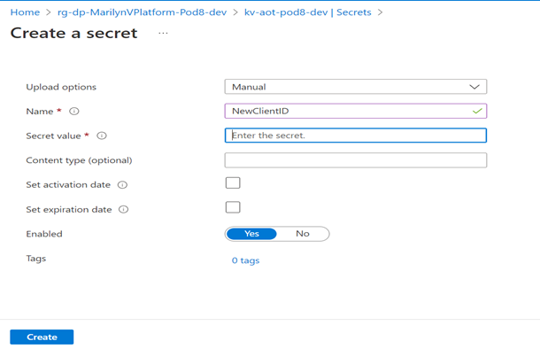
>
> 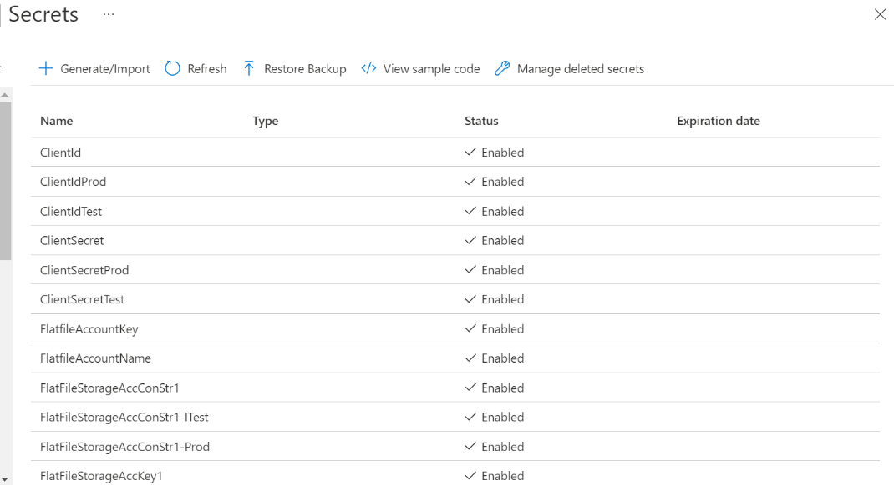
3.  Create a key vault library in Azure DevOps and add the secrets created in the previous step.

> 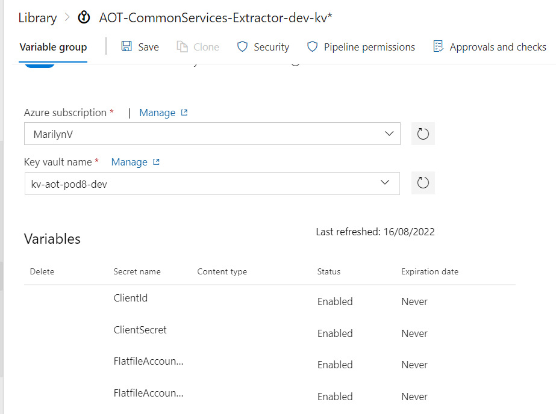
4.  Create a Library/Variable Group in Azure DevOps with the following parameters:

> 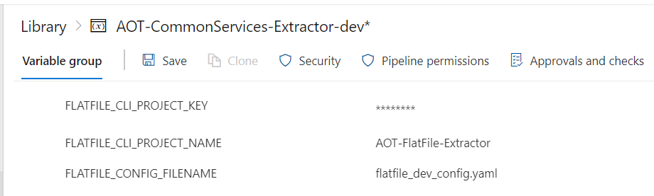
| **Parameter** | **Description** |
| --- | --- |
| COGNITE_HOST | Provide the host details for CDF. |
| COGNITE_PROJECT | Provide the project name for CDF. |
| SCOPES | Provide the scopes for CDF. |
| TENANT_ID | Provide the tenant ID for CDF. |
| FLATFILE_CONFIG_FILENAME | Provide the configuration filename that is used to run the extractor. The filenames are environment-specific e.g., flatfile_config_dev.yaml, flatfile_config_itest.yaml, and flatfile_config_prod.yaml |
| CONTAINER_REGISTRY_SERVICE_CONNECTION | Provide container registry service connection for build and release pipeline. |
| SONARQUBE_SERVICE_CONNECTION | Provide service connection for SonarQube. |
| FLATFILE_CLI_PROJECT_KEY | Provide SonarQube project key for Flat File extractor. |
| FLATFILE_CLI_PROJECT_NAME | Provide SonarQube project name for Flat File extractor. |
| 5. | Navigate to the pipeline file location \"Source/Extractors/FlatFile-Extractor/pipeline/Dev/azure-pipelines.yml\" and ensure that the pipeline is referring to the libraries created in the previous steps. &gt; 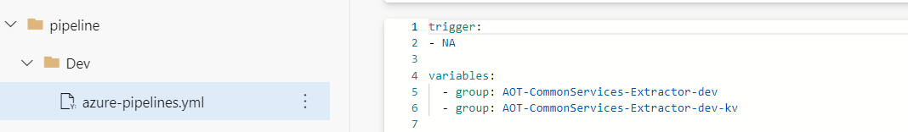
|  |
| 6. | Configure the following parameters in the configuration file for the Flat File Extractor: |
| A. | Provide the timer value in seconds to schedule the extractor. &gt; 
|  |
| B. | Provide mandatory Cognite-related config parameters: &gt; 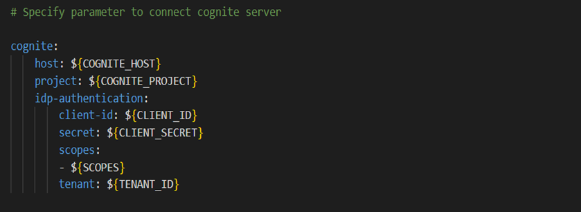
|  |
| **Mandatory Parameter** | **Description** |
| host | Use the hostname for CDF added in the Azure DevOps library in earlier steps. |
| project | Use the project name for CDF added in the Azure DevOps library in earlier steps. |
| idp-authentication. client-id | Use the client ID for CDF added in the Azure DevOps key vault library in earlier steps. |
| idp-authentication. secret | Use the client secret for CDF added in the Azure DevOps key vault library in earlier steps. |
| idp-authentication. scopes | Use the scopes for CDF added in the Azure DevOps library in earlier steps. |
| idp-authentication. tenant | Use the tenant ID for CDF added in the Azure DevOps library in earlier steps. |
| C. | As shown below, provide the Blob (Azure Storage Account) related config file parameters: | **Parameter** | **Description** | **Optional(O)/Mandatory(M)** |  | --- | --- | --- |  | blob.connect_str | Use the connection string of the Azure Storage Account added in the Azure DevOps key vault library in earlier steps. | M |  | blob.account_name | Provide the name of the Azure Storage Account. | M |  | blob.account_key | Use the Account Key of the Azure Storage Account added in the Azure DevOps key vault library in earlier steps. | M |  | blob.container | Provide the container name from the Azure Storage Account, where the CSV file is being uploaded. | M |  | file_name | Provide the filename or a regular expression for filtering files by their name. This provided filename will be picked from the blob container. For example: | M |  |
|  |  |  | - file_name: cog\* (It will pick all files starting with \'cog\') |  |  |
| | | | - file_name: File_name (It will pick with specified file name) | | | archive.archive_destination | Provide the container name where the files can be archived once it gets uploaded in CDF. This parameter is only used in the case of blob storage. | O | | extraction_type.file_extraction_type | Provide the type of file extraction. It can have two values: ALL/LATEST. Based on this parameter it would be decided if the latest file should be picked from blob based on the expression provided in the filename or if all files should be picked. Default value: LATEST. | O | | insertion_type.data_insertion_type | Provide the type of data insertion. It can have two values: TRUNCATE/INSERTION. Based on this parameter it would be decided if the data in CDF should be inserted or truncated from the existing table and create a new table. Default value: TRUNCATE. | O | | key-column | Provide the unique column name present in the data. | M | | env | Provide the environment name where the extractor will run. It can have three values: dev, prod, and unittest. Dev and prod are used for running the extractor in the specified environment whereas unittest is required for testing using pytest. | M | | destination.database | Provide a database name in CDF where the table would be created. | M | | destination.table | Provide a table name where asset hierarchy data will be uploaded. | M | &gt; 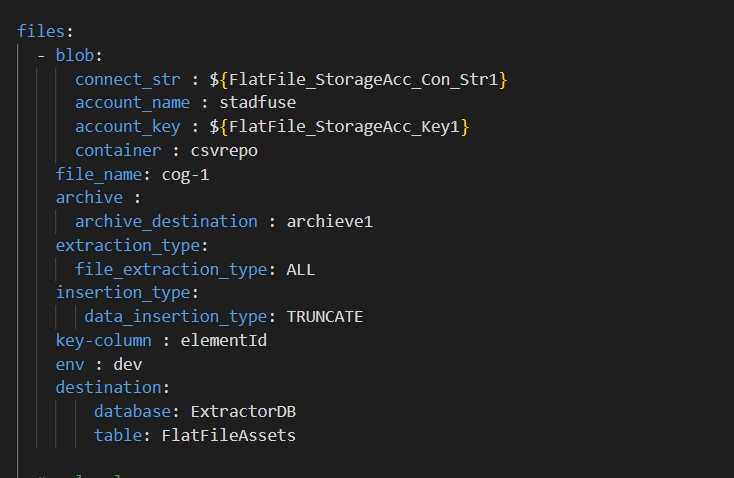
D. |
| E. | Extraction pipeline-related config parameters |
| **Parameter** | **Description** **Optional(O)/Mandatory(M)** |
| datasetexternal_id | Provide the External id of the Dataset in Cognite data fusion (CDF). M |
| dataset_name | Provide the name of the Dataset in CDF. M |
| external_id | Provide external id of CDF extraction pipeline. M |
| ep_name | Provide the name of the CDF extraction pipeline. M |
| contacts.name | Provide the name of the contact to whom the extraction pipeline notification should be sent. O |
| contacts.email | Provide the email of the contact to whom the extraction pipeline notification should be sent. O |
| contacts.sendnotification | Provide notification value. If the send notification value is true, then mail is sent to the respective mail Id else no mail is sent. O &gt; 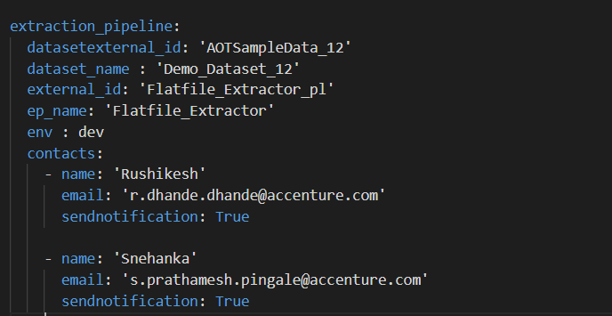
|  |

### Create a Build Pipeline

The Build Pipeline is used to Dockerize the Extractor Package. The artifacts created here are used in the release pipeline for deployment. To create a build pipeline:

1.  Navigate to Azure DevOps, select Pipelines, and then select *New Pipeline*.

> 
2.  

3.  Select *Azure Repos Git.*

4.  Select the Repository Name that contains the Flat File Extractor code and pipeline files.

> 
5.  Select \'Existing Azure Pipelines YAML file\'.

    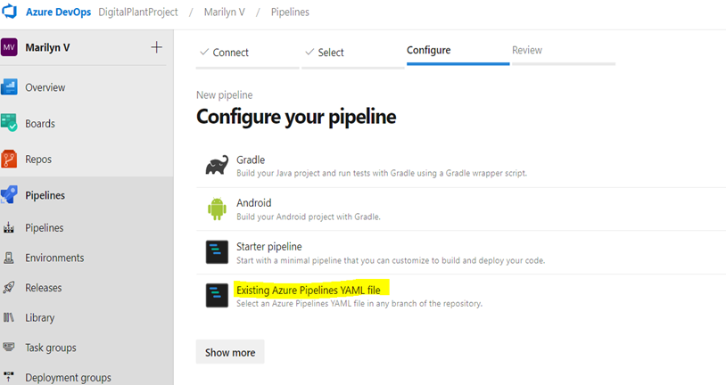

6.  

7.  Select Branch and provide the pipeline file path as \"Source/Extractors/FlatFile-Extractor/pipeline/Dev/azure-pipelines.yml\" and then select *Continue***.**

8.  Review and save.

    

9.  Run the pipeline and wait for its successful completion.

> 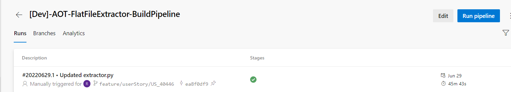

### Create a Release Pipeline

The Release pipeline deploys the Docker Image of the Flat File Extractor created by the build pipeline to the AKS Cluster. To create the Flat File Extractor release pipeline:

1.  Create a release pipeline with two tasks for AKS Cluster.

    -   task with delete command

    -   task with create command

2.  Update the value of the service connection for the AKS cluster in the tasks.

> 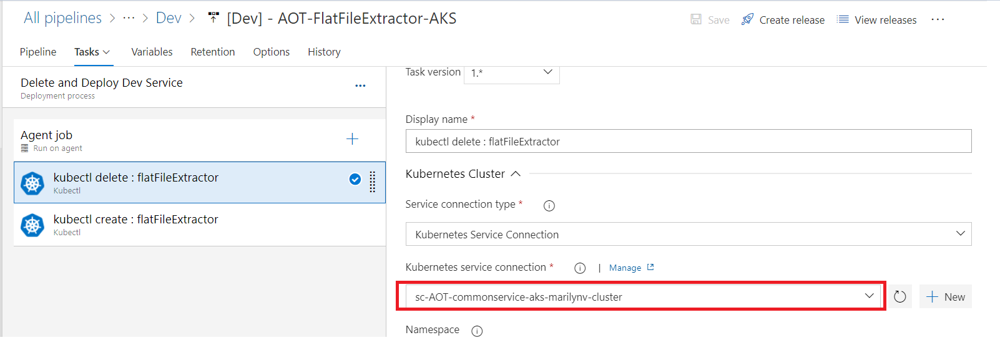
3.  

4.  Update the AKS file location in the tasks.

> 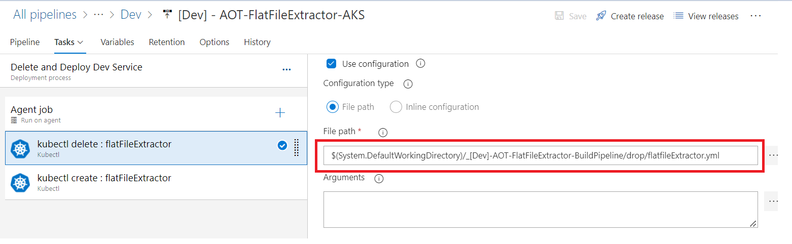
5.  If this is the first run, then disable the delete task from the pipeline.

> 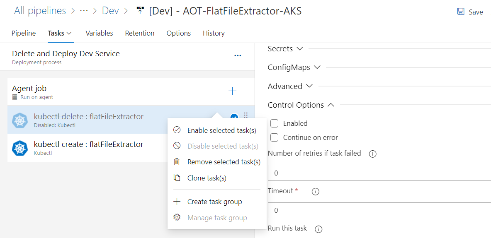
6.  Create a release from the release pipeline created in the previous step.

> 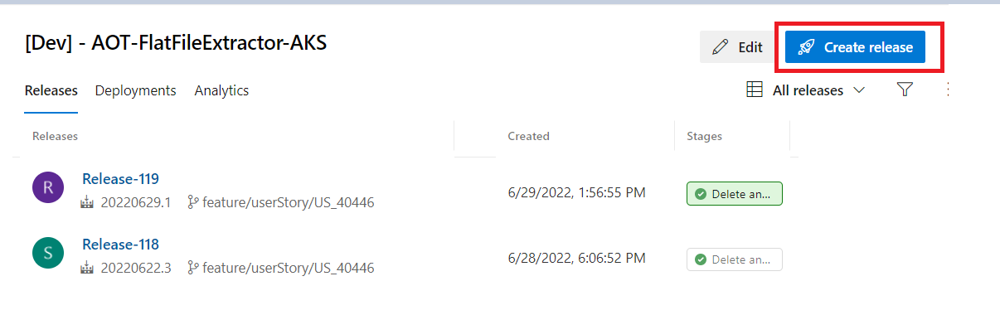
7.  Once the release is completed, confirm successful deployment on Azure DevOps.

> 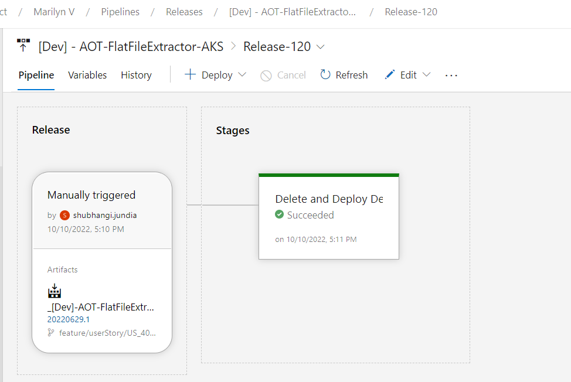
8.  After deployment is complete, validate successful deployment to the AKS cluster in the Azure portal.

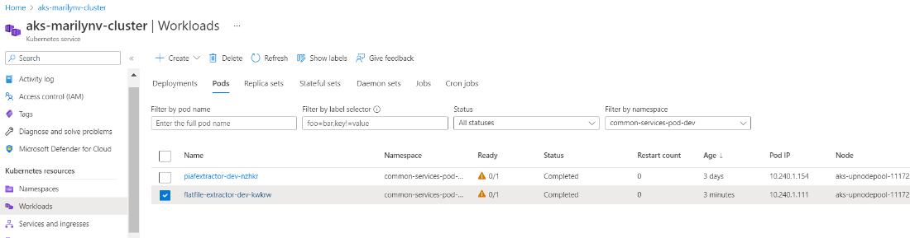

9.  Validate Flat File Extractor logs on the [Lens](https://k8slens.dev/) app.

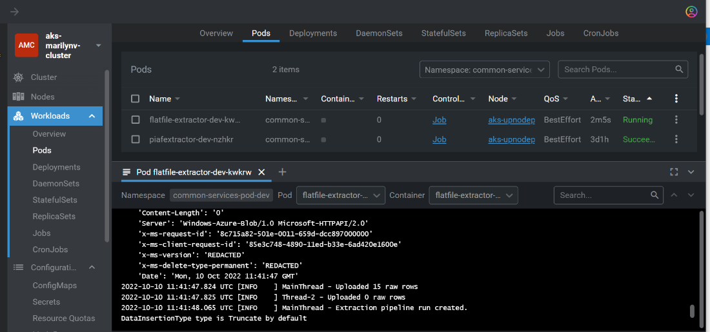

10. If everything looks good and the AKS POD is created, enable the delete task that was previously disabled.

> 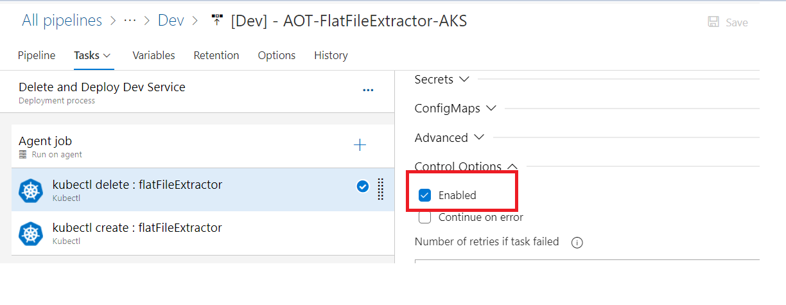
11. 

12. Validate the creation of the database and the table with asset hierarchy data on the CDF portal.

> 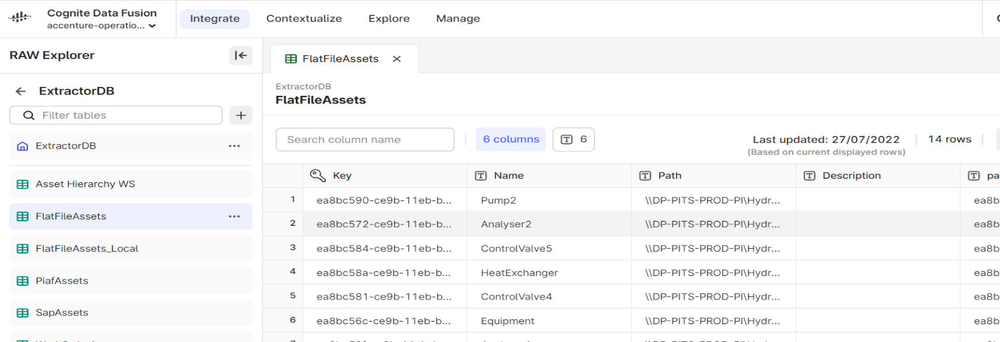
13. When the deployment is complete, an extraction pipeline is created in CDF based on the details provided in the configuration file. A Success/Failure message is presented on the CDF portal, and another notification is sent to the email address that was specified in the configuration.

> 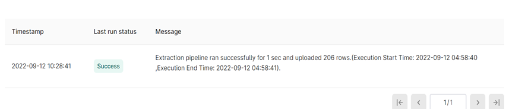

## 

# On-Prem Deployment

IAI\'s Flat File Extractor Windows Service was created to give users the option of deploying the extractor on-premises. A batch script runs the commands required for the installation. The Flat File Extractor extracts asset hierarchy data from one or more CSV files present either locally or on the Azure Storage Account and inserts it into CDF RAW.

### Prerequisites

-   Install python (version 3.9 or later)

-   Store CSV files locally or on Azure Storage Account

### Install the Extractor

1.  Edit flatfile_config.yaml file to update the following:

A.  Add the path of a log file to store extractor logs.

> 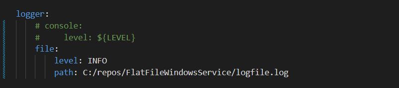
B.  Add timer value in seconds to schedule the extractor.

> 
C.  Add the mandatory details for Cognite.

| **Parameter** | **Description** |
| --- | --- |
| host | Provide the hostname for Cognite data fusion (CDF) |
| project | Provide the project name for CDF |
| idp-authentication. client-id | Provide the client Id for CDF |
| idp-authentication. secret | Provide the client secret for CDF |
| idp-authentication. scopes | Provide the scopes for CDF |
| idp-authentication. tenant | Provide the tenant Id for CDF |
| D. | Add details related to the extraction pipeline. |
| **Parameter** | **Description** **M/O** |
| datasetexternal_id | Provide the external Id of the dataset in CDF M |
| dataset_name | Provide the name of the dataset in CDF M |
| external_id | Provide external Id of CDF extraction pipeline M |
| ep_name | Provide the name of the CDF extraction pipeline M |
| contacts.name | Provide the name of the contact to whom the extraction pipeline notification should be sent. O |
| contacts.email | Provide the email of the contact to whom the extraction pipeline notification should be sent. O |
| contacts.sendnotification | Provide notification value. If the send notification value is true, then mail is sent to the respective mail Id else no mail is sent. O E. |
| F. | Add configuration details for the Azure blob storage account. Provide the blob-related config file parameters only when CSV files have been uploaded to the Azure Storage Account. In the table below, the third column labeled M/O indicates whether a parameter is mandatory or optional. &gt; 
| **Parameter** | **Description** | **M/O** |  | --- | --- | --- |  | blob.connect_str | Use the connection string of the Azure Storage Account added in the Azure DevOps key vault library in earlier steps | M |  | blob.account_name | Provide the name of the Azure Storage Account | M |  | blob.account_key | Use the Account Key of the Azure Storage Account added in the Azure DevOps key vault library in earlier steps | M |  | blob.container | Provide the container name from the Azure Storage Account, where the CSV file is being uploaded | M |  | file_name | Provide the filename or a regular expression for filtering files by their name, which needs to be picked from the blob container. For example: | M |  |
|  |  |  | - file_name: cog\* (It will pick all files start with \'cog\') |  |  |
|  |  |  | - file_name: File_name (It will pick with specified file name) |  |  | archive.archive_destination | Provide the container name where the files can be archived once it gets uploaded in CDF. This parameter is only used in the case of blob storage. | O |  | extraction_type.file_extraction_type | Provide the type of file extraction. It can have two values: ALL/LATEST. Based on this parameter the code should decide if the latest file should be picked from blob storage based on the expression provided in the filename or if all files should be picked. Default value: LATEST | O |  | insertion_type.data_insertion_type | Provide the type of data insertion. It can have two values: TRUNCATE/INSERTION. Based on this parameter it would be decided if the data in CDF should be inserted or truncated from the existing table and create a new table. Default value: TRUNCATE. | O |  | key-column | Provide the unique column name present in the data | M |  | Env | Provide the environment name where the extractor will run. It can have three values: dev, prod, and unittest. Dev and prod are used for running the extractor in the specified environment whereas unittest is required for testing using pytest. | M |  | destination.database | Provide a database name in CDF where the table would be created | M |  | destination.table | Provide a table name where asset hierarchy data will be uploaded | M |  |
| G. | If the target CSV files are stored locally, then provide the following details as well. &gt; 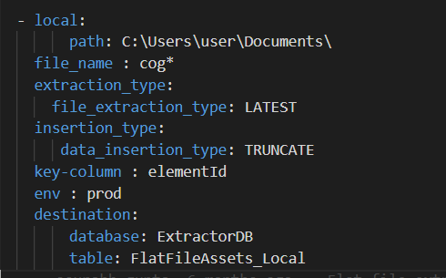
|  |
| H. | In the table below, the third column labeled M/O indicates whether a parameter is mandatory or optional. | **Parameter** | **Description** | **M/O** |  | --- | --- | --- |  | local.path | The absolute path of the folder containing the CSV files. | M |  | file_name | The filename or a regular expression for filtering files by their name, which needs to be picked from the local storage. For example: | M |  |
|  |  |  | - file_name: cog\* (It will pick all files that start with \'cog\') |  |  |
|  |  |  | - file_name: File_name (It will pick with specified file name) |  |  | extraction_type.file_extraction_type | Type of file extraction. It can have two values: ALL/LATEST. Based on this parameter the code decides if the latest file should be picked from local storage based on the expression provided in the filename or if all files should be picked. Default value: LATEST | O |  | insertion_type.data_insertion_type | Type of data insertion. It can have two values: TRUNCATE/INSERTION. Based on this parameter the code decides if the data in CDF should be inserted or should the existing table be truncated to create a new table. Default value: TRUNCATE | O |  | key-column | Provide the unique column name present in the data | M |  | env | Environment name where the extractor will run. It can have three values: dev, prod, and unittest. Dev and prod are used for running the extractor in the specified environment whereas unittest is required for testing using pytest. | M |  | destination.database | Database name in CDF where the table would be created | M |  | destination.table | Table name where asset hierarchy data will be uploaded | M |  |
| 2. | Edit the WSInstallation.bat file to add the absolute path of the Python folder and FlatFileWindowsService.py file as shown below. &gt; 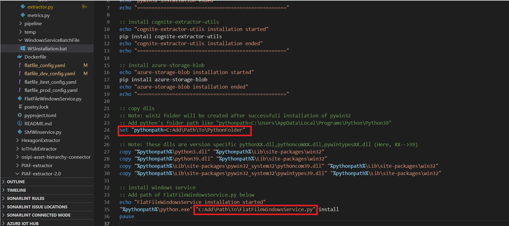
|  |
| 3. | To install the Flat File Extractor on the premise, right-click on *WSInstallation.bat* file and select *Run as Administrator*. All the required Python modules and Flat File extractor as a windows service are installed. |
| 4. | Verify following libraries are installed correctly in the system. |
| - | pywin32 module |
| - | cognite-extractor-utils module |
| - | pythonX.dll |
| - | pythonXX.dll |
| - | pythoncomXX.dll |
| - | pywintypesXX.dll &gt; 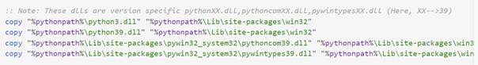
|  |

### 

## Start the Extractor

1.  Click the *Start* button and search for \"Services\" and select *Run as Administrator.*

> 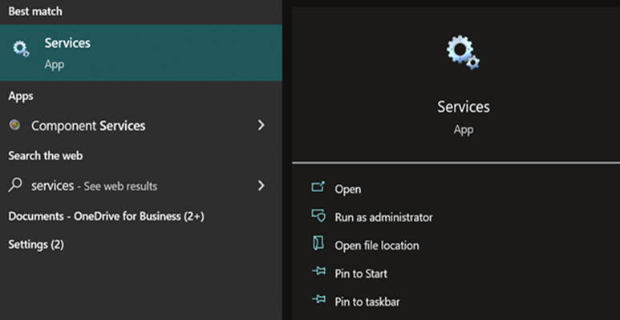
2.  Search for \"FlatFileExtractor\" service name, right-click on it, and select *Start*.

> 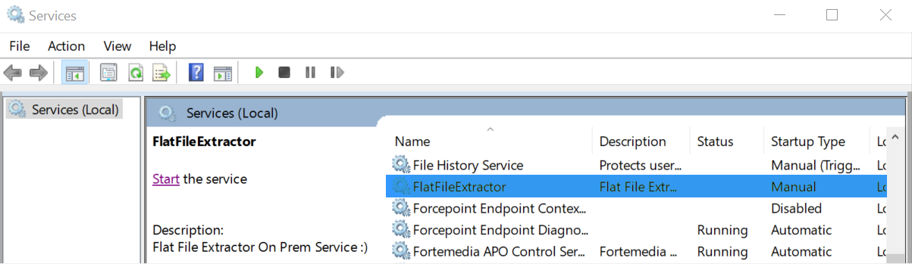
3.  Use the path in the configuration file to check the logs in the log file.

4.  Validate the creation of the database and tables with asset hierarchy data on the CDF portal.

5.  Validate the creation of the extraction pipeline with the success message on the CDF portal.

### Stop the Extractor

1.  Click the *Start* button, search for \"Services\", and select *Run as Administrator.*

> 
2.  Search for \"FlatFileExtractor\" service name, right-click on it, and select *Stop*.

> 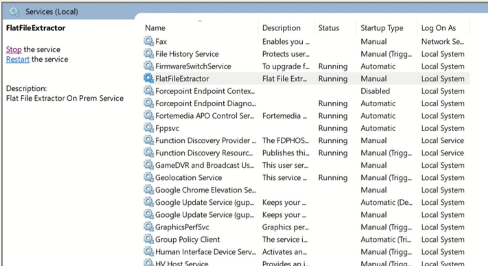
