

Industrial AI Foundation

Intelligent Advisor

DELIVERY GUIDE

Release Version: 2.5

**Metadata Table**

| **Field** | **Value** |
| --- | --- |
| **Asset / Solution Name** | Industrial AI Foundation / Intelligent Advisor |
| **Domain / Area** | Advisory / Decision Automation |
| **Owner (Team/Person)** | Tournier, Florian |
| **Reviewers** | Kumar Singh, Rajnish; Zoltani, Judit-Kinga |
| **Status** | Published / Approved |
| **Confidentiality** | Internal / Confidential |
| **Source of Truth** | [Summary - Overview](https://dev.azure.com/DigitalPlantProject/Marilyn%20V) |
| **Related Assets / Alternatives** | Intelligent Advisor UI Guide, Intelligent Advisor Delivery Guide 
|  |

## Introduction

Industrial AI Foundation (IAI) is a collection of software accelerators and tools, including Intelligent Advisor, which can be assembled to deliver client solutions. IAI accelerates the integration of product, process, and live data from disparate IT and OT systems, creating a comprehensive and contextualized view of operations to enable better decisions and optimized processes.

Intelligent Advisor (IA) is an IAI component and an AI-based solution that enables different types of users to focus on critical issues with real-time generated, prioritized, and contextualized Insights and recommendations. It combines the following functional components: Insight generation engine, collaboration, Actions, Advisor panel, Insight Viewer template, and Insight lifecycle management.

### Purpose

This document describes the end-to-end process of creating and maintaining Insight categories, configuring Insights, and defining Insight viewer templates. The document should be valuable to anyone who needs to generate and configure tailored Insights for a client.

###  Target Audience

-   Client Delivery Teams Leveraging IAI Intelligent Advisor

-   Asset Delivery Teams

-   Solution Architects, Technical Architects, Data Scientists, Data Engineers

### Preferred Skills

-   Cognite Data Fusion (CDF)

-   Python

-   Machine Learning

### Prerequisites

-   A business analyst (BA) from the IAI team must be engaged to define the requirements.

-   A customized spreadsheet from the BA is used to create the hierarchies described later in this guide.

-   Access to code is needed.

### Contacts

-   [judit-kinga.zoltani@accenture.com](mailto:judit-kinga.zoltani@accenture.com)

-   [rajnish.kumar.singh@accenture.com](mailto:rajnish.kumar.singh@accenture.com)

-   [lyecca.m.c.gallardo@accenture.com](mailto:lyecca.m.c.gallardo@accenture.com)

### Related Links

-   [Cognite Documentation](https://docs.cognite.com/cdf/air/)

-   [Micro Frontend Development Guide](https://industryxdevhub.accenture.com/assetdetails/48)

-   [IAI Documentation](https://industryxdevhub.accenture.com/asset-home;search_text=aot) [Release Notes](https://industryxdevhub.accenture.com/assetdetails/45)

### Glossary

| &gt; **Term** | &gt; **Definition** |
| --- | --- |
| &gt; Action | &gt; A work activity created to resolve a specific issue derived from an Insight. Assigned to the relevant user/role who resolves the issue and then closes the action. |
| &gt; Action Panel | &gt; Panel with all listed actions based on the Due date and sorted from the most urgent to the least urgent. |
| &gt; Advisor Panel | &gt; UI component that displays a sorted and prioritized list of all contextualized Insights. |
| &gt; IAI (Industrial AI Foundation) | &gt; A collection of software accelerators and tools, including Intelligent Advisor, assembled to deliver client solutions. Accelerates integration of product, process, and live data from disparate IT and OT systems for better decisions and optimized processes. |
| &gt; Asset | &gt; Any item, equipment, or system being monitored or analyzed for Insights and KPIs. |
| &gt; Business Analyst (BA) | &gt; Team member responsible for defining requirements and preparing customized spreadsheets for Insight category hierarchies and templates. |
| &gt; Cognite Data Fusion (CDF) | &gt; Platform used for generating and managing Insights, storing timeseries data, and integrating with Azure for deployment and execution of analytical models. |
| &gt; Evaluatemodel Microservice | &gt; Evaluates whether Insights need to be generated by consuming messages from ML Model and Smart KPI engines. |
| &gt; Generic Scheduler Microservice | &gt; Facilitates scheduling of tasks at specific intervals or dates. Triggers ML Model microservice and manages CRUD operations for scheduled tasks. |
| &gt; IA Middleware Microservice | &gt; API responsible for generating Insights, triggered by the EvaluationModel Microservice. |
| &gt; IA-config Microservice | &gt; Handles configuration for Insights based on Plant/Multiplant. Stores configurations in Azure DB. |
| &gt; Insight | &gt; Event/alert generated through prioritized and contextualized business logic, which helps the user gain a relevant understanding of that event, drill down into the RCA of that event, act, and collaborate on that issue until they close that Insight. |
| &gt; Insight Card | &gt; An Insight card is a tile from the Advisor panel. It is displayed individually for each Insight and with the Insight\'s respective information. |
| &gt; Insight Category | &gt; Used to classify Insights by theme and method of generation. Identifies different types of Insights in the Insight Factory. |
| &gt; Insight Category Hierarchy | &gt; Insight categories are organized into a Category Hierarchy. The hierarchy structure includes: Category name, Type, theme, sub-type, and Template. |
| &gt; Insight Configuration | &gt; Details are configured and defined for the different types of Insights in the backend. Examples include type of Insight (predictive maintenance, production optimization, etc.), assigned role, action by, priority, algorithm model output used, rules to trigger Insight, Insight viewer template, etc. |
| &gt; Insight Factory | &gt; The library of Insight categories -- contains the definition (structure) of all Insight categories that can be configured in IAI. |
| &gt; Insight Lifecycle Management | &gt; Defines the end-to-end journey of the Insight, from creation/generation to closure. Includes status tracking through action allocation, recommendations, and status changes, updating in real-time, and closing the Insight after all actions have been closed. |
| &gt; Insight Status | &gt; Reflects the stage that the Insight is in from creation to close. Statuses: New → Converted to Action → In Action → Resolved → Closed. |
| &gt; Insight Summary | &gt; Additional information displayed after the Insight card is accessed. Includes: priority diamond, Insight ID, detail page link, created date, created by, Status, Description or KPIs, Favorite icon, Tags, Impact, Action by, Recommendations, Related actions, Comments, and Ongoing Collaboration. |
| &gt; Insight Viewer | &gt; UI component for viewing Insight details. |
| &gt; Insight Viewer Template | &gt; Lets the user define what information is displayed in the Insight Viewer. Connected in the backend to the insight configurations. |
| &gt; Intelligent Advisor (IA) | &gt; AI-based IAI component that enables users to focus on critical issues with real-time generated, prioritized, and contextualized Insights and recommendations. |
| &gt; KPI (Key Performance Indicator) | &gt; Quantifiable measure used to evaluate the success of an organization, employee, or process in meeting objectives for performance. |
| &gt; ML Model Microservice | &gt; Runs pre-trained machine learning models to generate predictions (e.g., failure probability) using timeseries data from CDF. |
| &gt; Predictive Failure Configuration | &gt; Configuration category for predictive models that forecast asset failures using ML algorithms and timeseries data. |
| &gt; Recommendation engine | &gt; Automatic recommendations attributed to Insights. Proposes the best course of action, generated by leveraging knowledge from previous Actions. |
| &gt; Smart KPI | &gt; KPI calculated and evaluated using automated models and microservices, often for OEE (Overall Equipment Effectiveness) use cases. |
| &gt; Template | &gt; Structure used to control the information displayed in the UI for Insights. Each category of Insight has its own template. |
## Generating Insights

Insights are generated by using either some simple business logic or a more complex machine learning model that must be deployed and executed in an analytical framework. A simple business logic might be just a breach of a monitored KPI threshold, while a more complex use case could be an ML model that predicts failure and generates Insights wherever a malfunction happens.

Configuration of Insights is handled in Azure, which is also used for the deployment and execution of analytical models and for triggering Insights. Insights are created using three distinct steps:

1.  Create Insight category hierarchies.

2.  Leverage Azure and CDF to Generate Insights

3.  Create a user interface template for viewing the details of the Insights.

The resultant data is rendered using middleware. The three steps listed above are described in the sections that follow.

### Create Insight Category Hierarchies

New Insight categories can be created through Insight category hierarchy generation in CDF. Insight categories will be created, updated, maintained, and customized by Accenture and consumed by clients. Insights within the Insight Factory are categorized into an object structure called Insight Categories. These categories are then organized into a Category Hierarchy. Currently, only KPI-based and Predictive failure categories have been defined.

The IAI Insight Category Hierarchy consists of two child assets:

-   Insights based on KPIs

-   Predictive Failure Configuration

-   Custom Insight Category (optional and can be defined as per client requirement)

The sections that follow explain how these categories are created, updated, maintained, and customized by Accenture and then consumed by clients.

To create the Insight Category Hierarchy, the following must exist:

-   Category JSON

-   Function code

> 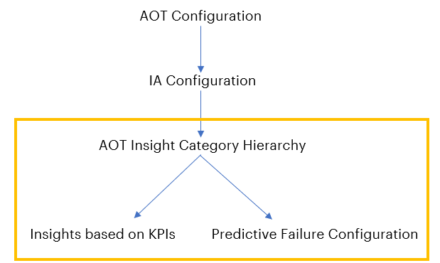
Follow the steps below to create the hierarchy with the insight categories.

1.  

2.  Work with an IAI Business Analyst (BA) to create an [Excel file to define the insight categories](https://digitalplantproject.visualstudio.com/Marilyn%20V/_git/MarilynVPlatform?path=/Processing/IntelligentAdvisor/ia_middleware/ia_func_ms/app/Testing_Files/Insight%20Factory_category.xlsx) that are going to be created. This file gets converted to JSON.\
    Note that this conversion is performed by a microservice that converts the Excel file to JSON. The microservice used is called ia_func_ms (IA function microservice). It converts the data from Excel to a JSON file and uploads the JSON files to CDF. Insight category hierarchy appears in CDF by calling the ia_func_ms. microservice.

3.  Upload the JSON file to the CDF portal, which is automatically done through the microservice code.

4.  Deploy code in the Git repository.

5.  Run the pipeline to make the function appear in the CDF portal under the CDF function tab: CDF portal \&gt; Explore \&gt; Cognite functions

6.  Run functions in either of two ways:

-   Manual: CDF Portal\&gt;Explore\&gt;Cognite functions-\&gt;Run button or through Postman.

-   Schedulers: CDF Portal \&gt; Explore \&gt; Cognite functions \&gt; Required function \&gt; Schedules

7.  View the Insight category hierarchy details in the [CDF Portal](https://fusion.cognite.com/accenture-operations-twin/explore/search/asset) by navigating to Explore \&gt; Explore data \&gt; Assets \&gt; IAI Configuration \&gt; Intelligent Advisor \&gt; Insight category hierarchy.

The following table provides the relevant software details.

| **IT** | - Git folder [link](https://dev.azure.com/DigitalPlantProject/Marilyn%20V/_git/MarilynVPlatform?path=/Processing/IntelligentAdvisor/ia_middleware/ia_func_ms) |
| --- | --- |
|  | - Function Python code [link](https://dev.azure.com/DigitalPlantProject/Marilyn%20V/_git/MarilynVPlatform?path=/Processing/IntelligentAdvisor/ia_middleware/ia_func_ms/app/resources/cdf_fun_call.py) |
| **CI/CD Pipeline** | - Pipeline name: *IAI-IA-Funct-APIM-MW* - Pipeline [folder](https://digitalplantproject.visualstudio.com/Marilyn%20V/_build?treeState=XEFPVCBBcHBzIEJ1aWxkIFRlYW0gMiRcQU9UIEFwcHMgQnVpbGQgVGVhbSAyXE1pZGRsZXdhcmVBUEkkXEFPVCBBcHBzIEJ1aWxkIFRlYW0gMlxNaWRkbGV3YXJlQVBJXEJhY2tlbmQ%3D&amp;view=folders) - Pipeline Dev,Test,Prod [link](https://digitalplantproject.visualstudio.com/Marilyn%20V/_build?treeState=XEFPVCBBcHBzIEJ1aWxkIFRlYW0gMiRcQU9UIEFwcHMgQnVpbGQgVGVhbSAyXE1pZGRsZXdhcmVBUEkkXEFPVCBBcHBzIEJ1aWxkIFRlYW0gMlxNaWRkbGV3YXJlQVBJXEJhY2tlbmQ%3D&amp;view=folders) Note that for all environments, the pipeline is the same but while running, the pipeline changes branch according to the environment hierarchy created. |
| **Sample Function Code** | Function code is written in Python and contains the logic for creating the asset hierarchy. See [example](https://ts.accenture.com/:u:/r/sites/GlobalDocTemplates/Published%20Documents/AOT/Linked%20Files/handler.py). The Python Function code logic handles the following operations: - Retrieves all fields - Searches for JSON file - Takes file-Id - Reads hierarchy data and keeps it in the list - Creates asset hierarchy - Updates metadata |
### 

## Leverage Azure and CDF to Generate Insights

Five different microservices and the IA Configuration database are employed to leverage Azure and CDF for system-generated insights. The ML Model uses twenty-six timeseries parameters as the input. The ML Model Microservice runs the pre-trained ML model to generate the output, which is a prediction for failure probability. This output is stored as a timeseries in CDF. The Generic Scheduler Microservice triggers the insight evaluation microservice endpoints for both the ML model and the Smart KPI models at the scheduled frequency that is specified in the IA configuration database. The Evaluatemodel Microservice is an insight generation engine. It is responsible for validating the insight generation logic and then triggering the insight generation engine API (via the IA Middleware microservice) in the IA configuration Microservice to create a system-generated insight. The subsequent sections discuss the microservices and the IA Configuration database structure in detail. The container structure is diagrammed below. The purple numbered callouts depict the flow for Predictive Failure Configuration and the yellow numbered callouts depict the flow for Insights based on KPIs.

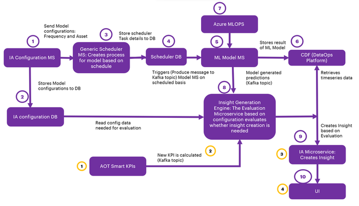

#### Microservices

This section describes these five microservices that are used to generate Insights:

-   IA-config microservice

-   Generic Scheduler Microservice

-   ML-Model Microservice

-   Evaluatemodel Microservice (Insight Generation Engine)

-   IA Middleware microservice

##### 

#### IA-config microservice

The IA-config microservice is the first step depicted in the flow diagram in the previous section. It handles configuration based on the Plant/Multiplant for the insights listed in the table below. Insights get generated based on Plant/Multiplant.

| **Insight** | **Description** |
| --- | --- |
| Insights based on KPIs | \'Create Configuration API\' stores the list of KPIs values in model_configurations and dedicated_model_configuration table under Azure DB. |
| Predictive Failure Configuration | \'Create Configuration API\' stores the algorithm, asset, configuration, and Impacted KPIs values in model_configurations and dedicated_model_configuration table under Azure DB. Here impacted KPIs are optional for user selection. This microservice does not allow the creation of Insights based on the KPIs\' configuration with existing KPIs in Azure DB, as well as for Predictive configuration algorithms with existing assets. |
| #### | Configuration Microservice APIs | **API** | **Description** |  | --- | --- |  | Create configuration | This API inserts the configurations as configured from UI into to model_configuration and dedicated_model_configuration table in the Azure DB. |  | Update configuration | This API updates the model_configuration and dedicated_model_configuration tables based on the configuration ID in Azure DB. |  |
|  |  |  | - For Insight based on KPIs configurations, only the ActionIn field may be updated. |  |
|  |  |  | - For Predictive configurations, the Theme, Sub-type, Priority, Department, Role, Action in, Description, Frequency, Threshold, and Impacted KPIs may be updated. |  | Delete configuration | This API deletes the configuration from model_configuration and dedicated_model_configuration tables based on the configuration ID in Azure DB. | Generic scheduler Microservice will trigger only after create/update/delete of predictive failure configurations. |
##### 

#### Generic Scheduler Microservice

The Scheduler Microservice is a service designed to facilitate task scheduling, allowing users to schedule tasks to be executed at specific intervals or on specific dates.

Three types of scheduling expressions are supported:

| **Expression** | **Description** |
| --- | --- |
| Cron | Triggers tasks according to a specified cron expression |
| Interval | Triggers tasks at regular time intervals |
| Date | Triggers a task only once at a specified date and time When utilizing the Cron or Interval types without start and end dates, the tasks are triggered infinitely. This microservice is triggered to perform the CRUD operations (Create, Read, Update, Delete) of the saved IA configurations. The scheduler details are stored in the Azure database and the process is scheduled to trigger the ML Model microservice with configured frequency and asset. This is represented in steps 2, 3, and 4 in the [flow diagram](https://ts.accenture.com/:i:/r/sites/GlobalDocTemplates/Published%20Documents/AOT/Linked%20Files/IA%20Delivery%20Guide/IA_Container_Structure_1_4.png). |
| - | Configuration for generating insights is taken from the latest configuration saved for that asset. |
| - | The created process keeps running with the scheduled frequency and asset for which it was created. |
| - | Scheduler time for the frequency configured by the user: |
| - | Hour: Insert a number from 1-24. |
| - | Day: Insert a number from 1-15. |
| - | Minute: Insert a number from 1-60. The below diagram describes Generic Scheduler and CRUD operations (Create, Read, Update, Delete) performed on tasks. 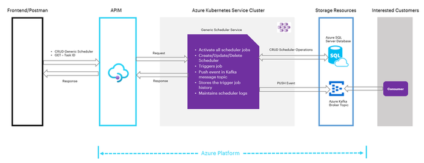
As shown in the previous diagram, both the IAI front end and the Postman client are used to interact with the scheduler. All of the components in the diagram are briefly explained in the table that follows. | **Component** | **Description** | | --- | --- | | Frontend/Postman | Provides a user interface to interact with the Generic Scheduler. Users can perform CRUD operations on tasks through this interface. | | Generic Scheduler | Handles the management of tasks and exposes APIs for CRUD operations | | APIM (Azure API Management) | Acts as an API gateway, controlling access to the Generic Scheduler\'s APIs and managing authentication and authorization | | AKS Cluster (Azure Kubernetes Service) | Hosts the Generic Scheduler and related services. It activates all scheduler jobs and maintains scheduler logs | | Kafka Message Topic | A Kafka message topic is utilized to publish events (PUSH events) triggered by the Generic Scheduler. Consumers can subscribe to these events and process them. | | Storage Resources | This component contains two main parts: | |
|  |  |  | - Azure SQL Server Database: Stores and manages information related to scheduler operations. This includes CRUD scheduler operations and triggers job history. |  |
##### Generic Scheduler APIs

The generic scheduler APIs are described in the following table.

| **API** | **Description** |
| --- | --- |
| RegisterTask API | This API inserts task details into the Azure DB. |
| UpdateTask API | This API updates existing task details in Azure DB based on the task ID. |
| DeleteTask API | This API deletes tasks from scheduled tasks. The deleted tasks are added to the table \'scheduled_tasks_log\' based on their task ID. The APIs perform the following actions: |
| - | Create/Update configuration: Once configurations are created or updated, Generic Scheduler APIs are called. Then, the schedule details are stored in the database \'sql-scheduler-db\' and the process is scheduled. A message is triggered instantly. Then at the scheduled time, a message is produced to the Kafka topic. The produced message is consumed by the Model microservice\'s consumer file and the Evaluate Model microservice is run, which generates Insights. |
| - | Delete configuration: After the delete configuration request is passed from the UI, the delete configuration API is called. The delete API deletes the data from the configuration database table and calls the Delete Scheduler API, which deletes data from the scheduler database table as well as the scheduler process. |
##### 

#### ML Model Microservice

The IAI Simulator in the IoT hub generates seven timeseries data: pressure1, pressure2, pressure3, temp1, temp2, vibration1, and vibration2. These are generated in real-time with a 1-minute frequency and are used as input for the ML model. The simulator is configured through a configuration file, where the data scientist specifies the limits and the details for the seven timeseries. The ML model is trained outside of CDF, i.e., the client trains the model according to their requirement beforehand. Thus, the model is \'pre-trained\'.

The ML Model Microservice runs the pre-trained Model which is deployed in the same microservice as a pickle file. At a scheduled frequency, the ML Model microservice fetches seven timeseries from CDF for the selected asset, which is used as input to the pre-trained model to predict and calculate the failure probability. Once predictions are generated, it is stored in CDF as a timeseries, and the Message Broker will generate a message and produce the message to EventHub by subscribing to the topic (ia_evaluate_cv). Steps 4, 5, and 6 in the [flow diagram](https://ts.accenture.com/:i:/r/sites/GlobalDocTemplates/Published%20Documents/AOT/Linked%20Files/IA%20Delivery%20Guide/IA_Container_Structure_1_4.png) describe this process.

Note that for the ML Model Microservice to perform CRUD operations, the middleware microservice, which consists of the CRUD APIs, must be deployed along with the ML Model Microservice. For more information on the middleware microservice, refer to the section [IA Middleware Microservice](#ia-middleware-microservice).

##### Evaluatemodel Microservice (Insight Generation Engine)

Evaluatemodel microservice evaluates whether insights need to be generated or not. This Microservice subscribes to two different Kafka topics. Evaluation for ML Model prediction and Smart KPI is event-driven now. Refer to steps 1, 2 (yellow), and 7 (purple) in the [flow diagram](https://ts.accenture.com/:i:/r/sites/GlobalDocTemplates/Published%20Documents/AOT/Linked%20Files/IA%20Delivery%20Guide/IA_Container_Structure_1_4.png).

Evaluation for the predictive failure ML model consumes messages from the topic (ia_evaluate_cv) and Smart KPI messages will be consumed from the topic (smart_kpi_schedule_sequencing)

###### 

#### ML Model Consumer

The predictive failure model consumer consumes messages from the ML model by subscribing to the EventHub topic (ia_evaluate_cv) and triggering the Predictive Failure Evaluation Model.

Kafka Message Structure:

msg=\{

\"Type\": \"Create\",

\"Scopes\": \[\"Predictive Instance Value\"\],

\"Timestamp\": datetime.now().strftime(\"%Y-%m-%d %H:%M:%S\"),

\"Payload\": \[\{\"res_df\":res_df.to_json(),\"asset\":asset_hierarchy\}\]

\}

#####  ML Model Evaluation

Messages sent by Model MS are consumed by the Evaluator MS and predicted values, timestamps, and assets are picked. Evaluation MS checks the latest configurations saved for the asset sent through the message broker and evaluates if the Insight needs to be generated by comparing predictions against the threshold from Configuration.

event_breach=EventBreachCount.ZERO.value

insight_type=InsightType.PARENT.value

for i in range(len(dataframePoints)):

if eval(str(dataframePoints\[\'Pred_val\'\]\[i\]) + condition + str(threshold)):

if insight_type==InsightType.PARENT.value:

print(\"Generate Insight\")

else:

print(\"Check if sequence exists for insight, if not create and Log child

breach in sequence\")

event_breach+=EventBreachCount.ONE.value

insight_type=InsightType.CHILD.value

###### 

##### 

##### Smart KPI Consumer

Evaluate microservice consume KPI message from Eventhub topic (smart_kpi_schedule_sequencing) and triggering Smartkpi Evaluation model only for Scope \"SmartKPI Instance Value\" and Type \"Actual\" and Status \"Success\".

Kafka message structure:

msg=\{

\"Type\": \"Create\",

   \"Scopes\": \[\"SmartKPI Instance Value\"\],

   \"Timestamp\": datetime.now().strftime(\"%Y-%m-%d %H:%M:%S\"),

   \"Version\": \"1\",

   \"Payload\":\[\{

       \"KPIUID\": kpidetails.external_id.split(\'\_\')\[1\],

       \"KPIName\": kpidetails.metadata\[\'Name\'\],

       \"AssetHierarchyLevel\": kpidetails.external_id.split(\'\_\')\[2\],

       \"Asset\": asset,

       \'actual_starttime\': start_time.strftime(\"%Y-%m-%d %H:%M:%S\"),

       \'actual_endtime\': end_time.strftime(\"%Y-%m-%d %H:%M:%S\"),

**       \"Type\": \"Actual\",**

**       \"Status\":\"Success\",**

       \"Reason\":str(ex)

        \}\]

   \}

#####  Smart KPI Evaluation 

Whenever a Message is generated by the Smart KPI engine, this microservice checks if configuration exists in the database for the calculated KPI and evaluates smartkpi insights. It checks the RAG status and generates insight by comparing the actual and target values.

status=\[RagStatusEnum.RED.value,RagStatusEnum.AMBER.value,RagStatusEnum.GREEN.value\]

actual_value=RAG_status\[\"Actual\"\]\[\'value\'\]

limit = \{\}

for i in status:

j=\'\{\}-Mandatory\'.format(i)

max = f\"\{i\}\_max\"

min = f\"\{i\}\_min\"

limit\[max\] = RAG_status\[\'RAGStatus\'\]\[i\]\[j\]\[\'max\'\]

limit\[min\] = RAG_status\[\'RAGStatus\'\]\[i\]\[j\]\[\'min\'\]

if RAG_status\[\'kpiDirection\'\]==KpiDirection.UP.value:

if i==RagStatusEnum.RED.value and actual_value\ if (actual_value\target_value and RAG_status\[\'kpiDirection\'\]==KPIDirection.DOWN.value)

Print(\"Generate Insight\")

##### IA Middleware Microservice 

The IA Middleware Microservice\'s Insight Generation Engine API is triggered by the EvaluationModel Microservice (refer to step 7 in the [flow diagram](https://ts.accenture.com/:i:/r/sites/GlobalDocTemplates/Published%20Documents/AOT/Linked%20Files/IA%20Delivery%20Guide/IA_Container_Structure_1_4.png)). This API is responsible for generating an insight.

Request Body of Insight Generation Engine

event_data=\{

\"type\":\"Insight\",

\"subType\":subtype,

\"start_time\":start_time,

\"end_time\":end_time,

\"data_set_id\":ts_dataset_id,

\"asset_ids\":ts_asset_id,

\"metadata\":meta_data

\}

Once the middleware microservice has been deployed, whenever insights are loaded, the following happens:

1.  The modelTrigger API of the Model Microservice is called to consume data and perform CRUD operations on the Model Microservice.

2.  Middleware Microservice will consume messages for archive insights message and perform operations on insights.

#### 

### IA Configuration Database Structure 

The following diagram describes the IA configuration database structure and how the microservices store and retrieve insights from the database.

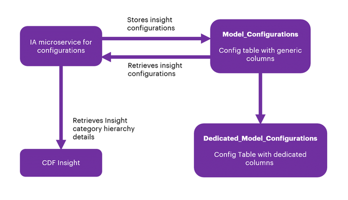

From the backend, through SQL Post query, the data from the UI will be stored in the Azure SQL database.

There are two tables in sql-ia-config-db-dev from AIR Replacement:

-   InsightCategoryConfigurations

-   InsightCategoryConfigurationsParameters

Note that the first table (alembic_version) is the version of the SQL alchemy upgrade and not part of the database structure.

> 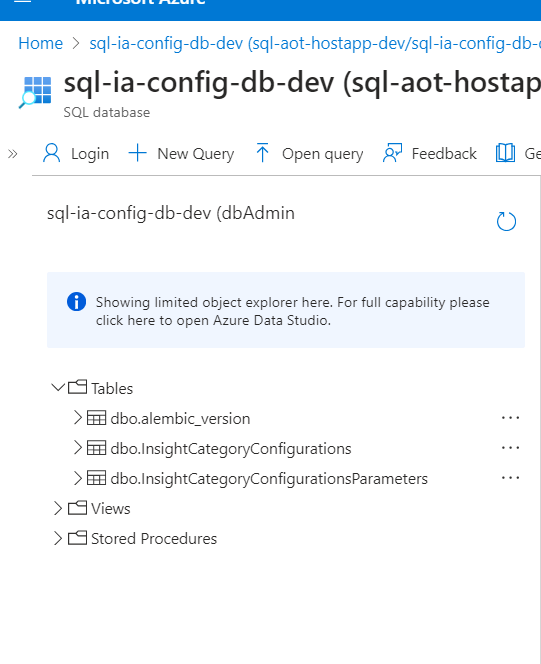

##### InsightCategoryConfigurations 

InsightCategoryConfigurations have common fields for both KPI and Predictive configurations:

-   id

-   category

-   type

-   theme

-   subType

-   template

-   role

-   department

-   actionIn

-   createdBy

-   createdDate

-   configurationCategorytaskId

-   trigger

-   plant

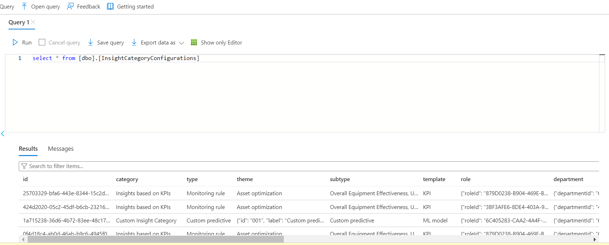

##### InsightCategoryConfigurationsParameters

InsightCategoryConfigurationsParameters have dedicated fields for both KPI and Predictive configurations.

[KPI configurations]

-   configId

-   assetHierarchyLevelfrequency name

-   uid

[Predictive failure configurations]

-   priorityalgorithmassetList

-   impactedKpis

-   conditionsdescription

-   frequency

-   modelExecutionParametersId

> 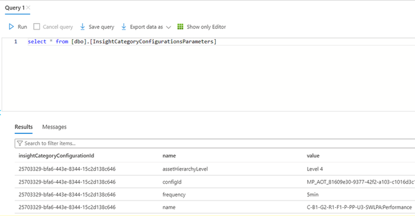
#### 

### Generic Scheduler Database Structure 

There are three tables in sql-scheduler-db.

The following image shows the DB structure in Azure and the tabular figure briefly describes the three tables utilized by the generic scheduler microservice.

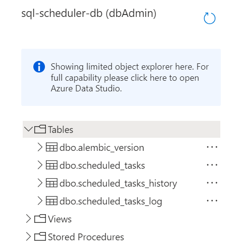

| **Table** | **Description** |
| --- | --- |
| scheduled_tasks | This table stores information about the active scheduled tasks. The string type parameters include: - creation_date - mod_date - Name - parameters - scheduling_exp - Scope - task_id |
| scheduled_tasks_history | This table stores a history of events corresponding to the task triggers. |
| scheduled_tasks_log | This table stores information about the deleted scheduled tasks. |
#### ML Model Database Structure 

There is one table in **sql-ia-model-db-dev**.

The following image shows the DB structure in Azure and the tabular figure briefly describes the three tables utilized by the ML model microservice.

The table ModelExecutionParameters stores model parameters.

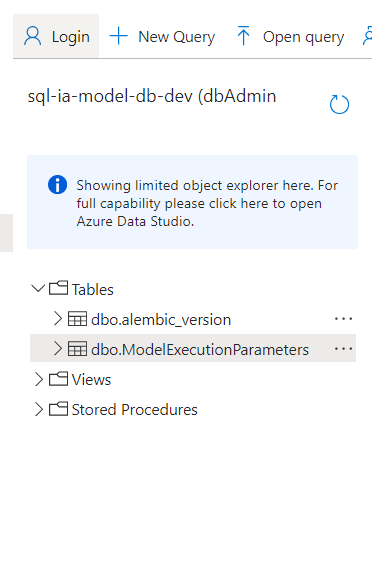

## 

# Archiving Insights

Insights are archived along with their associated actions upon reaching their expiry. The duration for expiration, termed the Expire Limit, is defined as per client and business requirements.

The middleware microservice architecture is leveraged to utilize existing APIs and frameworks (components) to offer the Archive Insight functionality. These components are briefly described below.

| Component | Description |
| --- | --- |
| Scheduler | A task scheduler is implemented utilizing the existing generic scheduler API, configured to operate at hourly intervals. This scheduler orchestrates the periodic execution of subsequent tasks within the middleware microservice environment. For more information on the Generic Scheduler, refer to the [Generic Scheduler Technical Overview](https://industryxdevhub.accenture.com/assetdetails/83). |
| Consumer | The consumer component is triggered on an hourly basis, initiating the invocation of the pertinent business logic code housed within the middleware microservice. |
| Business Logic Code | Developed in Python, the business logic code encapsulates the functionality responsible for assessing the \'actionBy\' attribute of insights against the predefined expiration limit. When the \'actionBy\' value surpasses the expiry threshold, the logic triggers the closure of the associated insight and its related actions. |
## Use Cases (UC)

### UC1 -- Predicting Control Valve Failure

The diagram below shows the insight generation process for an example predictive failure model (the control valve) use case. The configuration of the model is saved in the IA Configuration DB. Configurable fields are listed in the adjacent table.

#### Flow

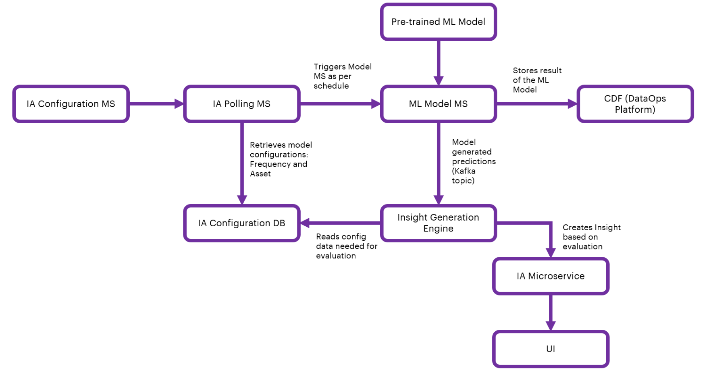

#### IA Configuration 

| &gt; **Field** | &gt; **Description** |
| --- | --- |
| &gt; Algorithm | &gt; Selection field (Predictive Failure Configuration category type) |
| &gt; Asset | &gt; Selection field to select Asset/Assets |
| &gt; Theme | &gt; Selection field (Predictive Failure Configuration Category theme) |
| &gt; Sub-type | &gt; Selection field (Predictive Failure Configuration Category Sub-type) |
| &gt; Priority | &gt; Selection field (High, Low, or Medium) |
| &gt; Department | &gt; Selection field to select Department from people management. |
| &gt; Role | &gt; Selection field from people management |
| &gt; Action in | &gt; Selection field when users should act upon the generated insight |
| &gt; Description | &gt; Text field for describing the insight |
| &gt; Frequency | &gt; Selection field to schedule predictive failure model |
| &gt; Threshold | &gt; Selection field to select a condition (equal, less than/greater than) for numeric threshold input(any number between 1 to 99) |
| &gt; Impacted KPI | &gt; Optional Selection field to select impacted KPI/KPIs |
### UC2 -- Smart KPI for OEE

#### 

### Flow

The flow diagram below shows the insight generation process for the OEE Smart KPI use case.

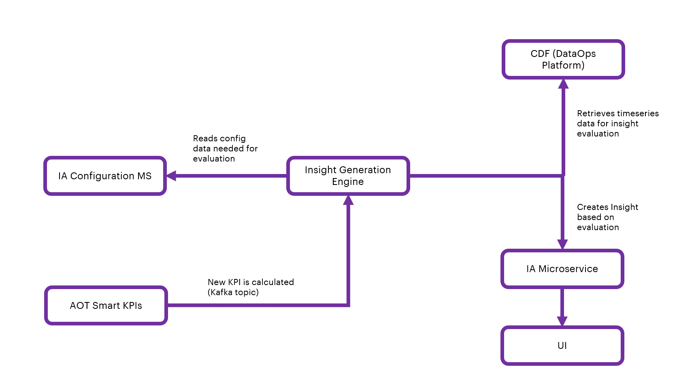

#### IA Configuration for Smart KPI Model

The configuration of the model is saved in IA Configuration DB. Configurable fields are listed in the table below.

| **Field** | **Description** |
| --- | --- |
| KPI | selection field to select KPI/KPIs |
| Action in | selection field when users should act upon |
## Create a User Interface Template

To display the details of the Insight from Intelligent Advisor, a User Interface (UI) is needed. The specific information conveyed through the UI is controlled using templates. Each category of Insight will have its own template with both configurable and non-configurable elements

A template is a way to roll out the information displayed about Insights. The details presented in the UI are based on the corresponding specific template. The UI will access data through predefined templates. The template will define the structure of the information that will be used in the UI, and it will define the way the information is organized in the display.

As shown in the diagram, each template will have a one-to-one mapping to the Insight categories. Templates are used to structure and organize data to your needs. The user can assign fields to the template and then assign values, or reference other data such as time series or assets. For the front end, the data can be taken from the back-end template and then passed to the application. The sections below explain how these template structures are created, updated, maintained, and customized by Accenture and then consumed by clients.

To develop the viewer template, the following must exist:

-   Template Excel

-   Function code

1.  Work with an IAI Business Analyst (BA) to create a properly formatted Excel template ([example](https://ts.accenture.com/:x:/r/sites/GlobalDocTemplates/Published%20Documents/AOT/Linked%20Files/IA%20Delivery%20Guide/AOT_UI_Template_Example.xlsx?d=wa4b4511f03614ab49839279d1233b29c&amp;csf=1&amp;web=1&amp;e=aA6zfk)) containing the necessary details. The Excel file eventually gets converted to JSON format in the microservice code.

2.  Upload the JSON file to the CDF portal, which is automatically done through the microservice code.

3.  Deploy the function code in the Git repository.

4.  Run the pipeline to make the function appear in the CDF portal under the CDF function tab: CDF portal -\&gt; Explore -\&gt; Cognite functions.

5.  Run functions manually using Postman or visit either:

A.  CDF Portal \&gt; Explore \&gt; Cognite functions to run.

B.  CDF Portal\&gt;Explore\&gt;Cognite functions\&gt;Required function\&gt;Schedules to schedule.

6.  View the result in the CDF Portal (Explore\&gt;Explore data\&gt;Assets) by selecting IAI Configuration\&gt;Intelligent Advisor\&gt;Insight template hierarchy. The template hierarchy and relationship details are displayed on the right side and child nodes are displayed beneath the root.

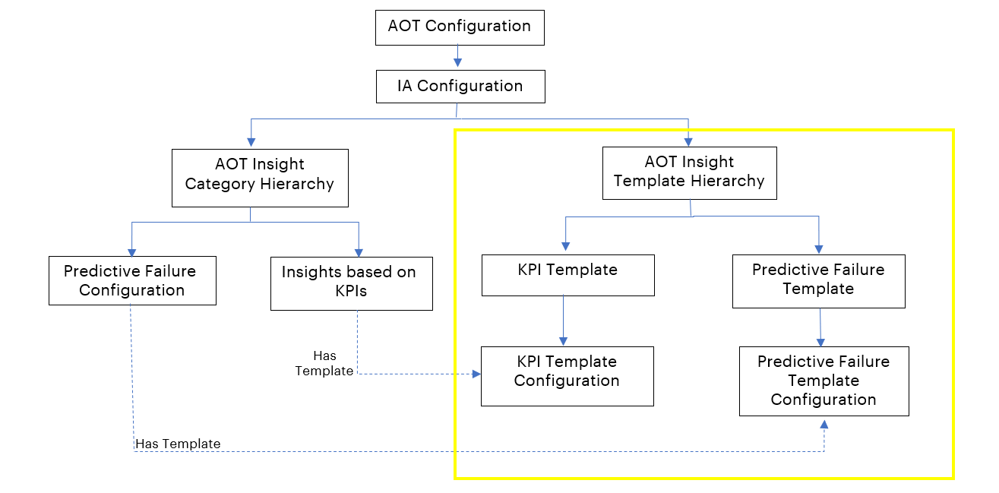

The screenshot below shows the IA configuration of the insight category and insight template hierarchy.

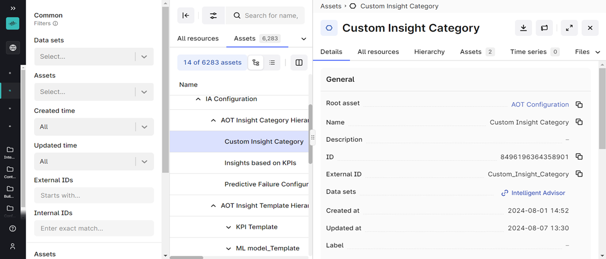

The template is used by UI, and it has details about insights.

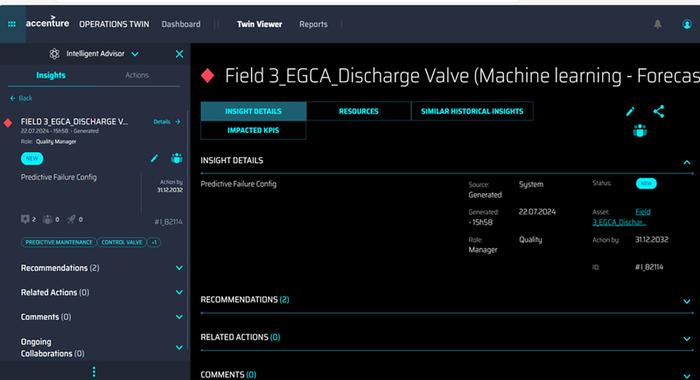

### KPI Data Permissions

-   When the KPI role is updated, the KPI data permission microservice receives messages for updating the KPI role in insight metadata.

-   KPI data permission microservice consumes the message (using Kafka topic). Then, it checks insights with similar KPI IDs and updates the KPI role in insight metadata.

\{

\'Timestamp\': \'2023-08-02 13:57:20\',

\'Scopes\': \[\'Data Permission\'\],

\'Version\': \'1\',

\'Type\': \'update\',

\'Payload\':

\[\{

\'Data Permission\': \{

\'asset_hierarchy_level\': \'System\',

\'uid\': \'f7c66e19-03a3-44b2-af5a-5bd4de87af2d\',

\'accessType\': \'Owner\',

\'old_role\': \'Reliability Engineer\',

\'new_role\': \'Production Manager\'\}\}

\]

\}

#### Function Code

Function code is written in Python and contains the logic for creating the asset hierarchy. See [example](https://dev.azure.com/DigitalPlantProject/Marilyn%20V/_git/MarilynVPlatform?path=/Processing/IntelligentAdvisor/Unittest_CDF/func_insightcotegory/handler.py).

The function code contains the logic listed below:

-   Python SDK and JSON files are used for developing functions

-   In the code, the JSON file names are defined first.

-   Read details regarding the template hierarchy list.

-   Read asset details of template hierarchy.

-   Read details regarding the Insight category list.

-   Create assets.

-   Update asset metadata.

-   The relationship is built from Insight category configuration to template configuration.

The function code is uploaded to the CDF Portal\&gt;Explore\&gt;Cognite functions using the Upload Function button. Once uploaded, the function can be either called using schedulers that have been set for the function can be called manually or found in the CDF Portal as follows:

CDF Portal \&gt; Explore \&gt; Cognite functions \&gt; Required function \&gt; Schedules

**\
**

#### Git

-   Git branch name: develop

-   Git folder path: Git -\&gt; Repos -\&gt; Files -\&gt; Processing -\&gt; IntelligentAdvisor -\&gt; Unittest_CDF -\&gt; func_template

-   Git folder [link](https://dev.azure.com/DigitalPlantProject/Marilyn%20V/_git/MarilynVPlatform?path=/Processing/IntelligentAdvisor/Unittest_CDF/func_template)

-   Function Python code [link](https://dev.azure.com/DigitalPlantProject/Marilyn%20V/_git/MarilynVPlatform?path=/Processing/IntelligentAdvisor/Unittest_CDF/func_template/handler.py)

#### CI/CD Pipeline

-   Pipeline folder [link](https://dev.azure.com/DigitalPlantProject/Marilyn%20V/_build?definitionScope=\AOT%20Apps%20Build%20Team%202)

-   Pipeline [link](https://dev.azure.com/DigitalPlantProject/Marilyn%20V/_build?definitionScope=%5CAOT%20Apps%20Build%20Team%202)
