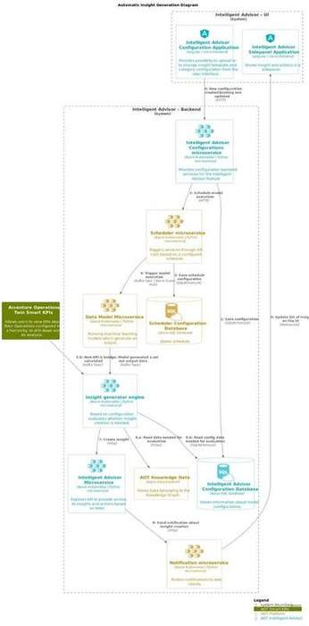
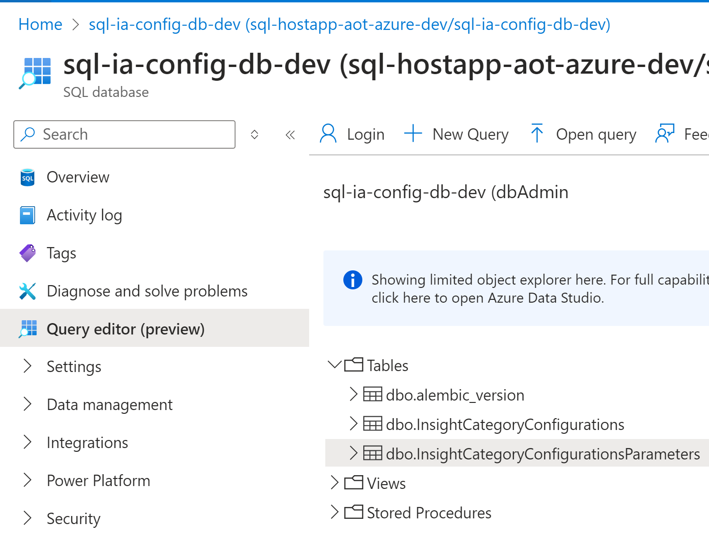
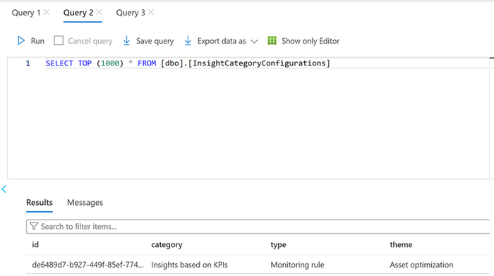
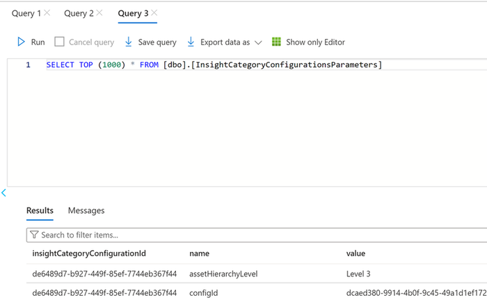
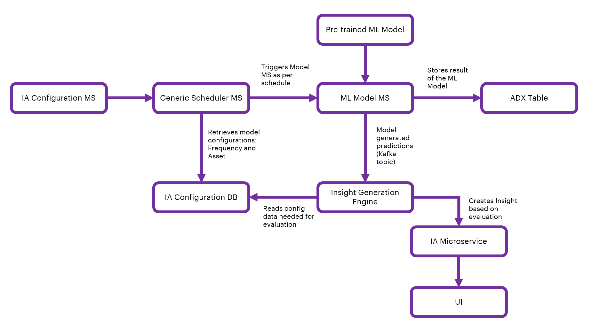
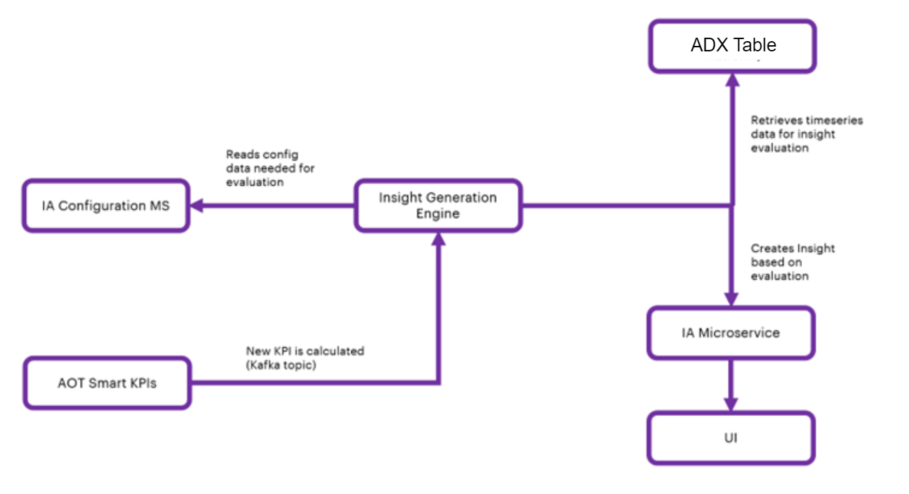
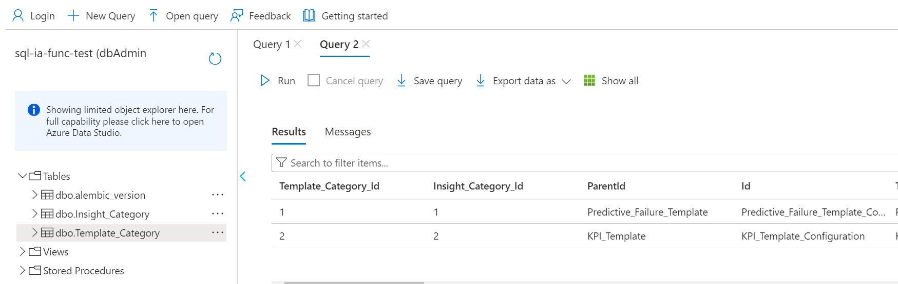
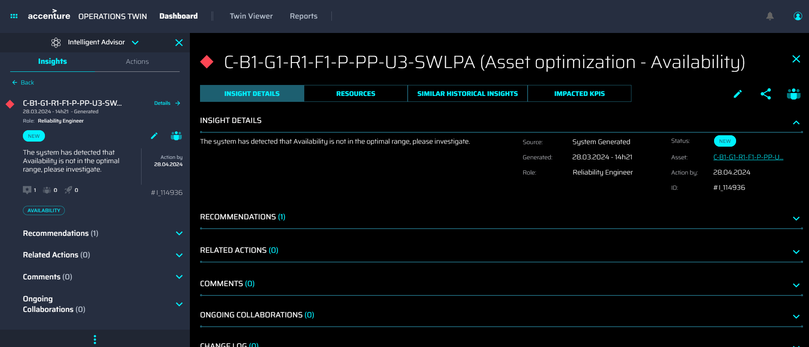

Industrial AI Foundation

Intelligent Advisor

AZURE DELIVERY GUIDE

Release Version: 2.5

**Metadata Table:**

| **Field** | **Value** |
| --- | --- |
| **Asset / Solution Name** | Industrial AI Foundation / Intelligent Advisor |
| **Domain / Area** | Advisory / Decision Automation |
| **Owner (Team/Person)** | Tournier, Florian |
| **Reviewers** | Susarla, Aditya, Kannan, Jishnu |
| **Status** | Published / Approved |
| **Confidentiality** | Internal / Confidential |
| **Source of Truth** | [Summary - Overview](https://dev.azure.com/DigitalPlantProject/Marilyn%20V) |
| **Related Assets / Alternatives** | Intelligent Advisor UI Guide, Intelligent Advisor Delivery Guide |

## Introduction

Industrial AI Foundation (IAI) is a collection of software accelerators and tools, including Intelligent Advisor, which can be assembled to deliver client solutions. IAI accelerates the integration of product, process, and live data from disparate IT and OT systems, creating a comprehensive and contextualized view of operations to enable better decisions and optimized processes.

Intelligent Advisor (IA) is an IAI component and an AI-based solution that enables different types of users to focus on critical issues with real-time generated, prioritized and contextualized Insights and recommendations. It combines the following functional components: Insight generation engine, collaboration, Actions, Advisor panel, Insight Viewer template, and Insight lifecycle management.

### Purpose

This document describes the end-to-end process of creating and maintaining Insight categories, configuring Insights, and defining Insight viewer templates. The document should be valuable to anyone who needs to generate and configure tailored Insights for a client.

### Target Audience

-   Client Delivery Teams Leveraging IAI Intelligent Advisor

-   Asset Delivery Teams

-   Solution Architects, Technical Architects, Data Scientists, Data Engineers

### Preferred Skills

-   Azure SQL

-   Azure ADX

-   Python

-   Machine Learning

### Prerequisites

-   A business analyst (BA) from the IAI team must be engaged to define the requirements.

-   Access to a customized spreadsheet from the BA, which is used to create the hierarchies described later in this guide.

-   Access to code is needed.

### Contacts

-   [rajnish.kumar.singh@accenture.com](mailto:rajnish.kumar.singh@accenture.com)

-   [reymark.q.bacalso@accenture.com](mailto:reymark.q.bacalso@accenture.com)

-   [lyecca.m.c.gallardo@accenture.com](mailto:lyecca.m.c.gallardo@accenture.com)

### Related Links

-   [IA-on-Azure](https://dev.azure.com/DigitalPlantProject/Marilyn%20V/_wiki/wikis/Marilyn-V.wiki/1977/IA-on-Azure)

-   [Micro Frontend Development Guide](https://industryxdevhub.accenture.com/assetdetails/48)

-   [IAI Documentation](https://industryxdevhub.accenture.com/asset-home;search_text=aot) [Release Notes](https://industryxdevhub.accenture.com/assetdetails/45)

-   [Intelligent Advisor API Reference](https://industryxdevhub.accenture.com/assetdetails/43)

-   [Generic Scheduler Technical Overview](https://industryxdevhub.accenture.com/assetdetails/83)

### 

## Glossary

| **Term** | **Definition** |
| --- | --- |
| IAI (Industrial AI Foundation) | A collection of software accelerators and tools, including Intelligent Advisor, that integrate product, process, and live data from IT and OT systems to provide a comprehensive view of operations for better decision-making. |
| Intelligent Advisor (IA) | An AI-based solution within IAI that generates, prioritizes, and contextualizes insights and recommendations for users, focusing on critical issues using real-time data. |
| Insight | Actionable information generated by business logic or machine learning models, highlighting critical events, breaches, or predictions relevant to operations. |
| Insight Category | A classification for insights, such as KPI-based, Predictive Failure, or Custom, managed in Azure SQL and defined via Excel templates. |
| Insight Factory | The system or process for generating, categorizing, and managing insights within the IAI solution.citeturn1search1 |
| KPI (Key Performance Indicator) | Quantitative metrics used to monitor and evaluate the performance of assets or processes, often triggering insights when thresholds are breached. |
| Predictive Failure Configuration | A setup for generating insights based on machine learning models that predict asset failures, including algorithm selection, asset targeting, and threshold settings. |
| Azure SQL Database | The cloud-based database platform used to store insight categories, configurations, templates, and scheduler data for the IAI solution. |
| Blob Storage | Azure storage used for uploading and triggering processing of Excel files that define insight categories and templates. |
| Microservice | Independent service components (e.g., IA-config, Generic Scheduler, ML Model, Evaluatemodel, IA Middleware) that perform specific functions in the insight generation and management workflow. |
| Generic Scheduler | A microservice that schedules tasks (e.g., model runs, insight evaluations) at defined intervals using cron, interval, or date expressions, and manages task logs/history. |
| ADX (Azure Data Explorer) | The platform used to store and analyze timeseries data generated by ML models and other sources for insight generation. |
| ML Model Microservice | A service that runs pre-trained machine learning models to predict asset failures or KPI outcomes, using real-time timeseries data. |
| Evaluatemodel Microservice | The engine that evaluates predictions and determines whether insights should be generated, based on configured thresholds and business logic. |
| Insight Viewer Template | A UI template that structures and displays insight details, configurable per insight category and managed via Azure SQL and Excel templates. |
| Kafka Message Topic | A messaging system used for event-driven communication between microservices, such as triggering evaluations or updating permissions. |
## Generating Insights

Insights are generated by using either some simple business logic or a more complex machine learning model that must be deployed and executed in an analytical framework. A simple business logic might be just a breach of a monitored KPI threshold, while a more complex use case could be an ML model that predicts failure and generates Insights wherever a malfunction happens.

1.  Configuration of Insights is handled in Azure, which is also used for the deployment and execution of analytical models and for triggering Insights. Insights are created using three distinct steps:Create Insight category.

2.  Leverage Azure to Generate Insights

3.  Create a user interface template for viewing the details of the Insights.

The resultant data is rendered using middleware. The three steps listed above are described in the sections that follow.

### Create Insight Category

New Insight categories can be created in the Azure SQL database with a table named *Insight Category*. Insight categories will be created, updated, maintained, and customized by Accenture and consumed by clients. Insights within the Insight Factory are categorized into an object structure called Insight Categories. These categories are then organized into a Category Hierarchy. Currently, the categories defined are KPI-based, Predictive Failure, and Custom Insight categories have been defined.

The IAI Insight Category Hierarchy consists of two child assets:

-   Insights based on KPIs

-   Predictive Failure Configuration

-   Custom Insight Configuration

The sections that follow explain how these categories are created, updated, maintained, and customized by Accenture and then consumed by clients.

To create the Insight Category, the following must exist:

-   Excel sheet to define Insight categories: [Insight_Factory_Category.xlsx](https://digitalplantproject.visualstudio.com/Marilyn%20V/_git/AOT-Azure?path=/Processing/IntelligentAdvisor/ia_middleware/ia_func_ms/app/resources/Insight_Factory_Category.xlsx&amp;version=GBdevelop&amp;_a=contents).

-   Database table on Azure: Insight_Category.

-   Blob storage container: ia-samples-workitems

#### Creation Process

1.  Work with an IAI Business Analyst (BA) to create an [Excel file to define the insight categories](https://digitalplantproject.visualstudio.com/Marilyn%20V/_git/AOT-Azure?path=/Processing/IntelligentAdvisor/ia_middleware/ia_func_ms/app/resources/Insight_Factory_Category.xlsx&amp;version=GBdevelop&amp;_a=contents) that are going to be created. This file will be uploaded to the blob storage by running the pipeline (IAI-Azure-IAFunction-ExcelFileUploadPipeline).

2.  Once the file is uploaded to the blob, a blob trigger occurs. The blob trigger will call the Azure function, which calls the Insight Category Creation API.

3.  The Insight category creation API fetches the category Excel sheet from the blob and inserts values into the SQL table.

4.  Insight categories will be stored as rows inside the Azure SQL database table.

Helpful links:

-   Git folder [link](https://digitalplantproject.visualstudio.com/Marilyn%20V/_git/AOT-Azure?path=/Processing/IntelligentAdvisor/ia_middleware/ia_func_ms/app/resources/azure_fun_call.py&amp;version=GBdevelop&amp;_a=contents)

-   Function Python code [link](https://digitalplantproject.visualstudio.com/Marilyn%20V/_git/AOT-Azure?path=/Processing/IntelligentAdvisor/ia_middleware/ia_func_db_update_functionapp/Azure%20Functions/IA_Func_Call_API/__init__.py&amp;version=GBdevelop&amp;_a=contents)

-   Excel file upload Pipeline: *IAI-Azure-IAFunction-ExcelFileUploadPipeline*

-   IA Function Pipeline: *IAI-Azure-IA-Function-MS*

-   Pipeline [folder](https://digitalplantproject.visualstudio.com/Marilyn%20V/_build?definitionScope=%5CAOT-Azure&amp;treeState=)

-   Pipeline Dev, Test, Prod [link](https://digitalplantproject.visualstudio.com/Marilyn%20V/_build?definitionScope=%5CAOT-Azure&amp;treeState=)

Note that for all environments, the pipeline is the same but while running, the pipeline changes branch according to the environment hierarchy created.

### Leveraging Azure

Five different microservices and the IA Configuration database are employed to leverage Azure for system-generated insights. The ML Model uses twenty-six timeseries parameters as the input. The ML Model Microservice runs the pre-trained ML model to generate the output, which is a prediction for failure probability. This output is stored as a timeseries in ADX. The Generic Scheduler Microservice triggers the insight evaluation microservice endpoints for both the control valve and the Smart KPI models at the scheduled frequency that is specified in the IA configuration database. The Evaluatemodel Microservice is an insight generation engine. It is responsible for validating the insight generation logic and then triggering the insight generation engine API (via the IA Middleware microservice) in the IA configuration Microservice to create a system-generated insight. The subsequent sections discuss the microservices and the IA Configuration database structure in detail. The container structure is diagrammed below.

### 

## Microservices

This section describes these five microservices that are used to generate Insights:

-   IA-config microservice

-   Generic Scheduler Microservice

-   ML-Model Microservice

-   Evaluatemodel Microservice (Insight Generation Engine)

-   IA Middleware microservice

#### IA-config microservice

The IA-config microservice is the first step depicted in the flow diagram in the previous section. It handles configuration based on the Plant/Multiplant for the insights listed in the table below. Insights get generated based on Plant/Multiplant.

| **Insight** | **Description** |
| --- | --- |
| Insights based on KPIs | Create Configuration API stores the list of KPIs values in model_configurations and dedicated_model_configuration table under Azure DB. |
| Predictive Failure Configuration | Create Configuration API stores the algorithm, asset, configuration, and Impacted KPIs values in model_configurations and dedicated_model_configuration table under Azure DB. Here impacted KPIs are optional for user selection. This microservice does not allow the creation of Insights based on the configuration of the KPI with existing KPIs in Azure DB, as well as for Predictive configuration algorithms with existing assets. |
##### Configuration APIs

| **API** | **Description** |
| --- | --- |
| Create configuration | This API inserts the configurations as configured from UI into to model_configuration and dedicated_model_configuration table in the Azure DB. |
| Update configuration | This API updates the model_configuration and dedicated_model_configuration tables based on the configuration ID in Azure DB. For Insight based on KPIs configurations, only the ActionIn field may be updated. For Predictive configurations, the Theme, Sub-type, Priority, Department, Role, Action in, Description, Frequency, Threshold, and Impacted KPIs may be updated. |
| Delete configuration | This API deletes the configuration from model_configuration and dedicated_model_configuration tables based on the configuration ID in Azure DB. Generic scheduler Microservice will trigger only after create/update/delete of predictive failure configurations. More information on APIs can be found here: [IAI Intelligent Advisor API Reference](https://industryxdevhub.accenture.com/assetdetails/43). |
#### 

### Generic Scheduler Microservice

The Scheduler Microservice is a service designed to facilitate task scheduling, allowing users to schedule tasks to be executed at specific intervals or on specific dates.

Three types of scheduling expressions are supported:

| **Expression** | **Description** |
| --- | --- |
| Cron | Triggers tasks according to a specified cron expression |
| Interval | Triggers tasks at regular time intervals |
| Date | Triggers a task only once at a specified date and time When utilizing the Cron or Interval types without start and end dates, the tasks are triggered infinitely. This microservice is triggered to perform the CRUD operations (Create, Read, Update, Delete) of the saved IA configurations. The scheduler details are stored in the Azure database and the process is scheduled to trigger the ML Model microservice with configured frequency and asset. This is represented in steps 2, 3, and 4 in the [Automatic Insight Generation diagram](https://ts.accenture.com/:i:/r/sites/GlobalDocTemplates/Published%20Documents/AOT/Linked%20Files/IA%20Delivery%20Guide/IA_Automatic_Insight_Generation_Diagram.jpg). |
| - | Configuration for generating insights is taken from the latest configuration saved for that asset. |
| - | The created process keeps running with the scheduled frequency and asset for which it was created. |
| - | Scheduler time for the frequency configured by the user: |
| - | Hour: Insert a number from 1-24. |
| - | Day: Insert a number from 1-15. |
| - | Minute: Insert a number from 1-60. The below diagram describes Generic Scheduler and CRUD operations (Create, Read, Update, Delete) performed on tasks. 
As shown in the previous diagram, both the IAI front end and the Postman client are used to interact with the scheduler. All of the components in the diagram are briefly explained in the table that follows. |
| **Component** | **Description** |
| Frontend/Postman | Provides a user interface to interact with the Generic Scheduler. Users can perform CRUD operations on tasks through this interface. |
| Generic Scheduler | Handles the management of tasks and exposes APIs for CRUD operations |
| APIM (Azure API Management) | Acts as an API gateway, controlling access to the Generic Scheduler\'s APIs and managing authentication and authorization. |
| AKS Cluster (Azure Kubernetes Service) | Hosts the Generic Scheduler and related services. It activates all scheduler jobs and maintains scheduler logs. |
| Kafka Message Topic | A Kafka message topic is utilized to publish events (PUSH events) triggered by the Generic Scheduler. Consumers can subscribe to these events and process them. |
| Storage Resources | This component contains two main parts. First, Azure SQL Server Database stores and manages information related to scheduler operations. This includes CRUD scheduler operations and triggers job history. Second, Azure Kafka Topic Broker (Consumers) acts as a message broker for Kafka topics. It allows consumers to subscribe and receive events pushed by the Generic Scheduler. |
##### Generic Scheduler APIs

The generic scheduler APIs are described in the following table.

| **API** | **Description** |
| --- | --- |
| RegisterTask API | This API inserts task details into the Azure DB. |
| UpdateTask API | This API updates existing task details in Azure DB based on the task ID. |
| DeleteTask API | This API deletes tasks from scheduled tasks. The deleted tasks are added to the table *scheduled_tasks_log* based on their task ID. The APIs perform the following actions: |
| - | Create/Update configuration: Once configurations are created or updated, Generic Scheduler APIs are called. Then, the schedule details are stored in the database \'sql-scheduler-db\' and the process is scheduled. A message is triggered instantly. Then at the scheduled time, a message is produced to the Kafka topic. The produced message is consumed by the Model microservice\'s consumer file and the Evaluate Model microservice is run, which generates Insights. |
| - | Delete configuration: After the delete configuration request is passed from the UI, the delete configuration API is called. The delete API deletes the data from the configuration database table and calls the Delete Scheduler API, which deletes data from the scheduler database table as well as the scheduler process. Refer to [IAI Generic Scheduler Technical Overview](https://industryxdevhub.accenture.com/assetdetails/83) for more information about the Generic Scheduler Microservice APIs. |
#### ML Model Microservice

The IAI Simulator in the IoT hub generates seven timeseries data: pressure1, pressure2, pressure3, temp1, temp2, vibration1, and vibration2. These are generated in real-time with a 1-minute frequency and are used as input for the ML model. The simulator is configured through a configuration file, where the data scientist specifies the limits and the details for the seven timeseries. The ML model is trained outside of Azure, i.e., the client trains the model according to their requirement beforehand. Thus, the model is pre-trained.

This ML Model Microservice runs the pre-trained Model which is deployed in the same microservice as a pickle file. At scheduled frequency, the ML Model microservice fetches seven timeseries from ADX for the selected asset, which is used as an input to the pre-trained model to predict and calculate the Control valve failure probability. Once predictions are generated, it is stored in ADX as timeseries rows, and the Message Broker will generate a message and produce the message to EventHub by subscribing to the topic (ia_evaluate_cv). Steps 5,6,7 and 8 in the [Automatic Insight Generation Diagram](https://ts.accenture.com/:i:/r/sites/GlobalDocTemplates/Published%20Documents/AOT/Linked%20Files/IA%20Delivery%20Guide/IA_Automatic_Insight_Generation_Diagram.jpg) describe this process.

These endpoints support the full range of CRUD operations, allowing for the creation, retrieval, updating, and deletion of model parameters. Additionally, the application includes an endpoint to trigger model-related actions, enabling the system to consume messages and perform defined operations. This comprehensive suite of APIs ensures effective management and operational functionality of model parameters within the application.

##### 

#### ML Model Microservice APIs

The Model Microservice APIs are described in the following table.

| **API** | **Description** |
| --- | --- |
| RegisterModelParameter | This API inserts model parameter details into the ModelExecutionParameters Table present in Azure SQL DB(sql-ia-model-db). |
| GetModelParameter API | This API retrieves the model parameters from ModelExecutionParameters Table in sql-ia-model-db based on the ID. |
| UpdateModelParameter API | This API updates the model details into the ModelExecutionParameters Table in sql-ia-model-db based on the ID. |
| DeleteModelParameter API | This API deletes the model details from the ModelExecutionParameters Table in sql-ia-model-db based on the ID. |
| ModelTrigger API | This API triggers the model to start consuming the messages and perform the operations. Note that the ModelTrigger API is triggered when the IAI-Azure-IA-MW-MS Middleware microservice is run and the getInsightList API is hit for the first time. |
#### Evaluatemodel Microservice (Insight Generation Engine)

Evaluatemodel microservice evaluates whether insights need to be generated or not. This Microservice subscribes to two different Kafka topics. Evaluation for Control valve prediction and Smart KPI is event-driven now. Refer to steps 5, 6, and 7 in the [Automatic Insight Generation Diagram](https://ts.accenture.com/:i:/r/sites/GlobalDocTemplates/Published%20Documents/AOT/Linked%20Files/IA%20Delivery%20Guide/IA_Automatic_Insight_Generation_Diagram.jpg).

Evaluation for the control valve consumes messages from the topic (ia_evaluate_cv) and Smart KPI messages will be consumed from the topic (smart_kpi_schedule_sequencing)

##### Control Valve Consumer

Evaluate control valve consumer consume message from ML model by subscribing to EventHub topic (ia_evaluate_cv) and triggering Control Valve Evaluation Model.

Kafka Message Structure:

msg=\{

\"Type\": \"Create\",

\"Scopes\": \[\"Predictive Instance Value\"\],

\"Timestamp\": datetime.now().strftime(\"%Y-%m-%d %H:%M:%S\"),

\"Payload\": \[\{\"res_df\":res_df.to_json(),\"asset\":asset_hierarchy\}\]

\}

##### Control Valve Evaluation

Messages sent by Model MS are consumed by the Evaluator MS and predicted values, timestamps, and assets are picked. Evaluation MS checks the latest configurations saved for the asset sent through the message broker and evaluates if the Insight needs to be generated by comparing predictions against the threshold from Configuration.

event_breach=EventBreachCount.ZERO.value

insight_type=InsightType.PARENT.value

for i in range(len(dataframePoints)):

if eval(str(dataframePoints\[\'Pred_val\'\]\[i\]) + condition + str(threshold)):

if insight_type==InsightType.PARENT.value:

print(\"Generate Insight\")

else:

print(\"Check if sequence exists for insight, if not create and Log child\
breach in sequence\")

event_breach+=EventBreachCount.ONE.value

insight_type=InsightType.CHILD.value

##### 

#### Smart KPI Consumer

Evaluate microservice KPI messages from the Eventhub topic (smart_kpi_schedule_sequencing), and trigger the Smartkpi Evaluation model only when Scope is \"SmartKPI Instance Value\", Type is \"Actual\", and Status is \"Success\". Kafka message structure:

msg=\{

\"Type\": \"Create\",

   \"Scopes\": \[\"SmartKPI Instance Value\"\],

   \"Timestamp\": datetime.now().strftime(\"%Y-%m-%d %H:%M:%S\"),

   \"Version\": \"1\",

   \"Payload\":\[\{

       \"KPIUID\": kpidetails.external_id.split(\'\_\')\[1\],

       \"KPIName\": kpidetails.metadata\[\'Name\'\],

       \"AssetHierarchyLevel\": kpidetails.external_id.split(\'\_\')\[2\],

       \"Asset\": asset,

       \'actual_starttime\': start_time.strftime(\"%Y-%m-%d %H:%M:%S\"),

       \'actual_endtime\': end_time.strftime(\"%Y-%m-%d %H:%M:%S\"),

**       \"Type\": \"Actual\",**

**       \"Status\":\"Success\",**

       \"Reason\":str(ex)

        \}\]

   \}

##### Smart KPI Evaluation 

Whenever a Message is generated by the Smart KPI engine, this microservice checks if configuration exists in the database for the calculated KPI and evaluates smartkpi insights. It checks the RAG status and generates insight by comparing the actual and target values.

status=\[RagStatusEnum.RED.value,RagStatusEnum.AMBER.value,RagStatusEnum.GREEN.value\]

actual_value=RAG_status\[\"Actual\"\]\[\'value\'\]

limit = \{\}

for i in status:

j=\'\{\}-Mandatory\'.format(i)

max = f\"\{i\}\_max\"

min = f\"\{i\}\_min\"

limit\[max\] = RAG_status\[\'RAGStatus\'\]\[i\]\[j\]\[\'max\'\]

limit\[min\] = RAG_status\[\'RAGStatus\'\]\[i\]\[j\]\[\'min\'\]

if RAG_status\[\'kpiDirection\'\]==KpiDirection.UP.value:

if i==RagStatusEnum.RED.value and actual_value\ if (actual_value\target_value and RAG_status\[\'kpiDirection\'\]==KPIDirection.DOWN.value)

Print(\"Generate Insight\")

##### 

#### IA Middleware Microservice 

The IA Middleware Microservice\'s Insight Generation Engine API is triggered by the EvaluationModel Microservice (refer to step 7 in the [flow diagram](https://ts.accenture.com/:i:/r/sites/GlobalDocTemplates/Published%20Documents/AOT/Linked%20Files/IA%20Delivery%20Guide/IA_Container_Structure_1_4.png)). This API is responsible for generating an insight.

Request Body of Insight Generation Engine

event_data=\{

\"type\":\"Insight\",

\"subType\":subtype,

\"start_time\":start_time,

\"end_time\":end_time,

\"data_set_id\":ts_dataset_id,

\"asset_ids\":ts_asset_id,

\"metadata\":meta_data

\}

**IA Configuration Database Structure**

The following diagram describes the IA configuration database structure and how the microservices store and retrieve insights from the database.

From the backend, through SQL Post query, the data from the UI will be stored in the Azure SQL database.

There are two tables in sql-ia-config-db-dev from AIR Replacement, which are:

-   InsightCategoryConfigurationsParameters

-   InsightCategoryConfigurations

Note that the first table (alembic_version) is the version of the SQL alchemy upgrade and not part of the database structure.

InsightCategoryConfigurations will have common fields listed below for both KPI and Predictive configurations:

-   id

-   category

-   type

-   theme

-   subType

-   template

-   role

-   department

-   ActionIn

-   createdBy

-   createdDate

-   configurationCategory

-   trigger

-   plant

-   taskId

InsightCategoryConfigurationsParameters will have dedicated fields listed below for both KPI and Predictive configurations.

##### KPI configurations

-   assetHierarchyLevel

-   configId

-   name

-   uid

##### Predictive failure configurations

-   priority

-   algorithm

-   assetList

-   impactedKpis

-   conditions

-   frequency

-   modelExecutionParametersId

#### Generic Scheduler Database Structure 

There are three tables in sql-scheduler-db: scheduled_tasks, scheduled_tasks_history, and scheduled_tasks_log.

-   The scheduled_tasks table stores information about the active scheduled tasks. The string type parameters are creation_date, mod_date, Name, Parameters, scheduling_exp, Scope, and task_id.

-   The scheduled_tasks_history table stores a history of events corresponding to the task triggers.

-   The scheduled_tasks_log table stores information about the deleted scheduled tasks.

The following image shows the DB structure in Azure.

### 

## Archive Insights 

The Archive Insight feature is a Python-based feature that serves as a mechanism for the automatic closure of insights and their associated actions upon reaching their expiry. The duration for expiration, termed the Expire Limit, is provided by the Business Analyst (BA) as per business requirements.

The key components of the Archive Insight feature are as follows:

1.  Scheduler: A task scheduler is implemented utilizing the existing generic scheduler API, configured to operate at hourly intervals. This scheduler orchestrates the periodic execution of subsequent tasks within the middleware microservice environment.

2.  Consumer: The consumer component is triggered on an hourly basis, initiating the invocation of the pertinent business logic code contained in the middleware microservice.

3.  Business Logic Code: Developed in Python, the business logic code encapsulates the functionality responsible for assessing the actionBy attribute of insights against the predefined expiration limit set by the BA. When the actionBy value surpasses the Expire Limit, the logic triggers the closure of the associated insight and its related action.

## Use Cases (UC)

### UC1 -- Predicting Control Valve Failure

The diagram below shows the insight generation process for the control valve failure use case. The configuration of the model is saved in the IA Configuration DB. Configurable fields are listed in the adjacent table.

#### Flow

#### 

### IA Configuration 

| &gt; **Field** | &gt; **Description** |
| --- | --- |
| &gt; Algorithm | &gt; Selection field (Predictive Failure Configuration category type) |
| &gt; Asset | &gt; Selection field to select Asset/Assets |
| &gt; Theme | &gt; Selection field (Predictive Failure Configuration Category theme) |
| &gt; Sub-type | &gt; Selection field (Predictive Failure Configuration Category Sub-type) |
| &gt; Priority | &gt; Selection field (High, Low, or Medium) |
| &gt; Department | &gt; Selection field to select Department from people management. |
| &gt; Role | &gt; Selection field from people management |
| &gt; Action in | &gt; Selection field when users should act upon the generated insight |
| &gt; Description | &gt; Text field for describing the insight |
| &gt; Frequency | &gt; Selection field to schedule predictive failure model |
| &gt; Threshold | &gt; Selection field to select a condition (equal, less than/greater than) for numeric threshold input(any number between 1 to 99) |
| &gt; Impacted KPI | &gt; Optional Selection field to select impacted KPI/KPIs |
### UC2 -- Smart KPI for OEE

#### Flow

The flow diagram below shows the insight generation process for the OEE Smart KPI use case.

#### IA Configuration for Smart KPI Model

The configuration of the model is saved in IA Configuration DB. Configurable fields are listed in the table below.

| **Field** | **Description** |
| --- | --- |
| KPI | selection field to select KPI/KPIs |
| Action in | selection field when users should act upon |
## 

# Create a User Interface Template

To display the details of the Insight from Intelligent Advisor, a User Interface (UI) is needed. The specific information conveyed through the UI is controlled using templates. Each category of Insight will have its own template with both configurable and non-configurable elements.

A template is a way to roll out the information displayed about Insights. The details presented in the UI are based on the corresponding specific template. The UI will access data through predefined templates. The template will define the structure of the information that will be used in the UI, and it will define the way the information is organized in the display.

As shown in the diagram, each template will have a one-to-one mapping to the Insight categories. Templates are used to structure and organize data to your needs. The user can assign fields to the template and then assign values, or reference other data such as time series or assets. For the front end, the data can be taken from the back-end template and then passed to the application. The sections below explain how these template structures are created, updated, maintained, and customized by Accenture and then consumed by clients.

New Template categories can be created in the Azure SQL database with a table named Template_Category. To develop the viewer template, the following must exist:

-   Template Excel sheet

-   Database table on Azure: Template_Category

-   Blob storage container: ia-samples-workitems

Follow the steps below to create the Template categories.

1.  Work with an IAI Business Analyst (BA) to create a properly formatted Excel template ([example](https://ts.accenture.com/:x:/r/sites/GlobalDocTemplates/Published%20Documents/AOT/Linked%20Files/IA%20Delivery%20Guide/AOT_UI_Template_Example.xlsx?d=wa4b4511f03614ab49839279d1233b29c&amp;csf=1&amp;web=1&amp;e=aA6zfk)) containing the necessary details.

2.  Upload the Excel file to the blob storage by running the pipeline (IAI-Azure-IAFunction-ExcelFileUploadPipeline).

3.  Once the file is uploaded to the blob, the blob is triggered. The blob trigger calls the Azure function, which calls the Insight Template Creation API.

4.  The Insight template creation API fetches the template Excel sheet from the blob and inserts values into the SQL table.

5.  Insight template categories will be stored as rows inside the Azure SQL database table.

The screenshot below shows the IA configuration of the insight template in the SQL table.

> 
The template is used by the UI and has details about the insights.

### KPI Data Permissions

-   When the KPI role is updated, the KPI data permission microservice receives messages for updating the KPI role in the insight.

-   KPI data permission microservice consumes the message (using Kafka topic), checks insights with similar KPI IDs, and updates the KPI role in insight role and role permissions fields.

> \{\
> \'Timestamp\': \'2023-08-02 13:57:20\', \
> \'Scopes\': \[\'Data Permission\'\], \
> \'Version\': \'1\', \
> \'Type\': \'Update\', \
> \'Payload\': \
>     \[\{\
>     \'Data Permission\': \{\
>             \'asset_hierarchy_level\': \'System\',
>
> \'config_id\': \'579aac71-08ac-4c19-92e5-f87464cacb0e\' \
>             \'uid\': \'f7c66e19-03a3-44b2-af5a-5bd4de87af2d\', \
>             \'accessType\': \'Owner\', \
>             \'previous_value\': \'Maintenance Manager\', \
>             \'current_value\': \'Reliability Engineer\',
>
> \'plant_name\': \'C-B1-G1-R1-F1\',
>
> \'old_role_id\': \'F93C62C1-9F1D-46E9-8497-C6D79E076961\',
>
> \'new_role_id\': \'3BF3AFE6-8DE4-403A-932F-D84C24D4BCE9\'\}\}\
>     \]\
> \}
