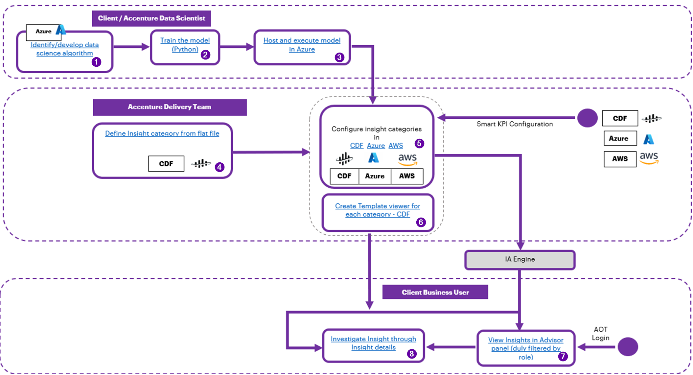

## Getting Started with Intelligent Advisor

Industrial AI Foundation (IAI) is a collection of software accelerators and tools, including Intelligent Advisor, that can be assembled to deliver client solutions. IAI accelerates the integration of product, process, and live data from disparate IT and OT systems, creating a comprehensive and contextualized view of operations to enable better decisions and optimized processes.

The Intelligent Advisor (IA) is an IAI component and an AI-based solution that enables different types of users to focus on critical issues with real-time-generated, prioritized, and contextualized insights and recommendations. It combines the following functional components: Insight generation engine, collaboration, Actions, Advisor panel, Insight Viewer template, and Insight lifecycle management.

### Target Audience

-   Client Delivery Teams Leveraging IAI Intelligent Advisor

-   Asset Delivery Teams

-   Business Analysts, Solution Architects, Technical Architects, Data Scientists, Data Engineers

### Contacts

-   [florian.tournier@accenture.com](mailto:florian.tournier@accenture.com)

-   [judit-kinga.zoltani@accenture.com](mailto:judit-kinga.zoltani@accenture.com)

-   [rajnish.kumar.singh@accenture.com](mailto:rajnish.kumar.singh@accenture.com)

-   [francis.u.tan@accenture.com](mailto:francis.u.tan@accenture.com)

-   [kathleen.m.gomez@accenture.com](mailto:kathleen.m.gomez@accenture.com)

-   [susarla.aditya@accenture.com](mailto:susarla.aditya@accenture.com)

### Related Links

-   [IAI on CDF](https://operationstwin.accenturedigitalplant.com/)

-   [IAI on AWS](https://hostapp-aws.accenturedigitalplant.com/)

-   [IAI on Azure](https://aot-azure.accenturedigitalplant.com/)

-   [IAI Release Notes](https://industryxdevhub.accenture.com/assetdetails/45)

-   [IAI IX Developer Hub Resources](https://industryxdevhub.accenture.com/asset-home;search_text=aot)

### Glossary

| &gt; **Term** | &gt; **Definition** |
| --- | --- |
| &gt; IAI (Industrial AI Foundation) | &gt; A collection of software accelerators and tools designed to integrate product, process, and live data from various IT and OT systems, providing a comprehensive, contextualized view of operations for better decision-making and optimization. |
| &gt; Intelligent Advisor (IA) | &gt; An AI-based solution within IAI that generates real-time, prioritized, and contextualized insights and recommendations for users. Includes insight generation engine, collaboration, actions, advisor panel, and lifecycle management. |
| &gt; Insight Generation Engine | &gt; The core component of IA that is responsible for producing actionable insights from integrated data sources. |
| &gt; Advisor Panel | &gt; A user interface element that displays filtered insights based on user roles. |
| &gt; Insight Viewer Template | &gt; A customizable template for visualizing insights within the IA platform. |
| &gt; Insight Lifecycle Management | &gt; Processes and tools for managing the creation, review, and archiving of insights throughout their lifecycle. |
| &gt; CDF (Connected Digital Framework) | &gt; A platform used to configure and visualize insight categories, asset hierarchies, and other operational data. Integrated with IAI and IA for backend and frontend operations. |
| &gt; AWS | &gt; Amazon Web Services is Amazon\'s on-demand cloud computing platform used to host IAI and IA microservices. |
| &gt; Azure | &gt; Microsoft\'s cloud computing platform, used to host and execute models, configure insights, and integrate with IAI and IA. |
| &gt; KPI (Key Performance Indicator) | &gt; A measurable value that demonstrates how effectively an organization is achieving key business objectives. Smart KPI components must be deployed for KPI-based insights. |
| &gt; ML (Machine Learning) Model | &gt; A predictive algorithm trained on contextualized data to generate insights. ML models must be created, trained, and deployed in specific formats (e.g., .pkl) for use in IA. |
| &gt; Template Viewer | &gt; A UI component for displaying insights by category, configured in CDF. |
| &gt; Smart KPI Configuration | &gt; The process of setting up KPI-based insights, including time series creation and component deployment. |
| &gt; Asset Hierarchy | &gt; The structured organization of assets (e.g., functional locations) used for contextualizing data and insights, often synchronized between SAP and IAI. |
| &gt; SAP | &gt; An enterprise resource planning (ERP) system that must be integrated with IAI for asset hierarchy and data communication. |
| &gt; People Management Component | &gt; A module that manages user rights and access within IAI and IA. |
| &gt; ML Ops Toolchain | &gt; A blueprint for integrating Azure machine learning infrastructure with IAI\'s Intelligent Advisor framework, covering design patterns, workflows, and architecture. |
## User Journey

| **Step** | **Link** **Page** |
| --- | --- |
| 1 | [[IAI Intelligent Advisor Delivery Guide]](https://ts.accenture.com/:b:/r/sites/GlobalDocTemplates/Published%20Documents/AOT/AOT%202.5/AOT_Intelligent_Advisor_Delivery_Guide_2_5.pdf) 5 |
| 2 | [[IAI Intelligent Advisor Delivery Guide]](https://ts.accenture.com/:b:/r/sites/GlobalDocTemplates/Published%20Documents/AOT/AOT%202.5/AOT_Intelligent_Advisor_Delivery_Guide_2_5.pdf) 11 |
| 3 | [[IAI Intelligent Advisor Delivery Guide]](https://ts.accenture.com/:b:/r/sites/GlobalDocTemplates/Published%20Documents/AOT/AOT%202.5/AOT_Intelligent_Advisor_Delivery_Guide_2_5.pdf) 7 |
| 4 | [[IAI Intelligent Advisor Delivery Guide]](https://ts.accenture.com/:b:/r/sites/GlobalDocTemplates/Published%20Documents/AOT/AOT%202.5/AOT_Intelligent_Advisor_Delivery_Guide_2_5.pdf) 14 |
| 5 | [[IAI Intelligent Advisor Delivery Guide]](https://ts.accenture.com/:b:/r/sites/GlobalDocTemplates/Published%20Documents/AOT/AOT%202.5/AOT_Intelligent_Advisor_Delivery_Guide_2_5.pdf) 15 |
| 6 | [[IAI Intelligent Advisor Delivery Guide]](https://ts.accenture.com/:b:/r/sites/GlobalDocTemplates/Published%20Documents/AOT/AOT%202.5/AOT_Intelligent_Advisor_Delivery_Guide_2_5.pdf) 20 |
| 7 | [[IAI Intelligent Advisor UI Guide]](https://ts.accenture.com/:b:/r/sites/GlobalDocTemplates/Published%20Documents/AOT/AOT%202.5/AOT_Intelligent_Advisor_UI_Guide_2_5.pdf) 6 |
| 8 | [[IAI Intelligent Advisor UI Guide]](https://ts.accenture.com/:b:/r/sites/GlobalDocTemplates/Published%20Documents/AOT/AOT%202.5/AOT_Intelligent_Advisor_UI_Guide_2_5.pdf) 27 |
## 

# Resources

The documents listed in the table are also available at the [IX Developer Hub](https://industryxdevhub.accenture.com/assetdetails/43).

| **Document** | **Description** | **Important Topics** |
| --- | --- | --- |
| [IAI Intelligent Advisor Delivery Guide](https://ts.accenture.com/:b:/r/sites/GlobalDocTemplates/Published%20Documents/AOT/AOT%202.5/AOT_Intelligent_Advisor_Delivery_Guide_2_5.pdf) | This document describes the end-to-end process of creating and maintaining insight categories, configuring insights, and defining Insight viewer templates. | Generating Insights |
| [IAI Azure Intelligent Advisor Delivery Guide](https://ts.accenture.com/:b:/r/sites/GlobalDocTemplates/Published%20Documents/AOT/AOT%202.5/AOT_Azure_Intelligent_Advisor_Delivery_Guide_2_5.pdf) |  | Create Insight Category Hierarchies |
| [IAI AWS Intelligent Advisor Delivery Guide](https://ts.accenture.com/:b:/r/sites/GlobalDocTemplates/Published%20Documents/AOT/AOT%202.5/AOT_AWS_Intelligent_Advisor_Delivery_Guide_2_5.pdf) |  | Leverage Azure and CDF to Generate Insights Archiving Insights UC1 -- Predicting Control Valve Failure UC2 -- Smart KPI for OEE Create a User Interface Template (Topics are similar in the Azure and AWS versions of the document) |
| [IAI Intelligent Advisor UI Guide](https://ts.accenture.com/:b:/r/sites/GlobalDocTemplates/Published%20Documents/AOT/AOT%202.5/AOT_Intelligent_Advisor_UI_Guide_2_5.pdf) | This guide explains how to use IAI\'s Intelligent Advisor UI with Template Viewer. | IA Applications -- 5 Main Application -- 6 Intelligent Advisor Panel -- 6 Operations Hierarchy Panel -- 7 Digital Twins Panel -- 7 Insights - 8 Actions - 17 Template Viewer - 25 Insight Details - 26 Recommendations - 27 Related Actions - 27 More Details - 28 |
| [Intelligent Advisor Configuration UI Guide](https://ts.accenture.com/:b:/r/sites/GlobalDocTemplates/Published%20Documents/AOT/AOT%202.5/AOT_Intelligent_Advisor_Configuration_UI_Guide_2_5.pdf) | This guide explains how to use IAI\'s Intelligent Advisor Configuration UI. | Launch the Configuration UI -- 5 IA Configuration Landing Page -- 6 Configure Insights -- 8 Predictive Failure Configuration -- 13 Custom Insight Category -- 21 |
| [Intelligent Advisor API Reference](https://ts.accenture.com/:b:/r/sites/GlobalDocTemplates/Published%20Documents/AOT/AOT%202.4/AOT_Intelligent_Advisor_API_Reference_2_4.pdf) | This reference document includes information about paths, inputs, outputs, and error management for APIs related to IAI Intelligent Advisor. The document includes descriptions of APIs used for configuration as well as descriptions of APIs that provide middleware functionality | Event Data APIs -- 4 Configuration APIs -- 7 ML Model Microservice APIs -11 |
| [ML Ops Toolchain Blueprint](https://ts.accenture.com/:b:/r/sites/GlobalDocTemplates/Published%20Documents/AOT/AOT%202.5/AOT_ML_OPS_Toolchain_Blueprint_2_5.pdf) | This document provides an overview of the Azure machine learning infrastructure and describes how to integrate it with IAI\'s Intelligent Advisor framework. | MLOps Design Patterns -- 4 What is MLOps Azure -- 4 MLOps Versus DevOps -- 4 Architecture -- 5 MLOps Workflow Pipeline - 7 |
## 

# Prerequisites

The prerequisites listed below are unique to Intelligent Advisor. For general prerequisites, see [IAI Getting Started](https://industryxdevhub.accenture.com/assetdetails/75). Before using IAI, the delivery team must:

1.  Create and configure Insight Categories (e.g., KPI-based or ML-based) on the back end. Without Insight Categories, users would not be able to configure insights.

    -   For KPI-based insights:

        -   The Smart KPI component must be deployed.

        -   KPI time series needs to be created.

    -   For ML-based insights:

        -   Input data for ML models must flow into CDF, contextualized to the appropriate asset hierarchy level against which the ML model will be executed.

        -   The list of assets for which the ML model can be configured must be provided in the Template by a Data Scientist.

        -   ML model must be created and trained outside of CDF.

        -   ML models must be available in the pkl format and deployed in the microservice.

2.  Create the relationship between Insight Categories and Templates in CDF. This is necessary to visualize the details at the front end.

3.  The [People Management component](https://industryxdevhub.accenture.com/assetdetails/64) must be configured to ensure that users have the appropriate rights.

4.  Configure the end system (e.g., SAP):

    -   The SAP instance should be in place.

    -   Access and communication have been established between SAP and IAI.

    -   Asset hierarchy (functional location) from SAP matches IAI asset hierarchy.\

        Metadata Table

| **Field** | **Value** |
| --- | --- |
| **Asset / Solution Name** | Industrial AI Foundation / Intelligent Advisor |
| **Domain / Area** | Advisory / Decision Automation |
| **Owner (Team/Person)** | Tournier, Florian |
| **Reviewers** | Zoltani, Judit-Kinga |
| **Status** | Published / Approved |
| **Confidentiality** | Internal / Confidential |
| **Source of Truth** | [Summary - Overview](https://dev.azure.com/DigitalPlantProject/Marilyn%20V) |
| **Related Assets / Alternatives** | Intelligent Advisor UI Guide, Intelligent Advisor Delivery Guide |

