

Industrial AI Foundation

KPI Hierarchy and Calculation

TECHNICAL OVERVIEW

Release Version 2.5

**Metadata Table**

| **Field** | **Value** |
| --- | --- |
| **Asset / Solution Name** | Smart KPIs KPI Hierarchy and Calculation Technical Overview |
| **Domain / Area** | Performance Metrics |
| **Owner (Team/Person)** | Tournier, Florian |
| **Reviewers** | Arumugham, Nithya |
| **Status** | Published / Approved |
| **Confidentiality** | Internal / Confidential |
| **Source of Truth** | [Summary - Overview](https://dev.azure.com/DigitalPlantProject/Marilyn%20V) |
| **Related Assets / Alternatives** | Smart KPIs API Reference, Smart KPIs Admin Guide |

## 

## Introduction

Industrial AI Foundation (IAI) is a collection of software accelerators and tools that are assembled to deliver client solutions. IAI accelerates the integration of product, process, and live data from disparate IT and OT systems, creating a comprehensive and contextualized view of operations to enable better decisions and optimized processes.

Key Performance Indicators (KPIs) are measurable factors that are tracked to measure performance, stimulate actions, and drive business productivity. The factors listed in the table below are used to form each KPI.

| **Factor** | **Description** |
| --- | --- |
| Actual Value | The current value of the KPI calculated using the actual calculation logic defined in the KPI config template. |
| Historical Benchmark | Best performance value observed in the last 12 months. |
| Target Value | Desired performance/value of the KPI. |
| Forecast | Forecast for the current time interval, which is calculated as a 7-day moving average. IAI is integrated with the Cognite Data Fusion (CDF) DataOps platform where the Computation engine is used to calculate the KPI data using the factors above and to insert data points into the timeseries. For the Computation engine to work, a KPI Hierarchy must first be established. |

### 

## Purpose

This document explains:

-   what happens behind the scenes when the Smart KPIs Config tool UI is used to upload the Smart KPIs Config Template.

-   the KPI Hierarchy that must be in place before using the Computation engine service.

-   how the contributing and influencing relationships between KPIs are established.

-   how the relationships between KPIs and assets are established.

-   how Schedulers are created, scheduled, and executed.

### Prerequisites

-   For Scheduling and Sequencing:

    -   A new env variable AZURE_WEBPUB_CS_API must be created in the environment variable library.

    -   A new key-value pair SMARTKPI_HUB_NAME: IAI_SMARTKPI_NOTIFICATION_HUB must be created in the env variable library.

    -   Because the structure has changed, any collections and documents matching the deployment date that are present in the Cosmos DB should be removed before deployment so that a new collection and documents can be created with the correct date and time stamp. If this step is skipped, the collection and documents will be created the following day.

-   The reader must be familiar with the Smart KPIs config template. Refer to the [Smart KPIs Administration Guide](https://industryxdevhub.accenture.com/assetdetails/42) for more information.

### Target Audience

-   Client Delivery Teams planning to deliver IAI

### Contacts

-   [nithya.arumugham@accenture.com](mailto:nithya.arumugham@accenture.com)

-   [thejash.s.suresh@accenture.com](mailto:thejash.s.suresh@accenture.com)

### Related Links

-   [Cognite API Docs](https://docs.cognite.com/api/v1/)

-   [Using Cognite Functions](https://docs.cognite.com/cdf/functions/)

-   [IAI Documentation](https://industryxdevhub.accenture.com/asset-home;search_text=AOT)

### Glossary

| Term / Acronym | Definition |
| --- | --- |
| IAI (Industrial AI Foundation) | A collection of software accelerators and tools designed to integrate product, process, and live data from disparate IT and OT systems, providing a comprehensive view of operations for better decision-making and optimization. |
| KPI (Key Performance Indicator) | Measurable factors tracked to assess performance, stimulate actions, and drive business productivity. KPIs are calculated using actual values, historical benchmarks, targets, and forecasts. |
| CDF (Cognite Data Fusion) | A DataOps platform integrated with IAI, used for storing and processing KPI data, including timeseries data and computation logic. |
| KPI Hierarchy | The structured organization of KPIs, including relationships such as contributing, influencing, and parent-child status, used to manage assets and metadata in IAI. |
| UID / Config ID | Unique identifiers generated for each KPI during hierarchy creation, used for tracking and configuration management. |
| Smart KPIs Config Template | The template uploaded via the Smart KPIs Config tool UI, containing the configuration and calculation logic for KPIs. |
| Scheduler / Scheduling Expression | Component and logic used to define when and how often KPIs are calculated, interacting with the Generic Scheduler API to manage schedules for low-level KPIs. |
| Orchestrator Microservice | Service that manages the calculation flow for KPIs, consuming events from Kafka topics and triggering actual, forecast, and historical calculations. |
| Kafka Message | Event messages exchanged between the Generic Scheduler, Orchestrator, and Computation Engine to manage KPI calculation status and trigger computations. |
| Actual Value | The current value of a KPI, calculated using the defined logic in the KPI config template. |
| Historical Benchmark | The best performance value observed in the last 12 months for a KPI. |
| Target Value | The desired performance or value set for a KPI. |
| Forecast | The predicted value for the current time interval, typically calculated as a 7-day moving average. |
| UoM (Unit of Measurement) | The measurement unit used for KPI data, configurable to match client requirements and converted using dedicated APIs. |
| Asset Mapping | The association of KPIs with specific assets or products, defined in the KPI config template. |
| Contributing KPI | KPIs that directly affect the value or performance of another KPI. |
| Influencing KPI | KPIs that indirectly affect the value or performance of another KPI. |
| Computation Engine | The core service responsible for calculating Actual, Historical, and Forecast values for KPIs at all hierarchy levels. |
| Simulated Value | Artificially generated data points used during development when real-time asset data is unavailable, typically produced via Azure IoT Hub. |
| API (Application Programming Interface) | Interfaces used for interacting with various components, such as the Generic Scheduler, Computation Engine, and UoM conversion. |
| Azure Blob Storage | Cloud storage service used to store configuration files, templates, and processed data for KPI hierarchy creation. |

## 

# KPI Hierarchies

A KPI hierarchy is used to store all the IAI KPIs along with any defined relationships such as contributing, influencing, and parent status. IAI\'s Create KPI Hierarchy function, which is called as a part of the creation API in the SmartKPI Host App, picks the template uploaded by the user from Azure Blob Storage, processes the data, generates UID/Config_ID details (if not present), fetches JSON files uploaded in CDF, and creates the KPI hierarchy by adding assets, relationships, and metadata information. To understand how the files are structured, see the [sample files](https://ts.accenture.com/:u:/r/sites/GlobalDocTemplates/Published%20Documents/AOT/Linked%20Files/Sample_KPI_Files_AOT_1_1.zip?csf=1&amp;web=1&amp;e=ddLBlG). The image below shows the KPI Hierarchy in CDF.

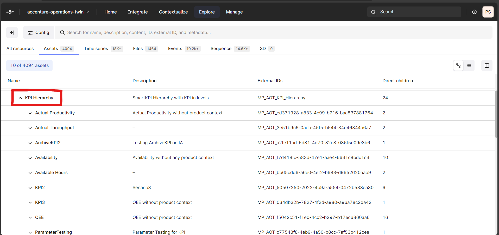

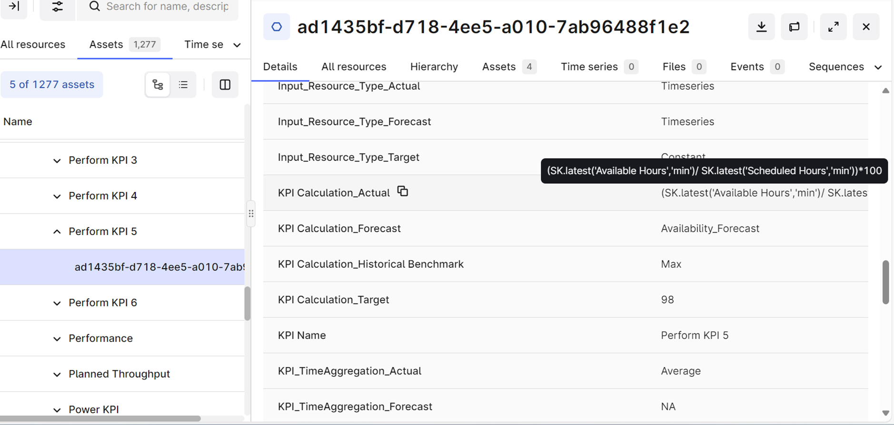

The following image depicts the KPI metadata along with the Config ID in the KPI Timeseries.

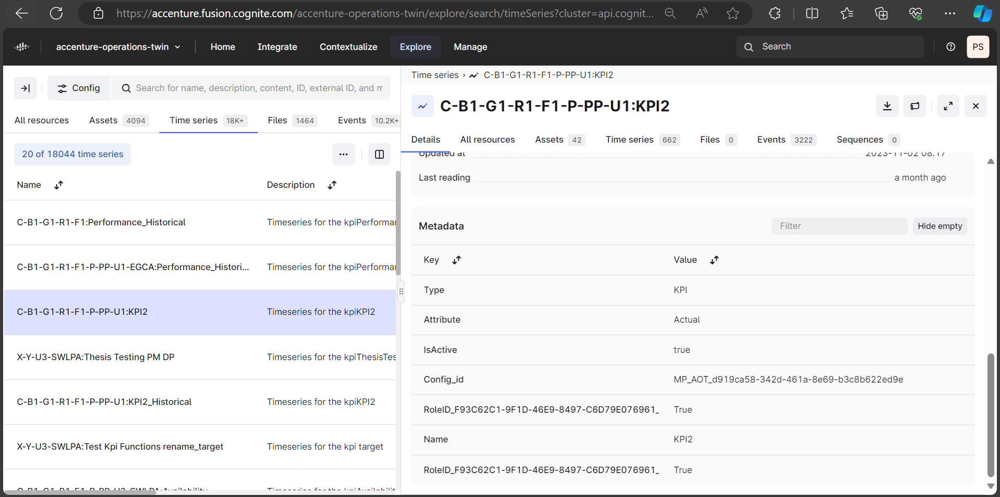

### Create KPI Hierarchy Function

The Create KPI Hierarchy function consists of the following components:

-   UID and Config ID Generation Component

-   Create JSON component

-   KPI Hierarchy component

-   Configuration module

-   Update Status and Version component

The flow diagram depicts the order of flow from one component to another. These components are discussed further in the subsequent sections.

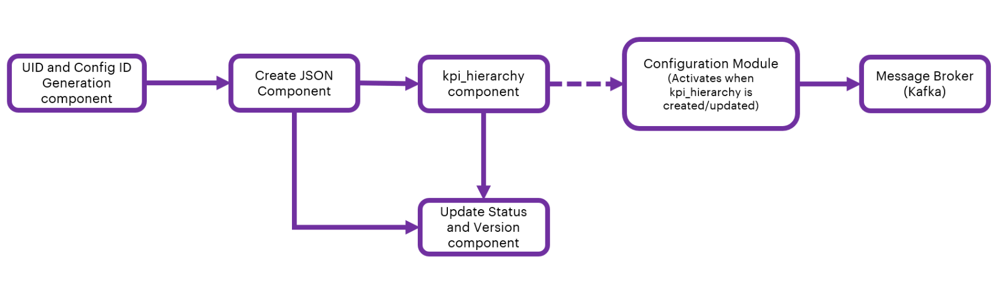

#### 

### 

#### UID/Config ID Generation

To generate the UID and Config ID, files must be located and retrieved from the Azure Blob Storage.

-   When successfully retrieved, the files are further processed by using the ThreadPoolExecuter, which enables parallel processing of multiple files.

-   Each Blob is read into a Pandas DataFrame. The UID/Config_Id generation component then checks for the existence of necessary worksheets and required columns within the DataFrame. The columns checked typically include \'KPI Name\', \'UID\', and \'Config_ID\'.

-   After checking the columns, the UIDs and Config IDs are updated into the DataFrame. This process repeats for every KPI in the Data Frame using the following conditions:

-   If a KPI name is already present in the global_dict, the existing UID is updated and a new Config_ID is generated.

-   If a KPI name is not present, it generates a new UID and Config_ID and updates the global_dict accordingly.

-   The updated data frame is uploaded to the Azure Blob Storage. When uploading, the component ensures that the data structure of the file in the blob and file location are correct.

-   To view responses from the file processing stage, the completion status, and error messages, a detailed response dictionary is constructed.

####  Create JSON

After generating the UID and Config ID, the JSON file must be created from the uploaded file in the blob storage.

-   The Create JSON component receives the file path and file status as input from the generated UID and Config ID.

-   If the file is valid and present in the Azure blob, then the component will extract the data of the file into the data frame and create a JSON from it.

-   The created JSON gets uploaded into the CDF portal.

-   The component also deletes JSON files that are older than 3 months.

-   As a response, the component sends the JSON file name, path, and percentage completion details to 3rd component (kpi_hierarchy).

#### 

### KPI Hierarchy

The KPI Hierarchy is created based on the JSON file created by the kpi_hierarchy component. The component downloads the latest JSON file based on the filename provided. It loads the data into the list collection and creates/updates the following:

-   Asset hierarchy based on the Add, Update, and Archive flags mentioned in the JSON file.

-   Parameters from the KPI_Calculation_Actual column

-   Metadata of all KPIs

-   \'KPI_for\' relation with assets and products under asset_mapping and Product_mapping columns in the KPI config template.

-   Contributing relationship between the KPIs based on the Excel Sheet criteria attached which is titled \'attached_sheet\'.

-   Contributing relationships in the timeseries in case of an Update scenario.

-   Influencing relationships in the timeseries case of the Update scenario.

-   A change_list to generate the events for the Configuration module.

####  Configuration Module 

The configuration module is activated after the KPI Hierarchy function is created or updated. The configuration module performs the following two functions:

-   Detecting changes in:

-   User Roles/Responsible Role

-   Influencing KPIs

-   KPI Calculation Logic

-   Generating corresponding events and dispatching events to a message broker (Kafka) for further consumption by the data permission service.

####  Update Status and Version

This component receives the file path and file status as input from the Create JSON component. Files are retrieved from the specified path in the Blob storage. The Thread Pool Executor is utilized to process these files in parallel.

-   The CDF KPI Hierarchy is retrieved and converted into the data frame using the flat table.

-   The status and version are updated for every row in the Config template as per the Config ID.

-   The updated file is uploaded to the Azure Blob Storage.

-   A detailed response dictionary is constructed which includes the responses from the file processing stage, the completion status, and error messages,

## KPI Calculations

Once the KPI hierarchy is created, the calculation of all the KPIs is performed. For this calculation, a consumer-publisher concept is used to orchestrate the calculation flow. Additionally, to communicate with the Orchestrator Event hubs, WebPubSub message service is used, which is also used for notifications.

The KPI calculations involve various concepts and stages that work simultaneously and interdependently and are described in the subsequent sections.

### Scheduling 

The KPI Hierarchy Processing component is a module of the smartkpi CREATION API (refer to [Smart KPIs API Reference](https://industryxdevhub.accenture.com/assetdetails/42) for more information). It is used to identify which KPIs are purely dependent on parameters. The component identifies low-level KPIs by analyzing Contributing relationships within the KPI hierarchy and filtering out those that are only parameter-dependent. For each identified low-level KPI, a scheduling expression is calculated. This expression defines when and how often the KPI should be calculated. The calculated scheduling expressions are converted into a format compatible with the Generic Scheduler API. The component interacts with the Generic Scheduler API to create schedules for the identified low-level KPIs. It handles creating new schedules, updating existing ones, or archiving obsolete ones.

For example, consider a low-level KPI \'Availability\', whose Asset Hierarchy Mapping is of Level 4. To determine the availability percentage, the KPI calculation relies on two specific parameters (run hours and available hours), which are the contributors as well. The calculation done for the KPI is as per the formula:

KPI Calculation (Actual): (SK.latest(\'Run Hours\',\'%\') / SK.latest(\'Available Hours\',\'%\')) \* 100

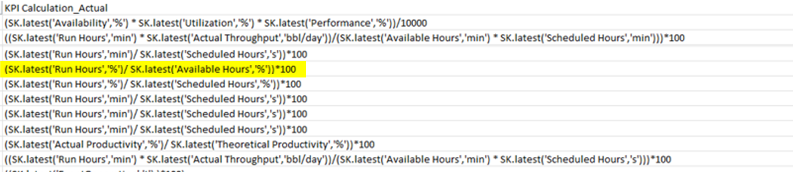

After schedules are successfully created, the component updates the status of the corresponding KPIs. Lower-level KPIs are updated to *Published* and the status of upper-level KPIs is updated based on the completion of their contributing lower-level KPIs. The component also handles multi-plant scenarios where KPIs are aggregated across multiple plants. It ensures that the statuses of multi-plant KPIs are appropriately updated based on the statuses of their contributing plant-level KPIs.

When a task is registered through the Register_Task API, its details are saved in the *scheduled_tasks* table, ensuring that the system has a record of all ongoing schedules.

-   This table is crucial for managing the execution of active SmartKPI schedules, as it holds the most up-to-date information about tasks that are actively being monitored or executed within the system.

-   Tasks related to SmartKPI configuration remain in this table if they are active.

-   If a task is deleted, it is moved to the scheduled_tasks_log table, and a history of its triggers is maintained in the scheduled_tasks_history table.

See the [IAI Generic Scheduler Technical Overview](https://industryxdevhub.accenture.com/assetdetails/83) for information about scheduling expressions.

The images below show the database table where schedules are stored. The table contains columns such as task_id, name, scope, scheduling_exp, and parameters. The scheduling_exp column defines the scheduling expression, which determines how often and when the KPI should be calculated. This ensures that low-level KPIs are regularly updated according to the defined schedules. The system is responsible for handling the creation, updating, and archiving of schedules, ensuring that triggers are executed accurately and in a timely manner.

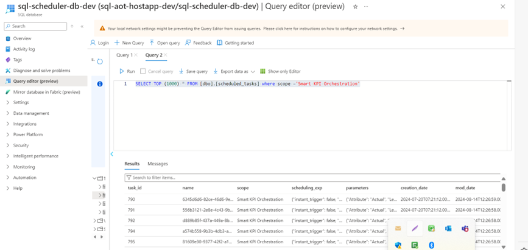

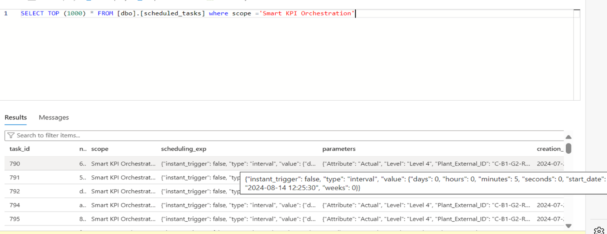

### Orchestrator Microservice

The following diagram depicts the architecture of the orchestrator service in further detail.

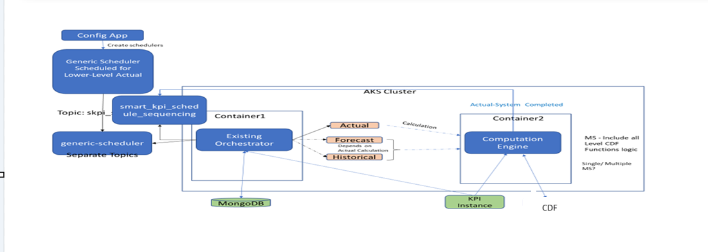

When the user uploads the template from the UI for KPI calculations, the Generic Scheduler schedules the Lower level KPI and produces the events for low-level Actual based on the calculation frequency.

The Orchestrator service consumes the events or messages from the Kafka topic and calls for the \"Actual\", \"Forecast\" and \"Historical\" Calculations.

-   Actual - Computed based on the KPI_Calculation_Actual column provided in the KPI Template.

-   Forecast - Moving average of 7 days data.

-   Historical Calculation - Identify the min /max from last 365/366 days data.

Note that the Forecast and Historical depend on the Actual calculation.

### 

### Kafka Messages

The following table describes how the Orchestrator services receive and send Kafka messages depending on the status.

| Status | Code |
| --- | --- |
| INITIATED | \{ |
| The following code depicts how the Orchestrator Service receives Kafka Messages from the Generic Scheduler when the status equals INITIATED. In the example, Actual Productivity is computed based on parameters ((AvailableHours/ScheduledHours)\*100) so the low-level KPIs will be scheduled by this generic scheduler. Based on the schedule, the general schedular producer sends the Kafka message to the respective Orchestrator service which in turn sends the Kafka message to the Computation Engine to perform the computation. | \"Type\": \"Calculation Event\", \"Scopes\": \[\"Smart KPI Orchestration\"\], \"Timestamp\": \"2023-08-24 09:31:16\", \"Version\": \"1\", \"Payload\": \[\{ \"Attribute\": \"Actual\", \"uid\": \"f7c66e19-03a3-44b2-af5a-5bd4de87af2d\", \"kpi_config_id\": \"\" \"timestamp\": \"2023-08-24 09:31:16\", \"Status\": \"Initiated\", \"Level\": \"System\", \"kpiname\": \"Actual Productivity\" \}\] \} |
| STARTED | \{ |
| The following code depicts how the Orchestrator Service receives Kafka Messages from the Computation Engine when the status equals *STARTED*. After receiving the message, the document (record/file) in the Mongo DB is updated with the status *ONGOING*. | \"Type\": \"Calculation Event\", \"Scopes\": \[\"Smart KPI Orchestration\"\], \"Timestamp\": \"2023-08-24 09:31:16\", \"Version\": \"1\", \"Payload\": \[\{ \"Attribute\": \"Actual\", \"uid\": \"f7c66e19-03a3-44b2-af5a-5bd4de87af2d\", \"kpi_config_id\": \"\" \"timestamp\": \"2023-08-24 09:31:16\", \"Status\": \"Started\", \"Level\": \"System\", \"kpiname\": \"Actual Productivity\" \}\] \} |
| COMPLETED | \{ |
| The following code depicts how the Orchestrator Service receives Kafka Messages from the Computation Engine when the status equals *COMPLETED*. | \"Type\": \"Calculation Event\", |
| After receiving the message, the document (record or file) in the Mongo DB is updated with the status *COMPLETED*. | \"Scopes\": \[\"Smart KPI Orchestration\"\], |
| A Kafka message is triggered when the KPI\'s contributing relationships are identified. This Kafka message initiates the computation of the contributing KPIs as well. Additionally, another Kafka event is created which triggers the computations of the forecast, historical, and target values of the KPI (Actual Productivity) | \"Timestamp\": \"2023-08-24 09:31:16\", \"Version\": \"1\", \"Payload\": \[\{ \"Attribute\": \"Actual\", \"uid\": \"f7c66e19-03a3-44b2-af5a-5bd4de87af2d\", \"kpi_config_id\": \"\" \"timestamp\": \"2023-08-24 09:31:16\", \"Status\": \"Completed\", \"Level\": \"System\", \"kpiname\": \"Actual Prodcutivity\", \"actual_starttime\": \"2023-08-24 09:20:00\", \"actual_endtime\": \"2023-08-24 09:30:00\", \"execution_endtime\": \"2023-08-24 09:31:16\" \}\]\} |

### 

### Table Details

The Orchestrator service uses the following tables from the \" sql-scheduler-db-dev\" to manage Upper-level calls.

| Table | Description |
| --- | --- |
| scheduled_tasks | This table stores information about the low-level KPI scheduler. |
| scheduled_tasks_history | This table stores information about the task history of the scheduler. |

#### API Specifications

The orchestrator microservice uses the POST KPI upper-level call API to manage upper-level KPI calls efficiently.

### 

| PROTOCOL | HTTPS |
| --- | --- |
| PATH (Internal API) |  |
| METHOD | POST |
| CONTENT TYPE | application / json |
| Sample JSON Request and Response | Not Applicable |

#### Result

| HTTP Code | Result Description |
| --- | --- |
| 200 | successful operation |

#### Error Management

| HTTP Code | Error Code Error Description |
| --- | --- |
| 500 | 500 Invalid Data |
| 400 | 401 Unauthorized User / Header Token could be missing |
| 400 | 400 Bad request |

### 

## Simulated Value Creation

When deployed, the source system collects real-time data from hundreds of assets and then sends the asset-related data to CDF using extractors. However, during development, when real-time data does not exist, simulators may be used to simulate data coming from the assets. If no live stream of data exists for the input, then values for the lowest contributing KPI parameters are simulated using Azure\'s IoT Hub. Simulators are scheduled as required, (e.g. to run once per hour to get one simulated value per hour). Floating point values are configured in IoT Hub according to a particular range (Upper Limit/Lower Limit). For demonstration purposes, the Simulated values are stored in a corresponding CDF timeseries ID as shown below.

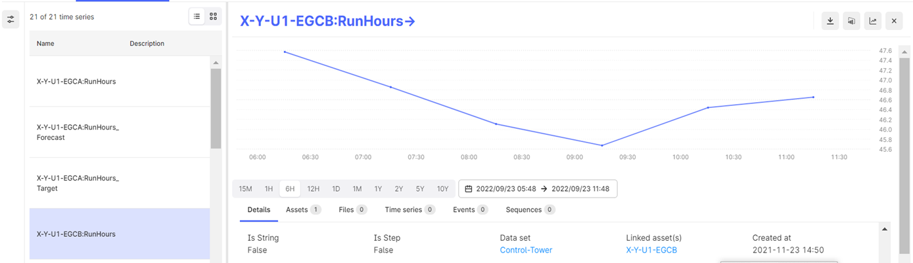

Note that the six-hour span displayed has exactly six simulated points -- exactly one per hour.

## 

## 

### Execution of Scheduled Functions

Calculation frequency can be categorized as either *Same Frequency* or *Different Frequency* across all levels of plant, unit, and system. A bottom-up approach is followed when computing the KPIs. The order of calculations is as per the KPI hierarchy mentioned earlier. The execution of a scheduled CDF function might go as follows:

-   If the generation frequency is one hour, then data points are inserted into the time series parameter scheduled fifteen minutes after the top of every hour (e.g., 01:15, 02:15).

-   If the calculation frequency is one hour, then all lower-level functions are scheduled to start thirty minutes after every hour (e.g., 01:30, 02:30).

-   Once the lowest level call gets triggered by the scheduler, Forecast, and Historical functions calls for that KPI happen respectively.

-   All unit-level functions are called as per the lower level (system level) contribution relationships.

-   All plant-level functions are called as per the lower level (Unit level) contribution relationships.

-   If the calculation frequency is \'*Same Frequency\'*, then the individual frequency parameter for all levels is ignored and the calculation will be executed at the interval set by the calculation frequency. For example, if the calculation frequency is five minutes, then all levels execute at five minutes.

-   If the calculation frequency is \'*Different Frequency\'*, then calculation happens at the interval defined for each level regardless of the value of the calculation frequency.

-   The createOrUpdateKPI_Relation_Asset action creates a relationship between the KPI and the assets.

-   The createOrUpdateParameter_Relation_Asset action creates a relationship between the Parameter and the assets.

-   The Relationship_With_KPIs action creates or updates the relationship between the KPI and any other KPIs that it contributes to or influences:

    -   Contributing KPIs directly affect the value/performance of the selected KPI e.g., availability, performance, and utilization for OEE at the plant level.

    -   Influencing KPIs indirectly affects the value/performance of the selected KPI e.g., the number of safety incidents for OEE at the plant level.

### Computation of Actual Based on KPI Formula

For the computation of Actual for a KPI, the formula specified in the KPI_Calculation_Actual column in the template is parsed using the eval function. For each of the KPI/Parameter specified in the KPI_Calculation_Actual column the combination of Asset:KPIUID /Asset:Parameter is created and the same is utilized to retrieve the data points from the timeseries.

The regex expression (regular expression) helps to format the formula and prepares it as a list collection for further processing in the eval engine.

For example, KPI_Calculation_Actual = SK.latest(\'OEE\',\'%\') the eval engine will parse the formula as OEE and based on the Assets in the assets_mapping column in the template and will format the timeseries id as \"asset:kpiuid\" ie \"X-Y: c303282d-f2e6-46ca-a04a-35d3d873712d\"

### 

## UoM Configuration 

IAI\'s standard UoM, which is integrated with all IAI components, can be modified to meet client requirements. This customization is accomplished by configuring the required UoM in the KPI configuration template as follows:

-   Every asset must have a configured UoM.

-   All assets below plant level inherit the UoM configuration of the plant they belong to.

-   The UoM values in the template must match the UoMs mapped to the unit system used by the plant.

After the user logs in, all the stored data (e.g., KPIs, calculation logic, timeseries) is converted from standard to local UoM and displayed on the UI in the local UoM configured in the template.

##### 

**UoM APIs**

The APIs used in the UoM implementation are as follows:

| \# | API Description |
| --- | --- |
| 1 | GetUnitSystems This API fetches all the unitSystem IDs with their unit system details along with a flag \'isStandard\'. For a particular unit system, this flag will be *True*, for the rest it will be *False*. |
| 2 | GetUoMByUnitSystemId This API fetches the UoM list based on the UnitSystemID mentioned in the query parameter. |
| 3 | GetUoMConversions This API fetches all the conversion a, b, c,- d values irrespective of unit systems. For more information on UoM APIs, refer to the [Units of Measurement API Reference](https://industryxdevhub.accenture.com/assetdetails/87). **\ UoM Conversion Formula** The UoM conversion is done by the following formula: y=a+bx/cx+d Where: |
| - | y= target UoM data |
| - | x=source UoM data, |
| - | a, b, c, and d= pre-defined values to convert from source UoM to target. The Actual calculation formula consists of all contributors: child1, child2, child3 **Conversion Procedure** The following steps describe the process of converting the standard IAI UoM to the user-configured (local) UoM. |
| 1. | Using the GetUnitSystems API, the linked assets are fetched from child1 and the local UnitSystemID for the child1 is determined. |
| 2. | From the child1 timeseries, the standard UoM is determined. |
| 3. | For conversion, the GetUnitSystem API gets all the unitSystemIDs and based on the \'isStandard\' flag the standard unitSystemID is fetched as well. |
| 4. | The standard unitSystemID is passed to the GetUoMByUnitSystemId API as a query parameter. Consequently, the API fetches a list of all UoMs. The step is repeated for the local unitSystemID. |
| 5. | Using the standard UoM list and putting the Primary flag as \'True\', the UoM type is obtained. |
| 6. | Based on the UoM provided in the template formula for each contributor local UoM list is fetched. |
| 7. | For child KPIs/parameters, the standard primary UoM (as specified in the timeseries) is converted to the local UoM mentioned in the KPI formula for each contributor, and all KPI calculations are performed. |
| 8. | For the parent KPI, the local UoM is determined from the KPI hierarchy. Note that it can be either secondary or primary local UoM. Next, the parent\'s local UoM\'s UoMType is determined from the local UoM list and the UoMType is fetched. Note that no primary flag check is done in this case. |
| 9. | Based on the local UoM type and by setting the Primary flag as \'True\', the equivalent standard UoM id is determined from the standard UoM list. 10. The parent KPI data is converted from local UoM to standard Primary UoM before inserting into CDF. For the conversion procedure: |
| - | During insertion, one extra field is inserted in the parent KPI\'s timeseries as \'UoM\' and the standard Primary UoM is set as its value for that KPI. Additionally, unless the first round of KPI calculation is completed for a KPI, the UoM field will not be inserted into its corresponding timeseries. |
| - | Steps 1 to 8 apply to any type of contributor (KPI/Parameter). |
| - | In step 8, local UoM (primary/secondary) must be picked from the corresponding config ID of the KPI. |
| - | From the backend perspective, in the UoM APIs, the \'MeasurementUnit\' field is used (and not the \'Symbol\' field) to compare the data mentioned in the \'UoM\' column of the template. Also, since the UoMs are case-sensitive, the UoM provided by the user in the template should match the UoM configured in the UoM tool. |
| - | The Standard UnitSystem is set the first time of the configuration and cannot be changed later. Similarly, when a UoM has been set as Primary in the Standard UoM list, it cannot be changed. |
| - | The user must always specify the local unit to configure the template formula. In the template, the UoM column should have the Secondary/Primary local UoM. |
| - | Checking UoM from any one asset among the assets listed in the asset mapping list for any KPI is enough to identify the local UoM SystemID for that KPI. |
| - | In the timeseries, the data and the timeseries metadata field is named \'UoM\' and is set based on the Standard UoM system for both KPI and Parameter. This field should have the corresponding value of the \'MeasurementUnit\' field. |
| - | The conversion procedure is applicable for both Single-Plant and Multi-Plant. |
| - | Cache is used to store data for UoM APIs to enhance performance. The following flow diagram illustrates the conversion procedure for an example scenario with the following details: Plant 1 has the following KPI details |
| **KPI Name** | **UoM** **Asset Mapping** **Calculation Logic** |
| KPI1 | UoM1 Asset1, Asset2 Parameter1 + Parameter2 |
| KPI1 | UoM1.1 Uni1, Unit2 Average(KPI1) |
| KPI2 | UoM2 Asset1, Asset2 Latest(KPI1)\*0.5 |
| KPI3 | UoM3 Asset1, Asset2 KPI1 + KPI2 |
| **Unit** | **SI (primary)** **Field** |
| **Mass** | g, kg (primary), mg Lb |
| **Length** | m, cm (primary), mm, km, yards, miles Yards, miles |
| **MT** | UoM1, UoM1.1 (primary) \- |
| **MT2** | UoM2 (primary) \- |
| **MT3** | UoM3, UoM3.1 (primary) \- 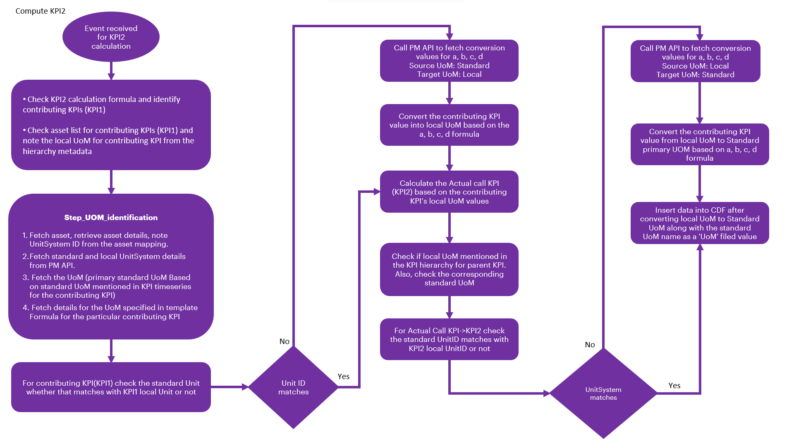
|  |

### Computation Engine

The computation engine comprises three primary calculation components: Calculate Actual and Target, Calculate Historical, and Calculate Forecast. These components are meticulously designed to compute key performance indicators (KPIs) such as Availability, Utilization, Performance, and OEE at every level, from the Leaf to the Root Node within the hierarchy.

Once the KPI Hierarchy is successfully created, these components automatically generate the necessary calculations for each level---such as System, Unit, and Plant---within the hierarchy. For instance, in a scenario with five levels of Asset Hierarchy, there would be a total of 15 calculations, encompassing three for each KPI (Actual, Historical, and Forecast functions).

The diagram on the side depicts the actual calculations of the KPI.

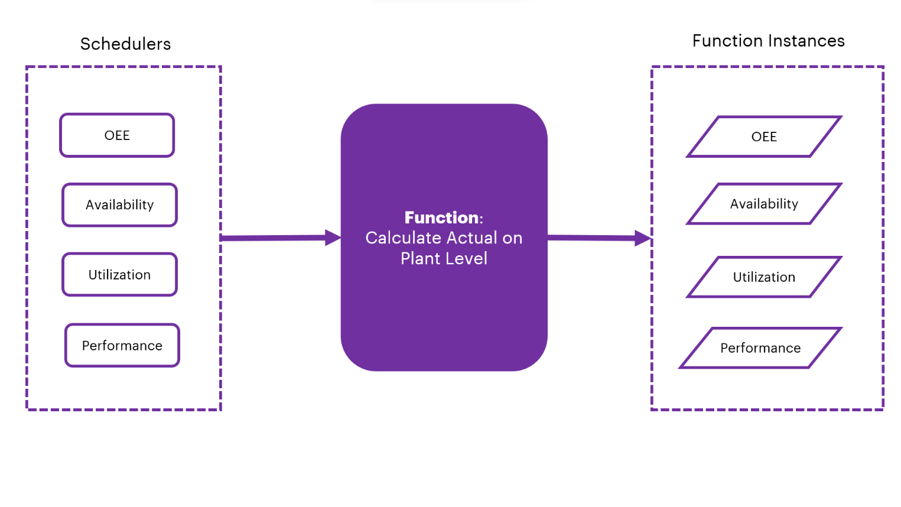

The following steps explain the workflow of the computation engine in detail.

1.  The lowest level Calculate Actual function is invoked according to the schedule.

2.  The function retrieves the details of the KPI for which the call was initiated.

3.  Using these details, it accesses the asset mapping and relevant contributing parameters.

4.  For each asset, it examines the most recent data points inserted into the contributing parameters\' time series.

5.  Utilizing the UoM details specified in the template, the function applies the prescribed formula to compute the actual result.

6.  When the calculation is complete, it inserts the resulting data point into the KPI time series, facilitating the calculation of both Actual and Target values.

7.  After data insertion, the system generates a completion message that is then queued in the message queue. These messages are managed and processed by the Orchestrator.

8.  The Orchestrator triggers the historical and forecast calls as part of the subsequent steps in the computation process.

#### API Specifications

The computation engine microservice calls the POST Web PubSub API to send a notification to the UI for auto-refreshing the tiles.

| PROTOCOL | HTTPS |
| --- | --- |
| PATH (Internal API) |  |
| METHOD | POST |
| CONTENT TYPE | application / json |
| Sample JSON Request and Response | Not Applicable |

#### Result

| HTTP Code | Result Description |
| --- | --- |
| 200 | Successful operation |

#### Error Management

| HTTP Code | Error Code | Error Description |
| --- | --- | --- |
| 500 | 500 | Invalid Data |
| 400 | 401 | Unauthorized User Header Token could be missing |
| 400 | 400 | Bad request |

