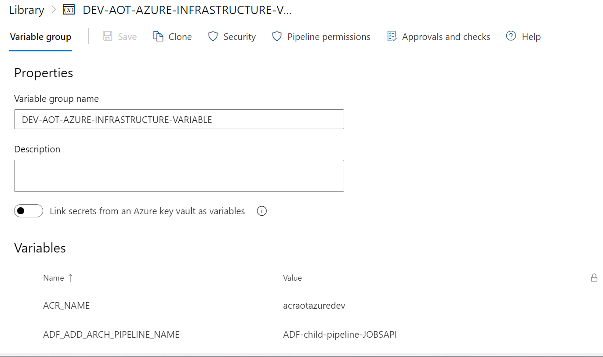
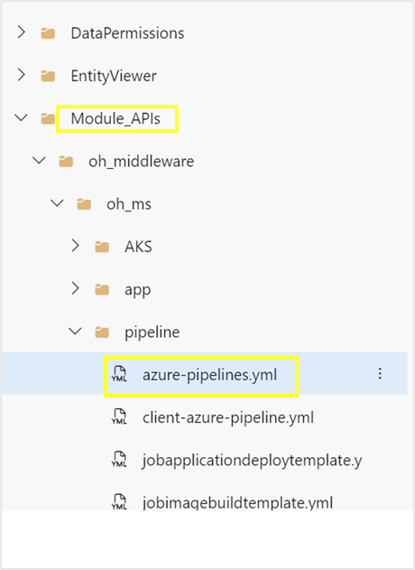
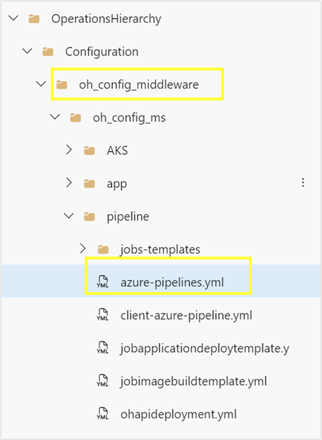
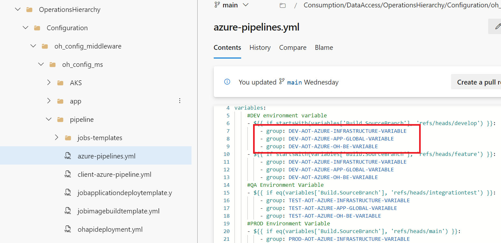
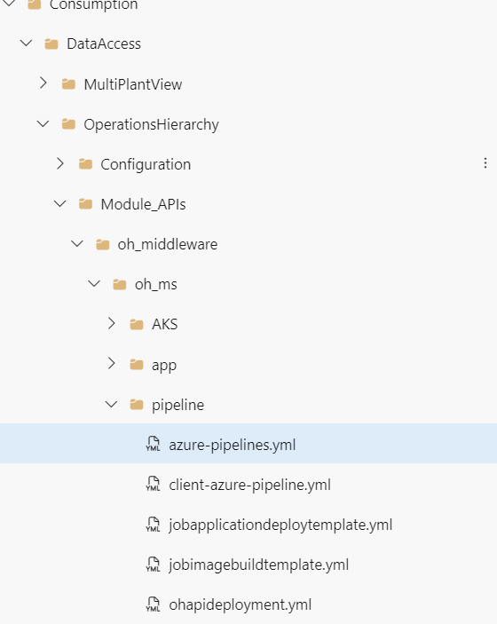
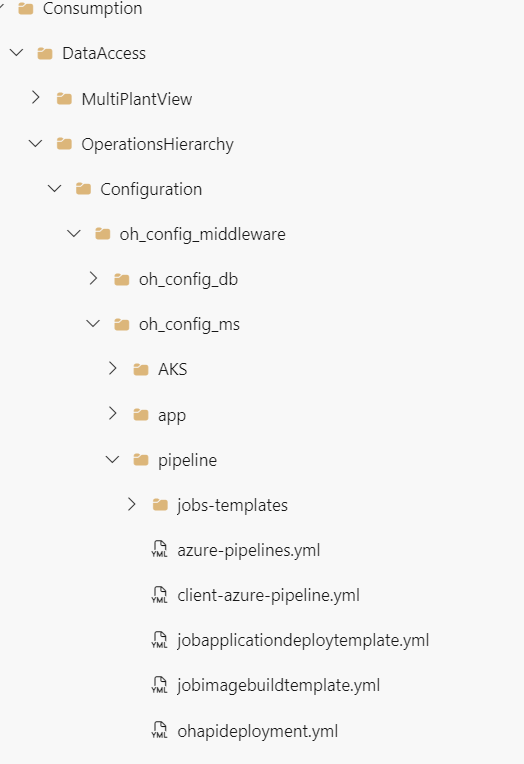
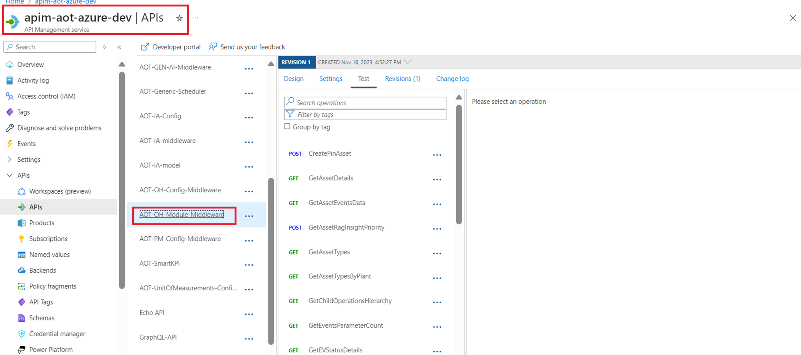
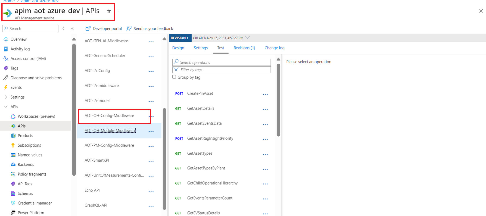

Industrial AI Foundation

Operations Hierarchy

BACKEND DEPLOYMENT GUIDE (AZURE)

Release Version: 2.5

**Metadata Table**

| **Field** | **Value** |
| --- | --- |
| **Asset / Solution Name** | Industrial AI Foundation / Operations Hierarchy |
| **Domain / Area** | Digital Twin / Asset Management |
| **Owner (Team/Person)** | Tournier, Florian |
| **Reviewers** | Ranganathan, Balamurugan |
| **Status** | Published / Approved |
| **Confidentiality** | Internal / Confidential |
| **Source of Truth** | [Summary - Overview](https://dev.azure.com/DigitalPlantProject/Marilyn%20V) |
| **Related Assets / Alternatives** | Operations Hierarchy UI Guide, Operations Hierarchy API Reference |
| # | \{#section .TOC-Heading\} |

## Introduction

Industrial AI Foundation (IAI) is a collection of software accelerators and tools that can be assembled to deliver client solutions. IAI accelerates the integration of product, process, and live data from disparate IT and OT systems, creating a comprehensive and contextualized view of operations to enable better decisions and optimized processes.

Operations Hierarchy (OH) is an IAI component that lets users navigate the plant\'s asset hierarchy and access comprehensive node data. Presented as a tree or two-dimensional view of the plant structure, OH typically starts at the company level and drills down through regions, plants, lines, units, systems, subsystems, and equipment. Integrated with other IAI tools, OH enables access to insights and filtered KPIs for each node.

### Purpose

This guide outlines the deployment process for the OH Module APIs, including Infrastructure as Code Microservice (IaC MS) and Swagger file deployment. It explains how to set up the backend for OH for IAI on the Azure platform and details the creation of resources including the API management platform. **Prerequisites**

-   Azure license/subscription to create resources for implementation.

-   Azure DevOps repository for extractor code, ARM templates, and pipeline files.

-   A service connection on Azure DevOps for running ARM templates.

-   A library to hold the parameters needed to run the template pipeline.

-   Azure service connections for SonarQube and Container Registry.

-   Storage Account

-   Azure Kubernetes Cluster

-   Container Registry

-   Namespace in the AKS cluster for environments

-   Kubernetes Service Connection for AKS Cluster

-   Sonar project and key

### Target Audience

Developers with the following skills:

-   Python

-   Azure Pipelines

-   Swagger Document

### Contacts

-   [b.h.ranganathan@accenture.com](mailto:b.h.ranganathan@accenture.com)

-   [rishabh.b.joshi@accenture.com](mailto:rishabh.b.joshi@accenture.com)

### Related Links

-   [IAI Documentation](https://industryxdevhub.accenture.com/asset-home;search_text=aot)

-   IAI OH [Documentation](https://industryxdevhub.accenture.com/assetdetails/76)

-   [[IAI Release Notes]](https://industryxdevhub.accenture.com/assetdetails/45)

### 

## Glossary

| **Term** | **Definition** |
| --- | --- |
| Azure Pipelines | A cloud-based service in Azure DevOps that automates the building, testing, and deployment of code projects. |
| Swagger Document | A specification for describing and documenting RESTful APIs, enabling both humans and computers to understand the API\'s capabilities. |
| API Management (APIM) | A platform for managing, publishing, and securing APIs, providing a central point for API access and monitoring. |
| IaC (Infrastructure as Code) | The practice of managing and provisioning infrastructure through machine-readable definition files, rather than manual processes. |
| Pipeline | A sequence of automated processes or stages that deliver software from development to deployment. |
| Deployment | The process of releasing, installing, and configuring a software application into a production environment. |
| Test Cases | Specific scenarios designed to verify that a software application functions as expected under various conditions. |
| APIs | Application Programming Interfaces, which allow different software applications to communicate with each other. |
| Image | A packaged version of an application or environment, often used to ensure consistency across deployments. |
| Environment | A distinct configuration space (such as development, testing, or production) where applications are developed, tested, or deployed. |

## 

# Deployment Pipeline

The deployment depends on the IAI OperationsHierarchy-Module-IaC-MS and IAI- OperationsHierarchy-Config-IaC-MS pipeline to create the environment, build the image, run test cases, and deploy the APIs in the API Management using a swagger file. The outcome of this pipeline will enable the user to validate the APIs deployed on the APIM. There are three stages of the pipeline. Each stage serves a specific purpose as described below.

### IAI- OperationsHierarchy-Module-IaC-MS Pipeline

The deployment process consists of three main stages:

#### Stage 1: CreateImage

In this stage, the DockerContanerBuildAndPush process is used to run test cases, perform a SonarQube check, build the Docker image, and push the image to the container registry. An artifact is then created for use in the next stage. This process is defined in the jobimagebuildtemplate.yml file.

#### Stage 2: DeployApplication

The KubernetesDeployment process utilizes the artifact produced in the previous step to deploy the Docker container. The configuration for this stage is found in the jobapplicationdeploytemplate.yml file.

#### Stage 3: APIMIntegration

During this stage, the ApiImportAutomation process leverages the Swagger Document to import and create the API. The corresponding file for this step is ohapideployment.yml.

The YML files listed above can be found at the following file paths:

-   Consumption/DataAccess/OperationsHierarchy/Module_APIs/oh_middleware/oh_ms/pipeline/

-   Consumption/DataAccess/OperationsHierarchy/Configuration/oh_config_middleware/oh_config_ms/pipelineDeployment Steps\\

1.  Create a library in the DevOps portal with the following variable groups.

    a.  DEV-IAI-AZURE-INFRASTRUCTURE-VARIABLE

    b.  DEV-IAI-AZURE -APP-GLOBAL-VARIABLE

    c.  DEV-IAI-AZURE-OH-BE-VARIABLE

1.  

2.  Update the library with the corresponding variables listed in the sheet [IAI_Azure_OH_Backend_Deployment_Variables.xlsx](https://ts.accenture.com/:x:/r/sites/GlobalDocTemplates/Published%20Documents/AOT/Linked%20Files/AOT%20OH%20Backend%20Deployment%20Guide/AOT_Azure_OH_Backend_Deployment_Variables.xlsx?d=w8bc80a63f4af481c9731f9e59aa27160&amp;csf=1&amp;web=1&amp;e=KI5hWt).

> 
3.  

4.  Update the pipeline file with the relevant library name as shown in the screenshots below for both Module and Config APIs.

5.  

6.  Check each YML file found in the folder below to verify that the configured values in each step are updated as necessary.

-   Consumption/DataAccess/OperationsHierarchy/Module_APIs/oh_middleware/oh_ms/pipeline/

> 
-   Consumption/DataAccess/OperationsHierarchy/Configuration/oh_config_middleware/oh_config_ms/pipeline

> 
7.  Open the YML files and verify that the parameters are present under the CreateImage, DeployApplication, and ApiImportAutomation stages.

8.  

9.  Create and then run the pipeline from the following pipeline files:

-   Consumption/DataAccess/OperationsHierarchy/Module_APIs/oh_middleware/oh_ms/pipeline/azure-pipelines.yml

-   Consumption/DataAccess/OperationsHierarchy/Configuration/oh_config_middleware/oh_config_ms/pipeline/azure-pipelines.yml

In the Azure portal, validate that the correct set of APIs was created in API management and that their policies were updated for both OH Module Middleware and OH Config Middleware.

