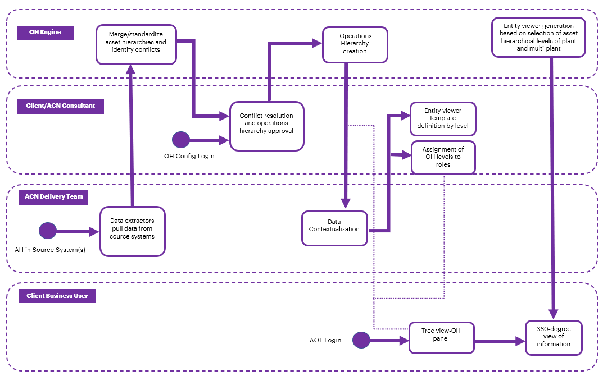

## Getting Started with Operations Hierarchy

*Industrial AI Foundation* (IAI), an *Industrial* *AI Foundation* asset, is a set of software accelerators for the rapid implementation of customized factory-to-cloud applications. These operations twin apps accelerate the integration of product, process, and live data from disparate IT and OT systems, creating a comprehensive and contextualized view of operations to enable better decisions and optimized processes.

The *Industrial AI Foundation* is a portfolio of composable data services for the rapid implementation of Industrial AI solutions that was developed as part of Accenture\'s *Industrial AI* (IAI) initiative. IAI is a multi-disciplinary partnership between Accenture\'s *Data &amp; AI* and *Industry X* groups. The partnership was formed to address domain-specific challenges by employing state-of-the-art AI technology.

Operations Hierarchy (OH) is an IAI component that helps the user navigate through the plant\'s asset hierarchy and view 360-degree information associated with each node. It is a two-dimensional or a tree-view representation of the plant\'s actual layout. An ideal operations hierarchy representation would start with a Company-level node, followed by Region, Plant, Line, Unit, System, Subsystem, Equipment, and so on. When integrated with other IAI components, the OH component can be used to view detailed information such as insights and filtered KPIs related to each level or node.

###  Target Audience

-   Client and Asset Delivery Teams

-   Solution Architects

-   Technical Architects

-   Business Analysts and Consultants

### Prerequisites

The Dimensions and Measures for different types of Visualizations must be known. Data cannot be viewed properly in the Entity Viewer if the dimensions and measures are not correctly mapped to the visualization types.

For general prerequisites, see the [IAI Getting Started](https://industryxdevhub.accenture.com/assetdetails/75) document.

### Contacts

-   [florian.tournier@accenture.com](mailto:florian.tournier@accenture.com)

-   [susarla.aditya@accenture.com](mailto:susarla.aditya@accenture.com)

-   [rishabh.b.joshi@accenture.com](mailto:rishabh.b.joshi@accenture.com)

### Related Links

-   [Release Notes](https://industryxdevhub.accenture.com/assetdetails/45) 

-   [IAI Resources](https://industryxdevhub.accenture.com/asset-home;search_text=aot)

-   [OH Resources](https://industryxdevhub.accenture.com/assetdetails/76)

### 

## 

### Glossary

| Term | Definition |
| --- | --- |
| Operations Hierarchy | The structured organization of operational entities or components within Cognite Data Fusion, allowing for efficient management and navigation. |
| API | Application Programming Interface; a set of protocols and tools for building and interacting with software applications. |
| Config | Configuration; the set-up or arrangement of software settings to customize or optimize system behavior. |
| Middleware | Software that connects different applications or services, facilitating communication and data management. |
| Entity Viewer | A tool or interface used to visualize and interact with different entities within the Operations Hierarchy. |
| Cognite Data Fusion | A data platform designed to integrate, process, and analyze industrial data at scale. |

## Operations Hierarchy User Journey

## Operations Hierarchy Resources

| **Document** | **Description** | **Topic -- Page Number** |
| --- | --- | --- |
| [IAI Operations Hierarchy API Reference](https://ts.accenture.com/:b:/r/sites/GlobalDocTemplates/Published%20Documents/AOT/AOT%202.4/AOT_Operations_Hierarchy_API_Reference_2_4.pdf) | This reference document includes information about the Operations Hierarchy structure present in Cognite Data Fusion. Additionally, the document includes descriptions of the APIs that facilitate configuration and middleware functions. | OH Module APIs -- 4 OH Config APIs -- 24 Entity Viewer Config APIs - 30 |
| [IAI Operations Hierarchy UI Guide](https://ts.accenture.com/:b:/r/sites/GlobalDocTemplates/Published%20Documents/AOT/AOT%202.4/AOT_Operations_Hierarchy_UI_Guide_2_4.pdf) | This document explains how to use the Operation Hierarchy component of the IAI UI. After reading this document, the user should understand how to launch the UI and perform various actions related to the hierarchy of assets. | Launch the Application -- 4 OH Interface -- 6 Structure and Status - 6 Search -- 7 Filter -- 8 Selection -- 8 Entity Viewer Interface -- 9 Entity Viewer Configuration -- 10 Sample Configuration - 11 |
| [IAI Cognite Operations Hierarchy Backend Deployment Guide](https://ts.accenture.com/:b:/r/sites/GlobalDocTemplates/Published%20Documents/AOT/AOT%202.4/AOT_Cognite_Operations_Hierarchy_Backend_Deployment_Guide_2_4.pdf) | This guide describes the deployment of the Operations Hierarchy Module APIs including Infrastructure as Code Microservice (IaC MS) and Swagger file deployment. | Deployment Pipeline -- 4 |
| [IAI Azure Operations Hierarchy Deployment Guide](https://ts.accenture.com/:b:/r/sites/GlobalDocTemplates/Published%20Documents/AOT/AOT%202.4/AOT_Azure_Operations_Hierarchy_Backend_Deployment_Guide_2_4.pdf) |  | Deployment Steps -- 5 |

