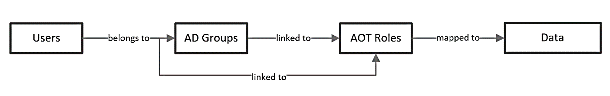
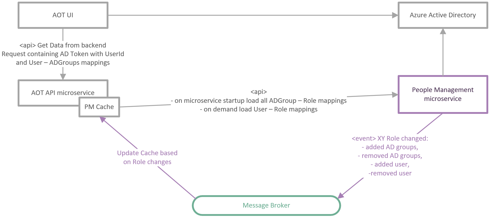
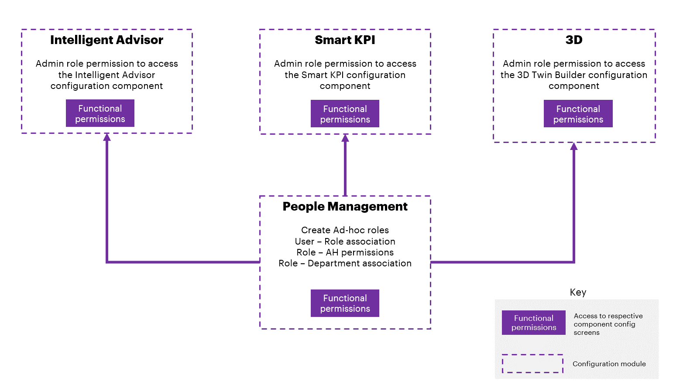
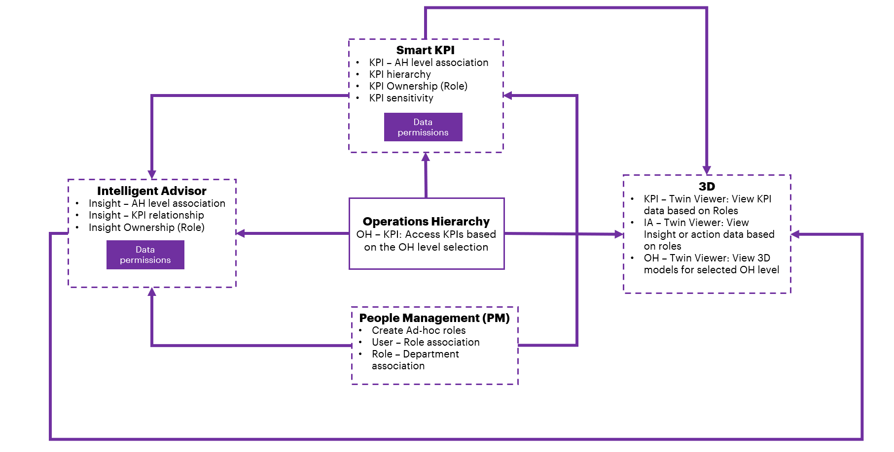
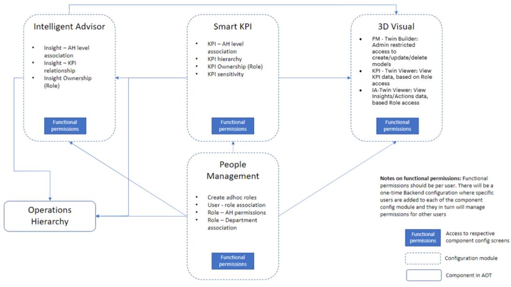
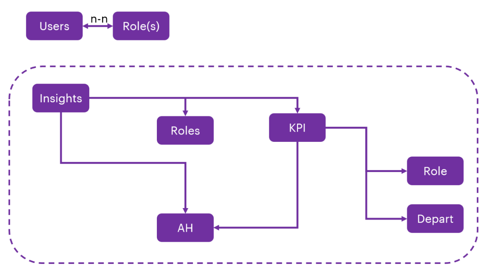

Industrial AI Foundation

People Management

ARCHITECTURE BLUEPRINT

Release Version: 2.5

**Metadata Table**

| **Field** | **Value** |
| --- | --- |
| **Asset / Solution Name** | Industrial AI Foundation / People Management |
| **Domain / Area** | Identity and Access Management |
| **Owner (Team/Person)** | Tournier, Florian |
| **Reviewers** | Gali, Hanuman |
| **Status** | Published / Complete |
| **Confidentiality** | Internal / Confidential |
| **Source of Truth** | [Summary - Overview](https://dev.azure.com/DigitalPlantProject/Marilyn%20V) |
| **Related Assets / Alternatives** | People Management UI Guide, People Management API Reference |

## Introduction

Industrial AI Foundation (IAI) is a collection of software accelerators and tools that can be assembled to deliver client solutions. IAI accelerates the integration of product, process, and live data from disparate informational (IT) and operational (OT) systems, creating a comprehensive and contextualized view of operations to enable better decisions and optimized processes.

People Management (PM) is an IAI component that helps in managing users, their roles, and permissions. It is a digital representation of the organizational hierarchy. The permissions include access to data and functionality in IAI. This component is duly integrated with the client\'s active directory to avoid duplicity.

IAI\'s People Management functionality can be integrated with other IAI components such as Smart KPIs and Intelligent Advisor. The integration requires personal data such as role and department to be fetched from Azure and displayed in IAI. To accomplish this objective, People Management APIs must be deployed in the backend.

### Purpose

This document briefly describes the architecture, components, and layers of the People Management functionality.

### Target Audience

-   Solution Architect

-   Business Analyst

-   Technical Architect

-   Asset Delivery teams

### Related Links

-   [IAI People Management Documentation](https://industryxdevhub.accenture.com/assetdetails/64)

-   [IAI Documentation](https://industryxdevhub.accenture.com/asset-home;search_text=aot)

-   [Release Notes](https://industryxdevhub.accenture.com/assetdetails/45)

### Contacts

-   [florian.tournier@accenture.com](mailto:florian.tournier@accenture.com)

-   [rishabh.b.joshi@accenture.com](mailto:rishabh.b.joshi@accenture.com)

-   [b.h.ranganathan@accenture.com](mailto:b.h.ranganathan@accenture.com)

-   [hanuman.prasad.gali@accenture.com](mailto:hanuman.prasad.gali@accenture.com)

### 

## Glossary

| **Term** | **Definition** |
| --- | --- |
| IAI (Industrial AI Foundation) | A collection of software accelerators and tools designed to integrate product, process, and live data from IT and OT systems, providing a comprehensive view of operations for better decision-making. |
| People Management (PM) | An IAI component that manages users, roles, and permissions, representing the organizational hierarchy and controlling access to data and functionality. |
| Active Directory (AD) | A directory service used for user authentication and group management, integrated with IAI to avoid duplicity and streamline access control. |
| Role | A set of permissions assigned to users or groups, determining their access to data and functionality within IAI. |
| Department | An organizational unit within IAI to which roles and users can be assigned, helping structure access and responsibilities. |
| Admin Role | A privileged role with access to configuration screens, the ability to create new roles and departments, and assign users and groups within IAI. |
| Asset Hierarchy (AH) | The structure representing assets within the organization, used to assign roles and control data access in IAI. |
| KPI (Key Performance Indicator) | Metrics used to measure performance, which can be assigned to roles or departments to control visibility and access. |
| Smart KPI | An IAI component for managing KPIs, including configuration for sensitivity and hierarchical access based on roles and departments. |
| Intelligent Advisor | An IAI component that provides insights and recommendations, integrated with People Management for role-based access to insights and actions. |
| Twin Builder | An IAI component that allows users with Admin roles to configure digital twins, with role-based access to KPIs, Insights, and Actions data. |
| Twin Viewer | A component that displays KPIs, Insights, and Actions data to users based on their assigned roles, with no additional restrictions in the current implementation. |
| Microservice | An independent backend service within IAI that uses People Management APIs to determine user access and cache role mappings for efficient authorization. |
| Configuration UI | The user interface for administrators to manage roles, departments, and permissions within IAI People Management. |
| Knowledge Graph | The data structure used to manage metadata and access rights for business objects in IAI, such as assets, timeseries, and events. |

## Layers

The main layers of the People Management functionality are listed in the table below.

| &gt; **Layer** | &gt; **Description** |
| --- | --- |
| &gt; People Management Configuration UI | &gt; This layer is the interface provided to admin users. Using this interface, admin users can create and manage IAI Roles and Departments. Additionally, this layer can be used to assign IAI roles to various Departments, Active Directory groups, and users. |
| &gt; People Management APIs and Backend Services | &gt; This layer enables querying and updating User and Role information, mapping the Roles to Active Directory Groups, and checking user authorizations. All IAI backend services use People Management services/APIs to determine the exact data access the IAI user has and limit the returned datasets only to the data accessible by the user, based on their role. |
| &gt; CDF DataOps platform | &gt; The platform where the data is stored and tagged (in CDF resource metadata) with all the relevant information, enabling the user to access the data and also determines the level of access (read/write) |

## Authentication and Authorization

For user Authentication, Azure Active Directory is used.

For user Authorization, each IAI micro-frontend will need to determine the user\'s access privileges to the functionality and data based on the user\'s IAI roles. There are two ways a user can be linked to IAI roles to gain access to IAI applications and data:

-   The user is a member of at least one AD Group, which is assigned to at least one IAI role.

-   The user is directly assigned to a Role in IAI.

To enable quick authorization of the user to IAI, each microservice must store a local cache of the user-to-roles mapping and AD groups-to-roles mapping, which is discussed in the next section.\

**Figure**: Mappings with respect to People Management

### 

## 

## Caching

To enable fast authorization of the user to IAI, each microservice must locally cache mappings between both users and roles as well as between AD groups and roles.

An IAI User will have IAI Roles mapped to them in two different ways:

-   Direct User - Role mapping

-   Indirect mapping through AD Groups

A user can be a member of multiple AD Groups which are mapped to multiple IAI Roles. The cache should be implemented as a reusable component (library) in the programming language (Python) used by the microservices. The cache will store the cached data as two lists of key/value pairs in memory -- one list where the key is the UserID and a second list where the key is the AD Group ID. In both lists, the values are represented as a list of IAI Roles mapped to the key.

### Initialization

-   When the cache is initialized inside the microservice, the base URL of the People Management API and the connection information of the Message Broker should be provided by the microservice.

-   The cache will automatically connect to the People Management API and load all the mappings between AD Groups and IAI Roles.

### Updating Cache

-   The cache module itself will be responsible for keeping the data up to date.

-   If the data for a user is not present in the cache, then it will be loaded the first time it is required using the People Management API.

-   The People Management microservice will push change events whenever a role is updated to the Message Broker. The cache will subscribe to these events and will update the cached data accordingly.

### Cache Interface

The Cache will provide three interface methods:

-   An Initialization method/constructor will be used to pass the URL of the People Management API and the connection information of the Message Broker.

-   A Get method will return the user\'s IAI Roles based on UserID and AD Groups for which the user is a member.

-   A Get method will return the user\'s IAI Roles based on the AD token the user possesses

## Permission Types

There are two distinct types of permissions managed in the system: functional permissions and data permissions. Functional permissions control access to the configuration pages of various components, and only users with the admin role are allowed to view or modify these configuration screens. In contrast, data permissions are assigned to IAI business objects, such as asset hierarchy, KPIs, and Insights, based on users\' roles and responsibilities. This means users can access only the data that aligns with the roles they have been mapped to.

The role of the People Management module is to enable administrators to manage access to data and functionality in the platform. People Management has two components: Functional Permissions and Data Permissions.

| **Component** | **Description** |
| --- | --- |
| Functional Permissions | These are the permissions required to access configuration pages of various IAI components such as Smart KPI and Twin Builder. Access to configuration screens is restricted to users with an Admin role. |
| Data Permissions | These are permissions defined for IAI business objects (asset hierarchy, KPIs, Insights, etc.) based on roles and responsibilities. The users have access only to the data their roles are mapped to. |

### Functional Permissions

While deploying the people management code, an Admin Role is created. The Admin Role has access to the configurable pages of various IAI components such as Smart KPI, Twin Builder, People Management, etc. In addition, the Admin Role could further create new roles and new departments. It can assign AD groups and users as well. Hence, an Admin role can give new roles, departments, groups, and users the type of access they require.

Plant users that do not have an Admin Role cannot access the configuration pages. Hence, they see the components as greyed out (not clickable) on the IAI dashboard.

The diagram below illustrates how functional permissions flow within People Management.

### Data Permissions

IAI components can define what role can view what specific data (KPIs, Insights, etc.). For example, a KPI can be assigned to a department/role and as a result, only the users who have been assigned to that department/role can see those KPIs.

Data permissions are managed using custom metadata entries on each CDF object (e.g., Asset, Timeseries, Events, etc.) inside the Knowledge Graph. All the Roles that have owner or viewer access to that object will have their access rights represented on the object\'s metadata.

The diagram below illustrates the integration of IAI components and data permission:

## Integration

People management can be integrated with other IAI components to add restrictions based on Role and/or department.

**Figure**: Diagrammatic view of People Management integration with other IAI components

### 

## 

### Tenants of People Management

The tenants i.e., the components of the IAI application that use People Management are as follows:

-   Users

-   Roles (Groups)

-   Asset Hierarchy (AH)

-   KPI Hierarchy

    -   Contributing

    -   Influencing

-   Intelligent Advisor

-   Data sensitivity

**Figure**: Relation of KPIs and Insights with Role, Department, and Asset Hierarchy

### 

## 

### Integration with Twin Builder

| **Twin Builder** | **Twin Viewer** |
| --- | --- |
| - Admin roles have permission to access the Twin Builder component. | - Based on the role assigned, the user can view KPIs, Insights, and Actions data on Twin Viewer. - No additional restrictions as of the current implementation. |

### Integration with Smart KPIs

| **PM Admin Component Responsibilities** | **End User View** |
| --- | --- |
| - Admin assigns level (s) in AH and the role they belong to. | - Users will have access to all the underlying levels in the AH they belong to. |
| - Admin should have the flexibility to define if the role has access to sensitive data (KPI). | - Users cannot see information beyond the AH level they belong to. |
| - The PM engine should auto-assign owner and viewer access based on the KPI hierarchy (Contributing and Influencing KPIs). | - In the landing screen of the Smart KPIs, the user will see the KPIs for whom they are an owner. |
| - A sensitivity tag is enabled in the Smart KPI configuration for sensitive KPIs and the Roles that could access it. | - Users will have access to underlying contributing/ influencing KPIs provided the AH rule is honored. - Users will have access to sensitive information if the sensitive tag is enabled for their role. |

### Integration with Intelligent Advisor

| **PM Admin Component Responsibilities** | **End User View** |
| --- | --- |
| - Assigns owner of the Insight in IA configuration screen. | - Users will have access to all the underlying levels in the AH they belong to. |
| - Relates Insight with KPI(s). | - Users cannot see information beyond the AH level they belong to. |
| - Leverages KPI configuration (to the maximum extent possible) for Insight configuration for KPI-based Insights. | - Users will see the list of Insights that they are responsible for (assigned to) -- in the capacity of Insight owner. |
| - The PM engine should auto-assign Owner and viewer access based on Insight configuration (Refer to items on the right side) | - Through the KPIs that the user has access to, they can view the insights related to those KPIs, even if these insights in question have not been directly assigned to the user. - If the user has access to an Action (in the capacity of the owner/assigned to), then they will have viewer access to Insight. - If the user has access to an Insight, then they should have access to all the underlying Actions devoid of the Action responsibility (assigned to). - Collaborators: The list of collaborators (users) is displayed per the following logic: - Role assigned to Insight. - Role(s) assigned to underlying action(s) - Roles assigned to related KPIs -- only the owners |

