

Industrial AI Foundation

People Management Configuration

UI GUIDE

Release Version: 2.5

| **Field** | **Value** |
| --- | --- |
| **Asset / Solution Name** | Industrial AI Foundation / People Management |
| **Domain / Area** | Identity and Access Management |
| **Owner (Team/Person)** | Tournier, Florian |
| **Reviewers** | Susarla, Aditya, Rishabh Joshi |
| **Status** | Draft / In Progress |
| **Confidentiality** | Internal / Confidential |
| **Source of Truth** | [Summary - Overview](https://dev.azure.com/DigitalPlantProject/Marilyn%20V) |
| **Related Assets / Alternatives** | People Management Architecture Blueprint, People Management API Reference |

## Introduction

Industrial AI Foundation (IAI) is a collection of software accelerators and tools that can be assembled to deliver client solutions. IAI accelerates the integration of product, process, and live data from disparate IT and OT systems, creating a comprehensive and contextualized view of operations to enable better decisions and optimized processes.

IAI\'s People Management (PM) module is responsible for the management and propagation of roles and permissions throughout the IAI application. People Management Configuration encompasses the management of Departments, Roles, and Users for the IAI application.

### Target Audience

-   IT Admins / Infra team

-   End users of People Management

### Purpose

This document explains how to navigate through the People Management configuration UI once it has been deployed. After reading this document, the user would understand how to launch the PM Config UI and perform various actions like create, edit, revive, and delete on Roles and Departments.

### Prerequisites

-   The following must already be deployed:

    -   PM database

    -   PM backend APIs

    -   PM API management

    -   PM Config UI

-   IAI user must have a Microsoft account and Admin_PeopleManagement Role granted by the Admin.

### Contact

-   [rishabh.b.joshi@accenture.com](mailto:rishabh.b.joshi@accenture.com)

-   [b.h.ranganathan@accenture.com](mailto:b.h.ranganathan@accenture.com)

-   [naveenkumar.na@accenture.com](mailto:naveenkumar.na@accenture.com)

###  Related Links

-   [IAI on CDF](https://operationstwin.accenturedigitalplant.com/)

-   [IAI on Azure](https://aot-azure.accenturedigitalplant.com/)

-   [IAI Resources](https://industryxdevhub.accenture.com/asset-home;search_text=aot)

-   [People Management Resources](https://industryxdevhub.accenture.com/assetdetails/64)[Release Notes](https://industryxdevhub.accenture.com/assetdetails/45)

### Glossary

| **Term** | **Definition** |
| --- | --- |
| IAI (Industrial AI Foundation) | A suite of software accelerators and tools designed to integrate product, process, and live data from various IT and OT systems for improved operational decisions. |
| People Management (PM) | IAI module responsible for managing roles, permissions, departments, and users across the application. |
| PM Config UI | The user interface for configuring People Management settings, including roles, departments, and user assignments. |
| Role | A set of permissions and responsibilities assigned to users, defining their access and actions within the IAI application. |
| Department | An organizational unit within IAI, used to group roles and users for management and reporting purposes. |
| Group | A collection of users within IAI, often used for assigning roles or permissions collectively. |
| Asset Level | The hierarchical level of assets (such as plants or equipment) to which roles and permissions can be assigned. |

## Getting Started

Launch the IAI application and select People Management from the drop-down navigation menu.

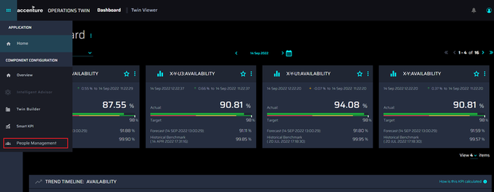

The UI can also be accessed by selecting the People Management tile from the Overview screen.

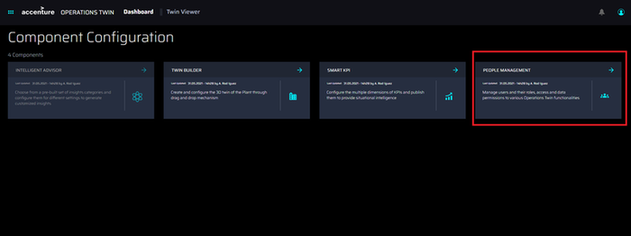

## People Management Dashboard

After clicking on the People Management option in the navigation menu or the People Management tile, the People Management dashboard loads.

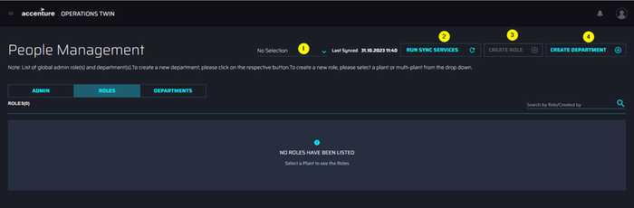

### Controls

| **\#** | **Control** | **Description** |
| --- | --- | --- |
| 1 | Plant selection Dropdown | &gt; Clicking the dropdown results in a popup with a list of available plants. Based on the requirement, a user can select the plant under which the role needs to be created /the set of roles to be visualized. |
| 2 | Run Sync Services | &gt; On clicking the Run sync services button, the backend service is triggered. This will synchronize all the User details in the People Management database. On sync service completion a popup with a success message is populated. |
| 3 | Create Role | &gt; Clicking the Create Role button results in redirection to the Create Role page where the user can create a new Role as described in the Roles section of this document. Note that for non-Admin users, the Create Role button remains disabled until a plant is selected from the drop-down menu. |
| 4 | Create Department | &gt; On clicking this button, the user is redirected to the \'create department\' page. The user can fill in the details and create a new Department as described in the \'Departments\' section of this document. |

## Roles

After a plant has been chosen from the drop-down menu (1), the available Roles (2) under the selected plant appear in the list. The search field (3) allows the user to search for roles by name or creator. Columns can be sorted using the controls in the header (4).

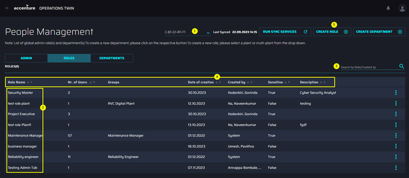

Clicking CREATE ROLE (5) launches a six-step wizard that is used to define the role and choose assets, departments, groups, and users associated with the role.

Note that Admin roles(s) are global and are not mapped to any asset level.

### Create or Revive a Role

A six-step wizard is used to define the role and choose assets, departments, groups, and users associated with the role.

#### Role Definition

The first step of the wizard is to complete the definition of the new role. In this step:

-   Role Name is a mandatory field of three to fifty characters.

-   Entering a role name that matches a role that has been previously archived at the same plant level reveals the option to either revive the archived role or continue to create a new one.

    -   If the \'REVIVE\' option is chosen, the user is guided to edit the archived role.

    -   If the \'CREATE NEW\' option is chosen, the user continues their actions on the same page.

-   The description is an optional field and can contain a maximum of 500 characters.

#### 

### Assign Assets Levels

The second step of the wizard is used to assign departments. In this step:

-   Clicking the \'Select Asset Levels\' button launches a pop-up window with the available asset hierarchy for the selected plant.

-   The user can select/unselect assets using the checkboxes present beside the asset names.

-   At least one asset must be selected.

-   Selection of the parent asset node will automatically select the children underneath it, as it is a hierarchical structure.

-   An \'ASSIGN\' button applies the selections and indicates the number of assets selected.

-   The \'Clear All\' button clears the selected assets.

#### Assign Departments

The second step of the wizard is used to assign departments. In this step:

-   Clicking the \'SELECT DEPARTMENT\' button launches a pop-up window with the available departments.

-   The user can select/unselect departments using the checkboxes present beside the department names.

-   At least one department must be selected.

#### Assign Groups

The third step of the wizard is used to assign groups. In this step:

-   Clicking the \'SELECT GROUPS\' button launches a pop-up menu with the available groups.

-   Entering at least three characters in the search field will display any group names that match the text entered.

-   The user can select/unselect groups using the checkboxes present beside the group names.

-   If no group is selected, then at least one user must be selected in the next step.

#### Assign Users

The fourth step of the wizard is used to assign users. In this step:

-   Clicking the \'SELECT USERS\' button launches a pop-up menu with the available groups.

-   Entering at least three characters in the search field will display any usernames that match the text entered.

-   The user can select/unselect users using the checkboxes present beside the group names.

-   If no group is selected in the previous step, then at least one user must be selected.

#### Summary

The sixth step of the wizard displays a summary page with the details selected in the previous steps. Clicking BACK navigates to the previous steps where the selected information can be edited if required. Clicking the CREATE ROLE button (or the \'Reactivate\' button when reviving a role) confirms the selections.

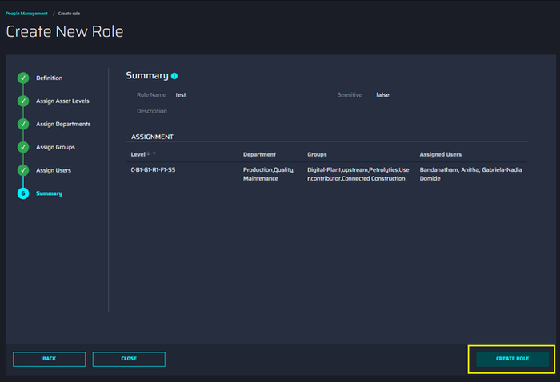

### 

## Edit or Delete a Role

Clicking the vertical ellipsis at the end of the row reveals an overlay with the option to edit or delete.

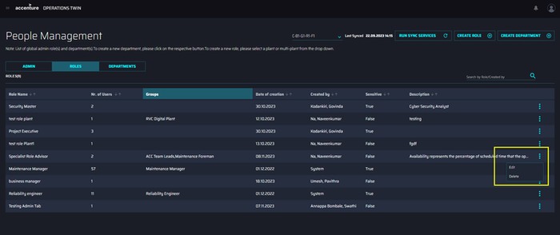

Note that admin roles visible on the ADMIN tab cannot be deleted or renamed. When editing an admin role, departments and assets are not considered and the buttons are disabled.

**Delete Role**

Selecting *Delete* prompts the user to delete the role. The prompt window is as shown in the image on the side.

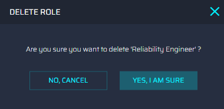

**Edit Role**

Selecting *Edit* launches a wizard identical to the one used to create a role and is depicted in the following screenshot. The user lands on the summary page of the role by default and has the option to go back to the steps to edit information as needed. The SUBMIT option is disabled and gets enabled when changes have been made to the role. The option to delete the role also is available on the wizard.

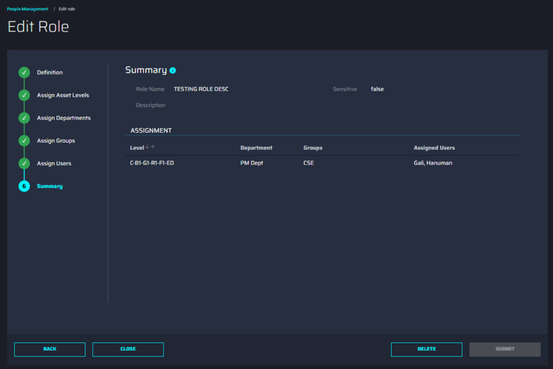

## 

# Departments

-   The Departments tab (1) lists all available departments (2).

-   The departments are arranged in columns as per Name, Number of roles, Created By, Date of creation, and Description. Columns can be sorted using the controls in the header.

-   Clicking on the vertical ellipses alongside a department displays the option to Edit and Delete it (3)

-   The search field (4) allows the user to search for departments by name or creator.

-   Clicking on the CREATE DEPARTMENT option (5) opens a simple wizard used to create a department.

-   Note that Department(s) are global and are not mapped to any asset level.

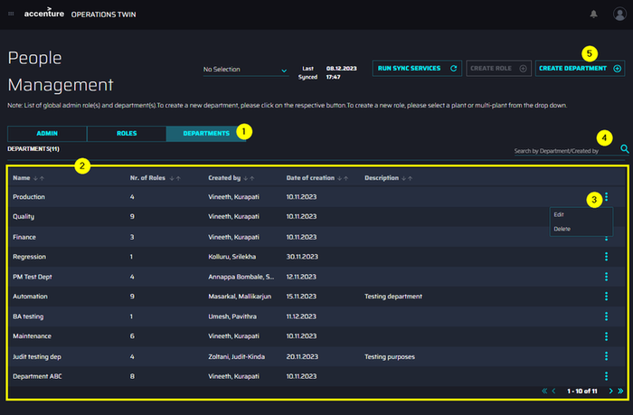

### Create or Revive a Department

A simple wizard is used to create a new department. In this wizard:

-   *Department Name* is a mandatory field that can contain a maximum of 50 characters.

-   Entering a department name that matches a department that has been previously archived reveals the option to either revive the archived department or continue to create a new one.

    -   If the \'REVIVE\' option is chosen, the user is guided to edit the archived department.

    -   If the \'CREATE NEW\' option is chosen, the user continues their actions on the same page.

### Edit or Delete a Department

Clicking the vertical ellipsis at the end of the row reveals an overlay with the option to edit or delete.

**Delete Department**

Selecting \'Delete\' prompts the user to delete the department. The prompt window is as shown in the image on the side.

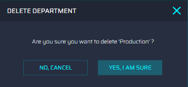

**Edit Department**

Selecting \'Edit\' launches a page used to edit the name and description of the department. The option to submit is disabled until any edits are made to the department. The option to delete the department is also available in this wizard.

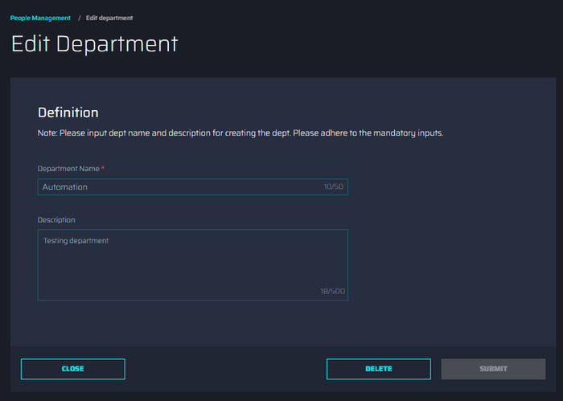

### 

# Troubleshooting

**Issue**: Users without the Admin_PeopleManagement Role will be prevented from accessing the PM UI and will be redirected to the error page.

**Solution**: Contact the Administrator to gain access to the PM UI.

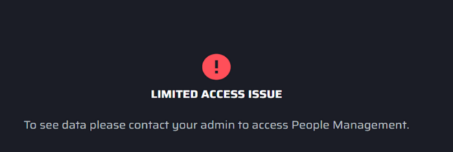

**Error**: Sync service failed error message

**Solution**: This could be a transient issue. Try again later and connect with support if not resolved.

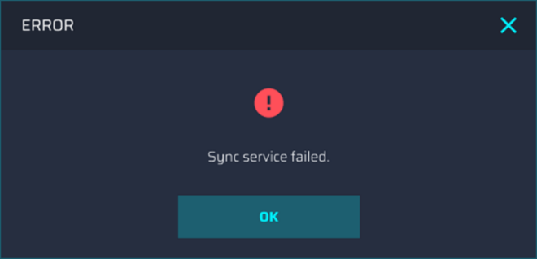

**\
Error**: Unable to delete role or department

**Solution**: Ensure user(s) and group(s) assigned to this role or department have at least one association with another role.

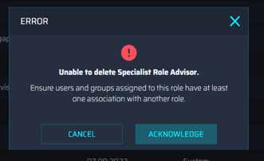
