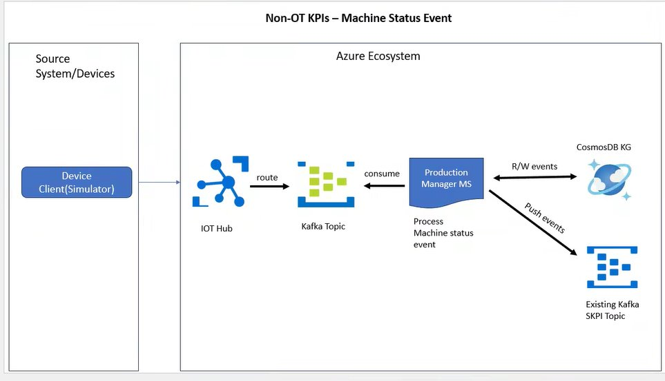
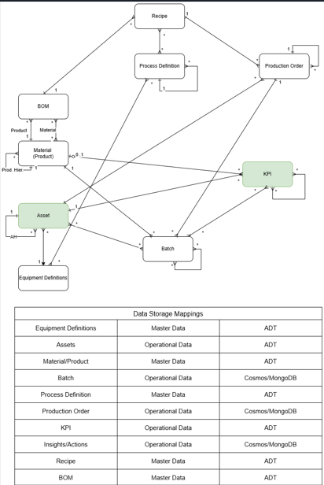

Industrial AI Foundation

Production Manager Microservice

OVERVIEW

Release Version: 2.5

**Metadata Table**

| **Field** | **Value** |
| --- | --- |
| **Asset / Solution Name** | Industrial AI Foundation / IAI |
| **Domain / Area** | Production Manager / Microservice |
| **Owner (Team/Person)** | Tournier, Florian |
| **Reviewers** | Srivastava, Yash |
| **Status** | Draft / In Progress |
| **Confidentiality** | Internal / Confidential |
| **Source of Truth** | [Summary - Overview](https://dev.azure.com/DigitalPlantProject/Marilyn%20V) |
| **Related Assets / Alternatives** | Azure |

## Introduction

Industrial AI Foundation (IAI) is a collection of software accelerators and tools that are assembled to deliver client solutions. IAI accelerates the integration of product, process, and live data from disparate IT and OT systems, creating a comprehensive and contextualized view of operations to enable better decisions and optimized processes.

The Production Manager microservice is part of the IAI (Azure) application suite. It is responsible for retrieving and processing production-related event data from Azure Event Hub and Cosmos DB. The microservice ensures seamless integration between production event sources and the IAI platform.

The Production Manager microservice is responsible for handling real-time production event messages from Azure Event Hub using a process while also exposing API endpoints through a Flask application. The process used is initialized as a separate process using Python\'s multiprocessing. This process runs production event consumers to continuously listen for event messages from the specified Event Hub. After consuming the message from the consumer, the Production Manager processes incoming event data and forwards it to the Cosmos DB. Meanwhile, the Flask application is started on port 5000, providing an API interface for retrieving stored production events. This dual-process approach ensures efficient real-time event handling while maintaining API availability for external clients.

### Purpose

This document describes the Production Manager microservice. It provides API details such as endpoints, authentication requirements, inputs, outputs, error handling, and expected request and/or response formats.

### Target Audience

This documentation is intended for:

-   Developers integrating the Production Manager API into IAI applications.

-   Client Delivery Teams managing production event data.

-   IT Administrators responsible for API security and access control.

### Contacts

-   [yash.srivastava@accenture.com](mailto:yash.srivastava@accenture.com)

-   [nithya.arumugham@accenture.com](mailto:nithya.arumugham@accenture.com)

### Related Links

-   [IAI Documentation](https://industryxdevhub.accenture.com/asset-home;search_text=aot)

-   [Release Notes](https://industryxdevhub.accenture.com/assetdetails/45)

### Glossary

| **Term** | **Definition** |
| --- | --- |
| Production Manager API | A set of application programming interfaces enabling integration and management of production event data in IAI applications. |
| Event Processing | The real-time handling and management of data generated from production events and machine statuses. |
| Azure IoT Hub | A managed service in Microsoft Azure for connecting, monitoring, and managing IoT devices. |
| Cosmos DB | A globally distributed, multi-model database service provided by Microsoft Azure for scalable data storage. |
| Kafka | An open-source platform for building real-time data pipelines and streaming applications, used for event ingestion and processing. |
| Machine Status Events | Data points generated by devices or simulators that reflect the current operational state of machines. |
| KPI (Key Performance Indicator) | A measurable value that demonstrates how effectively a process or machine is achieving key objectives. |
| M/O | Mandatory/Optional |

## 

# Workflow

This workflow ensures real-time event processing, storage, and integration within the Azure ecosystem, enabling effective machine status monitoring and KPI tracking.

As shown in the diagram, machine status events simulated and pushed to the cosmos DB and Kafka topic using various components.

The table below lists the steps in order by component.

| **Step** | **Component** **Workflow** |
| --- | --- |
| 1 | Source System/Devices (Client Simulator) Devices or simulators generate machine status events and send them to Azure IoT Hub. |
| 2 | IoT Hub Acts as the ingestion point for event data and routes it to a Kafka Topic for further processing. |
| 3 | Kafka Topic Receives the event data from IoT Hub and makes it available for the Production Manager Microservice (MS) to consume. |
| 4 | Production Manager Microservice (MS) Consumes machine status events from the Kafka Topic and processes the event data and determines how it should be stored or forwarded. |
| 5 | Data Storage and Event Forwarding The microservice reads/writes event data to Cosmos DB Knowledge Graph (KG) for persistence and retrieval and then pushes processed events to an Existing Kafka SKPI Topic, ensuring that the event data is available for other services or downstream analytics. |

### Data Flow Mapping

| **Component** | **Data Flow** |
| --- | --- |
| Azure Event Hub | Receives production event messages. |
| Cosmos DB | Stores and retrieves event details. |
| Production Manager API | Processes event requests and fetches data from Cosmos DB. |

### 

# Production Manager Service APIs

These APIs extend the IAI data model with the new objects to accommodate batch traceability. 

Data model is extended with the following objects:

-   Production Order

-   Materials

-   Batch

-   Process definition

-   Equipment definition

-   BOM

The IAI process batch model is depicted in the following diagram.

The following table provides details on the Data Storage Mappings.

| **Entity** | **Type of Data** **Data Storage** |
| --- | --- |
| Equipment Definitions | Master Data ADT |
| Assets | Operational Data ADT |
| Material Product | Master Data ADT |
| Batch | Operational Data Cosmos/Mongo DB |
| Process Definition | Master Data ADT |
| Production Order | Operational Data Cosmos/Mongo DB |
| KPI | Operational Data ADT |
| Insights/Actions | Operational Data Cosmos/Mongo DB |
| Recipe | Master Data ADT |
| BOM | Master Data ADT The Production Manager service module APIs are listed below and described in detail in the subsequent sections. |
| - | GetProducts API |
| - | GetBatchDetails API |
| - | GetAttributeslist API |
| - | BatchDetailsGenealogyInsights API |
| - | GoldenBatchShowProfile API |
| - | GoldenBatchAdd API |
| - | GoldenBatchDelete API |
| - | GetOperationalAttributesList API |
| - | GetOperationalAttributeData API |
| - | GetProductOrderDetails API |
| - | GetprocessesByProductionOrder API |
| - | BatchAnalysis API |
| - | TemplateCreate API |
| - | TemplateDelete API |
| - | TemplateUpdate API |
| - | TemplateAttributeDetails API |
| - | GetProductsbyPlant API |
| - | AttributeAnalysis API |
| - | BatchDetailsGetAttributes API |
| - | GetAttributes API |
| - | GetProcessDefinition API |

### 

## Getevents API

The Production Manager microservice uses the *getevents* API to retrieve event details based on asset ID and time range.

#### API Specification

| PROTOCOL | HTTPS |
| --- | --- |
| PATH (Public Exposure) | /getevents?assetid=\{assetid\}&amp;start_date=\{start_date\}&amp;end_date=\{end_date\} |
| METHOD | GET |
| CONTENT TYPE | application / json |
| Response | \{ \"EventID\": \"ABC12345\", \"AssetID\": \"C-B1-G1-R1-F1-P-PP-U1-EGCB\", \"EventStatus\": \"Running\", \"EventStartTime\": 1733212332.117, \"EventEndTime\": 1733212384.332, \"EventDowntimeReason\": \"Start and Finish Production Checklist\", \"EventCreatedTime\": 1733212332.117 \} |

#### Input Header Parameters

| Parameter | Description M/O Max Length Type |
| --- | --- |
| Authorization | Token acquired from Azure AD based on the user credentials for further API calls. e.g., msal, accesstoken : \{ token: \"Bearer \{token\}\" \} M-Public \- String |

#### Input Path Parameters

| Parameter | Description M/O Max Length Type |
| --- | --- |
| assetid | Asset ID M 255 String |
| start_date | Start date (DD -MM-YYYY) M 255 String |
| end_date | End date (DD -MM-YYYY) M 255 String |

#### Output Header Parameters

| Parameter | Description | M/O | Type |
| --- | --- | --- | --- |
| Content-Type | Type of the content. It could be application/json, text/html, application/xml, etc. It lets the receiving entity know how to interpret the data. | M-Public | 255 |
| Content-Length | Length of the content. This is an HTTP header that indicates the size of the body data in bytes. | O-Public | 255 |
| date | Date of operation execution | O-Public | 255 |
| ocp-apim-apiid | This field holds the unique identifier of the API in Azure API Management (APIM). This identifier is used within the APIM instance to distinguish between different APIs. | O-Public | 255 |
| ocp-apim-operationid | This field contains the unique identifier for a particular operation within an API in APIM. This helps in tracing the specific operation or method that was invoked. | O-Public | 255 |
| ocp-apim-productid | This field contains the unique identifier of the product with which the API is associated. In APIM, APIs can be grouped into products, and this field helps identify which product the API belongs | O-Public | 255 |
| ocp-apim-subscriptionid | This field contains the unique identifier of the subscription associated with the APIM instance. In APIM, a subscription relates to the agreement to use an API and provides the primary means for authorization. | O-Public | 255 |
| ocp-apim-trace-location | This field contains the URL where the trace output can be found. This is typically used for debugging purposes. When APIM tracing is enabled, detailed information about the request and response is written to this location, which can help troubleshoot issues. | O-Public | 255 |

#### Output Body Parameters

| Parameter | Description M/O Type |
| --- | --- |
| EventID | Event ID M String |
| AssetID | Asset ID M String |
| EventStartTime | Start Time of event M String |
| EventEndTime | End Time of event O String |
| EventStatus | Status of Event M String |
| EventDowntimeReason | The reason for the asset downtime O String |
| EventCreatedTime | Created time of event M String |

#### Result

| HTTP Code | Result Description |
| --- | --- |
| 200 | Operation executed successfully |

#### Error Management

| HTTP Code | Error Response Error Description |
| --- | --- |
| 500 | \{\"error\": \"Bad request. Missing or invalid data.\"\} Generic Error |
| 401 | \{\"error\": \"Unauthorized. Access token is missing or invalid.\"\} Unauthorized / Header Token could be missing or expired |
| 400 | \{\"error\": \"Internal Server Error.\"\} Bad request |

### BatchFilter API

The Production Manager microservice uses the *BatchFilter* API to retrieve timeseries data (aggregated on daily basis) based on asset ID, batch filter, KPI_Calculation_Actual(filter) and time range.

#### API Specifications

| PROTOCOL | HTTPS |
| --- | --- |
| PATH (Public Exposure) | /batches/filter?\{assetID\}&amp;\{batch_filter\}&amp;\{start_time\}&amp;\{end_time\}&amp;\{filter\} |
| METHOD | GET |
| CONTENT TYPE | application / json |

#### Input Header Parameters

| **Parameter** | **Description** **M/O** **Max Length** **Type** |
| --- | --- |
| Authorization | Token acquired from Azure AD based on the user credentials for further API calls. e.g., msal, accesstoken : \{ token: \"Bearer \{token\}\" \} M-Public \- String |

#### Input Path Parameters

| **Parameter** | **Description** **M/O** **Max Length** **Type** |
| --- | --- |
| assetid | Asset ID M 255 String |
| batch_filter | Status and Product details of batch kpi M 255 String |
| start_date | Start date (YYYY-MM-DDTHH:mm:ss.sssZ) M 255 String |
| end_date | End date (YYYY-MM-DDTHH:mm:ss.sssZ) M 255 String |
| filter | KPI_Calculation_Actual M 255 String |

#### Output Header Parameters

| **Parameter** | **Description** | **M/O** | **Type** |
| --- | --- | --- | --- |
| Content-Type | Type of the content. It could be application/json, text/html, application/xml, etc. It lets the receiving entity know how to interpret the data. | M-Public | 255 |
| Content-Length | Length of the content. This is an HTTP header that indicates the size of the body data in bytes. | O-Public | 255 |
| date | Date of operation execution | O-Public | 255 |
| ocp-apim-apiid | This field holds the unique identifier of the API in Azure API Management (APIM). This identifier is used within the APIM instance to distinguish between different APIs. | O-Public | 255 |
| ocp-apim-operationid | This field contains the unique identifier for a particular operation within an API in APIM. This helps in tracing the specific operation or method that was invoked. | O-Public | 255 |
| ocp-apim-productid | This field contains the unique identifier of the product with which the API is associated. In APIM, APIs can be grouped into products, and this field helps identify which product the API belongs | O-Public | 255 |
| ocp-apim-subscriptionid | This field contains the unique identifier of the subscription associated with the APIM instance. In APIM, a subscription relates to the agreement to use an API and provides the primary means for authorization. | O-Public | 255 |
| ocp-apim-trace-location | This field contains the URL where the trace output can be found. This is typically used for debugging purposes. When APIM tracing is enabled, detailed information about the request and response is written to this location, which can help troubleshoot issues. | O-Public | 255 |

#### Output Body Parameters

| **Parameter** | **Description** **M/O** **Type** |
| --- | --- |
| BatchID | Batch ID M String |
| Parameter | Parameter Name M String |
| Timestamp | Start of each day M Integer |
| Value | Value of the parameter M Float |

#### 

### Sample JSON Response

\[

    \{

        \"BatchId\": \"Batch_123\",

        \"ActualWeight\": \[

            \{

                \"timestamp\": 1760400000000,

                \"value\": 1.2447737392365459

            \},

            \{

                \"timestamp\": 1760313600000,

                \"value\": 1.259738927998645

  \}

        \]

    \},

\{

        \"BatchId\": \"Batch_1134\",

        \"ActualWeight\": \[\],

        \"TargetWeight\": \[\]

    \}

#### Result

| **HTTP Code** | **Result Description** |
| --- | --- |
| 200 | Operation executed successfully |

#### Error Management

| **HTTP Code** | **Error Response** **Error Description** |
| --- | --- |
| 500 | \{\"error\": \"Bad request. Missing or invalid data.\"\} Generic Error |
| 401 | \{\"error\": \"Unauthorized. Access token is missing or invalid.\"\} Unauthorized / Header Token could be missing or expired |
| 400 | \{\"error\": \"Internal Server Error.\"\} Bad request |

## 

## GET- GetProducts

This API is used to get all product details. To fetch the response from the APIs, the following entities must exist.

-   Authorization token

-   Content-Type

#### API Specifications

| PROTOCOL | HTTPS |
| --- | --- |
| PATH IAI (Public Exposure) |  |
| METHOD | GET |
| CONTENT TYPE | application / json |

#### Input Header Parameters

| Parameter | Description M/O Type |
| --- | --- |
| Authorization | Token acquired from Azure AD based on the user credentials for further API calls. . e.g., msal, accesstoken : \{ token: \"Bearer \{token\}\" \} M String |
| Content-Type | Type of content. E.g.- application/json M String |

#### Sample Request

\{\}

#### Output Header Parameters

| Parameter | Description Type |
| --- | --- |
| Server | Contains information about how the server handles requests \[e.g., Werkzeug/2.1.2 Python/3.9.7\] String |
| Content-Type | Type of the content String |
| Date | Date of operation execution e.g. - \[Tue, 17 May 2022 06:30:16 GMT\] Datetime |
| Content-Length | Length of the content Bytes |
| Connection | A general header specifying whether the current network connection stays open once the current transaction finishes String |

#### Output Body Parameters

  -----------------------------------------------------------------------

| Parameter | Description Type |
| --- | --- |
| ProductName | Name of Product String |
| ProductId | ID of the Product String |

#### Sample JSON Response

\"ProdcutDetails\": \[

\{

\"ProductId\": 1,

\"ProductName\": \"Product A\"

\},

\{

\"ProductId\": 2,

\"ProductName\": \"Product S\"

\}

\]

#### Result

| **HTTP Code** | **Result Description** |
| --- | --- |
| 200 | Operation executed successfully |

#### Error Management

| **HTTP Code** | **Error Code** | **Error Description** |
| --- | --- | --- |
| 500 | 500 | Generic Error |
| 400 | 401 | &gt; Unauthorized User &gt; &gt; Header Token could be missing |
| 400 | 400 | &gt; Bad request &gt; &gt; The pinned asset is not present for this user |

### GET- BatchDetails

This API is used to get BatchDetails based on batch numbers. To fetch the response from the APIs, the following entities must exist.

-   Authorization token

-   Content-Type

#### API Specifications

| PROTOCOL | HTTPS |
| --- | --- |
| PATH IAI (Public Exposure) | [https://apim-aot-azure-dev.azure-api.net/api/productionmanager/batches/\{batchid\}](https://apim-aot-azure-dev.azure-api.net/api/productionmanager/batches/%7bbatchid%7d) |
| METHOD | GET |
| CONTENT TYPE | application / json |

#### Input Header Parameters

| Parameter | Description M/O Type |
| --- | --- |
| Authorization | Token acquired from Azure AD based on the user credentials for further API calls. . e.g., msal, accesstoken : \{ token: \"Bearer \{token\}\" \} M String |
| Content-Type | Type of content. E.g.- application/json M String |

#### Output Header Parameters

| Parameter | Description Type |
| --- | --- |
| Server | Contains information about how the server handles requests \[e.g., Werkzeug/2.1.2 Python/3.9.7\] String |
| Content-Type | Type of the content String |
| Date | Date of operation execution e.g. - \[Tue, 17 May 2022 06:30:16 GMT\] Datetime |
| Content-Length | Length of the content Bytes |
| Connection | A general header specifying whether the current network connection stays open once the current transaction finishes String |

#### Output Body Parameters

| Parameter | Description Type |
| --- | --- |
| Batch_ID | Name of the Batch String |
| Start_Time | Start Time of the Batch String |
| End_Time | End Time of the Batch String |
| Product | Name of the Product String |
| Process_Area | Name of the Process Area String |
| Product_Order | Name of the Product Order String |
| Recipe_ID | ID of the Recipe String |
| Recipe_Name | Name of the Recipe String |
| Consumed_Batch_ID | ID of consumed batch String |
| Batch_Status | Status of the Batch String |
| Order_Status | Status of the Order String |
| Batch_Critical_Time | Critical time of Batch String |
| UOM_Material | Name of the UOM Material String |
| Expected_Start_Time | Batch Expected_Start_Time String |
| Expected_End_Time | Batch Expected_End_Time String |
| Status | Status of the Batch String |

#### Sample JSON Response

\{

\"BatchDetails\": \[

\{

\"Batch_ID\": \"Batch_3\",

\"Start_Time\": \"2025-08-25T08:00:00.000Z\",

\"End_Time\": \"2025-08-25T12:00:00.000Z\",

\"process_definition_Id\": \"PROC_003\",

\"Product\": \"PRODUCT_PCT500\",

\"Process_Area\": \"Milling&amp;Sieving\",

\"Product_Order\": \"PO_1\",

\"Recipe_ID\": null,

\"Recipe_Name\": null,

\"Consumed_Batch_ID\": \[

\"Batch_2\"

\],

\"Type\": null,

\"Function\": null,

\"Batch_Status\": null,

\"Order_Status\": null,

\"RMC\": null,

\"Batch_Critical_Time\": null,

\"Status\": \"Completed\",

\"UOM_Material\": \"Tablets\",

\"Expected_Start_Time\": \"2025-08-25T08:00:00.000Z\",

\"Expected_End_Time\": \"2025-08-25T12:00:00.000Z\"

\}

\]

\}

#### Result

| HTTP Code | Result Description |
| --- | --- |
| 200 | Operation executed successfully |

#### Error Management

| HTTP Code | Error Code | Error Description |
| --- | --- | --- |
| 500 | 500 | Generic Error |
| 400 | 401 | &gt; Unauthorized User, Header Token could be missing |
| 400 | 400 | &gt; Bad request, The pinned asset is not present for this user |

### GET- AttributesList

This Attributes list is a post API call which fetches Attributes data from ADT based on different filter parameters sent in request body. To fetch the response from the APIs, the following entities must exist.

-   Authorization token

-   Content-Type

#### API Specifications

| PROTOCOL | HTTPS |
| --- | --- |
| PATH IAI (Public Exposure) |  |
| METHOD | POST |
| CONTENT TYPE | application / json **Input Header Parameters** |
| Parameter | Description M/O Type |
| Authorization | Token acquired from Azure AD based on the user credentials for further API calls. . e.g., msal, accesstoken : \{ token: \"Bearer \{token\}\" \} M String |
| Content-Type | Type of content. E.g.- application/json M String **Output Header Parameters** |
| Parameter | Description Type |
| Server | Contains information about how the server handles requests \[e.g., Werkzeug/2.1.2 Python/3.9.7\] String |
| Content-Type | Type of the content String |
| Date | Date of operation execution e.g. - \[Tue, 17 May 2022 06:30:16 GMT\] Datetime |
| Content-Length | Length of the content Bytes |
| Connection | A general header specifying whether the current network connection stays open once the current transaction finishes String |
| ### | Output Body Parameters |
| Parameter | Description Type |
| attributeids | List of attributes String |
| aggregation | ID of the Product String |
| attributetype | Type of attribute String |
| product | Name of the Products String |
| ### | Sample JSON Response \{ attributeids=\[\" \",\" \"\], aggregation=\[\" \",\" \"\], attributetype=\" \", processid=\[\" \",\" \"\], product=\[\" \", \" \"\] \} |
| ### | Result |
| HTTP Code | Result Description |
| 200 | Operation executed successfully |
| ### | Error Management | HTTP Code | Error Code | Error Description |  | --- | --- | --- |  | 500 | 500 | Generic Error |  | 400 | 401 | &gt; Unauthorized User |  |
|  |  |  |  | &gt; |  |
|  |  |  |  | &gt; Header Token could be missing |  | 400 | 400 | &gt; Bad request |  |
|  |  |  |  | &gt; |  |

### GET- BatchDetailsGenealogyInsights

BatchDetailsGenealogyInsights which fetches batch insight details from COSMOS based on batch number sent in request body. To fetch the response from the APIs, the following entities must exist.

-   Authorization token

-   Content-Type

#### API Specifications

| PROTOCOL | HTTPS |
| --- | --- |
| PATH IAI (Public Exposure) | [https://apim-aot-azure-dev.azure-api.net/api/productionmanager/batches/\{batchid\}/genealogy-insights](https://apim-aot-azure-dev.azure-api.net/api/productionmanager/batches/%7bbatchid%7d/genealogy-insights) |
| METHOD | GET |
| CONTENT TYPE | application / json |
| ### | Input Header Parameters |
| Parameter | Description M/O Type |
| Authorization | Token acquired from Azure AD based on the user credentials for further API calls. . e.g., msal, accesstoken : \{ token: \"Bearer \{token\}\" \} M String |
| Content-Type | Type of content. E.g.- application/json M String |

#### Sample Request

batchid

####  Output Header Parameters

| Parameter | Description Type |
| --- | --- |
| Server | Contains information about how the server handles requests \[e.g., Werkzeug/2.1.2 Python/3.9.7\] String |
| Content-Type | Type of the content String |
| Date | Date of operation execution e.g. - \[Tue, 17 May 2022 06:30:16 GMT\] Datetime |
| Content-Length | Length of the content Bytes |
| Connection | A general header specifying whether the current network connection stays open once the current transaction finishes String |
| ### | Output Body Parameters |
| Parameter | Description Type |
| Batch_ID | Name of the Batch String |
| Start_Time | Start Time of the Batch String |
| End_Time | End Time of the Batch String |
| Product | Name of the Product String |
| Process_Area | Name of the Process Area String |
| Product_Order | Name of the Product Order String |
| Recipe_ID | ID of the Recipe String |
| Recipe_Name | Name of the Recipe String |
| Consumed_Batch_ID | ID of consumed batch String |
| Batch_Status | Status of the Batch String |
| Order_Status | Status of the Order String |
| Batch_Critical_Time | Critical time of Batch String |
| UOM_Material | Name of the UOM Material String |
| Expected_Start_Time | Batch Expected_Start_Time String |
| Expected_End_Time | Batch Expected_End_Time String |
| Status | Status of the Batch String |
| ### | Sample JSON Response \"BATCHGENEALOGY\": \[\ \{\ \"ProcessName\": \"Dispensing\",\ \"ProcessID\": \"PROC001\",\ \"BatchNumber\": \"Batch_3234\",\ \"StartTime\": \"2025-11-06 16:30:00\",\ \"EndTime\": \"2025-11-06 18:30:00\",\ \"Expected_start_time\": \"2025-11-06 16:30:00\",\ \"Expected_end_time\": \"2025-11-06 18:30:00\",\ \"Scheduled_start_time\": \"2025-11-06 16:00:00\",\ \"Scheduled_end_time\": \"2025-11-06 18:00:00\",\ \"lead_time\": \"30 mins\",\ \"Batch_status\": \"Completed with Delay\"\ \} |

#### Result

| HTTP Code | Result Description |
| --- | --- |
| 200 | Operation executed successfully |
| ### | Error Management | HTTP Code | Error Code | Error Description |  | --- | --- | --- |  | 500 | 500 | Generic Error |  | 400 | 401 | &gt; Unauthorized User |  |
|  |  |  |  | &gt; |  |
|  |  |  |  | &gt; Header Token could be missing |  | 400 | 400 | &gt; Bad request |  |
|  |  |  |  | &gt; |  |

### GET- GoldenBatchShowProfile

GoldenBatchShowProfile is the part of the OH-Middleware API invoked by UI and is being consumed by UI. GoldenBatchShowProfile is GET call to OH Middleware IAI server hosted at back-end to get list of Golden Batches. API

To fetch the response from the APIs, the following entities must exist.

-   Authorization token

-   Content-Type

#### API Specifications

| PROTOCOL | HTTPS |
| --- | --- |
| PATH IAI (Public Exposure) | [https://apim-aot-azure-dev.azure-api.net/api/productionmanager/batches/\{batchid\}/genealogy-insights](https://apim-aot-azure-dev.azure-api.net/api/productionmanager/batches/%7bbatchid%7d/genealogy-insights) |
| METHOD | GET |
| CONTENT TYPE | application / json |

#### Sample Request

?batchprocessareaid=PROC_001&amp;batchid=Batch_2&amp;attributeid=C-PC-G1-R1-CT1-PM-PMP-GS-L1-MT:Availability&amp;attributeprocessareaid=PROC_001&amp;batchproductid=PRODUCT_PCT500

#### Input Header Parameters

| Parameter | Description M/O Type |
| --- | --- |
| Authorization | Token acquired from Azure AD based on the user credentials for further API calls. . e.g., msal, accesstoken : \{ token: \"Bearer \{token\}\" \} M String |
| Content-Type | Type of content. E.g.- application/json M String **Output Header Parameters** |
| Parameter | Description Type |
| Server | Contains information about how the server handles requests \[e.g., Werkzeug/2.1.2 Python/3.9.7\] String |
| Content-Type | Type of the content String |
| Date | Date of operation execution e.g. - \[Tue, 17 May 2022 06:30:16 GMT\] Datetime |
| Content-Length | Length of the content Bytes |
| Connection | A general header specifying whether the current network connection stays open once the current transaction finishes String |
| ### | Output Body Parameters |
| Parameter | Description Type |
| Batch_ID | Name of the Batch String |
| Start_Time | Start Time of the Batch String |
| End_Time | End Time of the Batch String |
| Product | Name of the Product String |
| Process_Area | Name of the Process Area String |
| Product_Order | Name of the Product Order String |
| Recipe_ID | ID of the Recipe String |
| Recipe_Name | Name of the Recipe String |
| Consumed_Batch_ID | ID of consumed batch String |
| Batch_Status | Status of the Batch String |
| Order_Status | Status of the Order String |
| Batch_Critical_Time | Critical time of Batch String |
| UOM_Material | Name of the UOM Material String |
| Expected_Start_Time | Batch Expected_Start_Time String |
| Expected_End_Time | Batch Expected_End_Time String |
| Status | Status of the Batch String |

#### 

### Sample JSON Response

\"\[

\{

\"\"Id\"\": \"\"e50c05d6-0eae-4c90-9f1d-af4441a9fbe7\"\",

\"\"BatchID\"\": \"\"VALUE\"\",

\"\"datapoints\"\": \[

\{

\"\"originalTime\"\": \"\"2025-08-25T05: 06: 14.360Z\"\",

\"\"value\"\": 87.37263923621394

\},

\{

\"\"originalTime\"\": \"\"2025-08-25T05: 06: 14.453Z\"\",

\"\"value\"\": 86.95008536379324

\},

\},

\{

\"\"originalTime\"\": \"\"2025-08-25T05: 20: 26.183Z\"\",

\"\"value\"\": 94.83588926346779

\},

\{

\"\"originalTime\"\": \"\"2025-08-25T05: 20: 26.497Z\"\",

\"\"value\"\": 95.46567433535382

\}

\]

\}

\]\"

#### Result

| HTTP Code | Result Description |
| --- | --- |
| 200 | Operation executed successfully |

#### Error Management

| HTTP Code | Error Code | Error Description |
| --- | --- | --- |
| 500 | 500 | Generic Error |
| 400 | 401 | &gt; Unauthorized User &gt; &gt; Header Token could be missing |
| 400 | 400 | &gt; Bad request &gt; &gt; The pinned asset is not present for this user |

### POST- GoldenBatchAdd

The GoldenBatchAdd microservice is the part of the IAI-OH-MS API invoked by UI and is being consumed by UI. GoldenBatchAdd microservice is POST call to IAI-OH-MS server hosted at back-end for insert GoldenBatch configurations into Azure db.

To fetch the response from the APIs, the following entities must exist.

-   Authorization token

-   Content-Type

#### API Specifications

| PROTOCOL | HTTPS |
| --- | --- |
| PATH IAI (Public Exposure) |  |
| METHOD | GET |
| CONTENT TYPE | application / json |

#### Input Header Parameters

| Parameter | Description M/O Type |
| --- | --- |
| Authorization | Token acquired from Azure AD based on the user credentials for further API calls. . e.g., msal, accesstoken : \{ token: \"Bearer \{token\}\" \} M String |
| Content-Type | Type of content. E.g.- application/json M String |

#### Output Header Parameters

| Parameter | Description Type |
| --- | --- |
| Server | Contains information about how the server handles requests \[e.g., Werkzeug/2.1.2 Python/3.9.7\] String |
| Content-Type | Type of the content String |
| Date | Date of operation execution e.g. - \[Tue, 17 May 2022 06:30:16 GMT\] Datetime |
| Content-Length | Length of the content Bytes |
| Connection | A general header specifying whether the current network connection stays open once the current transaction finishes String |

#### Output Body Parameters

| Parameter | Description Type |
| --- | --- |
| Status | Status of the Batch success or Failure. String |
| golden_batch_id | Once we add the golden batch, it will create a golden batch id. String |

#### Sample JSON Response

\{

\"status\": \"success\",

\"golden_batch_id\": \"2e1820c1-4f63-4c7d-b24f-3407710a493b\"

\}

#### Result

| HTTP Code | Result Description |
| --- | --- |
| 200 | Operation executed successfully |

#### Error Management

| HTTP Code | Error Code | Error Description |
| --- | --- | --- |
| 500 | 500 | Generic Error |
| 400 | 401 | &gt; Unauthorized User &gt; &gt; Header Token could be missing |
| 400 | 400 | &gt; Bad request &gt; &gt; The pinned asset is not present for this user |

### DELETE- GoldenBatchDelete 

The GoldenBatchDelete API is the part of the IAI-OH microservice invoked by UI and is being consumed by UI. This microservice is a DELETE call to OH IAI server hosted at back-end to Delete GoldenBatch

To fetch the response from the APIs, the following entities must exist.

-   Authorization token

-   Content-Type

#### API Specifications

| PROTOCOL | HTTPS |
| --- | --- |
| PATH IAI (Public Exposure) | [https://apim-aot-azure-dev.azure-api.net/api/productionmanager/batches/goldenbatches/\ |
| METHOD | DELETE |
| CONTENT TYPE | application / json |

#### Input Header Parameters

| Parameter | Description M/O Type |
| --- | --- |
| Authorization | Token acquired from Azure AD based on the user credentials for further API calls. . e.g., msal, accesstoken : \{ token: \"Bearer \{token\}\" \} M String |
| Content-Type | Type of content. E.g.- application/json M String |

#### Sample Request

/\

#### Output Header Parameters

| Parameter | Description Type |
| --- | --- |
| Server | Contains information about how the server handles requests \[e.g., Werkzeug/2.1.2 Python/3.9.7\] String |
| Content-Type | Type of the content String |
| Date | Date of operation execution e.g. - \[Tue, 17 May 2022 06:30:16 GMT\] Datetime |
| Content-Length | Length of the content Bytes |
| Connection | A general header specifying whether the current network connection stays open once the current transaction finishes String |

#### Output Body Parameters

| Parameter | Description Type |
| --- | --- |
| AttributeId | ID of the Attribute String |
| ProductId | ID of the Product String |
| BatchProcessAreaId | Id of the batch process Area String |
| BatchStartTime | Start time of the Batch String |
| BatchEndTime | End time of the Batch String |

#### Sample JSON Response

\{\"status\": \"Deleted\", \"batch_id\": str(id)\}

#### Result

| **HTTP Code** | **Result Description** |
| --- | --- |
| 200 | Operation executed successfully |

#### Error Management

| **HTTP Code** | **Error Code** | **Error Description** |
| --- | --- | --- |
| 500 | 500 | Generic Error |
| 400 | 401 | &gt; Unauthorized User &gt; &gt; Header Token could be missing |
| 400 | 400 | &gt; Bad request &gt; &gt; The pinned asset is not present for this user |

### GetOperationalAttributesList API

The GetOperationalAttributesList API is to list the details of the Operational Attributes. To fetch the response from the APIs, the following entities must exist.

-   Authorization token

-   Content-Type

#### API Specifications

| **PROTOCOL** | HTTPS |
| --- | --- |
| **PATH IAI (Public Exposure)** | [https://apim-aot-azure-dev.azure-api.net/api/productionmanager/batches/\/attributes](https://apim-aot-azure-dev.azure-api.net/api/productionmanager/batches/%3cid%3e/attributes) |
| **METHOD** | GET |
| **CONTENT TYPE** | application / json |

#### Input Header Parameters

| **Parameter** | **Description** **M/O** **Type** |
| --- | --- |
| Authorization | Token acquired from Azure AD based on the user credentials for further API calls. . e.g., msal, accesstoken : \{ token: \"Bearer \{token\}\" \} M String |
| Content-Type | Type of content. E.g.- application/json M String |

#### Sample Request

/batches/Batch_1/attributes

#### Output Header Parameters

| **Parameter** | **Description** **Type** |
| --- | --- |
| Server | Contains information about how the server handles requests \[e.g., Werkzeug/2.1.2 Python/3.9.7\] String |
| Content-Type | Type of the content String |
| Date | Date of operation execution e.g. - \[Tue, 17 May 2022 06:30:16 GMT\] Datetime |
| Content-Length | Length of the content Bytes |
| Connection | A general header specifying whether the current network connection stays open once the current transaction finishes String |

#### Output Body Parameters

| **Parameter** | **Description** **Type** |
| --- | --- |
| AttributeId | ID of the Attribute String |
| AttributeName | Name of the Attribute String |
| StatisticalAggregation | Type of statistical Aggregation String |
| ProcessArea | Name of the ProcessArea String |
| processareaid | ID of the Process Area String |

#### Sample JSON Response

\{

\"OperationalAttributesList\": \[

\{

\"AttributeId\": \"C-PC-G1-R1-CT1-PM-PMP-DS-L1-MVS:BarcodeqrCodeScanSuccessRate\",

\"AttributeName\": \"BarcodeqrCodeScanSuccessRate\",

\"StatisticalAggregation\": \"Raw Value\",

\"ProcessArea\": \"Dispensing\",

\"processareaid\": \"PROC_001\",

\"GoldenBatchId\": \"\",

\"GoldenAttributeId\": false

\},

\{

\"AttributeId\": \"C-PC-G1-R1-CT1-PM-PMP-DS-L1-MVS:VerificationRate\",

\"AttributeName\": \"VerificationRate\",

\"StatisticalAggregation\": \"Raw Value\",

\"ProcessArea\": \"Dispensing\",

\"processareaid\": \"PROC_001\",

\"GoldenBatchId\": \"\",

\"GoldenAttributeId\": false

\},

\]

\}

#### Result

| **HTTP Code** | **Result Description** |
| --- | --- |
| 200 | Operation executed successfully |

#### Error Management

| **HTTP Code** | **Error Code** | **Error Description** |
| --- | --- | --- |
| 500 | 500 | Generic Error |
| 400 | 401 | &gt; Unauthorized User &gt; &gt; Header Token could be missing |
| 400 | 400 | &gt; Bad request &gt; &gt; The pinned asset is not present for this user |

### GetOperationalAttributeData API

The GetOperationalAttributeData API is to list the details of the Operational Attributes. To fetch the response from the APIs, the following entities must exist.

-   Authorization token

-   Content-Type

#### API Specifications

| **PROTOCOL** | HTTPS |
| --- | --- |
| **PATH IAI (Public Exposure)** | [https://apim-aot-azure-dev.azure-api.net/api/productionmanager/batches/\/attributes/\ |
| **METHOD** | GET |
| **CONTENT TYPE** | application / json |

#### Input Header Parameters

| **Parameter** | **Description** **M/O** **Type** |
| --- | --- |
| Authorization | Token acquired from Azure AD based on the user credentials for further API calls. . e.g., msal, accesstoken : \{ token: \"Bearer \{token\}\" \} M String |
| Content-Type | Type of content. E.g.- application/json M String |

#### Sample Request

/batches/Batch_1/attributes

#### Output Header Parameters

| **Parameter** | **Description** **Type** |
| --- | --- |
| Server | Contains information about how the server handles requests \[e.g., Werkzeug/2.1.2 Python/3.9.7\] String |
| Content-Type | Type of the content String |
| Date | Date of operation execution e.g. - \[Tue, 17 May 2022 06:30:16 GMT\] Datetime |
| Content-Length | Length of the content Bytes |
| Connection | A general header specifying whether the current network connection stays open once the current transaction finishes String |

#### Output Body Parameters

| **Parameter** | **Description** **Type** |
| --- | --- |
| AttributeId | ID of the Attribute String |
| AttributeName | Name of the Attribute String |
| StatisticalAggregation | Type of statistical Aggregation String |
| ProcessArea | Name of the ProcessArea String |
| Processareaid | ID of the Process Area String |

#### Sample JSON Response

\{

\"OperationalAttributesList\": \[

\{

\"AttributeId\": \"C-PC-G1-R1-CT1-PM-PMP-DS-L1-MVS:BarcodeqrCodeScanSuccessRate\",

\"AttributeName\": \"BarcodeqrCodeScanSuccessRate\",

\"StatisticalAggregation\": \"Raw Value\",

\"ProcessArea\": \"Dispensing\",

\"processareaid\": \"PROC_001\",

\"GoldenBatchId\": \"\",

\"GoldenAttributeId\": false

\},

\{

\"AttributeId\": \"C-PC-G1-R1-CT1-PM-PMP-DS-L1-MVS:VerificationRate\",

\"AttributeName\": \"VerificationRate\",

\"StatisticalAggregation\": \"Raw Value\",

\"ProcessArea\": \"Dispensing\",

\"processareaid\": \"PROC_001\",

\"GoldenBatchId\": \"\",

\"GoldenAttributeId\": false

\},

\]

\}

#### Result

| **HTTP Code** | **Result Description** |
| --- | --- |
| 200 | Operation executed successfully |

#### Error Management

| **HTTP Code** | **Error Code** | **Error Description** |
| --- | --- | --- |
| 500 | 500 | Generic Error |
| 400 | 401 | &gt; Unauthorized User &gt; &gt; Header Token could be missing |
| 400 | 400 | &gt; Bad request &gt; &gt; The pinned asset is not present for this user |

### GetProductOrderDetails API

The GetProductOrderDetails API is to get the details of the product order.

To fetch the response from the APIs, the following entities must exist.

-   Authorization token

-   Content-Type

#### API Specifications

| **PROTOCOL** | HTTPS |
| --- | --- |
| **PATH IAI (Public Exposure)** | [https://apim-aot-azure-dev.azure-api.net/api/productionmanager/batches/\/attributes/\ |
| **METHOD** | GET |
| **CONTENT TYPE** | application / json |

#### Input Header Parameters

| **Parameter** | **Description** **M/O** **Type** |
| --- | --- |
| Authorization | Token acquired from Azure AD based on the user credentials for further API calls. . e.g., msal, accesstoken : \{ token: \"Bearer \{token\}\" \} M String |
| Content-Type | Type of content. E.g.- application/json M String |

#### Sample Request

/batches/Batch_1/attributes

#### Output Header Parameters

| **Parameter** | **Description** **Type** |
| --- | --- |
| Server | Contains information about how the server handles requests \[e.g., Werkzeug/2.1.2 Python/3.9.7\] String |
| Content-Type | Type of the content String |
| Date | Date of operation execution e.g. - \[Tue, 17 May 2022 06:30:16 GMT\] Datetime |
| Content-Length | Length of the content Bytes |
| Connection | A general header specifying whether the current network connection stays open once the current transaction finishes String |

#### Output Body Parameters

| **Parameter** | **Description** **Type** |
| --- | --- |
| AttributeId | ID of the Attribute String |
| AttributeName | Name of the Attribute String |
| StatisticalAggregation | Type of statistical Aggregation String |
| ProcessArea | Name of the ProcessArea String |
| Processareaid | ID of the Process Area String |

#### Sample JSON Response

\{

\"OperationalAttributesList\": \[

\{

\"AttributeId\": \"C-PC-G1-R1-CT1-PM-PMP-DS-L1-MVS:BarcodeqrCodeScanSuccessRate\",

\"AttributeName\": \"BarcodeqrCodeScanSuccessRate\",

\"StatisticalAggregation\": \"Raw Value\",

\"ProcessArea\": \"Dispensing\",

\"processareaid\": \"PROC_001\",

\"GoldenBatchId\": \"\",

\"GoldenAttributeId\": false

\},

\{

\"AttributeId\": \"C-PC-G1-R1-CT1-PM-PMP-DS-L1-MVS:VerificationRate\",

\"AttributeName\": \"VerificationRate\",

\"StatisticalAggregation\": \"Raw Value\",

\"ProcessArea\": \"Dispensing\",

\"processareaid\": \"PROC_001\",

\"GoldenBatchId\": \"\",

\"GoldenAttributeId\": false

\},

\]

\}

#### Result

| **HTTP Code** | **Result Description** |
| --- | --- |
| 200 | Operation executed successfully |

#### Error Management

| **HTTP Code** | **Error Code** | **Error Description** |
| --- | --- | --- |
| 500 | 500 | Generic Error |
| 400 | 401 | &gt; Unauthorized User &gt; &gt; Header Token could be missing |
| 400 | 400 | &gt; Bad request &gt; &gt; The pinned asset is not present for this user |

### GetprocessesByProductionOrder API

The GetprocessesByProductionOrder API is to get the details of the product order.

To fetch the response from the APIs, the following entities must exist.

-   Authorization token

-   Content-Type

#### API Specifications

| **PROTOCOL** | HTTPS |
| --- | --- |
| **PATH IAI (Public Exposure)** |  |
| **METHOD** | GET |
| **CONTENT TYPE** | application / json |

#### Input Header Parameters

| **Parameter** | **Description** **M/O** **Type** |
| --- | --- |
| Authorization | Token acquired from Azure AD based on the user credentials for further API calls. . e.g., msal, accesstoken : \{ token: \"Bearer \{token\}\" \} M String |
| Content-Type | Type of content. E.g.- application/json M String |

#### Sample Request

POID

#### Output Header Parameters

| **Parameter** | **Description** **Type** |
| --- | --- |
| Server | Contains information about how the server handles requests \[e.g., Werkzeug/2.1.2 Python/3.9.7\] String |
| Content-Type | Type of the content String |
| Date | Date of operation execution e.g. - \[Tue, 17 May 2022 06:30:16 GMT\] Datetime |
| Content-Length | Length of the content Bytes |
| Connection | A general header specifying whether the current network connection stays open once the current transaction finishes String |

#### Output Body Parameters

| **Parameter** | **Description** **Type** |
| --- | --- |
| AttributeId | ID of the Attribute String |
| AttributeName | Name of the Attribute String |
| StatisticalAggregation | Type of statistical Aggregation String |
| ProcessArea | Name of the ProcessArea String |
| Processareaid | ID of the Process Area String |

#### Sample JSON Response

\{

\"OperationalAttributesList\": \[

\{

\"AttributeId\": \"C-PC-G1-R1-CT1-PM-PMP-DS-L1-MVS:BarcodeqrCodeScanSuccessRate\",

\"AttributeName\": \"BarcodeqrCodeScanSuccessRate\",

\"StatisticalAggregation\": \"Raw Value\",

\"ProcessArea\": \"Dispensing\",

\"processareaid\": \"PROC_001\",

\"GoldenBatchId\": \"\",

\"GoldenAttributeId\": false

\},

\{

\"AttributeId\": \"C-PC-G1-R1-CT1-PM-PMP-DS-L1-MVS:VerificationRate\",

\"AttributeName\": \"VerificationRate\",

\"StatisticalAggregation\": \"Raw Value\",

\"ProcessArea\": \"Dispensing\",

\"processareaid\": \"PROC_001\",

\"GoldenBatchId\": \"\",

\"GoldenAttributeId\": false

\},

\]

\}

#### Result

| **HTTP Code** | **Result Description** |
| --- | --- |
| 200 | Operation executed successfully |

#### Error Management

| **HTTP Code** | **Error Code** | **Error Description** |
| --- | --- | --- |
| 500 | 500 | Generic Error |
| 400 | 401 | &gt; Unauthorized User &gt; &gt; Header Token could be missing |
| 400 | 400 | &gt; Bad request &gt; &gt; The pinned asset is not present for this user |

### BatchAnalysis API

Batch Analysis API is a POST even though it is a GET operation due to the limitation of query parameters that can be sent in the header. It expects process area, forward_Ref,Backward_Ref,start date, end date, and attributes list.

To fetch the response from the APIs, the authorization token and content type entities must exist.

#### API Specifications

| **PROTOCOL** | HTTPS |
| --- | --- |
| **PATH IAI (Public Exposure)** |  |
| **METHOD** | GET |
| **CONTENT TYPE** | application / json |

#### Input Header Parameters

| **Parameter** | **Description** **M/O** **Type** |
| --- | --- |
| Authorization | Token acquired from Azure AD based on the user credentials for further API calls. . e.g., msal, accesstoken : \{ token: \"Bearer \{token\}\" \} M String |
| Content-Type | Type of content. E.g.- application/json M String |
| ### | Output Header Parameters |
| **Parameter** | **Description** **Type** |
| Server | Contains information about how the server handles requests \[e.g., Werkzeug/2.1.2 Python/3.9.7\] String |
| Content-Type | Type of the content String |
| Date | Date of operation execution e.g. - \[Tue, 17 May 2022 06:30:16 GMT\] Datetime |
| Content-Length | Length of the content Bytes |
| Connection | A general header specifying whether the current network connection stays open once the current transaction finishes String |

#### Output Body Parameters

| **Parameter** | **Description** **Type** |
| --- | --- |
| AggregationFunction | Name of the aggregation function String |
| AttributeName | Name of the Attribute String |
| AttributeId | Id of the attribute String |
| AttributeType | Type of the attribute String |
| EPQAId | ID of the EPQAId String |
| HistoricalStdDev | Name of the EPQAId String |
| LowerControlLimit | Value of LowerControlLimit String |
| Process | Name of the Process String |
| Product | Name of the Product String |
| UOM | Unit of Measure String |
| UpperControlLimit | Value of Upper Control Limit String |

#### 

### Sample Request

\{starttime=2025-06-29T10:10:43.911Z,\
endtime=2025-07-29T10:10:43.890Z,\
processid=\"PROC_003\",\
attributes=\"C-PC-G1-R1-CT1-PM-PMP-DS-L1-WS:raw_material_weighing_station_batch_min\",\
forward_ref=\"PROC_005\",\
backward_ref=\"PROC_001\"\}

####  Sample JSON Response

\{\
\"BatchAttributeList\": \[\
\{\
\"AggregationFunction\": \"MINIMUM\",\
\"AttributeId\": \"C-PC-G1-R1-CT1-PM-PMP-DS-L1-WS:raw_material_weighing_station_batch_min\",\
\"AttributeName\": \"raw_material_weighing_station\",\
\"AttributeType\": \"Batch Attribute\",\
\"Criticality\": \"No\",\
\"Data\": \[\],\
\"EPQAId\": 1887,\
\"HistoricalStdDev\": \"228.25\",\
\"LowerControlLimit\": 1.0,\
\"Process\": \"PROCESS 9\",\
\"Product\": \"Product DP2\",\
\"UOM\": \"-\",\
\"UpperControlLimit\": 10.0\
\},

#### 

### Result

| **HTTP Code** | **Result Description** |
| --- | --- |
| 200 | Operation executed successfully |

#### Error Management

| **HTTP Code** | **Error Code** | **Error Description** |
| --- | --- | --- |
| 500 | 500 | Generic Error |
| 400 | 401 | &gt; Unauthorized User / Header Token could be missing |
| 400 | 400 | &gt; Bad request / The pinned asset is not present for this user |

### 

## TemplateCreate API

The template configurations microservice is the part of the IAI-OH-MS API invoked by UI and is being consumed by UI. Template configurations microservice is POST call to IAI-OH-MS server hosted at back end for insert template configurations into Azure db.

To fetch the response from the APIs, the authorization token and content type entities must exist.

#### API Specifications

| **PROTOCOL** | HTTPS |
| --- | --- |
| **PATH IAI (Public Exposure)** |  |
| **METHOD** | POST |
| **CONTENT TYPE** | application / json |

#### Input Header Parameters

| **Parameter** | **Description** **M/O** **Type** |
| --- | --- |
| Authorization | Token acquired from Azure AD based on the user credentials for further API calls. . e.g., msal, accesstoken : \{ token: \"Bearer \{token\}\" \} M String |
| Content-Type | Type of content. E.g.- application/json M String |

#### Output Header Parameters

| **Parameter** | **Description** **Type** |
| --- | --- |
| Server | Contains information about how the server handles requests \[e.g., Werkzeug/2.1.2 Python/3.9.7\] String |
| Content-Type | Type of the content String |
| Date | Date of operation execution e.g. - \[Tue, 17 May 2022 06:30:16 GMT\] Datetime |
| Content-Length | Length of the content Bytes |
| Connection | A general header specifying whether the current network connection stays open once the current transaction finishes String |

#### Output Body Parameters

| **Parameter** | **Description** **Type** |
| --- | --- |
| templateName | Name of the template String |
| attributeList | List of Attribute String |

#### Sample Request

\{\
\"templateName\": \"Test_process10\",\
\"attributeList\": \[\
\"C-PC-G1-R1-CT1-PM-PMP-DS-L1-MVS:BarcodeqrCodeScanSuccessRate\",\
\"C-PC-G1-R1-CT1-PM-PMP-DS-L1-TS:CycleTime\"\
\],\
\"isGlobal\": false\
\}

####  Sample JSON Response

\{

\"TemplateConfiguration\": \[

\{

\"uid\": \"38f119a7-a455-44b2-bcd5-6e692a528838\",

\"templateName\": \"Test_process10\",

\"attributeList\": \[

\"C-PC-G1-R1-CT1-PM-PMP-DS-L1-MVS:BarcodeqrCodeScanSuccessRate\",

\"C-PC-G1-R1-CT1-PM-PMP-DS-L1-TS:CycleTime\"

\]

\}

\]

\}

#### Result

| **HTTP Code** | **Result Description** |
| --- | --- |
| 200 | Operation executed successfully |

#### Error Management

| **HTTP Code** | **Error Code** **Error Description** |
| --- | --- |
| 500 | 500 Generic Error |
| 400 | 401 Unauthorized User / Header Token could be missing |
| 400 | 400 Bad request / The pinned asset is not present for this user |

### TemplateDelete API

The template configurations microservice is the part of the IAI-OH-MS API invoked by UI and is being consumed by UI. Template configurations microservice is POST call to IAI-OH-MS server hosted at back end to delete the template configurations in Azure db.

To fetch the response from the APIs, the authorization token and content type entities must exist.

#### API Specifications

| **PROTOCOL** | HTTPS |
| --- | --- |
| **PATH IAI (Public Exposure)** | [https://apim-aot-azure-dev.azure-api.net/api/productionmanager/templateconfigurations/\ |
| **METHOD** | Delete |
| **CONTENT TYPE** | application / json |

#### Input Header Parameters

| **Parameter** | **Description** **M/O** **Type** |
| --- | --- |
| Authorization | Token acquired from Azure AD based on the user credentials for further API calls. . e.g., msal, accesstoken : \{ token: \"Bearer \{token\}\" \} M String |
| Content-Type | Type of content. E.g.- application/json M String |

#### Output Header Parameters

| **Parameter** | **Description** **Type** |
| --- | --- |
| Server | Contains information about how the server handles requests \[e.g., Werkzeug/2.1.2 Python/3.9.7\] String |
| Content-Type | Type of the content String |
| Date | Date of operation execution e.g. - \[Tue, 17 May 2022 06:30:16 GMT\] Datetime |
| Content-Length | Length of the content Bytes |
| Connection | A general header specifying whether the current network connection stays open once the current transaction finishes String |

#### Output Body Parameters

| **Parameter** | **Description** **Type** |
| --- | --- |
| templateName | Name of the template String |
| templateConfigurationId | Id of the template configuration String |

#### Sample Request

/\

#### Sample JSON Response

\{\
\"templateConfigurationId\": \"0caf207f-3778-4c9e-8dd5-bfe7860ffb0a\"\
\}

#### Result

| **HTTP Code** | **Result Description** |
| --- | --- |
| 200 | Operation executed successfully |

#### Error Management

| **HTTP Code** | **Error Code** | **Error Description** |
| --- | --- | --- |
| 500 | 500 | Generic Error |
| 400 | 401 | Unauthorized User Header Token could be missing |
| 400 | 400 | Bad request The pinned asset is not present for this user |

### TemplateUpdate API

The template configurations microservice is the part of the IAI-OH-MS API invoked by UI and is being consumed by UI. Template configurations microservice is POST call to IAI-OH-MS server hosted at back-end for update template configurations into Azure db.

To fetch the response from the APIs, the authorization token and content type entities must exist.

#### API Specifications

| **PROTOCOL** | HTTPS |
| --- | --- |
| **PATH IAI (Public Exposure)** | [https://apim-aot-azure-dev.azure-api.net/api/productionmanager/templateconfigurations/\ |
| **METHOD** | PUT |
| **CONTENT TYPE** | application / json |

#### Input Header Parameters

| **Parameter** | **Description** **M/O** **Type** |
| --- | --- |
| Authorization | Token acquired from Azure AD based on the user credentials for further API calls. . e.g., msal, accesstoken : \{ token: \"Bearer \{token\}\" \} M String |
| Content-Type | Type of content. E.g.- application/json M String |

#### Output Header Parameters

| **Parameter** | **Description** **Type** |
| --- | --- |
| Server | Contains information about how the server handles requests \[e.g., Werkzeug/2.1.2 Python/3.9.7\] String |
| Content-Type | Type of the content String |
| Date | Date of operation execution e.g. - \[Tue, 17 May 2022 06:30:16 GMT\] Datetime |
| Content-Length | Length of the content Bytes |
| Connection | A general header specifying whether the current network connection stays open once the current transaction finishes String |

#### Output Body Parameters

| **Parameter** | **Description** **Type** |
| --- | --- |
| templateName | Name of the template String |
| attributeList | List of attributes String |

#### Sample Request

/\, \{\
\"templateName\": \"Test_process8\",\
\"attributeList\": \[\
\"C-PC-G1-R1-CT1-PM-PMP-DS-L1-MVS:BarcodeqrCodeScanSuccessRate\",\
\"C-PC-G1-R1-CT1-PM-PMP-DS-L1-TS:CycleTime\",\
\"C-PC-G1-R1-CT1-PM-PMP-GS-L1-MT:MixingCapacity\"\
\]\
\}

####  Sample JSON Response

\{\
\"TemplateConfiguration\": \[\
\{\
\"uid\": \"c19e51fc-2a4a-4f7f-9dcd-99104fa9dfc7\",\
\"templateName\": \"Test_process8\",\
\"attributeList\": \[\
\"C-PC-G1-R1-CT1-PM-PMP-DS-L1-MVS:BarcodeqrCodeScanSuccessRate\",\
\"C-PC-G1-R1-CT1-PM-PMP-DS-L1-TS:CycleTime\",\
\"C-PC-G1-R1-CT1-PM-PMP-GS-L1-MT:MixingCapacity\"\
\]\
\}\
\]\
\}

#### Result

| **HTTP Code** | **Result Description** |
| --- | --- |
| 200 | Operation executed successfully |

#### Error Management

| **HTTP Code** | **Error Code** **Error Description** |
| --- | --- |
| 500 | 500 Generic Error |
| 400 | 401 Unauthorized User / Header Token could be missing |
| 400 | 400 Bad request / The pinned asset is not present for this user |

### TemplateAttributeDetails API

The GetTemplateAttributeDetails API is used to fetch templates based by the isglobal flag by passing the user token to get the personalized and global ones.

To fetch the response from the APIs, the authorization token and content type entities must exist.

#### API Specifications

| **PROTOCOL** | HTTPS |
| --- | --- |
| **PATH IAI (Public Exposure)** |  |
| **METHOD** | GET |
| **CONTENT TYPE** | application / json |

#### Input Header Parameters

| **Parameter** | **Description** **M/O** **Type** |
| --- | --- |
| Authorization | Token acquired from Azure AD based on the user credentials for further API calls. . e.g., msal, accesstoken : \{ token: \"Bearer \{token\}\" \} M String |
| Content-Type | Type of content. E.g.- application/json M String |

#### Output Header Parameters

| **Parameter** | **Description** **Type** |
| --- | --- |
| Server | Contains information about how the server handles requests \[e.g., Werkzeug/2.1.2 Python/3.9.7\] String |
| Content-Type | Type of the content String |
| Date | Date of operation execution e.g. - \[Tue, 17 May 2022 06:30:16 GMT\] Datetime |
| Content-Length | Length of the content Bytes |
| Connection | A general header specifying whether the current network connection stays open once the current transaction finishes String |

#### Output Body Parameters

| **Parameter** | **Description** **Type** |
| --- | --- |
| templateName | Name of the template String |
| attributeList | List of attributes String |
| TemplateId | TemplateId String |
| attribute_id | attribute_id String |
| AttributeName | Name of the AttributeName String |
| Description | Description String |
| UoM | UnitofMeasure String |
| LCL | Value of LCL Integer |
| UCL | Value of UCL Integer |
| ParameterType | Type of the parameter String |
| IsActive | IsActive String |
| Sensitivity | Value of Sensitivity Integer |
| HSTD | Value of HSTD Integer |
| Aggregation | Value of Aggregation Integer |

#### Sample Request

/\, \{\
\"templateName\": \"Test_process8\",\
\"attributeList\": \[\
\"C-PC-G1-R1-CT1-PM-PMP-DS-L1-MVS:BarcodeqrCodeScanSuccessRate\",\
\"C-PC-G1-R1-CT1-PM-PMP-DS-L1-TS:CycleTime\",\
\"C-PC-G1-R1-CT1-PM-PMP-GS-L1-MT:MixingCapacity\"\
\]\
\}

#### Sample JSON Response

[LINK](https://ts.accenture.com/:t:/r/sites/GlobalDocTemplates/Published%20Documents/AOT/Linked%20Files/Template_Attr_Details_Response.txt)

#### Result

| **HTTP Code** | **Result Description** |
| --- | --- |
| 200 | Operation executed successfully |

#### Error Management

| **HTTP Code** | **Error Code** **Error Description** |
| --- | --- |
| 500 | 500 Generic Error |
| 400 | 401 Unauthorized User / Header Token could be missing |
| 400 | 400 Bad request / The pinned asset is not present for this user |
