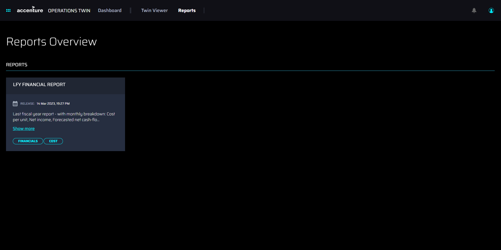
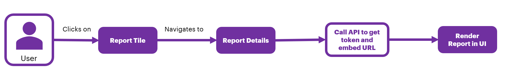
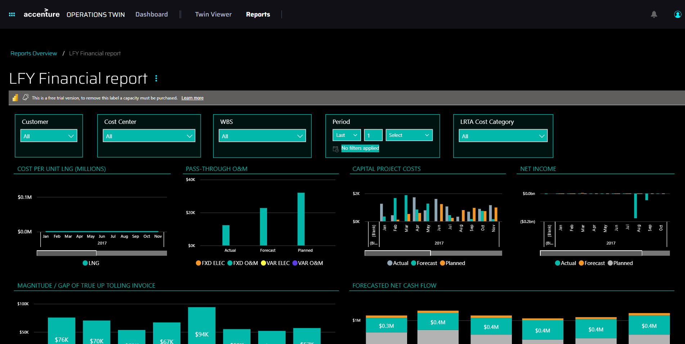

Industrial AI Foundation

Reports

DELIVERY GUIDE

Release Version: 2.5

**Metadata Table**

| **Field** | **Value** |
| --- | --- |
| **Asset / Solution Name** | Industrial AI Foundation / Operations Hierarchy |
| **Domain / Area** | Digital Twin / Asset Management |
| **Owner (Team/Person)** | Tournier, Florian |
| **Reviewers** | Priyadarshini, Ellina |
| **Status** | Published / Approved |
| **Confidentiality** | Internal / Confidential |
| **Source of Truth** | [Summary - Overview](https://dev.azure.com/DigitalPlantProject/Marilyn%20V) |
| **Related Assets / Alternatives** | Operations Hierarchy Deployment Guide, Operations Hierarchy API Reference |

## Introduction

Industrial AI Foundation (IAI) is a collection of software accelerators and tools that can be assembled to deliver client solutions. IAI accelerates the integration of product, process, and live data from disparate IT and OT systems, creating a comprehensive and contextualized view of operations to enable better decisions and optimized processes.

The Reports component of IAI enables various users -- from shop floor workers to top management -- to view PowerBI reports and analyze the parameters, through real-time generated data, allowing the user to conduct a root cause analysis and collaborate to resolve the problem.

### Purpose

This document explains how to access PowerBI Reports in IAI and outlines the backend processes for report generation.

### Target Audience

-   Client Delivery Teams Leveraging IAI Intelligent Advisor

-   Asset Delivery Teams

-   Solution Architects, Technical Architects, Data Scientists, Data Engineers

###  Preferred Skills

-   Angular Framework

-   HTML, CSS, Typescript

-   Power BI-client library

### Prerequisites

-   PowerBI reports must have already been published.

### Related Links

-   [IAI [Documentation](https://industryxdevhub.accenture.com/asset-home;search_text=aot)](https://industryxdevhub.accenture.com/asset-home;search_text=aot)

-   [IAI Release Notes](https://industryxdevhub.accenture.com/assetdetails/45)

### Contacts

-   [judit-kinga.zoltani@accenture.com](mailto:judit-kinga.zoltani@accenture.com)

-   [pavithra.umesh@accenture.com](mailto:pavithra.umesh@accenture.com)

-   [prashant.zande@accenture.com](mailto:prashant.zande@accenture.com)

-   [ellina.priyadarshini@accenture.com](mailto:ellina.priyadarshini@accenture.com)

### 

## Glossary

| Term | Definition |
| --- | --- |
| PowerBI | A suite of business analytics tools by Microsoft that enables users to visualize data and share insights across an organization. |
| Report Tile | A visual component on the Reports Overview page that represents a published report; clicking it opens the Report Details view. |
| Report Details | The page or view displaying in-depth information and data about a selected report from the overview page. |
| JSON | JavaScript Object Notation, a lightweight data-interchange format commonly used for configuring and transferring data structures. |
| Release Notes | Documentation that describes the new features, enhancements, and fixes included in a particular release of a product. |
| Group ID | A unique identifier for a group or workspace in PowerBI, used to organize and manage reports and datasets. |
| Report ID | A unique identifier assigned to each report in PowerBI for tracking and referencing purposes. |

## 

# Background

The Reports Overview page is the landing page for the Reports component. It displays the Report Tiles that have been configured. Clicking a tile launches the Report Details view.

###  Report Tile JSON

The JSON code below is a sample of the code needed for the report tile shown in the previous section.

\{

\"reportId\": \"b72191d5-7ac8-4e44-adf4-cd334216644a\",

\"groupId\": \"82e09c53-370d-41ec-8519-ed4561b2bbe2\",

\"title\": \"LFY Financial report\",

\"releaseDate\": 1678802279879,

> \"releaseDescription\": \"Last fiscal year report - with monthly breakdown: cost per unit, net income, forecasted net cash-flow, forecasted interest, disputed customer invoices, aged payables, etc\",
>
> \"tags\": \[\'Financials\', \'Cost\'\]

\}

### Flow

The flow diagram below illustrates how a report is generated. The user navigates to the Reports component and clicks on the required Report tile, which in turn launches the report details page. Here, the API is called to get a token and embed the URL of the PowerBI report to be rendered in the UI.

## Report Details View

The Report Details view displays available information for the report that was selected on the Report Overview Page.

The Reports Overview breadcrumb can be used to go back to the Reports Overview Page.

## Backend Code

The backend function code is written in Python and contains the logic for generating an embedded token and an embedded URL for a PowerBI Report.

def post(self, groupId, reportId):

 try:

    response=\[\]

    endpoint = POWERBI_TOKEN_ENDPOINT.format(groupId,reportId)

    headers = make_headers()

    res= requests.post(endpoint,headers=headers,json=\{\"accessLevel\": \"View\", \"allowSaveAs\":\"false\"\},verify=True)

    token = res.json()\[\'token\'\]

    embedurl = \'https://app.powerbi.com/reportEmbed?reportId=\{\}&amp;groupID=\{\}\'.format(reportId,groupId)

    embedlist=\{\"EmbedToken\": token, \"EmbedURL\":embedurl \}

    response.append(embedlist)

    return (json.loads(json.dumps(\{\"PowerbiEmbedToken\":response\})))

 

    except Exception as ex:

    logger.exception(str(ex) , exc_info=ex)

    return ex,500

def get_access_token():

data = \{

 \'grant_type\': \'password\',

 \'scope\': POWERBI_SCOPE,

 \'resource\': POWERBI_RESOURCE,

 \'client_id\': POWERBI_CLIENT_ID,

 \'client_secret\': POWERBI_CLIENT_SECRET,

 \'username\': POWERBI_USER,

 \'password\': POWERBI_PASSWORD

\}

token = requests.post(\'https://login.microsoftonline.com/\{\{tenantId\}\}/oauth2/token\',data=data)

assert token.status_code == 200, \"Fail to retrieve token: \{\}\".format(token.text)

return token.json()\[\'access_token\'\]

def make_headers():

 return \{

 \'Content-Type\': \'application/json;charset=utf-8\',

 \'Authorization\' : \'Bearer \{\}\'.format(get_access_token()),

 \'Accept\': None,

\}

### API Details

An API is used to get a token and embed a URL into the tile.

| **Request URL** |  |
| --- | --- |
| **Header Authorization** | token |
| **Method** | POST |
| **Sample Response** | \{ PowerbiEmbedToken:\[\{ EmbedToken:\" H4sIAAAAAAAEAB2Wxw6sSBJF\_-VtGQmKw\", EmbedURL:\"https://app.powerbi.com/reportEmbed?reportId=b72191d5-7ac8-4e44-adf4-cd334216644a&amp;groupID=82e09c53-370d-41ec-8519-ed4561b2bbe2\" \}\] \} |

### Git

Email [dmo.infraanddevops@accenture.com](mailto:dmo.infraanddevops@accenture.com) to request access to the [Git folder](https://dev.azure.com/DigitalPlantProject/Marilyn%20V/_git/MarilynVPlatform?path=/Consumption/UI/reports-micro-app/reports-micro-app-ui).

### CI/CD Pipeline

-   Pipeline name: IAI-Reports-UI

-   Pipeline [folder](https://dev.azure.com/DigitalPlantProject/Marilyn%20V/_build?definitionScope=%5CAOT%20Apps%20Build%20Team%201)

-   Pipeline [link](https://dev.azure.com/DigitalPlantProject/Marilyn%20V/_build?definitionId=855)
