

Industrial AI Foundation

Simulator and IoT Hub Extractor

DEPLOYMENT AND USAGE GUIDE

Release Version: 2.5

**Metadata Table**

| **Field** | **Value** |
| --- | --- |
| **Asset / Solution Name** | Industrial AI Foundation / Data Integration Accelerators |
| **Domain / Area** | Extractors / Data Processing |
| **Owner (Team/Person)** | Tournier, Florian |
| **Reviewers** | Joshi, Rishabh |
| **Status** | Published / Complete |
| **Confidentiality** | Internal / Confidential |
| **Source of Truth** | [Summary - Overview](https://dev.azure.com/DigitalPlantProject/Marilyn%20V) |
| **Related Assets / Alternatives** | IAI Extractors Architecture Blueprint, IAI Extractors Getting Started |
## 

## 
Introduction

Industrial AI Foundation (IAI) is a collection of software accelerators and tools, including a Smart Device Simulator, that can be assembled to deliver client solutions. IAI accelerates the integration of product, process, and live data from disparate IT and OT systems, creating a comprehensive and contextualized view of operations to enable better decisions and optimized processes.

IAI\'s Smart Device Simulator is used to simulate data for multiple devices based on device twin configurations and sends the simulated data to the Azure IoT Hub cloud. This simulated data is then extracted by IAI\'s IoT Hub Extractor and pushed to CDF as a timeseries. The simulator, which runs continuously in an app service, can configure the range and frequency for many different types of devices. The extractor then creates or updates the time series and metadata for those assets created by the simulator. Both the Simulator and the IoT Hub Extractor are deployable in the cloud and feature a user-configurable interface along with built-in validations and exception handling.

### Target Audience 

This guide is designed for use by developers with the following skills:  

-   Azure Pipeline creation

-   SonarQube

-   IoT Hub device twin

### Purpose 

After reading this document, the reader should understand the prerequisites and steps to configure and deploy the simulator on the cloud including the understanding of configuring the device twin to send data to IoT Hub. The reader should be able to verify the devices created according to the master device twin configuration. The reader should be able to see logs of the device sending the data to IoTHub. For IoT Hub Extractor, the reader should be able to configure and run the extractor and verify the timeseries and metadata data flow from the source system i.e., simulator to CDF. 

### Contacts

-   [hanuman.prasad.gali@accenture.com](mailto:hanuman.prasad.gali@accenture.com)

-   [rishabh.b.joshi@accenture.com](mailto:rishabh.b.joshi@accenture.com)

### Related Links

-   [How to Create an Azure Pipeline](https://docs.microsoft.com/en-us/azure/devops/pipelines/create-first-pipeline?view=azure-devops&amp;tabs=javascript%2Ctfs-2018-2%2Cbrowser)

-   [How to Create a Release Pipeline](https://docs.microsoft.com/en-us/azure/devops/pipelines/release/?view=azure-devops)

### 

## Glossary

| **Term** | **Definition** |
| --- | --- |
| IAI (Industrial AI Foundation) | A collection of software accelerators and tools designed to integrate product, process, and live data from various IT and OT systems, providing a comprehensive view of operations for better decision-making and process optimization. |
| Simulator | The Smart Device Simulator component of IAI, used to simulate data for multiple devices based on device twin configurations and send this data to Azure IoT Hub. |
| IoT Hub Extractor | A tool that extracts simulated data from Azure IoT Hub and pushes it to Cognite Data Fusion (CDF) as a timeseries, creating or updating timeseries and metadata for assets. |
| Device Twin | A digital representation of a physical device, storing configuration and state information. The master device twin is used to configure and create new devices in the simulator. |
| Azure IoT Hub | A cloud service for managing and communicating with IoT devices, serving as the central hub for device data in this solution. |
| ARM Template | Azure Resource Manager template, a JSON file that defines the infrastructure and configuration for Azure resources, used for automated deployment. |
| Build Pipeline | An Azure DevOps pipeline that builds the simulator or extractor code and creates artifacts for deployment. |
| Release Pipeline | An Azure DevOps pipeline that deploys built artifacts to the cloud environment, creating resources and starting services like the simulator or extractor. |
| Key Vault | Azure service for securely storing and accessing secrets, keys, and certificates used by the simulator and extractor. |
| App Service | Azure service for hosting web applications, including the simulator which runs as a WebJob. |
| AKS Cluster | Azure Kubernetes Service cluster, used to deploy and run the IoT Hub Extractor as a containerized application. |
| Cognite Data Fusion (CDF) | A platform for contextualizing and managing industrial data, where the IoT Hub Extractor sends timeseries data. |
| Telemetry | Data generated by devices, such as sensor readings or KPIs, configured in the device twin and sent to IoT Hub. |
| Limits | Threshold values set in the device twin for telemetry parameters, used to trigger events, alerts, or exceptions based on data values. |
| WebJob | A background service running within Azure App Service, used here to continuously run the Smart Device Simulator. |
## 

# Simulator Deployment 

Two pipelines are needed to deploy the simulator. This section includes step-by-step guidance for:

1.  Create a Build Pipeline to build the simulator code using a solution file.

2.  Create a Release Pipeline for creating resources for the simulator and deploying the simulator.

3.  Validate device creation and in-app service log stream in IoT Hub.

### Resource Requirements

The simulator requires the following Azure resources that are created by the ARM template and pipeline:

-   App Service Plan 

-   App Service

-   KeyVault

-   Function App

-   IoT Hub

-   Device provisioning service

### Prerequisites

Before deploying or running the simulator, you will need to have a cloud subscription with:

-   Azure license/subscription to create resources for implementation. 

-   Azure DevOps repository for simulator code, ARM templates, and pipeline files. 

-   A service connection on Azure DevOps for running ARM templates for the simulator.

-   A library to hold the parameters needed to run the template pipeline for the simulator.

-   A resource group where resources would be created by ARM templates for the simulator.

### 

## Create a Build Pipeline 

The build pipeline is to build the simulator code using a solution file. The artifacts created here are used in the release pipeline to complete simulator deployment. To create a build pipeline, follow the below steps:

1.  Navigate to Azure DevOps \&gt; pipelines and select *New Pipeline*.

> 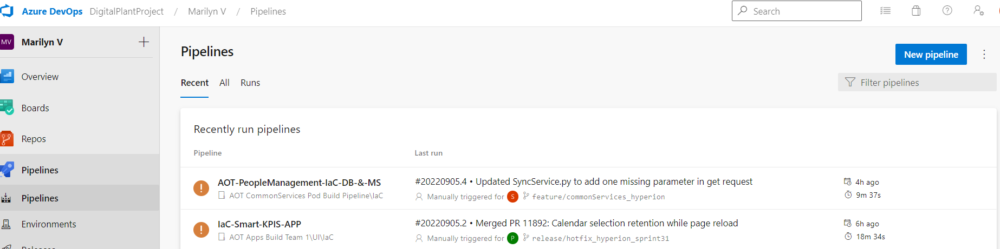

2.  Select the Azure Repos Git.

> 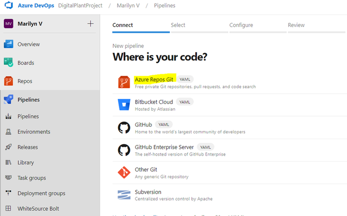

3.  Select the name of the repository that contains the simulator code and pipeline files.

> 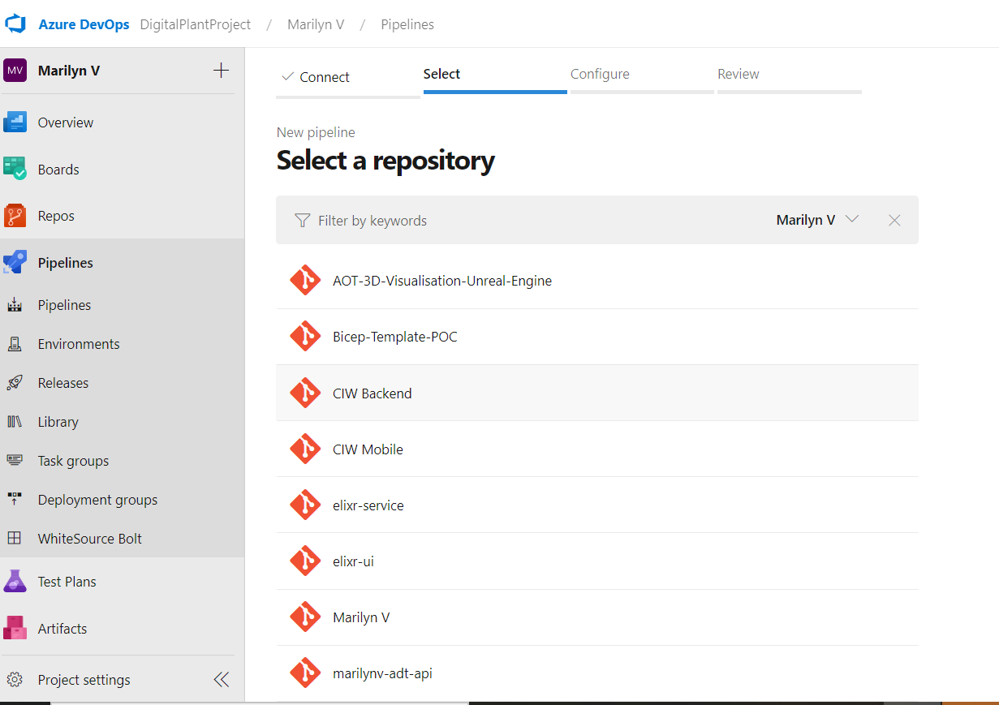
4.  

5.  Select the Existing Azure Pipelines YAML file.

> 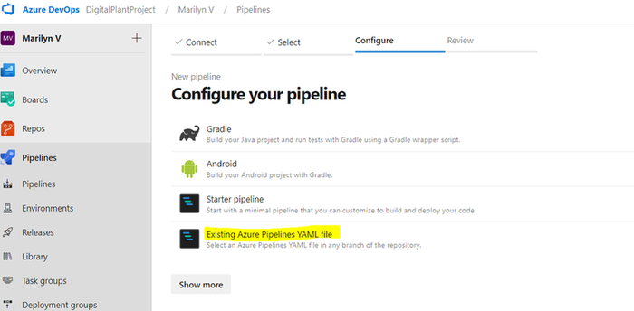

6.  Select a branch and provide the pipeline file path as Source/Device/pipelines/azure-pipelines.yml and then click Continue.

> 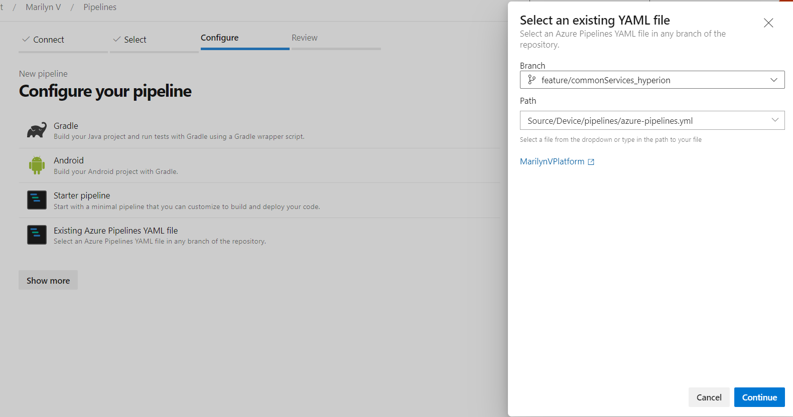

7.  Review, save, and run the pipeline.

### Create a Release Pipeline

A release pipeline is used to create resources needed for simulator deployment using an ARM template. Once the resources are created, this pipeline deploys the simulator code in an app service where it runs as a WebJob. The release pipeline is also responsible for starting the simulator. To create the release pipeline:

1.  Create a library with the following parameters:

    -   appLocation -- Provide the location of the resource group where resources are going to be deployed.

    -   appRegClientIDBackend -- Provide the Client ID of the app registration.

    -   appRegSecretBackend -- Provide the Client Secret of the app registration.

    -   environmentName -- Provide the environment name where the resources are going to be deployed. E.g., dev, test, prod.

    -   keyVaultName -- Provide a new KeyVault name to store all the simulator-related IDs, keys, and secrets.

    -   tenantId -- Provide the Tenant ID of the app registration.

2.  Create a release pipeline and add the new build pipeline and the repository to the artifact.

> 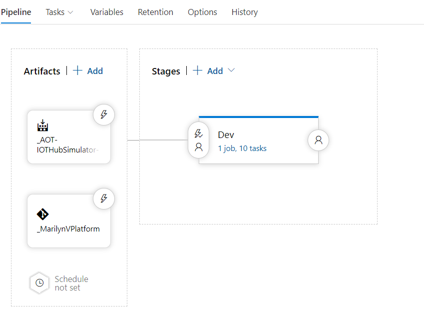
3.  

4.  Add this library to the release pipeline. The variables inside this library would be used by the ARM template task.

> 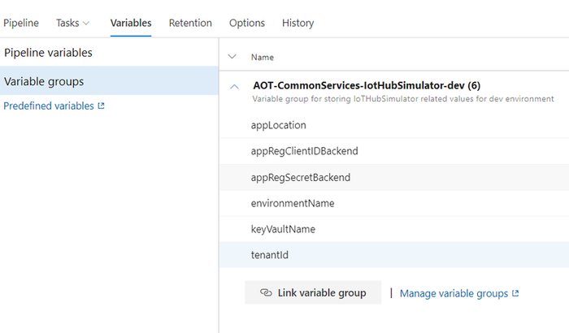

5.  Add the ARM template file present in the repository to this ARM Template deployment task.

> 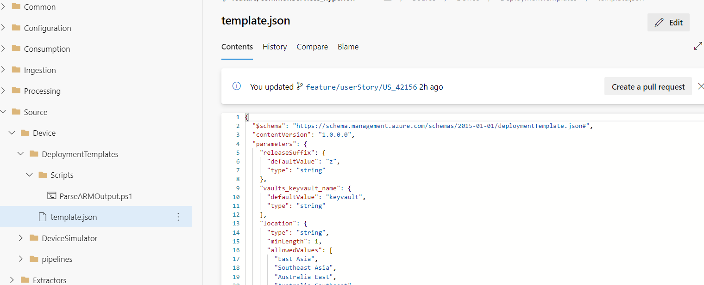
>
> 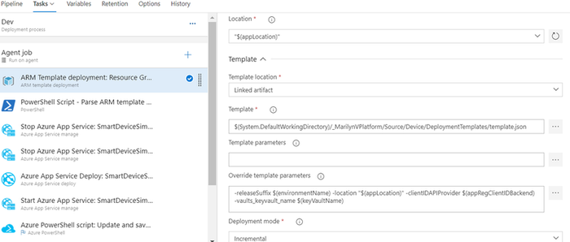
6.  

7.  Update the file location of the ParseARM script in the pipeline.

> 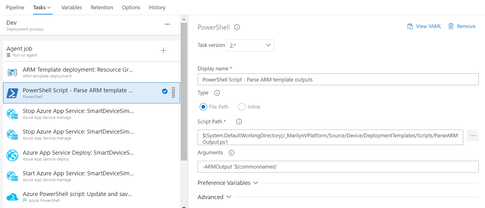
>
> 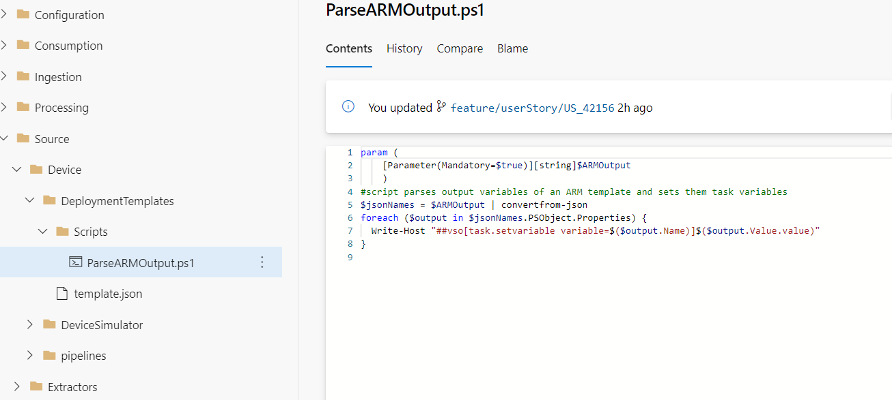

8.  Update the value of service connection in the tasks.

> 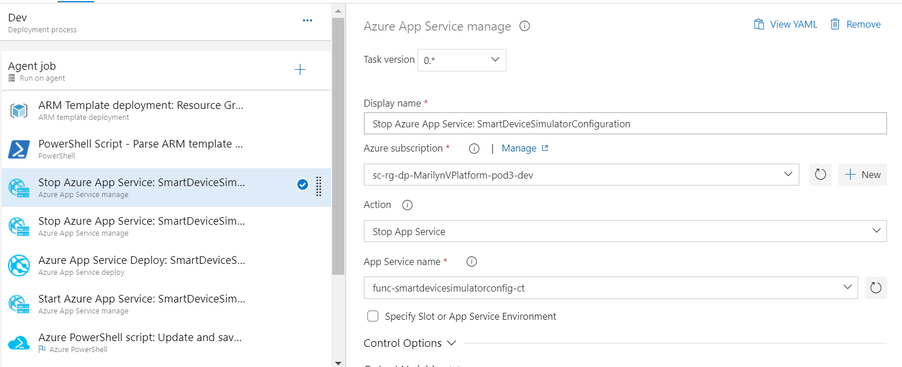

9.  Run the new build pipeline and wait for it to be completed successfully.

10. Run the new release pipeline and wait for it to complete successfully.

11. 

12. In the Azure portal, validate that the correct set of resources was created.

> 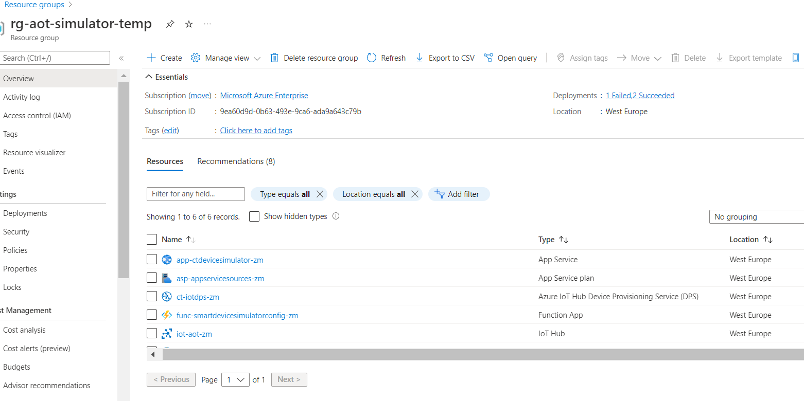

13. In the Azure portal, navigate to IoTHub and validate default devices are created as shown:

> \{
>
> \"devices\": \[
>
> \{
>
> \"type\": \"ambient\",
>
> \"count\": \"3\"
>
> \},
>
> \{
>
> \"type\": \"cutting\",
>
> \"count\": \"3\"
>
> \},
>
> \{
>
> \"type\": \"folding\",
>
> \"count\": \"3\"
>
> \}
>
> \]
>
> \}

14. In the Azure portal, navigate to App service and make sure that the simulator web job is running.

> 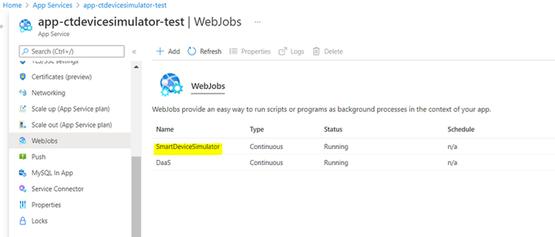

## IoTHub Extractor Deployment

Build and release pipelines are needed to deploy the IoTHub Extractor to an AKS Cluster. The Build Pipeline is used to Dockerize the Extractor Package and the release pipeline deploys the Docker Image to the AKS Cluster. To deploy the extractor, the following steps must be performed in order:

1.  Creating a Build Pipeline for Dockerizing the Extractor Package 

2.  Creating a Release Pipeline for deploying the Docker image to the AKS cluster 

### Prerequisites 

-   [Lens](https://k8slens.dev/)

-   A cloud subscription with the following: 

    -   Azure DevOps repository for extractor code, and pipeline files. 

    -   A library to hold the parameters needed for the IoTHub Extractor.

    -   Azure service connections for SonarQube and Container Registry for IoTHub Extractor. 

    -   Namespace in the AKS cluster for environments for IoTHub Extractor. 

    -   Kubernetes Service Connection for AKS Cluster for IoTHub Extractor.

    -   Sonar project and key for IoTHub Extractor. 

### 

## Configure the Environment

1.  Ensure that secret values are correctly updated in Azure Key Vault. The following secrets are used for the IoTHub extractor: 

    a.  ClientID -- Provide the Client ID for Cognite Data Fusion 

    b.  ClientSecret -- Provide the Client Secret for CDF

    c.  SasKey -- Provide the Shared Access key of IoTHub

1.  Create a key vault library in Azure DevOps for the secrets.

> 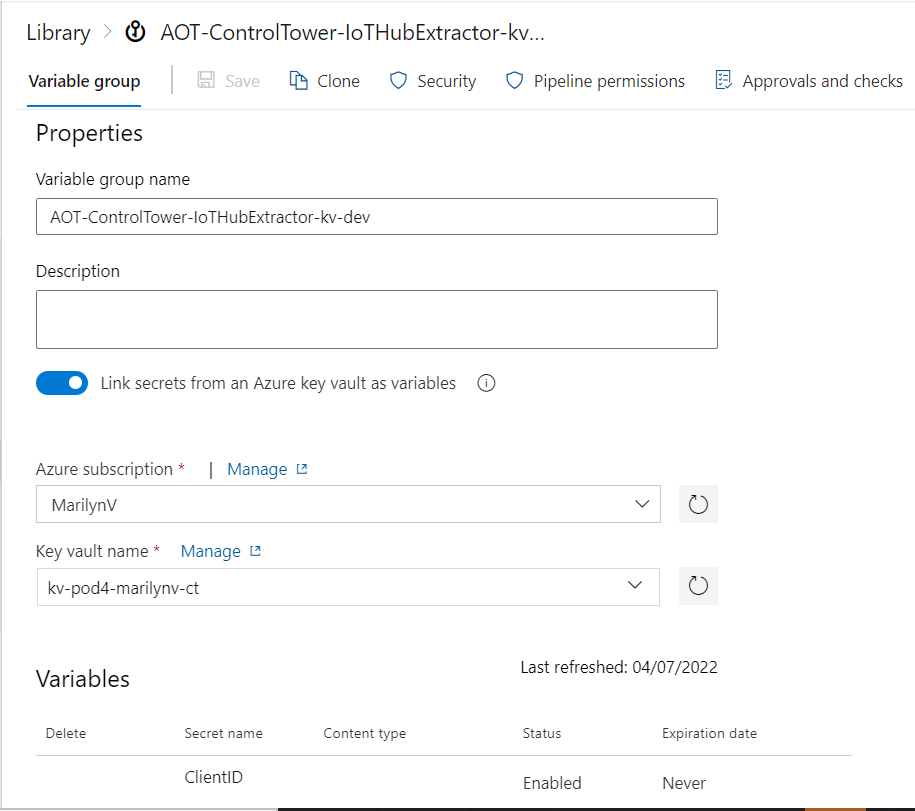

2.  Create a library with the following parameters: 

    COGNITE_HOST -- Provide the Host Name for Cognite data fusion

    CDF_CLUSTER -- Provide the Cluster Name for Cognite data fusion

    EVENTHUB_ENDPOINT -- Provide the Event Hub-compatible endpoint of the IoTHub

    EVENTHUB_PATH - Provide the IoT Hub Name

    COGNITE_PROJECT -- Provide the project name for Cognite data fusion

    TENANT_ID -- Provide the Tenant ID for Cognite data fusion

    IOT_CONSUMER_GROUP -- Provide the Consumer group name from IoTHub

    IOT_ROOT -- Asset hierarchy root name (external id) 

> 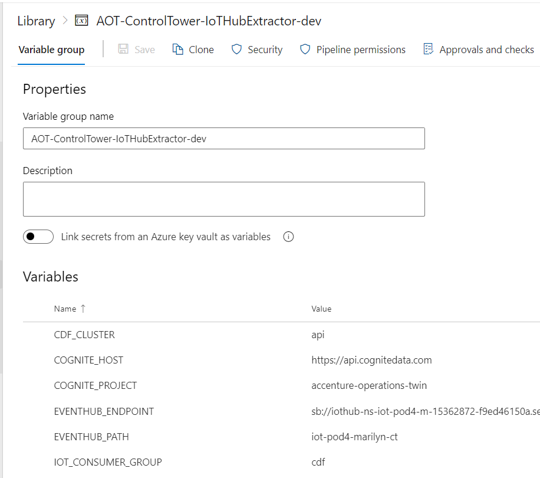

3.  Navigate to the pipeline file location \"Source/Extractors/IoTHubExtractor/pipelines/Dev/azure-pipelines.yml\" and ensure that the pipeline refers to the library created in the previous steps.

4.  Update the service connection value for: 

-   CONTAINER_REGISTRY_SERVICE_CONNECTION

-   SONARQUBE_SERVICE_CONNECTION 

> 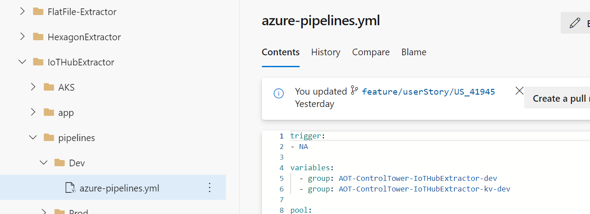
### 

## Create a Build Pipeline 

The Build Pipeline is used to Dockerize the Extractor Package. The artifacts created here are used in the release pipeline to complete IoT Hub Extractor deployment. To create a build pipeline:

1.  Navigate to Azure DevOps and select pipelines and then select \"New Pipeline\".

2.  Select \"Azure Repos Git\" and then Select Repository Name which contains simulator code and pipeline files.

3.  Select \"Existing Azure Pipelines YAML file\".

4.  Select the branch and provide the pipeline file path as \"*Source/Extractors/IoTHubExtractor/pipelines/Dev/azure-pipelines.yml*\" and then select Continue.

5.  Review and save.

6.  Run the pipeline and wait for its successful completion.

### Create a Release Pipeline

The Release pipeline deploys the Docker Image of the IoTHub Extractor created by the build pipeline to the AKS Cluster. Create the IoT Hub Extractor release pipeline as follows:

1.  Create a release pipeline.

2.  Update the value of the service connection for the AKS cluster in the tasks.

> 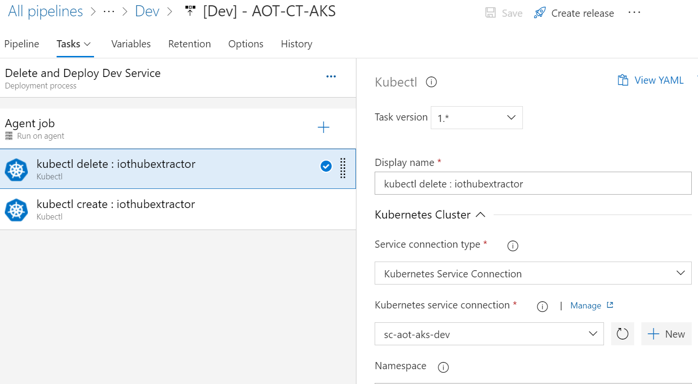
3.  

4.  If this is the first run, then disable the delete task from the pipeline.

> 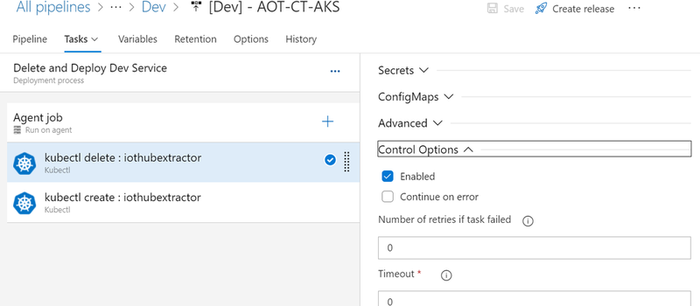

5.  Create a release from the release pipeline created earlier.

> 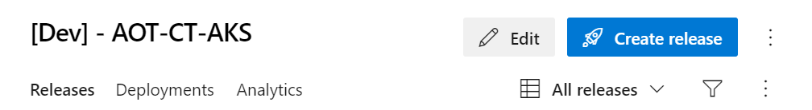

6.  Once the release is completed, confirm successful deployment on the AKS cluster and use the [Lens](https://k8slens.dev/) app to validate that the IoTHub extractor is inserting data to CDF.

> 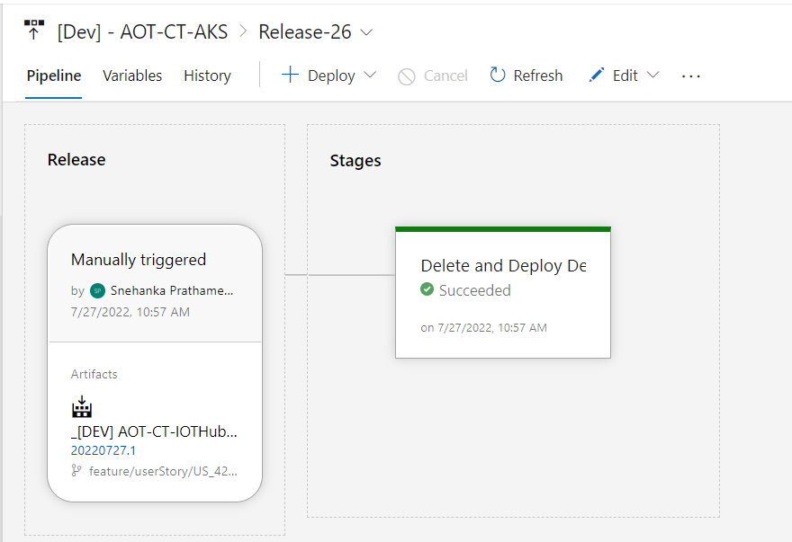
>
> 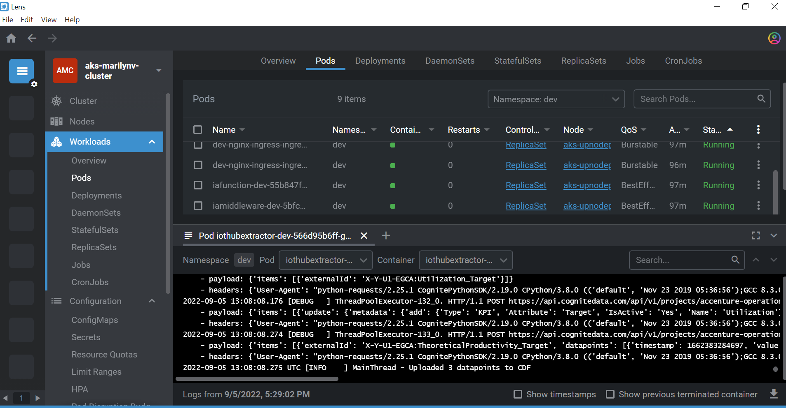

6.  If everything looks good, enable the delete task that was previously disabled.

> 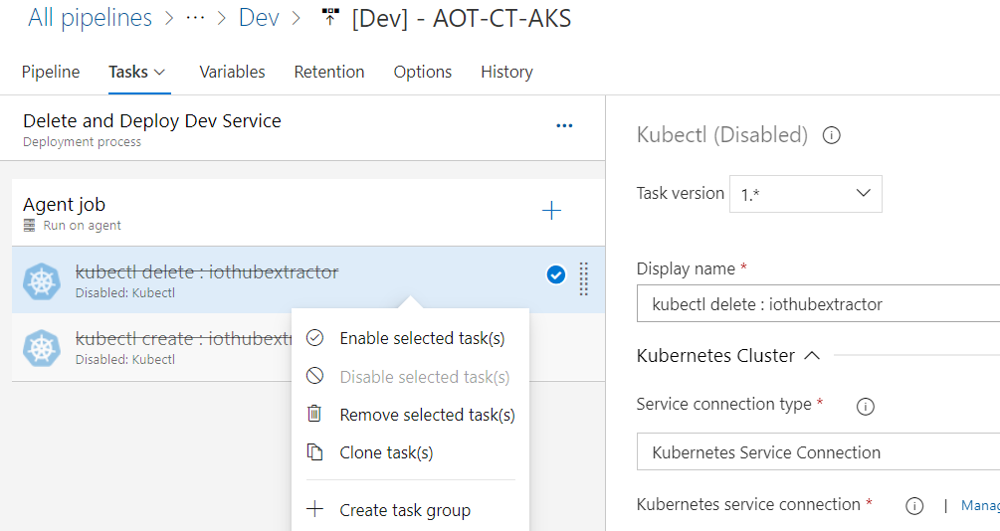
## 

# Simulator Usage

### Start the Simulator

1.  In the Azure portal, navigate to the App service created for the simulator.

2.  Select WebJobs.

3.  Select the SmartDeviceSimulator and select run from the top menu.

### Stop the Simulator

1.  In the Azure portal, navigate to the App service created for the simulator.

2.  Select WebJobs.

3.  Select the SmartDeviceSimulator and select Stop from the top menu.

> 
Note that under some special circumstances, such as Microsoft updates and configuration changes, the simulator will stop and restart on its own. Sometimes this can result in the simulator behaving differently and might stop sending data to IoTHub. Under such conditions, the simulator may need to be restarted manually.

### 

## Configure the Master Device Twin

A Master Device is the parent device that is responsible for the creation of main devices. The master device stores an initial set of configurations that are shared with its twin. To create a new device based on the master, the IAI user must modify the desired properties of the twin to configure the type, name, and count of the new device being created. If the device type is also new, then device type properties must also be added to the device type list.

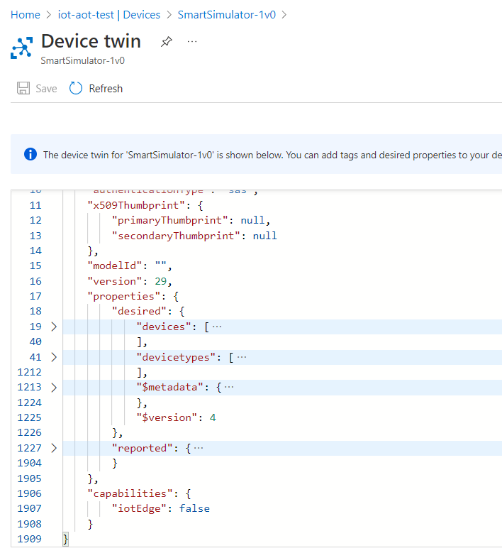

### 

## Structure

The desired properties have the following structure:

\{\"desired\":

\{

\"devices\": \[

\{

\"type\": \"Equipment\",

\"count\": \"2\",

\"names\": \[

\"X-Y-U1-EGCA\",

\"X-Y-U1-EGCB\"

\]

\}

\],

\"devicetypes\": \[

\{

\"type\": \"Equipment\",

\"format\": \"json\",

\"telemetry\": \[

\{

\"name\": \"ActualProductivity_Target\",

\"attribute\": \"Target\",

\"isActive\": \"Yes\",

\"range\": \{

\"min\": 10,

\"max\": 50,

\"difference\": 2

\},

\"limits\": \{

\"exception-low\": -2,

\"low-low\": 2,

\"low\": 5,

\"high\": 95,

\"high-high\": 100,

\"exception-high\": 102

\},

\"frequency\": 86400,

\"state\": \"steady\",

\"type\": \"KPI\",

\"metadata_name\": \"Actual_Productivity\",

\"uom\": \"\"

\}

\]

\}

\]

\}\}

### 

## Device Properties

The twin of an existing device may be modified when parameters change. As indicated in the third column, some parameters can be changed while others cannot.

| **Parameter** | **Description** **M \*** |
| --- | --- |
| devices.type | The type of device. Each device type will have different sets of parameters N |
| devices.count | The count of the required devices belonging to a particular device type N |
| devices.name | The list of names of the devices belonging to a particular device type N |
| devicetypes.type | The type of device. Each device type will have different sets of parameters N |
| devicetypes.format | The format of the generated data. Available options are XML or JSON Y |
| devicetypes.telemetry | The list of each parameter and its configuration Y |
### 

## Telemetry Properties (devicetypes.telemetry)

| **Parameter** | **Description** | **M \*** |
| --- | --- | --- |
| name | The name of the parameter | Y |
| attribute | Type of parameter. Available Options: Forecast, Target, or Actual | Y |
| isActive | Available options: Yes or No | Y |
| range.min | Provide the minimum value of the telemetry that is to be generated | Y |
| range.max | Provide the maximum value of the telemetry that is to be generated | Y |
| range.difference | The difference is used to calculate the next value of the respective parameter. For a constant telemetry value, provide 0 and make sure the min and max are equal to the constant value. For a random telemetry value, provide a value that is smaller than the difference between min and max values. | Y |
| limits | Creates exception, alert, or event when the generated data value falls under one of the limit values | Y |
| limits.exception-low | Provide a value that is smaller than low-low. If the generated data is less than exception-low, then an exception occurs, and the device stops sending data | Y |
| limits.low-low | Provide a value that is smaller than low and greater than exception-low. If the generated data is between exception-low and low-low, then the device will create an alert | Y |
| limits.low | Provide a value that is smaller than min. If the generated data is between low-low and low, then the device will create an event | Y |
| limits.high | Provide a value that is greater than max. If the generated data is between high and high-high, then the device will create an event | Y |
| limits.high-high | Provide a value that is greater than high and smaller than exception-high. If the generated data is between high-high and exception-high, then the device will create an alert. | Y |
| limits.exception-high | Provide a value that is greater than high-high. If the generated data is more than exception-high, then an exception occurs, and the device stops sending data. | Y |
| frequency | The frequency between two data points. The frequency is in seconds. | Y |
| state | The state of the device; \'Steady\' is the normal state | N |
| type | Available Options: KPI, parameter | Y |
| metadata_name | Name of metadata | Y |
| uom | Unit of measurement. | Y |
> \* **M**odifiable properties may be changed after initial creation.
>
> \* An N in this column indicates that once set, the parameter may not be changed for a device.

## 

# First-Time Configuration 

1.  Stop the simulator.

2.  In the Azure portal, navigate to IoTHub-\&gt;Devices and delete the default devices except for SmartSimulator-1v0.

3.  Select SmartSimulator-1v0 (Master device), then Device Twin.

4.  Add the device count, device name, and device type in the desired properties and save it.

5.  Start the simulator.

6.  Navigate to IoT Hub-\&gt;Devices and validate that the new devices were created.

## Changing the Attribute Value of a Device

1.  Navigate to IoTHub \&gt; Device Management and select a device to modify.

> 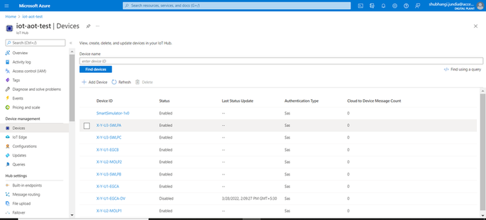

2.  Select Device Twin from the top menu.

> 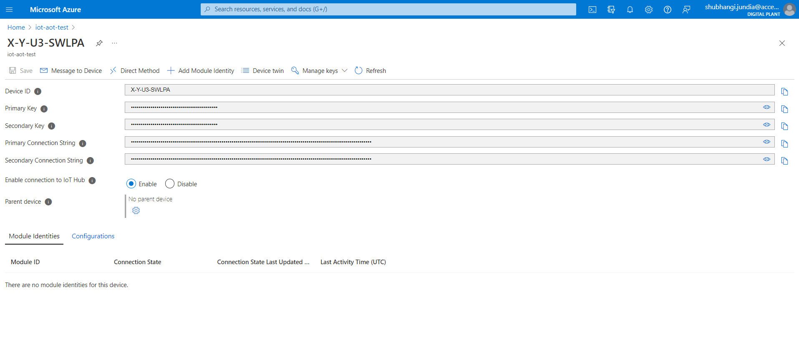

3.  Change the attribute value in the device twin of a particular parameter or all parameters according to the requirement and click save.

> 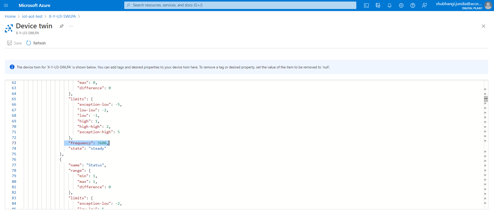
