

Industrial AI Foundation

Smart KPIs

ADMINISTRATION GUIDE

Release Version: 2.5

**Metadata Table**

| **Field** | **Value** |
| --- | --- |
| **Asset / Solution Name** | Smart KPIs Administration Guide |
| **Domain / Area** | Configuration/Administration |
| **Owner (Team/Person)** | Tournier, Florian |
| **Reviewers** | Susarla, Aditya |
| **Status** | Published / Approved |
| **Confidentiality** | Internal / Confidential |
| **Source of Truth** | [Summary - Overview](https://dev.azure.com/DigitalPlantProject/Marilyn%20V) |
| **Related Assets / Alternatives** | Smart KPIs UI Guide, Smart KPIs API Reference |

## Introduction

Industrial AI Foundation (IAI) is a collection of software accelerators and tools, including Smart KPIs, that can be assembled to deliver client solutions. IAI accelerates the integration of product, process, and live data from disparate IT and OT systems, creating a comprehensive and contextualized view of operations to enable better decisions and optimized processes.

Smart KPIs is a Micro Front-end Application that is mounted to the IAI application and is the landing page of the IAI application. It provides contextualized views of Key Performance Indicators to IAI users in both the boardroom and on the shop floor. The Smart KPIs application is invaluable for tracking performance issues as well as the actions taken to improve performance.

IAI leverages Cognite Data Fusion (CDF), a DataOps platform that builds a knowledge graph by ingesting, normalizing, and connecting diverse operational data in the cloud. CDF functions calculate KPIs such as Availability, Utilization, Performance, and OEE across all asset levels. KPI configuration is required for any implementation, update, addition, or deletion, specifying calculation logic, units, targets, influencing KPIs, and RAG (Red Amber Green) zones. This configuration enables dashboard visualization, supports KPI hierarchy creation for issue identification, and drives CDF function generation for KPI calculations. Access to the configuration template is restricted for security; contact details are provided. Any KPI changes require re-uploading the updated template.

**Purpose**

This document describes the process of creating, configuring, and uploading Smart KPIs into the IAI platform, through the Smart KPI configuration tool, to create a Dashboard with the entire Smart KPI hierarchy. Additionally, the document describes the process of adding a new KPI and changing, updating, or archiving existing KPIs once we have the first version of the KPI Template uploaded.

### Target Audience

-   Accenture user who is responsible for creating the Smart KPIs config template for Client Administrator

-   Client Administrator who is responsible for adding, updating, or archiving KPIs based on business needs

### Prerequisites

The Administrator must have:

-   Access to the Smart KPIs config module within the IAI of the instance they will be configuring for the client.

-   The preconfigured Smart KPIs Config template to:

    -   Reference the \'Guidelines for Admin\' sheet.

    -   Configure the KPIs.

-   The list of information from the client: Asset hierarchy, Departments, Roles, Frequency, Schedule, a clear view of KPIs the user wants to insert for a high-level validation

### Contacts

-   [thejash.s.suresh@accenture.com](mailto:thejash.s.suresh@accenture.com)

-   [florian.tournier@accenture.com](mailto:florian.tournier@accenture.com)

-   [susarla.aditya@accenture.com](mailto:susarla.aditya@accenture.com)

### Related Links

-   Smart KPIs Config Template

-   [IAI Release Notes](https://industryxdevhub.accenture.com/assetdetails/45)[Intelligent Advisor Delivery Guide](https://industryxdevhub.accenture.com/assetdetails/43)

### Glossary

| **Term/Acronym** | **Definition** |
| --- | --- |
| IAI | A suite of software accelerators and tools that integrate product, process, and live data from IT and OT systems to provide a contextualized view of operations for better decision-making and process optimization. |
| Micro Front-End | Small, self-contained frontend modules, each responsible for a specific part of the user interface of a web application. |
| Smart KPIs | Micro Front-end applications within IAI, which provide contextualized views of Key Performance Indicators (KPIs) for users, enabling performance tracking and improvement actions. |
| CDF | A suite of software accelerators and tools that integrate product, process, and live data from IT and OT systems to provide a contextualized view of operations for better decision-making and process optimization. |
| Asset Hierarchy | A systematic way to structure an organization\'s asset information. |
| RAG | Visual indicator of KPI performance, where Red = poor, Amber = warning, Green = good. |
| UoM | Unit of Measurement. The unit in which KPI values are expressed (e.g., kg, hours). |
## About KPIs

Key Performance Indicators (KPIs) are measurable factors that are tracked to gauge performance, stimulate actions, and drive business productivity. The factors listed in the table below are used to form each KPI:

| **Factor** | **Description** |
| --- | --- |
| Actual Value | The current value of the KPI, which is calculated using the actual calculation logic defined in the KPI config template |
| Historical Benchmark | Best performance value that was observed in the last 12 months. |
| Target Value | Desired performance/value of the KPI |
| Forecast | Forecast for the current time interval and is calculated as a 7-day moving average. 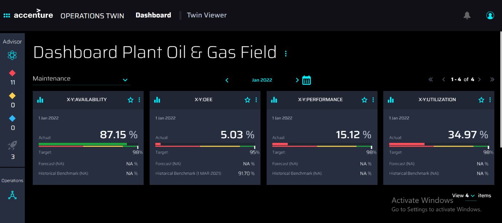
|  |

## 

# Configuration

The configuration of KPIs is accomplished using the [Smart KPIs Config Template](https://ts.accenture.com/:x:/r/sites/GlobalDocTemplates/Published%20Documents/AOT/Linked%20Files/AOT_Smart_KPIs_Config_Template.xlsm?d=w1e93e66a1af4471c81561268af29e1d2&amp;csf=1&amp;web=1&amp;e=iNRi90) workbook that has been preconfigured by Accenture to match the business needs specified by the client user. There are several worksheets in the configuration template workbook. The sheet named *Definition* has a brief description of all the listed fields, an explanation of the acronyms used in the sheet, and the formats that must be followed. The list of fields has been provided below for convenience. The fields are listed in the same order as the columns in the template.

-   **UID**: Read-only Unique ID of the KPI that is left blank by the user configuring the template. The value is automatically generated by the system after the template is uploaded. Each KPI has just one UID even if it is calculated on different asset hierarchy levels.

-   **Config_ID:** Read-only unique ID of each configuration (i.e., each row) that has been added by the user in the template.

-   **KPI Name**: User-entered name of the KPI that will be computed and displayed in the UI. The name:

    -   should be unique among other KPIs for a plant.

    -   is not case sensitive and can contain numerical and alphabetical values, also special characters such as \"-\", \"\_\", \"\*\"

-   **Update_flag**: Flag used to indicate a change within the collection of KPIs. This field is left blank during the initial creation of the KPIs. It is only changed when new KPIs are added to the existing collection, or when existing KPIs are updated or archived. Possible values are *Add*, *Archive*, and *Update*.

    -   *Add* -- Indicates a new KPI.

    -   *Archive* -- Indicates that the flagged KPI will be marked as inactive and excluded from the dashboard.

    -   *Update* -- Indicates that the flagged KPI will be updated.

-   **Status:** Possible values are *Published* or *Archived*.

    -   *Published --* System-generated status of any KPI that is published or ready to be published. The initial status is blank until the first KPIs are published.

    -   *Archived --* System-generated status of any KPI that successfully had its Update_flag set to *Archive*.

-   **Version**: Auto-updated, system-generated version of the KPI. The initial value is blank. Versioning starts with 1 and is incremented by 1 when a KPI is updated using the Update_flag.

-   **Sensitivity tag**: Possible values are *Yes* and *No*. If a KPI has a value of Yes, then the user must also have access to view sensitive information to be allowed to interact with the KPI.

-   **Description**: Free-text explanation to support usage of the KPI that is displayed for the business user in the Dashboard UI.

-   **UoM**: Free-text Unit of Measurement (UoM) used for the KPI. It can be in percentage, number of units, tons, kWh, etc. The UoM that the user specifies here should be from the list of UoMs that are available in the unit system that is tagged to the specific plant or multi-plant asset to which the configured KPI belongs.

-   **Direction**: User-selectable indicator of performance that shows the favorable movement of the KPI value. Possible values are *Up*, *Down, and Mixed*.

-   **Asset Hierarchy Mapping**: User-selectable value from the dropdown, which is auto-populated based on the configuration in the Asset Hierarchy Levels sheet. Indicates the Asset Hierarchy level from which the KPI is computed (e.g., Plant). This value also determines the values of both the *Dependent Asset hierarchy level* and *Assets Mapping*.

-   **Dependent Asset Hierarchy Level:** User-selectable sub-levels from *Asset hierarchy mapping* on which the KPI is calculated. The dependent asset hierarchy level is assigned according to the hierarchy mapping done in the template column *Asset Hierarchy Mapping*. For example, if a Plant has three units, and the Plant level KPI is based on the aggregation of all three Units, then the dependent Asset hierarchy level will be the Unit. The value can also be NA in cases where the KPI calculation is not dependent on the sub-levels of Asset Hierarchy mentioned in the *Asset hierarchy mapping* column.

-   **Assets Mapping**: User-selectable values from a list of pre-populated assets defined in the sheet *Asset Hierarchy levels*. Multiple assets may be selected.

-   **Product Hierarchy Mapping**: Future implementation and is thus currently a placeholder value in the template. Value is NA by default. This field indicates the product hierarchy level (such as Product Category) for which the KPI is computed, and its data is utilized for computing product-based KPIs.

-   **Dependent Product Hierarchy Mapping**: Future implementation and thus is a placeholder currently in the template with the value NA. This field Indicates the product hierarchy level from which the KPI is aggregated at the upper product hierarchy level. Its data is also utilized for computing product-based KPIs when implemented

-   **Products Mapping**: Future implementation and is thus currently a placeholder in the template with the value NA. This field indicates the products for which the KPI is computed. Its data is also utilized for computing product-based KPIs.

-   **Computation Trigger**: This field is a user-selectable value from a drop-down. Currently, the user can only choose the \'Time-based\' computation trigger. This field indicates when the KPI computation is triggered. The \'Batch-based\' option is a future implementation and can be used for triggering KPI computations when a batch is manufactured for product-based KPIs.

-   **Calculation Frequency**: User-selectable frequency at which the KPI and scheduled functions will be computed. Possible values are 5 min, 10 min, 15 min, 20min, 30 min, 40min, 45 min, 90min, 1h, 2h, 3h, 4h, 6h, 8h, 12h, Daily, Weekly, Monthly, Quarterly, Half-year, and Yearly. Computation is done in the order of contributing KPIs and then parent KPIs.

-   **Trigger Day**: Value is NA as Trigger Day is unused in current releases. In a future release, a recalculation of the KPIs can be triggered based on this value.

-   **Trigger Time**: Value is NA as Trigger Time is unused in current releases. In a future release, a recalculation of the KPIs can be triggered based on this value.

-   **Department**: User-selectable value determines available values for *Responsible Role* as defined by the client in the initial template configuration.

-   **Responsible Role**: User-selectable owner of the KPI, belonging to the Department selected, as defined by the client in the initial template configuration.

-   **Input_Resource_Type_Actual**: Possible values are *Timeseries*, *Constant*, and *NA* for the resource type that is being used to calculate the actual KPI. If a time series is used, then a chronological series of data points are used to calculate the actual value of the KPI.

-   **Identify KPIs** **and** **Timeseries_Actual:** Optional, user-provided text values that identify the KPIs upon which the main KPI is based. The manually input time series list data provided is used to calculate the actual value. For example, if the KPI is being calculated as *= Available Hours/Scheduled Hours*, then the list will have *Available Hours* and *Scheduled Hours* as parameters.

-   **KPI Calculation_Actual**: User-input, text-based formulas that are used to calculate the actual value of a KPI. Spaces between operators and curly brackets should not be used. KPIs or parameters must always be separated by brackets. Also, each KPI/parameter used in the calculation should be pre-fixed with \"SK.function\" where the function can be *latest, sum, average, max, or min* and should be entered in the following format -- SK.function(\'KPI/Parameter name\',\'UoM\'). The UoM values provided here are case sensitive and should be from the list of UoMs which are mapped to the unit system corresponding to the asset for which the KPI is being computed. Examples of values include:

    -   (SK.latest(\'Uptime\',\'min\')/SK.latest(\'Scheduled Operating Time\',\'min\'))\*100

    -   SK.average(\'Availability\',\'%\')

    -   SK.sum(\'Good Products\',\'#\')

-   **Input_Resource_Type_Target:** Only supported value is *Constant* for current releases. Future releases may also include a *Time series* resource type used to calculate the target value of a KPI using chronological data points.

-   **Identify KPIs** **and** **Timeseries_Target:** Optional column for use in a future release that is left blank by default. It represents the input data used to calculate the target value.

-   **KPI Calculation_Target:** User input, which is a numerical value, is used to calculate the target value of a KPI. If there is no target, then 0 (zero) is used. Future releases may support formulas in addition to constant values.

-   **Input_Resource_Type_Forecast:** User-selectable value -- limited to *Timeseries* in the current release -- that defines the type of resource used for forecasted value. The time series resource type stores a series of chronological data points used to calculate the forecast value of the KPI.

-   **KPI Calculation_Forecast:** User input, text-based value in the form of *KPI\_ + Forecast* that represents the name of the forecasted seven-day, moving-average calculation.

-   **KPI Calculation_Historical Benchmark:** The user selects a value from *Min, Max, Sum, Average,* and *NA* to describe the calculation of the best performance of the KPI on a particular day in the previous 12 months. For example, if the best performance is the highest value, then select *Max*. For Safety incidents, select Min because the fewer safety incidents, the better.

-   **KPI_TimeAggregation_Actual:** The user selects a value from *Min, Max, Sum, Average,* and *NA* to set the method used to aggregate the actual values of a KPI over time. For example, when the user selects different timeframes such as \"Weekly\", and \"Monthly\" in the time selection and inserts in the column \"Average\" then the actual value for that period will be aggregated based on the Average of that week or month.

-   **KPI_TimeAggregation_Target:** The user selects a value from *Min, Max, Sum, Average,* and *NA* to set the method used to aggregate the target values of KPI over time. For example, when the user selects different timeframes, such as \"Weekly\", and \"Monthly\" in the time selection and inserts in the column \"Average\" then the target value for that period will be aggregated based on the Average of that week or month.

-   **KPI_TimeAggregation_Forecast:** Value is NA as time-based aggregation for the forecast is unused in current releases. In a future release, forecast aggregation can be triggered based on this value.

-   **KPI_TimeAggregation_Historical Benchmark:** The user selects a value from *Min, Max, Sum, Average,* and *NA* to set the method used to aggregate the actual values of KPI based on the time period selected and calculate the benchmark using the user-selected value.

-   **Influencing KPIs**: User input, comma-separated names of KPIs (e.g., *Safety incident* or *NA* if none) that are indirectly influencing a higher-level KPI (e.g., OEE). The format in which the influencing KPIs need to be specified is as follows:Assetx:Productx(Assety:Producty:KPIy,Assetz:Productz:KPIz); Asset1:Product1(Asset2:Product2:KPI2).\
    Where:

    -   \'Assetx\' and \'Asset1\', are the assets defined by the user in the \'Assets Mapping\' column.

    -   \'Productx\' and \'Product2\' are the products defined by the user in the \'Products Mapping\' column. For now, these are NA as product-based KPIs are yet to be implemented.

    -   Assety:Producty:KPIy, Assetz:Productz:KPIz are the timeseries which would be added as influencing KPIs to the parent KPI for which the asset is \'**Assetx**\' and product is \'**Productx**\'

    

    -   Similarly, Asset2:Product2:KPI2 is the timeseries which would be added as influencing KPIs to the parent KPI for which the asset is \'**Asset1**\' and product is \'**Product1**\'

    -   Users can also use \'**\***\' as a wild character which denotes all assets or all products depending on where the wild character is used in the influencing KPIs format

        -   For example -

            -   \*:\*(\*:\*:KPI)

            -   C-BTM-\*:NA(C-BTM-R1-BTMP1-\*:NA:Availability)

-   **RAG Status Calculation_Red_mandatory_min:** User-defined lower limit for the minimum value when the performance is in critical (RED) range entered as *0 % of Target* or simply 0.

-   **RAG Status Calculation_Red_mandatory_max:** User-defined upper limit for the maximum value when the performance is in critical (RED) range entered as *0 % of Target* or simply 0. For example, if the user defines 0% of Target at RAG Status Calculation Red mandatory min and 45% of Target at Rag Status Calculation Rad mandatory max -- then the KPI will show in RED color between these limits.

-   **RAG Status Calculation_Red_optional_min**: Like RAG Status Calculation Red mandatory min except not mandatory and only used when there are more than three RAG statuses required. Example values include *NA* and *0% of the target*.

-   **RAG Status Calculation_Red_optional_max:** Optionally used when there are more than three RAG statuses required. Example values include *NA* and *0%* of the *target*.

-   **RAG Status Calculation_Amber_mandatory_min:** User-defined lower limit for the minimum value when the performance is in the average (Amber) range entered as *0 % of Target* or simply 0.

-   **RAG Status Calculation_Amber_mandatory_max:** User-defined upper limit for the maximum value when the performance is in the average (Amber) range entered as *0 % of Target* or simply 0.

-   **RAG Status Calculation_Amber_optional_min:** Optionally used when there are more than three RAG statuses required. Example values include *NA* and *0% of the target*.

-   **RAG Status Calculation_Amber_optional_max:** Optionally used when there are more than three RAG statuses required. Example values include *NA* and *0% of the target*.

-   **RAG Status Calculation_Green_mandatory_min**: User-defined lower limit for the minimum value when the performance is in optimal (Green) range entered as *0 % of Target* or simply 0.

-   **RAG Status Calculation_Green_mandatory_max:** User-defined upper limit for the maximum value when the performance is in optimal (Green) range entered as *0 % of Target* or simply 0.

-   **RAG Status Calculation_Green_optional_min:** Optionally used when there are more than three RAG statuses required. Example values include *NA* and *0% of the target*.

-   **RAG Status Calculation_Green_optional_max:** Optionally used when there are more than three RAG statuses required. Example values include *NA* and *0% of the target*.

-   **RAG\_%Change Calculation_Red**: Mandatory user-defined limits set the color of the direction arrow at the top of the tile. The formula must be entered in the format *% Change\ X% (e.g., -% Change \&gt; 0%). In the example, the arrow will be Green if the KPI has a positive deviation over an hour.

## KPI Creation Flow

The creation and configuration process flow is diagrammed below. Each step of the flow is explained in detail on the pages that follow.

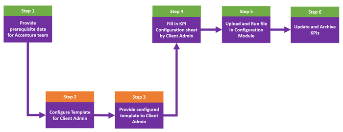

1.  

## Creating New KPIs

### Step 1 -- Client Provides Prerequisite Data to Accenture Team

The client administrator must provide prerequisite data to the Accenture team that will configure the initial template. Required information includes:

-   the entire asset hierarchy of the plant or operation.

-   the Departments and Roles to which the KPIs will be tied.

-   the list of KPIs, the calculation logic, and the dependency/relationships between them (optional).

-   parameter data (timeseries) used to calculate the KPIs should be available in CDF.

### Step 2 -- Accenture Team Configures Template for Client Admin

The Accenture team must preconfigure the template for use by the client administrator as follows:

1.  Open the template and right-click one of the sheets, then click *Unhide*.

2.  Hold the *CTRL* key while selecting the following hidden sheets:

    -   Asset Hierarchy Mapping

    -   Dependent Asset Hierarchy Level

    -   Assets Mapping

    -   Calculation Frequency

    -   Trigger Time

    -   Department

    -   Responsible Roles

3.  Click *Ok*.

> 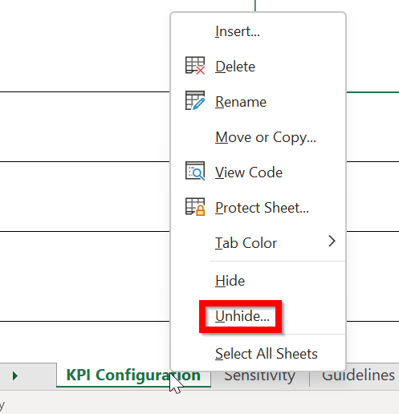

4.  Revise the sheets as follows:

    a.  [Asset hierarchy mapping] -- fill in according to the information provided by the Client Admin. See the [video](https://greetings.accenture.com/watch/1cCfmEk89o7zQqVhVGf17G?) for guidance.

        -   Navigate to the sheet named *Asset Hierarchy Levels*.

        -   Update the top row with the asset hierarchy level names in descending order.

            -   For any asset hierarchy level that is added as different columns as part of the Asset Hierarchy Mapping step, add the corresponding assets vertically in the respective columns. Click on the \'Formulas\' tab in Excel and click on \'Create from Selection\' in the Defined Names section. Select the respective column until the last row of entries for that column. In the pop-up, click on \'Top row\' and next click on \'Ok\'. Repeat this step for all the asset hierarchy levels.

            -   The Asset Hierarchy levels sheet contains the entire Asset Hierarchy (AH). The user must change the column names to align with the AH structure. For example, the structure may contain just the Plant, Unit, and System, or it might have an entirely different structure such as the Plant, Compressor, Area, and such. The columns should reflect the exact Asset hierarchy structure. In the first column (A) you should have the highest asset hierarchy level such as Plant, and in the last, you should have the lowest granularity asset, such as equipment.

            -   Format: do not use spaces within the column names. You can use \"\_\" for multiple naming conventions

        -   As shown in the image below, add one more column with the value *NA.*

> 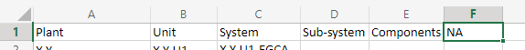
b.  [Department and Roles] -- make sure the list of Departments and respective roles are configured according to the Client Admin needs in the People management module.

    -   Department: Update the first row with the required Department names

    -   Responsible Roles: For each Department, add the corresponding roles in the specific Department column one below the other. Click on the \'Formulas\' tab in Excel and click on \'Create from Selection\' in the Defined Names section. Select the respective column until the last row of entries for that column. In the pop-up, click on \'Top row\' and next click on \'Ok\'. Repeat this step for all the Departments.

c.  [Calculation Frequency] - All the possible frequencies are already added in the drop-down. If any changes are needed, navigate to the sheet named \'Calculation Freq\' and add values in column A

d.  [Trigger time and Trigger day]

    -   All the possible times at an interval of 30mins are already added in the drop-down

    -   If any changes are needed, navigate to the sheet named \'Trigger Time\' and add/change values in column A

5.  Once the values are updated, navigate back to the KPI Configuration sheet.

6.  Select all rows in the Trigger time column, except the column titled \"Trigger Time.\"

7.  Update the source to match the changes done in the Trigger Time sheet. Click on the Data tab and then select \'Data Validation\' to reveal the pop-up window as shown on the right.

8.  Select List from the drop-down (step 1) and then click on the arrow from the right side (step 2), in the Trigger Timesheet, select the available option and then click the \"Ok\" button in the pop-up window. As a result, the user will be able to see the list with the available Trigger time options.

> 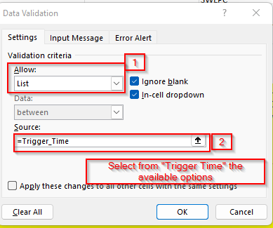

### Step 3 -- Accenture Team Provides Configured Template to Client Admin

Once all the configurations are done:

1.  Hide all sheets except for Dictionary and Guidelines for Admin.

2.  Upload the Template in the Smart KPI configuration module.

3.  Send it to the Client Admin.

### Step 4 -- Client Admin Fills in KPI Configuration Sheet

When creating the KPIs from scratch:

1.  Download the preconfigured Smart KPI Template.

    -   For security reasons, access to the template is restricted to users who have been manually approved by the Accenture team.

    -   For template usage guidance, see the *Instruction* tab in the template.

    -   If any KPIs change, the entire template must be uploaded again with the updated information. 

2.  When the *[Macros have been disabled]* security warning appears, click on the *Enable Content* button to enable macros.

> 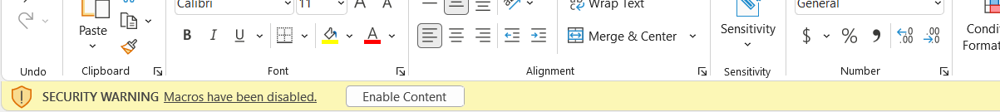

3.  Fill in all mandatory fields on all of the sheets as described below.

    -   KPI Configuration -- This is the main sheet that centralizes all the information that needs to be filled in. Before filling in the sheet, read the \"Dictionary\" and \"Guideline for Admins\" sheets to get familiar with the type of information and format you need to fill in this sheet.

    -   Guideline for Admin -- General guidelines to follow before filling the KPI Configuration:

        -   Column names cannot be changed.

        -   The user cannot insert new columns. He can only insert rows.

        -   The user may not add, modify (except modify the filter), or delete columns.

        -   To add a new KPI, the user may add a new row and the name must include only alphabets.

        -   Columns that need to be left blank: Version and UID for newly created KPIs.

        -   Dictionary -- This sheet contains the definition of each column from KPI Configuration. It also includes a brief description of all the listed fields, an explanation of the acronyms used in the sheet, and the formats they need to be filled in.

4.  When finished, save the completed KPI configuration file to the PC.

### Step 5 -- Client Admin Uploads Configuration File

1.  From the IAI main dashboard, click on the menu icon on the left side of the dashboard and select *Smart KPI* from the menu. On the resulting tab, click on the *Upload KPIs* button as shown in Figure 1.

2.  On the UPLOAD KPI pop-up, click on Upload KPI as shown in Figure 2, and then click *CONTINUE*.

3.  Browse to the saved Smart KPI Template and select the file.

4.  As shown in Figure 3, when the green check icon appears on the right side, click on *Define KPI in CDF*.

5.  Wait a few minutes for the DONE button to become active, then click it to close the window.

> Figure 1

Figure 2

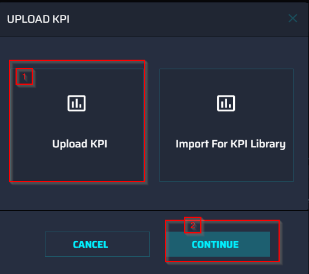

Figure 3

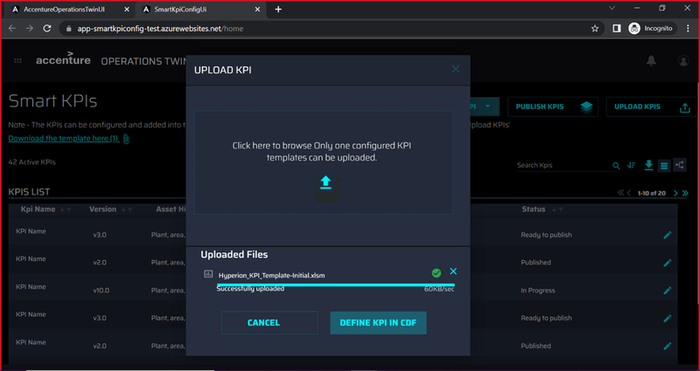

Figure 4

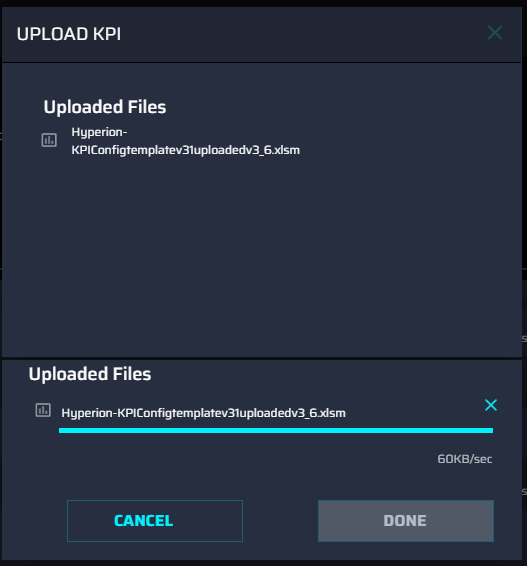

Figure 5

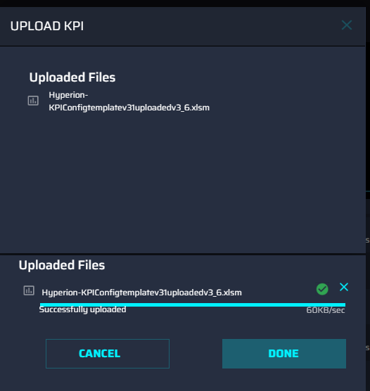

> A single UID and version of the new KPIs are assigned by the system and the status is set to \'*published\'*.

At this point, all KPI tiles and trendlines are visible on the Dashboard and users can navigate through the hierarchy to view KPIs that were aligned with their roles by the template as shown below.

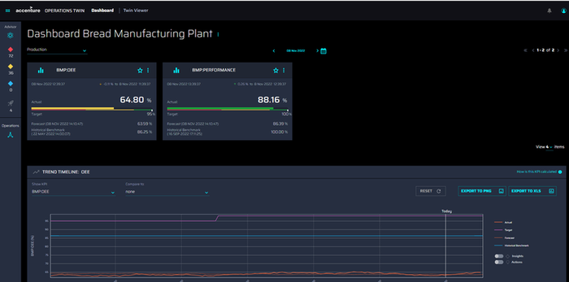

If more KPIs are needed, then the entire process must be repeated. The Update_flag must be set to Add for any KPIs that have been added to the workbook. If the Update_flag is left blank, the related KPI will be skipped.

### Possible Errors

An uploaded template is validated in multiple ways. If any of the validations fail, an error message like the one pictured is displayed. Possible messages are listed below.

-   Invalid: Duplicated row with same KPI name and same Asset Hierarchy Mapping is present

-   Invalid or missing KPI Name value

-   Invalid or Asset Hierarchy Mapping value is the same as that of Dependent Asset Hierarchy Level value.

-   Invalid KPI Calculation Target value

-   Invalid or KPI Calculation Target has a non-numeric value.

-   Invalid UID or update flag or status or version

-   Invalid: Existing KPI should have UID and valid status

-   Invalid: Update Flag should not be any other than \'Add\', \'Update\', \'Archive\'

-   Invalid: New KPIs should have the update flag value as \'Add\'

-   Invalid: Sensitive field value should be either Yes or No

-   Invalid: UID should not be different for the same KPI

-   Invalid: Archiving restricted. This KPI is a contributing KPI:\{kpis\[\'target_external_id\'\]\}.

-   Invalid: User should not update existing UID: error in \{Kpi_name\}

-   Invalid: Error occurred during File uploading to blob- \{exception_message\}

-   Invalid: Department - \{items\[self.Department\]\} has not been created in the People Management tool. Please ensure that the departments added to the template are created in the People Management tool.

-   Invalid: Role - \{items\[self.Responsible_Role\]\} has not been created in the People Management tool. Please ensure that the roles added in the template are created in the People Management tool.

-   Invalid: \{items\[self.Department\]\} - \{items\[self.Responsible_Role\]\} association does not match the role configuration in the People Management tool. Please ensure that the roles mapped to the departments are as per the role configuration in the People Management tool.

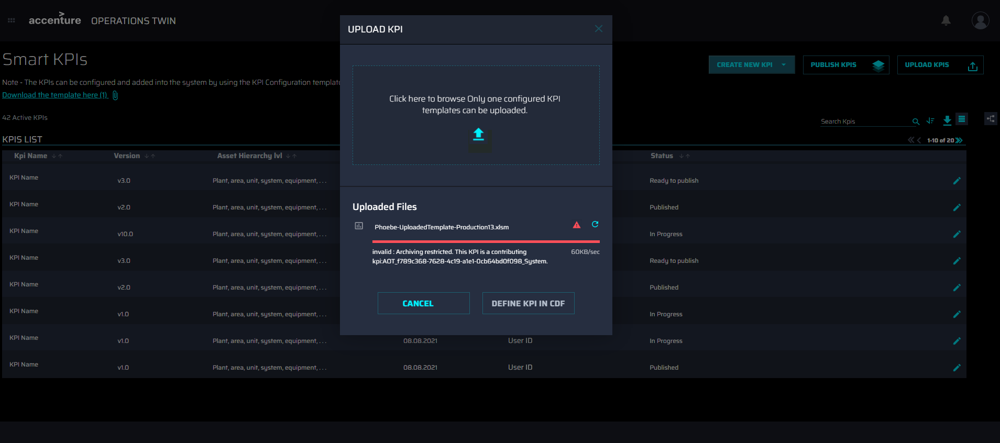

## Updating and Archiving KPIs 

As explained in the previous section, KPIs are managed using the [Smart KPIs Config Template.](https://ts.accenture.com/:x:/r/sites/GlobalDocTemplates/Published%20Documents/AOT/Linked%20Files/AOT_Smart_KPIs_Config_Template.xlsm?d=w1e93e66a1af4471c81561268af29e1d2&amp;csf=1&amp;web=1&amp;e=iNRi90) When existing KPIs are archived or updated in the template, the existing KPI hierarchy and CDF functions must be updated by uploading a new file in the IAI Smart KPI config UI. The updates to the KPI config can be in the KPI metadata, KPI relationship, or even in the calculation logic of actual, target, forecast, and historical benchmarks. 

### Archiving KPIs 

1.  Because contributing KPIs cannot be archived, verify that the KPIs to be archived are not contributing KPIs for other KPIs or parameters.

2.  In the config template, set the update flag of the target KPIs to Archive, e.g., Update_Flag = Archive. 

3.  Save the file and upload it as explained in the previous section.

Once the KPIs are successfully archived:

-   each archived KPI is an inactive orphan in the KPI hierarchy.

-   the corresponding CDF functions are no longer executed. 

-   the status becomes *Archived*. 

### Updating KPIs 

1.  In the config template, set:

    a.  the update flag of the target KPIs to *Update,* e.g., Update_Flag = Update. 

    b.  All the KPI Config fields can be updated in the config template, for example --

        i.  KPI name

        ii. KPI metadata

        iii. Calculation logic of actual, target, forecast, and historical benchmark

    c.  Once the KPIs have been successfully updated:

-   KPI metadata, hierarchy, and CDF functions are updated.

-   The version number of all the updated KPIs is incremented by 1.

-   The status of the KPIs is unchanged and is *Published*. 

> Note that when the name of a KPI is updated, in addition to marking the corresponding *Update_flag* of the KPI to *Update*, the Admin should identify all the impacted KPIs where the KPI being updated is referenced and should mark the *Update_flag* to Update for the impacted KPIs as well. This is to ensure that the KPI calculations are not impacted by changing the KPI name. Also, the *Update_flag* column in the smart KPIs config template can be blank if there are no updates/changes to the KPIs. In this case, the KPIs for which the *Update_flag* is blank can be skipped when the config file is uploaded a second time or later.

### Accessing Smart KPIs Config Tool

If the user has the \'Admin_SmartKPI\' role, they can view the SmartKPI icon in the side menu as enabled.

If the user does not have the above role:

-   the Smart KPI button in the side menu appears as disabled, as shown in the image on the side.

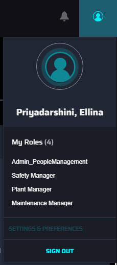

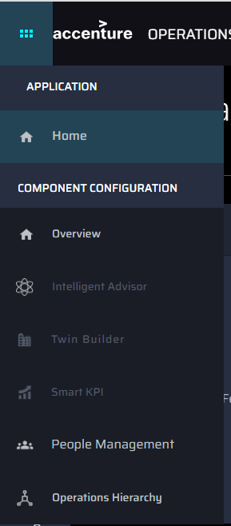

-   Similarly, the navigation tile for Smart KPI in the Component configuration home page also appears as disabled.

-   If the user tries to directly access the Smart KPI config URL, they will not be authorized to view the application and will be navigated away to an error page.

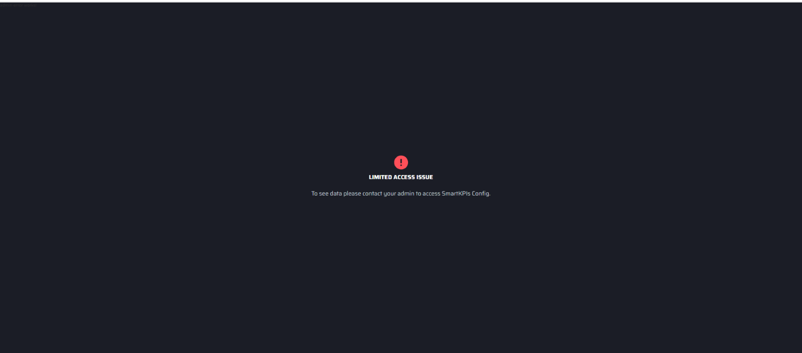
