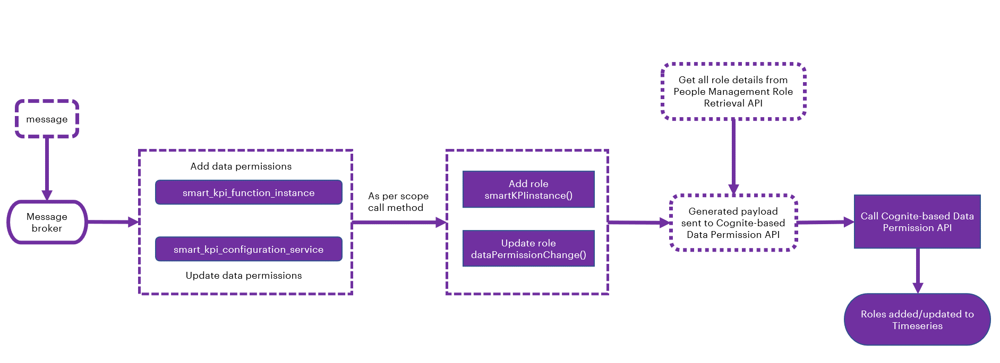
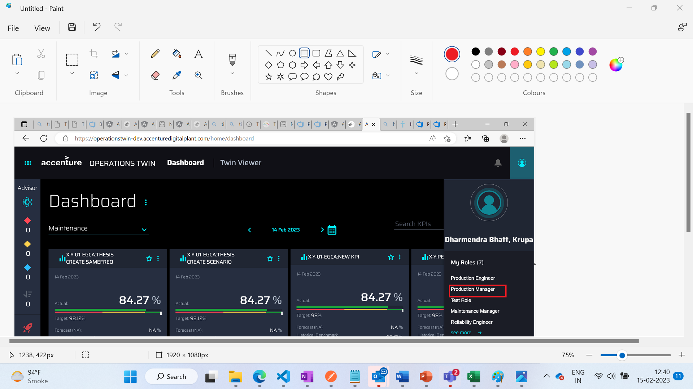
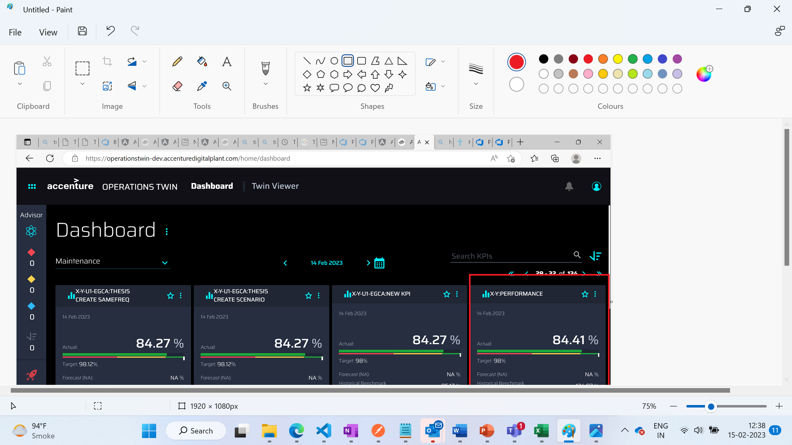
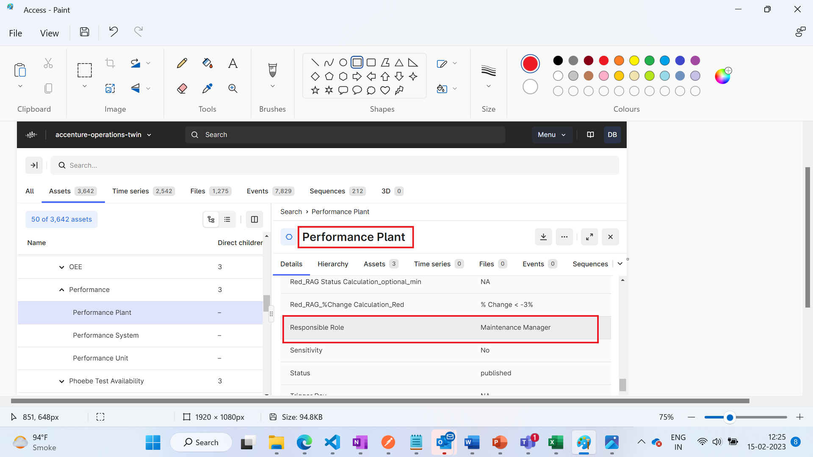
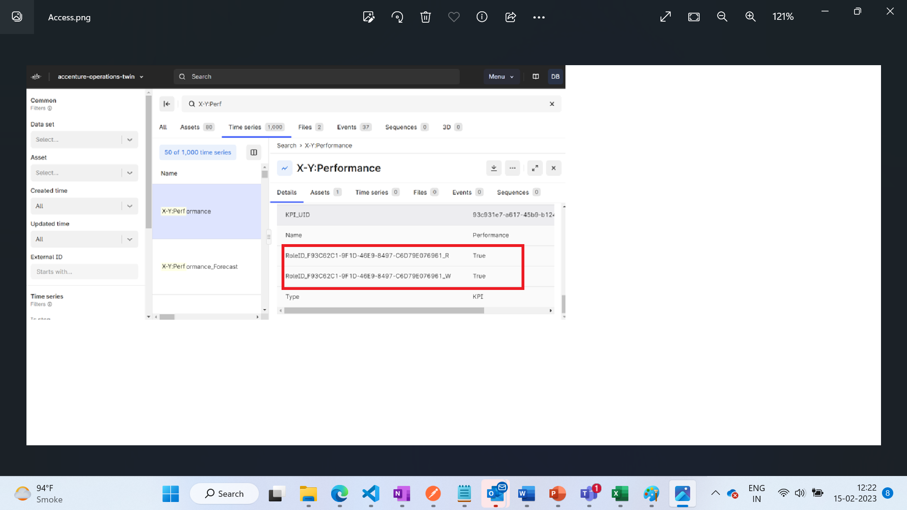
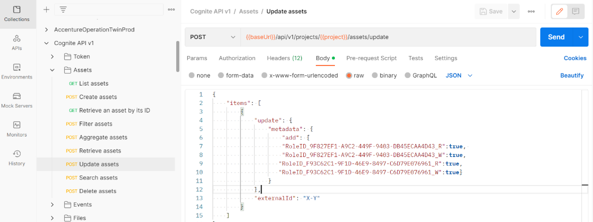
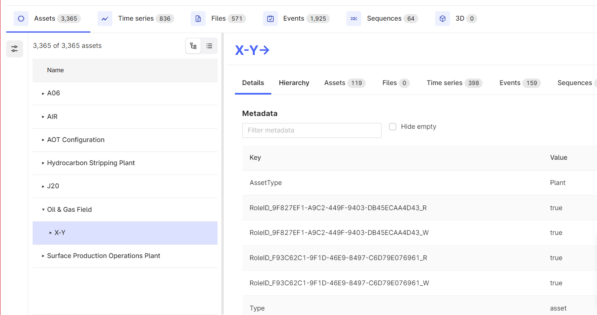
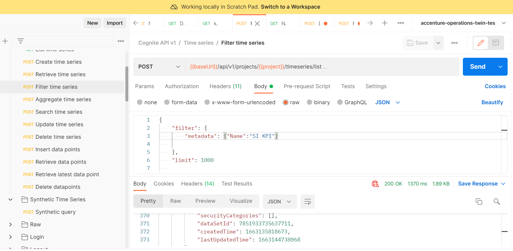
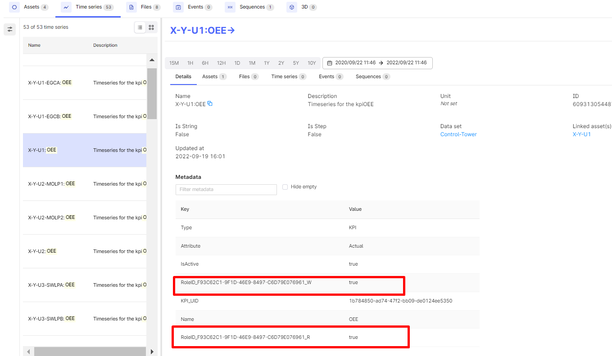

**People Management Integration Guide**

Release Version: 2.5

**Metadata Table**

| **Field** | **Value** |
| --- | --- |
| **Asset / Solution Name** | Smart KPIs/ People Management Integration |
| **Domain / Area** | Performance Metrics |
| **Owner (Team/Person)** | Tournier, Florian |
| **Reviewers** | Gali, Hanuman |
| **Status** | Draft / Approved |
| **Confidentiality** | Internal / Confidential |
| **Source of Truth** | [Summary - Overview](https://dev.azure.com/DigitalPlantProject/Marilyn%20V) |
| **Related Assets / Alternatives** | Smart KPIs API Reference, Smart KPIs Admin Guide |

## 

## Introduction

Industrial AI Foundation (IAI) is a collection of software accelerators and tools that can be assembled to deliver client solutions. IAI accelerates the integration of product, process, and live data from disparate IT and OT systems, creating a comprehensive and contextualized view of operations to enable better decisions and optimized processes.

People Management (PM) is an IAI component that helps in managing users, their roles, and permissions. It is a digital representation of the organizational hierarchy. The permissions include access to data and functionality in IAI. This component is duly integrated with the client\'s active directory to avoid duplicity

IAI\'s People Management (PM) component may be integrated with other IAI components -- including Smart KPIs -- to allow filtering by specific user roles. The role of the PM module is to enable administrators to manage access to data and functionality in the platform.

### Purpose

-   This guide describes how to integrate the people management component with other IAI components and describes PM and Smart KPI integration as an example.

-   This guide should be used along with the relevant API reference document that includes information about paths, inputs, outputs, and error management for APIs connecting with other component APIs.

### Prerequisites

-   Familiarity with People Management component. Refer [People Management Architecture Blueprint](https://industryxdevhub.accenture.com/assetdetails/64).

-   Familiarity with Smart KPI Configuration. Refer [Smart KPIs Administration Guide](https://industryxdevhub.accenture.com/assetdetails/42).

-   An API testing tool such as [Postman](https://app.getpostman.com/app/download/win64) is needed to manually update Roles in Time series and Assets.

-   An Authentication Token is needed to call the APIs.

-   Contributor/Influencer relationships must be created or updated accordingly in CDF (timeseries) before an event is triggered to enable the data permission microservice to add and update roles.

### Target Audience

-   Client Delivery Teams planning to deliver IAI with People Management integration.

### Related Links

-   [People Management API Reference](https://industryxdevhub.accenture.com/assetdetails/64)

-   [Smart KPIs API Reference](https://industryxdevhub.accenture.com/assetdetails/42)

-   [IAI Release Notes](https://industryxdevhub.accenture.com/assetdetails/45)[Cognite API Docs](https://apim-aot-mw-dev.azure-api.net/api/people-management/roles/%7broleId)

-   [API Management Documentation](https://docs.microsoft.com/en-us/azure/api-management/)

-   [REST API](https://apim-aot-mw-dev.azure-api.net/api/people-management/roles/%7broleId)

### Contacts

-   [florian.tournier@accenture.com](mailto:florian.tournier@accenture.com)

-   [rishabh.b.joshi@accenture.com](mailto:rishabh.b.joshi@accenture.com)

-   [hanuman.prasad.gali@accenture.com](mailto:hanuman.prasad.gali@accenture.com)

### 

## Glossary

| Term | Definition |
| --- | --- |
| IAI (Industrial AI Foundation) | A suite of software accelerators and tools that integrate product, process, and live data from various IT and OT systems, providing a comprehensive view of operations for improved decision-making. |
| Smart KPIs | A micro-frontend application within IAI that displays contextualized Key Performance Indicators (KPIs) to users, enabling performance tracking and improvement actions. Main landing page of IAI. |
| People Management (PM) | A component of IAI that allows administrators to manage user roles and access to data and platform functionality. Integrates with Smart KPIs to filter data by user roles. |
| KPI (Key Performance Indicator) | A measurable value that demonstrates how effectively an organization is achieving key business objectives. In IAI, KPIs are tracked and managed through Smart KPIs. |
| Asset Hierarchy (AH) | The structured organization of assets within IAI, which determines how roles and permissions are assigned and how users can access KPIs. |
| Timeseries | A sequence of data points indexed in time order, used in IAI to represent KPIs and other business metrics. |
| Role | A set of permissions assigned to users or groups, defining their access to data and functionality within IAI and Smart KPIs. Roles can be mapped directly to users or indirectly via Active Directory (AD) groups. |
| Active Directory (AD) Groups | Groups managed in Azure Active Directory, used to assign roles and permissions to users within IAI. |
| Authentication Token | A security token required to access People Management APIs, typically acquired via Azure AD. |
| Event Broker / Message Broker | A system that stores and distributes events (such as role changes) to subscribed microservices, ensuring that permissions and roles are updated across IAI components. |
| Microservice | A small, independent service that performs a specific function within the IAI architecture, such as managing roles or updating permissions. |
| Contributing KPI | A KPI that directly affects the value or performance of another KPI (e.g., availability, performance metrics). |
| Influencing KPI | A KPI that indirectly affects the value or performance of another KPI (e.g., safety incidents influencing overall efficiency). |
| Sensitivity Tag | A metadata flag indicating whether a KPI or user role involves sensitive information. Access to sensitive KPIs is restricted based on this tag. |
| CDF (Cognite Data Fusion) Portal | The platform where data (assets, timeseries, events) is stored and tagged with metadata, enabling users to access and manage data permissions. |
| Postman | An API testing tool used to manually update roles and permissions in IAI assets and timeseries. |

## 

# Smart KPI -- People Management Integration

The following section summarizes how the People Management component is integrated with the Smart KPIs component.

### Data Permission Microservice

To accomplish the PM integration in the Smart KPIs component, the data permission microservice is implemented to define and align roles and permissions.

-   The purpose of the Data Permission Microservice is to align the roles of IAI users with the roles defined in the configuration template. The roles are updated in Timeseries metadata on CDF.

-   After the roles are assigned, they will reflect on the KPI\'s Timeseries and its respective Contributor or Influencer KPI Timeseries as well.

-   The role assigned to users can be either Viewer or Owner.

Note that viewing KPIs is also dependent on the sensitivity tag defined in the Smart KPIs configuration template. For more information refer to the [Smart KPIs Administration Guide](https://industryxdevhub.accenture.com/assetdetails/42).

#### Workflow 

The following points explain the working flow of the Data Permission Microservice.

1.  The message passes through the message broker and depending on the message received, either of these two functions is called:

    -   smart_kpi_function_instance

    -   smart_kpi_configuration_service

2.  Depending on the scope of the final messages (event) received, the payload is generated by smartKPIinstance() and dataPermissionChange().

    -   smartKPIinstance(): This adds a role. The owner is provided access to newly added KPIs and for existing contributors/influencers, viewer access is provided.

    -   dataPermissionChange(): This updates the role as per the config template. It updates the new owner role for the specified KPI and provides viewer access to contributors/influencers.

3.  Role-related information is retrieved from the People Management Role Retrieval API. The information is filtered, and the role ID, name, and key-value pair are extracted.

4.  The final payload is generated by checking the current role and its contributor/influencer information. For more information refer to the next section, \'Conditions to View KPIs\'.

5.  The generated payload is passed to the Cognite-based Data Permission API. After receiving the payload, the API is called, and it adds/updates to the Timeseries in CDF.

Note that the influencing and contributing KPIs get updated with the required roles without actually updating the role. The Data Permission service adds existing/removes unneeded roles when updating the influencing and contributing KPIs.

For role addition/removal, a single list of owner/viewer role details of the given KPI is created, followed by the KPI\'s contributor and influencer. Examples of Owner and Viewer accesses provided by the People Management APIs are as follows:

| Access | Example |
| --- | --- |
| Owner Access | RoleID_3BF3AFE6-8DE4-403A-932F-D84C24D4BCE9_R True RoleID_3BF3AFE6-8DE4-403A-932F-D84C24D4BCE9_W True |
| Viewer Access | RoleID_3BF3AFE6-8DE4-403A-932F-D84C24D4BCE9_R True RoleID_3BF3AFE6-8DE4-403A-932F-D84C24D4BCE9_R True RoleID_3BF3AFE6-8DE4-403A-932F-D84C24D4BCE9_W False |

After role permissions are assigned, users can view the dashboard or drill down based on their role and permission.

#### 

### Workflow Diagram

The following diagram illustrates the workflow of the Data Permission Microservice.

## 

### Viewing KPIs

This section describes how assigning the AH and roles via the PM module in addition to Smart KPI Configurations enables the drill down functionalities and viewing of Smart KPIs for the end user.

-   The user should be able to drill down the entire KPI hierarchy of the parent KPI if the sensitivity requirements are met.

-   If a user has owner access to a KPI, then the user should have viewer access to its contributing and influencing KPIs as well as viewer access to further drill down in the KPI hierarchy.

-   If the owner role of a parent KPI gets updated, the old role (previous owner role) should still be able to view the contributing/influencing KPIs if the old role has owner/viewer access to other KPIs for which the contributing and influencing KPIs of the parent KPI are also contributing/influencing for other KPIs or if those APIs come up during the drill down of other KPIs.

-   If a role provides the owner access to a KPI for which the role already had viewer access, the user should be able to view the new KPI in the main dashboard as well as in the KPI drill down as a contributing/influencing KPI.

-   As per the role assigned to users, they can view the relevant KPIs on the UI.

-   The People Management APIs are used to update Timeseries for adding/updating roles.

##### 

#### CDF Portal View

Using the PM APIs on Data Permission service In the CDF portal user can view role permission added on Timeseries. The Performance Plant has the Maintenance Manager as per the Configuration template

Using the Data Permission Microservice, update the timeseries with Maintenance Role ID. Users that have Maintenance Manager access can view the Performance Plant.

CDF can also be used to view users that have:

-   Add/Update contributor relationship

-   Add/Update Influencer relationship

## 

## APIs

Two People Management APIs are used in the Data Permission Microservice: People Management Role Retrieval API and People Management Role Detail API. They are described in the subsequent sections.

#### Authentication Token

An authentication token is required to fetch the People Management APIs.

| PROTOCOL | HTTPS |
| --- | --- |
| PATH (Public Exposure) | [https://apim-mw-aot-dev.azure-api.net/api/people-management/users/bytoken](https://apim-aot-mw-dev.azure-api.net/api/people-management/users/bytoken) |
| PATH (Public Exposure) (AWS) |  |
| METHOD | GET |
| CONTENT TYPE | application / json |

#### People Management Role Retrieval API

This API fetches the RoleIDs for the plant. For example, if the assetId is C-B1-G1-R1-F1 then the API fetches all RoleIDs that are associated with this plant. To fetch the RoleID, the Authorization token for access valid user must exist.

##### Specifications

| PROTOCOL | HTTP |
| --- | --- |
| PATH (Public Exposure) | [https://apim-mw-aot-dev.azure-api.net/api/operation-heirarchy/plant/\{assetId\}/Roles](https://apim-mw-aot-dev.azure-api.net/api/operation-heirarchy/plant/%7bassetId%7d/Roles) |
| PATH (Public Exposure)(AWS) | [https://cn13sbr3r6.execute-api.us-west-2.amazonaws.com/api/operation-heirarchy/plant/\{plant_id\}/Roles](https://cn13sbr3r6.execute-api.us-west-2.amazonaws.com/api/operation-heirarchy/plant/%7bplant_id%7d/Roles) |
| METHOD | GET |
| CONTENT TYPE | application / json |
| Request URL | [https://apim-mw-aot-dev.azure-api.net/api/operation-heirarchy/plant/\{assetId\}/Roles](https://apim-mw-aot-dev.azure-api.net/api/operation-heirarchy/plant/%7bassetId%7d/Roles) |
| JSON Response | [Link](https://ts.accenture.com/:t:/r/sites/GlobalDocTemplates/Published%20Documents/AOT/Linked%20Files/PM%20Integration%20with%20SmartKPIs/2.0/PM_Role_Retrieval_JSON_Response.txt) |

##### Input Header Parameters

| ***Parameter*** | ***Description*** ***M/O*** ***Max Length*** ***Type*** |
| --- | --- |
| Authorization | Token acquired from Azure AD based on the user credentials for further API calls. e.g., msal.accesstoken : \{ token: \"\\" \} M-Public \- String |

##### Input Path Parameters

| ***Parameter*** | ***Description*** ***M/O*** ***Max Length*** ***Type*** |
| --- | --- |
| assetid | External id of the KPI the asset is linked to \[e.g., path value\\] M 255 String |

#### 

### People Management Role Detail API 

This API fetches details for selected RoleIDs. The details fetched are RoleName, users who have access, department, etc. To fetch the details, the authorization token must exist

##### Specifications

| PROTOCOL | HTTP |
| --- | --- |
| PATH (Public Exposure) |  |
| PATH (Public Exposure)(AWS) | [link](https://cn13sbr3r6.execute-api.us-west-2.amazonaws.com/api/people-management/roles/byIds) |
| METHOD | POST |
| CONTENT TYPE | application / json |
| Request URL |  |
| JSON Response | [Link](https://ts.accenture.com/:t:/r/sites/GlobalDocTemplates/Published%20Documents/AOT/Linked%20Files/PM%20Integration%20with%20SmartKPIs/2.0/PM_Role_Detail_JSON_Response.txt) |

##### Input Header Parameters

| ***Parameter*** | ***Description*** ***M/O*** ***Max Length*** ***Type*** |
| --- | --- |
| Authorization | Token acquired from Azure AD based on the user credentials for further API calls. e.g., msal.accesstoken : \{ token: \"\\" \} M-Public \- String |

## 

## Adding Roles to Assets

For the integration to work, the User Roles must be added to the Assets. This can be accomplished using a Postman query as shown below.

#### Sample Postman Query

\{

\"items\": \[

\{

\"update\": \{

\"metadata\": \{

\"add\": \{

\"RoleID_9F827EF1-A9C2-449F-9403-DB45ECAA4D43_R\": true,

\"RoleID_9F827EF1-A9C2-449F-9403-DB45ECAA4D43_W\": true,

\"RoleID_F93C62C1-9F1D-46E9-8497-C6D79E076961_R\": true,

\"RoleID_F93C62C1-9F1D-46E9-8497-C6D79E076961_W\": true

\}

\}

\},

\"externalId\": \"X-Y\"

\}

\]

\}

### Adding Roles to Timeseries

Roles must also be added to Timeseries. To add roles to retrieved timeseries, run the queries on the pages that follow.

#### Sample Postman Query

The query below is used to retrieve the respective timeseries.

\{

    \"filter\": \{

        \"metadata\": \{\"Name\":\"SI KPI\"\}

   

    \},

    \"limit\": 1000

   

\}

Use the result of the query above to populate the value for the timeseries JSON object in the Python script.

#### Sample Python Script

The result list from Postman is copied and pasted into the Python script to identify the timeseries. See the [Sample Python Script](https://ts.accenture.com/:t:/r/sites/GlobalDocTemplates/Published%20Documents/AOT/Linked%20Files/AOT_PM_Sample_Python_Script.txt).

## Use Cases

The subsequent sections describe the scenarios in which Smart KPIs integrate with People Management by communicating through APIs. These sections describe the concept and process. For details such as the API preconditions, parameters, and JSON requests and responses for the APIs, refer to the corresponding sections in the [Smart KPIs API Reference](https://industryxdevhub.accenture.com/assetdetails/42) and the [People Management API Reference](https://industryxdevhub.accenture.com/assetdetails/64).

### Use Case 1: GET- KPI dashboard

The KPI dashboard API is a part of the IAI-SmartKPI-Middleware Microservice that is invoked and consumed by the UI.

The KPI dashboard is a GET call to the Smart KPI IAI server hosted at the backend to get parent KPI details. On logging in, the KPI dashboard displays all the KPIs to which the user has owner access. Owners should have both read and write permissions on Asset Hierarchy and Timeseries. To determine the kind of access each user has, the KPI Dashboard API calls a People Management API, GET UsersByToken to fetch the value for the isSensitive flag for each KPI. The value of the flag is either True or False. The value is true when the user has the relevant permission to view a KPI and false when the user does not have the permission to view that KPI.

Thus, depending on the isSensitive flag value, only the KPI tiles that the user has access to are displayed on the dashboard by the Dashboard API. Drilldown capabilities from the dashboard are contingent upon asset access. Verify the asset access for roles shared by both the KPI and the user. If asset access is granted, then permit further drilldown from the dashboard; if not, restrict it. The UI\'s restriction on further drilldown will be determined by the API response attribute disableFurtherDashboardDrilldown, which can be either *false* or *true*.

### 

## Use Case 2: GET -- List API

The List API is part of the IAI-SmartKPI-Middleware API that is invoked by the UI and consumed by the UI. List API is a GET call to the Smart KPI IAI DEV server hosted to retrieve all timeseries available and to return it in JSON format. To retrieve timeseries and return them as JSON, it requires role details, which the List API fetches by calling a PM API- GETRoles.

The GETRoles API provides role details such as Role ID, Role Name, Role Type, Role Description, sensitivity status, creation details, associated Active Directory (AD) groups, users associated with the role, and departments associated with the role. The details required by the List API are Role ID, Department, and Department ID, which it uses to retrieve timeseries and generate the JSON response.

### 

## Use Case 3: POST- KPI Drilldown

The KPI drilldown API is part of the IAI-SmartKPI-Middleware Microservice that is invoked and consumed by the UI. It is a POST call to the Smart KPI IAI server hosted at the backend to get the contributing and influencing KPI details (external IDs) which are displayed to the user on clicking on the KPI tile. The contributing and influencing KPIs are defined in the following table:

| Contributing KPIs | Influencing KPIs |
| --- | --- |
| This represents all the KPIs of a selected KPI that directly contribute to the value/performance of the selected KPI. For example: for OEE at the plant level - the contributing KPIs can be availability, performance, and OEE at the system level among other KPIs. | This represents all the KPIs of a selected KPI that indirectly influence the value/performance of the selected KPI. For example: for OEE at the plant level - the influencing KPIs can be the number of safety incidents among other KPIs. The drilldown details, i.e., the contributing and influencing KPI details, displayed to a user are based on the user\'s role authorizations, which the Drilldown API fetches from a People Management API, GetAOTRoleById. Along with the user role, sensitivity tags of the KPI are used by the API to decide whether a user can view that KPI in drilldown or not. The POST KPI DRILLDOWN API fetches the sensitivity tag of the user\'s role from the PM API to validate against and display the drilldown details accordingly. The following points explain how a user\'s role and permissions affect the drilldown view. |
| - | If contributing/influencing KPIs have a sensitivity tag as \'Yes\' and the user role also has a sensitivity tag as \'Yes\', then the user can see that KPI in the drilldown. |
| - | If the contributing/influencing KPI has a sensitivity tag as \'Yes\' and the user role does not have a matching sensitivity tag, then the user cannot view that KPI in the drilldown. |
| - | When users have multiple roles, they can see all the contributing or influencing KPIs for which the user has read permission through all the roles assigned to the user considering the above points. |
| - | When either or both the target and forecast timeseries data are not available in CDF, the KPI drilldown API will return \"NA\" as a response, Thus, it must be noted that the target and forecast timeseries are not mandatory for the parameters. |
| - | If the sensitivity requirements are met (both tags are \'Yes\') then the user can also drill down the entire KPI hierarchy (contributing and influencing KPIs) of the parent KPI. The user should be able to view the parameters and their corresponding values. |
| - | If a user has owner access to a KPI, they also have viewer access to its contributing and influencing KPIs as well as view access to further drill down in the KPI hierarchy. |
| - | If the owner role of a parent KPI gets updated, the old role (previous owner role) can still view the contributing and influencing KPIs if the old role has owner/viewer access to other KPIs for which the contributing and influencing KPIs of the parent KPI are also contributing/ influencing or come up during the drill down of other KPIs. |
| - | If a role is provided with owner access to a KPI for which the role already had viewer access, the user should be able to view the new KPI in the main dashboard as well as in the KPI drill down wherever the KPI comes up as an influencing/contributing KPI. |
| - | The Kafka message is integrated into the \'Define KPI in CDF\' process. This process enables the user to add/update roles associated with KPIs. |
