

Industrial AI Foundation

Smart KPIs

UI GUIDE

Release Version: 2.5

**Metadata Table**

| **Field** | **Value** |
| --- | --- |
| **Asset / Solution Name** | Industrial AI Foundation/ Smart KPIs |
| **Domain / Area** | Performance Metrics |
| **Owner (Team/Person)** | Tournier, Florian |
| **Reviewers** | Gali, Hanuman |
| **Status** | Draft / Approved |
| **Confidentiality** | Internal / Confidential |
| **Source of Truth** | [Summary - Overview](https://dev.azure.com/DigitalPlantProject/Marilyn%20V) |
| **Related Assets / Alternatives** | Smart KPIs API Reference, Smart KPIs Admin Guide |

## Introduction

Industrial AI Foundation (IAI) is a collection of software accelerators and tools, including Smart KPIs, that can be assembled to deliver client solutions. IAI accelerates the integration of product, process, and live data from disparate IT and OT systems, creating a comprehensive and contextualized view of operations to enable better decisions and optimized processes.

Key Performance Indicators (KPIs) are measurable factors that are tracked to gauge performance, stimulate actions, and drive business productivity. The factors listed in the table on the side are used to form each KPI.

Smart KPIs is a Micro Front-end application that is mounted to the IAI application and is the landing page of the IAI application. It provides contextualized views of KPIs to IAI users in both the boardroom and on the shop floor. The Smart KPIs application is invaluable for tracking performance issues as well as the actions taken to improve performance.

### Purpose

This guide explains how to use the IAI Smart KPIs UI after deployment.

### Target Audience

End users of the IAI UI

### Prerequisites

-   IAI has been deployed.

-   Google Chrome browser is installed.

-   The graphic resolution must be set to either 1920 or 1440.

### KPI Factors

The factors involved in calculating KPIs are listed below.

#### Actual Value

> This is the current value of the KPI that is calculated using the actual calculation logic defined in the KPI config template.

#### Historical Benchmark

> This is the best performance value observed in the last 12 months.

#### Target Value

> This is the desired performance/value of the KPI.

#### Forecast

> This is the forecast for the current time interval that is calculated as a 7-day moving average.

###  Contacts

-   [florian.tournier@accenture.com](mailto:florian.tournier@accenture.com)

-   [thejash.s.suresh@accenture.com](mailto:thejash.s.suresh@accenture.com)

### Related Links

-   [IAI on CDF](https://operationstwin.accenturedigitalplant.com/)

-   [IAI on Azure](https://aot-azure.accenturedigitalplant.com/)

-   [Release Notes](https://industryxdevhub.accenture.com/assetdetails/45)

-   [Deployment Guide](https://industryxdevhub.accenture.com/assetdetails/53)

-   [Administration Guide](https://industryxdevhub.accenture.com/assetdetails/42)

### Glossary

| **Term** | **Definition** |
| --- | --- |
| IAI (Industrial AI Foundation) | A suite of software accelerators and tools, including Smart KPIs, that integrates product, process, and live data from IT and OT systems to provide a comprehensive view of operations for better decision-making. |
| Smart KPIs | Micro Front-end application within IAI that provides contextualized views of KPIs, enabling users to track performance issues and actions taken to improve performance. It is the landing page of the IAI application. |
| KPI (Key Performance Indicator) | Measurable factors tracked to gauge performance, stimulate actions, and drive business productivity. KPIs are formed from specific factors listed in the guide. |
| Contributing KPIs | KPIs that influence or contribute to the calculation of a parent KPI. |
| RAG Logic | Visual representation of Actual data against Target using Red-Amber-Green status in KPI tiles. |
| Intelligent Advisor | AI-powered assistant in Azure deployments, enabling interaction with operational data using natural language for insights and root-cause analysis. |

## Dashboard

The Smart KPIs Dashboard is the landing page of the application and includes:

1.  Header, which has options to switch between the Dashboard, Twin Viewer, and Reports.

2.  App launcher icon that expands a side menu with the following options: Home, Overview, Intelligent Advisor, Twin Builder, Smart KPI, People Management, and Operations Hierarchy.

3.  Intelligent Advisor and Operations Hierarchy side panel.

4.  Dropdown to choose various KPI Departments, which are sorted alphabetically.

5.  KPI Tiles show the KPI data -- Actual, Target, Historical Benchmark, and Forecast. KPI data is refreshed automatically in batches using lazy loading.

6.  Date picker to choose time frames from eight different options.

7.  Search bar and filter options.

8.  Paginator to navigate through different tiles.

9.  Trend Timeline graph that plots the data based on the selected time frame, shows Insights on the graph and allows the export of the graph as an image or a Microsoft Excel spreadsheet. The trend timeline is discussed further in the next section.

10. When deployed in Azure, an AI-powered assistant enables interaction with real-time and historical operational data using natural language. It simplifies access to structured and unstructured data, providing contextual insights, KPIs, actions, and root-cause analysis to support faster and smarter decision-making across assets, roles, and plants.

> 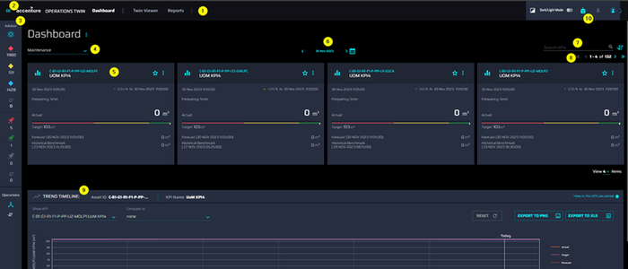
### 

## OT and Non-OT KPIs

The dashboard displays both OT (Operations Twin) and NON-OT Key Performance Indicators (KPIs), as shown in the screenshot below.

-   OT KPIs are computed based on real-time data.

-   Non-OT KPIs are derived from event-based data.

This design ensures a comprehensive view of performance metrics by integrating both real-time and event-driven data.

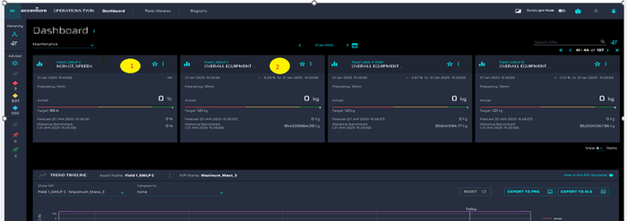

### Sorting KPIs

KPIs can be sorted on the dashboard as per the following options.

-   Best Performing. KPIs are sorted as per performance, from best to least. The NDA (no data available) tiles appear at the end, since their performance deviation cannot be calculated.

-   KPI Name. The KPIs are sorted by their names in alphabetical order, regardless of the data shown on the tiles, as the sorting is solely based on the KPI name.

> 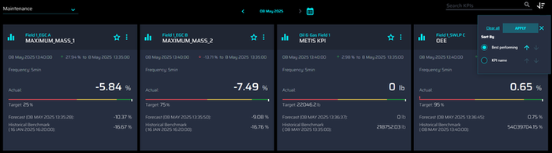

## Trend Timeline Graph

The trend timeline is a graphical representation of KPI trend data. The X-axis represents the time frame, and the Y-axis represents units of data. Functions of this view include:

-   Filtering by KPI, Department, and Date.

-   Export to PNG and XLS.

-   Dynamic legends, counts, and export functions are automatically aligned with graph data.

The Trend Timeline chart shows the Actual, Target, Forecast, and Historical benchmark trend of the selected KPI for the selected period in the calendar. By default, it shows seven days of data. Hovering over the Asset ID or KPI Name displays a tooltip that displays the complete details.

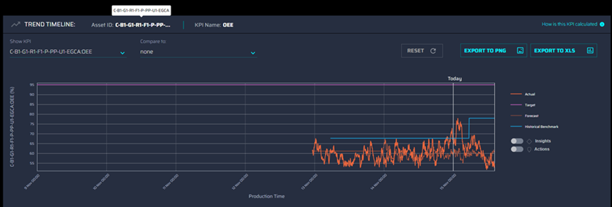

### 

## KPI Comparison in Trend Timeline 

The trend timeline graph can compare the trends of two KPIs for two selected parameters. The trend timeline comparison view can be enabled by selecting a KPI in the *Compare To* dropdown. The X-axis represents the time frame, and the Y-axis represents units of data for the selected KPIs. Functions of the view include:

-   Comparing two KPIs by parameters such as Actual, Forecast, Target, and Historical Benchmark.

-   Two parameters can be compared at a time.

-   Export to XLS.

-   Reset to a single graph view by using the Reset button.

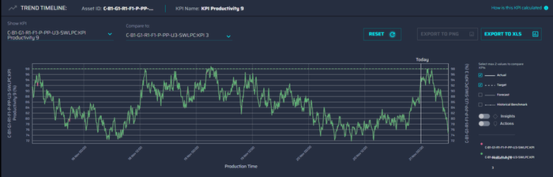

## 

# 

## KPI Tiles

The Smart KPIs MFE application displays all the KPI-related data in the form of KPI Tiles. A KPI Tile includes:

-   The Asset Name and KPI name. The KPI name is displayed partially when the character length exceeds the KPI tile width. Hovering over the Asset Name displays a tooltip that shows the complete name.

-   The Actual, Forecast, Historical Benchmark, and Target values of a KPI.

-   The date on which Actual is calculated.

-   A visual representation of the Actual data against the Target that the KPI needs to reach in the form of a progress bar, based on RAG logic.

-   The percentage change in KPI performance.

-   Calculation frequency of the KPI

-   An error message if the data is not present.

> 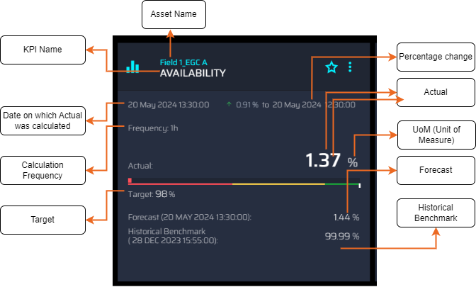
### 

## Aggregated Data

Except for parameter tiles, the calculation frequency of the KPI is displayed in all KPI tiles, regardless of any calendar selection.

-   If the calculation frequency of the parent is different than the calculation frequency of the contributing KPIs, then the contributing KPI tiles will show the aggregated data of the KPI for the time range in which the parent KPI is being calculated.

-   The influencing KPI tiles will show the latest data of the KPI by default and will not have aggregated data attributes.

-   The parameter tiles will show the aggregated data of the parameter in which the parent KPI is being calculated, whether there is a difference in the calculation frequencies or not.

The screenshot on the right shows the parent KPI, which has a calculation frequency of two hours.

***\
***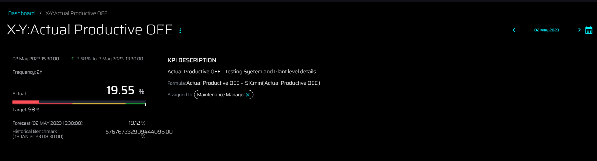

### Contributing KPIs

The screenshot below shows the result of differing calculation frequencies between the Parent KPI (two hours) and the Contributing KPIs (one hour). The aggregated data is displayed on the KPI Tiles.

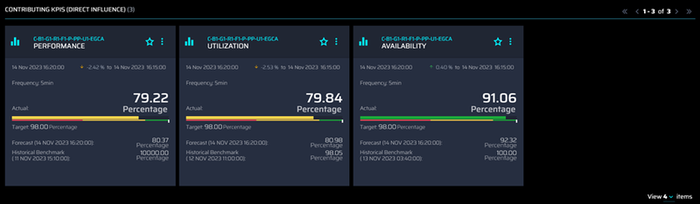

#### Parameters

In the screenshot below, the parameter tiles show the aggregated data of the parameter in which the parent KPI is being calculated, despite the calculation frequency difference.

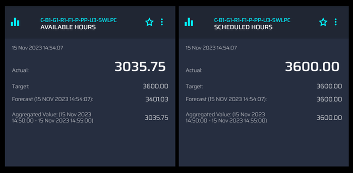

#### Errored KPI Tile

As shown in the screenshot on the right, for any time period that is selected, if the value corresponding to the KPI is not available in the time series, or if the actual values are not available for the selected time period, then an error message is displayed.

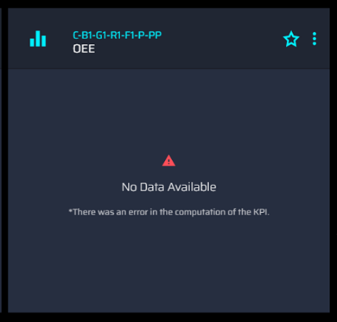

### Calendar and KPI Tiles

Eight different time frames are available for selection:

-   Hour(s)

-   Day(s)

-   Week(s)

-   Month(s)

-   Quarter(s)

-   Half-Year(s)

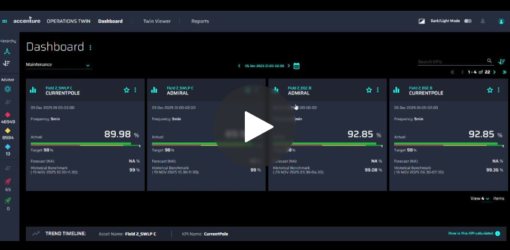

### Role-based KPI Drilldown

The role assigned to the IAI user determines which KPIs are displayed on the dashboard. On drilling down, the corresponding Contributing and Influencing KPIs for that role will be displayed as well. A sensitivity tag can also be assigned to the roles and KPIs. The value of the sensitivity tag determines the visibility of KPI details as follows:

-   A contributing/influencing KPI will only be visible in the drill-down if the KPI has a sensitivity tag equal to Yes, and the IAI user role also has that tag.

-   If the IAI user has multiple roles, and any one of the roles has that sensitivity tag, then they will be able to see that contributing/influencing KPI.

-   The technical details of the sensitivity tag and its corresponding API can be found in the [IAI Smart KPIs API Reference document.](https://industryxdevhub.accenture.com/assetdetails/42)

### KPI Drilldown Details

Clicking on one of the KPI Tiles displayed on the Dashboard reveals details about the KPI that include:

-   A detailed description of the KPI

-   The Aggregation Logic used to compute that KPI

-   The role to which the KPI is assigned

-   Contributing KPIs of the selected KPI

-   Influencing KPIs of the selected KPI

-   Trend Timeline graph

-   Parameter tiles if they are one of the contributing/influencing KPIs

The breadcrumb controls at the top of the page may be used to drill down through the KPIs at various levels of granularity, starting at the Plant level. For example, selecting *X-Y:OEE* at the Plant level reveals corresponding Contributing and Influencing KPIs at the Unit level. Selecting a Contributing KPI at the Unit level reveals any Contributing and Influencing KPIs at the system level and so on until there are no Contributing or Influencing KPIs left to display. To see a demonstration, play the following video.

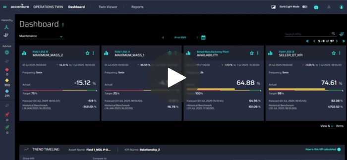

An authorized IAI user can continue to drill down to the parameter level. When no further drilldown is possible, one of the following messages is displayed.

-   You\'ve reached the end of the KPI Hierarchy. No further drill-down is possible.

-   Further drill-down disabled due to access restrictions. Please contact admin to get the required access.

> 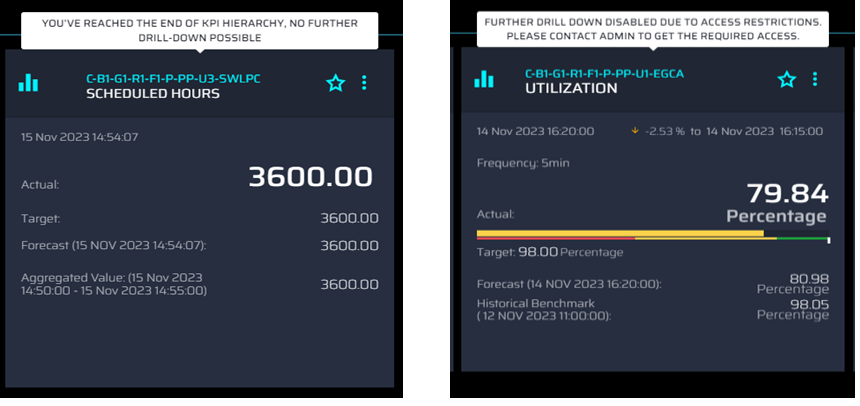
### 

## Parameters Drilldown

-   Parameters are the lowest level of drill-down, and thus, the IAI user will not be allowed to drill down further by clicking the parameter tile.

-   Parameters have *Actual* values as well as any *Forecast* and *Target* values. There is no historical benchmark data present for the Parameters.

-   Parameters will show the Forecast values if the data is available in the parameter time series.

-   Parameters do not have RAG values, and hence, there is no RAG status displayed on the tiles for Parameters.

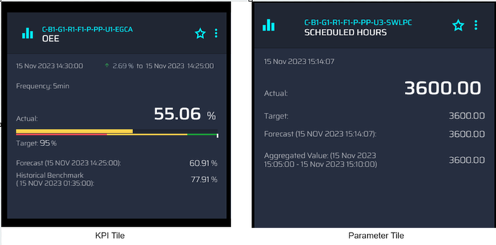

-   The trend timeline graph for Parameters may be viewed by selecting any Parameter from the *Select KPI* dropdown.

-   Any two Parameters or KPIs with the Parameters may be compared using the Comparison view of the Trend Timelines.

-   Since there is no historical benchmark data present for Parameters, the trend timeline graph is plotted without the Historical Benchmark line. A screenshot of an example trend timeline graph for this case is shown below.

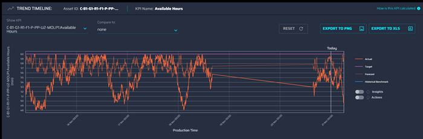

### Access-based KPI Drilldown 

This functionality enables viewing the KPIs for which the user has owner access in the dashboard, even if the user does not have access to the asset. The user is also restricted from drilling down to the KPI from the dashboard in the above scenario. On hovering over the KPI, a tooltip message is displayed - \'Further drill down disabled due to access restrictions. Please contact Admin to get the required access.\'

On selecting an asset in the OH panel, the user can view the KPIs for which the user has owner/viewer access to the KPIs and If the user does not have access to the asset which has been selected (or the asset corresponding to the KPI), the user is restricted from drilling down further. On hovering over the KPI, the user gets to see a tooltip with the message: \"Further drill down disabled due to access restrictions. Please contact admin to get the required access.\"

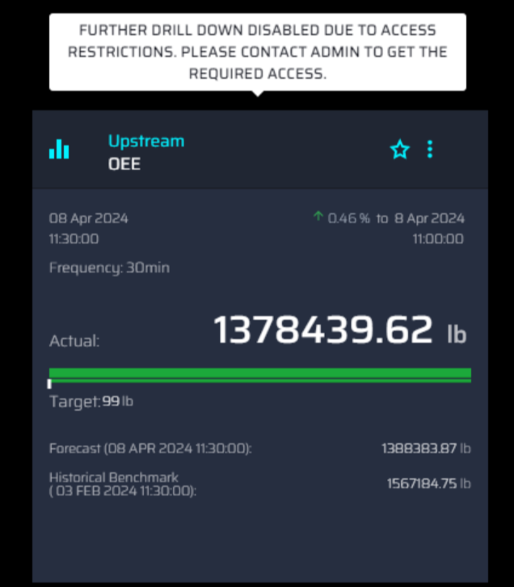

### 

## Non-OT KPI Drilldown Details 

Clicking on one of the Non-OT KPI Tiles displayed on the Dashboard reveals details about the KPI that include:

-   A detailed description of the KPI

-   The Aggregation Logic used to compute that KPI

-   The role to which the KPI is assigned

    Contributors of the selected KPI

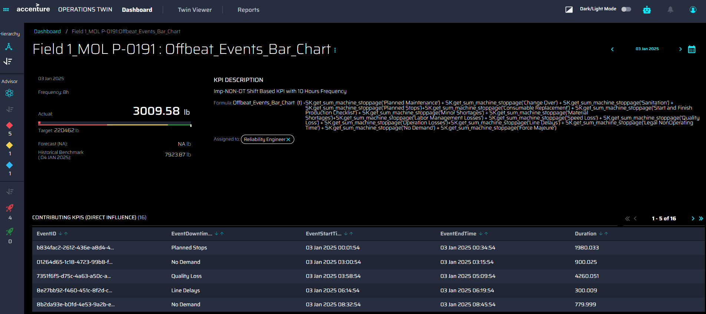

Further details displayed on scrolling down are:

-   Trend Timeline graph

-   Downtimes in the form of a bar or pie chart

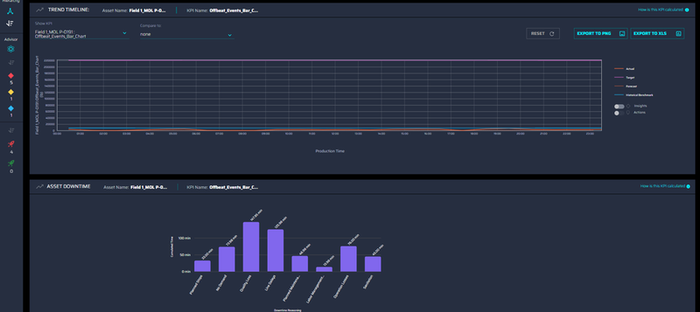

### 

## 

### Contributing KPIs

The drilldown page dynamically decides which table to show based on KPI type: Events Table for event KPIs, Batch Table (with expand/collapse) for batch KPIs.

#### Event Table

When a Non‑OT KPI in the dashboard is clicked, the *Events Table* is displayed showing the corresponding event data.

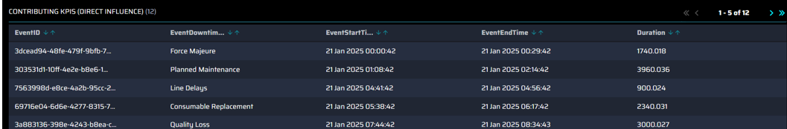

If there is no data available, a message stating \'No Records Found\' will be displayed, as shown in the screenshot below.

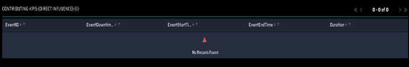

#### Batch Table

When a Non‑OT KPI in the dashboard is clicked, a Batch Table appears displaying the corresponding batch data, with each row expandable to reveal all attribute values for the selected Batch ID.

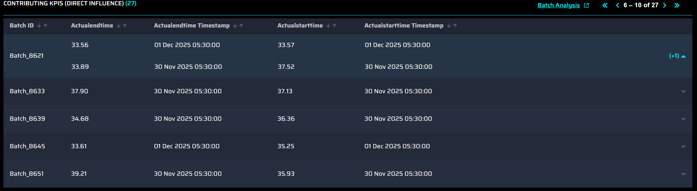

### 

## Trend Timeline

The trend timeline graph for Parameters may be viewed by selecting any Parameter from the Select KPI dropdown.

Any two Parameters or KPIs with the Parameters may be compared using the Comparison view of the Trend Timelines.

Since there is no historical benchmark data present for Parameters, the trend timeline graph is plotted without the Historical Benchmark line. A screenshot of an example trend timeline graph for this case is shown below.

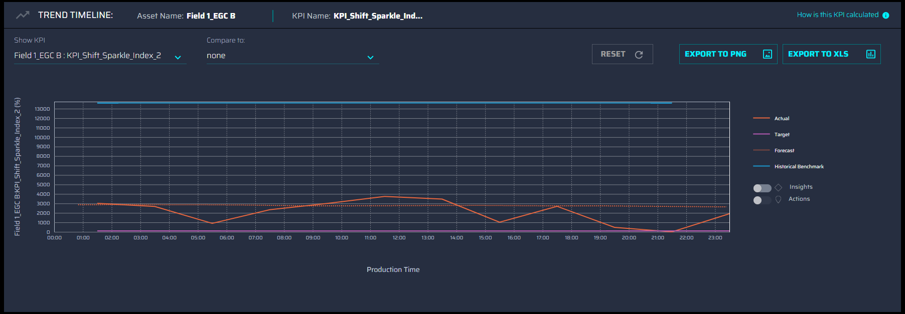

### 

## Asset Downtimes

-   For Non-OT KPIs, the user can visualize the Contributors as a bar chart or a pie chart based on the configuration.

-   The charts are visualized based on the asset downtime reason and duration.

-   The screenshot below shows an example of a bar chart, where the X-axis represents downtime reasons, and the Y-axis represents the cumulative duration.

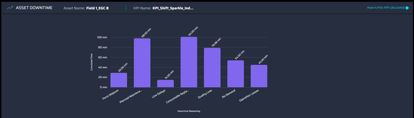

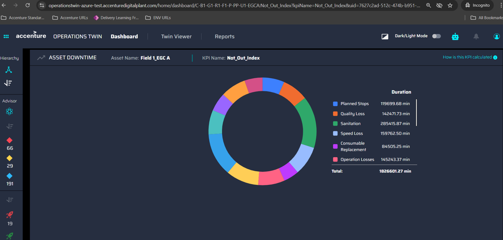

## Calendar and Trend Timelines

Smart KPIs display and plot trend timeline graphs based on any timeframe selected from the Date picker. For example, when selecting *OCT* from the Month(s) period in the Date picker, the trend timeline graph is plotted with the X-axis populated with 30 days of the selected month as shown below.

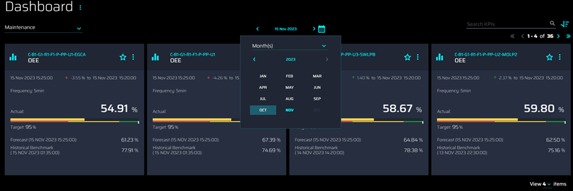

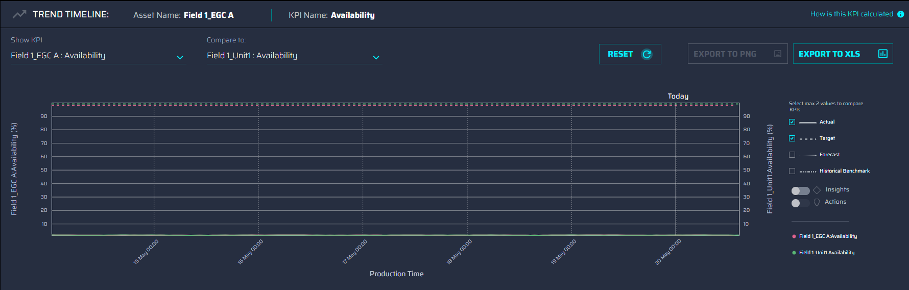

## 

## Date Picker

The Smart KPIs date picker supports eight different date and time ranges to select from:

-   Hours

-   Days

-   Weeks

-   Months

-   Quarters

-   Half-year

-   Years

-   Custom

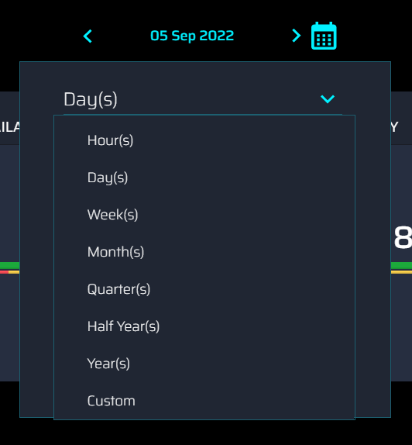

#### 

### Hours Selection 

The hour picker allows the IAI user to select from an hour range from a list of hours that appears beside the date picker popup.

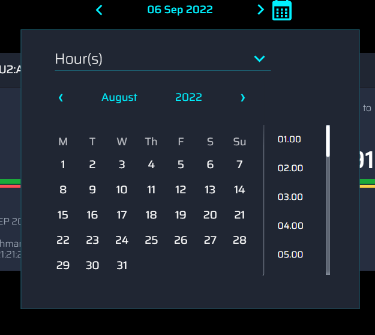

#### 

### Day Selection

The day picker allows the selection of a particular day.

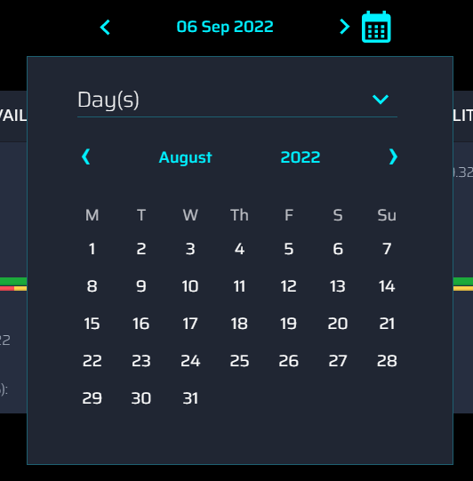

####  Week Selection

The week picker enables the selection of an entire week at a time.

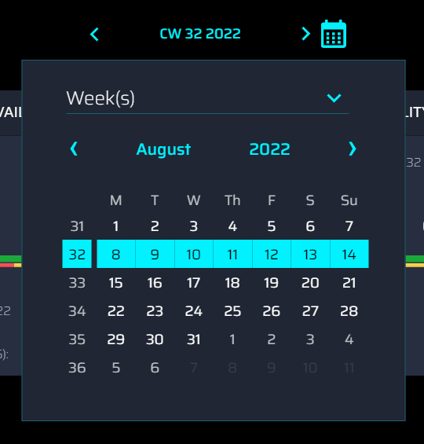

####  Month Selection

The month picker allows the selection of a particular month.

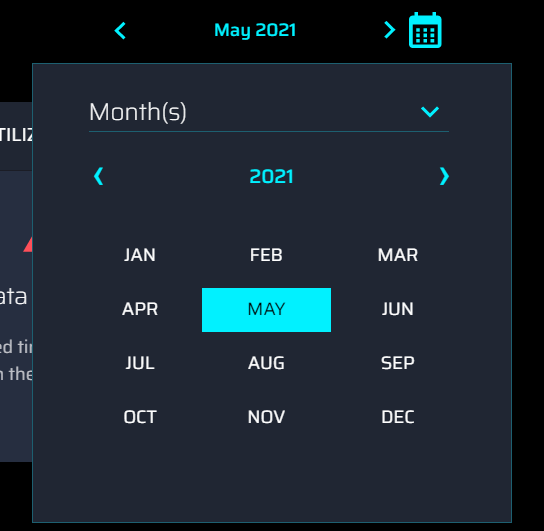

#### 

### Quarter selection

The quarter picker allows the selection of an entire quarter at a time. Example: Q1 -- Jan, Feb, Mar.

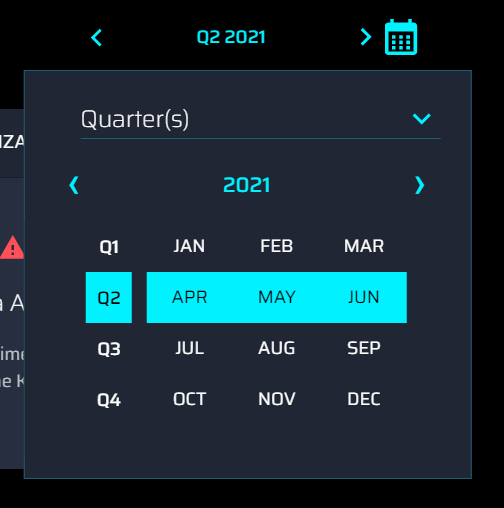

#### Half Year Selection

The half-year picker allows the selection of half a year at a time.

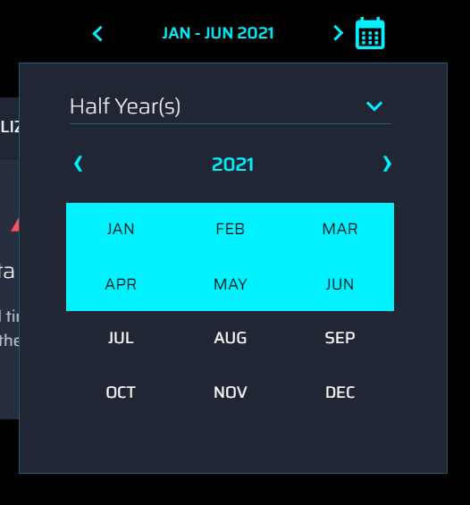

#### Year Selection

The year picker allows the selection of a year from a range of 16 years ending at the current year.

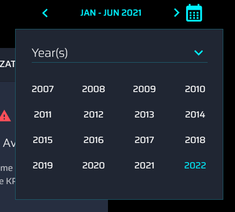

#### 

### 

#### Custom Range selection

The custom range picker allows the selection of a custom range from a range of 16 years ending at the current year.

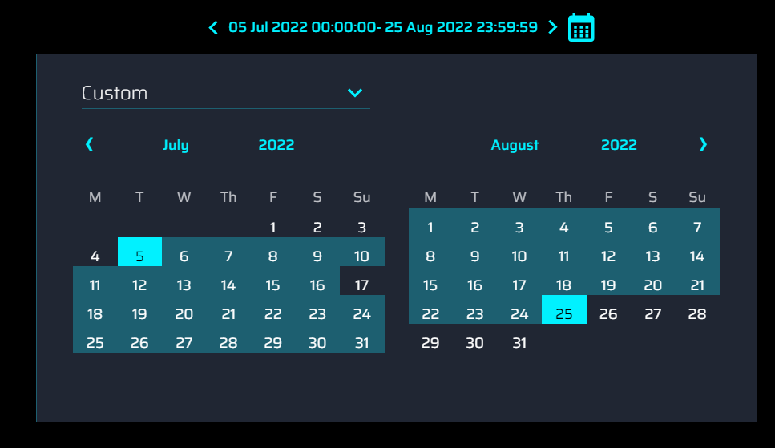

## 

# Pagination and Auto-refresh

The number of KPIs loaded per page on the dashboard is selectable via the page size dropdown. Lazy loading will load the KPIs in batches of 4, 8, 12, 16, or 20, depending on the selection.

The video on the side demonstrates the pagination and KPIs loading.

On the dashboard, the KPI tiles are auto-refreshed based on the calculation frequency configured and thus display the latest data available for the KPI.

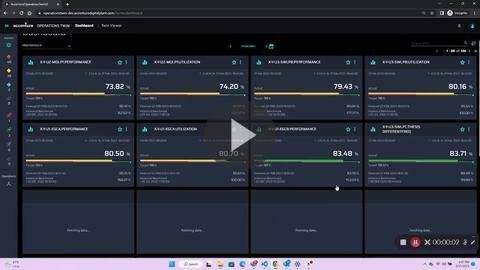

The following images depict how a KPI tile auto-refreshes. A message \'fetching data\' is displayed while the latest data for the KPI tile is fetched.

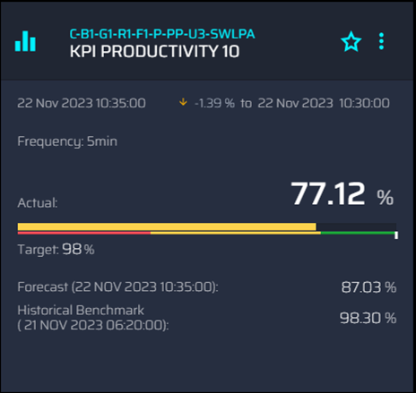

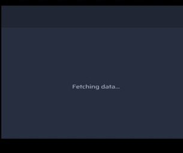

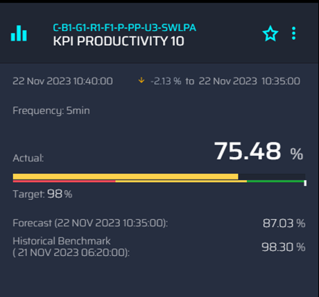

The data auto-updates when CDF functions execute (perform KPI computations). If the KPI computations fail, then the data is not fetched, and the auto-refresh fails. An error message is shown in this scenario.

## 

# KPI Details on Intelligent Advisor 

Smart KPIs application allows drill down to an Intelligent Advisor (IA) Insight and viewing of the details of the KPI from which the Insight was generated. Contributing and influencing KPIs and Trend Timelines may also be viewed. The IAI user can also:

-   Drill down into the KPI details by clicking on the KPI tile in the Insight details screen.

-   Drill down on all the existing hierarchy of the KPI, e.g., the drill down starts from the unit level, or plant level, depending on which level that insight was triggered on.

-   View the calculation frequencies of the drilled-into KPI and its contributing/influencing KPIs.

-   View the Historical benchmark and Forecast values of all the KPIs on the drilldown page.

-   View all the details of the parameters (Actual, Target, Forecast, Historical Benchmark, Aggregated Value), if they are present on the drilldown page.

To see a demonstration, play the video on the side.

Technical details about event-based communication can be found in the KPI Hierarchy and Calculation Technical Overview [here](https://industryxdevhub.accenture.com/assetdetails/42).

\
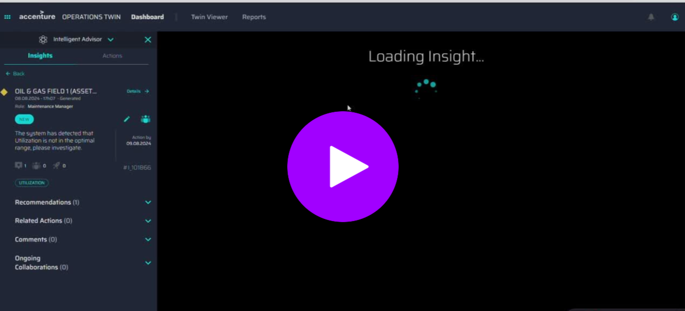

## 

# KPI Details on Operations Hierarchy

As shown in the screenshot below, KPIs for an asset selected in the Operations Hierarchy pane are displayed in the main pane.

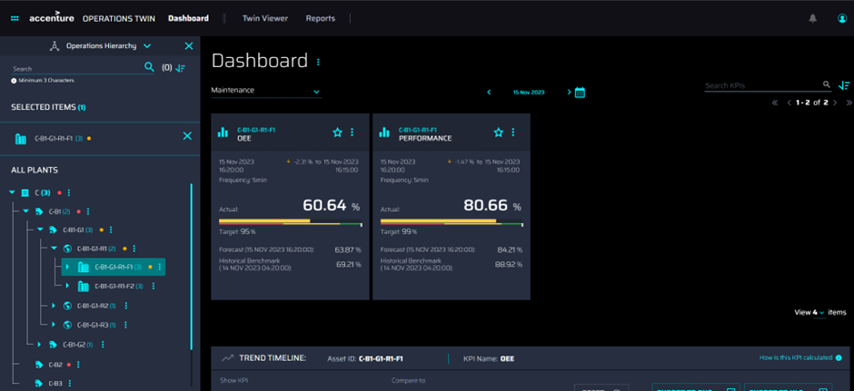

If an asset has been selected in the OH, the UI will filter all the departments present for that Asset and sort them alphabetically.

-   If there are KPIs configured for the already selected department and the selected asset, the same department will remain selected, and the KPIs corresponding to that department will be displayed.

-   If there are no KPIs configured for the previously selected department and the selected asset, but there are KPIs configured for other departments, the first department in the sorted department list will be selected, and the previously selected department will be removed from the list. The following video depicts this.

> 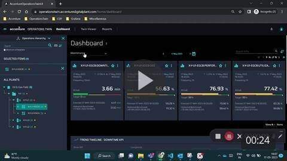
The IAI user must have the appropriate access and meet the sensitivity requirements to view the KPIs. If no KPIs match the IAI user\'s role, then an error will be displayed as shown in the screenshot on the right.

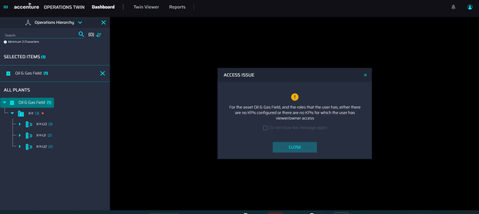

As shown below, drilling down into an asset that has a configured KPI displays the KPI detail of the selected asset.

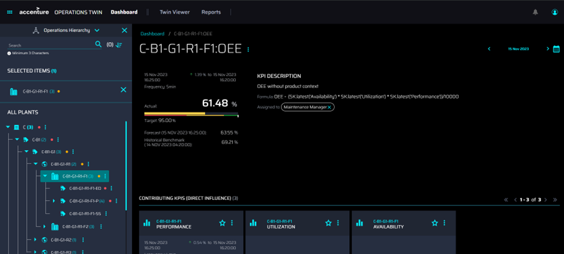

## Digital Twin Assistant

In Azure deployments, clicking the robot icon in the ribbon launches an AI-powered assistant within IAI that enables interaction with real-time and historical operational data using natural language. It simplifies access to structured and unstructured data, providing contextual insights, KPIs, actions, and root-cause analysis to support faster and smarter decision-making across assets, roles, and plants.

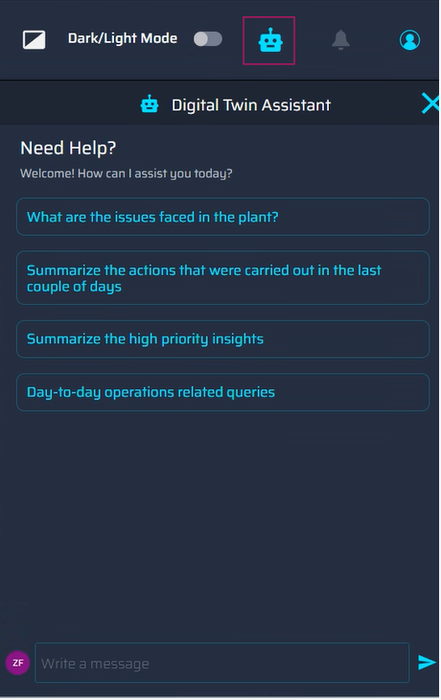

## Troubleshooting 

The following table lists errors encountered in the UI and the course of action to resolve them.

| **Problem / Error Message** | **Resolution** |
| --- | --- |
| KPI Not Configured | Check that the parent KPI has been configured. |
| Access Issue | Contact the admin to get the required access. |
| You\'ve reached the end of the KPI hierarchy. | No further drilldown is possible. |
| Further drilldown disabled due to access restrictions. | Contact the admin to get the required access. |
| Inadequate access to view the KPI details. | Contact the admin to get the required access. |
| Parameters are not visible after a calendar selection has been made. | Select the parameter in the trend timeline drop-down to view its data for the selected timeframe. |
| The dashboard does not display properly. | Set the resolution of the browser to 1440 or 1920. |
