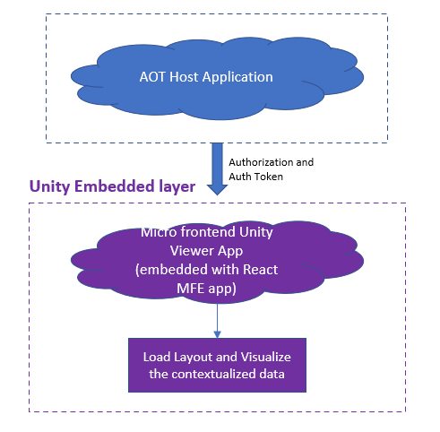
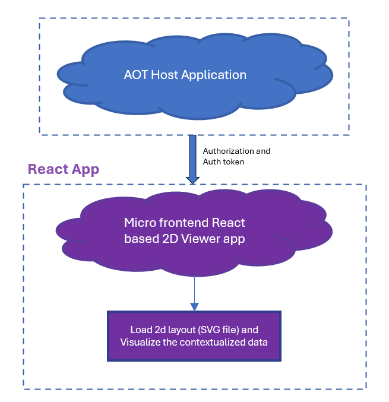

Industrial AI Foundation

Twin Builder and Twin Viewer

ARCHITECTURE BLUEPRINT

Release Version: 2.5

**Metadata Table**

| **Field** | **Value** |
| --- | --- |
| **Asset / Solution Name** | Industrial AI Foundation / Twin Builder and Viewer |
| **Domain / Area** | Digital Twin / Visual monitoring and alerts |
| **Owner (Team/Person)** | Tournier, Florian |
| **Reviewers** | Susarla, Aditya, Rane, Chetankumar |
| **Status** | Draft / In Progress |
| **Confidentiality** | Internal / Confidential |
| **Source of Truth** | [Summary - Overview](https://dev.azure.com/DigitalPlantProject/Marilyn%20V) **Related Assets / Alternatives** |
| # | \{#section .TOC-Heading\} |

## Introduction

Industrial AI Foundation (IAI) is a collection of software accelerators and tools that can be assembled to deliver client solutions based on Operations Twin. Operations Twin accelerates the integration of product, process, and live data from disparate IT and OT systems, creating a comprehensive and contextualized view of operations to enable better decisions and optimized processes.

-   The Builder application allows an admin user to create a dynamic 3D floor layout using a click-and-drop mechanism through a web-based user interface.

-   The Viewer helps in visualizing the 3D visuals created through the Twin Builder Application. The visualization is augmented with the information that resides in Cognite Data Fusion.

### Purpose

The purpose of this document is to provide an architectural overview of the technology that powers IAI\'s Twin Builder and Twin Viewer applications. The document includes diagrams and code samples to augment the reader\'s understanding of the applications.

### Target Audience

-   Business Analyst

-   Client IT Admins

-   Accenture teams deploying IAI

###  Contact

-   [florian.tournier@accenture.com](mailto:florian.tournier@accenture.com)

-   [rishabh.b.joshi@accenture.com](mailto:rishabh.b.joshi@accenture.com)

-   [chetankumar.rane@accenture.com](mailto:chetankumar.rane@accenture.com)

### Related Links

-   [IAI Twin Viewer and Builder Resources](https://industryxdevhub.accenture.com/assetdetails/47)

-   [IAI IX Developer Hub Resources](https://industryxdevhub.accenture.com/asset-home;search_text=aot)

-   [IAI Release Notes](https://industryxdevhub.accenture.com/assetdetails/45)

### Authentication 

Authentication for the 3D Twin Builder app uses Azure Active Directory, generating an MSAL token for user login. The Builder app is accessible via the main app or as a standalone application, which either shows a sign-in screen or redirects to the home page if the user is already logged in.

When accessing the Twin Viewer, Azure AD authenticates the app, retrieves the MSAL token from local storage, and passes it from React to Unity\'s embedded application. This ensures the access token is available for both Unity and data retrieval across platforms. For example, one access token can be used to fetch:

-   3D models from the 3DCE model API

-   Plant layouts from the 3DCE PlantLayout API

-   Contextualized data from CDF, such as time series and insights

### Glossary

| Term | Definition |
| --- | --- |
| Asset Hierarchy | The structured organization of assets within the Cognite Data Framework (CDF), which can be mapped to 3D models. |
| CDF (Cognite Data Framework) | A data platform used for integrating and managing asset data, referenced in the Mapper feature for model and asset hierarchy mapping. |
| Model -- 3D CMS | A page within the Twin Builder application where users can upload, create, edit, delete, or view 3D models required for asset mapping and layout creation. |
| Mapper (Model Mapping and POI Mapping) | A feature in the Twin Builder app that enables users to link 3D models to the asset hierarchy (Model Mapping) and associate Points of Interest (POI Mapping) with the models. |
| POI (Point of Interest) Editor | A tool within Twin Builder that allows users to add and manage specific points of interest on a 3D model. |
## 

# Twin Builder Unity Application

Twin Builder is an independent React-based Application with the following main features:

**Model -- 3D CMS**: The Model page enables users to upload new models essential for Asset mapping and Layout Creation. Users have the ability to create, edit, delete, and view models using this page.

**POI Editor**: The Point of Interest (POI) Editor allows users to add points of interest to the models that are available within the application.

**Mapper**: The Mapper provides functionalities for both Model Mapping and POI Mapping through dedicated applications. The Model Mapping app establishes a relationship between the 3D Model and the Asset Hierarchy from the Cognite Data Framework (CDF). The POI Mapping app enables users to map and edit POIs that have been added using the POI Editor.

**Plant Layout**: The Plant Layout app offers several capabilities, including:

-   Creating new layouts

-   Loading and modifying existing layouts

-   Saving layouts

-   Adding connections between two assets within the layout

-   Adding sensors inside the existing 3D assets

-   Navigating within the 3D asset

There are two user roles: Admins and non-Admins. Admins have permissions to create, modify, or save layouts, whereas non-Admins are limited to viewing the layouts.\
![Diagram of Twin Builder Unity App Architecture includes a flowchart showing a multi-layered application system with ReactJS and Unity Embedded layers. The ReactJS layer includes a Builder Independent App deployed on a server, which provides authorization and an auth token to the Unity Embedded layer. The Unity Embedded layer contains a Micro frontend Unity Builder App and checks if the user role is admin. If yes, access is granted to the Asset Mapping &amp; Builder app; if no, access is restricted.](./media/IAI_Twin_Builder_and_Twin_Viewer_Architecture_Blueprint/image1.png)

### 

## Guidelines

There are certain guidelines to be followed for uploading the model and for the mapping process.

#### Model Upload

The models used in this app must be created using one and only one parent node component hierarchy. Models without a parent node are not accepted.

####  Mapping

The user must follow the below steps to map the new model:

-   Use the model mapping to map the asset\'s root node

-   Use the POI Mapping to add POIs in level 2

The user must map the base node manually while mapping the new model and should avoid adding POIs on level 1.

## 

# Twin Viewer Unity Application

The Twin Viewer application enables the user to view the 3D layouts and models that are created with the Twin Builder application. It is an immersive 3D environment where end users can monitor, diagnose, and analyze operational data in the visual context of 3D models. The Twin Viewer empowers organizations to enrich existing 3D models with browser-based visualizations powered by IAI data, without the need for 3D expertise. Features include:

-   3D Layout of the factory

-   Augmentation of contextualized data

-   360-degree view by orbiting the 3D Model and zooming in/out to see the 3D Model.

-   3D Model Drill-down functionality with specific data.

-   Navigate to other IAI components (IA/KPI) via a single click.

The diagram on the right shows the Twin Viewer Unity App architecture.

Note that if deployed on AWS, the signed URL is needed to load the images and model (.GLB file) from the s3 bucket.

### 2D Schematic Viewer 

The 2D Schematic Viewer application may be used to visualize layouts in 2D using SVG files that have been configured using the 2D Twin Configurator. Note that if deployed on AWS, the signed URL is needed to load the images and model (.GLB file) from the s3 bucket.

The 2D Viewer application supports:

-   2D Schematic Layout of the factory

-   Augmentation of contextualized data

-   Multilevel 2D visualization by attaching SVG files

-   Attachment of multipage PDF document to element level in SVG file

-   Attachment of static image to UI element in SVG file

### 

## IA and Twin Viewer Communication 

While loading the 3D layouts in Twin Viewer, insights, actions, and the KPI count are displayed. To view the details, two-way communication is required between the Twin Viewer component and other components of the IAI application.

The diagram shows the two-way communication process between Intelligent Advisor and the Twin Viewer app.

1.  Launching any layout/model of the Twin Viewer reveals the insights/actions count on the models.

2.  To view the details of each insight/action, navigate to the specific insight/action page on the intelligent advisor.

3.  Clicking on insight/action count will raise an event from the Unity Layer to the ReactJS Layer of the Twin Viewer application.

4.  ReactJS Layer passes this event to other micro-frontend apps.

5.  Finally, the Intelligent Advisor app subscribes to the event raised by the Twin Viewer app and displays the details about insights/actions on its user interface.

### 

## OH and Twin Viewer Communication

The diagram shows the two-way communication process between the Operations Hierarchy component and the Twin Viewer app.

![Flowchart showing interactions between Unity Visualizer app, AOT Main App, Operation Hierarchy (OH) app, and MFE Unity Visualizer app. The Unity Visualizer app follows five steps: loading the default layout, selecting assets and syncing with OH app, closing detail panels, navigating to Twin Viewer, and highlighting assets via OH events. The AOT Main App sends events to both Unity Visualizer and OH apps, while the MFE Unity Visualizer app parses OH events. Arrows indicate event-driven communication across components to manage asset visualization and hierarchy.](./media/IAI_Twin_Builder_and_Twin_Viewer_Architecture_Blueprint/image5.png)

1.  When launching any layout of the Twin Viewer, if the user selects the model detailed view, then the selected model node will be passed to OH through the event.

2.  After a node is selected on OH, the data will be displayed on the Dashboard and IA application as per the selected node.

3.  If the selected node is removed from OH, the selected model detail view will get closed in the Twin Viewer via an event invoked by the OH application.

4.  The user selects an OH node and navigates to the Twin Viewer application.

5.  In Twin Viewer, the user will be directly rerouted to the selected OH node and the models will be highlighted.

### Smart KPI and Twin Viewer Communication 

The diagram shows the two-way communication process between the Smart KPI component and the Twin Viewer app.

![Flowchart showing interaction between Unity Visualizer App, AOT Main App, and Smart KPI/Dashboard App. The Unity Visualizer App loads a default layout using an AOT token, displays KPI counts on 3D models, and allows users to click popups for detailed insights, actions, and KPI data. Clicking KPI details triggers navigation to the Dashboard App. The AOT Main App sends events to other micro frontend apps, enabling the Smart KPI App to load drilldown pages based on those events. Arrows indicate data flow across components.](./media/IAI_Twin_Builder_and_Twin_Viewer_Architecture_Blueprint/image6.png)

1.  Launching any layout/model of the Twin Viewer reveals the KPI count on the models.

2.  To view the details of each KPI, navigate to the specific KPI drill-down page of the Dashboard.

3.  Clicking on the KPI count loads the KPI details page.

4.  From the details page, the Unity Layer raises an event for the ReactJS Layer of the Twin Viewer application.

5.  The ReactJS Layer passes this event to other micro-frontend apps.

6.  Finally, the SmartKPI/Dashboard app subscribes to the event raised by the Twin Viewer app and displays the details of the specific KPI on its user interface.

### 

## 3DCE Couple/Decouple Approach

The Couple/Decouple variable is defined in IAI\'s Environment variable. Using this variable, the middleware API calls the couple or decouple API, that is either the 3DCE API or IAI API.

1.  Unity apps (Twin Viewer, POI Editor, Mapper, and Plant Layout) and the React-based Model Management Page send a request to fetch the model list via the Middleware API.

2.  The Middleware API reads the environment variable and calls the couple/decouple API.

3.  The Middleware API sends the response with the list of models back to the Unity app/Model page.
