

Digital Thread Foundations

Azure Data Factory

INTEGRATION GUIDE

Release Version 1.2

Metadata Table

| **Field** | **Value** |
| --- | --- |
| **Asset / Solution Name** | Digital Thread |
| **Domain / Area** | Engineering |
| **Owner (Team/Person)** | Karthik Ramachandra |
| **Reviewers** | Karthik Ramachandra |
| **Status** | Approved / Complete |
| **Confidentiality** | Internal / Confidential |
| **Source of Truth** | [link](https://dev.azure.com/IXAssets/IXAssetsProject/\_git/ixassets) |
| **Related Assets / Alternatives** | AOT / Engineering Orchestration / Engineering Agents |

## Introduction

A digital thread refers to the continuous and consistent flow of information throughout the entire lifecycle of a product or system -- from design and development to operation and maintenance. It enables the integration of data from different stages and sources, allowing effective traceability, seamless collaboration, and efficient decision-making by unleashing the power of sleeping data. The digital thread is considered a key aspect of Industry 4.0 and the digital transformation of the manufacturing industry. It is the core of what we call the Enterprise Operating System EOS.

Digital Thread is a communication framework that helps integrate various enterprise systems involved in the engineering Azure Data Factory ADF is a cloud-based data integration service provided by Microsoft Azure. It serves as a robust platform for orchestrating and automating data workflows, enabling organizations to efficiently ingest, transform, and load data from diverse sources to various destinations. ADF empowers users to create, manage, and monitor data pipelines seamlessly, facilitating the integration of disparate data sources into meaningful insights for analytics, reporting, and decision-making processes.

### Purpose

This guide describes the key components and functions of Azure Data Factory. The documentation focuses on enabling users to effectively utilize ADF for data integration, transformation, and orchestration within the project\'s ecosystem.

###  Target Audience

-   Software Architects

-   Developers

-   Integrators with IT Background

### Technology Stack

-   Azure Data Factory

-   Postgres SQL Database

### Prerequisites

-   Access to [ix-dev-adf](https://portal.azure.com/#@ACP202552.onmicrosoft.com/resource/subscriptions/4abb1610-04fc-4c33-a644-913cdab11195/resourceGroups/ix-dev-dtspokerg/providers/Microsoft.DataFactory/factories/ix-dev-adf) in the ixdtc directory

-   Developers need relevant access like reader, contributor or custom roles.

-   This access can be obtained by contacting the infrastructure team.

### Business Contacts

-   [florian.tournier@accenture.com](mailto:florian.tournier@accenture.com)

-   [laura.mosconi@accenture.com](mailto:laura.mosconi@accenture.com)

-   [karthik.ramachandra@accenture.com](mailto:karthik.ramachandra@accenture.com)

### Technical Contacts

-   [laura.mosconi@accenture.com](mailto:laura.mosconi@accenture.com)

-   [stefano.giacco@accenture.com](mailto:stefano.giacco@accenture.com)

-   [florian.tournier@accenture.com](mailto:florian.tournier@accenture.com)

### Related Links

-   [Digital Thread Foundations Documentation](https://industryxdevhub.accenture.com/asset-home;search_text=ix%20digital%20thread)

## Key Components

### 

## Pipelines

Pipelines in Azure Data Factory represent workflows that orchestrate the movement and transformation of data from source to destination. They are composed of activities that define specific tasks such as data ingestion, transformation, and loading.

### Activities

Activities are the building blocks of pipelines, representing individual tasks within a workflow. There are different types of activities in ADF, such as data movement activities e.g., Copy Activity, data transformation activities e.g., Data Flow, control flow activities e.g., Execute Pipeline, and data processing activities e.g., Stored Procedure.

### Datasets

Datasets define the structure and location of data used as inputs or outputs by activities within a pipeline. It represents the data source or sink and includes information such as connection details, file format, schema, and partitioning scheme. Datasets can be structured, semi-structured, or unstructured data stored in various types of storage systems.

### Linked Services

Linked services establish connections to external data sources or destinations utilized by activities within pipelines. They encapsulate connection strings, authentication credentials, and other configuration settings required to access data stores.

###  Triggers

A trigger is a mechanism that initiates the execution of a pipeline based on predefined conditions or schedules. There are different types of triggers in ADF, including schedule triggers e.g., recurring schedules based on time intervals, specified either through fixed schedules or using specific time increments, event triggers e.g., triggering a pipeline based on data arrival in a specified location, and tumbling window triggers e.g., triggering a pipeline at regular intervals based on a time window.

### Data Flows

Data flows provide a visual interface for designing data transformation logic within pipelines. They enable users to construct complex data transformation workflows using a drag-and-drop interface, facilitating code-free data wrangling and cleansing operations.

### Integration Runtimes

Integration runtimes serve as the execution environment for activities within pipelines. They determine where data processing occurs, providing scalability, flexibility, and resilience to accommodate diverse data integration scenarios. Integration runtimes can be auto-resolved by Azure Data Factory Azure IR or self-hosted in an on-premises environment Self-hosted IR.

## Pipelines

This section focuses on the purpose and execution of each Azure Data Factory pipeline within the Digital Thread project. These pipelines efficiently orchestrate data movement and transformation from source to destination. The discussion includes their core objectives and execution methods, including triggering mechanisms.

### PL_DataExtractFromTCConnector

This pipeline, named *PL_DataExtractFromTCConnector*, is designed to extract data from Teamcenter using a connector. Its primary purpose is to facilitate the retrieval of data from Teamcenter, enabling seamless integration and data exchange between Teamcenter and other systems or services within the Azure Data Factory environment.

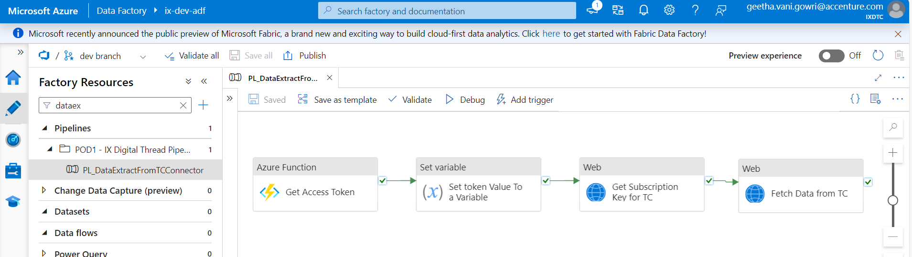

It involves the following activities to authenticate with Teamcenter, obtain necessary credentials, and fetch the desired data.

#### Azure Function Get Access token

This activity initiates an Azure Function named UserAuthRopc to obtain an access token essential for authenticating requests sent to the Teamcenter TC system. The function operates through a linked service, with parameters passed using global parameters. The Python code within the function dynamically generates the access token required for authorization purposes, ensuring secure communication between the pipeline and TC.

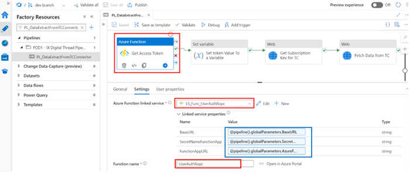

####  Set Variable 

After acquiring the access token from the Azure Function, this activity stores its value in a variable named Access_token_value for subsequent use. This token, crucial for authenticating with Teamcenter TC, ensures secure interactions between the pipeline and TC services.

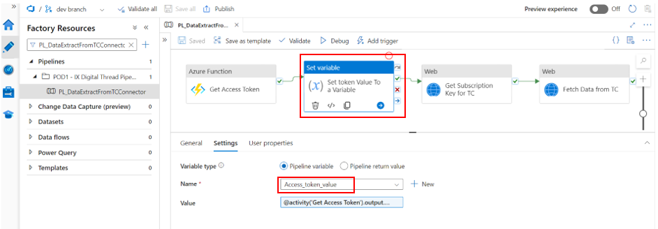

#### 

### Web Get Subscription Key for TC 

In this activity, the pipeline retrieves the subscription key associated with the Teamcenter product policies. The subscription key is essential for accessing Teamcenter services securely. The value for the subscription key is fetched from global parameters, where the secret name is used to retrieve the value from Azure Key Vault. This ensures that sensitive information such as keys and secrets is securely managed.

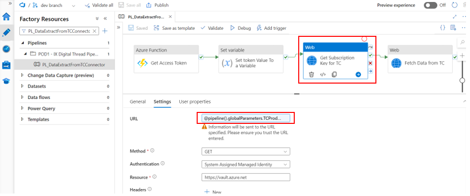

####  Web Fetch Data from TC 

This activity utilizes the acquired access token and subscription key as headers, crucial for authentication and authorization, to initiate a web request for fetching the desired data from Teamcenter. The input parameters necessary for data retrieval are combined into a URL using an expression. This allows for specific data retrieval based on the provided parameters.

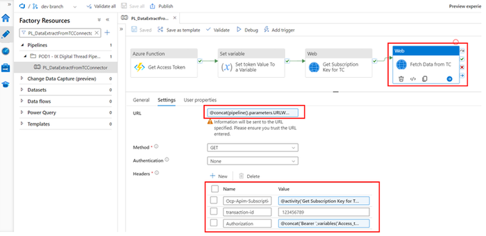

#### 

### 

#### Input Parameters

This pipeline accepts three parameters:

| **Parameter** | **Description** |
| --- | --- |
| CreatedBefore | This parameter specifies the date before which data should be extracted from Teamcenter. Users are required to input the date in the format DD-MMM-YYYY Eg 27-JUN-2023, here DD represents Date, MMM represents first 3 letters of Month, YYYY represents year |
| CreatedAfter | This parameter specifies the date after which data should be extracted from Teamcenter. Similar to the Created Before parameter, users must input the date in the specified format. |
| URLWithObjectType | This parameter specifies the URL containing the object type information for data extraction. Users are instructed not to provide comma-separated object types within the same URL. These parameters provide flexibility and customization options for specifying the time range of data extraction as well as the URL containing the object type information from Teamcenter. For example, the URL format for extracting Dtt5_RotatngPart objects could be as follows: https//ix-dev-apimgmt.azure-api.net/teamcenterapi/items/bulkDataProcessing?objectType=Dtt5_RotatngPart Similarly, replace the object type Dtt5_RotatngPart with other available object types for extraction such as Dtt5_Sealing, Dtt5_PwrTranPart, Dtt5_Lubricant, Dtt5_FastenerPrt, Dtt5_ElectriPart, Dtt5_EngMfgPart, and Dtt5_StandarPart, depending on the requirement. For example, if there is a need to extract Dtt5_FastenerPrt objects, simply replace the objectType=Dtt5_RotatngPart part of the URL with objectType=Dtt5_FastenerPrt as shown below: [https//ix-dev-apimgmt.azure-api.net/teamcenter-api/items/bulkDataProcessing?objectType=Dtt5_FastenerPrt](https://ix-dev-apimgmt.azure-api.net/teamcenter-api/items/bulkDataProcessing?objectType=Dtt5_FastenerPrt) It is important to note that multiple object types cannot be combined within the same URL. |
| ### | Triggering After configuring the parameters, users can trigger the pipeline. 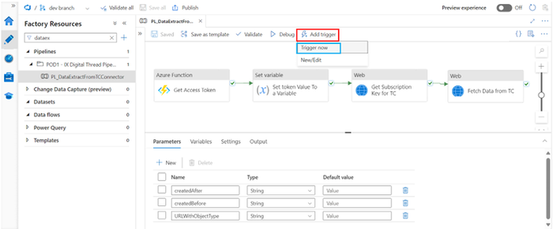
Upon triggering, the pipeline will initiate the data extraction process based on the specified parameters and URL. Users will be prompted to provide values for the parameters, including the dates for CreatedBefore and CreatedAfter, as well as the URL containing the object type information. 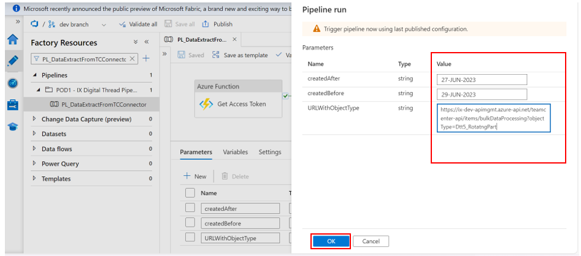
|  |

#### Monitoring

Users can check the status of the pipeline by navigating to the Monitor tab within Azure Data Factory ADF. If the pipeline execution is successful, users can proceed to view the output file in the designated location. However, if the pipeline execution fails, an error message will be displayed in the monitoring interface, providing users with immediate feedback on the failure.

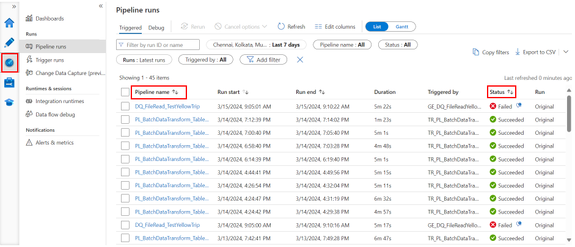

If the pipeline fails, a failure message will be displayed, providing insight into the cause of the failure as shown in the below snapshot.

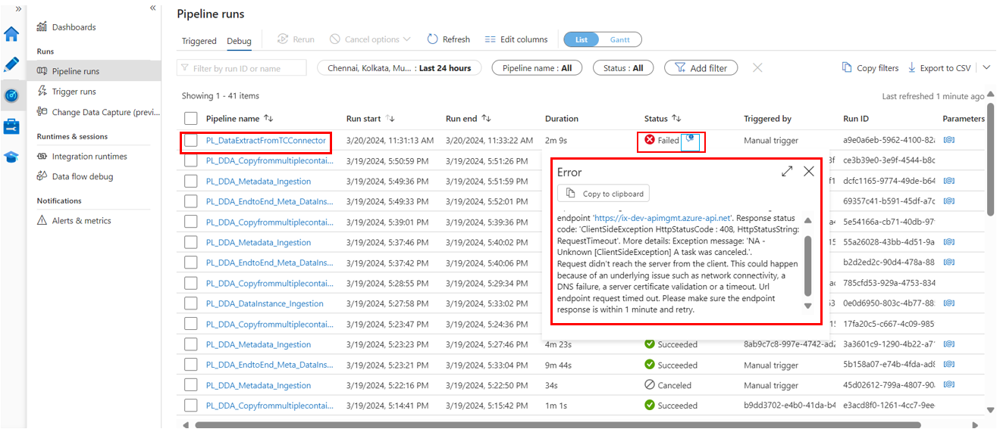

Upon successful execution, the pipeline retrieves data from Teamcenter based on the specified parameters. The extracted data is then saved as .csv files within the designated Azure Storage Account, named ix-dev storage, and stored in the container labelled batchprocess. Users can access these files for further analysis and processing.

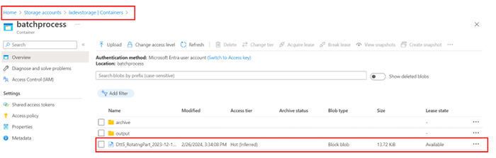

### PL_BatchDataTransform_TableLoad

Upon receiving a CSV file in the batchprocess container as a result of the PL_DataExtractFromTCConnector pipelines execution, a trigger associated with the pipeline automatically activates. This trigger then initiates the PL_BatchDataTransform_TableLoad pipeline, which processes and loads data extracted from Teamcenter into tables present in SQL database. It is tailored to handle CSV files generated by the PL_DataExtractFromTCConnector pipeline.

The image below illustrates the TR_PL_BatchDataTransform_TableLoad trigger associated with the pipeline, which is responsible for initiating the PL_BatchDataTransform_TableLoad pipeline.

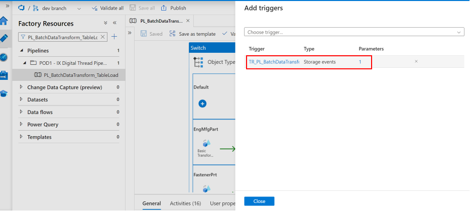

The switch case statement within the PL_BatchDataTransform_TableLoad pipeline serves as a decision-making mechanism to analyze the extracted object type from the incoming data file. It allows the pipeline to branch into different paths based on the specific object types CSV file. This switch case statement encompasses all eight object types, including Lubricant, Sealing, FastenerPrt, RotatngPart, PwrTranPart, ElectriPart, EngMfgPart, and StandarPart, along with a default type for handling any unexpected or unknown object types.

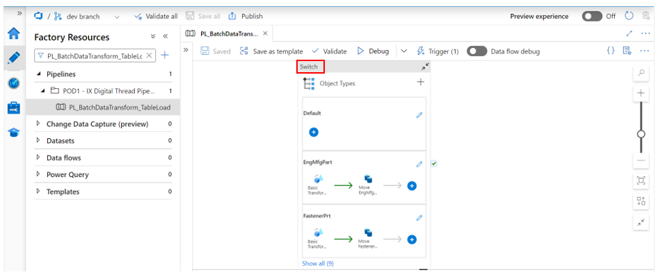

For example, when the ObjectType extracted from the CSV file upon completion of the PL_DataExtractFromTCConnector pipelines execution is RotatngPart, the switch case statement directs the pipeline to execute specific activities tailored for handling data related to RotatngPart.

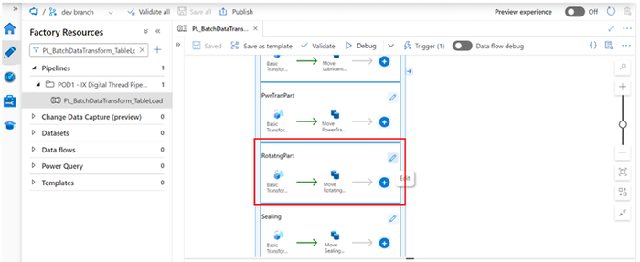

This RotatngPart object types pipeline encompasses two key activities a data flow activity and a copy data activity.

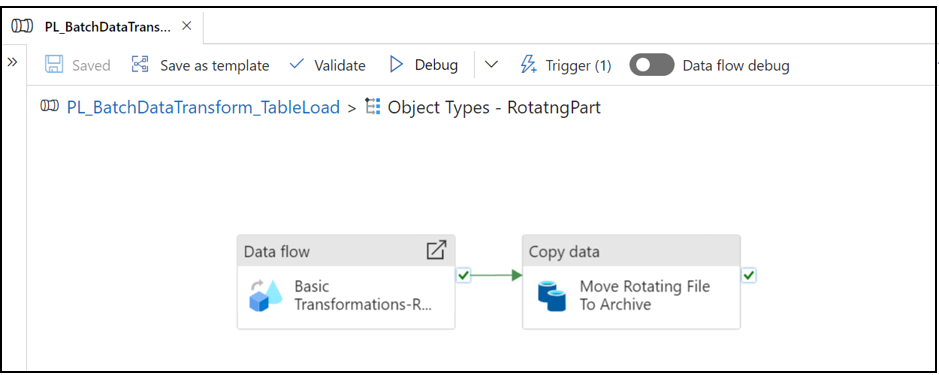

**Data Flow Activity**

This activity performs essential data transformations, such as removing duplicates, to ensure data quality. Subsequently, the transformed data is loaded into two designated tables within the SQL database -- ROTATNGPART_RAW for bulk data processing and ROTATINGPART for part classification.

##### Data Classification

The below screenshot shows the loaded data to ROTATINGPART which would be used for part classification.

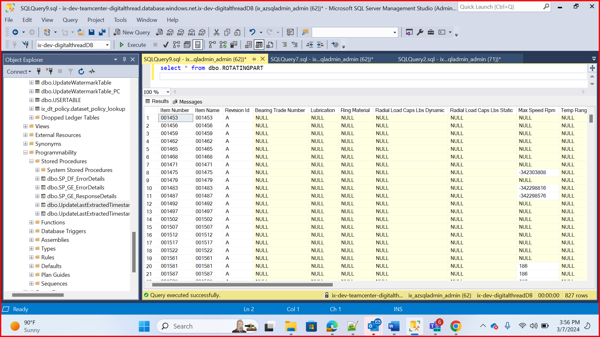

##### Data Processing

The below screenshot shows the loaded data to ROTATINGPART_RAW which would be used for bulk data processing.

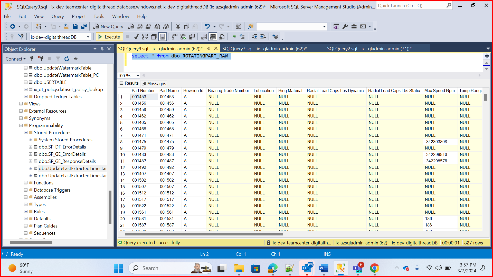

#### Copy Data Activity 

Following the data transformation process, the copy data activity initiates the movement of the CSV file from batchprocess container to the archive folder within the batchprocess container, facilitating proper data archival and storage management.

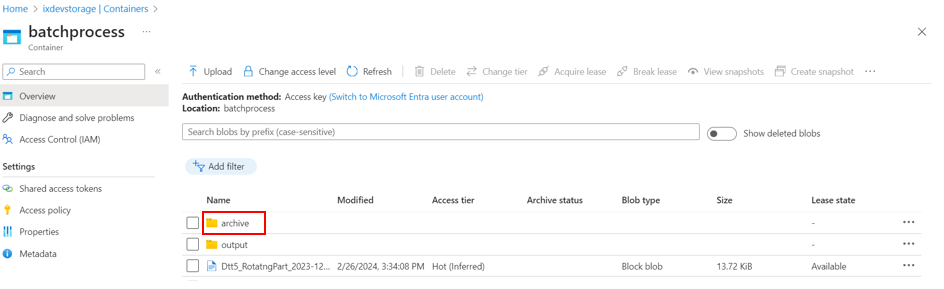

**\
Manual Triggering**

Users can manually trigger the PL_BatchDataTransform_TableLoad pipeline by specifying a file name parameter at the pipeline level. This parameter, named fName, enables users to indicate the name of the CSV file located in the batchprocess container that they intend to process.

By utilizing this parameter, users have the capability to manually initiate the pipeline and specify the precise file they want to process within the batchprocess container.

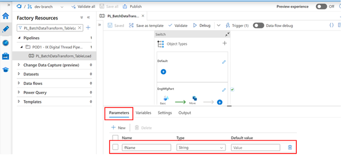

For instance, to process a CSV file containing Rotating part data, the file name associated with rotating parts (Dtt5_RotatngPart_2023-12-15_07-17-23.csv) must be specified in the fName parameters value.

The screenshot below shows the CSV file generated by PL_DataExtractFromTCConnector. For manual triggering, users would need this filename as the parameters value.

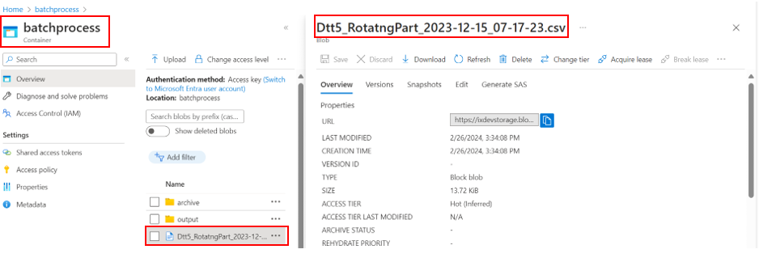

\
The screenshot below shows the input of parameter values, specifically the CSV file name.

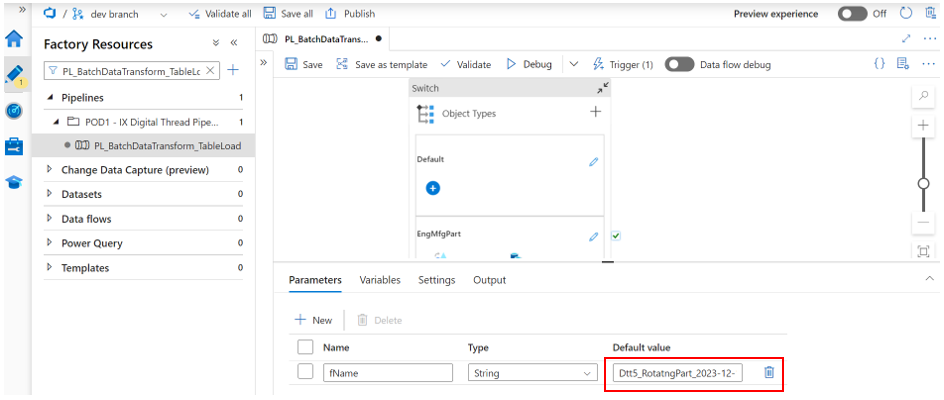

Similarly, within ADF, this process can be replicated for other object types encountered, ensuring efficient processing and archival of data across different sources.

### 

## PL_TCDataLoadToBLOB

#### Use Case Bulk Data Processing

After the completion of data transformation in the PL_BatchDataTransform_TableLoad pipeline, the next step involves manually triggering the PL_TCDataLoadToBLOB pipeline. This pipeline is responsible for creating a CSV file for the SQL table, ROTATINGPART_RAW and pushing it to Azure Blob Storage. Users need to specify the object type for which they intend to push data. Once this pipeline is executed it creates the .csv file in the Azure Blob storage which will trigger pipeline PL_BatchDataLoadToTCFileSystem automatically, which handles the process of pushing data to Teamcenter.

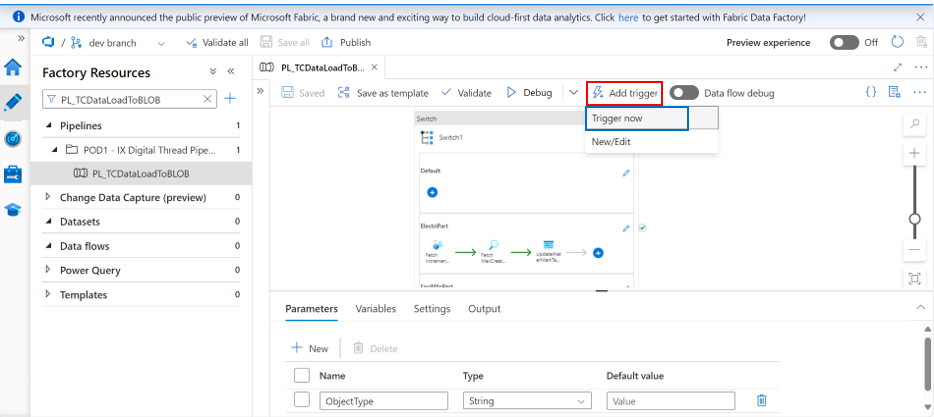

When triggering the pipeline, users need to enter the respective object type value in the ObjectType parameter. There is a total of eight object types, including Lubricant, Sealing, FastenerPrt, RotatngPart, PwrTranPart, ElectriPart, EngMfgPart, and StandarPart. For example, if the object type is RotatngPart, users must enter RotatngPart in the ObjectType parameter.

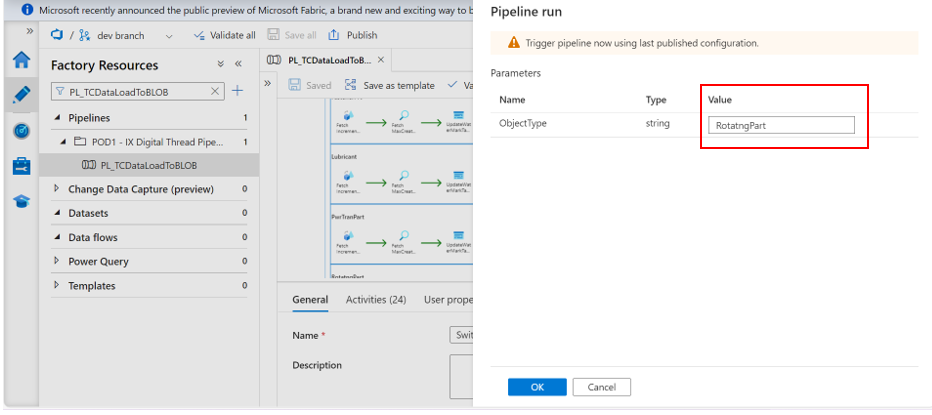

Upon manual initiation, the PL_TCDataLoadToBLOB pipeline navigates to a switch case statement based on the provided object type value. Each case in the switch statement represents a different object type, allowing the pipeline to execute specific activities tailored to each object type.

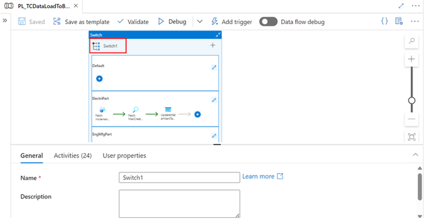

For instance, in this example focusing on RotatngPart, the pipeline will execute activities specific to RotatngPart object type.

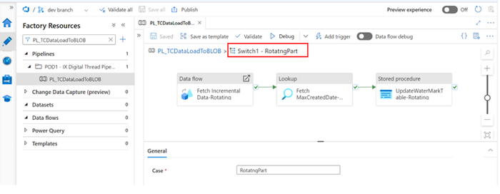

In the example centered on RotatngPart, the pipeline proceeds to execute activities uniquely designed for this object type. Prior to this pipeline\'s execution, data from the PL_BatchDataTransform_TableLoad pipeline is stored in SQL table named ROTATINGPART_RAW, which is designated for bulk data processing, and is utilized for further processing.

The below screenshots display the columns present in ROTATINGPART_RAW table.

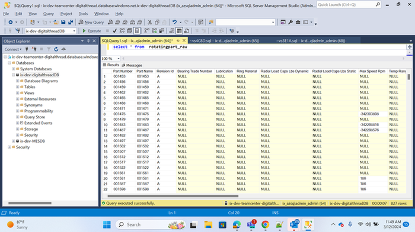

The below screenshot highlights the DateCreated Column.

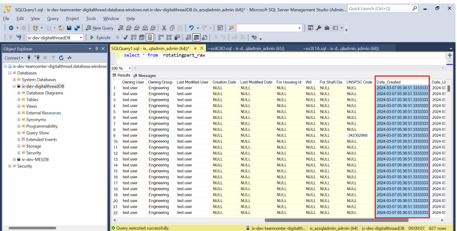

#### Data Flow Activity 

The Data Flow activity within the PL_TCDataLoadToBLOB pipeline plays a pivotal role in managing the data extraction, transformation, and storage processes. It begins by retrieving the maximum Date_Created value from the ROTATINGPART_RAW table and storing it in a Parquet file located at digitalthreadpod1/MaxDate/MaxDateRotating.parquet. This Parquet file serves as a reference point for determining the maximum Date_Created.

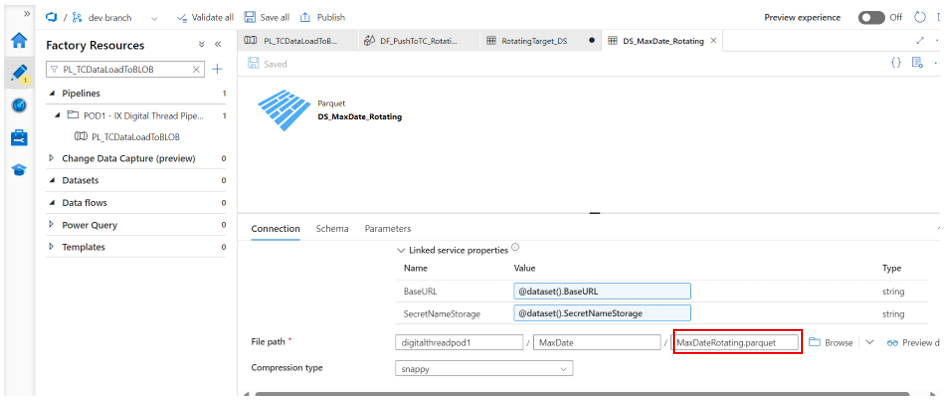

Following this, the activity conducts incremental data loading by selecting only the records with Date_Created greater than the LastExtractedTimeStamp from the UpdateWatermarkTable. These selected records represent the incremental updates or additions made to the ROTATINGPART_RAW table since the last extraction.

This incremental data loading is facilitated by the following SQL query

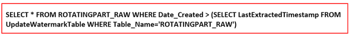

Once the incremental data selection is completed, the resulting dataset is exported to a CSV file. The filename is dynamically generated based on the current timestamp, ensuring uniqueness and clarity. For example, the CSV file path may appear as follows DFTC_RotatngPart_2024-03-12 13-53-02.csv. This CSV file is then stored in the blob storage container at the location digitalthreadpod1/PushToTC/, facilitating easy access and further processing of the data.

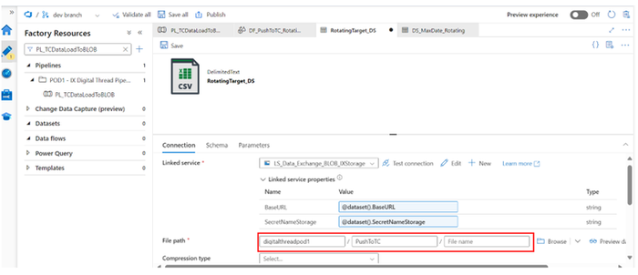

**\
**

#### LookUp Activity 

Following the data processing by the Data Flow activity, the Lookup activity is utilized to fetch the Parquet file containing the maximum Date_Created value. This Parquet file is stored in the specified location digitalthreadpod1/MaxDate/MaxDateRotating.parquet within the blob storage. The Lookup activity retrieves this maximum Date_Created value from the Parquet file, which is subsequently used in further data processing steps.

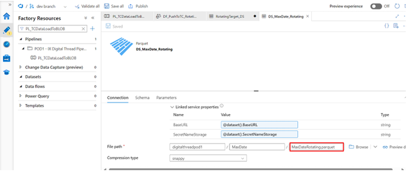

####  Stored Procedure Update Watermark Table 

The Stored Procedure activity within the PL_TCDataLoadToBLOB pipeline executes a predefined procedure designed to update the watermark table with the latest timestamp. This procedure is crucial for maintaining accurate tracking of data extraction timestamps and facilitating incremental data loading processes.

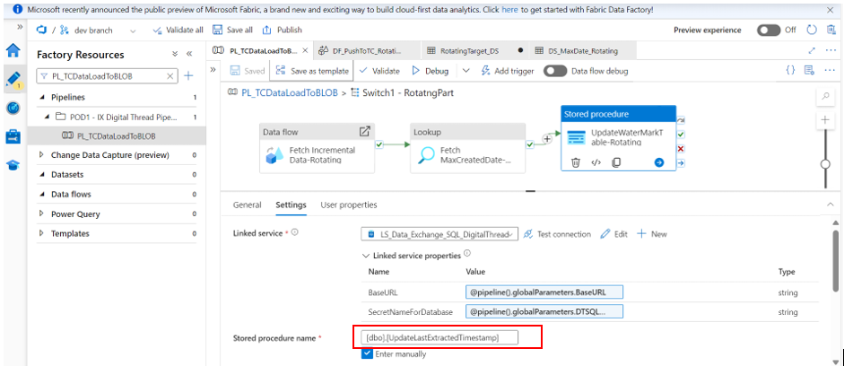

The stored procedure is responsible for updating the LastExtractedTimestamp column in the UpdateWatermarkTable, which serves as the watermark for subsequent pipeline executions. By updating this timestamp, the stored procedure ensures that the pipeline only focuses on processing data updates occurring after the last extraction timestamp, thereby optimizing data extraction efficiency.

The provided screenshot displays the contents of the UpdateWatermarkTable, which is a crucial component of the data loading pipeline.

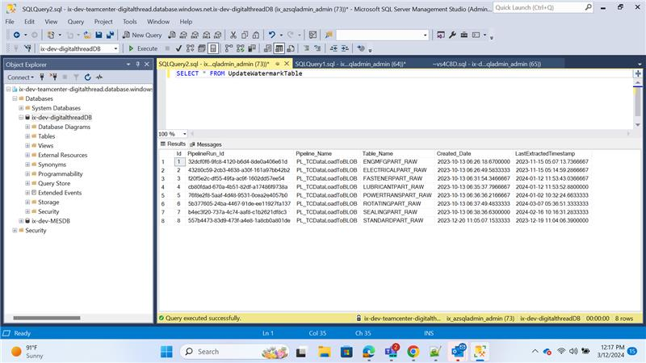

The table below lists the columns present in the UpdateWatermarkTable.

| **Column name** | **Description** |
| --- | --- |
| Id | This column appears to be a unique identifier for each record in the table. |
| PipelineRun_id | This column likely stores a reference ID associated with a specific execution run of the data loading pipeline PL_TCDataLoadToBLOB. |
| Pipeline_Name | This column contains the name of the data loading pipeline, which is consistently PL_TCDataLoadToBLOB across all rows. |
| Table_Name | This column indicates the name of the table from which data was extracted during the pipeline execution. These table names correspond to different object types within Teamcenter, such as ENGMFGPART_RAW or ROTATINGPART_RAW. |
| Created_Date | This column holds the timestamp representing the date and time when each record was created in the Teamcenter. |
| LastExtractedTimestamp | This crucial column stores the timestamp of the most recently processed data for the corresponding table object type identified in the Table Name column. This timestamp serves as a watermark for subsequent pipeline executions, ensuring that only data updates occurring after this timestamp are processed. The UpdateWatermarkTable plays a vital role in managing data extraction and incremental loading processes within the pipeline, ensuring accurate tracking of data extraction timestamps, and facilitating efficient data updates. |

### 

## PL_BatchDataLoadToTCFileSystem

#### 

### Use Case Bulk Data Processing

The PL_BatchDataLoadToTCFileSystem pipeline serves as a continuation of the data processing workflow initiated by the PL_TCDataLoadToBLOB pipeline. Once a CSV file is generated and stored in the blob storage by the preceding pipeline, the PL_BatchDataLoadToTCFileSystem pipeline is automatically triggered. Its primary function is to facilitate the transfer of the generated CSV file from the blob storage to the Teamcenter file system.

The image below shows the TR_PL_BatchDataLoadToTCFileSystem trigger associated with the pipeline, responsible for initiating the PL_BatchDataLoadToTCFileSystem pipeline.

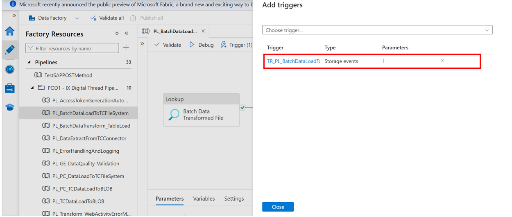

To accomplish this, the pipeline employs a Lookup activity to check for the existence of the CSV file within the blob storage. Once the Lookup activity confirms the presence of the file, the pipeline proceeds with the file transfer process.

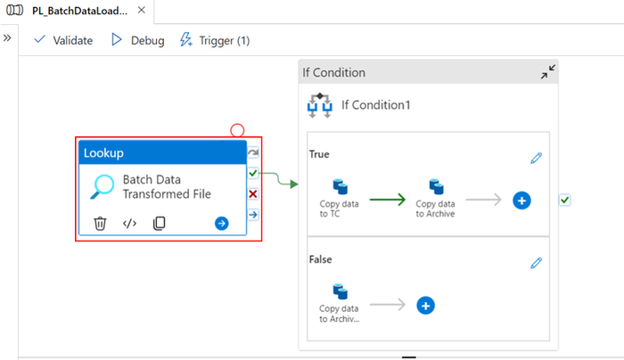

The PL_BatchDataLoadToTCFileSystem pipeline incorporates a conditional branching mechanism to handle different scenarios based on whether the CSV file has been successfully created in the blob storage.

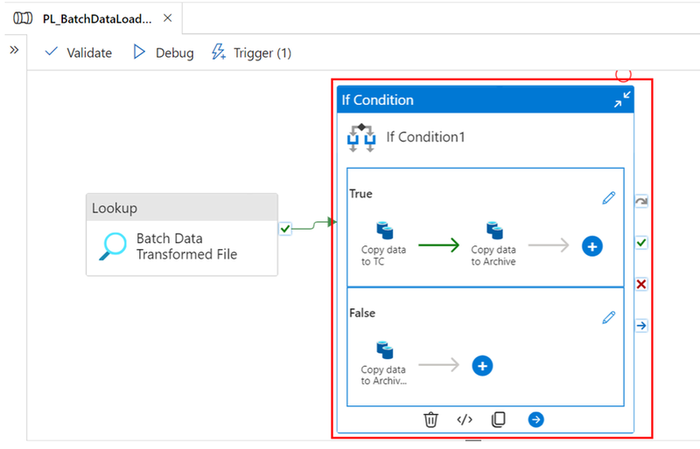

In the **TRUE** branch of the conditional statement, if the CSV file is found in the blob storage by the Lookup activity, the pipeline proceeds with the below activities

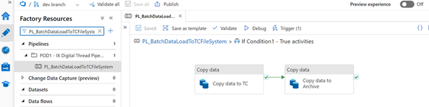

##### Copy Data to Teamcenter

This activity initiates the transfer of the CSV file from the blob storage to the Teamcenter file system. This ensures that the data is successfully pushed to Teamcenter for further processing or storage.

##### Copy Data to Archive Folder 

Upon successful copying of the CSV file to Teamcenter, this activity moves the file to the archive folder within the blob storage. This helps maintain an organized storage structure and prevents the accumulation of files in the source folder.

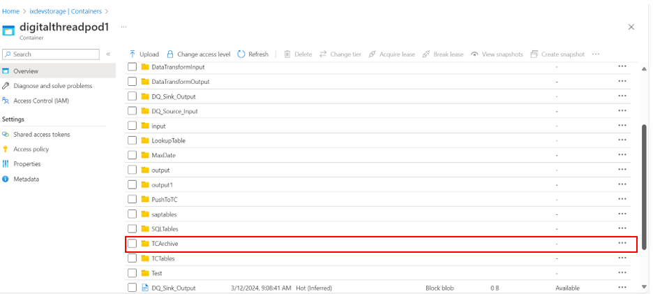

For example, in the case of the RotatngPart object type, after successfully copying the data to Teamcenter, users can view the file in the archive folder, confirming the completion of the data transfer process.

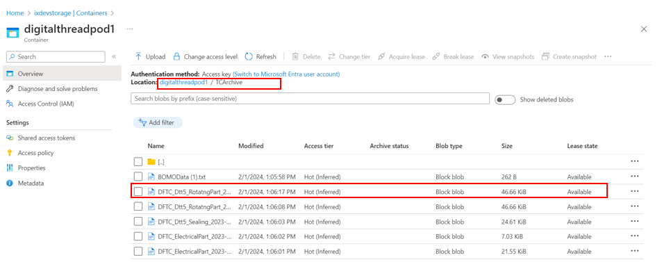

In the **FALSE** branch of the conditional statement, if the Lookup activity finds the CSV file with no records in the blob storage, the pipeline proceeds with the following activity

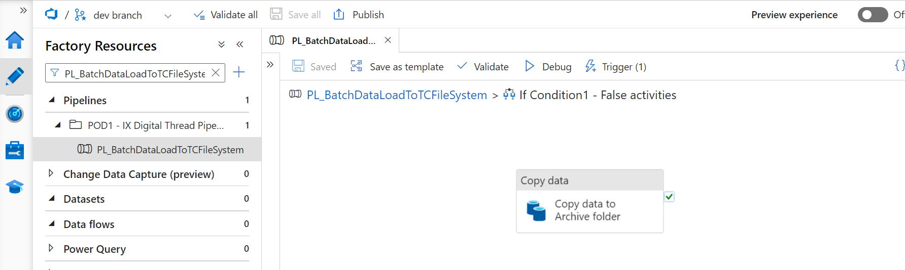

##### Copy Data to Archive Folder 

In case the CSV file has no records or is empty, the pipeline proceeds to move this empty file to the archive folder within the blob storage. This step ensures that the source folder maintains cleanliness and organization, even when there are no records present in the file.

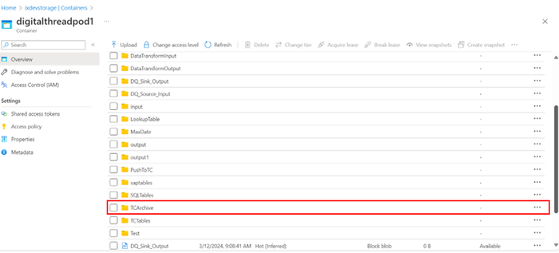

**Manual Triggering**

This pipeline can also be manually triggered by specifying the exact CSV filename created in the blob storage by the PL_TCDataLoadToBLOB pipeline. This is done by filling the parameter fName with the appropriate filename.

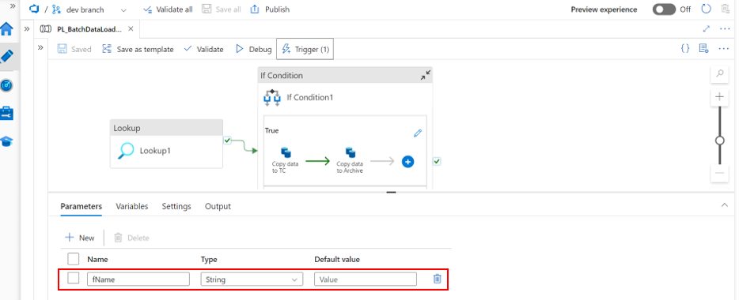

### PL_PC_TCDataLoadToBLOB

#### Use Case Part Classification

After the completion of data transformation in the PL_BatchDataTransform_TableLoad pipeline, the next step involves manually triggering the PL_PC_TCDataLoadToBLOB pipeline. This pipeline is responsible for creating a CSV file for the SQL table, ROTATINGPART and pushing it to Azure Blob Storage. Users need to specify the object type for which they intend to push data. Once this pipeline is executed, it triggers another pipeline PL_PC_DataLoadToTCFileSystem automatically, which handles the process of pushing data to Teamcenter.

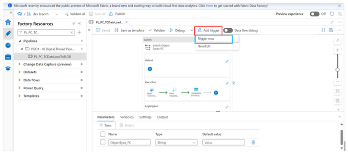

When triggering the pipeline, users need to enter the respective object type value in the ObjectType_PC parameter. There is a total of eight object types, including Lubricant, Sealing, FastenerPrt, RotatngPart, PwrTranPart, ElectriPart, EngMfgPart, and StandarPart.

For example, if the object type is RotatngPart, users must enter RotatngPart in the ObjectType_PC parameter.

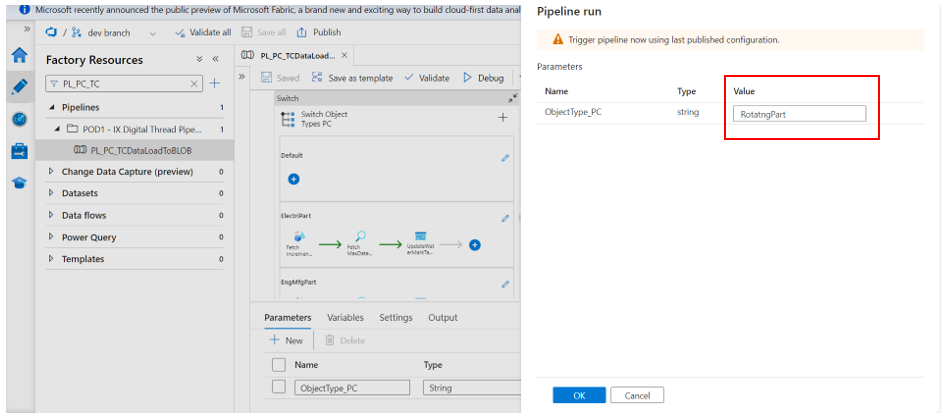

Upon manual initiation, the PL_PC_TCDataLoadToBLOB pipeline navigates to a switch case statement based on the provided object type value. Each case in the switch statement represents a different object type, allowing the pipeline to execute specific activities tailored to each object type.

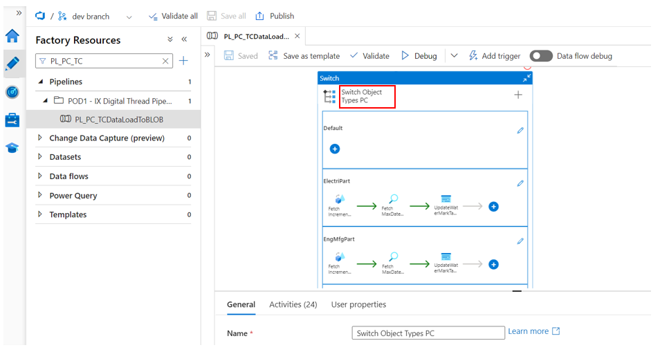

For instance, in this example focusing on RotatngPart, the pipeline will execute activities specific to RotatngPart object type.

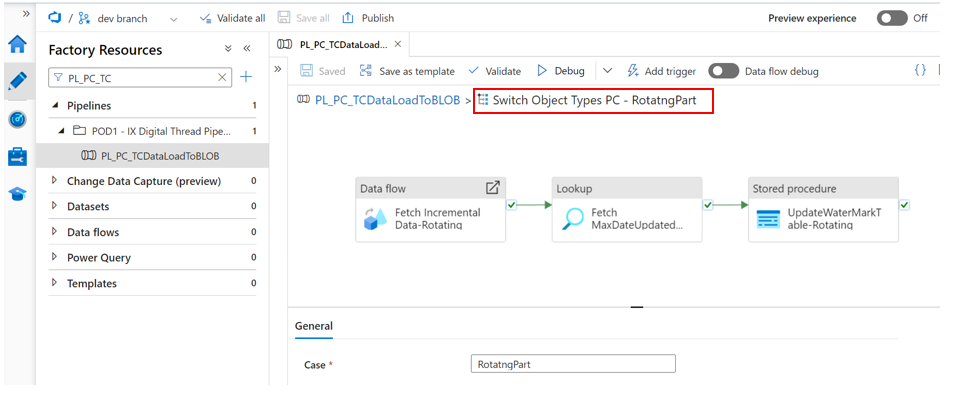

In the example centered on RotatngPart, the pipeline proceeds to execute activities uniquely designed for this object type. Prior to this pipeline\'s execution, data from the PL_BatchDataTransform_TableLoad pipeline is stored in SQL table named ROTATINGPART, which is designated for Part Classification, is utilized for further processing. The below screenshots display the columns present in ROTATINGPART table.

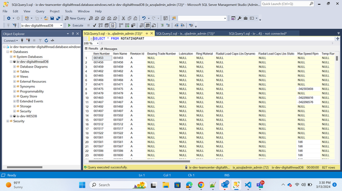

The below screenshot highlights the Date_Updated Column.

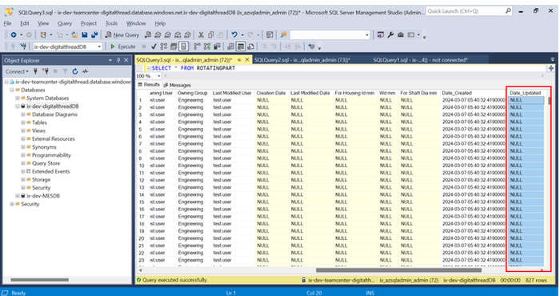

#### Data Flow Activity 

The Data Flow activity within the PL_PC_TCDataLoadToBLOB pipeline plays a pivotal role in managing the data extraction, transformation, and storage processes. It begins by retrieving the maximum Date\_Updated value from the ROTATINGPART table and storing it in a Parquet file located at digitalthreadpod1/MaxDate/MaxDateRotating_PC.parquet. This Parquet file serves as a reference point for determining the maximum Date_Updated.

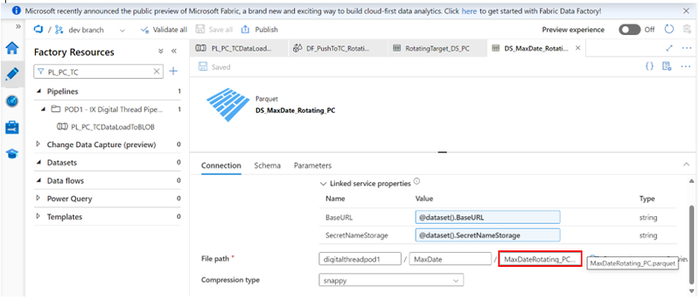

Following this, the activity conducts incremental data loading by selecting only the records from the respective table with Date_Updated greater than the LastExtractedTimeStamp from the UpdateWatermarkTable_PC. These selected records represent the incremental updates or additions made to the ROTATINGPART table since the last extraction.

This incremental data loading is facilitated by the following SQL query

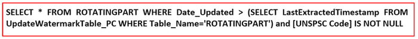

Once the incremental data selection is completed, the resulting dataset is exported to a CSV file. The filename is dynamically generated based on the current timestamp, ensuring uniqueness and clarity. For example, the CSV file path may appear as follows PC_RotatngPart_2024-03-12 13-53-02.csv. This CSV file is then stored in the blob storage container at the location digitalthreadpod1/PushToTC/, facilitating easy access and further processing of the data.

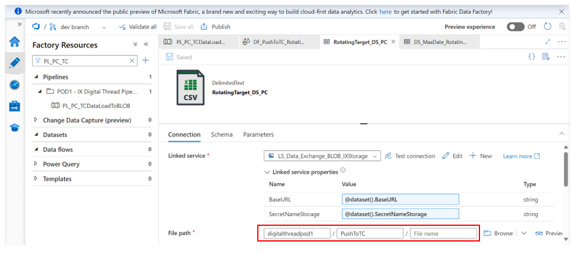

####  LookUp Activity 

Following the data processing by the Data Flow activity, the Lookup activity is utilized to fetch the Parquet file containing the maximum Date_Updated value. This Parquet file is stored in the specified location digitalthreadpod1/MaxDate/MaxDateRotating_PC.parquet within the blob storage. The Lookup activity retrieves this maximum Date_Updated value from the Parquet file, which is subsequently used in further data processing steps.

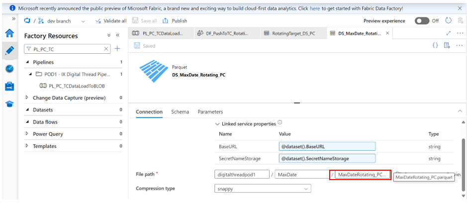

#### Stored Procedure Update Watermark Table 

The Stored Procedure activity within the PL_PC_TCDataLoadToBLOB pipeline executes a predefined procedure designed to update the watermark table with the latest timestamp. This procedure is crucial for maintaining accurate tracking of data extraction timestamps and facilitating incremental data loading processes.

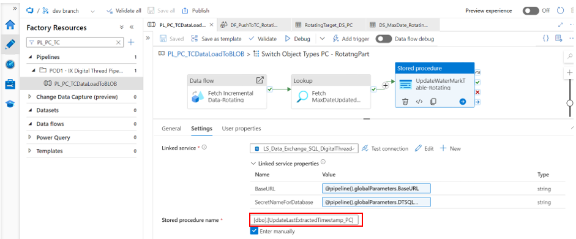

The stored procedure is responsible for updating the LastExtractedTimestamp column in the UpdateWatermarkTable_PC, which serves as the watermark for subsequent pipeline executions. By updating this timestamp, the stored procedure ensures that the pipeline only focuses on processing data updates occurring after the last extraction timestamp, thereby optimizing data extraction efficiency.

The provided screenshot displays the contents of the UpdateWatermarkTable_PC, which is a crucial component of the data loading pipeline.

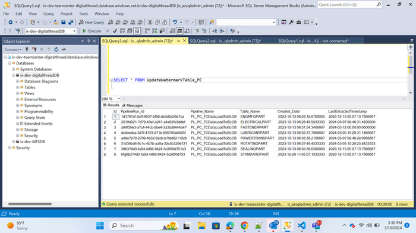

The table below lists the columns present in the UpdateWatermarkTable_PC table.

| **Column name** | **Description** |
| --- | --- |
| Id | This column appears to be a unique identifier for each record in the table. |
| PipelineRun_id | This column likely stores a reference ID associated with a specific execution run of the data loading pipeline PL_PC_TCDataLoadToBLOB. |
| Pipeline_Name | This column contains the name of the data loading pipeline, which is consistently PL_PC_TCDataLoadToBLOB across all rows. |
| Table_Name | This column indicates the name of the table from which data was extracted during the pipeline execution. These table names correspond to different object types within Teamcenter, such as ENGMFGPART or ROTATNGPART. |
| Created_Date | This column holds the timestamp representing the date and time when each record was created in the Teamcenter. |
| LastExtractedTimestamp | This crucial column stores the timestamp of the most recently processed data for the corresponding table object type identified in the Table Name column. This timestamp serves as a watermark for subsequent pipeline executions, ensuring that only data updates occurring after this timestamp are processed. The UpdateWatermarkTable_PC plays a vital role in managing data extraction and incremental loading processes within the pipeline, ensuring accurate tracking of data extraction timestamps, and facilitating efficient data updates. |

### PL_PC_DataLoadToTCFileSystem

#### Use case Part Classification

The PL_PC_DataLoadToTCFileSystem pipeline serves as a continuation of the data processing workflow initiated by the **PL_PC_TCDataLoadToBLOB** pipeline. Once a CSV file is generated and stored in the blob storage by the preceding pipeline, the **PL_PC_DataLoadToTCFileSystem** pipeline is automatically triggered. Its primary function is to facilitate the transfer of the generated CSV file from the blob storage to the Teamcenter file system.

The image below shows the TR_PL_PC_DataLoadToTCFileSystem trigger associated with the pipeline, responsible for initiating the PL_PC_DataLoadToTCFileSystem pipeline.

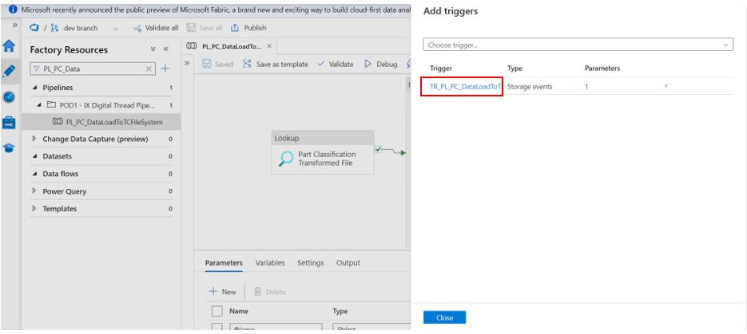

To accomplish this, the pipeline employs a Lookup activity to check for the existence of the CSV file within the blob storage. Once the Lookup activity confirms the presence of the file, the pipeline proceeds with the file transfer process.

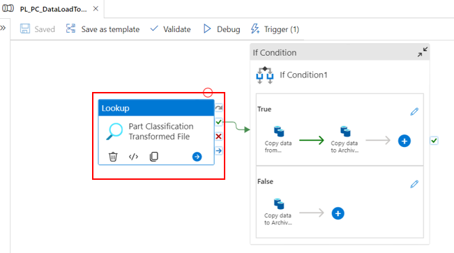

The PL_BatchDataLoadToTCFileSystem pipeline incorporates a conditional branching mechanism to handle different scenarios based on whether the CSV file has records or not in the blob storage.

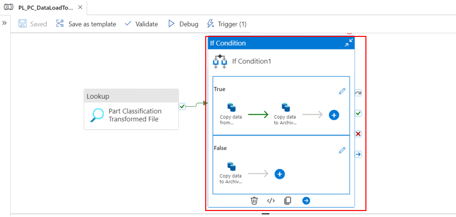

In the **TRUE** branch of the conditional statement, if the CSV file is found in the blob storage by the Lookup activity, the pipeline proceeds with the activities on the next page.

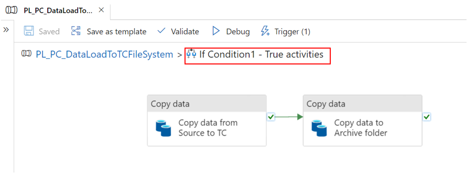

##### Copy Data to Teamcenter

This activity initiates the transfer of the CSV file from the blob storage to the Teamcenter file system. This ensures that the data is successfully pushed to Teamcenter for further processing or storage.

##### Copy Data to Archive Folder

Upon successful copying of the CSV file to Teamcenter, this activity moves the file to the archive folder within the blob storage. This helps maintain an organized storage structure and prevents the accumulation of files in the source folder.

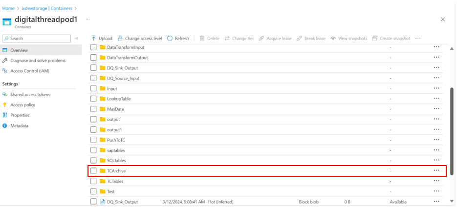

For example, in the case of the RotatngPart object type, after successfully copying the data to Teamcenter, users can view the file in the TCArchive folder, confirming the completion of the data transfer process.

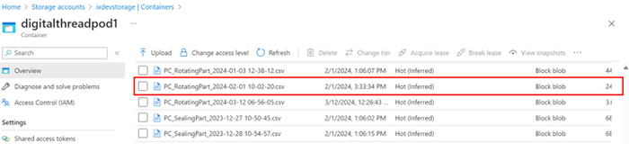

In the **FALSE** branch of the conditional statement, if the Lookup activity finds the CSV file with zero records in the blob storage, the pipeline proceeds with the following activity

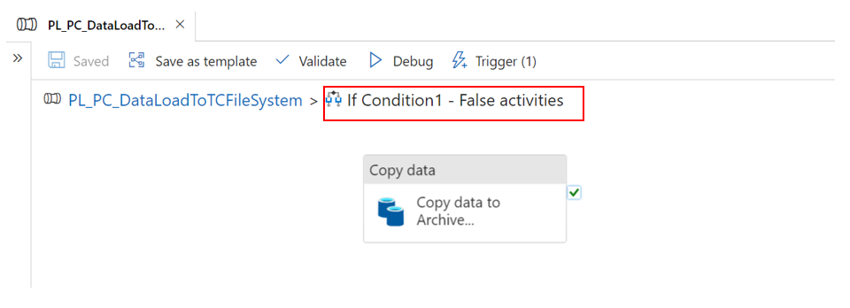

In case the CSV file has no records, the pipeline will move the empty file to the TCArchive folder within the blob storage. This step ensures that the source folder maintains cleanliness and organization, even when there are no records present in the file.

**Manual Triggering**

This pipeline can also be manually triggered by specifying the exact CSV filename created in the blob storage by the PL_PC_TCDataLoadToBLOB pipeline. This is done by filling the parameter fName with the appropriate filename.

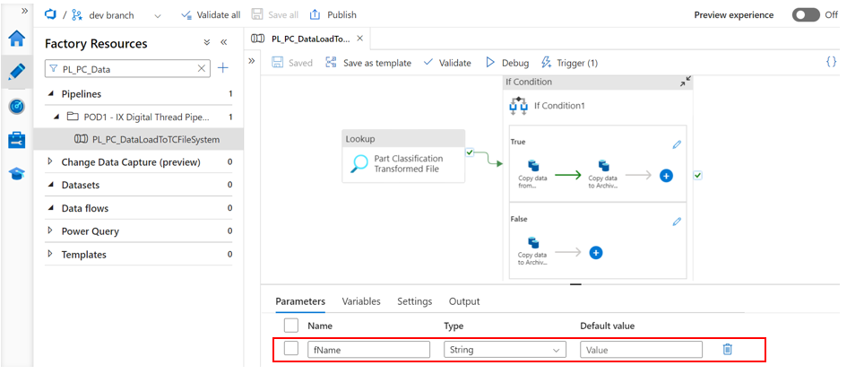

### PL_AccessTokenGenerationAutomation

The PL_AccessTokenGenerationAutomation pipeline automates the process of generating an access token for accessing Teamcenter. Previously, this task required manual intervention as various credentials, such as subscription keys and bearer tokens, were hardcoded into the system. With this pipeline, an Azure Function is employed to dynamically generate the access token using Python code.

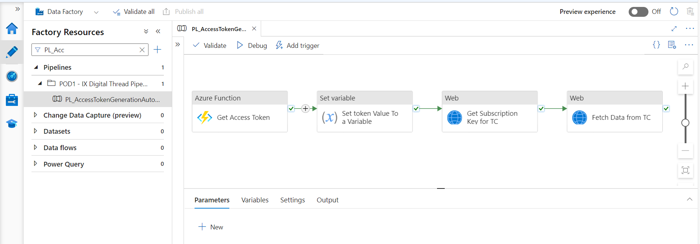

This pipeline serves as an example of how access token generation can be automated using an Azure Function, streamlining the process of accessing data from Teamcenter. The automation process works as follows:

**Access Token Generation** An Azure Function is created to generate an alphanumeric access token dynamically. This token is crucial for authorizing the requests to access data from Teamcenter.

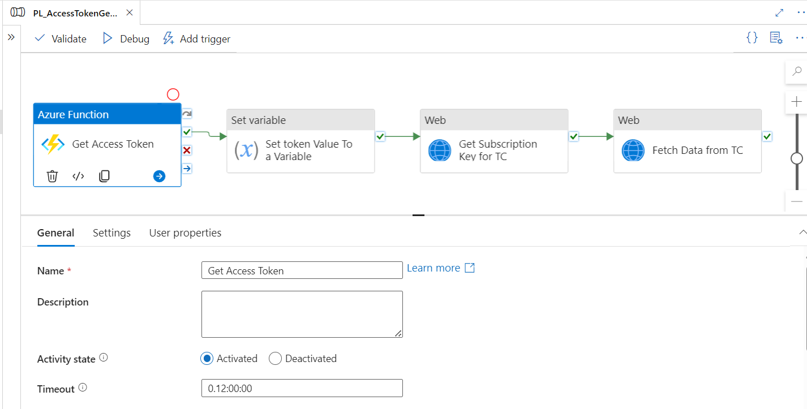

**\
Variable Assignment** Once the access token is generated, it is stored in a variable using the Set Variable activity. This ensures that the token is readily available for subsequent steps in the pipeline.

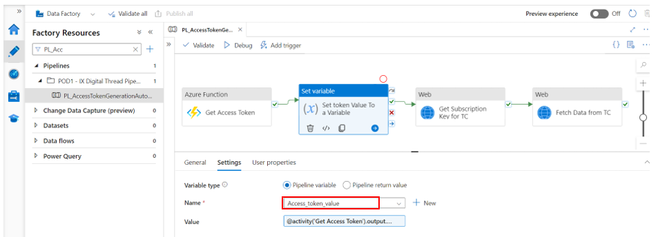

**Fetching Subscription Key** The pipeline retrieves the subscription key for the Teamcenter product policy using a Web Activity. This key is essential for accessing Teamcenter resources.

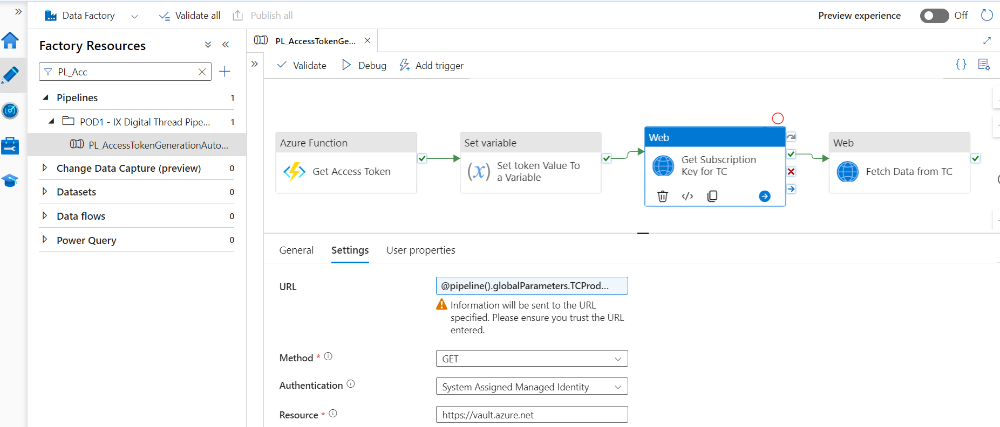

**\
Setting Headers** Headers required for authorization and subscription are set in the Web activity Fetch data from Teamcenter, utilizing the access token value obtained from the variable and the subscription key fetched from the web activity.

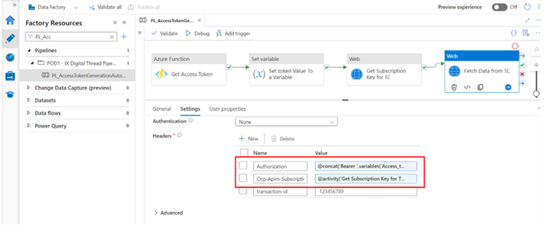

### PL_GE_DataQuality_Validation

The PL_GE_DataQuality_Validation pipeline is designed to validate the quality of incoming files before processing them. It ensures that the data meets defined standards and rules.

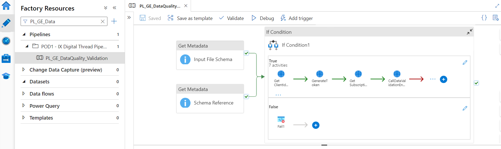

#### Get Metadata Input File Schema

This activity retrieves metadata about the structure and schema of the incoming csv data file. The file is sourced from the input folder within the gedatavalidationet container, which is located in the ixdevstorage storage account.

The dataset provided in the below screenshot displays the metadata obtained from the Get Metadata activity. Upon opening this dataset, users can easily identify the file path from which the input file is retrieved.

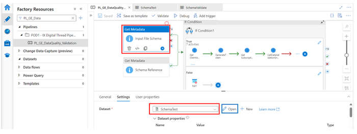

\
The below image shows the file path that indicates the location within the container where the input file is stored before being processed further in the pipeline.

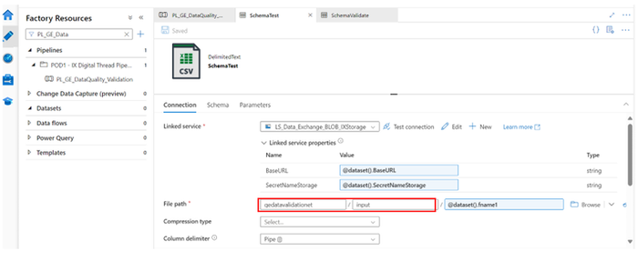

Users can navigate to the specified file path mentioned in the dataset to locate and select the desired input file. For instance, if the input CSV file pertains to Rotating Part data, it would typically contain RotatngPart in its file name or path, such as Dtt5_RotatngPart_2023-11-15_05-41-23.csv. Likewise, for other object types like EngMfgPart, ElectriPart, and Lubricant, their corresponding names would be identifiable within the file names or paths.

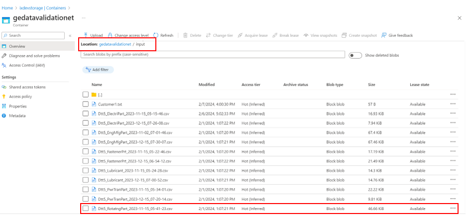

#### Get Metadata Schema Reference

Similarly, this activity fetches metadata about a reference schema against which the incoming data will be validated. It provides a reference point for validating the structure and integrity of the incoming data. The schema reference is retrieved from the SchemaReference folder present in gedatavalidationet container within the ixdevstorage storage account.

The dataset shown in the below screenshot provides metadata retrieved from the Get Metadata activity. By opening this dataset, users can readily identify the file path from which the schema reference file will be referenced.

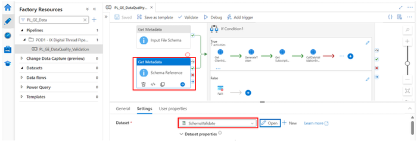

The image below illustrates the file path indicating the location within the container where the schema reference file is stored for schema validation.

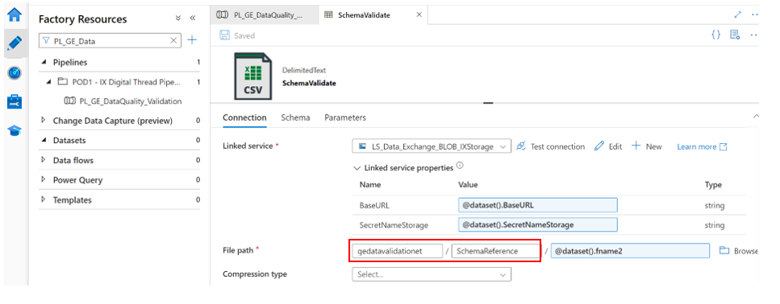

Users can navigate to the specified file path mentioned in the dataset to locate and select the desired schema reference file. It is important to note that schema reference files are available for all object types, ensuring comprehensive validation of incoming data. For example, if the schema reference CSV file corresponds to Rotating Part data, it would likely include RotatngPart in its file name or path, such as Dtt5_RotatngPart_2023-10-16_10-31-10.csv. Similarly, for other object types like EngMfgPart, ElectriPart, and Lubricant, their respective names would be identifiable within the file names or paths.

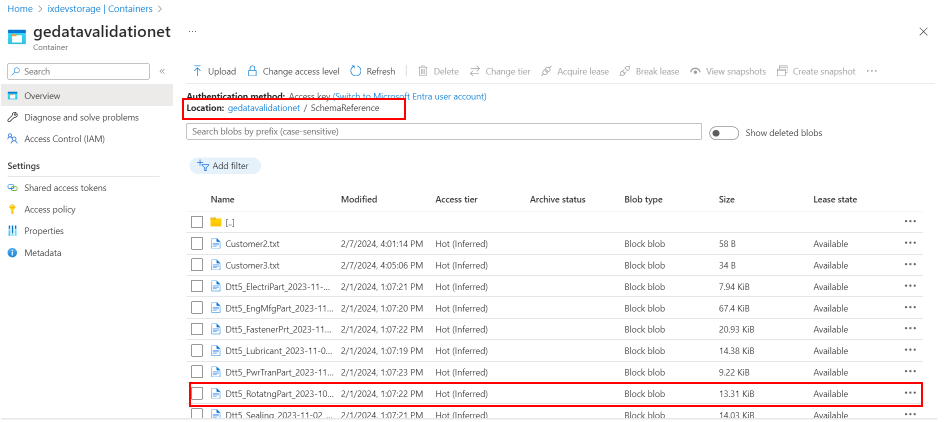

#### Input Parameters

This pipeline accepts three parameters:

| **Parameter** | **Description** |
| --- | --- |
| InputFileName | Specifies the name or path of the input CSV file that contains the data to be processed. Users can provide the filename of the CSV file they wish to analyze. For example, Dtt5_RotatngPart_2023-11-15_05-41-23.csv could be a valid input filename. |
| SchemeReferenece | Indicates the location or path of the schema reference file used for validation against the input data. Users can specify the filename or path of the schema reference file they want to compare the input data against. For instance, Dtt5_RotatngPart_2023-10-16_10-31-10.csv could be a schema reference file. |
| BodytoCallGEEndpoint | Represents the body of the request sent to the Great Expectation GE data validation endpoint during the validation process. It contains information about the data to be validated, and any additional parameters required by the GE endpoint. After entering the parameter values, users can trigger the pipeline to initiate the data validation process. 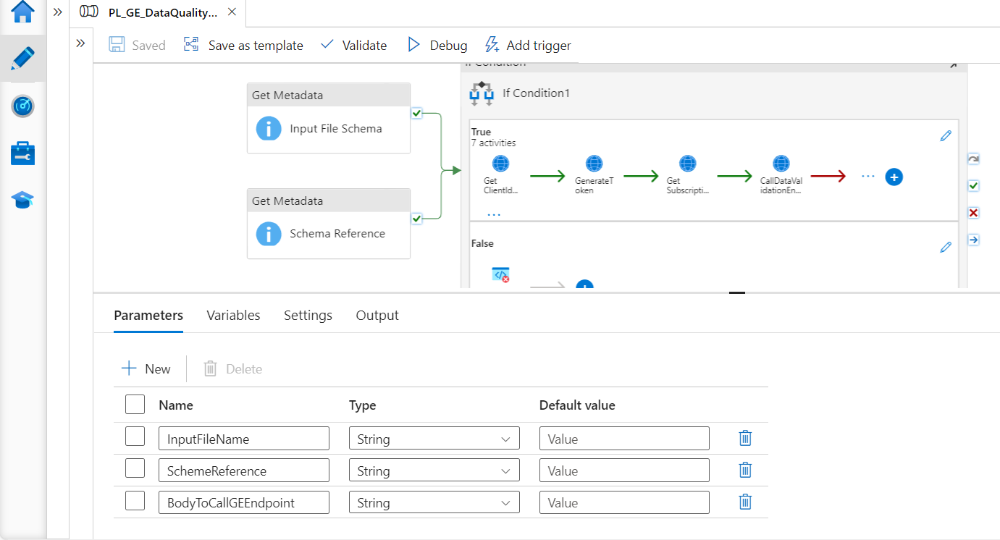
For instance, for the RotatngPart object type, the value of BodytoCallGEEndPoint parameter would be: \{dataContextPath/app/great_expectations,checkpointNameix_dt_pc_rotatingpart_checkpoint,overrideContextPathfalse\} Similarly, the value would vary for different object types based on their specific validation requirements. |

#### If Condition on Schema Validation

After obtaining both sets of metadata, the pipeline splits based on a condition. If the schema of the input file matches the reference schema, the pipeline proceeds to the TRUE branch. Otherwise, it moves to the FALSE branch, indicating a mismatch between the schemas.

If the schema validation check fails, the pipeline will be moved to FALSE branch where Fail activity will be triggered which prevent further processing of potentially invalid data. This ensures that only data meeting the predefined schema standards is processed, maintaining data integrity and accuracy throughout the workflow.

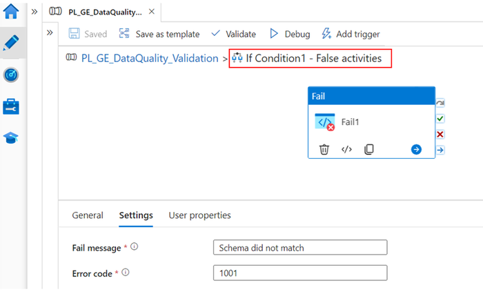

If the schema validation is successful, the pipeline proceeds to process the file by following further steps in **TRUE** branch.

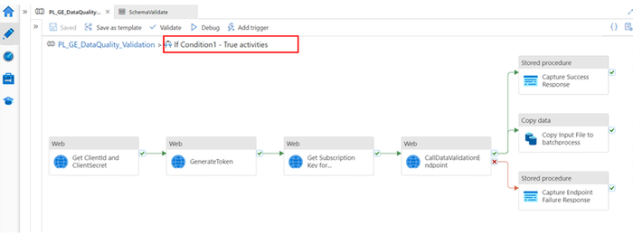

Web Activity Client ID and Client Secret This activity fetches the client ID and client secret from Azure Key Vault. These credentials are essential for authenticating the pipeline with an external service, such as the data validation endpoint, ensuring secure and authorized access to protected resources or APIs.

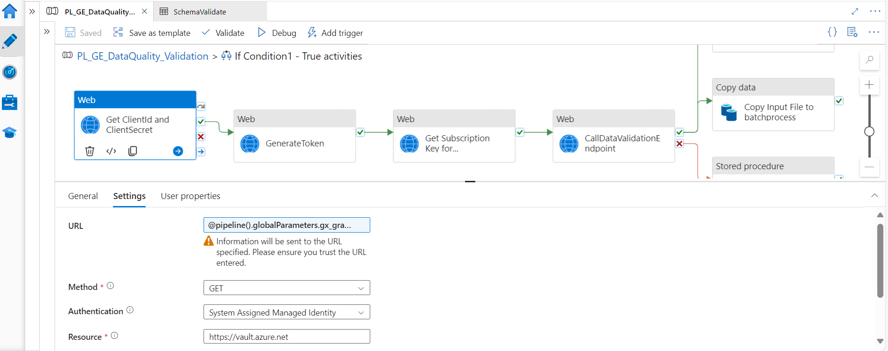

Web Activity Generate Token Using the obtained client ID and client secret, this activity generates an authentication token or access token required for authorizing subsequent requests to access protected resources or endpoints.

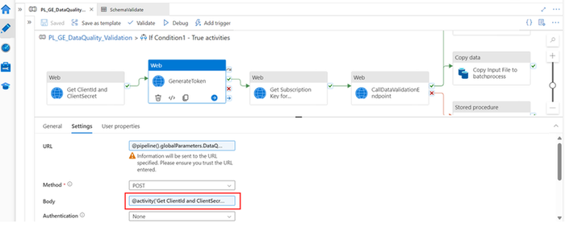

Web Activity Get Subscription Key for GEValidation This activity fetches the subscription key associated with the GEValidation service, essential for identifying and authorizing access to specific APIs or services provided by GEValidation.

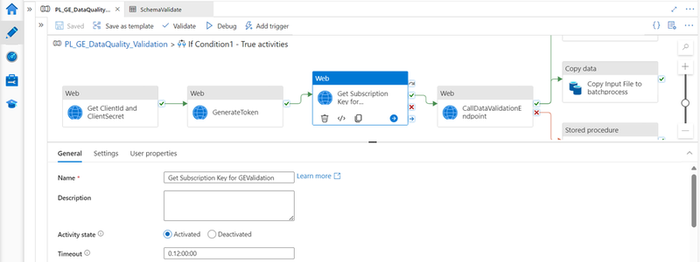

##### Web Activity CallDataValidationEndpoint

After obtaining the necessary authentication token and subscription key, this activity utilizes the BodyToCallGEEndpoint parameter to send the data to the Great Expectation GE data validation service. This service then checks the data against predefined rules to ensure its quality and integrity.\
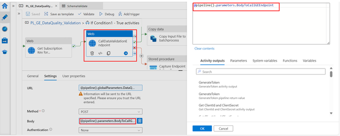

After invoking the data validation endpoint, the pipeline branches into two paths based on the validation results. If the validation is successful, the following happens:

##### Stored Procedure Capture Success Response 

The success response from the endpoint is captured using a stored procedure. This ensures that any relevant information or metrics regarding the successful validation process are recorded for auditing or tracking purposes.

##### ***Copy Data Copy input file to batchprocess*** 

The input file is then copied to batchprocess container within ixdevstorage storage account. This step triggers another pipeline PL_BatchDataTransform_TableLoad, which is responsible for transforming and loading the data into a SQL table. By copying the input file to this location, the pipeline ensures that only validated data is processed further, maintaining data integrity and reliability.

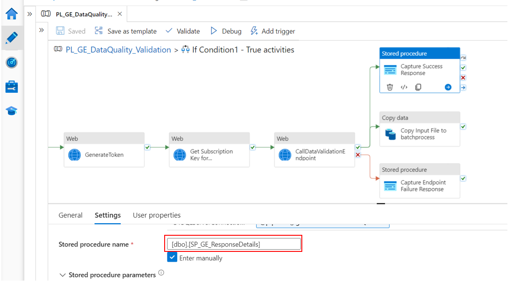

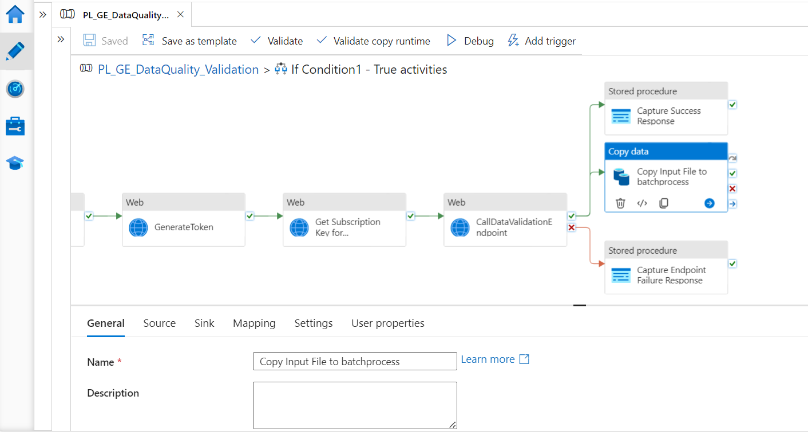

The below picture shows the files present in batchprocess container.

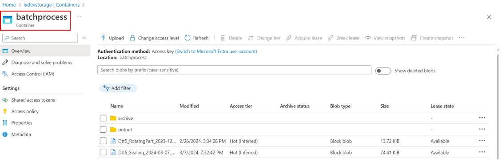

If the validation fails:

##### Stored Procedure Capture Endpoint Failure Response

The failure response from the endpoint is captured using another stored procedure. This allows the pipeline to record details about the validation failure, such as error messages or specific issues encountered during the validation process. Capturing this information is crucial for troubleshooting and identifying potential issues in the data.

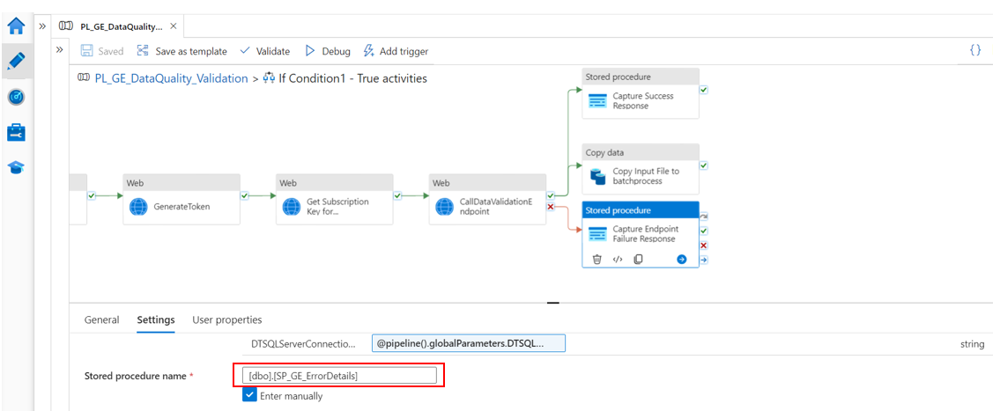
