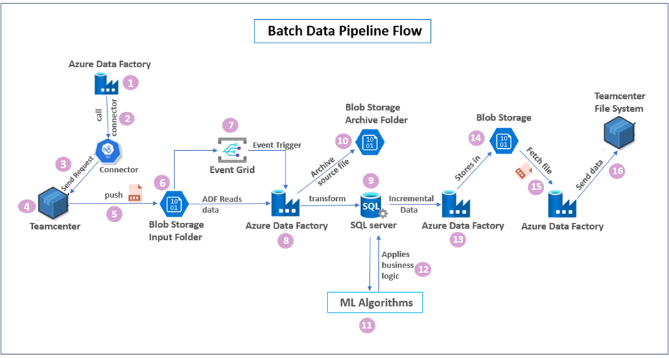
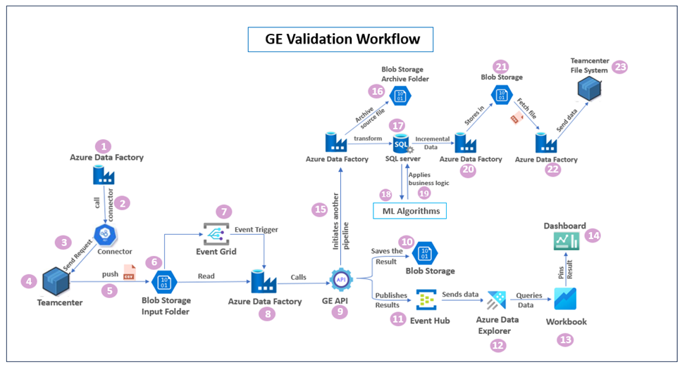

DIGITAL THREAD FOUNDATIONS

Azure Data Factory

WORKFLOW OVERVIEW

Release Version: 1.2

**Metadata Table**

| **Field** | **Value** |
| --- | --- |
| **Asset / Solution Name** | Digital Thread |
| **Domain / Area** | Engineering |
| **Owner (Team/Person)** | Karthik Ramachandra |
| **Reviewers** | Karthik Ramachandra |
| **Status** | Approved / Complete |
| **Confidentiality** | Internal / Confidential |
| **Source of Truth** |  |
| **Related Assets / Alternatives** | AOT / Engineering Orch / Engineering Agents |

## Introduction \{#introduction .unnumbered\}

A digital thread refers to the continuous and consistent flow of information throughout the entire lifecycle of a product or system -- from design and development to operation and maintenance. It enables the integration of data from different stages and sources, allowing effective traceability, seamless collaboration, and efficient decision-making by unleashing the power of sleeping data. The digital thread is considered a key aspect of Industry 4.0 and the digital transformation of the manufacturing industry. It is the core of what we call the Enterprise Operating System (EOS). Digital Thread is a communication framework that helps integrate various enterprise systems involved in the engineering and manufacturing product life cycle.

Azure Data Factory (ADF) is a cloud-based data integration service provided by Microsoft Azure. It serves as a robust platform for orchestrating and automating data workflows, enabling organizations to efficiently ingest, transform, and load data from diverse sources to various destinations. ADF empowers users to create, manage, and monitor data pipelines seamlessly, facilitating the integration of disparate data sources into meaningful insights for analytics, reporting, and decision-making processes.

Industry X's Digital Thread Foundations project framework leverages ADF for configuring and managing data processing workflows, facilitates informed decision-making, and improves operational efficiency through ADF orchestration and GE (Great Expectations) validation processes.

### Purpose \{#purpose .unnumbered\}

This document provides an overview of the ADF workflow implemented for Digital Thread Foundations. It depicts the Batch Data Pipeline Flow and the integration of the Great Expectations (GE) Validation Workflow and outlines each stage from data extraction to final transmission.

### Target Audience \{#target-audience .unnumbered\}

-   Data Engineers

-   ADF Developers

-   Software Architects

-   Integrators with IT Background

###  Prerequisites \{#prerequisites .unnumbered\}

-   Access to Azure subscription with relevant resources. Familiarity with ADF.

-   Familiarity with data integration concepts.

### Definitions \{#definitions .unnumbered\}

| **Term** | **Definition** |
| --- | --- |
| ADX | Azure Data Explorer |
| PLM | Product Lifecycle Management |
| ML | Machine Learning |
| UNSPSC | United Nations Standard Products and Services Code |

### Business Contacts \{#business-contacts .unnumbered\}

-   [florian.tournier@accenture.com](mailto:florian.tournier@accenture.com)

-   [laura.mosconi@accenture.com](mailto:laura.mosconi@accenture.com)

-   [karthik.ramachandra@accenture.com](mailto:karthik.ramachandra@accenture.com)

### Technical Contacts \{#technical-contacts .unnumbered\}

-   [laura.mosconi@accenture.com](mailto:laura.mosconi@accenture.com)

-   [stefano.giacco@accenture.com](mailto:stefano.giacco@accenture.com)

-   [florian.tournier@accenture.com](mailto:florian.tournier@accenture.com)

### Relevant Links \{#relevant-links .unnumbered\}

-   [Digital Thread Foundations Documentation](https://industryxdevhub.accenture.com/asset-home;search_text=ix%20digital%20thread)

##  \{#section .unnumbered\}

##  \{#section-1 .unnumbered\}

## ADF Workflows \{#adf-workflows .unnumbered\}

The workflows created by leveraging ADF are the Batch Data Pipeline flow and the GE Validation workflow.

### Batch Data Pipeline Flow \{#batch-data-pipeline-flow .unnumbered\}

The Batch Data Pipeline flow is a workflow within the Digital Thread project that leverages ADF to automate data processing from Teamcenter, a prominent PLM system. ADF orchestrates the entire Extract, Transform, and Load (ETL) process, ensuring the efficient flow of valuable data from Teamcenter. The diagram on the right depicts the entire batch data pipeline flow. On the pages that follow, the diagram will be broken into two parts to further highlight the steps.

### Data Extraction \{#data-extraction .unnumbered\}

The workflow steps for data extraction are described below. The numbered headings are aligned with the same numbers in the diagram right.

#### 

1.  **Initiate the data flow via ADF Pipeline**

> In the initial phase of the workflow, an ADF pipeline is configured for data extraction from Teamcenter. This pipeline serves as the gateway for initiating the data retrieval process, enabling seamless integration between Teamcenter and the ADF environment.
>
> Configured with user-defined parameters, this ADF pipeline offers precise control over the data extraction process. Parameters such as object types and date ranges (created_before, created_after) allow for targeted retrieval of relevant data subsets from Teamcenter. By specifying these parameters, only the necessary data is extracted, optimizing the efficiency of the workflow, and minimizing unnecessary data transfer.
>
> ADF orchestrates the entire workflow by coordinating interactions with Teamcenter, triggering data transformations, and ensuring a seamless flow of information.

2.  **ADF pipeline calls TC connector**

> The ADF pipeline calls the Teamcenter connector, a specialized component responsible for interacting with the Teamcenter system.
>
> The connector establishes a connection to Teamcenter using appropriate authentication credentials.

3.  **Data Retrieval Request**

> The Teamcenter connector sends a data retrieval request to Teamcenter based on the parameters defined in the ADF pipeline.

4.  **Extracting data from Teamcenter**

> Teamcenter processes the data retrieval request and extracts the requested information.

5.  **Leveraging Teamcenter's internal services (SOA and ITK.exe)**

> After the connector interacts with Teamcenter APIs, a custom Service-Oriented Architecture (SOA) service validates and processes requests originating from ADF. This service performs the necessary authorization checks and data formatting tasks as required. The SOA service invokes an ITK executable program (ITK.exe), a custom utility designed specifically for Teamcenter. Based on the provided parameter values, ITK.exe extracts the requested data from Teamcenter and generates a batch data file in CSV format containing the extracted information.

6.  **Storing Extracted Data in Azure Blob Storage**

> Following extraction, the generated CSV file containing the Teamcenter data is temporarily stored in a batch process container in Azure Blob Storage. This cloud-based storage acts as a staging area, holding the data before further processing within the ADF pipeline.

7.  **Event Trigger on Blob Storage for Data Arrival**

> An Event Trigger is configured to monitor the designated Input Folder in Azure Blob Storage. When a new CSV file, indicating the completion of data extraction by ITK.exe, arrives in this folder, the Event Trigger is activated. This trigger is initiated through Azure Event Grid, ensuring seamless monitoring and activation based on specified events. Detecting a new CSV file, the activated Event trigger initiates another ADF pipeline execution.

### Data Transformation and Transmission \{#data-transformation-and-transmission .unnumbered\}

The workflow steps for data transformation and transmission are described below. The numbered headings are aligned with the same numbers in the diagram right.

8.  

9.  **ADF Pipeline for Transformation and Loading**

> This pipeline performs data transformations on the CSV file present in blob storage using the ADF Data Flow service, which is a visual interface provided by ADF that enables defining and implementing various data transformations such as filtering and sorting.

10. **Data Loading into SQL server**

> After transformation, the processed data is loaded into designated SQL tables within Azure SQL Server for further analysis or use such as bulk data processing and part classification.

11. **Archiving the Source File**

> Once the data is successfully loaded into SQL Server, the source CSV file in Blob Storage is moved to an Archive folder within the Azure Blob storage, ensuring efficient data management and organization.

12. **Integration of ML Algorithms**

> After the data undergoes transformation and is stored in dedicated SQL tables for bulk data processing and part classification, additional processing occurs with the integration of ML algorithms.

13. **Application of Business Logic and UNSPSC Code Update**

> The ML algorithms predict UNSPSC codes for part classification. By analyzing part characteristics and attributes, these algorithms make accurate predictions, facilitating efficient part categorization.

14. **Incremental Data Retrieval and Storage in Blob Storage**

> After applying ML algorithms and business logic, an ADF pipeline is triggered to extract incremental data from the SQL Server based on changes in UNSPSC codes. The pipeline identifies records with updated or newly assigned UNSPSC codes since the last extraction, enabling real-time or near-real-time data synchronization between systems.

15. **Incremental Data Storage**

> This incremental data is then stored in Blob Storage, which serves as an intermediary repository for storing data before sending this file to the Teamcenter File System.

16. **Fetch CSV file from blob storage via ADF Pipeline**

> An ADF pipeline is initiated to fetch the processed CSV file from blob storage.

17. **Final Data Transmission to Teamcenter File System**

> After the file is fetched, the pipeline transmits the final file to the Teamcenter file system, where it can be accessed and utilized for various purposes such as product design, manufacturing, or supply chain management.
>
> 
>
> 

###  \{#section-3 .unnumbered\}

### Great Expectations Validation Workflow \{#great-expectations-validation-workflow .unnumbered\}

In the Great Expectations validation dataflow, ADF and a suite of Azure services are utilized to ensure data integrity, reliability, and accuracy. The following diagram depicts the GE validation workflow.

### Data Extraction \{#data-extraction-1 .unnumbered\}

The data extraction process from Teamcenter is similar to that of batch data pipeline flow except for the GE validation and result distribution.

#### 

1.  **Initiate the data flow via ADF Pipeline**

> In the initial phase of the workflow, an ADF pipeline is configured for data extraction from Teamcenter. This pipeline serves as the gateway for initiating the data retrieval process, enabling seamless integration between Teamcenter and the ADF environment.
>
> Configured with user-defined parameters, this ADF pipeline offers precise control over the data extraction process. Parameters such as object types and date ranges (created_before, created_after) allow for targeted retrieval of relevant data subsets from Teamcenter. By specifying these parameters, only the necessary data is extracted, optimizing the efficiency of the workflow, and minimizing unnecessary data transfer.
>
> ADF orchestrates the entire workflow by coordinating interactions with Teamcenter, triggering data transformations, and ensuring a seamless flow of information.

2.  **ADF Pipeline calls TC connector**

> The ADF pipeline calls the Teamcenter connector, a specialized component responsible for interacting with the Teamcenter system. The connector establishes a connection to Teamcenter using appropriate authentication credentials.

3.  **Data Retrieval Request**

> The Teamcenter connector sends a data retrieval request to Teamcenter based on the parameters defined in the ADF pipeline.

4.  **Extracting data from Teamcenter**

> Teamcenter processes the data retrieval request and extracts the requested information.

5.  **Leveraging Teamcenter's internal services (SOA and ITK.exe)**

> After the connector interacts with Teamcenter APIs, a custom Service-Oriented Architecture (SOA) service validates and processes requests originating from ADF. This service performs the necessary authorization checks and data formatting tasks as required. The SOA service invokes an ITK executable program (ITK.exe), a custom utility designed specifically for Teamcenter. Based on the provided parameter values, ITK.exe extracts the requested data from Teamcenter and generates a batch data file in CSV format containing the extracted information.

6.  **Storing Extracted Data in Azure Blob Storage**

> Following extraction, the generated CSV file containing the Teamcenter data is temporarily stored in a batch process container in Azure Blob Storage. This cloud-based storage acts as a staging area, holding the data before further processing within the ADF pipeline.

7.  **Event Trigger on Blob Storage for Data Arrival**

> An Event Trigger is configured to monitor the designated Input Folder in Azure Blob Storage. When a new CSV file, indicating the completion of data extraction by ITK.exe, arrives in this folder, the Event Trigger is activated. This trigger is initiated through Azure Event Grid, ensuring seamless monitoring and activation based on specified events.
>
> Upon arrival of a new CSV file in the designated \"Input Folder\" of Azure Blob Storage, signifying completion of data extraction by ITK.exe, an Event Trigger activates the ADF pipeline.

### GE Validation and Result Distribution  \{#ge-validation-and-result-distribution .unnumbered\}

#### 

8.  **ADF pipeline calls GE API**

> The ADF pipeline calls the GE API to validate the extracted data against pre-defined expectations.

9.  **GE validation**

> The GE API performs data validation and generates detailed results reflecting data quality metrics. These results are essential for subsequent analysis and improvement actions.

10. **Storing Data Quality results in Blob storage**

> The results are saved in a designated location within Azure Blob Storage for future reference, analysis, and potential troubleshooting.

11. **Publishing Results to Event Hub**

> The data quality results are published to an Event Hub, enabling real-time consumption and further processing. Additionally, the results are loaded into a \"DQresults\" table within Azure Data Explorer (ADX) for in-depth analysis and reporting.

12. **Data ingestion into ADX**

> The Event Hub data is ingested into Azure Data Explorer (ADX) using Kafka Connect, a framework that facilitates data streaming from Event Hub to ADX. In this scenario, Kafka Connect acts as a bridge, streaming the validation results from the Event Hub to a designated table within ADX.

13. **Querying Data and Visualization in Workbooks**

> Users can query the \"DQresults\" table in ADX to explore data quality metrics and create visualizations using ADX workbooks. This enables interactive data exploration and insights generation.

14. **Visualization on Dashboards**

> Key data quality metrics and visualizations are pinned to dashboards for real-time monitoring and proactive issue identification. These dashboards provide a centralized view of data quality performance.

###  \{#section-6 .unnumbered\}

### Data Transformation and Transmission  \{#data-transformation-and-transmission-1 .unnumbered\}

#### 

15. **ADF Pipeline for Transformation and Loading**

> Upon successful GE API validation, an ADF pipeline is triggered to process the CSV file stored in Blob Storage. The pipeline employs the ADF Data Flow service to apply necessary transformations, including filtering, sorting, and other data cleansing operations, to prepare the data for subsequent stages.

16. **Data Loading into SQL Server**

> After transformation, the processed data is loaded into designated SQL tables within Azure SQL Server for further analysis or use such as bulk data processing and part classification.

17. **Archiving the Source File**

> Once the data is successfully loaded into SQL Server, the source CSV file in Blob Storage is moved to an Archive folder within the Azure Blob storage, ensuring efficient data management and organization.

18. **Integration of ML Algorithms**

> After the data undergoes transformation and is stored in dedicated SQL tables for bulk data processing and part classification, additional processing occurs with the integration of ML algorithms.

19. **Application of Business Logic and UNSPSC Code Update**

> The ML algorithms predict UNSPSC codes for part classification. By analyzing part characteristics and attributes, these algorithms make accurate predictions, facilitating efficient part categorization.

20. **Incremental Data Retrieval and Storage in Blob Storage**

> After applying ML algorithms and business logic, an ADF pipeline is triggered to extract incremental data from the SQL Server based on changes in UNSPSC codes. The pipeline identifies records with updated or newly assigned UNSPSC codes since the last extraction, enabling real-time or near-real-time data synchronization between systems.

21. **Incremental Data Storage**

> This incremental data is then stored in Blob Storage, which serves as an intermediary repository for storing data before sending this file to the Teamcenter File System.

22. **Fetch CSV file from blob storage via ADF Pipeline**

> An ADF pipeline is initiated to fetch the processed CSV file from blob storage.

23. **Final Data Transmission to Teamcenter File System**

> After the file is fetched, the pipeline transmits the final file to the Teamcenter file system, where it can be accessed and utilized for various purposes such as product design, manufacturing, or supply chain management.

