

INDUSTRY X

Digital Thread Foundations

ARCHITECTURE BLUEPRINT

Release Version: 1.2

Metadata Table

| **Field** | **Value** |
| --- | --- |
| **Asset / Solution Name** | Digital Thread |
| **Domain / Area** | Engineering |
| **Owner (Team/Person)** | Karthik Ramachandra |
| **Reviewers** | Karthik Ramachandra |
| **Status** | Approved / Complete |
| **Confidentiality** | Internal / Confidential |
| **Source of Truth** | [link](https://dev.azure.com/IXAssets/IXAssetsProject/\_git/ixassets) |
| **Related Assets / Alternatives** | AOT / Engineering Orchestration / Engineering Agents |

## Introduction

A digital thread refers to the continuous and consistent flow of information throughout the entire lifecycle of a product or system - from design and development to operation and maintenance. It enables the integration of data from different stages and sources, allowing effective traceability, seamless collaboration, and efficient decision-making by unleashing the power of sleeping data. The digital thread is considered a key aspect of Industry 4.0 and the digital transformation of manufacturing and industry and is core for what we call the Enterprise Operating System (EOS). Digital Thread is a communication framework that helps integrate various enterprise systems involved in the engineering and manufacturing product life cycle.

The fundamental decisions and solution strategies that shape the system architecture for Accenture\'s IX Digital Thread Foundations asset include:

-   Event Driven

-   Distributed Topology and Deployment Model

-   Kafka Streaming

-   Rich Catalog of Connectors

-   Rest, SOA, OData

-   Containerized Modules

The following graphic from Gartner shows how digital threads connect and track the life cycle of a product.

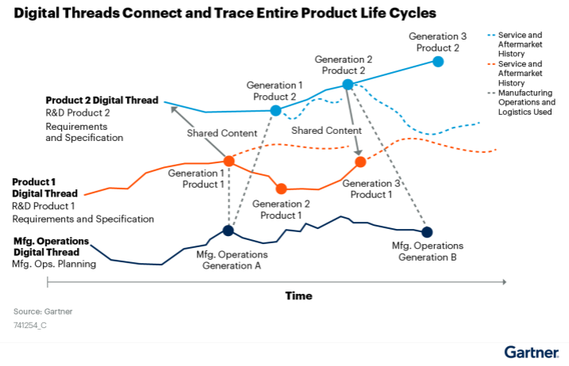

### Purpose

The purpose of this document is to provide an overview of Industry X Digital Thread Foundations architecture. After reading, the target audience should understand the overall architecture of the system and the technical implementation of its modules.

### Target Audience

-   Accenture use only

-   Software architects

-   Developers

-   Integrators with IT background

### Contacts

-   [karthik.ramachandra@accenture.com](mailto:karthik.ramachandra@accenture.com)

-   [laura.mosconi@accenture.com](mailto:laura.mosconi@accenture.com)

-   [stefano.giacco@accenture.com](mailto:stefano.giacco@accenture.com)

-   [srinath.k.murthy@accenture.com](mailto:srinath.k.murthy@accenture.com)

-   [v.sudhakar.padiyar@accenture.com](mailto:v.sudhakar.padiyar@accenture.com)

### Related Links

-   [ADO](https://dev.azure.com/IXDigitalThread) (reach out to Contacts for access)

-   [Connector Integration Patterns](https://ts.accenture.com/:u:/r/sites/GlobalDocTemplates/Published%20Documents/IX%20Thread/Linked%20Files/Connector_Integration.zip?csf=1&amp;web=1&amp;e=66kr56)

-   [IX Digital Thread Functional Overview](https://industryxdevhub.accenture.com/assetdetails/86)

### 

## Glossary

| Term | Description |
| --- | --- |
| Cloud Native | Cloud-native technologies empower organizations to build and run scalable applications in modern, dynamic environments such as public, private, and hybrid clouds. Containers, service meshes, microservices, immutable infrastructure, and declarative APIs exemplify this approach.\\These techniques enable loosely coupled systems that are resilient, manageable, and observable. Combined with robust automation, they allow engineers to make high-impact changes frequently and predictably with minimal toil. (Ref 8) |
| PoC | Proof of Concept |
| APIs | Exposes data and business logic toward the external world |
| Applications | Business applications, reports, and dashboards implemented on top of the business logic and knowledge graph of the solution |
| SDK | Software Development Toolkit: a set of software tools and programs that developers can use to build applications for specific platforms. SDKs help developers easily integrate their apps with a vendor\'s services.\\SDKs include documentation, application programming interfaces (APIs), code samples, libraries, and processes, as well as guides that developers can use and integrate into their apps. Developers can use SDKs to build and maintain applications without having to write everything from scratch. |
| Microservices | An architectural style that structures an application as a collection of small, independent services that communicate over APIs. Each microservice focuses on a specific business capability, enabling greater scalability and easier maintenance. |
| Container | A lightweight, portable, and self-sufficient package that includes everything needed to run a piece of software, such as code, runtime, system tools, and libraries. Containers help ensure consistency across various environments. |
| Service Mesh | A dedicated infrastructure layer that manages service-to-service communication within a microservices architecture, providing features such as load balancing, authentication, and observability. |
| Immutable Infrastructure | A deployment approach where infrastructure components are never modified after they are deployed. Any changes require replacing the component with a new version, which improves reliability and simplifies rollback processes. |
| Declarative API | An API style where users specify what they want (desired state) rather than how to achieve it. The system handles the implementation details, which promotes automation and consistency. |
| DevOps | A set of practices that combines software development (Dev) and IT operations (Ops) to shorten the development lifecycle and deliver high-quality software continuously. DevOps emphasizes collaboration, automation, and monitoring. |
| CI/CD | Continuous Integration (CI) and Continuous Delivery/Deployment (CD) are practices that automate code integration, testing, and delivery processes, enabling frequent and reliable software releases. |
| Dashboard | A visual interface that displays key metrics, data, and analytics to help users monitor the status and performance of applications, systems, or business processes. |
| Knowledge Graph | A data structure that represents relationships between entities in a network, allowing for enhanced data retrieval, integration, and semantic analysis within business solutions. |
## Architecture Constraints

### 

## Portability and Flexibility Constraints

The MVP release relies on Azure Cloud and Services, but the design allows the framework to be portable to the other Cloud or on-premises Solutions and flexible to support a distributed computation approach. To enable portability and flexibility, the architecture prefers using cloud-native approaches.

The framework must support different Architecture Topologies and Deployment models also enabling the possibility to distribute the packages across Cloud, Edge, and Client Environments.

While these approaches are valid for all custom code that the Asset can develop, several cases prefer to leverage available frameworks instead of creating the required services from scratch, which poses a possible constraint. In such cases, the team relies on PoCs to compare available solutions in the market. Various OSS, PaaS services or Enterprise Solutions are evaluated and tested considering specific criteria that are defined in the PoC.

### IT-OT System Integration Constraints

Currently, the Digital Thread ecosystem is based on the ISA95 standard view, which poses a constraint. In ISA95, data flows are layered and unidirectional, i.e., only from the sensors to the PLCs, from the PLCs to the SCADA, MES systems, or the ERP. It is more beneficial if all nodes in the network ecosystem are enabled as both a generator and consumer to allow real-time processing and traffic of contextualized, normalized, and aggregated information. To enable this, the Digital Thread must provide a flexible solution to the following:

-   Integrating disparate systems (OT and IT) and enabling the integration of good-quality data in a real-time fashion. To achieve this, the DT must support an event-driven and distributed architecture and an event broker that supports or integrates Lightweight Protocols (MQTT).

-   Defining a unified domain model across the different layers to identify the data source of truth, data meaning, and relationship. Data motion to the cloud should not be the sole way to get information. Data processing should be possible at the event and querying information at the source should be enabled. To achieve this, distributed query management including federation is required.

### Authentication

Adapters built using this framework should support multiple authentication protocols like Password Auth (PAP), LDAP, SAML, OpenID Connect, JWT, and so on. Devices and OT systems can rely on Certificate Authentication. The Access Management Capabilities DT will provide will be verified and validated with the Accenture Security team and SME on both OT and IT systems.

###  Development Approach Constraints

The following are the constraints posed due to the development approach:

-   All Connectors must be built using a common connector framework. This framework must include common, published interfaces that all connectors should use or conform to.

-   Common functionality across connectors like instantiation, configuration, logging, and monitoring must be included.

-   The SDK or Framework should accelerate building new connectors and guide development teams by providing templates, build scripts, deployment scripts, test scripts, documentation, etc.

-   As a framework that enables and speeds up integration across siloed systems, it is important to provide accelerators to simulate systems to be integrated with consistent data sets. Considering the complexity of simulating all the systems of interest, the team should evaluate the framework for supporting the relevant protocols that can dynamically be fed by different datasets as mockups to the system. The implementation must focus on the degrees of data dynamism and consistency to provide something that can be useful.

-   There should also be a certification process by which new connectors can be certified to conform to the framework.

### Deployment Constraints

Aligned with the above principles, each connector should be designed as a modular service to be independently deployable (for example, a separate package that includes the connector and its dependencies). Modularity is important to deploy just what is required for the specific project. The different modules should have interfaces to be pluggable into the Digital Thread Ecosystem (ex: interfaces to communicate with external systems, scheduling services, etc. - like the services of the Data Acquisition Layer) and should rely on the common framework services for Security (including Authentication), Monitoring and DevOps and Governance.

Containerization is strongly suggested where possible. There will be a case where it will be required to deploy part of the connector in the Client Framework System and part in the Digital Thread Environment. In this scenario it is mandatory to have clear installation notes where possible automatic Scripting to simplify the deployment.

Infrastructure as a Code Practice must be embraced to automate platform provisioning and application deployment and apply software engineering practices such as testing and versioning to the DevOps practices.

## 

# High-Level View

The building block view shows the static decomposition of the system into building blocks - including modules, components, interfaces, packages, libraries, frameworks, tiers, functions, and data structures - as well as their dependencies such as relationships and associations.

The following image shows a high-level view of how Accenture\'s Digital Thread stream uses connectors to interact with the supported external frameworks to support the previously described requirements. The Digital Thread Framework Module is organized per layer with the selected software stack on an Azure-based architecture.

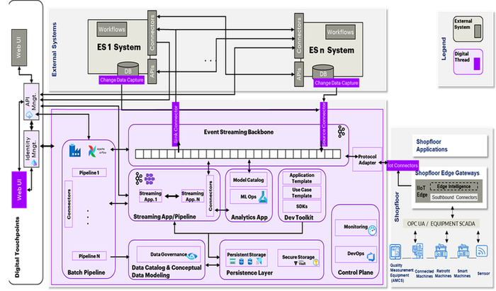

## 

# Detailed Views

The IX Digital Thread Foundations architecture is described below using three view levels. The top level is the box description of the overall system together with box descriptions of all contained building blocks and the Personas that will interact/use the Framework Services. The second level zooms into some building blocks of the top level. It contains a box description of selected building blocks of the top level together with box descriptions of their internal building blocks. The third level view zooms into selected building blocks of the second level. Each of the three levels is diagrammed on the pages that follow.

### 

## Top-Level Building Blocks

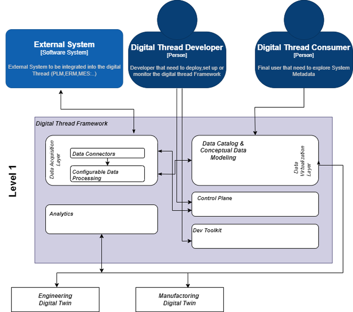

### 

## Second-Level Building Blocks

The second level zooms into some building blocks shown in the top-level view. It contains the box description of selected building blocks of level 1 together with box descriptions of their internal building blocks.

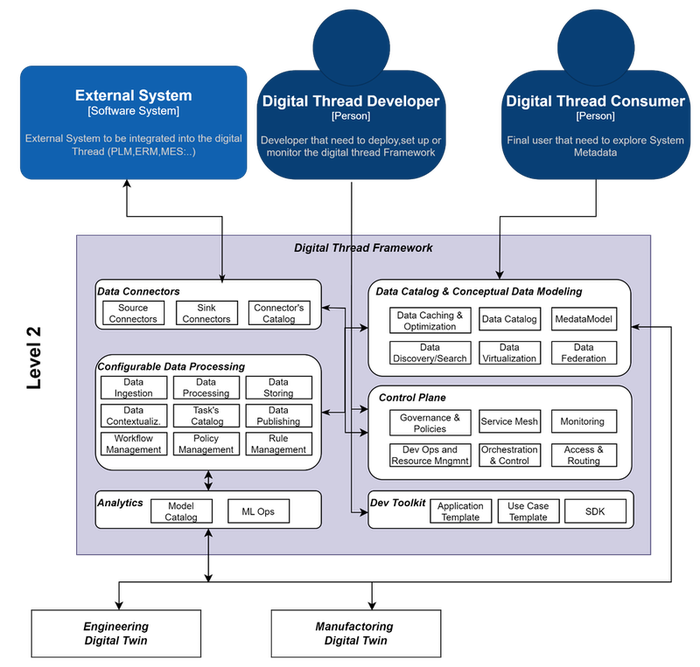

### Third-Level Building Blocks

The third level view has been split into two parts - User view and Developer view.

**User View**: Covering the use cases where the end-user leverages the Platform Modules to do Metadata and Data Discovery, querying through the available connectors, data catalog services, and data transformation/storing.

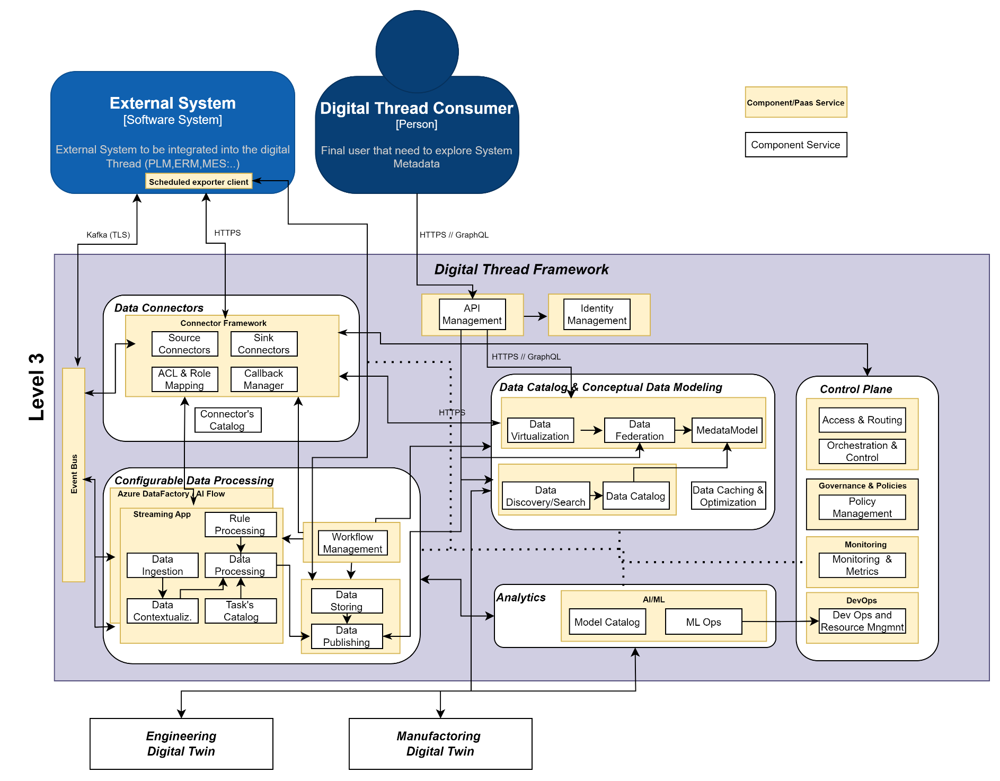

**\
Developer View**: How the developer is using Tooling, SDK, and Accelerators to create new business logic/connectors in the DT framework.

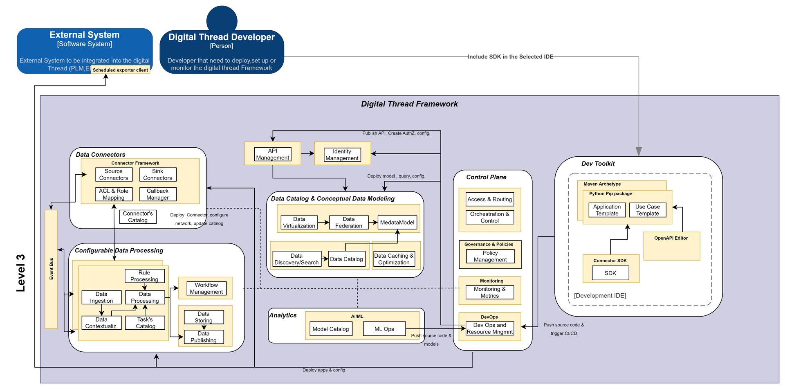

## Features and Functions

The table below lists the roles and functions of the various parts of the IX Digital Thread Platform that are shown in the previous diagrams.

### Data Connectors

| **Function** | **Responsibility** |
| --- | --- |
| Source Connector | It includes the connectors that are specifically created to gather data from a specific data source. Protocol, integration pattern, and connector specialization will depend on the use case and System to connect |
| Sink Connector | It includes the connectors that are specifically created to export data from another system. Protocol, integration pattern, and connector specialization will depend on the use case and System to connect |
| ACL / Role Mapping | To manage Access Control Logic and provide Role mapping capability. The combination of both enables the definition of fine fine-grained access logic. |
| Callback Manager | It provides endpoints, notification mechanisms, and retry logic to receive callback in an asynchronous process. |
| Connector Catalog | It is the catalog of all the available connectors. The connector can be a ready-to-use one or just the template to facilitate the creation of a new connector. Release by release the catalog will be enriched with the ad hoc connectors created to integrate specific system industry by industry. To simplify the creation of the connector by the External Team, a connector SDK on Java will be created supporting the main important protocols and already aligned with the DT platform security, logging, and monitoring approaches. |
### Configurable Data Processing

| **Function** | **Responsibility** |
| --- | --- |
| Data Ingestion | Responsible for collecting data from various data sources-IoT devices, data lakes, databases, and applications. This process usually includes the Data Source access and authorization. It can be handled in a pull or push mode, in a batch or real-time fashion. It may include data validation or data filtering steps to validate and eventually correct or clean up the data to be processed. Depending on the use case, data will then need to be Validated Processed, Stored, or Published to the serving layer or another system. |
| Data Processing | It includes all the tasks required to normalize and transform the data in such a way that it is then stored or consumed by the use case applications. As for the data ingestion, the data processing can be done in a batch or real-time (streaming) mode. Depending on the approach and the volumes involved, it may require using different software stacks. The task can read dynamically their business logic from the Data Catalog API or can be use case specific. Common tasks or functions are already available as pre-built tasks that the developer will be able to search and select in the Task Catalog. Developers can also create custom tasks starting from Template or leveraging on the available Accelerators (SDK, Wizard\...) |
| Data Storing | It may be required to store the data in different processing stages (raw, normalized, processed, staging status, etc.) to track all the relevant and historical aspects of the data processing. Each datatype will require a specific type of storage or format to maximize efficiency and minimize cost consumption. Data retention and data policy for each type of storage are managed in the data governance module. Depending on the type of data (Sensitive/Private), it will be required to obfuscate or encrypt the data at rest |
| Data Contextualization | Leveraging the Data Catalog Metadata model creates a semantic enrichment of the data, providing a connection across the ingested and siloed data to provide a contextualized view of the processed data. |
| Data Publishing | Processed data can be consumed by internal application through API or via Kafka. Data can be also published to external systems through specific Connectors |
| Workflow Management | When data processing requires human interaction or complex asynchronous execution, workflow management is needed. Workflow Management includes event-based processing and time-scheduled processing. |
| Tasks Catalog | Catalogue of tasks, actions, and operations provided by the framework within the data processing context. Functional container of tasks that can be activated for the connectors and ETL pipelines. |
| Rule Management | Rule Management defines, implements, and maintains rules governing data processing. It ensures data integrity, consistency, and compliance by automating validation, transformation, and quality checks. The Rule Manager integrates with data sources, executes rules, monitors performance, and supports scalability, compliance, and auditing for reliable data management. |
### Data Catalog and Conceptual Data Modeling

| **Function** | **Responsibility** |
| --- | --- |
| Data Caching and Optimization | Data Catalog APIs are massively queried by the Digital Thread Ecosystem to retrieve Metadata or Data Asset information. Some of these types of information are static many others instead are changing quite frequently. It is crucial to have well-tuned data caching to avoid the data catalog being the bottleneck and at the same time to provide up-to-date information to the consumer system/user. |
| Data Catalog | It provides an up-to-date inventory of the Ecosystem Asset and related metadata. It can be queried via API or WebUI to get information on where to find specific data information or to understand the meaning of a specific term across the different systems (Glossary). It also offers a set of connectors to integrate assets coming from the different frameworks and to update them on an event base. It is possible to also configure data scanning and data Lineage of the connected systems. It leverages the Metadata Model to provide a holistic view of how the different assets and entities are connected and can be enriched with Entity data mapping to have information on the data transformation required to handle the same Entity across different systems. |
| Metadata Model | It represents the Metadata Model Schema of all the Entities managed in the integrated systems. It provides information on how the data assets are integrated, on the semantic connection, and can be enriched with all the technical information that can be useful for data Mesh and impact analysis use cases. The Metamodel can be integrated/federated with other Domain Models/Ontology to extend use cases or to leverage external Digital Twin solutions. |
| Data Discovery/Search | Thanks to the Metadata Model and the out-of-the-box text search capability it is possible to search for asset information and get asset dependency and related information |
| Data Federation | Integrating the Metadata Model with the Virtualization engine and the Identity access management, it is possible to create a use case where different data systems are federated to provide authenticated users access to the required data meshed in a single view. |
| Data Virtualization | To enable data Federation or the Data Mesh use case, a Data Virtualization engine is required to get data from heterogeneous sources in a near/ real-time approach |
### Analytics

| **Function** | **Responsibility** |
| --- | --- |
| Model Catalog | Set of Model use case based to provide insight on the processed data |
| MLOPs | Tooling to support Data Scientists and Data Engineering in the full Model life cycle management |
### Control Plane

| **Function** | **Responsibility** |
| --- | --- |
| Governance and Policies | It handles all the processes and policies for Data Governance including data privacy, data retention, data classification, policy management. |
| Service Mesh | It controls how the different services interact together and provides service discovery and service availability |
| Monitoring | Infrastructure and Application Monitoring services and Tooling to provide a single pane of glass to control Application and Infrastructure Status and to simplify Troubleshooting in case of errors |
| Dev Ops / Resource Management | Dev Ops Tooling and Set of CI/CD pipeline to speed up the Deployment of the Digital Thread use case infrastructure and Applications |
| Orchestration and Control | Workflow Manager and Orchestrator Framework to develop and control data flow and data Pipelines |
| Access and Routing | Identity Access Management System to enable user and System Access to API and Data for the Defined Use cases. |
### Dev Toolkit

| **Function** | **Responsibility** |
| --- | --- |
| SDK | Software Development Kit is an accelerator providing a collection of libraries, default configurations, tools, and extension points to implement a Connector compliant with DT guidelines. |
| Application Template | An application template is a pre-designed framework or blueprint that serves as a foundation for creating software applications. It provides a structured starting point, including predefined components, layouts, and functionality, to streamline the development process. Application templates are often used to accelerate the creation of common types of applications |
| Use Case Template | Patterns or common application use cases based on the connectors, data catalog, workflow engine, data storage, etc. |
| OpenAPI Editor | OpenAPI editor to create and document API definitions. OpenAPI descriptors are used to define the API behavior and provide API documentation. |
## 

# Adoption Approach

Each of the components listed above has a different adoption approach. The four main approaches that have been identified are listed in the table below.

| Approach | Description |
| --- | --- |
| Reusable | The component can be reused with a minimal level of configuration. |
| Templatable / Configurable | The component is provided as a template or as a not complete artifact and an intermediate to a high level of customization is needed. |
| Change by Industry | Given a Use Case belonging to a specific industry, the component must be implemented according to the industry-specific requirements and best practices. |
| Project specific | Each project needs to implement the component based on its specific requirements. The diagram below is color-coded to indicate which approach is used for each component. 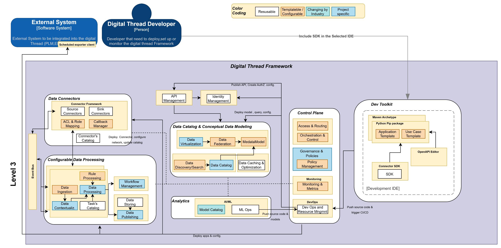
|  |

## 

# Software Stack 

**Matrix**

The matrix below details what software to use on Azure.

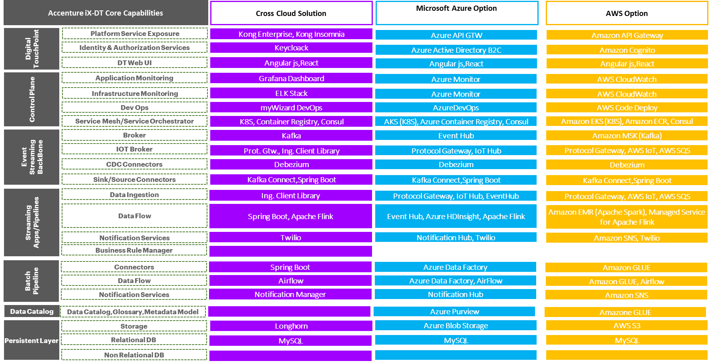

**Selection**

The next page describes the main principles followed for the Software Stack Selection:

-   Following the Cloud Native principles, the decision was made to leverage massively on Managed Backing Services (Persistence Layer, Monitoring, Access Management, DevOps, etc.) and treat them as attached resources to maximize Cloud Portability

-   Similar approaches have been used for core services like Data Batch Pipelines since each Cloud provider has its mature native solution already proven in terms of scalability, resiliency, and integration with the other SaaS and PaaS services.

-   Modules that have been custom created (Connectors, Streaming Apps, and other Custom App, Web UI) must be designed as Containerized Microservices to have an almost zero effort cost on portability.

### Batch Pipeline Layer

The Batch Pipeline layer uses batch‑based workflow engines to manage and automate complex data workflows that span both on‑premises and cloud data sources.

Two complementary pipeline engines have been selected to provide a robust and flexible solution.

The first is **Azure Data Factory (ADF)**, a cloud‑based, low‑code data integration service from Microsoft. ADF enables users to create, schedule, and orchestrate data‑driven workflows that handle data movement and transformation across a wide range of sources and destinations.

The second is **Azure Data Factory\'s Managed Airflow service**, which provides a simple and efficient way to create and manage Apache Airflow environments. This service supports running data pipelines at scale and allows teams to orchestrate custom tasks on Kubernetes or other frameworks with minimal overhead.

-   Both ADF and Managed Airflow offer extensive connector libraries for integrating with diverse data sources and services.

-   ADF excels with its native connectors for Azure services, while Airflow benefits from a broad and continually growing collection of community‑contributed connectors.

### 

------------------------------------------------------------------------

The Event‑Streaming Backbone is implemented through a streaming platform designed to handle high‑volume, real‑time data flows across the architecture. At its core is Apache Kafka, an open‑source distributed streaming platform built for managing continuous streams of data with high throughput and low latency.

Kafka provides a publish-subscribe messaging model, where producers send messages to topics and consumers subscribe to those topics to receive the data. It is architected to be highly scalable and fault‑tolerant, capable of processing large workloads while maintaining durability through persistent storage and replication of data-even in the event of failures.

Kafka also supports real‑time stream processing, enabling consumers to process data as it arrives. This makes it suitable for real‑time analytics, event‑driven architectures, and data‑integration pipelines. Kafka\'s strong durability guarantees ensure that data can be retained for a configurable period, while its horizontal scalability allows deployments to be spread across multiple servers to accommodate growth and improve fault tolerance. Robust partitioning and parallel processing further enable efficient distribution of workloads across multiple consumers.

Within the Digital Thread architecture, the streaming backbone provides integration across layers by:

-   receiving data from external systems, including CDC (Change Data Capture) sources and IoT systems

-   publishing data to streaming pipelines, batch pipelines, and analytics applications, which in turn write their processed data back into the streaming backbone

This design ensures continuous, reliable, and real‑time data movement across the entire ecosystem.

### 

------------------------------------------------------------------------

Streaming Apps are custom applications built as part of the Digital Thread, typically developed in Java, Spring Boot, or Python and hosted on Azure Kubernetes Service (AKS). These applications can process data in both batch (request/response) and real‑time (streaming) patterns.

For batch request/response workloads, orchestration is handled by the batch pipelines. For real‑time processing, the applications subscribe to data streams from the streaming backbone, process the incoming data, and publish the results back to the same backbone.

### 

------------------------------------------------------------------------

### Analytics Apps Layer

The Analytics Apps layer consists of two modules: **ML‑Ops** and the **Model Catalog**.

The ML‑Ops module uses Azure Machine Learning, a cloud service that accelerates and manages the end‑to‑end machine‑learning lifecycle. It enables data scientists and engineers to train models, deploy them, and handle operational workflows for productionized ML systems.

The Model Catalog module provides a set of model‑driven use cases that generate insights from processed data. It leverages the Azure Machine Learning Model Registry to organize, track, and manage trained models.

### Data Catalog / Conceptual Data Modeling Layer

The Data Catalog / Conceptual Data Modeling layer focuses on Data Governance, implemented using Microsoft Purview. Purview provides a unified, centralized view of data assets across on‑premises, multi‑cloud, and SaaS systems. It enables users to discover, access, annotate, and classify data using business glossaries, data classifications, and metadata attributes that strengthen governance and improve searchability.

Industry Framework Domain models will be automatically imported into the catalog to provide a baseline for customization. The Data Catalog serves as the core location for understanding entity relationships and properties, facilitating data discovery across the ecosystem. Features such as Data Lineage and Data Quality are also included to support traceability and ensure trusted data.

### 

------------------------------------------------------------------------

The Persistence Layer consists of two modules: **Persistent Storage** and **Secure Storage**.

The Persistent Storage module provides several storage options to support different types of data across the ecosystem:

-   Azure Blob Storage for data files, logs, configuration files, and similar artifacts

-   Azure Managed SQL Server and MySQL for relational data

-   Azure Data Explorer for monitoring events and time‑series workloads

The Secure Storage module handles the protection of secret information. The primary service for this is Azure Key Vault. For integration with the service‑mesh architecture and the HashiCorp Consul control‑plane approach, HashiCorp Vault will also be used.

### 

------------------------------------------------------------------------

The Control Plane consists of three modules:

-   **DevOps**

-   **Governance and Policies**

-   **Monitoring**

Firstly, the DevOps module uses Azure DevOps Pipelines, a cloud‑based service that automates the building, testing, and deployment of code.

It supports major languages and project types, combining CI/CD to efficiently build and deliver software in a secure and repeatable way.

The Governance and Policies module focuses on maintaining compliance, managing risk, and ensuring operational consistency. Using tools such as Open Policy Agent and automated policy enforcement, teams can define clear rules, monitor adherence, and adjust policies as requirements evolve.

The Monitoring module is implemented with Azure Monitor, which collects logs, telemetry, and usage data from workloads running on Kubernetes, VMs, and PaaS services. Azure Monitor provides consolidated dashboards, metrics, and alerting capabilities for system operators.

### 

## Dev Toolkit Layer

The Dev Toolkit layer consists of three modules:

-   **SDKs**

-   **Use‑case Templates**

-   **Application Templates**

The SDKs module provides a set of tools, libraries, documentation, and code samples that help developers build components-such as connectors-for the Digital Thread platform. These SDKs simplify development by offering standardized, pre‑built functionality and enabling developers to interact with platform services without building everything from scratch.

The Use‑case Templates module offers predefined patterns for common application scenarios. These templates are based on platform components such as connectors, the data catalog, the workflow engine, and data storage, giving teams a consistent starting point for implementing typical Digital Thread use cases.

The Application Templates module provides pre‑designed, pre‑configured frameworks for building specific types of software applications. These templates include reusable components, functionalities, and design elements that can be customized to meet project‑specific requirements. They help streamline development and reduce the effort required to create applications from the ground up.

### 

------------------------------------------------------------------------

The **API Management layer** contains a single module: **API Management**.

This module is implemented using **Azure API Management (APIM)**, a comprehensive platform for managing, securing, and monitoring APIs at scale. APIM enables organizations to publish APIs for external, partner, and internal developers, providing a controlled and consistent way to expose data and services while ensuring security, performance, and observability.

### 

------------------------------------------------------------------------

The **Identity Management layer** consists of a single module: **Identity Management**.

This module is implemented using **Azure Active Directory (Azure AD)**, which provides secure and efficient management of users, groups, and access to resources. Azure AD enables centralized identity control, authentication, and authorization across the platform, ensuring that only approved users and services can access the system.

## Application Architecture Approach and Principles

The following requirements are based on standard software qualities.

| **Goal/Requirement** | **Architectural Approach** |
| --- | --- |
| Extensibility | Extensibility expands the features of software. Multiple approaches are available. DT adopts both the Glass-Box (source code is known but cannot be modified) and the Black-Box approach (source code is unknown, only interface specifications are provided). Glass-Box is adopted to develop the SDK. The Black-Box approach is used for all other cases. |
| Security | DT adopts the \"Security by Design\" approach. Architecture and design must encompass security guidelines and industry best practices. Security scans (SAST, DAST, and OSS scans) are done periodically to validate the solution against the regulations and guidelines provided. Considering the complex deployment models that may span from cloud to on-premises to edge, the solution must be validated with the Security SME of IT and OT. |
| Maintainability | Maintainability minimizes the cost of keeping the code effective and efficient. DT implements Maintainability by adopting industry standards and frameworks with a proven maintainability capability (i.e., Spring Boot, Java, Python, Kubernetes, etc.) and defining guidelines and processes |
| Traceability | Traceability enables the correlation of multiple processes and executes the observability of the systems. DT adopts OpenTelemetry for instrumenting, generating, collecting, and exporting telemetry traces. Considering DT\'s distributed nature, and the observability that the digital thread may have, the Observability framework must include a solution to gather logs and events from edge and on-premises deployment. Edge, On-premises Deployment. The cloud providers are already mature in providing observability capability on cloud deployment that must be extended to cover the event gathering from device or edge deployment. |
| Operability | Operability is based on best practices, processes, frameworks, and technologies. DT obtains operability from Kubernetes, Container Images, and DevOps. |
| Isolation | Isolation is inherited by software infrastructural components that provide out-of-the-box capabilities. |
| Scalability | DT inherits scalability from the founding technologies like Kubernetes and the Azure PaaS services. |
| Availability | DT implements high availability by adopting an architecture void of a single point of failure. |
### 

# Data Architecture Approach and Principles

| **Goal/Requirement** | **Architectural Approach** |
| --- | --- |
| Accuracy and Consistency | DT integrates an open-source data quality tool (Great Expectation) that can be integrated into the data pipelines framework to set policy and validate the quality of the data sources in terms of data source interface, data structure, and data values. DT provides a catalog of the main common policies and a manual to create custom ones together with the framework already integrated with the supported data pipelines. |
| Freshness | The platform enables both real-time and batch data integration to support different types of data freshness needs. CDC patterns can also be evaluated to consume the data as soon as it changes at the data source level. All data movements and data transformations include timestamp information to provide information to the data consumer about when the data was extracted, loaded, transformed, etc. |
| Accessibility and Confidentiality | Only approved users can access data. Different levels of access management are configured to enable secure access only to relevant users and to only the required specific resources. The DT data catalog also provides a data entity classification where data resources are classified as per different levels of confidentiality. Rules of access or filtering can also be applied as a classification method. |
| Efficiency | Data governance and data retention rules maintain data in the required data storage only for the stipulated time. Doing this improves efficiency in managing access to data as well as reduces data storage and maintenance effort and costs. |
| Traceability | The selected data catalog provides data lineage services that are extended using OpenLineage, an open-source solution. |
| Understandability | The DT data catalog provides a data glossary that can be configured for different departments to have a multi-glossary specific to business processes. It can be linked with the technical entity or data asset to enable the business concept with technical data mapping. |
| Availability | DT sets different levels of availability depending on the use case, the amount of data to be searched, and the used storage. |
| Portability | Data import and data export scenario is enabled, thus leveraging the selected data pipeline and DT connector to also enable the data migration use case. This can also be integrated with data validation, data enrichening, or data transformation tasks that are provided or templatized or through How to Documentation |
| Recoverability | Disaster Recovery Procedures are implemented. |
## 

# Deployment View

The deployment view describes the technical infrastructure used to execute the client system with infrastructure elements such as geographical locations, environments, computers, processors, channels, and net topologies. Moreover, the deployment view depicts the mapping of the software building blocks to these infrastructure elements, the standard deployment environment, and patterns and security aspects that are embedded into the architecture.

The following IaC (infrastructure as a Code), processes have been defined to deliver stable environments rapidly and at scale. They avoid manual configuration of environments and enforce consistency preventing runtime issues caused by configuration drift or missing dependencies.

The Processes followed leverage on Cloud Provider CI/CD pipelines PaaS services and include also Quality Check GTWs to:

-   Validate Code Quality Coverage (Sonar)

-   Scan Containers Vulnerabilities (Prisma Scan)

-   Perform Regression or Sanity Tests in an automated Way (JMeter, Selenium, PlayWright)

The following diagram shows the CI/CD processes that must be followed to release new packages in Azure.

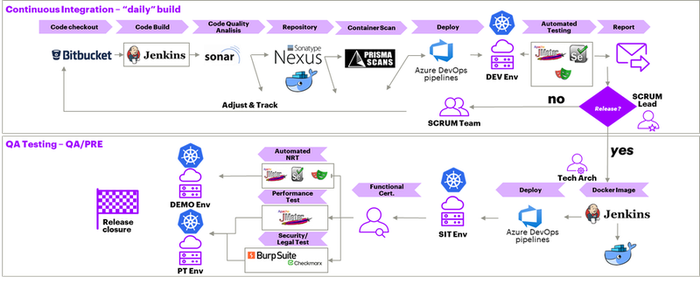

## 

## Deployment Architecture

Deployment on Microsoft Azure is an IT-centric, cloud-only approach.

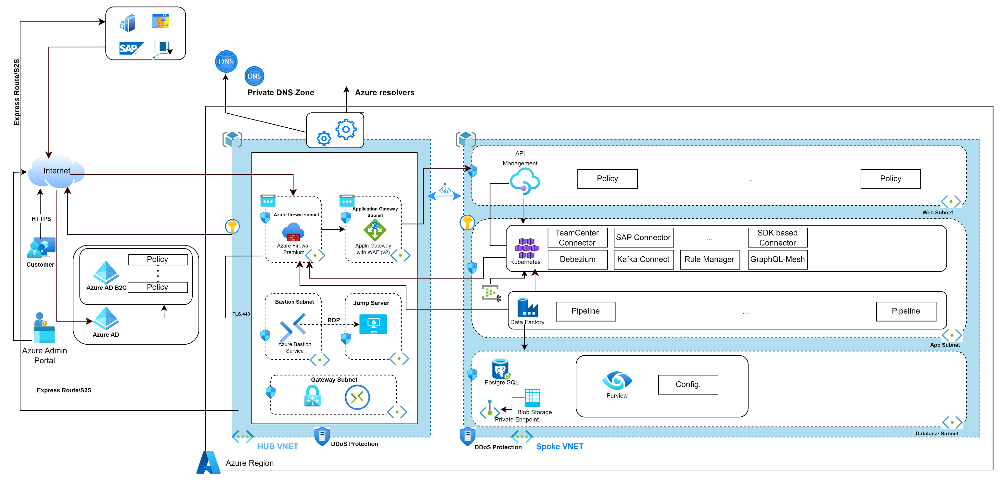

To minimize the execution costs, IX-DT is deployed into a single Azure Region, services are provisioned in a single Availability Zone.

### 

## Security Architecture

The architecture adopts the Security-By-Design approach and with this goal, the deployment architecture derives many decisions from the Security review executed on the high-level architecture shown in the previous chapters.

The Security Architecture is based on the hub-and-spoke pattern to implement a central point of control for any data path defined in the architecture. The network architecture inherits the pattern and implements the hub-and-spoke model leveraging on a central firewall acting as a hub. More details are available in the next pages.

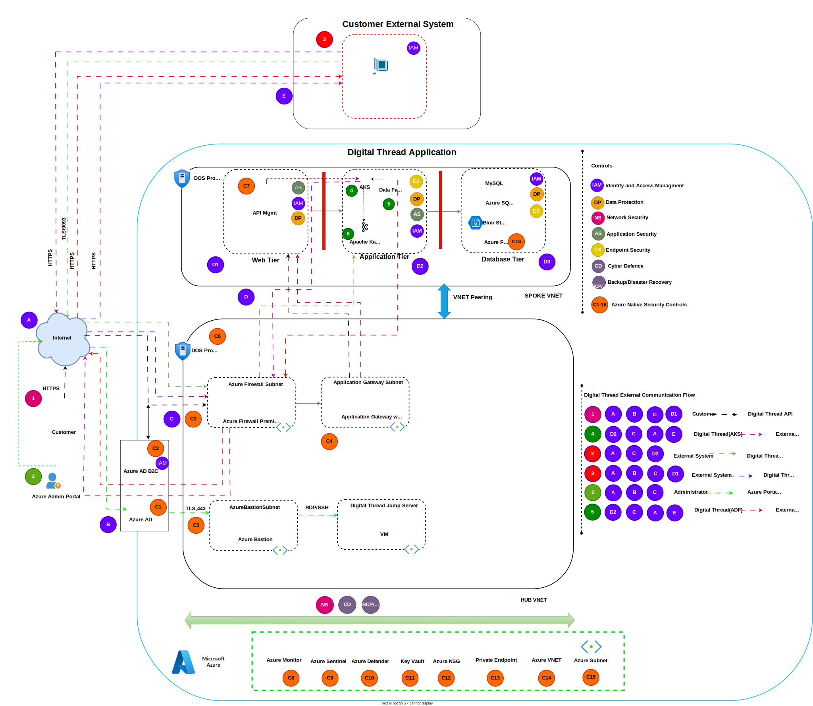

### Network Architecture

Azure Bastion is a fully managed Platform-as-a-Service (PaaS) solution by Microsoft that provides secure and seamless remote access to virtual machines (VMs) in Azure. It eliminates the need for exposing VMs to the public internet, reducing attack surfaces and enhancing overall security. In a production environment, Azure Bastion can be a crucial tool for managing and troubleshooting VMs and other resources without the complexity of setting up VPNs or managing jump servers.

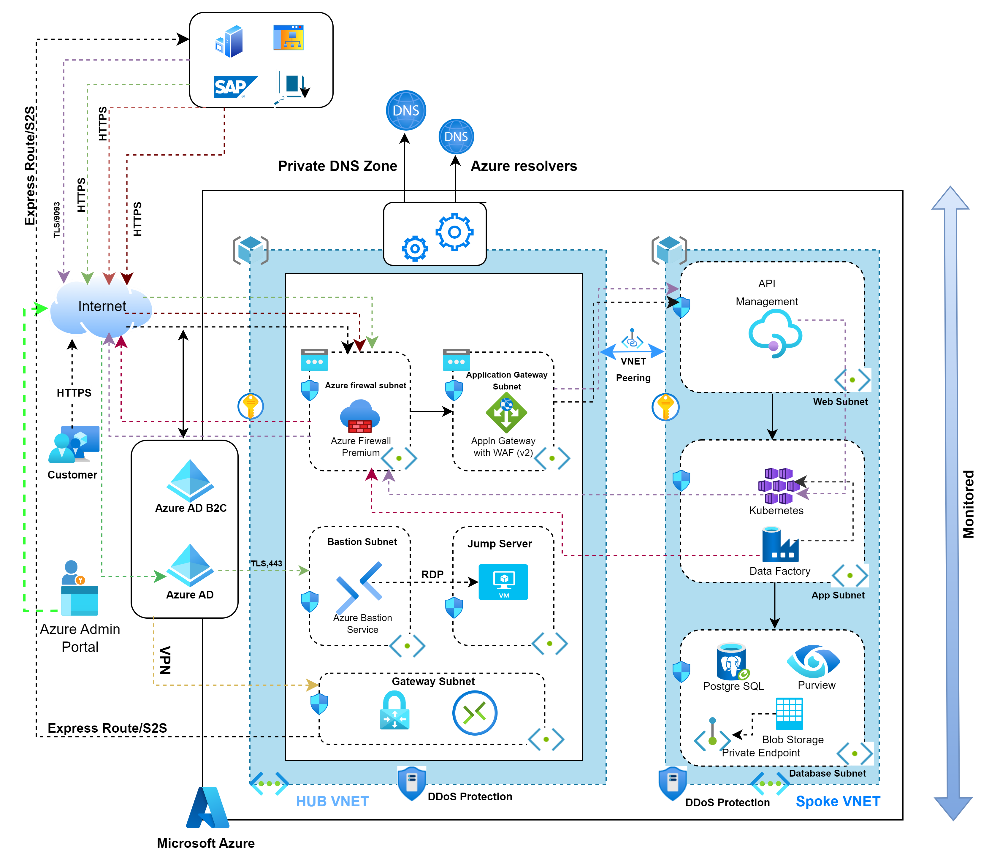

## 

# Runtime View

The runtime view describes concrete behavior and interactions of the system\'s building blocks such as:

-   Execution

-   Interactions between external interfaces

-   Operations such as launch, start-up, and stop

-   Errors and exceptions

The core capabilities of Digital Thread enable:

-   Integration across IT Systems - connectors for SAP ERP and PLM TC have been implemented (beta version) to support both real-time and batch integration.

-   Creation of domain model, meta-model, and glossary on the selected Data Catalog (Purview).

-   Distributed real-time queries across heterogeneous service exposure to provide a single access point to the applications.

-   Validation of required use cases on the selected framework (GraphQLMesh)

Each of the points above are described in detail below.

### Integration across IT Systems 

There are multiple ways the Digital Thread integrates and interacts with the different IT Systems:

-   **Real-time** access to the data with CRUD APIs. Access through API may require combining the results of different APIs. Check the distributed runtime query for the suggested approach.

-   **Batch**-based integration of data

-   **Change-based** integration of data (using change data capture)

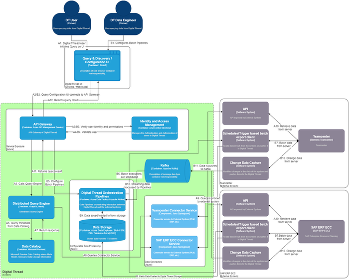

### 

## Domain Model and Glossary Management

Different User Personas can access and use DT\'s data catalog. The following diagram depicts a data flow for the dynamic and sequence views for the Domain Model, Glossary.

In this flow, two personas are defined:

-   A Data Curator is the Entity or Domain Model, that creates, and updates the data glossary, defines the data asset, creates classification policies, etc.

-   A Data Engineer (Data Reader) can read the created Domain Model, surf the data glossary, and potentially trigger a query on the data if enabled on the RBAC.

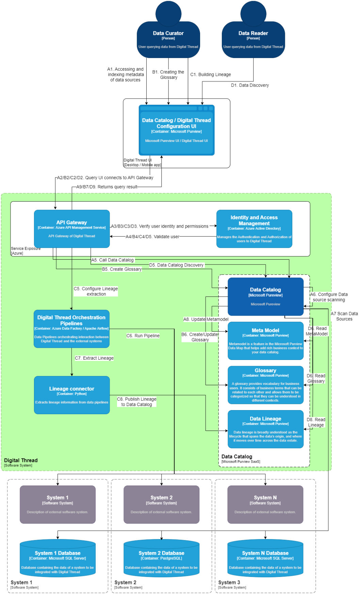

### Distributed Runtime Query

Users can query with a single request multiple data sources (i.e., persistent storage sources, external systems exposing query-able API) configured on the Data Federation modules and compose each distinct data source response into a unified response by aggregating data. Data aggregation logics are configured on the Data Federation module. The following figure depicts the Dynamic/Sequence view for Distributed Query Management.

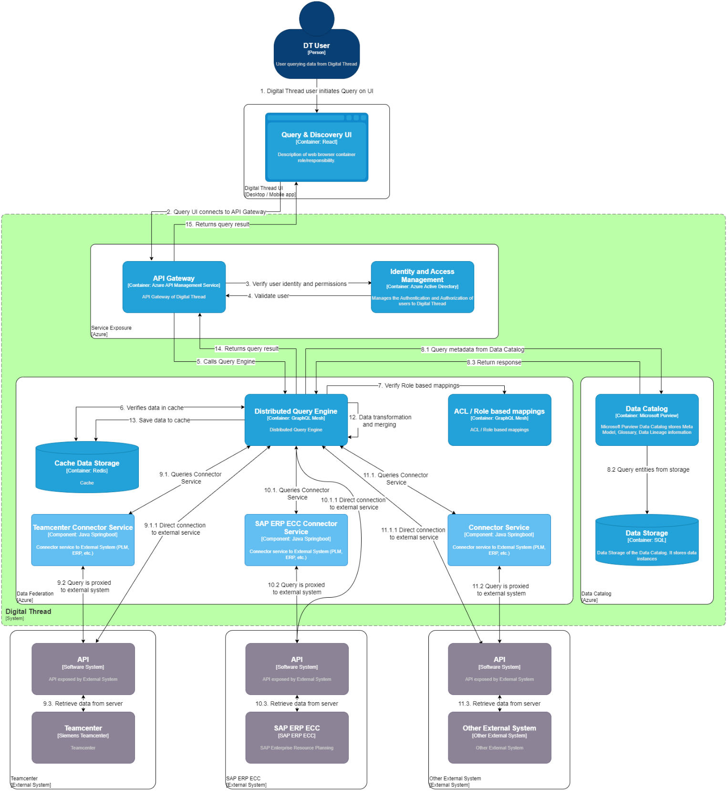

## 

# Cross-cutting Concepts

This section describes overall, principal regulations and solution ideas that are relevant in multiple parts of the system. Such concepts apply to multiple building blocks.

### Integration Patterns

Digital Thread\'s fundamental role is to enable the integration of siloed systems. The framework implementation must rely on the most used and validated integration patterns together with providing connectors that are specialized to support the specific custom integration that the integrated system is providing (check later the integration pattern for SAP and TC).\
The integration can be done at the application level in Real-time or Batch Fashion and at the storage level too. API Integration patterns revolve around the integration of application programming interfaces (APIs) provided by different systems or services.

There are different types of integration Patterns to be considered:

-   REST API (HTTP (S))

-   Change Data Capture (CDC)

-   Publish/Subscribe (Pub/Sub)

-   Direct Data Source Connection

#### REST API (HTTP(S))

These patterns support real-time use case management with synchronous responses, although asynchronous implementations are also possible. The API Guidelines document specifies the required standards for designing and developing REST APIs. Modules supporting this integration pattern include DT Apps and Modules, which will provide their services via REST API. External clients must access these services through the API Gateway to ensure authentication. Additionally, the Data Governance module offers APIs for interacting with technical metadata, business metadata, classifications, entity relationships, lineage information, and data quality information. These APIs can be utilized and potentially enhanced by batch pipelines and streaming applications.

####  Change Data Capture (CDC)

This pattern is used to capture and propagate incremental changes made to a database or data source in real‑time or near‑real‑time. It works by identifying individual data modifications-such as inserts, updates, and deletes-and making those changes available for downstream processing or synchronization with other systems. Change Data Capture (CDC) enables this integration pattern by collecting change events from the various external systems connected to the Digital Thread.

####  Publish/Subscribe (Pub/Sub)

The Publish/Subscribe (Pub/Sub) pattern is a messaging approach used to enable decoupled, asynchronous communication between multiple components or systems. In this pattern, publishers send messages to a topic or channel without targeting specific receivers, while subscribers register their interest in particular topics or channels and receive messages published to them. Within the Digital Thread architecture, this pattern is supported by services such as Apache Kafka and MQTT brokers. Modules that enable this integration capability include the external system connectors-both source and sink-which interface with the Streaming Backbone to publish data to it or consume data from it. Streaming Apps and the ML Ops components also make use of the Pub/Sub pattern through their integration with the Kafka‑based Streaming Backbone.\
Direct Data Source Connection

Direct Data Source Connection refers to the use of connectors provided by various third‑party systems integrated into the Digital Thread to establish direct connections to data storage, databases, and services. This approach allows information to be read from or written to these systems seamlessly, without relying on intermediaries or additional layers. This integration pattern is enabled through the Batch Pipeline-using Azure Data Factory and Apache Airflow with their built‑in connectors-and through the Data Governance module, which leverages Microsoft Purview\'s connector capabilities.

See the established [Connector Integration Pattern](https://ts.accenture.com/:u:/r/sites/GlobalDocTemplates/Published%20Documents/IX%20Thread/Linked%20Files/Connector_Integration.zip?csf=1&amp;web=1&amp;e=66kr56) for further details.

### 

## Event Dispatching

Most Frameworks have applications that are not designed with event-driven architectures (EDA) in mind, which makes it difficult to enable multi-system alignments. There are different approaches to getting data out of the system in an event-driven way - scheduled query of the legacy databases, setting up Change Data Capture (CDC) mechanism on databases, or refactoring existing systems to publish events from the application layer, for example. In all these cases, the liberated events must be made available on an event broker so other services can be triggered by them.

The CDC approach is the most efficient of them all and is also the least taxing on the sourcing system. If the CDC is not feasible, then the polling approach is recommended. The following images show the approaches used for CDC and polling methods.

**CDC with Debezium and Kafka**

This Solution enables the gathering of Data Changes at the Source system DB level, transforming the data, and eventually triggering action to align the interested system via Rest API through the Kafka Sink Connector.

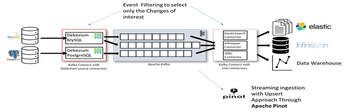

**Polling through Kafka**

This solution enables querying the external system via HTTP Rest and OData source connector. Also, in this case, the events are then made available to the broker for processing.

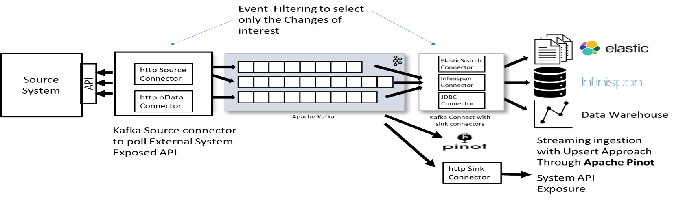

### 

## Monitoring Approach

The Digital Thread Platform version on Azure will heavily rely on Azure Monitor which is a comprehensive monitoring solution offered by Microsoft Azure. It provides a wide range of capabilities for monitoring and logging various aspects of your applications, infrastructure, and services running in Azure.

The following software stack will be used for logging and monitoring (The same architecture and software stack supply both infrastructure and application monitoring):

-   Azure Monitor

-   Grafana 9.5.2 or later

Azure Monitor offers Operational and Infrastructure Teams both monitoring capabilities to track KPIs related to application and infrastructure health and performance, as well as logging capabilities to capture and analyze log data from various sources.

Microsoft provides customized functionality meant to act as a starting point for monitoring the services, they are curated visualizations with the larger more complex of them being called Insights. Application Insights can track and monitor KPIs related to application performance, availability, and user experience. Container Insights allows you to monitor KPIs related to container health, performance, and resource utilization. Monitoring solution designed specifically for Azure virtual machines called VM Insights and for Azure network resources called Network Insights.

Grafana will be used for Application monitoring and will be integrated with Azure Workbook used for infrastructure monitoring.\
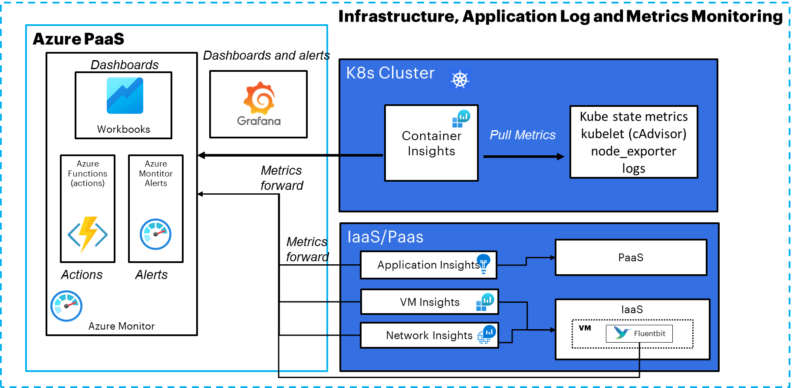

The above diagram shows how the different modules the DT will consist of will interact with the Azure PaaS service to handle the Logging and KPI data that will be used for monitoring.

The following paragraphs explain the approach to use for various scenarios:

#### Kubernetes (K8s)

Azure Monitor provides monitoring and logging capabilities specifically for Kubernetes clusters and workloads. Here is the data flow:

**Data Collection:** Azure Monitor collects data from Kubernetes clusters using the Azure Monitor for Containers solution. It retrieves metrics and logs from various Kubernetes components like nodes, pods, containers, and control planes.

**Metrics:** Azure Monitor collects metrics such as CPU usage, memory utilization, network traffic, and more from the Kubernetes cluster. These metrics are stored in Azure Monitor\'s Log Analytics workspace.

**Logs:** Azure Monitor collects logs generated by the Kubernetes components, applications running in containers, and other related sources. These logs include information about events, pod/container lifecycle, and application logs. They are also stored in the Log Analytics workspace.

####  Infrastructure as a Service (IaaS)

For IaaS resources like Azure Virtual Machines, Azure Monitor enables monitoring and logging of the underlying infrastructure. Here is the data flow:

**Data Collection:** Azure Monitor collects metrics and logs from Azure Virtual Machines by leveraging the Azure Monitor Agent installed on the virtual machines. The agent gathers performance metrics and log data from the VMs.

**Metrics:** Azure Monitor collects metrics related to CPU usage, memory, disk performance, network traffic, and more from the Azure Virtual Machines. These metrics are stored in the Log Analytics workspace.

**Logs:** Azure Monitor collects logs generated by the operating system, applications, and Azure services running on the virtual machines. These logs are also stored in the Log Analytics workspace.

####  Platform as a Service (PaaS)

In a PaaS environment, such as Azure App Service or Azure SQL Database, Azure Monitor provides monitoring and logging capabilities specific to the PaaS services. Here is the data flow:

**Data Collection:** Azure Monitor collects performance metrics and logs directly from the PaaS services without requiring any agent installation.

**Metrics:** Azure Monitor gathers metrics related to the performance, availability, and usage of PaaS services. These metrics are stored in the Log Analytics workspace.

**Logs:** Azure Monitor collects logs generated by the PaaS services, including information about application-level events, errors, and diagnostics. These logs are stored in the Log Analytics workspace.

#### 

## ML Ops 

The Digital Thread platform will provide all the capabilities required to support the full life cycle of a Model, which is currently completely aligned with the ML Ops architecture proposed by Azure. This reference architecture shows how to implement continuous integration (CI), continuous delivery (CD), and retraining pipelines for an AI application using Azure DevOps and Azure Machine Learning. This architecture consists of the following services:

[**Azure Pipelines**](https://learn.microsoft.com/en-us/azure/devops/pipelines/get-started/what-is-azure-pipelines). This build and test system is based on Azure DevOps and used for the build and release pipelines. Azure Pipelines breaks these pipelines into logical steps called tasks. For example, the [Azure CLI](https://learn.microsoft.com/en-us/cli/azure/) task makes it easier to work with Azure resources.

[**Azure Machine Learning**](https://learn.microsoft.com/en-us/azure/machine-learning/overview-what-is-azure-machine-learning) is a cloud service for training, scoring, deploying, and managing machine learning models at scale. This architecture uses the Azure Machine Learning [Python SDK](https://learn.microsoft.com/en-us/azure/machine-learning/service/quickstart-create-workspace-with-python) to create a workspace, compute resources, the machine learning pipeline, and the scoring image. An Azure Machine Learning [workspace](https://learn.microsoft.com/en-us/azure/machine-learning/service/concept-workspace) provides the space in which to experiment, train, and deploy machine learning models.

[**Azure Machine Learning Compute**](https://learn.microsoft.com/en-us/azure/machine-learning/service/how-to-set-up-training-targets) is a cluster of virtual machines on-demand with automatic scaling and GPU and CPU node options. The training job is executed on this cluster.

[**Azure ML pipelines**](https://learn.microsoft.com/en-us/azure/machine-learning/service/concept-ml-pipelines) provide reusable machine learning workflows that can be reused across scenarios. Training, model evaluation, model registration, and image creation occur in distinct steps within these pipelines for this use case. The pipeline is published or updated at the end of the build phase and gets triggered on new data arrival.

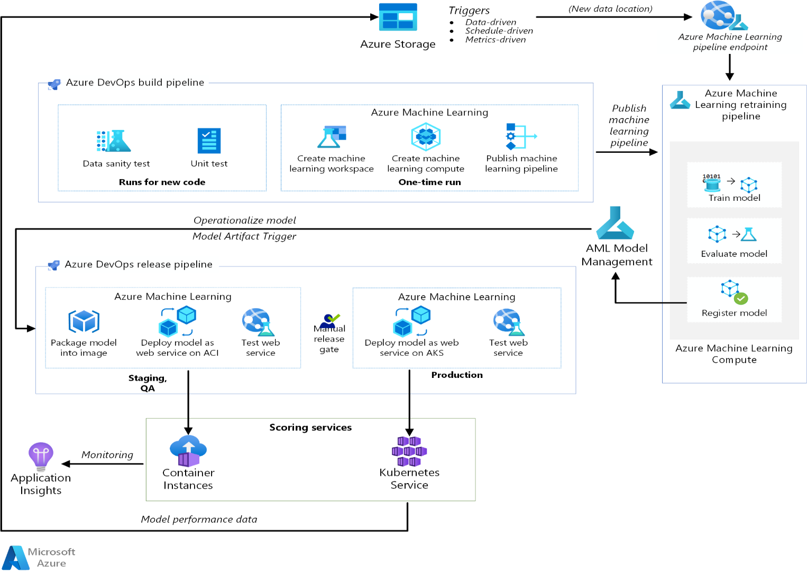

\
[**Azure Blob Storage**](https://learn.microsoft.com/en-us/azure/storage/blobs/storage-blobs-overview). Blob containers are used to store the logs from the scoring service. In this case, both the input data and the model prediction are collected. After some transformation, these logs can be used for model retraining.

[**Azure Container Registry**](https://learn.microsoft.com/en-us/azure/container-registry/container-registry-intro). The scoring Python script is packaged as a Docker image and versioned in the registry.

[**Azure Container Instances**](https://learn.microsoft.com/en-us/azure/container-instances/container-instances-overview). As part of the release pipeline, the QA and staging environment is mimicked by deploying the scoring webservice image to Container Instances, which provides an easy, serverless way to run a container.

[**Azure Kubernetes Service**](https://learn.microsoft.com/en-us/azure/aks/intro-kubernetes). Once the scoring webservice image is thoroughly tested in the QA environment, it is deployed to the production environment on a managed Kubernetes cluster.

[**Azure Application Insights**](https://learn.microsoft.com/en-us/azure/azure-monitor/app/app-insights-overview). This monitoring service is used to detect performance anomalies.
