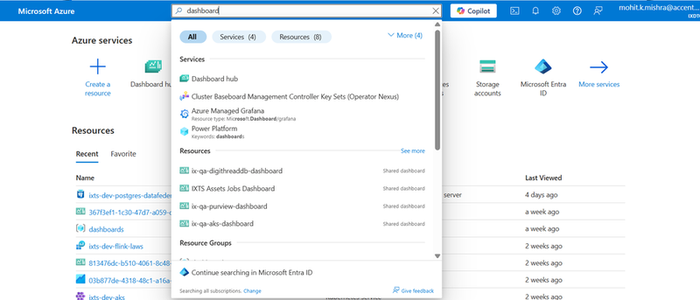
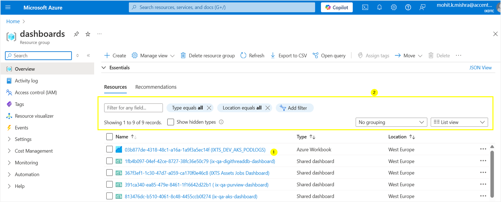
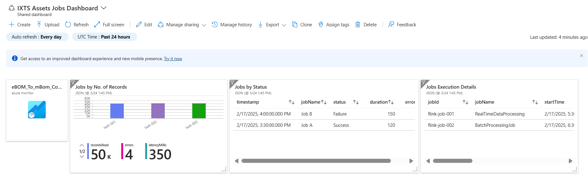
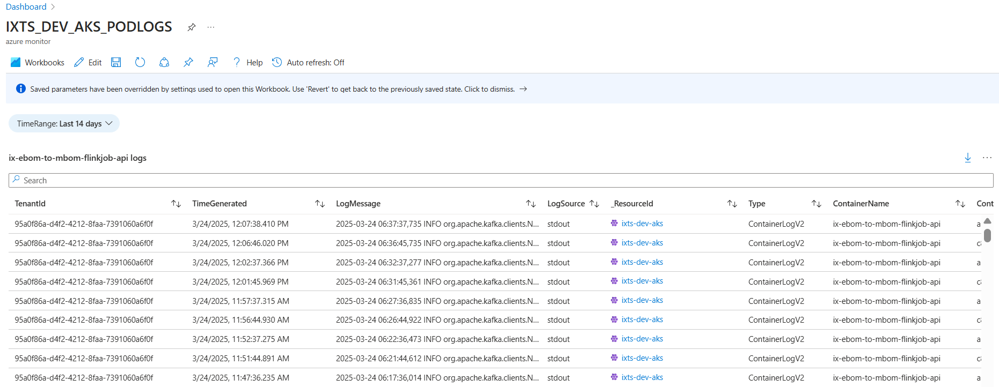

Digital Thread Foundations

Azure Jobs Monitoring Dashboard

TUTORIAL

Release Version: 1.2

Metadata Table

| **Field** | **Value** |
| --- | --- |
| **Asset / Solution Name** | Digital Thread |
| **Domain / Area** | Engineering |
| **Owner (Team/Person)** | Karthik Ramachandra |
| **Reviewers** | Karthik Ramachandra |
| **Status** | Approved / Complete |
| **Confidentiality** | Internal / Confidential |
| **Source of Truth** | [link](https://dev.azure.com/IXAssets/IXAssetsProject/\_git/ixassets) |
| **Related Assets / Alternatives** | AOT / Engineering Orchestration / Engineering Agents |

## Introduction

The Digital Thread Foundations framework is a comprehensive approach to digital transformation. It focuses on leveraging advanced technologies such as Generative AI (GenAI), IoT, cloud technologies, and data engineering to optimize industrial operations, streamline processes, and drive innovation across various sectors. The framework is built around two core elements: Base Components and Industry Templates. Base Components provide the foundational tools, platforms, and methodologies to enable seamless integration and management of digital solutions. Industry Templates offer tailored solutions designed to address specific needs of sectors like manufacturing and engineering. This structured and adaptable approach helps organizations enhance productivity, build resilience, and navigate the evolving digital landscape with sustainable business models.

The Azure Jobs monitoring dashboard is used to monitor and visualize data to drill down and identify issues and patterns, as well as view logs and metrics.

### Purpose

This document serves as a short tutorial on how to view the Azure Jobs Monitoring Dashboard and Flink jobs-related visualizations for the job\'s log, metrics, etc.

### Target Audience

-   Data Management and Governance Team

-   Interface Developers

-   Data Engineers

-   Application Support Team

### Related Links

-   [Digital Thread Foundations Release Notes](https://industryxdevhub.accenture.com/assetdetails/84)

-   [Digital Thread Foundations Documentation](https://industryxdevhub.accenture.com/asset-home;search_text=ix%20digital%20thread)

###  Prerequisites

-   Users should have appropriate access rights to view the dashboard.

-   OpenTelemetry should be enabled at the Flink application level.

-   The Flink application must be deployed to AKS.

-   Application log data and open telemetry data should be available/generated before creating the dashboard.

-   Log data should be visible at the workbook level.

### Technology Stack

-   Azure Kubernative Service (AKS)

-   Azure Log Analytics

-   Azure Workbook

-   Azure Dashboard

-   API Management

### Contacts

-   [karthik.ramachandra@accenture.com](mailto:karthik.ramachandra@accenture.com)

-   [mohit.k.mishra@accenture.com](mailto:mohit.k.mishra@accenture.com)

-   [a.b.palaniappan@accenture.com](mailto:a.b.palaniappan@accenture.com)

-   [geetha.vani.gowri@accenture.com](mailto:geetha.vani.gowri@accenture.com)

### 

# 

## View Dashboard

Log into  and search for dashboards in the search bar to navigate to the Dashboards page.

A dashboard can be selected from the list (1), or the list can be searched/filtered/sorted (2) as per dashboard details to find the required dashboard.

In the Flink job monitoring dashboard below, the visuals show the different statistics and metrics and are static, except for the \"eBOM_To_mBOM_Conversion\" visual.

## View Log Details

Clicking on the \"eBOM_To_mBOM_Conversion\" visual displays the log details.

Below is the sample log workbook showing the last 14 days\' log details for \"**ix-ebom-to-mbom-flinkjob\"** job.

Logs data/details are displayed sorted as per the following columns,

-   TenantId

-   TimeGenerated

-   LogMessage

-   LogSource

-   \_ResourceId

-   Type

-   ContainerName

-   ContainerId

-   PodName

-   PodNamespace
