

Digital Thread Foundations

Azure Monitor

FUNCTIONAL OVERVIEW

Release Version 1.2

Metadata Table

| **Field** | **Value** |
| --- | --- |
| **Asset / Solution Name** | Digital Thread |
| **Domain / Area** | Engineering |
| **Owner (Team/Person)** | Karthik Ramachandra |
| **Reviewers** | Karthik Ramachandra |
| **Status** | Approved / Complete |
| **Confidentiality** | Internal / Confidential |
| **Source of Truth** | [link](https://dev.azure.com/IXAssets/IXAssetsProject/\_git/ixassets) |
| **Related Assets / Alternatives** | AOT / Engineering Orchestration / Engineering Agents |

## Introduction

A digital thread refers to the continuous and consistent flow of information throughout the entire lifecycle of a product or system -- from design and development to operation and maintenance. It enables the integration of data from different stages and sources, allowing effective traceability, seamless collaboration, and efficient decision-making by unleashing the power of sleeping data. The digital thread is considered a key aspect of Industry 4.0 and the digital transformation of the manufacturing industry. It is the core of what we call the Enterprise Operating System (EOS). Digital Thread is a communication framework that helps integrate various enterprise systems involved in the engineering and manufacturing product life cycle.

Azure Monitor, the central monitoring solution provided by Microsoft Azure, plays a crucial role in advancing the objectives of Industry X\'s Digital Thread framework. It offers organizations a comprehensive view of the Azure resources and application performance, availability, and security, delivering real-time insights. Through its robust capabilities, Azure Monitor empowers stakeholders to make informed decisions, proactively manage resources, and ensure seamless operations throughout the digital thread lifecycle.

### Purpose

This document provides an overview of Azure Monitor within the context of the IX-Digital Thread (IX-DT). It covers Azure Monitor\'s architecture, functionalities, and capabilities, focusing on data collection, analysis, visualization, and response mechanisms. Additionally, it delves into practical use cases and best practices for leveraging Azure Monitor effectively for monitoring DT\'s Azure resources and applications.

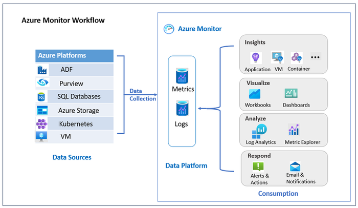

### 

## Target Audience

Software architects, developers, and integrators with IT backgrounds.

### Prerequisites

-   Familiarity with Microsoft Azure Services and Monitoring.

-   Access to an Azure subscription or environment is necessary for practical engagement with Azure Monitor and Azure services.

### Related Links

-   [Azure Monitor overview - Azure Monitor \| Microsoft Learn](https://learn.microsoft.com/en-us/azure/azure-monitor/overview)

-   [Azure Monitor Dashboards UI Guide](https://industryxdevhub.accenture.com/assetdetails/96)

###  Business Contacts

-   [florian.tournier@accenture.com](mailto:florian.tournier@accenture.com)

-   [laura.mosconi@accenture.com](mailto:laura.mosconi@accenture.com)

-   [karthik.ramachandra@accenture.com](mailto:karthik.ramachandra@accenture.com)

### Technical Contacts

-   [laura.mosconi@accenture.com](mailto:laura.mosconi@accenture.com)

-   [janos.puskas@accenture.com](mailto:janos.puskas@accenture.com)

-   [zsolt.tofalvi@accenture.com](mailto:zsolt.tofalvi@accenture.com)

-   [stefano.giacco@accenture.com](mailto:stefano.giacco@accenture.com)

## 

## 

## Data Sources

Data sources are the foundation of Azure Monitor\'s monitoring capabilities, providing essential insights into the performance, health, and usage of various resources within the Azure ecosystem. They encompass a diverse array of sources, including Azure platforms, applications, infrastructure, and custom sources. Each data source contributes unique telemetry data, enabling comprehensive monitoring and analysis across cloud and hybrid environments.

#### 

## Azure Platforms

Azure Monitor collects metrics and logs from core Azure resources such as virtual machines (CPU utilization, memory usage, network traffic), databases (database throughput, latency, errors), and storage accounts (storage capacity usage, read/write operations, errors). Additional metrics and logs vary based on the specific Azure service.

#### 

### Azure Data Factory (ADF)

Azure Data Factory (ADF) is a pivotal data source within Azure Monitor, providing critical insights into data integration and orchestration workflows. ADF enables creating, scheduling, and managing data pipelines for ingesting, transforming, and orchestrating data across various sources and destinations. Within Azure Monitor, ADF offers essential telemetry data, including pipeline execution metrics, activity run details, and pipeline execution logs. Monitoring ADF pipelines allows organizations to track data flow, detect anomalies, and optimize data integration processes for improved efficiency and reliability. Leveraging ADF telemetry data empowers users to ensure data pipeline health, troubleshoot issues, and streamline data-driven workflows across their Azure environment.

#### Purview 

Azure Purview is a pivotal data source within Azure Monitor, offering comprehensive insights into data governance and metadata management across diverse data sources. As a unified data governance service, Azure Purview enables the scanning, cataloging, and classifying of data assets, providing visibility to data lineage, relationships, and usage. Within Azure Monitor, Purview provides essential telemetry data, including scan and classification metrics, data asset lineage, and data discovery insights. Monitoring Purview enables organizations to track data governance activities, ensure compliance with data regulations, and enhance data security and privacy. Leveraging Purview telemetry data empowers users to maintain data integrity, enforce governance policies, and derive actionable insights to optimize data management practices across their Azure environment.

#### 

### SQL Databases

SQL databases are integral data sources within Azure Monitor, offering essential insights into database performance, availability, and security. SQL databases provide telemetry data such as query performance metrics, database throughput, and resource utilization, alongside detailed logs capturing events, errors, and security incidents. Monitoring SQL databases enables organizations to identify performance bottlenecks, optimize resource allocation, and ensure compliance with security standards, fostering proactive management of data infrastructure for enhanced performance and security. Leveraging SQL database telemetry data empowers users to maintain database health, troubleshoot issues, and optimize database performance across their Azure environment.

#### Azure Storage

Azure Blob Storage serves as a fundamental data source within Azure Monitor, providing crucial insights into storage performance, usage, and access. It offers telemetry data including storage utilization metrics, throughput, and latency, complemented by detailed logs capturing storage events, errors, and access activities. Monitoring Azure Blob Storage enables organizations to optimize resource allocation, detect anomalies, and ensure compliance with security standards, facilitating proactive management of storage infrastructure for improved efficiency and reliability. Leveraging telemetry data from Azure Blob Storage empowers users to maintain storage health, troubleshoot issues, and optimize storage performance across their Azure environment.

#### Virtual Machine (VM) 

Virtual Machines (VMs) are essential data sources within Azure Monitor, offering crucial insights into the performance and health of virtualized infrastructure. Through Azure Monitor, VMs provide telemetry data such as CPU utilization, memory usage, disk I/O, and network traffic, alongside system events, application logs, and security events. Monitoring VMs detect anomalies, troubleshoot issues, and ensure the availability and reliability of applications hosted on these virtual machines, making them indispensable for effective infrastructure management.

#### Kubernetes Cluster

Azure Kubernetes Service (AKS) clusters generate activity logs and platform metrics like other Azure resources. Additionally, they produce a unique set of cluster logs and metrics.

-   Cluster Metrics These metrics provide insights into the usage and performance of the AKS cluster, covering cluster, nodes, deployments, and workloads. To collect these metrics, enable managed Prometheus for the cluster, which sends cluster metrics to an Azure Monitor workspace.

-   Logs AKS clusters produce standard Kubernetes logs, including events for the cluster, nodes, deployments, and workloads. To collect these logs, enable Container insights for the cluster, which sends container logs to a Log Analytics workspace.

### 

# 

## Data Platform 

The data platform serves as the central storage and processing hub for collected data---logs and metrics.

### 

## Logs 

Azure Monitor Logs, a core component of Azure Monitor, is responsible for collecting and organizing log and performance data from monitored resources. It serves as a central repository for structured and unstructured log data, encompassing system events (such as startup, shutdown, and configuration changes), application logs (including debugging and custom messages), and security events (generated by security tools or services). This aggregated data facilitates monitoring the performance and availability of cloud and hybrid applications and their associated components.

### Metrics 

Azure Monitor collects numeric data from monitored resources and stores it in a time-series database. These metrics consist of numerical values collected at regular intervals, providing insights into various aspects of a system at specific points in time. This includes performance metrics (CPU utilization, memory usage, network traffic), resource usage metrics (storage consumption, database connections, active instances of services), and custom metrics defined by developers.

### 

# 

## Consumption

### Insights

Insights provide actionable information and analysis derived from monitoring data, offering visibility into the performance, health, and behavior of Azure resources and applications. These insights provide the current state of their environment and thus help in making informed decisions to optimize performance and address potential issues.

**Application Insights** These offer detailed telemetry data and analytics to monitor and diagnose performance issues in applications. This includes tracking user interactions, exceptions, and dependencies to optimize application performance and user experience.

**VM Insights** These provide visibility into the performance and health of virtual machines, including CPU utilization, memory usage, and disk I/O metrics. VM insights enable proactive monitoring and troubleshooting to ensure optimal VM performance and availability.

**Container Insights** These deliver insights into containerized applications and Kubernetes clusters, including performance metrics, logs, and resource utilization. It helps monitor containerized workloads, detect anomalies, and optimize resource allocation in containerized environments.

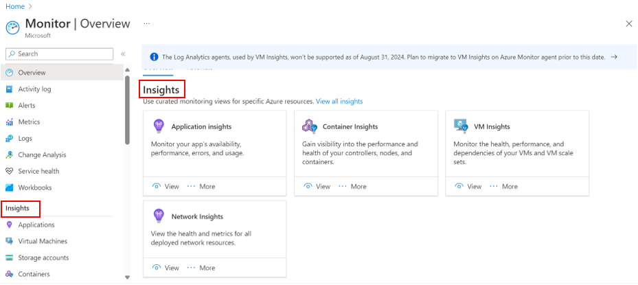

### 

## Analyze

Analysis involves examining monitoring data in-depth to uncover trends, anomalies, correlations, and insights that help optimize resource usage, troubleshoot issues, and improve overall system performance. By analyzing data with precision, valuable insights are obtained regarding the environment and thus data-driven decisions can be made to enhance efficiency and reliability.

**Log Analytics** Log Analytics offers a powerful query engine based on Kusto Query Language (KQL) for analyzing log data within a Log Analytics workspace. Users can filter, aggregate, and join data from multiple sources to uncover trends, correlations, and hidden insights in their logs.

**Metric Explorer** Metric Explorer provides built-in and customizable visualizations for analyzing collected metrics data. Users can explore historical trends, compare metrics across resources, and configure custom alerts on specific metrics to be notified proactively when certain thresholds are crossed.

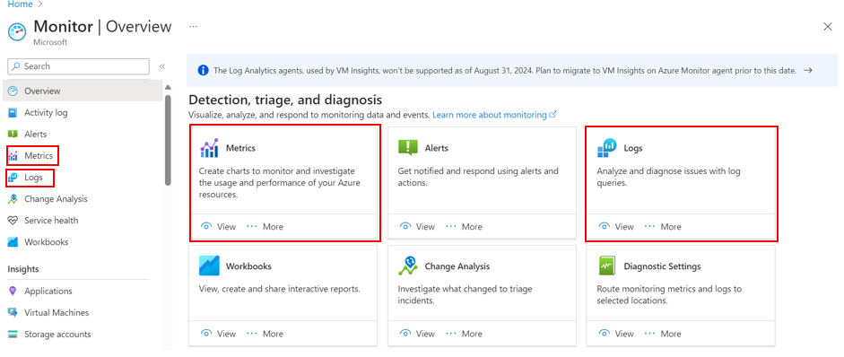

### 

## Visualize

Visualize refers to presenting monitoring data in a visual format through interactive reports, dashboards, and visualizations, which provide quick and intuitive insights into the status and behavior of their Azure environment. Visualization enables users to understand complex data relationships and trends at a glance, facilitating effective communication and decision-making.

Workbooks are interactive reports that combine text, queries, metrics, parameters, and various visualizations within a single canvas. Detailed reports, incident documents, or self-service dashboards, can be created, thus providing a flexible way to narrate a story with the data.

#### Workbooks

The following image illustrates workbooks. Clicking on a workbook provides further content that can be explored and interacted with.

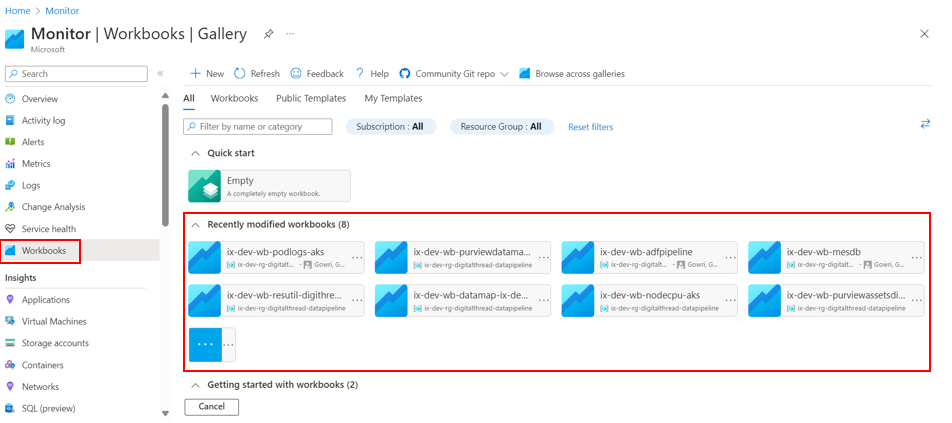

#### Dashboards

Dashboards are customizable landing pages displaying key metrics and visualizations in a user-friendly format. They provide an at-a-glance overview of the system\'s health and performance, including charts, metrics, tables, and text to communicate critical information effectively.

The following image illustrates all available dashboards. Clicking the desired dashboard provides further content that can be viewed and interacted with. For more information on how to access and interact with the monitoring dashboards, refer to the [Azure Monitoring Dashboards UI Guide](https://industryxdevhub.accenture.com/assetdetails/96).

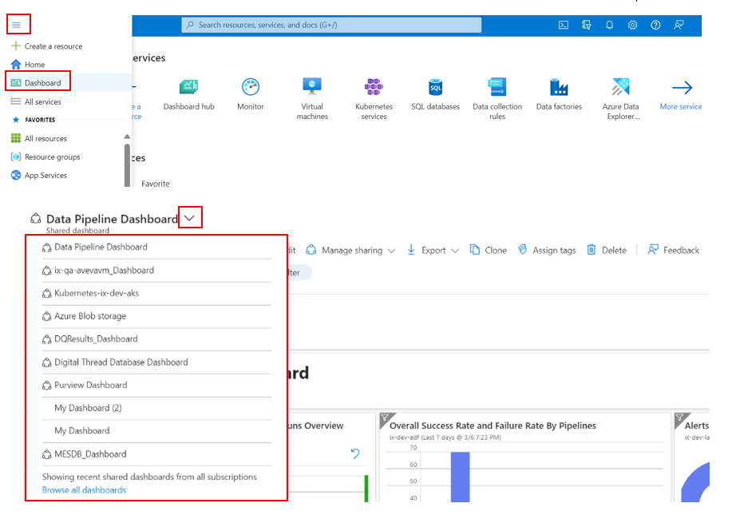

### 

## Respond

Responding involves taking proactive actions based on monitoring insights and alerts, such as setting up automated responses, notifying stakeholders, and initiating remediation workflows to address issues and ensure the reliability and performance of Azure resources and applications. By responding promptly to monitoring data, users can mitigate risks, minimize downtime, and optimize resource utilization.

#### Alerts and Actions

Users can define complex alert rules that trigger notifications whenever specific conditions are detected in their logs or metrics. These conditions can be based on thresholds, anomalies, or specific log patterns. Users can configure various notification channels for their alerts, such as email, SMS, or push notifications, ensuring rapid awareness of issues.

The image below presents the alerts along with their severity levels and other details.

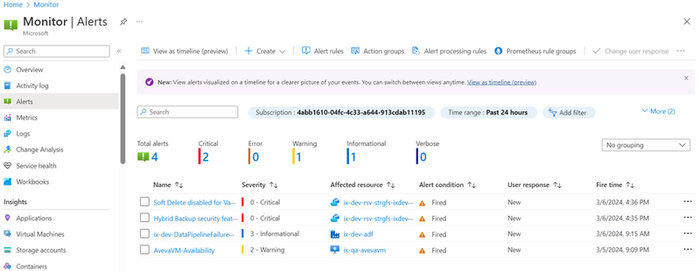

#### Email and Notifications

Email &amp; Notifications provide capabilities to send email notifications to specified recipients based on predefined alert rules. This ensures that stakeholders are promptly informed about critical events and can take appropriate actions in response to alerts generated by Azure Monitor.

## 

# Data Flow and Visualization for GE API Logs

The Great Expectations (GE) API is a sophisticated data validation and testing framework designed to ensure data quality and integrity within the digital thread ecosystem. It allows users to define and validate expectations about data assets, ensuring integrity and accuracy. With configurable rules and automated testing, the GE API simplifies the validation process, empowering confident decision-making.

This section details the workflow for collecting, storing, and visualizing data generated by the GE API within the IX-Digital Thread. The process utilizes various Azure services to ensure efficient data handling, insightful analysis, and clear visualization.

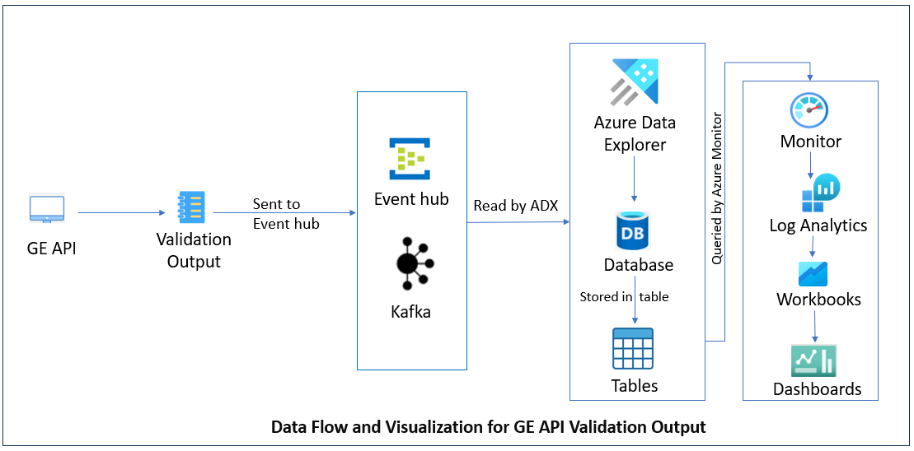

**\
Data Capture and Validation**

The GE-API program receives data from designated sources and performs comprehensive validation checks to ensure its integrity, correctness, and compliance with predefined rules and standards.

**Output Routing to Azure Event Hub**

Within the GE-API program, configuration settings such as the Event Hub name and namespace are provided, while other configurations or properties specified in configuration files are dynamically generated via pipeline orchestration. Utilizing the Kafka protocol, the result of validated data is dynamically routed to Azure Event Hub.

An Event Hub is a fully managed, real-time data ingestion service that can collect and process millions of events per second. This seamless integration enables real-time data ingestion and scalability.

**Data Ingestion by Azure Data Explorer (ADX)**

Data ingested into the Event Hub is then read by Azure Data Explorer (ADX) for further processing. ADX can handle large volumes of streaming data and provides powerful querying capabilities for real-time analytics.

**Structured Storage in ADX Database**

The processed data is stored in a designated table within an ADX database. This structured storage optimizes querying and analysis, facilitating efficient access to the data.

**Azure Monitor and Log Analytics**

Azure Monitor collects and stores log data, including telemetry from ADX. A Log Analytics workspace enables querying and analyzing this log data, providing comprehensive monitoring and diagnostics.

**Workbook Visualization**

Interactive workbooks are created within the Log Analytics workspace, allowing for custom visualization and analysis of the data stored in the ADX table.

**Dashboard Presentation**

Dashboards are built to display the insights and analysis derived from the workbooks, providing stakeholders with a user-friendly and centralized view of the processed data.

## 

# ADF Logging and Monitoring Workflow

Azure Data Factory (ADF) offers a range of metrics and logs for monitoring its activities and performance. These include details such as pipeline execution times, activity statuses, trigger history, data movement metrics, error logs, and resource utilization statistics. This section outlines the workflow for Azure Data Factory (ADF) data collection, storage, and visualization. Leveraging Azure services ensures efficient handling, insightful analysis, and clear visualization of data. From configuring diagnostic settings to creating workbooks, each step is detailed for streamlined monitoring and informed decision-making within ADF workflows.

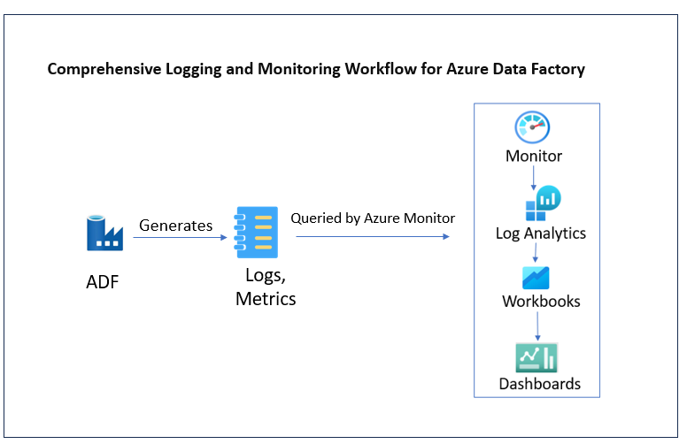

### Configuration of Diagnostic Settings

Initially, diagnostic settings within Azure Data Factory (ADF) are configured from the Monitoring section. By specifying the required logs and metrics to be collected, comprehensive data can be captured. These logs and metrics are then directed to the designated Log Analytics (LA) workspace for storage and analysis.

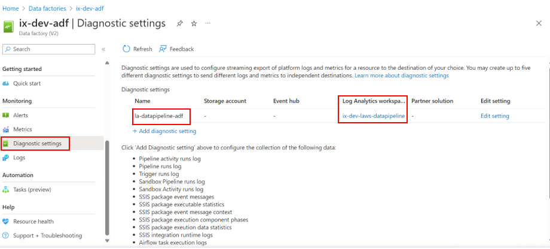

### 

## Validation and Visualization

Following configuration, logs and metrics stored in the Log Analytics (LA) workspace are validated using Kusto Query Language (KQL). This step ensures seamless capture and storage. Workbooks within the Log Analytics Workspace are then created, utilizing ADF logs and metrics as primary data sources. Dynamic visualizations are designed to transform raw data into actionable insights for effective monitoring and analysis.

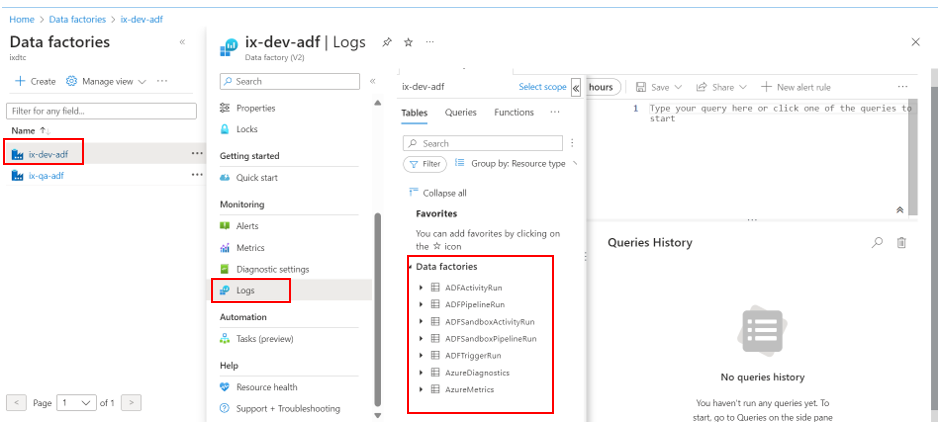

The below snapshot showcases a sample KQL query and its results, with an indication of how they can be pinned to a dashboard/workbook for ongoing monitoring.

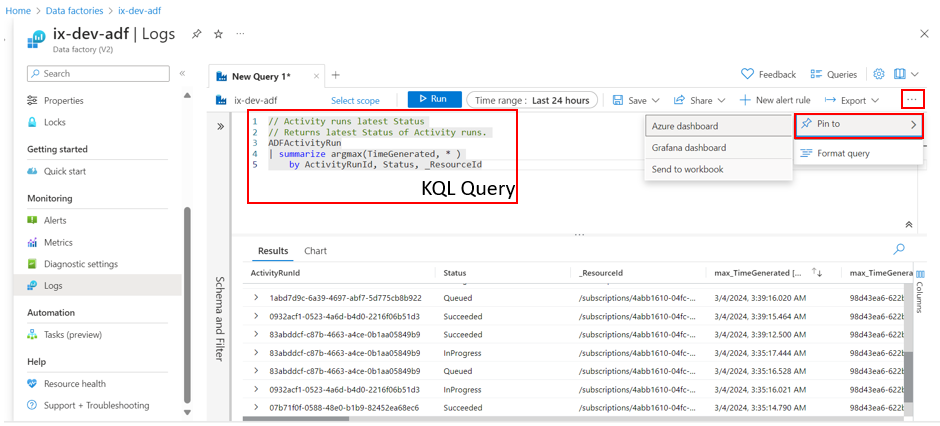

### Facilitating Monitoring Access 

The created workbooks with the required charts are then pinned to dashboards, enabling stakeholders to directly access consolidated ADF log data and performance metrics within designated dashboards. This integration promotes centralized monitoring and facilitates informed decision-making.

### Viewing Insights

Intuitive visualizations and reports derived from ADF log data and performance metrics would be available on the designated dashboard. Stakeholders can interact with elements, apply filters, and explore trends in real time to drive informed decision-making and optimizations within ADF workflows.

The following image provides a glimpse into the Data Pipeline Dashboard, highlighting details of Pipelines, Triggers, Activities, Integration Runtime, and other components visually.

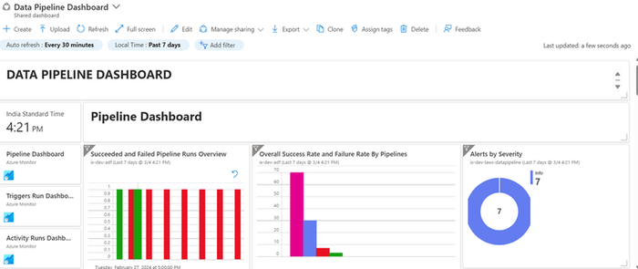

## 

# Azure Virtual Machines Monitoring

This section offers a brief overview of monitoring Azure Virtual Machines (VMs) within IX-Digital Thread. It covers data collection through Azure Monitor and further analysis with tools like Log Analytics and VM Insights. Additionally, it explores how Workbooks and Dashboards provide customizable and pre-built reports, facilitating effective VM management.

### Data Collection

Azure Monitor serves as the central hub for collecting data generated by virtual machines (VMs) deployed in Microsoft Azure. Within Azure Monitor, VMs generate logs and metrics detailing their performance and activity.

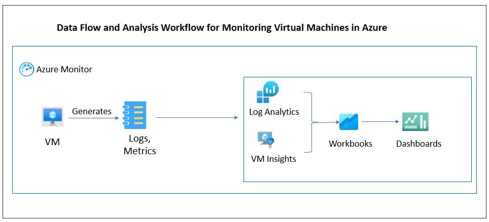

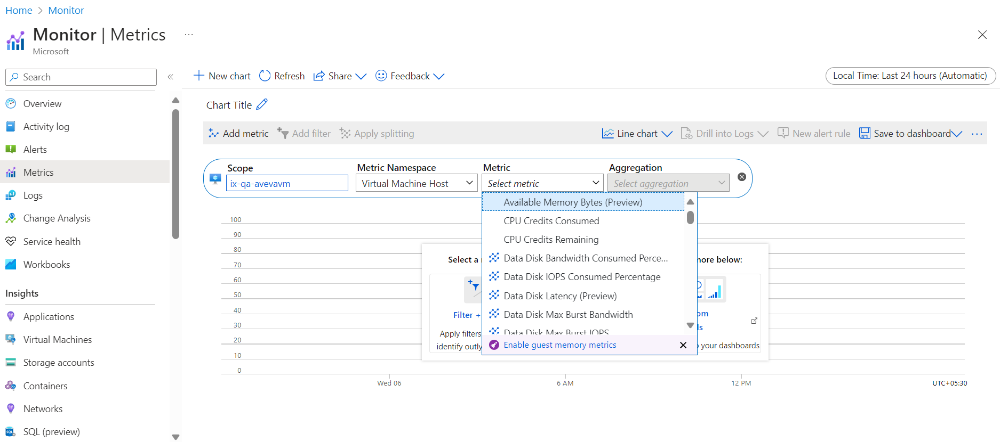

### Data Processing and Analysis

The generated logs and metrics undergo processing and analysis through two primary channels Log Analytics and VM Insights. Log Analytics provides a platform for in-depth analysis and querying of logs, enabling users to extract valuable insights into VM activities. Simultaneously, VM Insights offers a set of pre-built tools and templates designed to simplify VM monitoring and troubleshooting, providing actionable insights into VM performance and health status.

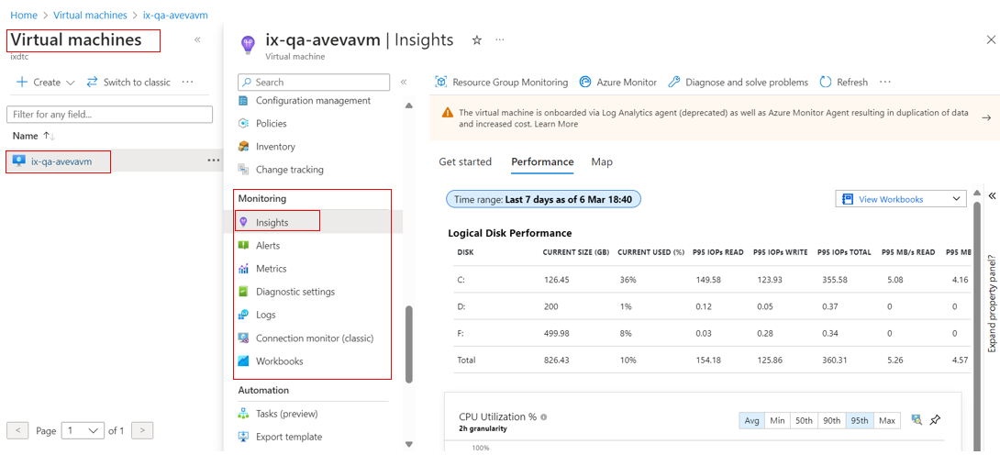

### Customized Workbooks

Workbooks are dynamic reports where users can gather data from metrics, logs, and VM insights to understand VM performance. They offer customization options, enabling users to tailor views according to specific needs. Workbooks facilitate detailed analysis and optimization of Azure VMs through the use of Kusto Query Language (KQL), allowing users to query the collected data and extract insights using powerful and flexible querying capabilities.

The following picture demonstrates the utilization of the KQL query for data querying, showcasing how the query results can be pinned to a workbook or dashboard for further analysis and visualization.

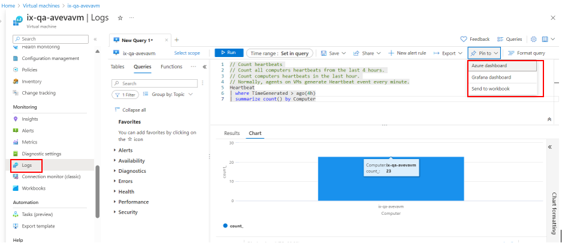

### Dashboards

Dashboards are concise summaries presenting key VM metrics and performance indicators for quick assessment. They provide an efficient overview of VM health, allowing users to monitor resource utilization and identify potential issues promptly, streamlining the management of Azure VM deployments.

The below image provides a glimpse into a VM dashboard that consists of VM metrics, Performance metrics, Network metrics, and Disk operations along with the availability and health of the VM.

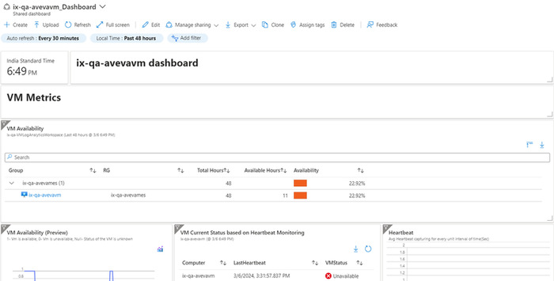

## 

# SQL DB Monitoring

Azure Monitor provides comprehensive monitoring capabilities for SQL databases, allowing users to track performance, diagnose issues, and optimize resource utilization. This section outlines the workflow for monitoring SQL databases using Azure Monitor, including the collection of logs and metrics, querying and analyzing data in Log Analytics, and creating visualizations in Azure Workbooks.

### Logs and Metrics Generation

SQL databases generate logs and metrics that capture various aspects of database activity, including query executions, errors, resource utilization, and security-related events.

Below is an illustrative representation of SQL databases and their Monitoring Overview. Users can navigate through various insights by utilizing the left-side panel.

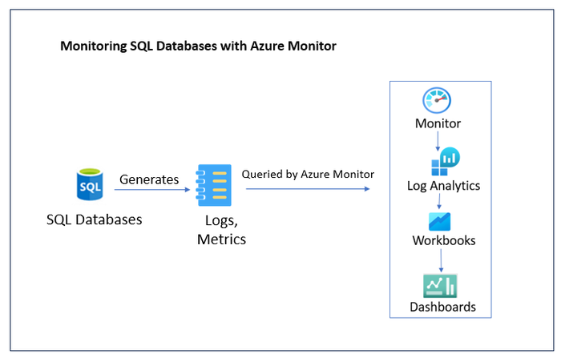

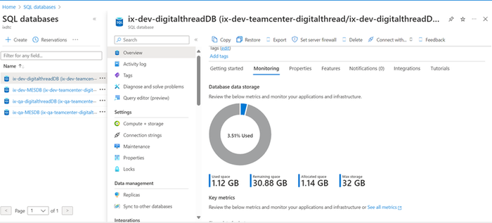

### Azure Monitor Data Collection

Azure Monitor collects logs and metrics from SQL databases, providing a centralized platform for monitoring and analysis. Logs and metrics are ingested into Log Analytics for storage and further processing.

Below is an illustrative representation showcasing the metrics of an SQL database.

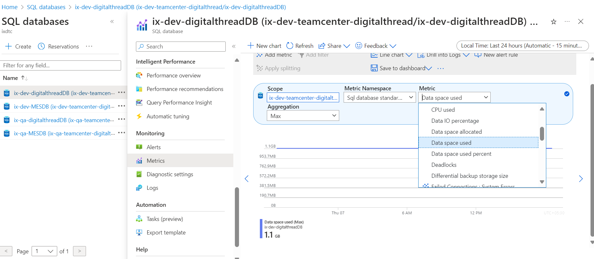

### Log Analytics Data Analysis

Users can query the collected logs and metrics using Log Analytics and KQL. Queries can be used to extract specific information, identify performance trends, diagnose issues, and track user activity within the database.

### 

## Azure Workbooks Visualization

Workbooks offer customizable reports for SQL database monitoring. With charts, graphs, and metrics, users can visualize key indicators like query performance and resource usage, aiding proactive optimization.

Below is a visual representation of charts within a workbook for one of the SQL databases.

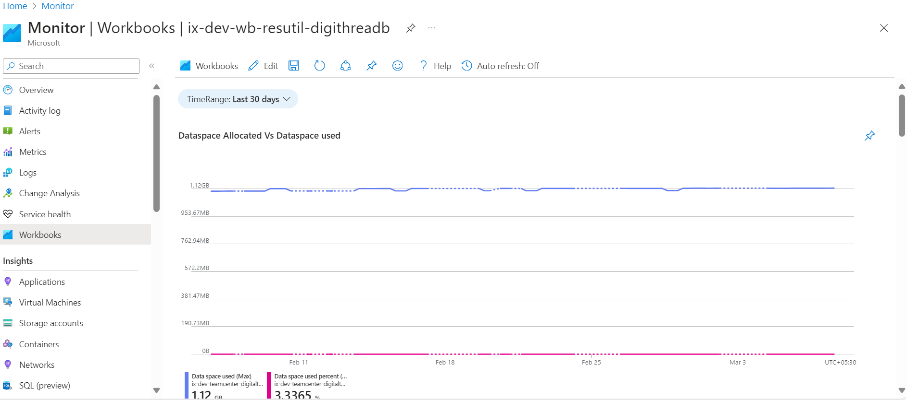

### 

## Dashboards

Azure Monitor Dashboards offer a centralized view of critical metrics and key performance indicators (KPIs) for SQL databases. Users can pin visualizations and insights from Workbooks and other Azure Monitor components to create personalized dashboards tailored to SQL database monitoring requirements. These dashboards provide a real-time snapshot of database performance, enabling users to quickly identify anomalies, track performance trends, and make informed decisions to ensure optimal SQL database operation.

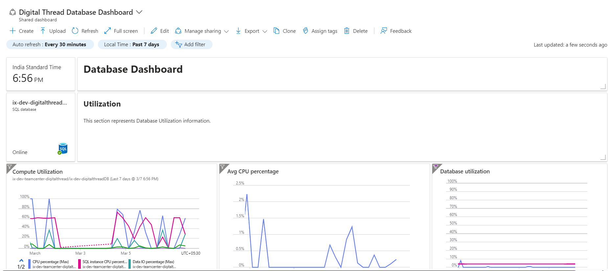

## 

# Azure Storage Monitoring

This section outlines the workflow for monitoring Azure Storage accounts using Azure Monitor. This approach leverages Azure Monitor as a central platform for collecting, analyzing, and visualizing storage activity data.

### Data Source Azure Storage

Azure Storage serves as the source of data for monitoring. It inherently generates logs and metrics capturing various aspects of its activity, including object creation, deletion, and modification events, Storage capacity utilization, Download and upload transactions, and API operation details specific to storage.

### Data Collection and Storage

Azure Monitor acts as the central repository for collecting these logs and metrics generated by the designated Azure Storage account. The collected data is then ingested into Log Analytics, a service within Azure Monitor, for storage and further processing.

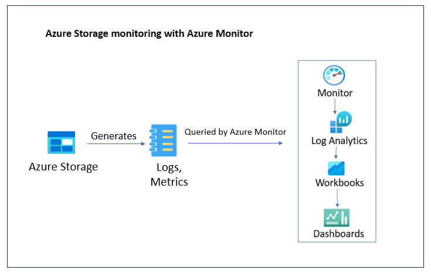

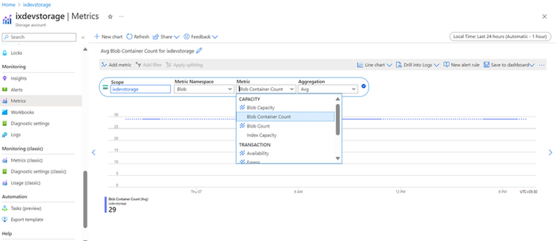

### Data Analysis and Exploration

Log Analytics allows users to query and analyze the collected data using the Kusto Query Language (KQL). These queries enable the extraction of specific information, identification of trends in storage activity, diagnosis of potential issues related to access or transfer, and exploration of usage patterns.

### Data Visualization and Insights

-   **Workbooks** Facilitate the creation of customized reports tailored to specific monitoring needs. These reports can incorporate charts, graphs, tables, and metrics to provide a comprehensive view of storage activity.

-   **Dashboards** Offer a consolidated view of key performance indicators (KPIs) and critical metrics, enabling real-time monitoring and proactive anomaly detection. By leveraging both workbooks and dashboards, users gain a deeper understanding of their Azure Storage health and performance, allowing for informed decision-making and proactive issue resolution.

Additionally, Azure Monitor automatically generates **default workbooks** for each Azure Storage account, offering pre-configured insights into storage activity. These default workbooks provide users with immediate access to essential metrics and performance indicators, complementing the custom reports tailored to specific monitoring needs. By leveraging both default and custom workbooks, users can gain comprehensive visibility into their Azure Storage health and performance, facilitating proactive management and issue resolution.

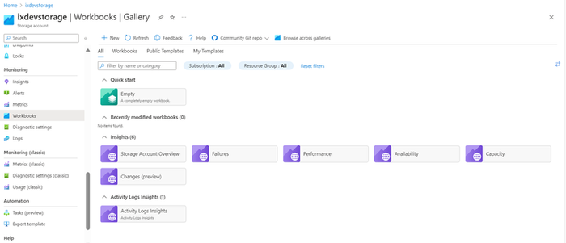

## 

# AKS Monitoring

This section outlines the workflow for monitoring an Azure Kubernetes Service (AKS) cluster using Azure Monitor. Azure Monitor provides comprehensive monitoring and analytics capabilities for AKS clusters, enabling users to collect, analyze, and visualize logs and metrics to ensure optimal performance and health of their Kubernetes workloads.

### Data Generation

Within pods, containers generate logs and metrics providing insights into application behavior, performance, and health. Kubernetes supports log analytics, enabling operators to efficiently search, filter, and analyze log messages alongside metrics. This enhances cluster monitoring and management, ensuring application reliability.

For instance, the below picture illustrates a container with its associated details.

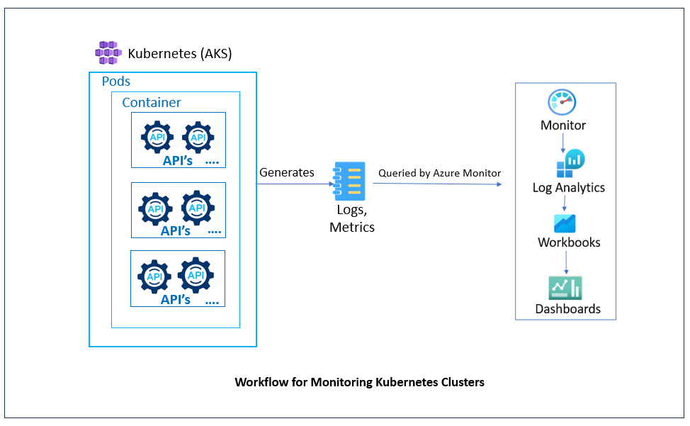

.

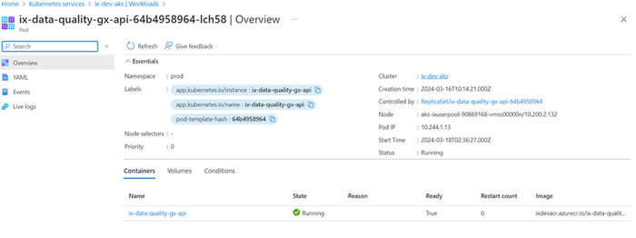

Additionally, live logs of the container can be viewed in the log analytics workspace.

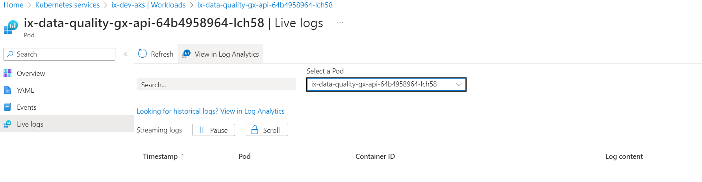

**Pods Collect Data**

The pods, which encapsulate one or more containers, collect the logs and metrics generated by their container inhabitants. Pods serve as the basic unit of deployment and management in Kubernetes, providing a way to group related containers that share resources such as storage and network namespaces. By collecting data at the pod level, Kubernetes ensures that all relevant information from the containers within a pod is captured efficiently.

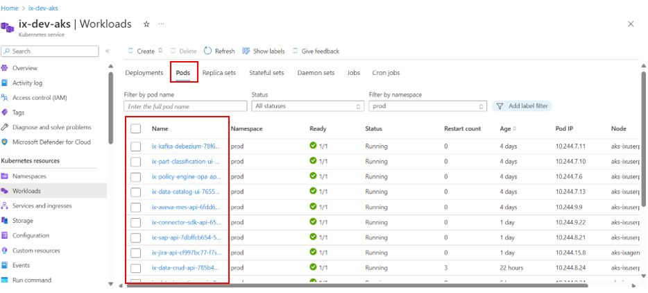

**Pods Forward Data (through API)**

After collecting the logs and metrics, the pods forward the collected data, including their logs and metrics, to the Kubernetes API server. This communication likely occurs through a specific API endpoint defined within Kubernetes for data collection purposes. The Kubernetes API server acts as the central control plane component, exposing a RESTful API that allows users and system components to interact with the cluster.

**Monitoring Tool Retrieves Data (through API)**

The monitoring tool retrieves the collected data from the Kubernetes API server using the appropriate Kubernetes API. This API allows the monitoring tool to access logs, metrics, and other relevant information about the cluster and its components. By querying the Kubernetes API, the monitoring tool can gather real-time data about the cluster\'s performance, resource utilization, and overall health, enabling operators to monitor and manage the cluster effectively.

**Workbooks**

Workbooks are structured collections of reports, charts, and tables used for analyzing monitoring data in Kubernetes. They offer insights into cluster performance, health, and resource utilization, facilitating informed decision-making and optimization of Kubernetes deployments.

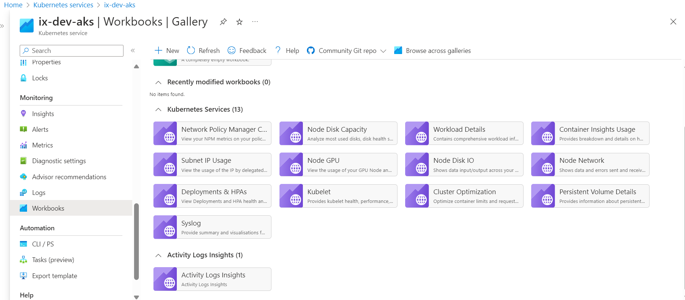

**Dashboards**

Dashboards are customizable visual interfaces displaying key metrics and indicators for monitoring Kubernetes clusters. They provide real-time overviews of critical metrics, enabling quick identification of issues and proactive management for optimal cluster performance.

The below screenshot provides a glimpse into the Kubernetes dashboard.

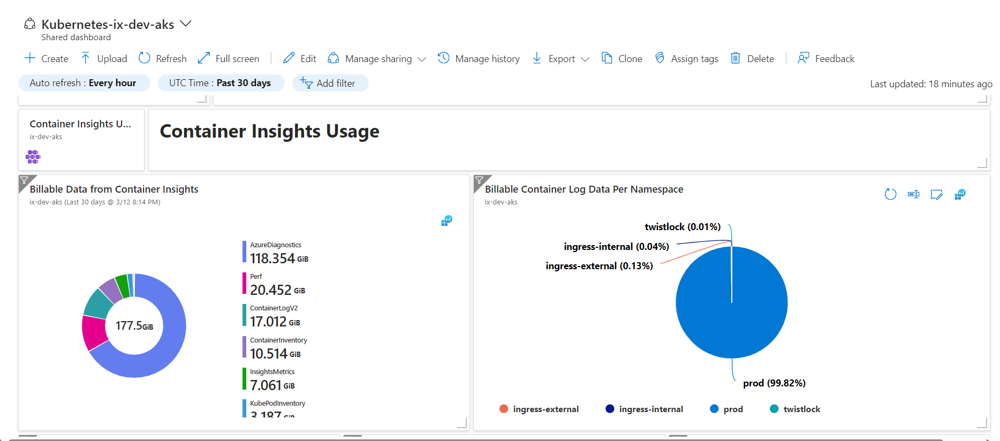

## 

# Purview Monitoring

A monitoring workflow for Purview comprises automated processes that continuously track the health and performance of the Azure Purview data governance service. It ensures smooth data governance by gathering logs and metrics and analyzing them for potential issues.

**Data Source Ingestion** Data from various sources such as Teamcenter, SAP, and Windchill is extracted and fed into Azure Purview for management and governance.

**Data Monitoring** A monitoring service keeps track of Purview\'s activities, focusing specifically on the ingestion of data from various sources. This ensures that data ingestion processes are running smoothly and effectively.

**Log and Metrics Generation** During Purview\'s operations, logs and metrics are generated to provide insights into its functioning and the progress of data ingestion from different sources. These logs and metrics help identify any issues or anomalies in the data ingestion process.

**Data Analysis by Azure Monitor Log Analytics** Azure Monitor Log Analytics collects and analyses the logs and metrics generated by Purview. It identifies potential issues related to Purview\'s health or the data ingestion process from various sources, allowing for proactive resolution of problems.

**Data Visualization in Workbooks and Dashboards** The analyzed data is presented visually in workbooks and dashboards, allowing users to easily monitor aspects like data lineage, access control, and data quality for the ingested information. This enables efficient governance of data from multiple sources within Purview.

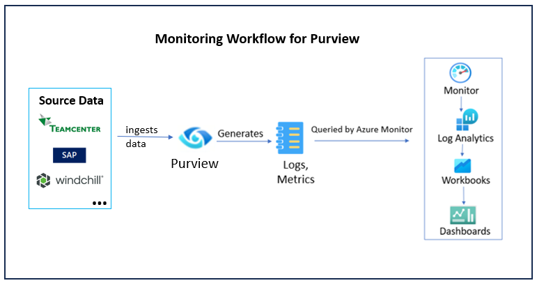

The below screenshot provides a glimpse into the Purview dashboard

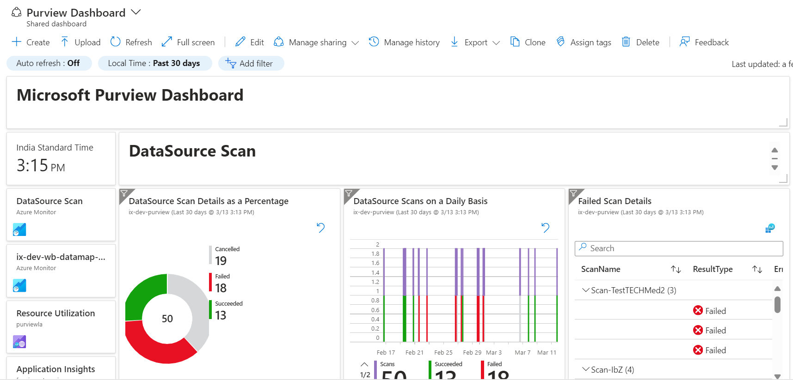
