

Digital Thread Foundations

Azure Monitoring Dashboards

UI GUIDE

Release Version: 1.2

Metadata Table

| **Field** | **Value** |
| --- | --- |
| **Asset / Solution Name** | Digital Thread |
| **Domain / Area** | Engineering |
| **Owner (Team/Person)** | Karthik Ramachandra |
| **Reviewers** | Karthik Ramachandra |
| **Status** | Approved / Complete |
| **Confidentiality** | Internal / Confidential |
| **Source of Truth** | [link](https://dev.azure.com/IXAssets/IXAssetsProject/\_git/ixassets) |
| **Related Assets / Alternatives** | AOT / Engineering Orchestration / Engineering Agents |

## Introduction

A digital thread refers to the continuous and consistent flow of information throughout the entire lifecycle of a product or system -- from design and development to operation and maintenance. It enables the integration of data from different stages and sources, allowing effective traceability, seamless collaboration, and efficient decision-making by unleashing the power of sleeping data. The digital thread is considered a key aspect of Industry 4.0 and the digital transformation of the manufacturing industry. It is the core of what we call the Enterprise Operating System (EOS). Digital Thread is a communication framework that helps integrate various enterprise systems involved in the engineering and manufacturing product life cycle.

Monitoring Dashboards provide a visual interface for accessing data collected from Azure resources. The dashboards interface offers easy navigation to tools, insights, and visualizations available through Azure Monitor.

### Purpose

This document outlines essential procedures for efficiently managing the IX Digital Thread monitoring infrastructure. From navigating dashboards and workbooks to troubleshooting issues, it provides comprehensive guidance to users to ensure smooth operations and optimize performance.

###  Target Audience

Software architects, developers, and integrators with IT backgrounds.

### Prerequisites

Users who will be viewing Azure Monitor dashboards should have access to the Azure portal and the directory where the dashboards are located. They must be granted appropriate access permissions at the viewer level for both dashboards and workbooks. This ensures they can access the necessary resources and view the monitoring data effectively.

### Related Links

-   [Azure Monitor overview - Azure Monitor \| Microsoft Learn](https://learn.microsoft.com/en-us/azure/azure-monitor/overview)

### Business Contacts

-   [florian.tournier@accenture.com](mailto:florian.tournier@accenture.com)

-   [laura.mosconi@accenture.com](mailto:laura.mosconi@accenture.com)

-   [karthik.ramachandra@accenture.com](mailto:karthik.ramachandra@accenture.com)

### Technical Contacts

-   [laura.mosconi@accenture.com](mailto:laura.mosconi@accenture.com)

-   [janos.puskas@accenture.com](mailto:janos.puskas@accenture.com)

-   [zsolt.tofalvi@accenture.com](mailto:zsolt.tofalvi@accenture.com)

-   [stefano.giacco@accenture.com](mailto:stefano.giacco@accenture.com)

## Monitoring Components

### Metrics

Azure resources generate metrics, which are quantitative measurements providing insight into the performance, utilization, and health status of various Azure services and components. These metrics encompass a wide range of parameters, including CPU utilization, memory usage, network throughput, and availability. By tracking metrics, users can monitor resource performance, detect anomalies, and optimize resource usage to ensure efficient operation of Azure services.

### Logs

In addition to metrics, Azure resources generate logs, capturing detailed records of events and activities occurring within the Azure environment. Logs provide a comprehensive audit trail, documenting system events, application logs, security-related activities, and user actions. By analyzing logs, users can gain visibility into system behavior, identify security threats, troubleshoot issues, and ensure compliance with regulatory requirements.

###  Log Analytics Workspaces

Log Analytics Workspaces serve as centralized repositories for storing and analyzing log data collected from various Azure resources. These workspaces provide a scalable and secure platform for aggregating logs, performing advanced analytics, and gaining insights into system performance and operational efficiency. With Log Analytics Workspaces, users can centralize log management, streamline troubleshooting processes, and derive actionable insights to optimize resource utilization and enhance security posture.

#### KQL Language

> The Kusto Query Language (KQL) is a powerful query language used for querying and analyzing log data within Log Analytics Workspaces. KQL provides a rich set of operators, functions, and syntax for performing complex queries, filtering data, and extracting valuable insights from log records. With KQL, users can write queries to search, filter, aggregate, and visualize log data, enabling efficient troubleshooting, trend analysis, and proactive monitoring of Azure resources.

#### Workbooks

> Workbooks are customizable reports and visualizations created using data from Log Analytics Workspaces. They allow users to create interactive dashboards, reports, and visualizations tailored to specific monitoring requirements and use cases. With Workbooks, users can incorporate KQL queries, charts, tables, and other visual elements to create dynamic and insightful reports that provide actionable insights into system performance, resource utilization, and operational trends.

## Dashboards

Dashboards provide a consolidated view of metrics, logs, and insights, offering users a comprehensive overview of the health, performance, and security posture of their Azure environment. Built using Workbooks, dashboards enable users to monitor key performance indicators, track operational trends, and visualize log data in real-time. With customizable layouts, widgets, and drill-down capabilities, dashboards empower users to make informed decisions, quickly identify issues, and take proactive measures to optimize resource utilization and enhance operational efficiency.

### Dashboard Selection

1.  From the left navigation bar in Azure, select Dashboard.

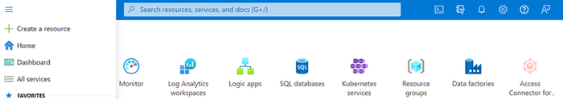

2.  On the default dashboard, use the pull-down menu to select the dashboard to view or click on *Browse all dashboards* to view all the dashboards that have been created.

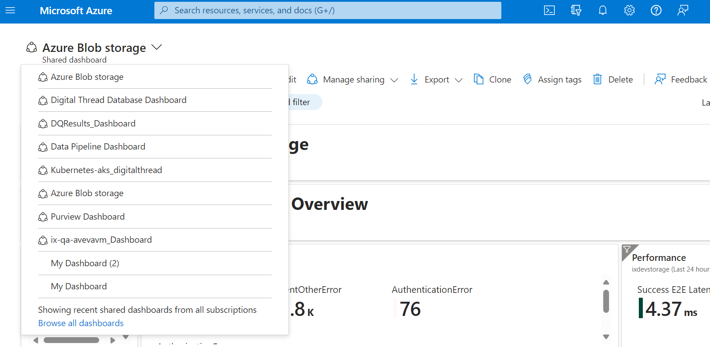

### Dashboard Usage

The dashboard incorporates several components to enhance user experience and data analysis. These components include Time Range Filter, Auto-refresh Filter, and Individual KPI Refresh, each offering unique functionalities to optimize dashboard usage.

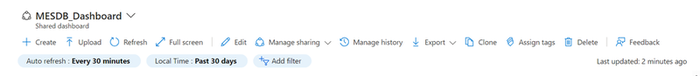

#### Time Range Filter

The Time Range Filter allows users to customize data analysis by selecting from a range of predefined or custom time intervals. Users have the flexibility to customize the time granularity and time zone preferences (local or UTC). This feature enables users to focus on specific time ranges for in-depth performance assessment. Additionally, it\'s important to note that the dashboard stores data for up to 30 days, aligning with Azure\'s storage limit.

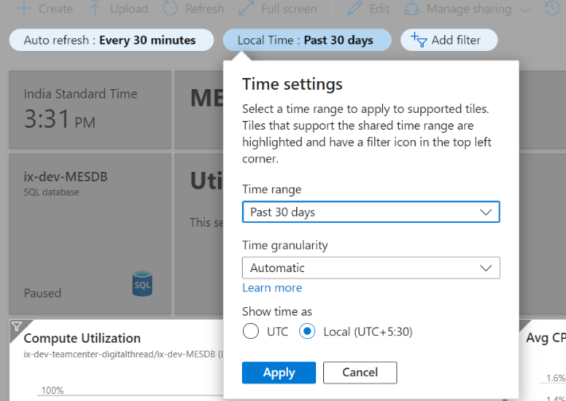

>Time Range Options

-   Past 30 minutes

-   Past hour

-   Past 4 hours

-   Past 12 hours

-   Past 24 hours

-   Past 48 hours

-   Past 3 days

-   Past 7 days

-   Past 30 days

#### Auto-refresh Filter

With the Auto-refresh Filter, users can ensure that the dashboard updates automatically at regular intervals, providing real-time insights without manual intervention. This feature enhances the user experience by keeping the data current and relevant.

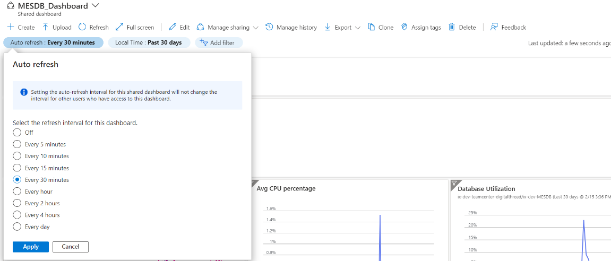

####  Individual KPI Refresh 

Users can refresh individual Key Performance Indicators (KPIs) within the dashboard, allowing for on-demand updates of specific metrics. This capability offers flexibility in data analysis, empowering users to stay informed and address immediate concerns efficiently. Use the meatballs control to open the menu and then use the refresh control to update the display.

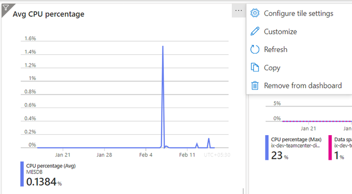

#### Interactive Charts

Hovering over a chart reveals values corresponding to the timeline. Clicking on a chart enables seamless navigation to workbooks, offering a more interactive experience for exploring comprehensive insights.

For example, clicking on any KPI in the dashboard opens the related workbook for further exploration. The following example shows a pie chart displaying trigger distribution. Clicking on any part of the chart provides detailed information about that specific trigger, making it engaging and flexible for users to analyze data.

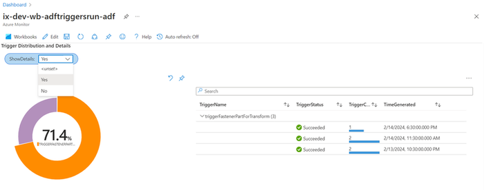

## Data Pipeline Dashboard 

The Data Pipeline Dashboard acts as a centralized hub for managing the data pipelines within this Digital Thread project. This tool provides real-time insights into various aspects of the data workflows, enabling users to track pipeline statuses, monitor trigger events, analyze activity performance, optimize resource utilization, and ensure the health of integration runtimes. By providing customizable visualizations and interactive tools, it allows users to monitor data flows, detect any issues or delays, and optimize resource allocation for smoother operations. Ultimately, the dashboard enables informed decision-making and proactive management of data pipelines, ensuring optimal performance and efficiency.

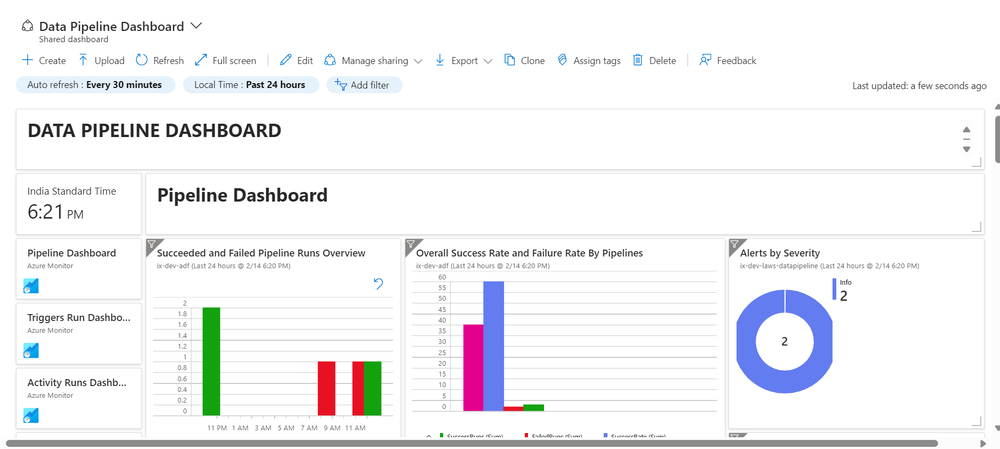

### Pipeline Dashboard

The Pipeline Dashboard view provides an overview of all data pipelines within the Digital Thread project. Users can monitor the status, execution history, and performance metrics of each pipeline. Visualizations include pipeline run status, execution duration, and success/failure rates, pipeline specific details by location.

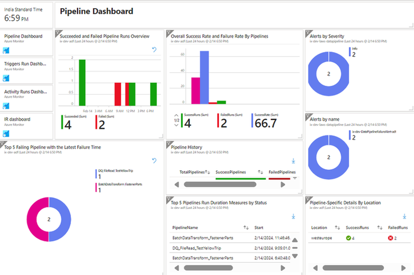

### Alerts and Notifications:

In the event of any data pipeline failure, the monitoring system triggers alerts and notifications to promptly notify relevant stakeholders. These alerts are configured to detect anomalies or failures within the data pipeline process, such as errors in data transformation, connectivity issues, or resource constraints. Once triggered, notifications are sent out via email to the intended stakeholders.

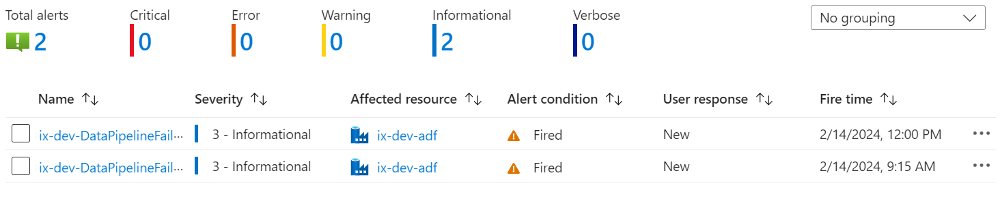

These notifications provide essential details about the failure, including the nature of the issue and failure description. By promptly alerting stakeholders, the system ensures that necessary actions can be taken swiftly to address the failure, minimize downtime, and maintain the integrity of data pipeline operations.

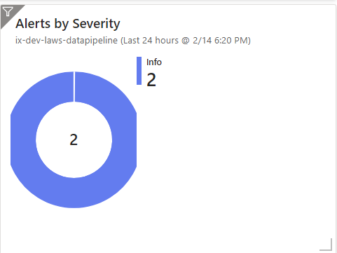

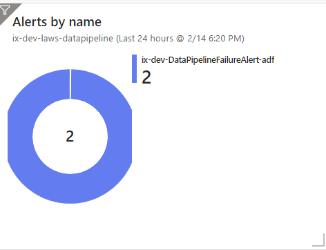

### Triggers Run Dashboard

The Triggers Run Dashboard displays information about triggers associated with the pipelines. Users can track trigger events, execution schedules, and any associated actions or dependencies. Visualizations include trigger execution insights, frequency of triggers, trigger distribution details, and trigger performance metrics.

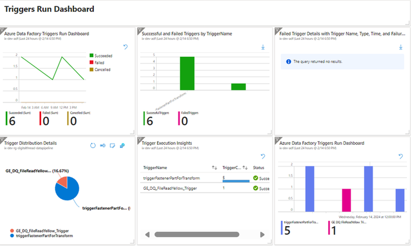

### Activity Runs Dashboard

Activity Runs Dashboard provides insights into individual activities or tasks within the pipelines. Users can view activity status, execution details, and resource consumption for each task. Visualizations include an overview of activity runs, displaying their status alongside various aggregations for enhanced analysis.

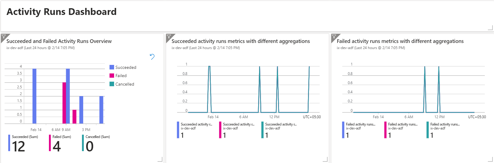

### Integration Runtime Dashboard

Integration Runtime Dashboard displays the performance, availability, and health status of integration runtimes. Visualizations include runtime CPU utilization, available memory, available node count with different aggregations.

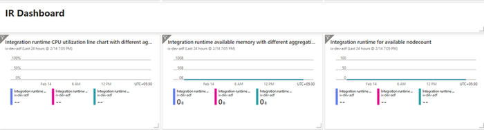

### Resource Utilization Dashboard

The Resource Utilization Dashboard provides an overview of resource usage across the Digital Thread project\'s infrastructure. Users can monitor CPU, memory, storage, and network utilization to ensure optimal resource allocation. Visualizations may include resource usage trends, peak usage periods, and recommendations for resource optimization.

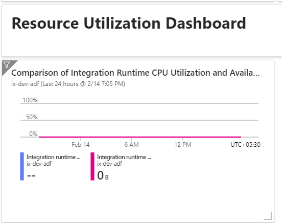

## Digital Thread Database Dashboard

This dashboard provides comprehensive insights into various aspects of the Digital Thread database system, enabling users to effectively monitor performance, utilization, data assets, query performance, and system availability.

### Utilization

The utilization section offers visibility into how resources within the database system are being utilized. It may include metrics such as CPU usage, memory usage, disk I/O, and network bandwidth. By analyzing utilization data, users can ensure that resources are allocated efficiently and identify any potential resource constraints that may impact system performance.

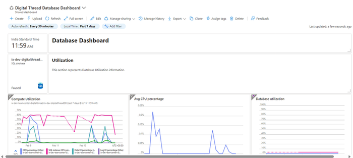

### Performance

Under the Performance section, users can monitor critical key performance indicators (KPIs) to assess the overall health and efficiency of the database system. This includes tracking metrics such as active sessions, sessions count, failed connections (categorized into system vs. user errors), count of deadlocks, blocked by firewall count, average percentage of workers, and average log I/O percentage specifically for the Digi thread database. These KPIs offer insights into concurrent activity, resource utilization, connectivity issues, concurrency conflicts, and performance bottlenecks. Additionally, the section provides query performance insights -- including metrics like query execution time, throughput, and optimization statistics -- enabling users to analyze and optimize database query performance effectively.

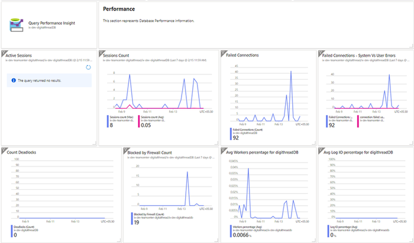

### Data

In the Data section, users can view allocated versus used data space to track storage efficiency and plan for future growth. The data I/O percentage metric shows the proportion of database activity related to input/output operations, providing insights into data access performance and guiding optimization efforts for improved system responsiveness.

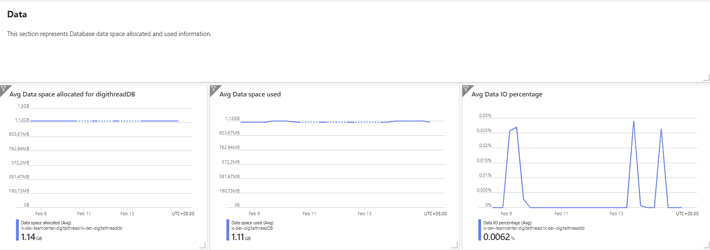

### Alerts and notifications

For the digital thread database dashboards, alerts and notifications are implemented to promptly inform users when certain thresholds are exceeded. Specifically, alerts are triggered if CPU usage surpasses predefined limits or if the percentage of data space utilized exceeds set thresholds. These notifications serve as proactive measures to ensure timely awareness of potential performance issues or resource constraints, allowing users to take necessary actions to mitigate any adverse impacts on system operations.

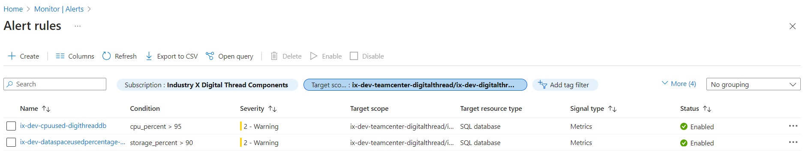

## MESDB Dashboard

The MESDB dashboard offers users a comprehensive interface to monitor and manage the Manufacturing Execution System (MES) database. MESDB, like the Digital Thread Database dashboard, shares similar key performance indicators (KPIs) and functionalities. It provides users with a familiar interface and monitoring capabilities, ensuring consistency across different database environments.

### Utilization 

The utilization section offers visibility into how resources within the MES database system are being utilized. It may include metrics such as CPU usage, memory usage, disk I/O, and network bandwidth. By analyzing utilization data, users can ensure that resources are allocated efficiently and identify any potential resource constraints that may impact system performance.

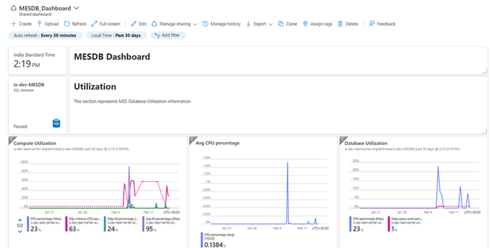

### Performance

Under the Performance section, users can monitor critical key performance indicators (KPIs) to assess the overall health and efficiency of the database system. This includes tracking metrics such as active sessions, sessions count, failed connections (categorized into system vs. user errors), count of deadlocks, blocked by firewall count, average percentage of workers, and average log I/O percentage specifically for the Digital Thread database. These KPIs offer insights into concurrent activity, resource utilization, connectivity issues, concurrency conflicts, and performance bottlenecks. Additionally, the section provides query performance insights, including metrics like query execution time, throughput, and optimization statistics, enabling users to analyze and optimize database query performance effectively.

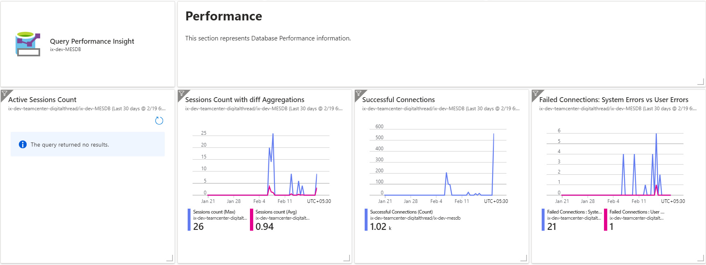

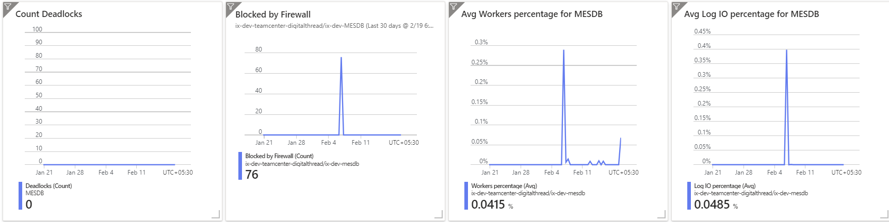

### Data

In the Data section, users can view allocated versus used data space to track storage efficiency and plan for future growth. The data I/O percentage metric shows the proportion of database activity related to input/output operations, providing insights into data access performance and guiding optimization efforts for improved system responsiveness.

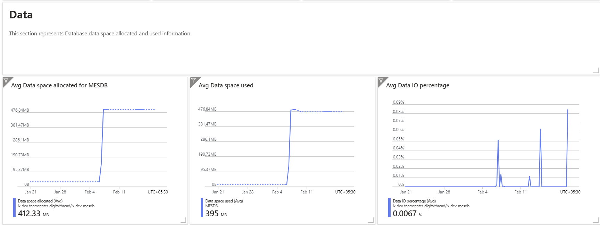

### Alerts and Notifications

For the MESDB dashboard, alerts and notifications are implemented to promptly inform users when certain thresholds are exceeded. Specifically, alerts are triggered if CPU usage surpasses predefined limits or if the percentage of data space utilized exceeds set thresholds. These notifications serve as proactive measures to ensure timely awareness of potential performance issues or resource constraints, allowing users to take necessary actions to mitigate any adverse impacts on system operations.

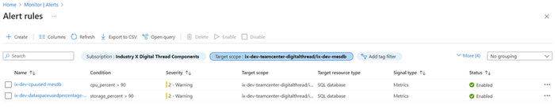

## ix-qa-avevavm Dashboard

The AVEVA-VM dashboard provides a concise overview of virtual machine (VM) infrastructure, offering insights into VM metrics, performance, network activity, and disk operations. This streamlined dashboard, tailored for IX_DT (Digital Thread), facilitates efficient monitoring, enabling users to optimize resource utilization, identify bottlenecks, and enhance overall system performance within their virtualized environments.

### VM Metrics

The VM metrics section offers vital insights into virtual machine (VM) health and performance. Key indicators like VM availability, availability hours, heartbeat average, and resource health provide a comprehensive understanding of VM uptime and performance based on heartbeat monitoring. Additionally, the connections overview provides a concise overview of VM network connections. These metrics empower administrators to proactively manage VMs, ensuring optimal performance and resource utilization across the infrastructure.

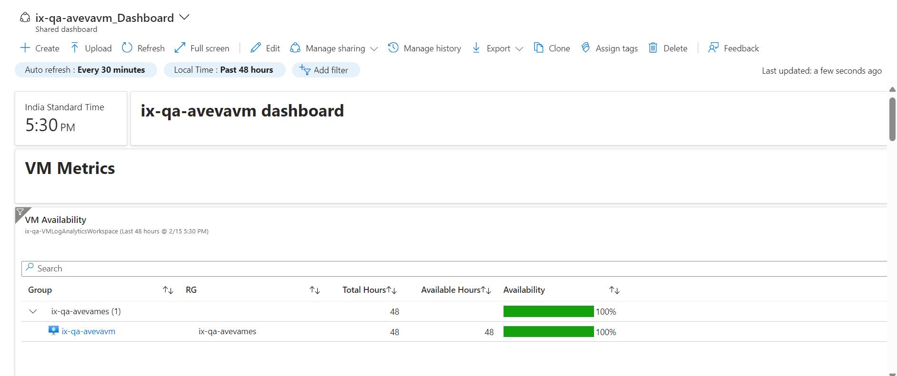

### VM Availability Metric

The VM availability metric, currently in public preview, serves as a valuable indicator of a machine\'s operational status. With this metric, users can track availability trends over time and set alerts to notify if the machine is stopped. The metric values are as follows:

| Value | Description |
| --- | --- |
| 1 | VM is running and available. |
| 0 | VM is unavailable. The VM could be stopped or rebooting. If you shut down a VM from within the VM, it will emit this value. |
| Null | The state of the VM is unknown. If you stop a VM from the Azure portal, CLI, or PowerShell, it will immediately stop emitting the availability metric, and you will see null values.

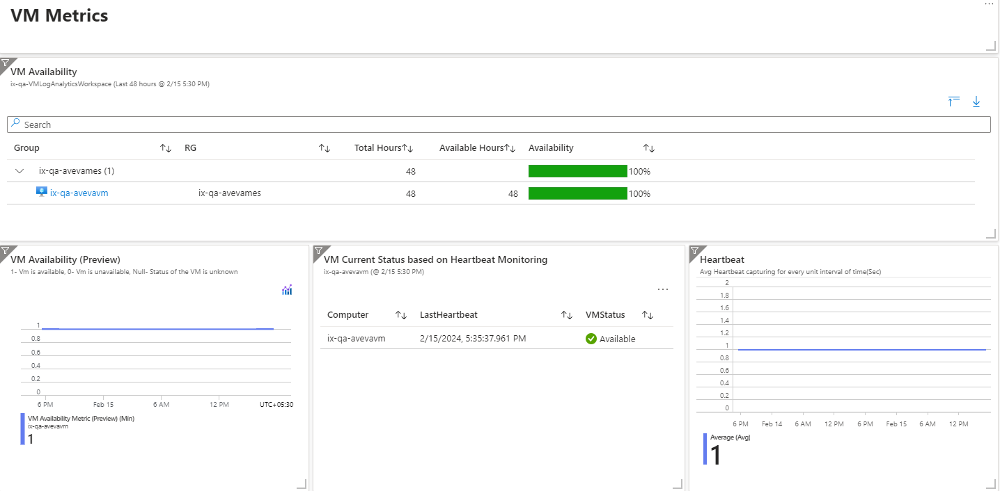

**Heartbeat Metric** 
Heartbeat monitoring is a critical aspect of assessing the health and availability of virtual machines (VMs) within an infrastructure. It involves regular signals sent from the VM to the monitoring system, indicating operational status and responsiveness. The \"avg=1\" suggests an average interval of 1 second between each heartbeat, indicating regular and frequent communication, which is a positive sign of the VM\'s health and responsiveness.

|  |

### Resource Health

Resource Health provides users with information about the availability status of virtual machines (VMs), indicating whether they are currently accessible or experiencing any issues. Additionally, users can view health events through Resource Health, gaining insights into any specific events or issues affecting the availability or performance of VMs. This feature enables users to promptly identify and address health events, ensuring optimal operation and reliability of the infrastructure.

### Connections Overview

The Connections Overview component within the VM Metrics section provides a concise summary of virtual machine (VM) network connections. It includes details such as the connection name, type, any connections flagged as potentially malicious, response data, maximum live links, failed link counts, average response time, and total bytes transmitted and received. This summary offers users a comprehensive understanding of the VM\'s network connections, facilitating effective monitoring and management of network resources.

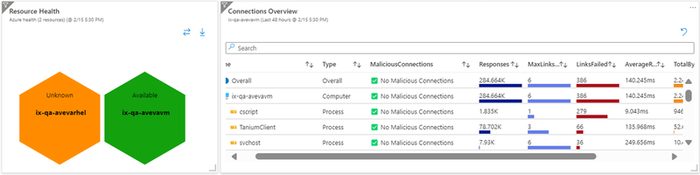

### Performance Metrics

Performance metrics provide crucial insights into the health and efficiency of virtual machine (VM) operations within an infrastructure:

**CPU Percentage**

The CPU utilization percentage indicates the proportion of the CPU\'s processing capacity currently in use. High CPU utilization may indicate resource contention or workload spikes, potentially impacting VM performance and responsiveness.

**Inbound Flows vs % CPU**

This metric compares the number of inbound network flows to the CPU utilization percentage. A higher number of inbound flows relative to CPU utilization may suggest network-bound workloads, where incoming network traffic is a bottleneck affecting CPU performance.

**CPU Utilization %**

CPU utilization percentage reflects the extent to which the CPU is being utilized at a given moment. It provides a comprehensive view of the overall CPU workload, including both user and system processes. Monitoring CPU utilization helps administrators identify performance bottlenecks, optimize resource allocation, and ensure efficient CPU usage across VMs.

**Available Memory (MB)**

Available memory indicates the amount of unused memory available for use by VMs. Low available memory may indicate memory contention, where VMs compete for resources, potentially leading to performance degradation or resource exhaustion. Monitoring available memory helps administrators optimize memory allocation, identify potential memory constraints, and ensure adequate resource availability for VM workloads.

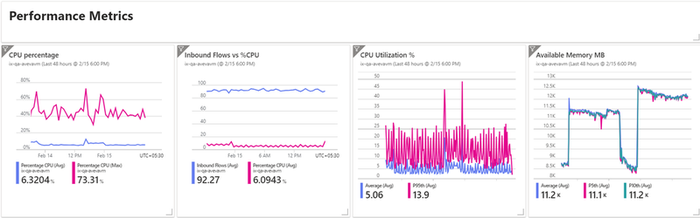

### Network Metrics

Network Metrics provides insights into data transfer activities of virtual machines (VMs). It includes measurements for both inbound and outbound traffic, detailing the rate of bytes sent per second and bytes received per second. These metrics enable efficient monitoring of network usage and identification of potential performance issues.

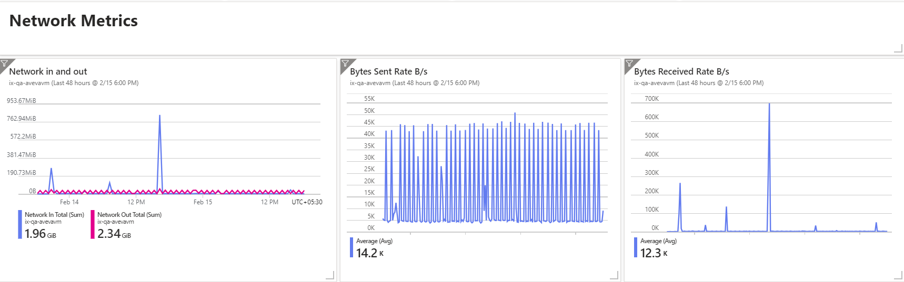

### Disk Operations

Disk operations metrics offer insights into the performance and utilization of virtual machine (VM) disks within an infrastructure.

**Disk Reads and Writes**

These metrics track the rates of read and write operations individually, providing insights into the workload intensity for each type of operation.

**Disk Operations/sec**

Represents the total rate of disk operations, including both read and write operations, executed by the VM disks per second. It provides an overview of the overall disk activity and workload intensity.

**Logical Disk IOPS (Input/Output Operations Per Second)**

Measures the number of input/output operations executed by the VM disks per second, reflecting the disk\'s ability to handle concurrent read and write requests.

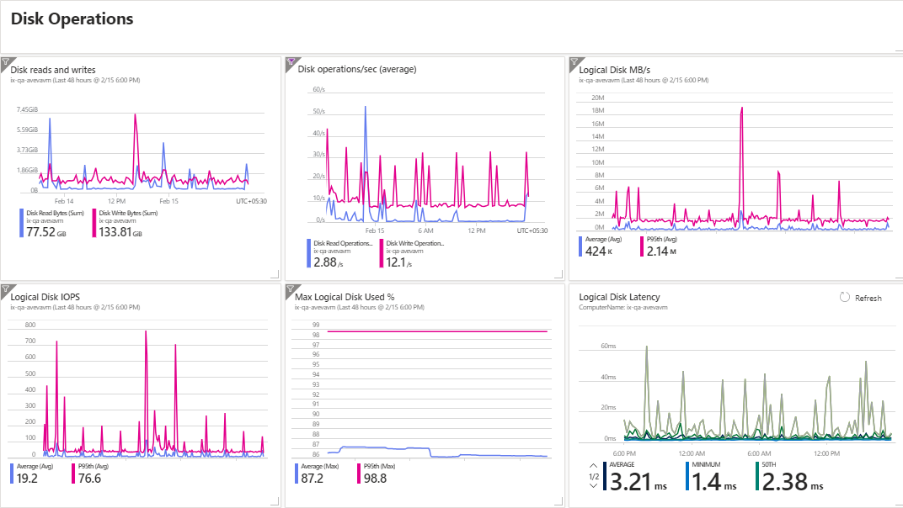

**Logical Disk MB/s (Megabytes per Second):** 
Indicates the rate of data transfer to and from the VM disks, offering insights into disk throughput capacity and data transfer efficiency.

**Max Logical Disk Used%:** 
Reflects the maximum percentage of disk space utilized on the VM disks, helping administrators monitor disk space utilization and anticipate potential storage capacity issues.

**Logical Disk Latency:** 
Measures the time taken for the VM disks to process read and write requests, indicating the responsiveness of the disk subsystem and potential latency-related performance issues.

### Alerts and Notifications

Alerts and notifications have been created for this VM to monitor its availability, memory usage, disk utilization, and CPU usage. Notifications will be sent to intended users via email, ensuring administrators stay informed and can take proactive measures to maintain VM health and performance.

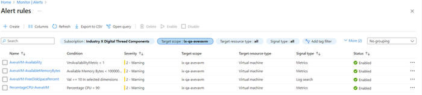

## Azure Blob Storage Dashboard

This dashboard offers comprehensive insights into Azure Blob Storage, providing detailed information on storage account performance, failure tracking, performance monitoring, availability status, and capacity metrics. With detailed analytics and visualizations, this dashboard, serves as a valuable tool for optimizing Azure Blob Storage deployments, ensuring reliability, efficiency, and scalability for data storage needs within the Digital Thread project.

### Storage Account Overview

Storage Account Overview provides a comprehensive overview of the Azure Blob Storage dashboard, highlighting key performance indicators (KPIs) crucial for effective management and optimization. The overview helps the user gain insights into the overall performance and usage of the storage account.

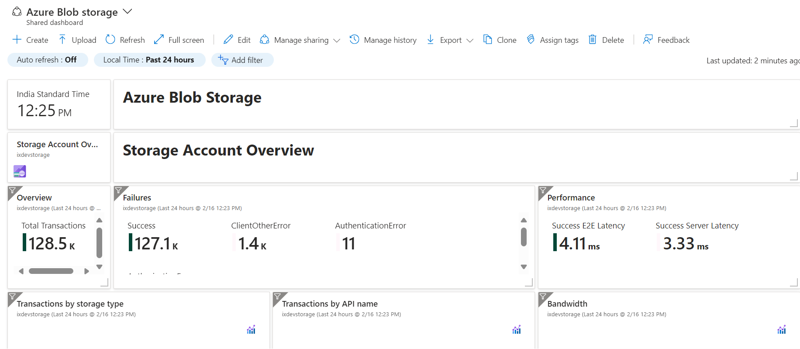

**Transactions by Storage Type:** 
Analyses transactional activity categorized by storage types such as blobs, tables, queues, and files, offering insights into data access patterns.
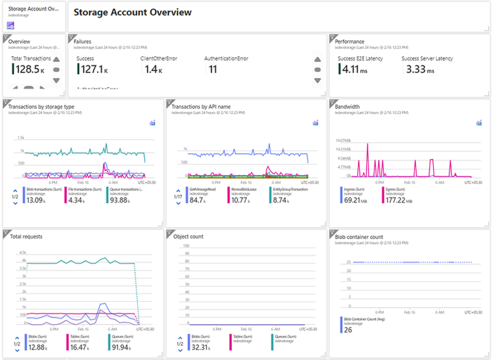
**Transactions by API Name:** 
Tracks transactional activity categorized by API names, providing visibility into the types of operations being performed on the storage account.

**Bandwidth:** 
Monitors the bandwidth usage of the storage account, ensuring efficient data transfer rates.

**Total Requests:** 
Keeps track of the total number of requests made to the storage account, providing insights into workload intensity.

**Object Count:** 
Assesses the total number of objects stored in the storage account, enabling effective resource management and capacity planning.

**Blob Container Count:** 
Determines the number of blob containers within the storage account, facilitating organization and management of the blob storage resources.

### Failures
The Failures section provides insights into failing transactions within the Azure Blob Storage environment. It offers valuable information to identify and address issues affecting data integrity and accessibility.
The Performance section provides key insights into the performance metrics of the Azure Blob Storage environment. It enables users to assess the efficiency and responsiveness of the storage operations.

| **Average End-to-End (E2E) Latency** | **E2E vs Server Latency Trend** | **Total Egress** |
| --- | --- | --- |
| Measures the average time taken for a data transaction to complete -- from the moment it is initiated until it is fully processed -- and provides an overview of the overall responsiveness of the storage system. | Tracks the trend of end-to-end latency compared to server-side latency over time, allowing users to identify any discrepancies and potential bottlenecks in data processing. | Monitors the total amount of data transferred out of the storage account, offering insights into data egress patterns, and helping users manage data transfer costs effectively |
|  |  |

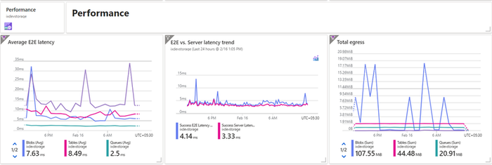

### Availability

The Availability section focuses on monitoring the availability of the Azure Blob Storage environment, ensuring consistent access to data resources.

**Storage Health**

Provides an overview of the health status of the storage resources and indicates whether they are operating within expected parameters or experiencing any issues that may impact availability.

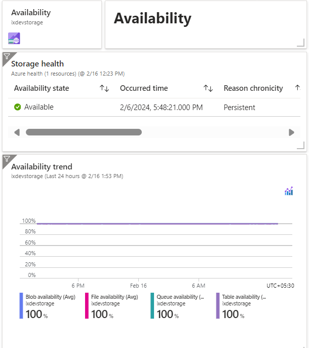

**Availability Trend**

Tracks the trend of storage availability over time and allows users to identify any patterns or fluctuations in availability and take proactive measures to maintain consistent access to data resources.

### Capacity

The Capacity section is dedicated to monitoring the capacity of the Azure Blob Storage environment, ensuring sufficient resources are available to accommodate data storage needs.

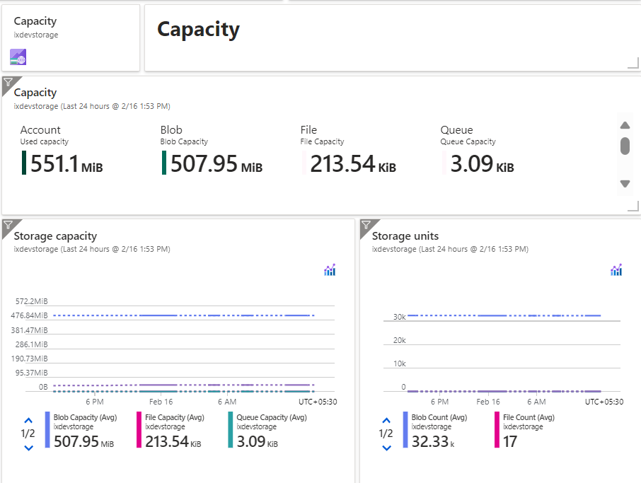

| **Storage Capacity** | **Storage Trends** |
| --- | --- |
| Displays the current storage capacity of the storage account, indicating how much data can be stored within the allocated resources. | Analyzes trends in storage capacity over time and provides insights into data growth patterns that help users anticipate future storage requirements for effective capacity planning and resource allocation. |
|  |

### Alerts and Notifications

Alerts are triggered if the availability of Blob Storage falls below the set threshold, or if the end-to-end (E2E) latency or server latency exceeds predefined limits. Additionally, alerts are generated when the used capacity of Blob Storage surpasses the required limit. These alerts and notifications are sent via email to the stakeholders to monitor Blob Storage health and performance effectively, facilitating timely interventions to maintain optimal functionality and prevent potential disruptions.

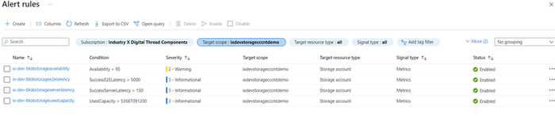

## DQResults Dashboard

The DQResults dashboard serves as a centralized hub for monitoring data contracts and data quality information and provides stakeholders with comprehensive insights in one convenient location.

This dashboard showcases all components associated with Data Quality and the Great Expectations API, including Great Expectations API outputs, logs, Azure Data Factory (ADF) pipelines, and triggers. By aggregating these components, stakeholders can effectively track data quality metrics, assess performance, and ensure adherence to data contracts, streamlining the monitoring process, and enhancing overall data governance.

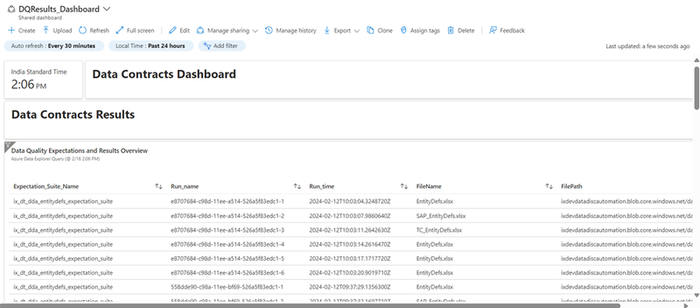

### Data Contracts Results

Data Contracts Results presents the validation output queried by the Great Expectations (GE) API, providing stakeholders with detailed insights into data validation results.

In the data pipeline architecture, the GE-API serves as the initial data source, facilitating the collection of relevant data. This data is then transmitted to the Event Hub, acting as an intermediary layer for data transfer and processing. From the Event Hub, the data is seamlessly integrated into an Azure Data Explorer (ADX) table, where it undergoes further processing and transformation. ADX offers powerful querying capabilities and efficient data storage, enabling us to organize and analyze the data effectively. Finally, the processed data is visualized and presented in a workbook, which is subsequently pinned to a dashboard for convenient access and monitoring. This streamlined workflow ensures that data flows smoothly from its source to its visualization, facilitating comprehensive insights and informed decision-making.

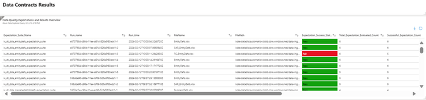

-   **Expectation Suite Name:** Displays the name of the expectation suite, which represents a collection of expectations or rules defining criteria for acceptable data behavior.

-   **Run Name:** Each validation run triggered by the GE API is assigned a unique run name, allowing for traceability, and tracking of individual validation instances.

-   **Run Time:** Indicates the timestamp when the GE API was executed on a specific file, providing information about when the validation occurred.

-   **File Name:** Shows the name of the file that underwent validation using the GE API, enabling stakeholders to identify the data source being validated.

-   **File Path:** Specifies the path of the file within the storage system, facilitating accessibility and reference to the validated data.

-   **Expectation Success Status:** Provides an overall status indicating whether the data met the defined expectations successfully. This status serves as a key indicator of data quality and adherence to predefined validation criteria.

-   **Succeeded Expectations:** Lists the expectations that were successfully met during the validation process, along with their column names and expectation types.

-   **Failed Expectations:** Presents the expectations that failed to be met during validation, accompanied by their column names and expectation types.

For example, in data validation scenarios, let\'s consider a dataset where multiple expectations are defined. Suppose during validation, five expectations are successfully met, indicating that the data adheres to predefined criteria. However, one expectation fails, indicating a deviation from expected data behavior. As a result, the overall expectation_success_status is labeled as \"fail\" due to the presence of the failed expectation. To provide stakeholders with a deeper understanding, they can review the specifics of both the succeeded and failed expectations. This includes examining the associated column names and types for each expectation. Such detailed insights empower stakeholders to identify areas of success and areas needing attention, facilitating informed decision-making to uphold data integrity and quality.

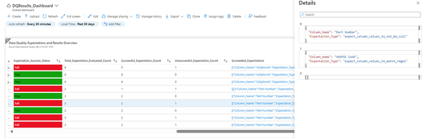

### Data Contract API Logs

The concise display of log messages and timestamps in the Data Contract API Logs enables stakeholders to efficiently track activities related to data contract management. Users can conveniently search for specific log messages, download logs for further analysis, and refresh the display as needed. It\'s important to note that due to Azure limitations, only up to 10,000 rows of log data can be shown at a time.

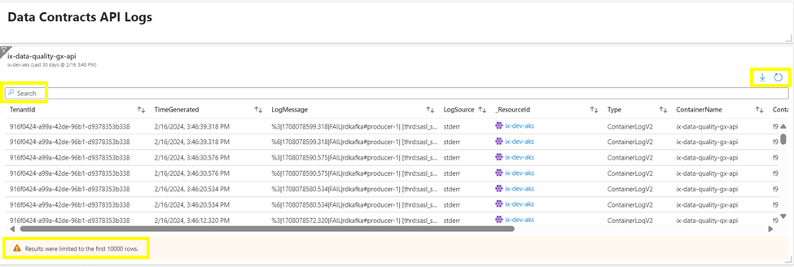

### Data Quality Pipeline Runs

Data Quality Pipeline Runs shows detailed information in various visualization formats for enhanced understanding. Users can explore pipeline counts by name, identify failing pipelines, and analyze pipelines with longer execution times. Additionally, the dashboard offers an overview of the overall success and failure rates, with interactive charts that redirect to workbooks for further exploration. Users can also download data for deeper analysis as needed.

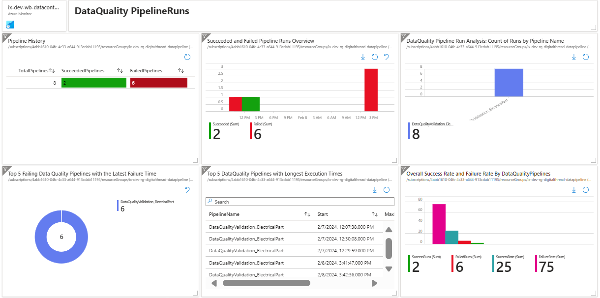

### Data Quality Pipeline Alerts

In case of a data quality pipeline failure, alerts are automatically generated and displayed on the dashboard. Users can easily track the count of these alerts over time through a timeline visualization. Additionally, detailed information such as run ID, activity name, and other relevant details of the failed pipeline are provided for each alert. This comprehensive approach enables stakeholders to promptly identify and address any issues impacting data quality processes and ensures the integrity and reliability of their data assets.

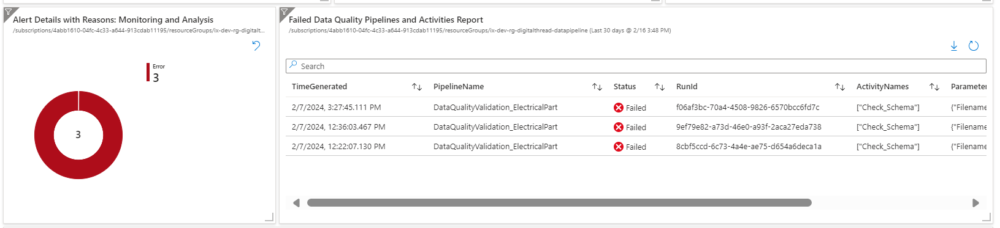

### GEValidation Trigger Runs

This comprehensive overview of GE validation triggers provides insights into both successful and failed trigger executions. Users can easily assess the count of successful and failed triggers over time, along with detailed insights into trigger distribution. Additionally, the dashboard offers valuable insights into trigger execution, enabling stakeholders to monitor performance and identify any issues promptly. With interactive features, users can delve deeper into trigger execution details, facilitating efficient monitoring and optimization of data validation processes.

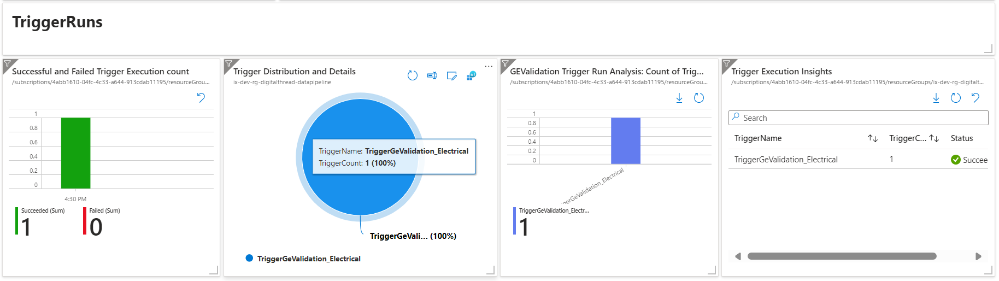

## Kubernetes-ix-dev-aks Dashboard

This dashboard offers a comprehensive suite of insights and metrics tailored to facilitate efficient management and optimization of ix-dev-aks Kubernetes cluster within the IX-Digital Thread.

### Node Disk Capacity

Real-time monitoring of node disk capacity enables users to track disk usage trends and ensure optimal allocation of storage resources across nodes.

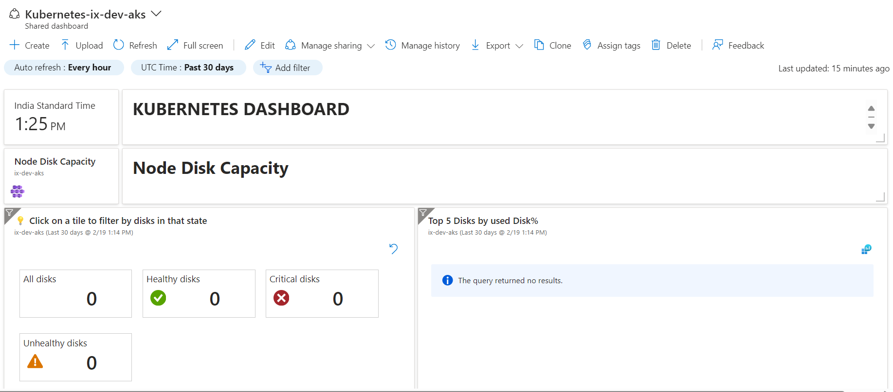

###  Workload Details

Detailed information on the workloads deployed within Kubernetes clusters includes pod status, resource consumption, and deployment history for effective management and monitoring of applications.

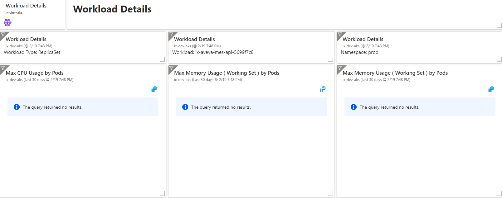

### Container Insights Usage

Insights into container performance and resource utilization enables optimization of container configurations and identification of potential performance bottlenecks.

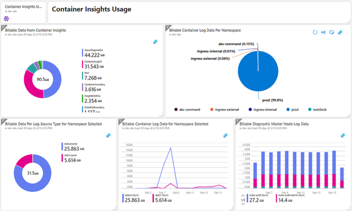

###  Node Disk IO

Monitors disk input/output (IO) activity on cluster nodes, helping users assess disk performance and identify any IO-related issues impacting application performance.

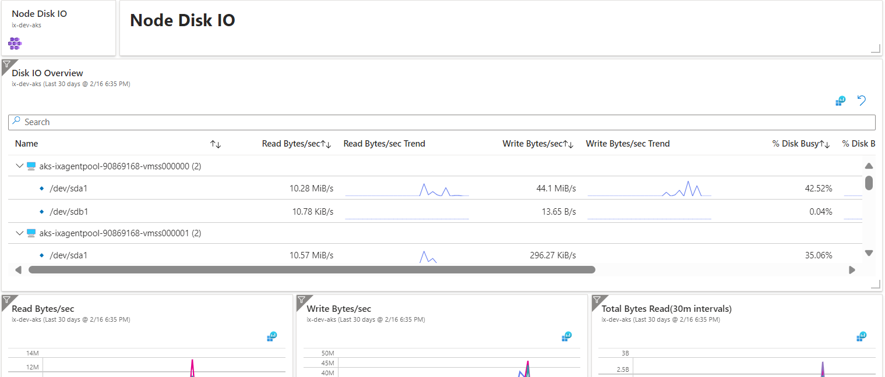

### Node Network

Offers visibility into network activity and performance metrics at the node level, facilitating troubleshooting of network-related issues and optimization of network configurations.

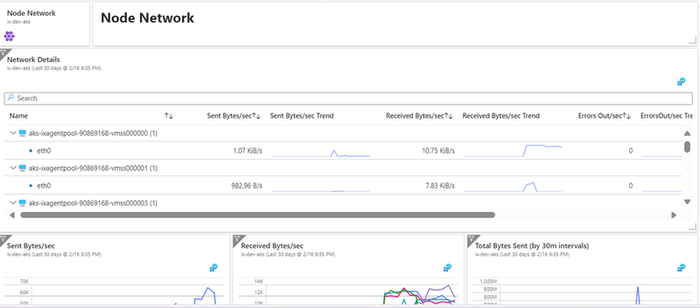

### **Deployments and HPAs** 

Provides insights into deployment status and HPA (Horizontal Pod Autoscaler) configurations, enabling users to monitor application scalability and automatically adjust resources based on demand.

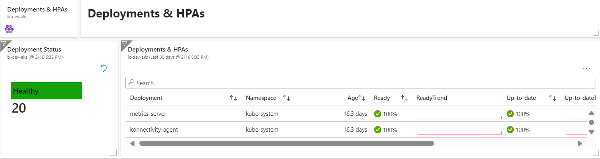

### Kubelet

Offers insights into Kubelet operations and performance metrics, allowing users to monitor the health and performance of Kubelet agents running on cluster nodes.

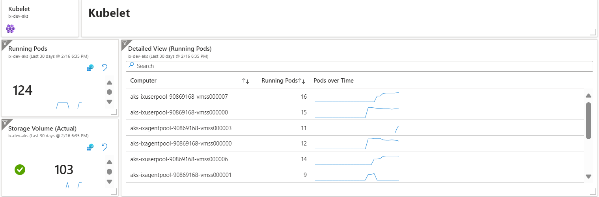

### Operations

The Operations section of the dashboard (below) provides essential insights for managing Kubernetes clusters efficiently. With the Overview by Node feature, users can monitor operational metrics specific to each node, enabling effective node management and issue resolution. Additionally, the Overview by Operation feature categorizes cluster operations by type, offering visibility into critical aspects such as pod scheduling and node management.

###  Performance Metrics

The performance metrics panes offer a comprehensive view of cluster performance metrics, including CPU, memory, and network usage, enabling users to identify performance bottlenecks and optimize resource allocation.

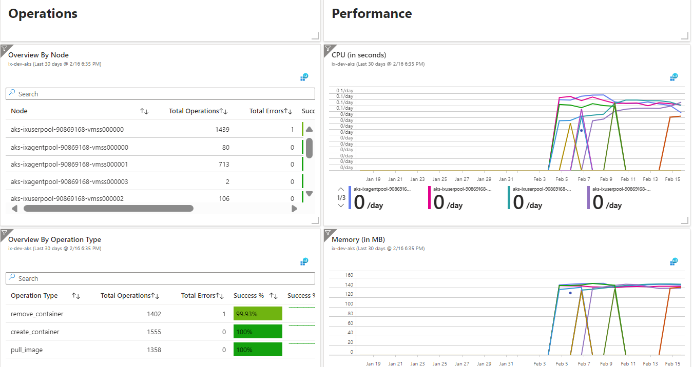

### API Logs 

Provides access to Kubernetes API logs, allowing users to monitor API activity, troubleshoot issues, and audit cluster operations effectively.

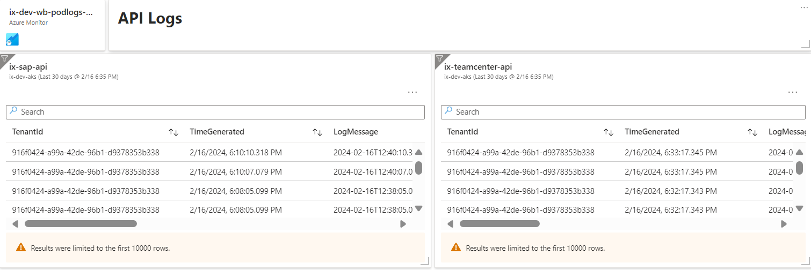

Users can download logs directly from the dashboard itself, facilitating offline analysis and sharing with stakeholders. Additionally, users can view 10,000 rows of logs within the dashboard. To view more rows or to search for specific log messages, users can export the logs to Excel. However, any logs containing special symbols may not be exported to Excel due to limitations within the Microsoft ecosystem.

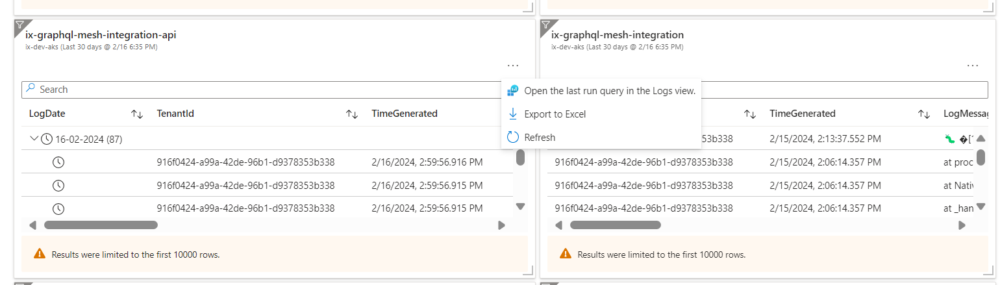

### Log Analytics Workspace

To retrieve more than 10k rows of logs, users can utilize the designated icon
within the dashboard, which directs them to the Log Analytics workspace. There, they can access and download all the logs seamlessly.

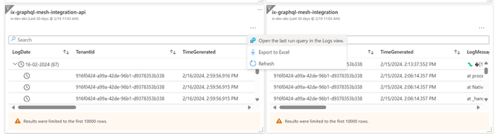

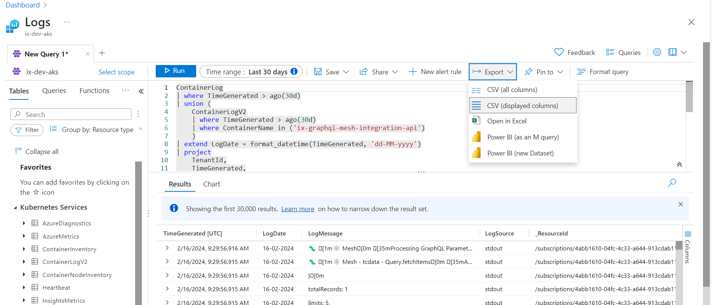

## Purview Dashboard

The Microsoft Purview Dashboard provides users with a centralized platform to manage, govern, and gain insights from the data assets across various sources. This intuitive dashboard offers a comprehensive view of data lineage, data classification, data discovery, and data usage analytics. Users can track data flows, understand data origins and transformations, classify sensitive data, and monitor data access and usage patterns. With interactive visualizations and customizable reports, the Purview Dashboard empowers organizations to ensure data compliance, enhance data security, and optimize data-driven decision-making processes.

### Data Source Scan

The Data Source Scan section of the dashboard provides users with detailed insights into the scanning process of data sources within the organization.

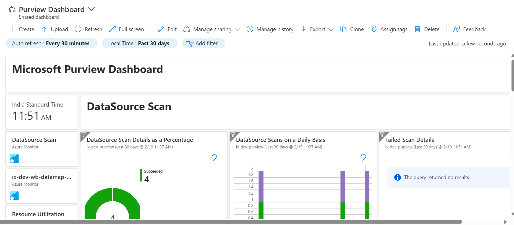

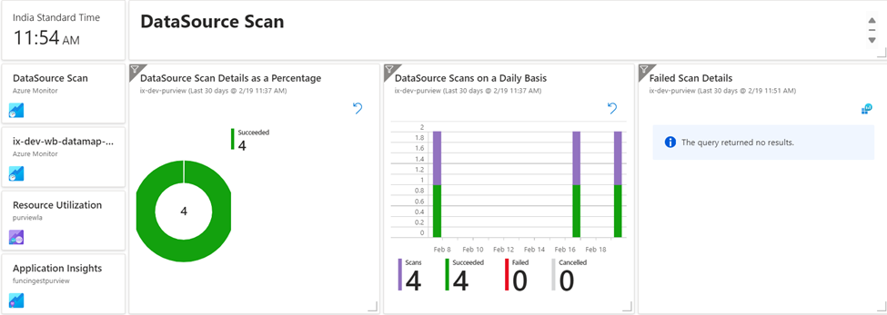

**Data Source Scan Details as a Percentage**

This feature displays the overall progress of data source scanning as a percentage, allowing users to track the completion status of the scanning process across all data sources.

**Data Source Scan Details on Daily Basis**

Users can view the daily breakdown of data source scanning activities, including the number of sources scanned, scan duration, and any issues encountered during the process. This helps users monitor the scanning frequency and identify any trends or anomalies over time.

**Failed Scan Details**

Failed Scan Details provides information on the specific sources affected and the reasons for the failure. Users can take proactive measures to address the issues and ensure comprehensive scanning coverage across all data sources.

### Assets Discovered 

The Assets Discovered section of the dashboard offers valuable insights into the discovery and classification of data assets within the organization.

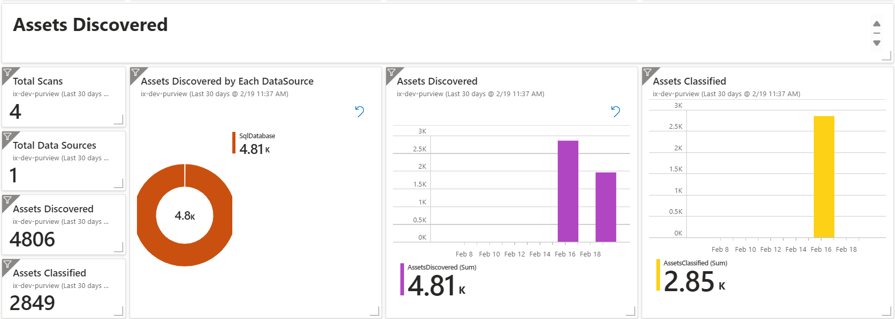

-   **Total Scans:** This metric indicates the overall number of scans conducted to discover data assets across different data sources. It provides an overview of the scanning frequency and the extent of coverage in identifying new assets.

-   **Total Data Sources:** Users can track the total number of data sources included in the scanning process, helping to ensure comprehensive coverage and visibility into all data repositories within the organization.

-   **Assets Discovered by Each Data Source:** This feature provides a breakdown of assets discovered by each individual data source. Users can assess the effectiveness of each source in uncovering new assets and identify any sources that may require further attention or optimization.

-   **Assets Classified:** Users can monitor the number of assets that have been successfully classified based on predefined criteria such as sensitivity, importance, or regulatory compliance. This metric helps organizations ensure proper data governance and compliance measures are in place for all identified assets.

### Data Map

The Data Map section of the dashboard offers insights into the management and organization of data within the organization.

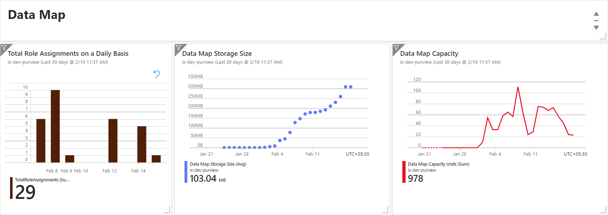

**Total Role Assignments on Daily Basis**

This metric tracks the number of role assignments made within the data map on a daily basis. It provides visibility into access controls and permissions granted to users, ensuring proper governance and security of data assets.

**\
Data Map Storage Size**

Users can monitor the total storage size occupied by the data map, including metadata, lineage information, and other associated data. This metric helps organizations manage storage resources efficiently and plan for future scalability needs.

**\
Data Map Capacity**

This feature assesses the overall capacity or limit of the data map in terms of storing metadata, lineage information, and other relevant data. It ensures that the data map can effectively accommodate the growing volume of data assets and associated information within the organization\'s ecosystem.

### Resource Utilization 

The Resource Utilization section of the dashboard provides insights into the utilization of resources within the data management system.

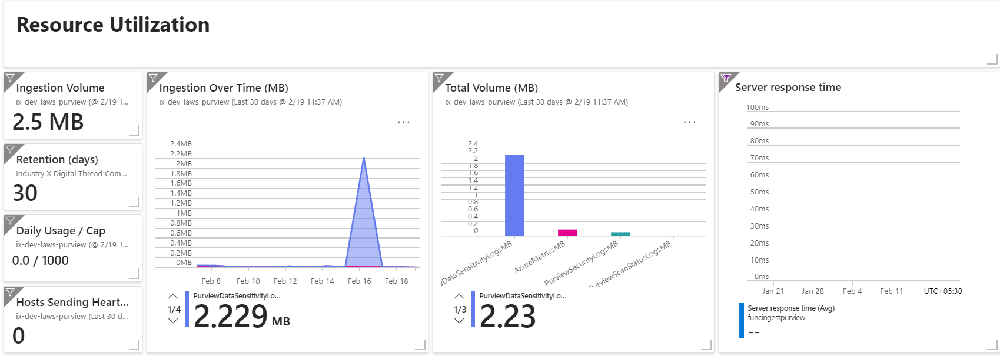

**Ingestion Over Time (MB)**

This metric tracks the volume of data ingested into the system over time, measured in megabytes (MB). It helps users monitor data ingestion trends, identify peak periods of activity, and assess the overall throughput of the system.

**\
Total Volume (MB)**

Users can view the total volume of data stored within the system, measured in megabytes (MB). This metric provides an overview of the data footprint and helps users understand the scale of data managed by the system.

**\
Server Response Time**

This feature measures the average response time of the server when processing requests from users or applications. It helps users assess the performance and responsiveness of the system, ensuring timely access to data and efficient utilization of resources.

### Alerts and Notifications

Alerts will be triggered in the event of a Purview collection deletion or when a role assignment is performed or updated. These notifications will be promptly sent to the designated audience to ensure timely awareness and action on important changes within the data management system.

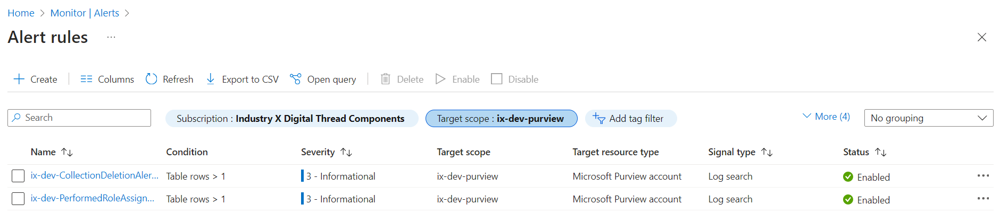
