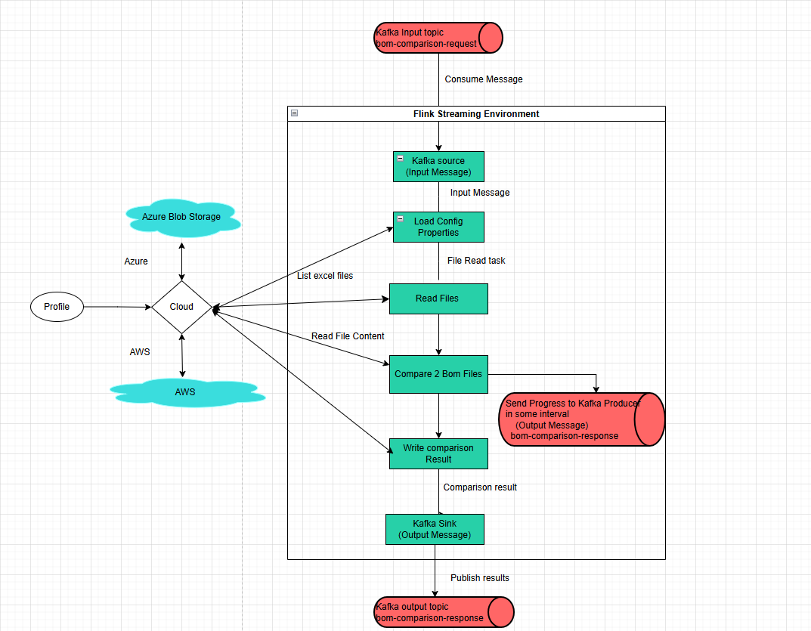

Digital Thread Foundations

BOM Comparison

FLINK JOB OVERVIEW

Release Version: 1.2

Metadata Table

| **Field** | **Value** |
| --- | --- |
| **Asset / Solution Name** | Digital Thread |
| **Domain / Area** | Engineering |
| **Owner (Team/Person)** | Karthik Ramachandra |
| **Reviewers** | Karthik Ramachandra |
| **Status** | Approved / Complete |
| **Confidentiality** | Internal / Confidential |
| **Source of Truth** | [link](https://dev.azure.com/IXAssets/IXAssetsProject/\_git/ixassets) |
| **Related Assets / Alternatives** | AOT / Engineering Orchestration / Engineering Agents |
| # | \{#section .TOC-Heading\} |

## Introduction

A digital thread refers to the continuous and consistent flow of information throughout the entire lifecycle of a product or system - from design and development to operation and maintenance. It enables the integration of data from different stages and sources, allowing effective traceability, seamless collaboration, and efficient decision-making by unleashing the power of sleeping data. Digital Thread is a communication framework that helps integrate various enterprise systems involved in the engineering and manufacturing product life cycle.

IX Digital Thread\'s BOM Management application ensures product structure data remains accurate, consistent, and traceable across the lifecycle. It offers three key capabilities: BOM Conversion, BOM Comparison, and Data Quality Check, and these are achieved using Flink Jobs.

The BOM Comparison feature enables users to compare BOM files from different sources. This process automates the identification of differences between source and target BOMs, providing detailed comparison reports that highlight changes in components, quantities, and specifications. The system supports asynchronous processing to handle large BOM files efficiently through job-based architecture.

The BOM Comparison Flink Job is a real-time data processing pipeline designed to enable users to compare Bill of Materials (BOM) files from different sources. The job leverages Apache Flink for distributed stream processing, ensuring scalability, fault tolerance, and low-latency processing. It handles asynchronous processing of BOM comparison requests, integrating with Kafka for message ingestion and publishing, and leveraging Flink\'s streaming capabilities to process data in real-time.

This job processes incoming events, validates the data, triggers the BOM comparison process, and generates a response with the status and results of the comparison. It is designed to be scalable, fault-tolerant, and efficient for large-scale data processing.

### Purpose

This document provides an overview of the Flink job used for the BOM Comparison feature of the BOM Management application.

### Target Audience

-   Developers

-   Business Analysts

-   Design, Manufacturing, and QA Engineers

-   Accenture teams deploying the BOM Management application.

### Prerequisites

-   The BOM Management application should be deployed.

-   Access to the application (provided by [IX_DT_DEVOPS_INFRA@accenture.com](mailto:IX_DT_DEVOPS_INFRA@accenture.com))

### Contacts

-   [karthik.ramachandra@accenture.com](mailto:karthik.ramachandra@accenture.com)

-   [vamsi.konambhotla@accenture.com](mailto:vamsi.konambhotla@accenture.com)

-   [d.rajesh.boricha@accenture.com](mailto:d.rajesh.boricha@accenture.com)

-   [stefano.giacco@accenture.com](mailto:stefano.giacco@accenture.com)

-   [phani.kumar.koduri@accenture.com](mailto:phani.kumar.koduri@accenture.com)

-   [d.choukse@accenture.com](mailto:d.choukse@accenture.com)

### Related Links

-   [BOM Management Documentation](https://industryxdevhub.accenture.com/assetdetails/115)

-   [Digital Thread Foundations Documentation](https://industryxdevhub.accenture.com/asset-home;search_text=IX%20Digital%20Thread)

### 

# Key Features

The following are the key features of the BOM Comparison Flink job.

-   **Real-Time Processing:** Processes data in real-time, ensuring timely delivery of BOM comparison status.

-   **Validation and Exception Handling:** Ensures that all required fields are present in the MBOM template, throwing exceptions for missing fields.

-   **Scalability**: Built on Apache Flink, the job can scale horizontally to handle large volumes of data.

-   **Fault Tolerance**: Flink\'s checkpointing and state management ensure reliability in case of failures.

-   **Asynchronous Processing:** Utilizes AsyncDataStream.unorderedWait to handle events asynchronously, ensuring high throughput and low latency.

-   **Kafka Integration**: Reads BOM comparison requests from a Kafka topic and publishes the results to another Kafka topic.

-   **Error Handling:** Implements robust error handling and timeout mechanisms to manage failures gracefully.

-   **Dynamic Configuration**: Configures Flink\'s environment dynamically, including restart strategies, heartbeat intervals, and timeouts, based on application properties.

-   **Cloud-Agnostic**: Supports both Azure and AWS environments, with configurations for respective cloud services like Azure Blob Storage, AWS S3, and their Kafka setups.

## Workflow

The Flink job is comprised of the following steps:

1.  **Job Initialization** - The Flink job starts by configuring the StreamExecutionEnvironment using the configureFlinkEnvironment method. This method sets up Flink\'s restart strategy, heartbeat intervals, and other configurations dynamically based on application properties.

2.  **Kafka Source Setup** - A Kafka source is created using the KafkaConfig.createKafkaSource() method. This source reads BOM comparison requests from a Kafka topic.

3.  **Data Stream Processing** - The data stream from the Kafka source is processed asynchronously using AsyncDataStream.unorderedWait. The AsyncBomComparisonFunction is used to handle each event asynchronously. Key steps in this function include:

-   Parsing the incoming event.

-   Validating the event data (e.g., jobId/comparisonId, sourceFolder, destinationFolder).

-   Triggering the BOM comparison process via the BomComparisonProcessService.

-   Constructing a response payload with the comparison results or error details.

4.  **Timeout Handling** - If the asynchronous processing of an event exceeds the configured timeout, the timeout method of AsyncBomComparisonFunction is invoked to handle the timeout gracefully.

5.  **Kafka Sink Setup** - A Kafka sink is created using the KafkaConfig.createKafkaSink() method. This sink is used to publish the results of the BOM comparison process to another Kafka topic.

6.  **Job Execution** - The Flink job is executed using env.execute(\"Flink Bom Comparison Job\").

### 

# Configuration Parameters

The parameters listed below ensure that the Flink environment is properly configured for distributed processing, storage integration, and monitoring.

| Parameter | Description Default Value |
| --- | --- |
| FLINK_VERSION | Specifies the version of Apache Flink to be installed. |
| SCALA_VERSION | Specifies the Scala version compatible with the Flink version. |
| FLINK_HOME | Defines the installation directory for Flink. |
| rest.port | Configures the REST API port for Flink. containerPort |
| taskmanager.memory.process.size | Sets the memory size allocated to the TaskManager process. 2048m |
| s3.access-key | Specifies the access key for S3 storage integration. |
| s3.secret-key | Specifies the secret key for S3 storage integration. |
| fs.azure.account.key.\.blob.core.windows.net | Configures the secret key for Azure Blob Storage access. azureBlobStorageSecretKey |
| javaagent | Adds the Application Insights Java agent for monitoring and telemetry at /deployments/applicationinsights-agent-3.7.3.jar. |
| rest.profiling.enabled | Enables profiling for Flink. true |
| pekko.framesize | Configures the maximum frame size for Pekko. 512MiB |
| pekko.remote.maximum-frame-size | Sets the maximum frame size for remote communication. 512MiB |
### Flink Plugins

| Plugin | Path |
| --- | --- |
| S3 Plugin | \$FLINK_HOME/plugins/s3-fs-hadoop |
| Azure Plugin | \$FLINK_HOME/plugins/azure-fs-hadoop |
### 

## Flink BOM Comparison Overview Diagram

The following diagram describes the Flink job overview in a component-wise approach. The key components/processes are discussed in the subsequent sections.

### 

## Components

#### Environment Profile Selection

The profile property is used to determine whether the application will operate within an AWS or Azure environment. Depending on the chosen profile, the application automatically loads the appropriate configuration settings to ensure compatibility with the selected cloud provider.

#### Secure Credential Fetching

For Azure deployments, sensitive credentials such as Kafka connection strings are securely retrieved using Azure Key Vault, with the ClientSecretCredential and SecretClient classes facilitating authentication and secret management. In contrast, AWS environments obtain critical configuration details, including IAM-based authentication for Kafka, directly from the designated property files.

#### Cloud Storage Service

The application offers a unified service layer for cloud storage operations, supporting both Azure and AWS S3. Through the CloudStorageService and AwsS3StorageServiceImpl service, users can read and write files, check for file existence, and list files or folders, streamlining interactions with cloud-based storage solutions.

#### Kafka Configuration (KafkaConfig)

Kafka producers and consumers are configured according to the deployment profile-either AWS or Azure. The application obtains sensitive connection information from Azure Key Vault or AWS-specific properties and establishes Kafka sources for message consumption and sinks for message production.

#### Flink Integration

Flink\'s KafkaSource is used to consume messages from Kafka topics, while KafkaSink enables the application to produce messages to these topics. Flink jobs are set up to process data with defined delivery guarantees, such as AT_LEAST_ONCE, ensuring reliable message handling.

#### Load Config Properties

Environment-specific property files (application-aws.properties or application-azure.properties) are used to define the application\'s configurations. The application first checks if the main configuration file exists in cloud storage; if present, it loads the properties from this file. Should the file be empty or absent, a warning is logged, and default properties are loaded from application.properties, after which the configuration is saved back to cloud storage.

#### Read Files

The application supports reading files directly from cloud storage locations, including both Azure and AWS S3, facilitating seamless access to required resources.

#### Compare Two BOM Files and Write Comparison Result

The application contains functionality for comparing two BOM files by processing their respective source and destination folders. Progress updates are periodically sent to a Kafka producer, and upon completion, a comprehensive report detailing the comparison results is generated and uploaded to the relevant cloud storage service, such as AWS S3 or Azure Blob Storage.

### 

## Requests and Responses

Flink jobs integrate with Kafka or other messaging systems. Below are guidelines for defining request/response topics and message schemas.

#### Request Topics

-   Topic Name/Event hub name: bom-comparison-request

-   Usage: Incoming requests for job Id/Comparison Id, message Id, configuration changes, or comparison operations and source and destination folder.

**Sample Message Format (JSON):**

\{

\"jobId\": \"74f83085-825d-4063-9884-df2c74d182b1\",

\"messageId\": \"BOM_COMPARISON_REQUEST\",

\"timestamp\": \"2025-08-26T16:03:33Z\",

\"operation\": \"START_COMPARE\",

\"data\": \{

\"sourceFolder\": \"BomComparison/Input/TC_BOM_GLS_LW_FULL\",

\"destinationFolder\": \"BomComparison/Input/S4_BOM_GLS_FULL\"

\}

\}

#### Response Topics

-   Topic Name/Event hub name: bom-comparison-request

-   Usage: Outgoing responses from Flink jobs or APIs after processing the request.

**Sample Message Format (JSON):**

\{

\"jobId\":\"74f83085-825d-4063-9884-df2c74d182b1\",

\"messageId\":\"BOM_COMPARISON_RESPONSE\",

\"timestamp\":1752661064044,

\"data\":

\{

\"currentBomId\":\"1252-912-01\",

\"memoryUsage\":\"0%\",

\"processedFiles\":\"5\",

\"totalFiles\":\"63\",

\"status\":\"IN_PROGRESS\",

\"sourceFolder\": \"BomComparison/Input/TC_BOM_GLS_LW_FULL\",

\"destinationFolder\": \"BomComparison/Input/S4_BOM_GLS_FULL\"

\}

\}

**Error Handling Response**

\{

\"jobId\":\"74f83085-825d-4063-9884-df2c74d182b1\",

\"messageId\":\"BOM_COMPARISON_RESPONSE\",

\"timestamp\":1752661064044,

\"data\":

\{

\"status\":\"FAILURE \",

\"errorMessages\":\"Async call timed out\"

\}

\}

### 

## APIs

There are four APIs involved:

-   **List Jobs** retrieves a list of all running or completed Flink jobs.

-   **Task Managers** retrieves a list of task managers in the Flink cluster.

-   **Task Manager Log** retrieves the log of a specific task manager.

-   **Job Manager Log** retrieves the log of the job manager.

Each of the APIs listed above is detailed in the following sections.

#### List Jobs

This API retrieves a list of all running or completed Flink jobs.

| PROTOCOL | HTTPS |
| --- | --- |
| DEV ENDPOINT |  |
| QA ENDPOINT |  |
| METHOD | GET |
| CONTENT TYPE | application / json |
##### Input Header

| Parameter | Description |
| --- | --- |
| Ocp-Apim-Subscription-Key | Unique identifier and specifies subscription key |
| Authorization | JWT token |
##### Result

| HTTP Code | Result Description |
| --- | --- |
| 200 | ok |
##### Error Management

| HTTP Code | Error Code Error Description |
| --- | --- |
| 500 | 500 Project Specific error |
| 403 | 403 Forbidden |
| 401 | 401 Invalid Subscription key / Invalid Token |
| 400 | 400 Bad request |
##### Response

\{

\"jobs\": \[

\{

\"id\": \"cb9b06f01db563e0fe967cd4e18b59d8\",

\"status\": \"RUNNING\"

\}

\]

\}

#### 

### Task Managers

This API retrieves a list of task managers in the Flink cluster

| PROTOCOL | HTTPS |
| --- | --- |
| DEV ENDPOINT | [https://ixts-dev-apim.azure-api.net/bomComparision-flink-file-reader-api/taskmanagers] |
| QA ENDPOINT |  |
| METHOD | GET |
| CONTENT TYPE | application / json |
##### Input Header

| Parameter | Description |
| --- | --- |
| Ocp-Apim-Subscription-Key | Unique identifier and specifies subscription key |
| Authorization | JWT token |
##### Result

| HTTP Code | Result Description |
| --- | --- |
| 200 | ok |
##### Error Management

| HTTP Code | Error Code Error Description |
| --- | --- |
| 500 | 500 Project Specific error |
| 403 | 403 Forbidden |
| 401 | 401 Invalid Subscription key / Invalid Token |
| 400 | 400 Bad request |
##### Response

[Link](https://ts.accenture.com/:t:/r/sites/GlobalDocTemplates/Published%20Documents/IX%20Thread/Linked%20Files/Flink%20Job/BOM%20Comparison/GET_Taskmanagers_Sample_Response.txt)

#### Task Manager Log

This API retrieves the log of a specific task manager.

| PROTOCOL | HTTPS |
| --- | --- |
| DEV ENDPOINT | [https://ixts-dev-apim.azure-api.net/bomComparision-flink-file-reader-api/taskmanagers/\{tm-id\}/log] |
| QA ENDPOINT | [https://ixts-qa-apim.azure-api.net/bomComparision-flink-file-reader-api/taskmanagers/\{tm-id\}/log] |
| METHOD | POST |
| CONTENT TYPE | application / json |
##### Input Path

| Parameter | Description |
| --- | --- |
| Tm-id | Unique identifier and specifies the type of data to retrieve |
##### Input Header

| Parameter | Description |
| --- | --- |
| Ocp-Apim-Subscription-Key | Unique identifier and specifies subscription key |
| Authorization | JWT token |
##### Response

[Link](https://ts.accenture.com/:t:/r/sites/GlobalDocTemplates/Published%20Documents/IX%20Thread/Linked%20Files/Flink%20Job/BOM%20Comparison/POST_Taskmanagers_Logs_Sample_Response.txt)

#### Job Manager Log

This API retrieves the log of the job manager.

| PROTOCOL | HTTPS |
| --- | --- |
| AZURE DEV ENDPOINT |  |
| AZURE QA ENDPOINT |  |
| AWS DEV ENDPOINT |  |
| METHOD | POST |
| CONTENT TYPE | application / json |
##### Input Header

| Parameter | Description |
| --- | --- |
| Ocp-Apim-Subscription-Key | Unique identifier and specifies subscription key |
| Authorization | JWT token |
##### Result

| HTTP Code | Result Description |
| --- | --- |
| 200 | ok |
##### Error Management 

| HTTP Code | Error Code Error Description |
| --- | --- |
| 500 | 500 Project Specific error |
| 403 | 403 Forbidden |
| 401 | 401 Invalid Subscription key / Invalid Token |
| 400 | 400 Bad request |
##### Response

[Link](https://ts.accenture.com/:t:/r/sites/GlobalDocTemplates/Published%20Documents/IX%20Thread/Linked%20Files/Flink%20Job/BOM%20Comparison/POST_Jobmanager_Logs_Sample_Response.txt)
