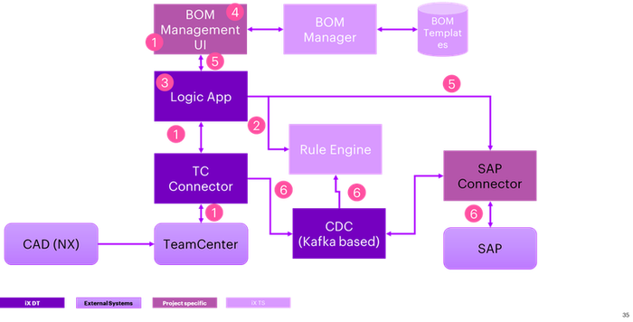
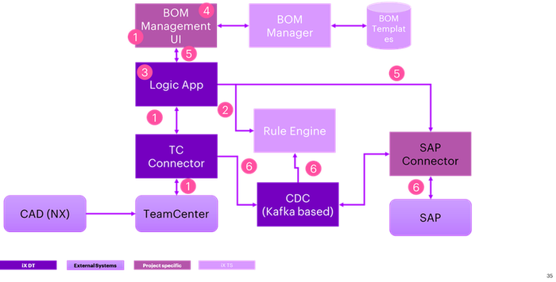

DIGITAL THREAD FOUNDATIONS

BOM Conversion

ARCHITECTURE BLUEPRINT

Release Version: 1.2

**Metadata Table**

| **Field** | **Value** |
| --- | --- |
| **Asset / Solution Name** | Digital Thread |
| **Domain / Area** | Engineering |
| **Owner (Team/Person)** | Karthik Ramachandra |
| **Reviewers** | Karthik Ramachandra |
| **Status** | Approved / Complete |
| **Confidentiality** | Internal / Confidential |
| **Source of Truth** |  |
| **Related Assets / Alternatives** | AOT / Engineering Orch / Engineering Agents |

## Introduction

Industry X Digital Thread Foundations delivers industry-agnostic building blocks that create a virtualization layer over connected products, operations, and services. It provides a communication framework connecting different systems involved in the product lifecycle so that data can be shared, thus leading to improvements in industrial and manufacturing processes. IX Digital Thread goes beyond just the data. It provides end-to-end information that is relevant to an asset and thus drives efficiency and value for a business.

The EBOM to MBOM Conversion feature in BOM Management enables users to efficiently transform an Engineering Bill of Materials (EBOM) into a Manufacturing Bill of Materials (MBOM) within a structured workflow. This process ensures that engineering data is accurately translated into a manufacturable format while maintaining traceability and version control.

To enhance security and compliance, the application integrates MSAL authentication for user login. Upon successful authentication, users are redirected to the dashboard, where they can access converted MBOMs, initiate a new conversion, or manage their profile details.

The application provides a centralized repository displaying all converted MBOMs in a tabular format, allowing users to track the status of each conversion. Each MBOM entry includes an Action button that navigates users to the Review Details Page, where authorized users can take necessary actions based on the MBOM's status, such as Approve, Reject, Delete, or Push to Target.

The conversion workflow involves selecting an EBOM, choosing an MBOM template, applying transformation rules, and finalizing the conversion. Once the process is complete, MBOMs appear in the dashboard, where users can review them and take appropriate actions based on their status.

This structured approach ensures a seamless and traceable EBOM-to-MBOM transformation while providing users with a clear and efficient review and approval process.

### Purpose

This document describes the technical architecture of the IX Digital Thread Foundations BOM Conversion asset.

### Target Audience

Developers, Business Analysts, and Accenture teams deploying the BOM Management application.

### Contacts

-   [karthik.ramachandra@accenture.com](mailto:karthik.ramachandra@accenture.com)

-   [stefano.giacco@accenture.com](mailto:stefano.giacco@accenture.com)

###  Prerequisites

-   The BOM Management application must be deployed and accessible.

-   BOM management API and its dependencies must be deployed.

-   Users must have valid login credentials with role-based permissions.

-   A supported browser (Google Chrome or Microsoft Edge) should be used.

### Technology Stack

| Tools | Repository |
| --- | --- |
| - angular - 17.3.0 | - Git branch name: dev |
| - bootstrap - 5.3.3 | - Git folder path: |
| - primeng -- 17.18.15 | &gt; Git -\&gt; Repos -\&gt; ixassets -\&gt; mbom -\&gt; ix-mbom-ui |
| - ng2-charts - 5.0.4 | - Git folder links:\ [ix-mbom-ui - Repos](https://dev.azure.com/IXAssets/IXAssetsProject/_git/ixassets?path=/mbom/ix-mbom-ui) |
| - swimlane/ngx-graph - 8.0.2 |  |
| - azure/msal-angular - 3.0.9 |  |
| - rxjs -- 7.8.0 |  |

### Related Links

-   [IX Digital Thread Foundations Documentation](https://industryxdevhub.accenture.com/asset-home;search_text=ix%20digital%20thread)

-   [BOM Management Documentation](https://industryxdevhub.accenture.com/assetdetails/115)

-   [Release Notes](https://industryxdevhub.accenture.com/assetdetails/84)

## MBOM Architecture -- BOM Transformation

The following image shows the EBOM to MBOM architecture for the BOM Transformation use case.

> **[KEY]**

Below is a step-by-step description of the flow.

### 1 - EBOM Ingestion from PLM (Siemens Teamcenter)

The EBOM is retrieved from Siemens Teamcenter using the Siemens Teamcenter Connector. While the IX Thread PLM connector is designed to support BOM data, integrating it requires more than just a configuration task. Instead, it involves customization and development effort to ensure seamless data ingestion from Teamcenter into the system.

### 2 - Business Rule Application

Once the EBOM data is ingested, it is processed by a rule engine according to predefined business rules. However. Additionally, the authoring of business rules is a customization effort that depends on client-specific and domain-specific requirements.

### 3 - Conversion from EBOM to MBOM

The conversion process from EBOM to MBOM is managed by the workflow engine. This step is primarily a configuration task, ensuring a structured transformation of BOM data. The conversion logic is implemented using Azure Data Factory (ADF) pipelines, which apply business rules to restructure the EBOM into an MBOM. To streamline the process, accelerators in the form of templates can be provided to assist with the conversion.

### 4 - Manual Review (Optional)

An optional manual review step allows users to review and approve the converted MBOM before further processing. The UI provides an interface for users to inspect and validate the changes made during the EBOM-to-MBOM transformation.

### 5 - Pushing MBOM to SAP (ERP)

Once the MBOM is finalized, it is pushed to the SAP (ERP) system using the SAP connector.

### 6 - Synchronizing Changes

The synchronization component is responsible for monitoring updates to BOM data. This is facilitated by the Change Data Capture (CDC) framework in IX Thread, which can track modifications and generate events accordingly. Implementing the CDC framework for monitoring BOM updates is primarily a configuration task. However, the propagation of changes is not currently supported and will require additional customization and development effort to ensure that updates are properly synchronized across systems.
