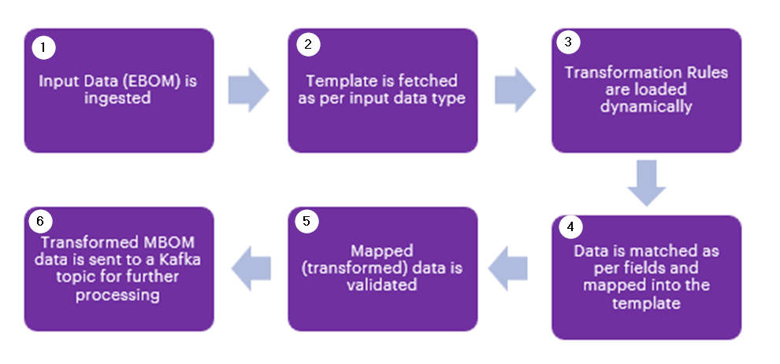

DIGITAL THREAD FOUNDATIONS

BOM Conversion

FLINK JOB OVERVIEW

Release Version: 1.2

**Metadata Table**

| **Field** | **Value** |
| --- | --- |
| **Asset / Solution Name** | Digital Thread |
| **Domain / Area** | Engineering |
| **Owner (Team/Person)** | Karthik Ramachandra |
| **Reviewers** | Karthik Ramachandra |
| **Status** | Approved / Complete |
| **Confidentiality** | Internal / Confidential |
| **Source of Truth** |  |
| **Related Assets / Alternatives** | AOT / Engineering Orch / Engineering Agents |

## 

# 

## Introduction

A digital thread refers to the continuous and consistent flow of information throughout the entire lifecycle of a product or system -- from design and development to operation and maintenance. It enables the integration of data from different stages and sources, allowing effective traceability, seamless collaboration, and efficient decision-making by unleashing the power of sleeping data. Digital Thread is a communication framework that helps integrate various enterprise systems involved in the engineering and manufacturing product life cycle.

IX Digital Thread's BOM Management application ensures product structure data remains accurate, consistent, and traceable across the lifecycle. It offers three key capabilities: BOM Conversion, BOM Comparison, and Data Quality Check, and these are achieved using Flink Jobs.

### Purpose

This document provides an overview of the Flink job used for BOM Conversion feature of the BOM Management application.

### Target Audience

-   Developers

-   Business Analysts

-   Design, Manufacturing, and QA Engineers

-   Accenture teams deploying the BOM Management application.

### Prerequisites

-   The BOM Management application should be deployed.

-   Access to the application (provided by [IX_DT_DEVOPS_INFRA@accenture.com](mailto:IX_DT_DEVOPS_INFRA@accenture.com))

### Contacts

-   [karthik.ramachandra@accenture.com](mailto:karthik.ramachandra@accenture.com)

-   [vamsi[.konambhotla@accenture.com](mailto:.konambhotla@accenture.com) ](mailto:vamsi.konambhotla@accenture.com)

-   [d.rajesh.boricha@accenture.com](mailto:d.rajesh.boricha@accenture.com)

-   [stefano.giacco@accenture.com](mailto:stefano.giacco@accenture.com)

-   [phani.kumar.koduri@accenture.com](mailto:phani.kumar.koduri@accenture.com)

-   [d.choukse@accenture.com](mailto:d.choukse@accenture.com)

### Related Links

-   [Digital Thread Foundations Documentation](https://industryxdevhub.accenture.com/asset-home;search_text=IX%20Digital%20Thread)

## BOM Conversion Flink Job 

The EBOM to MBOM Conversion feature enables users to efficiently transform an EBOM (Engineering Bill of Materials) into an MBOM (Manufacturing Bill of Materials) within a structured workflow. This process ensures that engineering data is accurately translated into a manufacturable format while maintaining traceability and version control.

The BOM Conversion Flink job is a real-time data processing pipeline designed to transform the EBOM data into MBOM data. The transformation is driven by predefined rules and templates, ensuring that the output adheres to the required MBOM structure. The job leverages Apache Flink for distributed stream processing, ensuring scalability, fault tolerance, and low-latency processing.

This Flink job is ideal for organizations that need to automate the transformation of EBOM data into MBOM format as part of their manufacturing or supply chain processes. By leveraging templates and rules, the job ensures consistency, reduces manual effort, minimizes errors, and accelerates data availability for downstream systems.

### 

## Key Features

The following points highlight the key features of the BOM Conversion Flink job.

-   **Real-Time Processing --** Processes data in real-time, ensuring timely delivery of MBOM data.

-   **Dynamic Rules and Templates --** Supports dynamic loading of rules and templates, enabling flexibility and adaptability.

-   **Validation and Exception Handling --** Ensures that all required fields are present in the MBOM template, throwing exceptions for missing fields.

-   **Scalability --** Built on Apache Flink, the job can scale horizontally to handle large volumes of data.

-   **Fault Tolerance --** Flink\'s checkpointing and state management ensure reliability in case of failures.

-   **Customizable Transformation --** Templates and rules can be tailored to meet specific business requirements.

### 

## Workflow

The Flink job is comprised of the following steps:

| Step | Description | Function |
| --- | --- | --- |
| 1 | Input Data Ingestion | The job consumes EBOM data from a Kafka topic, which serves as the source of raw input data. |
| 2 | Template Application | The job uses predefined templates and transformation rules to map and convert the EBOM data into MBOM format. The appropriate MBOM template is fetched based on the input data type. |
| 3 | Rules Application | The transformation rules are dynamically loaded from the Rules Repository. Then, the input data is updated into the template as per the transformation rules loaded. |
| 4 | Mapping | Fields are matched and mapped using JSON Path expressions. |
| 5 | Validation and Exception Handling | The job validates the mapping process to ensure that all required fields in the MBOM template are present. If any required fields are missing, an exception is thrown. |
| 6 | Output Data Delivery | The transformed MBOM data is sent to a Kafka topic, making it available for downstream systems or further processing. |

The Flink job orchestrates the entire flow by connecting the Kafka source, transformation logic, and Kafka sink into a seamless pipeline. The job processes incoming events in real time, ensuring efficient and reliable data transformation.

These components are described in the subsequent sections.

#### 

### 

#### Input Data Source

The EBOM data is ingested from a Kafka topic. This topic is configured in the config.properties file, which specifies the Kafka broker details, topic name, and other connection parameters. The input data typically contains structured information about engineering components, their relationships, and attributes.

#### BOM Templates

Templates define the structure and design patterns for MBOM data. These templates are stored in a centralized repository, such as a database or a file system. The job fetches the required template based on the type of EBOM data being processed. Templates ensure that the MBOM output adheres to a consistent structure and format.

##### Template Configurations

> If the template type is SAP, additional configuration data (config) is included. This configuration contains metadata such as header_data, plant_data, and client_data that are specific to SAP MBOM templates. These configurations are used to enrich the MBOM data with additional details required for SAP systems.
>
> Templates can also include element packages (defined in SAP Generic Template). These patterns dictate how components are organized and structured in the MBOM.

##### Example Template

-   An example of Generic Template for SAP can be found here: [SAP_Generic_Template.txt](https://ts.accenture.com/:t:/r/sites/GlobalDocTemplates/Published%20Documents/IX%20Thread/Linked%20Files/IXDT_SAP_Generic_Template.txt?csf=1&amp;web=1&amp;e=yH3kmT).

-   An example of a Generic MBOM template can be found here: [Generic_MBOM_Template.txt](https://ts.accenture.com/:t:/r/sites/GlobalDocTemplates/Published%20Documents/IX%20Thread/Linked%20Files/Flink%20Job/BOM%20Conversion/Generic_MBOM_Template.txt)..

#### 

### Business Rules

Transformation rules are stored in a rules repository, such as a database or configuration file.

These rules are defined in JSON Path format, which specifies how fields in the EBOM data map to fields in the MBOM template.

##### Example 1

Below is an example of a rule that demonstrates how conditions and actions are defined:

\{

\"id\": \"R0035\",

\"sequence\": 1,

\"conditions\": \{

\"field\": \[

\"\$.classification.name\",

\"\$.classification.properties.Capacity\[?(@.attrValue)\]\|\$.attrValue\"

\],

\"operator\": \[\"contains\", \"equals\"\],

\"value\": \[\"Storage\", \"1TB\"\]

\},

\"action\": \{

\"process\": \"accept\",

\"field\": \[\"\$.Categories\[?(@.CategoryName == \'VendorPurchasedItems\')\].Sub-ComponentTypes\[\*\].ElectronicParts\[\*\]\"\],

\"message\": \"Move RAM selected in packages to the category for Vendor Purchased Items -\&gt; Electronic Parts.\"

\}

\}

###### Conditions

-   The conditions section specifies the criteria that must be met for the rules to be applied. In this example:

    -   The field \$.classification.name must contain the value \"Storage\".

    -   The field \$.classification.properties.Capacity must equal \"1TB\".

-   Data comes in batches; if any batch of data doesn't match the conditions, then that batch is skipped.

-   If the last batch of data doesn't match the conditions of the rules, then the data will be returned as null to Kafka.

###### Actions

-   If the conditions are met, the action section defines what should happen:

    -   The process is set to \"accept\", meaning the data will be processed further.

    -   The field specifies the target location in the MBOM template where the data should be moved or updated.

    -   A message describes the action, such as moving RAM to a specific category.

This rule ensures that only data meeting specific conditions is processed and mapped to the appropriate location in the MBOM template.

If the required fields in the rule are not present in the MBOM template, the job will throw an exception, ensuring data integrity.

##### Example 2

Below is an example of a *transform* rule that demonstrates how conditions and actions are defined.

 

\[\{

  \"id\": \"R0001\",

  \"conditions\": \{

    \"field\": \[

      \"\$.classification.name\",

      \"\$.classification.properties.Type\[?(@.attrValue)\]\"

    \],

    \"operator\": \[\"equals\", \"equals\"\],

    \"value\": \[\"Memory_RAM\", \"\{Packages:Memory\}\"\] 

  \},

  \"action\":\{

      \"process\": \"transform\",

      \"message\": \"Select proper Ram\",

      \"field\": \[

        \"material_creation.material=\$.bomId\",

        \"material_creation.name=\$.parentBOMLineProperties.bl_line_name\",

        \"material_creation.header_data.matl_type=Finished Product\",

        \"material_creation.header_data.ind_sector=Retail\",

        \"material_creation.client_data.matl_type=Finished Product\",

        \"material_creation.client_data.matl_group=Electronic Part\",

        \"material_creation.client_data.base_uom=\$.parentBOMLineProperties.bl_item_uom_tag\",

        \"material_creation.client_data.base_uom_iso=\$.parentBOMLineProperties.bl_item_uom_tag\",

        \"material_creation.plant_data.proc_type=\$.parentBOMLineProperties.bl_rev_dtt5_part_source\",

        \"bom_creation.Material=\$.bomId\",

        \"bom_creation.ValidFrom=2025-01-01\",

        \"bom_creation.header_data.bom_text=\$.parentBOMLineProperties.bl_line_name\",

        \"bom_creation.header_data.base_quan=\$.parentBOMLineProperties.bl_quantity\",

        \"bom_creation.header_data.base_unit=\$.parentBOMLineProperties.bl_item_uom_tag\",

        \"bom_creation.bom_components\[0\].ItemCategory=L\",

        \"bom_creation.bom_components\[0\].ItemNo=\$.parentBOMLineProperties.bl_sequence_no\",

        \"bom_creation.bom_components\[0\].ItemNo=\$.parentBOMLineProperties.bl_sequence_no\",

        \"bom_creation.bom_components\[0\].Quantity=\$.parentBOMLineProperties.bl_quantity\",

        \"bom_creation.bom_components\[0\].Unit=\$.parentBOMLineProperties.bl_item_uom_tag\",

        \"bom_creation.level=\$.parentBOMLineProperties.bl_level_starting_0\",

        \"bom_creation.bomId=\$.bomId\",

        \"bom_creation.bomRevisionId=\$.bomRevisionId\",

        \"bom_creation.parentBomId=\$.parentBOMLineProperties.bl_formatted_parent_name\"

      \]

    \}

\]

######  

##### Conditions

-   The rule has two conditions that must be met simultaneously (using AND logic):

    -   The field \$.classification.name must exactly equal \"Memory_RAM\"

    -   The field \$.classification.properties.Type\[?(@.attrValue)\] equal the value from the Packages template, specifically the \"Memory\" package.

-   Looking at the codebase, specifically in BomProcessingService.java, we can see how these conditions are processed:

    -   The parseMappingRules method handles the rule parsing

    -   The replaceTemplateValue method is used to replace template values like \{Packages:Memory\} with actual values from the template JSON.

-   The conditions are evaluated using the specified operators (\"equals\" in this case).

###### Actions

-   When conditions are met, the action section defines the transformation:

    -   Process is set to \"transform\", indicating this is a transformation rule

    -   The field array contains a series of mappings that define how the data should be transformed

-   Each mapping follows the pattern target=source where:

    -   Target is the path in the output MBOM structure

    -   Source is the path in the input EBOM structure using JSONPath notation

-   The transformation includes:

    -   Material creation fields (material, name, header data, client data, plant data)

    -   BOM creation fields (Material, ValidFrom, header data, components)

    -   All fields are mapped from the input BOM structure using JSONPath expressions.

This rule is specifically designed for handling RAM components in the BOM structure, ensuring they are properly transformed from the EBOM to MBOM format with all necessary material and BOM creation fields properly mapped.

#### 

### Mapping Process

The mapping process is the core of the transformation logic. It involves the following steps:

-   **Field Matching**: The job uses the JSONPath expressions defined in the rules to extract fields from the EBOM data. These fields are then mapped to corresponding fields in the MBOM template.

-   **Template Validation**: After mapping, the job validates the MBOM template to ensure that all required fields are present. If any required fields specified in the rules are missing in the template, the job throws an exception. For example:

    -   In the provided rule, the field specified in the action section (\$.Categories\[?(@.CategoryName == \'VendorPurchasedItems\')\].Sub-ComponentTypes\[\*\].ElectronicParts\[\*\]) must exist in the MBOM template. If this field is not present, the job will throw an exception, ensuring data integrity.

-   **Data Transformation**: The extracted fields are transformed as needed (e.g., data type conversion, formatting) before being added to the MBOM data.

-   **Error Handling**: If a field specified in the rules cannot be found in the EBOM data or the MBOM template, the job logs the error and may halt processing for that specific record, depending on the configuration.

#### Output Data Sink

The transformed MBOM data is sent to a Kafka topic configured in the config.properties file. This topic serves as the output destination, where downstream systems can consume the MBOM data for further processing or integration.

## APIs

There are four APIs that are part of the BOM Conversion Flink job.

-   List Jobs API retrieves a list of all running or completed Flink jobs.

-   Taskmanagers API retrieves a list of task managers in the Flink cluster.

-   Taskmanager Log API retrieves the log of a specific task manager.

-   Jobmanager Log API retrieves the log of the job manager.

Each of the APIs listed above is detailed in the sections that follow.

### 

## List Jobs

This API retrieves a list of all running or completed Flink jobs.

#### API Specifications

| Specification | Value |
| --- | --- |
| PROTOCOL | HTTPS |
| Azure DEV ENDPOINT |  |
| Azure QA ENDPOINT |  |
| AWS DEV ENDPOINT |  |
| METHOD | GET |
| CONTENT TYPE | application / json |

#### Input Header

| Parameter | Description |
| --- | --- |
| Ocp-Apim-Subscription-Key | Unique identifier / subscription key |
| Authorization | JWT token |

#### Result

| HTTP Code | Result Description |
| --- | --- |
| 200 | ok |

#### Error Management

| HTTP Code | Description |
| --- | --- |
| 200 | OK |
| 400 | Bad request |
| 401 | Invalid Subscription key / Invalid Token |
| 403 | Forbidden |
| 500 | Project Specific error **Response**\ \{ \"jobs\": \[ \{ \"id\": \" edf541eb49a2e98f4820e28b2044b540", \"status\": \"RUNNING\" \} \] \} |

### 

## Taskmanagers

This API retrieves a list of task managers in the Flink cluster.

#### API Specifications

| Specification | Value |
| --- | --- |
| PROTOCOL | HTTPS |
| Azure DEV ENDPOINT |  |
| Azure QA ENDPOINT |  |
| AWS DEV ENDPOINT |  |
| METHOD | GET |
| CONTENT TYPE | application/json |

#### Input Header

| Parameter | Description |
| --- | --- |
| Ocp-Apim-Subscription-Key | Unique identifier and specifies subscription key |
| Authorization | JWT token |

#### Result

| HTTP Code | Result Description |
| --- | --- |
| 200 | ok |

#### Error Management

| HTTP Code | Error Code Error Description |
| --- | --- |
| 500 | 500 Project Specific error |
| 403 | 403 Forbidden |
| 401 | 401 Invalid Subscription key / Invalid Token |
| 400 | 400 Bad request |

### 

## Taskmanager Log

This API retrieves the log of a specific task manager.

#### API Specifications

| Specification | Value |
| --- | --- |
| PROTOCOL | HTTPS |
| Azure DEV ENDPOINT | [https://ixts-dev-apim.azure-api.net/mbom-flinkjob-api/taskmanagers/\{tm-id\}/log](https://ixts-dev-apim.azure-api.net/mbom-flinkjob-api/taskmanagers/%7btm-id%7d/log) |
| Azure QA ENDPOINT | [https://ixts-qa-apim.azure-api.net/mbom-flinkjob-api/taskmanagers/\{tm-id\}/log](https://ixts-qa-apim.azure-api.net/mbom-flinkjob-api/taskmanagers/%7btm-id%7d/log) |
| AWS DEV ENDPOINT | [https://ixdt-bom-dev.accenture.com/mbomflinkjob/taskmanagers/\{tm-id\}/log](https://ixdt-bom-dev.accenture.com/mbomflinkjob/taskmanagers/%7btm-id%7d/log) |
| METHOD | POST |
| CONTENT TYPE | application/json |

#### Input Path

| Parameter | Description |
| --- | --- |
| tm-id | Unique identifier and specifies the type of data to retrieve |

#### Input Header

| Parameter | Description |
| --- | --- |
| Ocp-Apim-Subscription-Key | Unique identifier and specifies subscription key |
| Authorization | JWT token |

#### Result

| HTTP Code | Result Description |
| --- | --- |
| 200 | ok |

#### Error Management

| HTTP Code | Error Code Error Description |
| --- | --- |
| 500 | 500 Project Specific error |
| 403 | 403 Forbidden |
| 401 | 401 Invalid Subscription key / Invalid Token |
| 400 | 400 Bad request |

### 

## JobManager Log

This API retrieves the log of the job manager.

#### API Specifications

| Specifications | Value |
| --- | --- |
| PROTOCOL | HTTPS |
| Azure DEV ENDPOINT |  |
| Azure QA ENDPOINT |  |
| AWS DEV ENDPOINT |  |
| METHOD | POST |
| CONTENT TYPE | application/json |

#### Input Header

| Parameter | Description |
| --- | --- |
| Ocp-Apim-Subscription-Key | Unique identifier and specifies subscription key |
| Authorization | JWT token |

#### Result

| HTTP Code | Result Description |
| --- | --- |
| 200 | ok |

#### Error Management

| HTTP Code | Error Code Error Description |
| --- | --- |
| 500 | 500 Project Specific error |
| 403 | 403 Forbidden |
| 401 | 401 Invalid Subscription key / Invalid Token |
| 400 | 400 Bad request |

## 

# Defining Requests and Responses

The BOM Conversion Flink job integrates with Kafka (or Azure Event Hub). Below are the request/response topics and message schemas.

### Request Topics

-   Topic / Event Hub name: bom-conversion-request

-   Usage: Incoming requests containing the job ID, message ID, source folder, and operation type to trigger BOM format conversion.

#### Sample Message Format (JSON)

\{

\"jobId\": \"conv100\",

\"messageId\": \"BOM_BATCH_CONVERSION_REQUEST\",

\"timestamp\": \"2025-08-26T16:03:33Z\",

\"operation\": \"START_CONVERSION\",

\"data\": \{

\"sourceFolder\": \"BomConversion/Input/Sample_10\"

\}

\}

### Response Topics

-   Topic / Event Hub name: bom-conversion-response

-   Usage: Outgoing responses from the Flink job after processing the BOM conversion.

#### Sample Message Format (JSON)

\{

\"jobId\": \"conv100\",

\"messageId\": \"BOM_BATCH_CONVERSION_RESPONSE\",

\"timestamp\": 1752661064044,

\"data\": \{

\"currentBomId\": \"1252-912-01\",

\"memoryUsage\": \"45.23%\",

\"processedFiles\": 5,

\"totalFiles\": 10,

\"status\": \"IN_PROGRESS\",

\"sourceFolder\": \"BomConversion/Input/Sample_10\"

\}

\}

### Error Handling Response:

\{

\"jobId\": \"conv100\",

\"messageId\": \"BOM_BATCH_CONVERSION_RESPONSE\",

\"timestamp\": 1752661064044,

\"data\": \{

\"status\": \"FAILED\",

\"errorMessages\": \"Async call timed out\"

\}

\}
