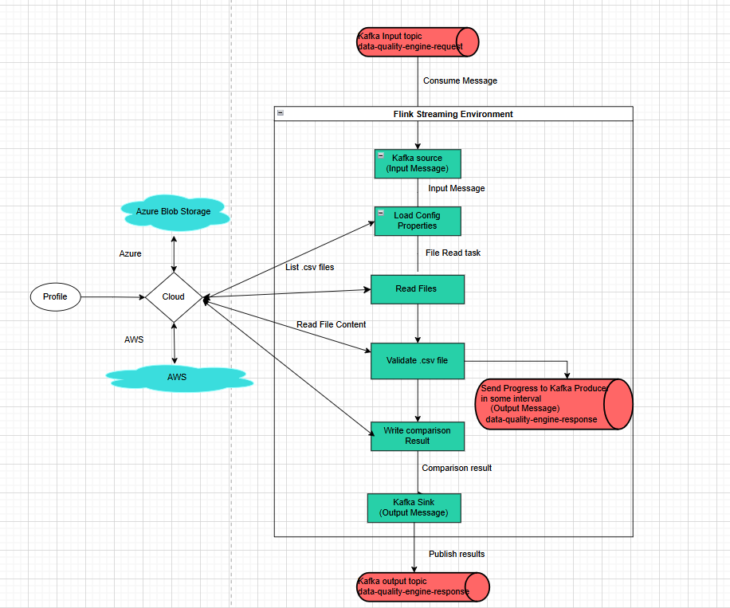

Digital Thread Foundations

BOM Data Quality Check

FLINK JOB OVERVIEW

Release Version: 1.2

Metadata Table

| **Field** | **Value** |
| --- | --- |
| **Asset / Solution Name** | Digital Thread |
| **Domain / Area** | Engineering |
| **Owner (Team/Person)** | Karthik Ramachandra |
| **Reviewers** | Karthik Ramachandra |
| **Status** | Approved / Complete |
| **Confidentiality** | Internal / Confidential |
| **Source of Truth** | [link](https://dev.azure.com/IXAssets/IXAssetsProject/\_git/ixassets) |
| **Related Assets / Alternatives** | AOT / Engineering Orchestration / Engineering Agents |

## 

## Introduction

A digital thread refers to the continuous and consistent flow of information throughout the entire lifecycle of a product or system -- from design and development to operation and maintenance. It enables the integration of data from different stages and sources, allowing effective traceability, seamless collaboration, and efficient decision-making by unleashing the power of sleeping data. Digital Thread is a communication framework that helps integrate various enterprise systems involved in the engineering and manufacturing product life cycle.

IX Digital Thread\'s BOM Management application ensures product structure data remains accurate, consistent, and traceable across the lifecycle. It offers three key capabilities: BOM Conversion, BOM Comparison, and Data Quality Check, and these are achieved using Flink Jobs.

The BOM Data quality check Flink Job is a real-time data processing pipeline designed to enable users to compare BOM files from different sources. The job leverages Apache Flink for distributed stream processing, ensuring scalability, fault tolerance, and low-latency processing. It handles asynchronous processing of BOM Data quality check requests, integrating with Kafka for message ingestion and publishing, read csv file from cloud (Azure and AWS) and leveraging Flink\'s streaming capabilities to process data in real-time.

This job processes incoming events, validates the data, triggers the BOM Data quality check process, and generates a response with the status and results of the Data quality check. It is designed to be scalable, fault-tolerant, and efficient for large-scale data processing

### Purpose

This document provides an overview of the Flink jobs used for BOM Data Quality Check feature of the BOM Management application.

### Target Audience

-   Developers

-   Business Analysts

-   Design, Manufacturing, and QA Engineers

-   Accenture teams deploying the BOM Management application.

### Prerequisites

-   The BOM Management application should be deployed.

-   Access to the application (provided by [IX_DT_DEVOPS_INFRA@accenture.com](mailto:IX_DT_DEVOPS_INFRA@accenture.com))

### Contacts

-   [karthik.ramachandra@accenture.com](mailto:karthik.ramachandra@accenture.com)

-   [vamsi[.konambhotla@accenture.com](mailto:.konambhotla@accenture.com) ](mailto:vamsi.konambhotla@accenture.com)

-   [d.rajesh.boricha@accenture.com](mailto:d.rajesh.boricha@accenture.com)

-   [stefano.giacco@accenture.com](mailto:stefano.giacco@accenture.com)

-   [phani.kumar.koduri@accenture.com](mailto:phani.kumar.koduri@accenture.com)

-   [d.choukse@accenture.com](mailto:d.choukse@accenture.com)

### Related Links

-   [BOM Management Documentation](https://industryxdevhub.accenture.com/assetdetails/115)

-   [Digital Thread Foundations Documentation](https://industryxdevhub.accenture.com/asset-home;search_text=IX%20Digital%20Thread)

### 

# Key Features

The following are the key features of the BOM Data Quality Check Flink job.

-   **Real-Time Processing:** Processes data in real-time, ensuring timely delivery of BOM Data quality check status.

-   **Validation and Exception Handling**: Ensures that all required fields are present in the MBOM template, throwing exceptions for missing fields.

-   **Scalability**: Built on Apache Flink, the job can scale horizontally to handle large volumes of data.

-   **Fault Tolerance:** Flink\'s checkpointing and state management ensure reliability in case of failures.

-   **Asynchronous Processing:** Utilizes AsyncDataStream.unorderedWait to handle events asynchronously, ensuring high throughput and low latency.

-   **Kafka Integration:** Reads BOM Data quality check requests from a Kafka topic and publishes the results to another Kafka topic.

-   **Error Handling**: Implements robust error handling and timeout mechanisms to manage failures gracefully.

-   **Dynamic Configuration**: Configures Flink\'s environment dynamically, including restart strategies, heartbeat intervals, and timeouts, based on application properties.

-   **Cloud-Agnostic**: Supports both Azure and AWS environments, with configurations for respective cloud services like Azure Blob Storage, AWS S3, and their Kafka setups.

## Workflow

The Flink job is comprised of the following steps.

1.  Job Initialization - The Flink job starts by configuring the StreamExecutionEnvironment using the configureFlinkEnvironment method. This method sets up Flink\'s restart strategy, heartbeat intervals, and other configurations dynamically based on application properties.

2.  Kafka Source Setup - A Kafka source is created using the KafkaConfig.createKafkaSource() method. This source reads BOM Data quality check requests from a Kafka topic.

3.  Data Stream Processing - The data stream from the Kafka source is processed asynchronously using AsyncDataStream.unorderedWait. The AsyncBomQualityEngineFunction is used to handle each event asynchronously. Key steps in this function include:

-   Parsing the incoming event.

-   Validating the event data (e.g., jobId, sourceFolder, destinationFolder).

-   Triggering the BOM Data quality check process via the BomDataQualityEngineService.

-   Constructing a response payload with the validation results or error details.

4.  Timeout Handling - If the asynchronous processing of an event exceeds the configured timeout, the timeout method of AsyncDataQualityEngineFunction is invoked to handle the timeout gracefully.

5.  Kafka Sink Setup - A Kafka sink is created using the KafkaConfig.createKafkaSink() method. This sink is used to publish the results of the BOM data quality check process to another Kafka topic.

6.  Job Execution - The Flink job is executed using env.execute(\"Flink Batch Processing Job\").

### 

# Configuration

The parameters listed below are used to configure the Flink environment for distributed processing, storage integration, and monitoring.

| **Parameter** | **Description (Default) \[Path\]** |
| --- | --- |
| FLINK_VERSION | Specifies the version of Apache Flink to be installed. |
| SCALA_VERSION | Specifies the Scala version compatible with the Flink version. |
| FLINK_HOME | Defines the installation directory for Flink. |
| rest.port | Configures the REST API port for Flink. (\_\_containerPort\_\_) |
| taskmanager.memory.process.size | Sets the memory size allocated to the TaskManager process. (2048m) |
| s3.access-key | Specifies the access key for S3 storage integration. |
| s3.secret-key | Specifies the secret key for S3 storage integration. |
| fs.azure.account.key.\.blob.core.windows.net | Configures the secret key for Azure Blob Storage access. (\_\_azureBlobStorageSecretKey\_\_) |
| javaagent | Adds the Application Insights Java agent for monitoring and telemetry. \[/deployments/applicationinsights-agent-3.7.3.jar\] |
| rest.profiling.enabled | Enables profiling for Flink. (true) |
| pekko.framesize | Configures the maximum frame size for Pekko. (512MiB) |
| pekko.remote.maximum-frame-size | Sets the maximum frame size for remote communication. (512MiB) |

### Flink Plugins

| **Plugin** | **Path** |
| --- | --- |
| S3 | \$FLINK_HOME/plugins/s3-fs-hadoop |
| Azure | \$FLINK_HOME/plugins/azure-fs-hadoop |

### 

# Components

The following diagram describes the Flink job overview in a component-wise approach. The key components/processes are discussed in the subsequent sections.

### Environment Profile Selection

-   The profile property determines whether the application runs in the AWS or Azure environment.

-   Based on the profile, the application loads the respective configurations.

### Secure Credential Fetching

-   Azure

    -   Azure Key Vault is used to fetch sensitive credentials like Kafka connection strings.

    -   The ClientSecretCredential and SecretClient classes are used to authenticate and retrieve secrets.

-   AWS

    -   AWS-specific configurations, such as IAM-based authentication for Kafka, are directly loaded from the property file.

-   Cloud Storage Service (CloudStorageService and AwsS3StorageServiceImpl)

    -   Provides methods to interact with cloud storage (e.g., Azure, AWS S3).

    -   Includes operations like reading files, writing files, checking file existence, and listing files or folders.

### 

## Kafka Configuration (KafkaConfig)

-   Configures Kafka producers and consumers based on the deployment profile (AWS or Azure).

-   Fetches sensitive connection details from Azure Key Vault or AWS configurations.

-   Creates Kafka sources (for consuming messages) and sinks (for producing messages).

### Flink Integration

-   Uses Flink\'s KafkaSource to consume messages from Kafka topics.

-   Uses KafkaSink to produce messages to Kafka topics.

-   Configures Flink jobs to process data with delivery guarantees (e.g., AT_LEAST_ONCE).

### Read Files

Read file from a cloud storage location (Azure and S3)

### Load config properties

-   The application uses property files like application-aws.properties or application-azure.properties to define environment-specific configurations.

-   It checks if the configuration file (config.properties) exists in the cloud storage using the cloudStorageService.fileExists method.

-   If the file exists:

-   It reads the file as an InputStream and loads the properties into the Properties object.

-   If the file is empty, it logs a warning and falls back to loading default properties from application.properties using the loadFromApplicationProperties method.

-   If the file does not exist:

-   It logs a warning and loads default properties from application.properties.

-   It then saves the generated properties back to the cloud storage by writing them to the config.properties file.

### Validate .csv file and Write result

Implements the logic to validate files and generating reports. Key responsibilities are:

-   Processes the source folders to validate .csv files.

-   Send Progress to Kafka producer in some intervals

-   Generates a detailed report summarizing the comparison results.

-   Uploads the report to cloud storage (e.g., AWS S3 or Azure Blob Storage).

## 

# Defining Requests and Responses

Flink jobs integrate with Kafka or other messaging systems. Below are guidelines for defining request/response topics and message schemas.

### Request Topics

-   **Topic /Event hub name:** data-quality-engine-request

-   **Usage:** Incoming requests for job Id, message Id, configuration changes, or validation operations and source folder.

### Sample Message Format (JSON):

\{

\"jobId\": \"qc100\",

\"messageId\": \"BOM_BATCH_DATA_QUALITY_REQUEST \",

\"timestamp\": \"2025-08-26T16:03:33Z\",

\"operation\": \"START_VALIDATION \",

\"data\": \{

\"sourceFolder\": \"BomBatchDataQuality/Input/BQ_Sample_10\",

\}

\}

### Response Topics

-   **Topic /Event hub name:** data-quality-engine-response

-   **Usage:** Outgoing responses from Flink jobs or APIs after processing the request.

### Sample Message Format (JSON):

\{

\"jobId\":\"qc100\",

\"messageId\":\"BOM_BATCH_DATA_QUALITY_RESPONSE\",

\"timestamp\":1752661064044,

\"data\":

\{

\"currentBomId\":\"1252-912-01\",

\"memoryUsage\":\"0%\",

\"processedFiles\":\"5\",

\"totalFiles\":\"63\",

\"status\":\"IN_PROGRESS\",

\"sourceFolder\": \"BomBatchDataQuality/Input/BQ_Sample_10\",

\}

\}

### Error Handling Response

\{

\"jobId\":\"qc100\",

\"messageId\":\"BOM_BATCH_DATA_QUALITY_RESPONSE \",

\"timestamp\":1752661064044,

\"data\":

\{

\"status\":\"FAILURE \",

\"errorMessages\":\"Async call timed out\"

\}

\}

## 

# APIs

There are four APIs to be aware of:

-   List Jobs retrieves a list of all running or completed Flink jobs.

-   Taskmanagers retrieves a list of task managers in the Flink cluster.

-   Taskmanager Log retrieves the log of a specific task manager.

-   Jobmanager Log retrieves the log of the job manager.

Each of the APIs listed above is detailed in the sections that follow.

### List Jobs

This API retrieves a list of all running or completed Flink jobs

| PROTOCOL | HTTPS |
| --- | --- |
| Azure DEV ENDPOINT | [https://ixts-dev-apim.azure-api.net/bom-data-quality-engine-api/jobs](https://ixts-dev-apim.azure-api.net/bomComparision-flink-file-reader-api/jobs) |
| Azure QA ENDPOINT | [https://ixts-qa-apim.azure-api.net/bom-data-quality-engine-api/jobs](https://ixts-qa-apim.azure-api.net/bomComparision-flink-file-reader-api/jobs) |
| AWS DEV ENDPOINT |  |
| METHOD | GET |
| CONTENT TYPE | application / json |

#### Input Header

| Parameter | Description |
| --- | --- |
| Ocp-Apim-Subscription-Key | Unique identifier and specifies subscription key |
| Authorization | JWT token |

#### Result

| HTTP Code | Result Description |
| --- | --- |
| 200 | ok |

#### Error Management

| HTTP Code | Error Code Error Description |
| --- | --- |
| 500 | 500 Project Specific error |
| 403 | 403 Forbidden |
| 401 | 401 Invalid Subscription key / Invalid Token |
| 400 | 400 Bad request |

#### Response

\{

\"jobs\": \[

\{

\"id\": \"edf541eb49a2e98f4820e28b2044b540\",

\"status\": \"RUNNING\"

\}

\]

\}

### 

## Taskmanagers

This API retrieves a list of task managers in the Flink cluster

| PROTOCOL | HTTPS |
| --- | --- |
| Azure DEV ENDPOINT |  |
| Azure QA ENDPOINT | [https://ixts-qa-apim.azure-api.net/bom-data-quality-engine-api/taskmanagers](https://ixts-qa-apim.azure-api.net/bomComparision-flink-file-reader-api/taskmanagers) |
| AWS DEV ENDPOINT |  |
| METHOD | GET |
| CONTENT TYPE | application / json |

#### Input Header

| Parameter | Description |
| --- | --- |
| Ocp-Apim-Subscription-Key | Unique identifier and specifies subscription key |
| Authorization | JWT token |

#### Result

| HTTP Code | Result Description |
| --- | --- |
| 200 | ok |

#### Error Management

| HTTP Code | Error Code Error Description |
| --- | --- |
| 500 | 500 Project Specific error |
| 403 | 403 Forbidden |
| 401 | 401 Invalid Subscription key / Invalid Token |
| 400 | 400 Bad request |

#### Response

[Link](https://ts.accenture.com/:t:/r/sites/GlobalDocTemplates/Published%20Documents/IX%20Thread/Linked%20Files/Flink%20Job/BOM%20Data%20Quality%20Check/Taskmanagers_Response.txt)

### 

## Taskmanager Log

This API retrieves the log of a specific task manager.

| PROTOCOL | HTTPS |
| --- | --- |
| AZURE DEV ENDPOINT | [https://ixts-dev-apim.azure-api.net/bom-data-quality-engine-api/taskmanagers/\{tm-id\}/log] |
| AZURE QA ENDPOINT | [https://ixts-qa-apim.azure-api.net/bom-data-quality-engine-api/taskmanagers/\{tm-id\}/log] |
| AWS DEV ENDPOINT | [https://ixdt-bom-dev.accenture.com/bomDataqualityEngine/taskmanagers/\{tm-id\}/log] |
| METHOD | POST |
| CONTENT TYPE | application / json |

#### Input Path

| Parameter | Description |
| --- | --- |
| Tm-id | Unique identifier and specifies the type of data to retrieve |

#### Input Header

| Parameter | Description |
| --- | --- |
| Ocp-Apim-Subscription-Key | Unique identifier and specifies subscription key |
| Authorization | JWT token |

#### Result

| HTTP Code | Result Description |
| --- | --- |
| 200 | ok |

#### Error Management

| HTTP Code | Error Code Error Description |
| --- | --- |
| 500 | 500 Project Specific error |
| 403 | 403 Forbidden |
| 401 | 401 Invalid Subscription key / Invalid Token |
| 400 | 400 Bad request |

#### Response

[Link](https://ts.accenture.com/:t:/r/sites/GlobalDocTemplates/Published%20Documents/IX%20Thread/Linked%20Files/Flink%20Job/BOM%20Data%20Quality%20Check/Taskmanagers_Logs_Response.txt)

### 

## JobManager Log

This API retrieves the log of the job manager.

| PROTOCOL | HTTPS |
| --- | --- |
| AZURE DEV ENDPOINT |  |
| AZURE QA ENDPOINT |  |
| AWS DEV ENDPOINT |  |
| METHOD | POST |
| CONTENT TYPE | application / json |

#### Input Header

| Parameter | Description |
| --- | --- |
| Ocp-Apim-Subscription-Key | Unique identifier and specifies subscription key |
| Authorization | JWT token |

#### Result

| HTTP Code | Result Description |
| --- | --- |
| 200 | ok |

#### Error Management

| HTTP Code | Error Code Error Description |
| --- | --- |
| 500 | 500 Project Specific error |
| 403 | 403 Forbidden |
| 401 | 401 Invalid Subscription key / Invalid Token |
| 400 | 400 Bad request |

#### Response

[Link](https://ts.accenture.com/:t:/r/sites/GlobalDocTemplates/Published%20Documents/IX%20Thread/Linked%20Files/Flink%20Job/BOM%20Data%20Quality%20Check/Jobmanager_Logs_Response.txt)
