

Digital Thread Foundations

BOM Management Database

TECHNICAL OVERVIEW

Release Version: 1.2

**Metadata Table**

| **Field** | **Value** |
| --- | --- |
| **Asset / Solution Name** | Digital Thread |
| **Domain / Area** | Engineering |
| **Owner (Team/Person)** | Karthik Ramachandra |
| **Reviewers** | Karthik Ramachandra |
| **Status** | Approved / Complete |
| **Confidentiality** | Internal / Confidential |
| **Source of Truth** |  |
| **Related Assets / Alternatives** | AOT / Engineering Orch / Engineering Agents |
| # | Introduction A digital thread refers to the continuous and consistent flow of information throughout the entire lifecycle of a product or system -- from design and development to operation and maintenance. It enables the integration of data from different stages and sources, allowing effective traceability, seamless collaboration, and efficient decision-making by unleashing the power of sleeping data. The digital thread is considered a key aspect of Industry 4.0 and the digital transformation of the manufacturing industry. It is the core of the Enterprise Operating System (EOS). Digital Thread is a communication framework that helps integrate various enterprise systems involved in the engineering and manufacturing product life cycle. The EBOM to MBOM Conversion feature in BOM Management is designed to help users efficiently transform an Engineering Bill of Materials (EBOM) into a Manufacturing Bill of Materials (MBOM) within a structured workflow. This conversion process ensures that engineering data is accurately translated into a manufacturable format while maintaining traceability and version control. |

### Purpose

This document provides a detailed description of the Postgres database (ixts-dev-psqldb) utilized for EBOM to MBOM conversion by IX Digital Thread.

### Target Audience

-   Data Management and Governance Team

-   Interface Developers

-   Data Engineers

-   Application Support Team

### Prerequisites

-   Get access to the ixts-dev-psqldb database in Azure. (provided by the [IX-Thread Infra team](mailto:IX_DT_DEVOPS_INFRA@accenture.com))

-   Download and Install any GUI to access the ixts-dev-psqldb database from a local machine i.e. PgAdmin.

### Related Links

-   [IX Digital Thread Documentation](https://industryxdevhub.accenture.com/asset-home;search_text=ix%20digital%20thread)

-   [BOM Management Documentation](https://industryxdevhub.accenture.com/assetdetails/115)

### Contacts

-   [karthik.ramachandra@accenture.com](mailto:karthik.ramachandra@accenture.com)

-   [mohit.k.mishra@accenture.com](mailto:Mohit.k.mishra@accenture.com)

## Background

IXAssetsProject currently uses the ixts-dev-psqldb database to store all the reference information regarding EBOM to MBOM conversion. This database is created using Azure Postgres SQL and stores the information about BOM templates, Conversion Rules, and other conversion details in various tables.

## Entity Relationship Diagram

Below is the ERD (entity relationship diagram) for the database *ixts-dev-psqldb* and schema *bom*.

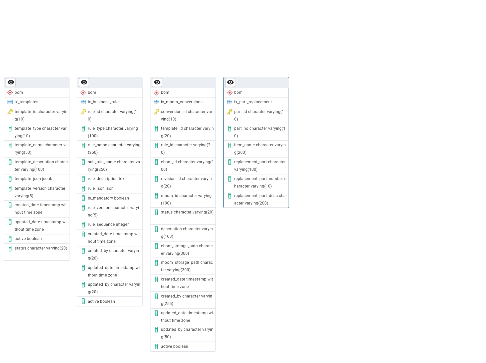

## 

# Connectivity Details

The following table outlines the details needed to connect with the database server.

| **Database Server name/Host name/address** | ixts-dev-postgres-datafederation.postgres.database.azure.com |
| --- | --- |
| **Database name** | ixts-dev-psqldb |
| **Database Owner name** | ix_postgres_admin |
| **Port** | 5432 |
| **Username** | ix_postgres_admin |
| **Maintenance database** | postgres |

## Connection Procedure

Below are the steps to connect to the ixts-dev-psqldb using PgAdmin,

1.  Open the PgAdmin application on the local machine and go to servers in Object Explorer. Now right-click on Object Explorer \&gt; Register \&gt; Server.

> 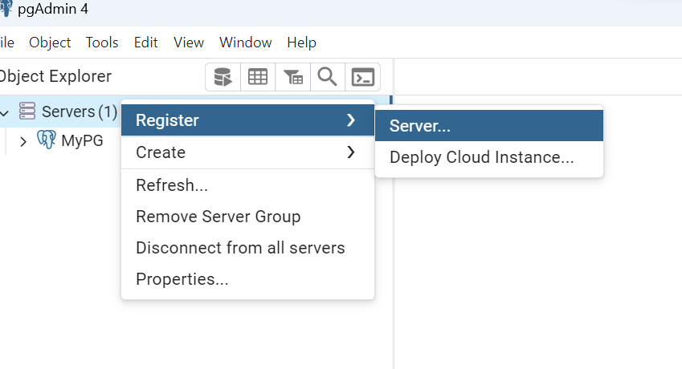
2.  In the popup window, provide details in the General tab as depicted in the image.

> 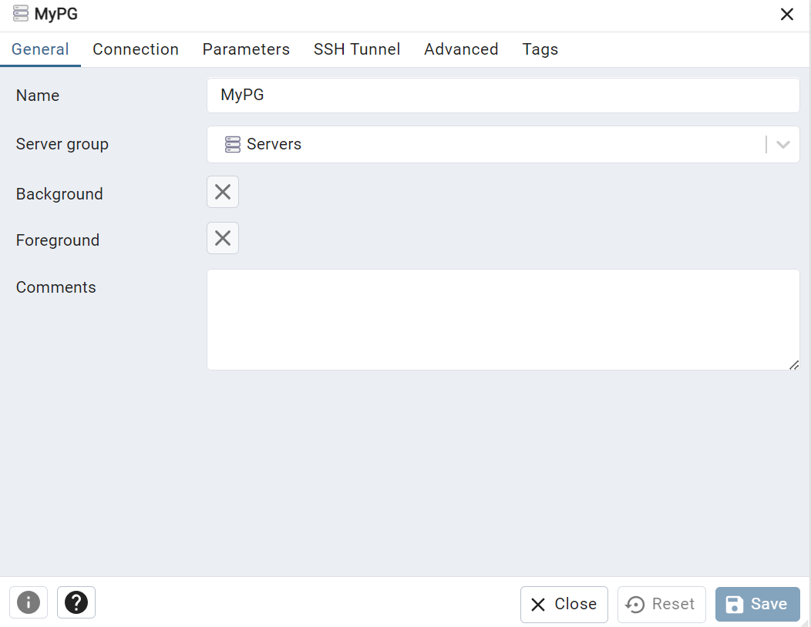
3.  Go to the Connection tab. Enter the Host name/address, port, username, etc., and click on the Save option to save the details.

> 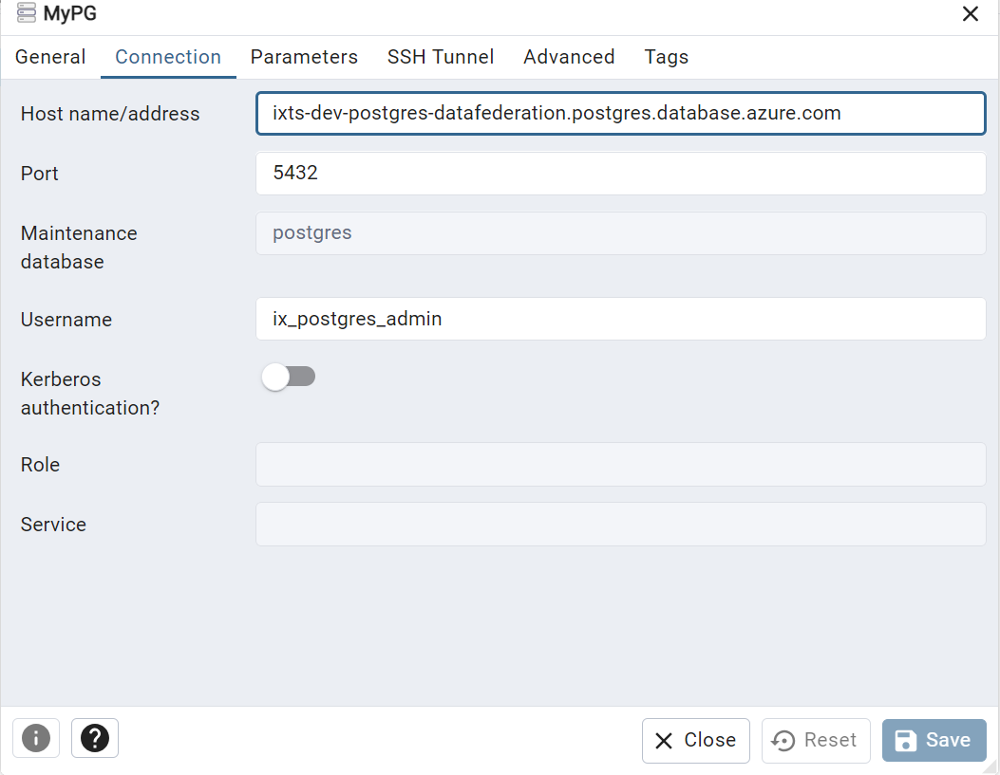
4.  After clicking on Save, the details will be shown in the Object Explorer,

> 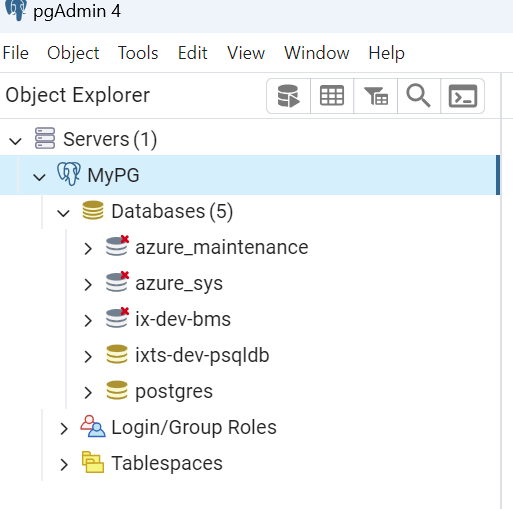

## Database Objects

Below are the objects created in the database.

### Schema

A new schema with the name **BOM** has been created and all the objects for release are created under the BOM schema.

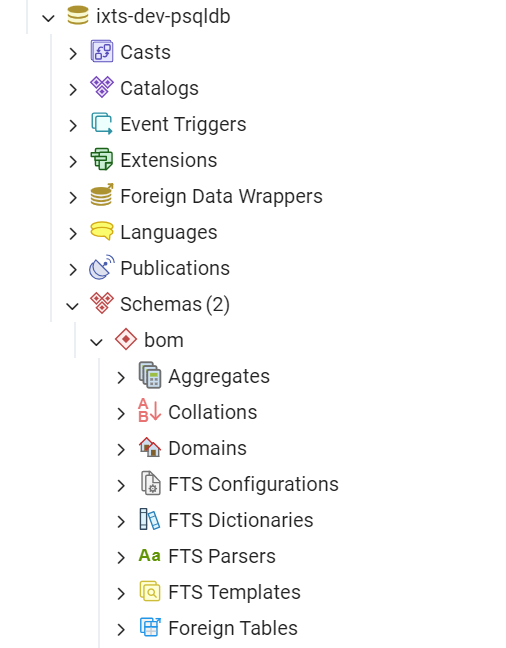

### Tables 

The tables mentioned in the tabular figure are created under the BOM schema.

The metadata and sample data are provided for each table in the subsequent sections.

| \# | Table |
| --- | --- |
| 1 | bom.ix_templates |
| 2 | bom.ix_business_rules |
| 3 | bom.ix_mbom_conversions |
| 4 | bom.ix_part_replacement |

#### 

### bom.ix_templates

Below is the metadata for the bom.ix_templates table,

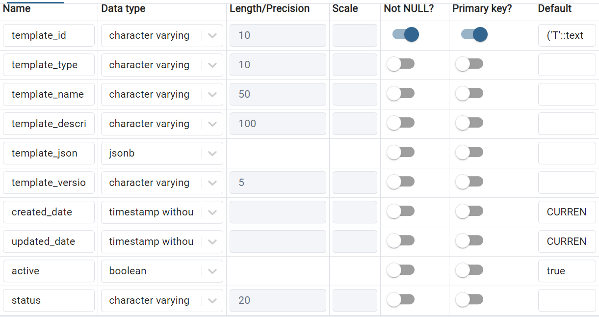

Below is the sample data in the above table.

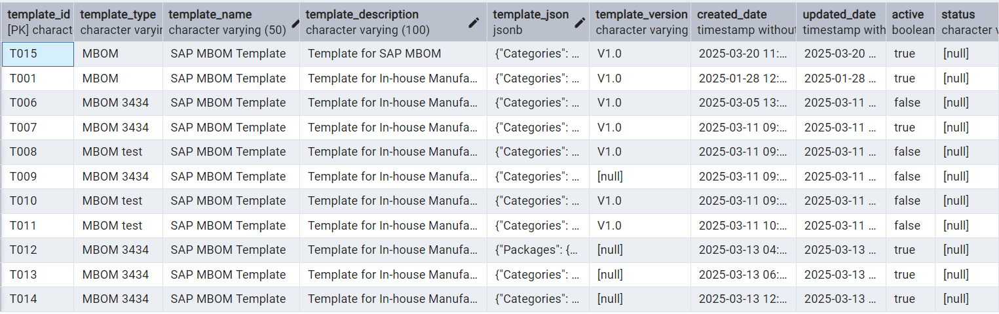

#### 

### bom.ix_business_rules

Below is the metadata for the bom.ix_business_rules table,

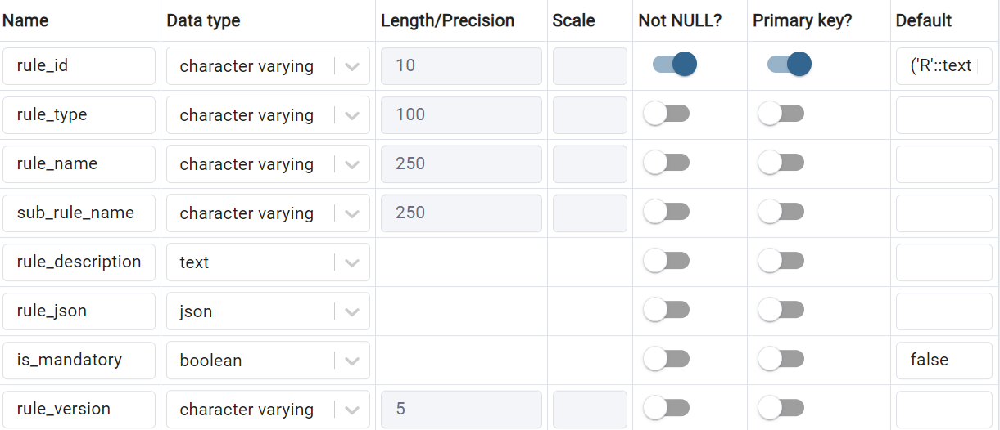

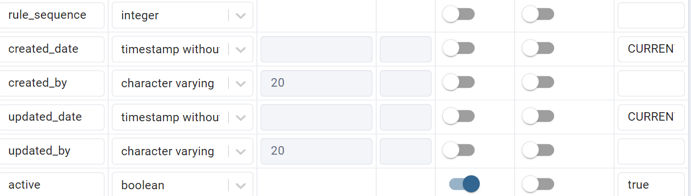

Below is the sample data for the above table.

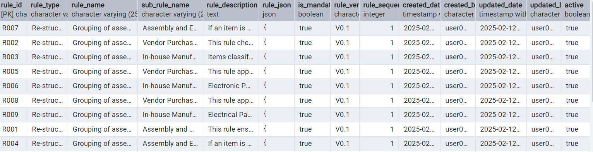

#### 

### bom.ix_mbom_conversions

Below is the metadata for the bom.ix_mbom_conversions table,

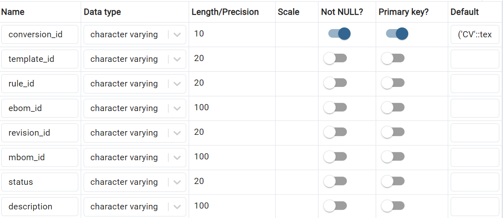

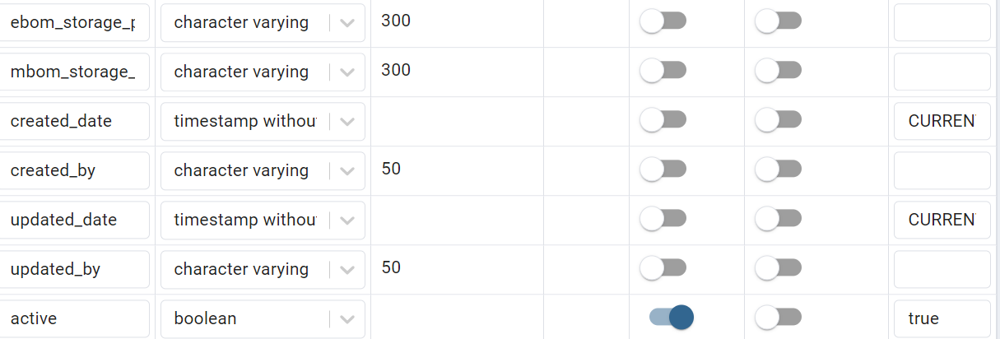

Below is the sample data for the above table.

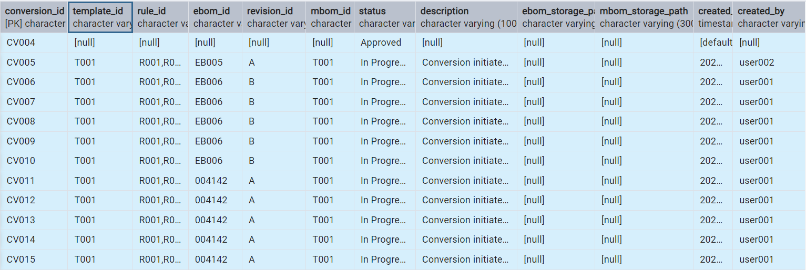

#### 

### bom.ix_part_replacement

Below is the metadata for the bom.ix_mbom_conversions table,

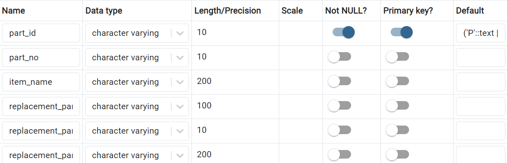

Below is the data for the above table.

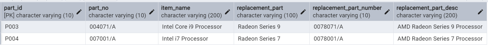
