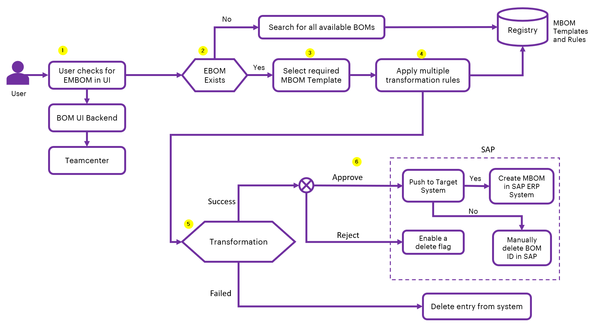
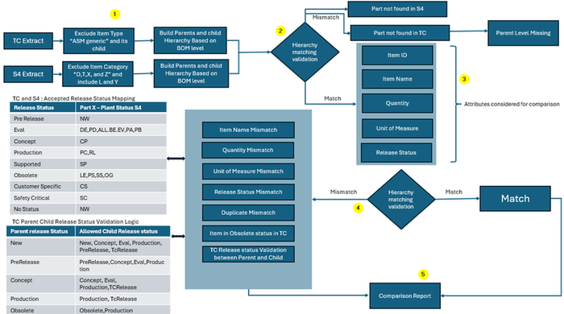
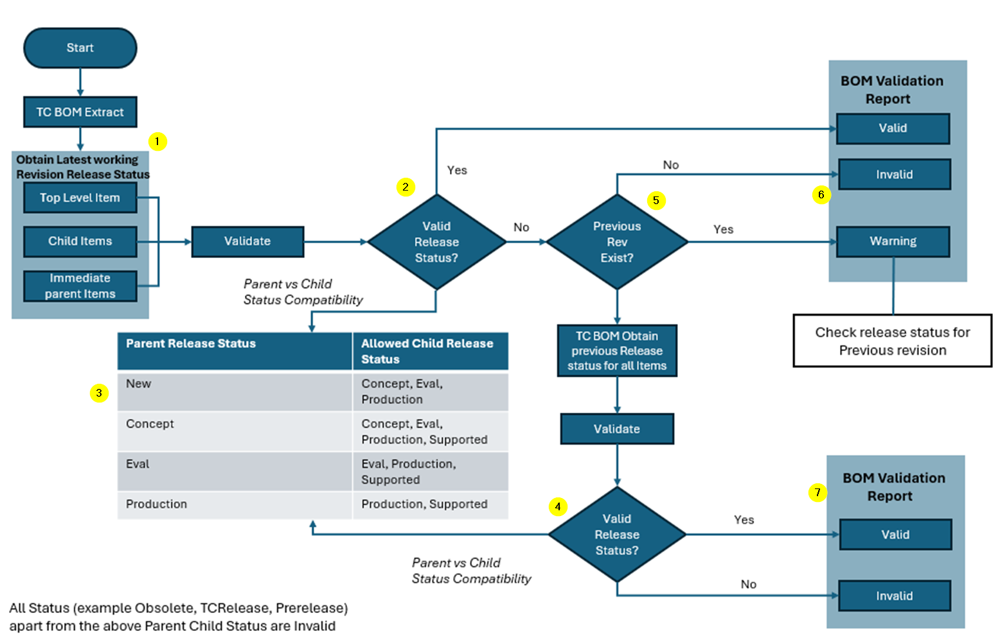

Digital Thread Foundations

BOM Management

FUNCTIONAL OVERVIEW

Release Version: 1.2

Metadata Table

| **Field** | **Value** |
| --- | --- |
| **Asset / Solution Name** | Digital Thread |
| **Domain / Area** | Engineering |
| **Owner (Team/Person)** | Karthik Ramachandra |
| **Reviewers** | Karthik Ramachandra |
| **Status** | Approved / Complete |
| **Confidentiality** | Internal / Confidential |
| **Source of Truth** |  |
| **Related Assets / Alternatives** | AOT / Engineering Orch / Engineering Agents |

## Introduction

The Industry X Digital Thread Foundations platform provides a vendor-agnostic framework to unify and virtualize data across connected products, operations, and services. It establishes a single communication layer across PLM, ERP, ALM, MBSE, CAD, and simulation systems, enabling seamless data exchange, improved operational efficiency, and lifecycle traceability. Its reusable connectors and guided configuration accelerators reduce integration effort and dependency on third-party tools, allowing faster setup and lower cost of ownership.

As part of this platform, the BOM (Bill of Materials) Management suite ensures product structure data remains accurate, consistent, and traceable across the lifecycle. It offers three key capabilities:

-   **BOM Comparison:** Detects mismatches and misalignments between EBOMs across systems such as Teamcenter and SAP S/4HANA, ensuring clean, synchronized data for procurement and manufacturing.

-   **BOM Data Quality Check:** Classifies BOMs as Valid, Invalid, or Warning using configurable rules to flag obsolete parts, status mismatches, and structural gaps before downstream use.

-   **BOM Conversion:** Transforms any BOM type into the desired manufacturable or target format using rules and templates, ensuring traceability and reducing manual mapping effort, e.g., EBOM to MBOM.

Together, these capabilities deliver end-to-end BOM lifecycle management, accelerating engineering-to-manufacturing transitions, reducing operational risk, and reinforcing digital continuity across enterprise systems.

###  Purpose

This document describes the functionality of the BOM Management use case of the IX Digital Thread Foundations platform.

### Target Audience

BOM engineers, system integrators, and product data managers responsible for BOM validation and migration.

### Related Links

-   [DT BOM Management Documentation](https://industryxdevhub.accenture.com/assetdetails/115)

-   [DT Functional Overview](https://industryxdevhub.accenture.com/assetdetails/86)

-   [DT Architecture](https://industryxdevhub.accenture.com/assetdetails/85)

-   [DT Release Notes](https://industryxdevhub.accenture.com/assetdetails/84)

### Contacts

-   [karthik.ramachandra@accenture.com](mailto:karthik.ramachandra@accenture.com)

-   [riju.dhar@accenture.com](mailto:riju.dhar@accenture.com)

-   [vamsi.konambhotla@accenture.com](mailto:vamsi.konambhotla@accenture.com)

### Glossary

| **Term** | **Definition** |
| --- | --- |
| BOM (Bill of Materials) | A structured list of all components, assemblies, and materials required to manufacture a product. |
| EBOM (Engineering BOM) | The Bill of Materials as defined by engineering, focusing on product design and specifications. |
| MBOM (Manufacturing BOM) | The Bill of Materials tailored for manufacturing processes, reflecting how a product is built on the shop floor. |
| PLM (Product Lifecycle Management) | A system or process for managing the entire lifecycle of a product from inception, through engineering design and manufacturing, to service and disposal. |
| ERP (Enterprise Resource Planning) | Software systems that help organizations manage business processes, including procurement, production, and inventory. |
| ALM (Application Lifecycle Management) | Tools and processes for managing the lifecycle of software applications, from development to deployment and maintenance. |
| CAD (Computer-Aided Design) | Software used by engineers and designers to create precision drawings or technical illustrations of products. |
| Data Migration | The process of transferring data between storage types, formats, or computer systems, often during system upgrades or replacements. |
| System Integrator | An individual or company that specializes in bringing together various subsystems into a unified whole and ensuring that they function together effectively. |
| Data Quality Check | The process of validating the accuracy, completeness, and reliability of data before it is used or migrated. |
## 

# Background

Maintaining synchronized and reliable Bill of Materials (BOM) data across multiple enterprise systems is a persistent challenge in complex industrial ecosystems. Disconnected environments spanning PLM, ERP, ALM, CAD, and simulation platforms lead to fragmented data flows, limited lifecycle visibility, and delayed engineering-to-production handovers.

**Key Pain Points**

-   Data Mismatches Across Systems - EBOM and MBOM misalignments occur as data moves between engineering, manufacturing, and procurement platforms.

-   Inconsistent BOM Quality - Obsolete parts, missing revisions, and incomplete hierarchies reduce product build accuracy and compliance readiness.

-   Manual EBOM-to-MBOM Transformation - Converting engineering BOMs to manufacturing structures often requires labor-intensive mapping, increasing the risk of data loss and delays.

-   Time-Intensive Reconciliation and Migration Risks**:** Spreadsheet-based verification and manual corrections slow down transitions to ERP or S/4HANA and expose hidden data quality issues.

**\
Solution**

The IX Digital Thread Foundations -- BOM Management module addresses these challenges by delivering automated BOM Comparison, Data Quality Check, and EBOM-to-MBOM Conversion in a vendor-agnostic, connector-driven platform. Leveraging reusable integration accelerators and centralized monitoring UI, organizations can:

-   Maintain BOM integrity and traceability across disconnected enterprise systems.

-   Reduce manual reconciliation and accelerate design-to-manufacturing transitions.

-   Minimize migration risks and support digital continuity with manufacturable, validated BOM data.

### 

## Business Value

IX Digital Thread Foundations -- BOM Management strengthens product lifecycle transitions by ensuring BOM data is accurate, validated, and production-ready across PLM, ERP, and MES systems. By combining automated Comparison, Data Quality Check, and EBOM-to-MBOM Conversion, organizations gain:

-   **Faster Design-to-Production Transitions:** Automated validation and conversion reduce manual mapping effort and shorten lead times.

-   **Reduced Operational Risk:** Early detection of mismatches, obsolete items, and misaligned EBOM-to-MBOM structures prevents costly rework and delays.

-   **Migration-Ready, Manufacturable BOMs:** Structured validation ensures clean, traceable data for ERP/S/4HANA and shop-floor integration.

-   **Cross-Functional Alignment:** A single dashboard for comparison results, data quality insights, and MBOM outputs improves collaboration across engineering, manufacturing, and supply chain teams.

-   **Scalable and Vendor-Agnostic Adoption:** Generic connectors, reusable accelerators, and a central integration UI simplify deployment across multi-vendor ecosystems without third-party lock-in.

-   **Foundation for Digital Continuity:** Maintains traceable BOM records that support regulatory compliance and strengthen broader digital thread initiatives.

### 

## Unique Features

-   **Dual-Mode File Upload (Azure Blob / UI):** Supports both cloud and manual uploads for flexibility in BOM data ingestion.

-   **Automated BOM Comparison:** Identifies and categorizes mismatches across systems (e.g., PLM vs ERP) based on part number, quantity, and status.

-   **Configurable BOM Quality Validation:** rule-based checks for structural integrity, obsolete items, and invalid statuses.

-   **Rule-Driven EBOM-to-MBOM Conversion:** Converts engineering BOMs into manufacturing-ready formats using reusable rules and templates.

-   **Side-by-Side EBOM/MBOM Viewer:** Post-conversion comparison enables visual traceability of component mappings.

-   **Integration KPI Dashboard:** Centralized dashboard for monitoring comparison, quality check, and conversion metrics.

-   **Modular, Vendor-Agnostic Architecture:** Works across diverse PLM/ERP ecosystems (SAP, Teamcenter, Windchill, etc.) using reusable, client-configurable connectors.

-   **Accelerator-Backed Deployments:** Prebuilt connectors and templates reduce setup time and third-party tools needed.

-   **Export to Excel/CSV:** One-click reporting for sharing and offline review of validation and comparison results.

###  Advantages

-   **Reduction in Manual Reconciliation:** Automated comparison and quality checks replace repetitive spreadsheet-based validations.

-   **Accelerated EBOM-to-MBOM Conversion:** Rule- and template-driven transformation speeds manufacturing readiness.

-   **Item-Level EBOM-to-MBOM Traceability:** Side-by-side visualization ensures accurate component mapping and reduces production errors.

-   **No-Code, Intuitive Interface:** Engineers and manufacturing teams can operate the platform without coding expertise.

-   **ERP-Ready BOMs:** Clean, validated, and production-ready structures ensure smoother SAP S/4HANA or MES integration.

-   **Structured Data Governance:** Built-in validation checkpoints enforce lifecycle quality control.

-   **Modular, Scalable Design:** Cloud-ready and vendor-agnostic architecture supports future PLM, ERP, and MES expansions without dependency on third-party tools.

### 

## Comparison with Alternate Processes

Traditional BOM workflows rely heavily on manual spreadsheets, offline checks, and inconsistent EBOM-to-MBOM mapping---slowing production and increasing error risk. IX Digital Thread Foundations -- BOM Management simplifies this through:

-   **Side-by-Side BOM Traceability:** Unified visualization of EBOMs, MBOMs, and comparison results.

-   **Single-Window Dashboards and Reporting:** Centralized, real-time visibility of validation and conversion results.

-   **Faster Discrepancy Resolution:** Automation reduces manual effort, rework, and lead times.

-   **Consistent Lifecycle Validation:** Standardized approach ensures synchronized, high-quality BOM data across engineering, manufacturing, and ERP systems.

## 

# BOM Solutions and Use Cases

These use cases highlight how the BOM Management Tool delivers powerful capabilities for engineering and manufacturing organizations. With automated EBOM to MBOM conversion and BOM comparison functionalities, businesses can accelerate product readiness, validate system migrations, and maintain alignment between engineering and production systems.

### EBOM to MBOM Conversion

This use case illustrates how IX Digital Thread Foundations enables intelligent, rule-based transformation of Engineering BOMs (EBOMs) into Manufacturing BOMs (MBOMs), aligning engineering design with production needs. The solution integrates seamlessly with PLM and ERP systems, ensuring data integrity and real-time synchronization across the digital thread.

####  Key Capabilities

> **PLM to ERP Integration --** Enables direct data flow from Siemens Teamcenter (source) to SAP (target), reducing manual rework and errors during BOM handoffs.
>
> **Configurable Rule Engine --** Uses business rules defined in the Rule Management module and templates from the Template Management module to drive BOM transformation logic, handled by Apache Flink.
>
> **Dynamic MBOM Generation --** Automatically generates MBOMs tailored to specific manufacturing strategies, including alternative MBOM versions when the same EBOM is converted under different conditions or configurations.
>
> **Change Data Capture (CDC) --** Detects updates in the EBOM and reflects them in the corresponding MBOM, maintaining alignment between engineering and manufacturing in real time.
>
> **Versioned BOM Tracking --** Stores all MBOM iterations in SAP as alternate BOMs for the same material, ensuring historical traceability and audit readiness.
>
> **Scalable Architecture --** Supports integration with other PLM or ERP systems beyond Siemens TC and SAP, using an event-driven architecture (EventHub) and modular components.

####  Industry Use Cases

> **Automotive Manufacturing --** Supports complex variant management and frequent design updates by enabling rapid conversion of EBOMs into MBOMs aligned to specific vehicle models or regional regulations.
>
> **Aerospace and Defense --** Handles high-regulation environments where traceability, compliance, and alternate configurations are essential. Ensures MBOMs are always in sync with certified engineering baselines.
>
> **Consumer Electronics --** Accelerates go-to-market by automating repetitive BOM creation processes across multiple product lines, especially when products have shared components but different assembly strategies.
>
> **Industrial Equipment --** Enables mass customization and production efficiency by allowing engineering and manufacturing teams to operate on synchronized BOM data while managing frequent updates and revisions.
>
> **Pharmaceutical and Medical Devices --** Ensures manufacturing instructions reflect the latest approved design specifications, critical for compliance with regulatory bodies like the FDA or EMA.

#### 

### BOM Conversion Workflow

##### Workflow Diagram

The diagram below illustrates the logic flow, from EBOM selection and rule-based mapping to MBOM generation and export for downstream use.

###### 

#### Workflow Overview

This workflow automates the transformation of Engineering BOMs (EBOM) from Teamcenter into Manufacturing BOMs (MBOM) using predefined templates and rules, with the option to push them to SAP.

The following points provide a high-level description of the workflow and correspond to the numbered callouts in the diagram.

1.  **User Action: Initiate EBOM Check**

-   User accesses the BOM UI to check for an existing EBOM.

-   The system queries the Teamcenter backend.

2.  **EBOM Validation**

-   If the EBOM exists, proceed to MBOM template selection.

-   If not, search for all available BOMs from Teamcenter for possible EBOMs.

3.  **MBOM Template Selection**

> User selects the appropriate MBOM conversion template from the Registry (contains templates and rules).

4.  **Apply Transformation Rules**

-   The system applies multiple predefined rules from the Registry to convert EBOM to MBOM.

-   Rules may include structural changes, part substitutions, or attribute mapping.

5.  **Conversion Outcome**

-   If transformation is successful, proceed to Approval step.

-   If transformation fails, either Reject or Delete the BOM.

6.  **Post-Approval Actions**

-   If approved - Push to Target SAP System.

    -   If push is successful: MBOM is created in SAP.

    -   If not, enable delete flag for manual intervention.

-   If rejected - Manual deletion required in SAP.

    -   If deleted - The BOM entry is removed from the system.

Note that MBOM Templates and Rules must be pre-defined and stored in Rule and Template Management for conversion to work.

#### 

**Outcome**

BOM Conversion streamlines the EBOM-to-MBOM process by transforming engineering data from PLM systems into accurate, traceable, and production-ready MBOMs. Automated rules and templates reduce manual effort, accelerate manufacturing readiness, and ensure a single reliable source for downstream ERP and MES integration.

## 

## BOM Comparison

This case showcases IX Digital Thread Foundations' ability to validate and reconcile BOM data between disparate systems like Siemens Teamcenter (PLM) and SAP (ERP). The comparison engine helps organizations identify and resolve mismatches, ensure data consistency, and maintain a clean digital thread across platforms.

####  Key Capabilities

> **Multi-System Data Ingestion --** BOM data is sourced either through direct system connectors (e.g., TC or SAP) or via file ingestion, stored in centralized blob storage for uniform access.
>
> **Interactive Comparison Engine --** Users initiate comparison jobs by selecting the source and target systems. The engine performs deep BOM comparisons based on part structure, attributes, and hierarchy.
>
> **KPI-Driven Analysis --** Visual KPIs summarize key outcomes: total items, matches, mismatches, and detailed mismatch categories (e.g., UOM mismatch, item not found, quantity mismatch, hierarchy mismatch).
>
> **Mismatch Typing and Categorization --** The system classifies mismatches across various dimensions such as item ID, revision, description, BOM line position, and level --- enabling targeted root cause analysis.
>
> **System Migration Validation --** Supports pre- and post-migration BOM verification between legacy and new systems, helping organizations confirm data integrity.
>
> **API-Driven Integration --** The comparison logic and output can be exposed via APIs to integrate into other tools, dashboards, or automated validation pipelines.

####  Industry Use Cases

> **System Migration and Validation --** Used during PLM or ERP migration projects (e.g., Teamcenter to SAP) to validate BOM accuracy between source and target systems.
>
> **Quality Assurance in Supply Chain --** Ensures BOMs shared with suppliers or contract manufacturers align with internal master data, reducing downstream manufacturing errors.
>
> **Audit and Compliance --** Supports regulatory audits by providing evidence of BOM alignment across systems and detailed logs of any discrepancies or modifications.
>
> **Production Planning Consistency --** Helps production planners verify that manufacturing instructions in ERP reflect the correct engineering structure, preventing rework and incorrect assembly.
>
> **Merger and Acquisition Data Reconciliation --** Enables comparison of BOMs from different business units or acquired entities to identify redundancies, standardize parts, and integrate systems efficiently.
>
> **Cost Optimization --** Highlights BOM mismatches that might cause cost variation (e.g., alternate parts, quantity discrepancies), aiding procurement and cost control teams.

#### BOM Comparison Workflow

##### Workflow Diagram

The diagram below illustrates the end-to-end logic flow, from input selection to generating a detailed comparison report.

##### 

#### Workflow Overview

The BOM Comparison workflow ensures that Bill of Materials (BOM) data is accurate and consistent between Teamcenter (TC) and SAP S/4HANA (S4). Below is a high-level summary of the steps involved and corresponds to the numbered callouts in the workflow diagram.

1.  **Data Collection**

> Extract BOM data from both TC and S4, filtering out irrelevant items.

2.  **Structure Matching**

-   Build and compare parent-child BOM hierarchies from both systems.

-   Identify missing parts or mismatched structure levels.

3.  **Attribute Comparison**

> For matched structures, compare key details such as:

-   Item ID

-   Item Name

-   Quantity

-   Unit of Measure

-   Release Status

4.  **Status Validation**

-   Check that BOM items follow the correct release status mapping between TC and S4.

-   Validate parent-child relationships based on lifecycle rules.

5.  **Results and Reporting**

-   Any mismatches are flagged (e.g., missing parts, quantity mismatches, outdated items).

-   A detailed report is generated showing matched items and issues found.

**Outcome**

The BOM Comparison feature provides users with clear, actionable insights on discrepancies between BOM versions or systems, enabling faster resolution of mismatches and ensuring data consistency before downstream processes.

## 

## BOM Data Quality Check

This case showcases IX Digital Thread Foundations' ability to validate and reconcile BOM data between disparate systems like Siemens Teamcenter (PLM) and SAP (ERP). The comparison engine helps organizations identify and resolve mismatches, ensure data consistency, and maintain a clean digital thread across platforms.

####  Key Capabilities

> **Folder-Level Triggering** -- Users initiate data quality checks by selecting a folder. All eligible files within that folder are processed in batch, enabling scalable quality validation.
>
> **Centralized Result Aggregation** -- Data quality results from all files are centrally stored and visualized, giving users an overall view of health indicators such as valid/invalid status, error count, and file validity.
>
> **File-Level Drill-Down** -- Users can click on individual files from the folder view to access detailed quality results, including invalid BOMs, issue categories.
>
> **Categorized Issue Typing** -- Data quality issues are classified into meaningful categories i.e., valid and invalid, making it easier to analyse root causes.
>
> **Dynamic Status Indicators** -- Files are visually marked with status indicators (valid, not valid) to help users quickly assess the health of datasets.
>
> **API-Driven Extensibility** -- Quality results and validation triggers can be integrated with pipelines, dashboards, and reporting tools using REST APIs.

####  Industry Use Cases

> **Master Data Management** -- Validates product master, customer, and supplier data to ensure consistency before ingestion into ERP, PLM, or CRM systems.
>
> **ETL and Data Pipeline Quality Gates** -- Acts as a gate in ETL pipelines by validating data before further processing, helping prevent bad data propagation.
>
> **Regulatory Reporting Compliance** -- Ensures datasets used in regulated industries (e.g., pharma, finance) meet required quality standards before submission.
>
> **Data Migration Projects** -- Validates legacy data before it's imported into new systems during migration initiatives, helping to avoid garbage-in outcomes.
>
> **Analytics and BI Accuracy** -- Verifies input data used in dashboards and reports, ensuring analytics outputs are based on accurate and trustworthy data.
>
> **Collaboration with External Partners** -- Assures quality of files received from third-party vendors or suppliers before use in internal systems.

#### BOM Data Quality Check Workflow

##### Workflow Diagram

The diagram below illustrates the logic flow, from BOM file input to error identification and final validation report generation.

###### 

#### Workflow Overview

The BOM Data Quality Check ensures that the release status of each item in the BOM complies with defined lifecycle rules, particularly focusing on Parent vs Child status compatibility. It helps catch structural and lifecycle inconsistencies before BOMs proceed downstream.

The following points provide a high-level description of the workflow and correspond to the numbered callouts in the diagram.

1.  **BOM Extraction**

> Extract BOM structure from Teamcenter (TC). Includes:

-   Top-level item

-   Child items

-   Immediate parent items

2.  **Retrieve Latest Release Status**

> For each item in the BOM, fetch the latest working revision\'s release status from Teamcenter.

3.  **Validate Parent vs Child Release Status**

-   Check if the child items\' release statuses are valid based on their parent item's release status.

-   Refer to the defined status compatibility matrix (e.g., a parent in \"New\" status can have children in \"Concept\", \"Eval\", or \"Production\").

4.  **Determine Validity**

-   If the release status combination is valid, proceed to generate a Valid BOM Report.

-   If invalid, check if a previous revision exists for further validation.

5.  **Previous Revision Check (if needed)**

-   If the latest revision is invalid and a previous revision exists:

-   Retrieve the previous revision\'s release status for all items.

-   Re-validate using the same Parent vs Child compatibility logic.

6.  **Final Validation Outcome**

-   If previous revision is valid → Mark as Warning.

-   If not → Mark as Invalid.

-   If current revision is valid → Mark as Valid.

7.  **Output: BOM Validation Report**

-   Status of the BOM:

    -   Valid -- Structure and release status are compliant.

    -   Warning -- Latest revision invalid, but previous one valid.

    -   Invalid -- Both latest and previous revisions are non-compliant.

**Outcome**

The Data Quality Check feature ensures BOM data meets quality standards by flagging invalid or risky entries, helping teams prevent data migration errors and promoting smooth product lifecycle transitions.

## 

# Conclusion

The Industry X Digital Thread Foundations' BOM Management module streamlines the end-to-end BOM lifecycle by combining BOM Comparison, Data Quality Check, and EBOM-to-MBOM Conversion into a single, vendor-agnostic platform. Automated BOM Comparison and Data Quality Check enable early detection of mismatches, invalid data, and structural gaps, making cross-system migration to ERP, S/4HANA, or MES faster, smoother, and less error-prone. Meanwhile, rule- and template-driven EBOM-to-MBOM conversion ensures that engineering BOMs are transformed into production-ready, traceable MBOMs, enabling a seamless design-to-manufacturing transition and reinforcing digital continuity.

Key Benefits:

-   Accelerated design-to-production and system migrations with minimal manual reconciliation.

-   Reduced operational and migration risk through early detection of mismatches and invalid data.

-   Validated, synchronized BOMs that simplify cross-system handoffs between PLM, ERP, and MES.

-   Improved collaboration and lifecycle traceability across engineering, manufacturing, and supply chain teams.

-   A scalable foundation for digital continuity and future enterprise expansion.

In essence, BOM Management ensures that every BOM reaching manufacturing is accurate, validated, migration-ready, and aligned with the organization's digital transformation goals.
