

Digital Thread Foundations

BOM Management

UI GUIDE

Release Version: 1.2

Metadata Table

| **Field** | **Value** |
| --- | --- |
| **Asset / Solution Name** | Digital Thread |
| **Domain / Area** | Engineering |
| **Owner (Team/Person)** | Karthik Ramachandra |
| **Reviewers** | Karthik Ramachandra |
| **Status** | Approved / Complete |
| **Confidentiality** | Internal / Confidential |
| **Source of Truth** | [link](https://dev.azure.com/IXAssets/IXAssetsProject/\_git/ixassets) |
| **Related Assets / Alternatives** | AOT / Engineering Orchestration / Engineering Agents |

## Introduction

A digital thread refers to the continuous and consistent flow of information throughout the entire lifecycle of a product or system -- from design and development to operation and maintenance. It enables the integration of data from different stages and sources, allowing effective traceability, seamless collaboration, and efficient decision-making by unleashing the power of sleeping data. The digital thread is considered a key aspect of Industry 4.0 and the digital transformation of the manufacturing industry. It is the core of what we call the Enterprise Operating System (EOS). Digital Thread is a communication framework that helps integrate various enterprise systems involved in the engineering and manufacturing product life cycle.

IX Digital Thread\'s BOM Management application delivers end-to-end BOM lifecycle management, accelerating engineering-to-manufacturing transitions, reducing operational risk, and reinforcing digital continuity across enterprise systems. It consists of three major use cases/workflows: BOM Comparison, BOM Data Quality Check, and BOM Conversion. Additionally, the application provides intuitive and efficient functionalities of templates, rules, users, and file management.

### Purpose

This document provides a comprehensive overview of the user interface (UI) for the IX Digital Thread Foundations\' BOM Management application. It details the layout, navigation, and functionalities available within the application, guiding users through each feature and workflow. The document covers how users can interact with the application to manage Bill of Materials (BOM) data efficiently, including tasks such as BOM comparison, data quality checks, and BOM conversion. It also explains the use of templates, configurable rules, user management, and file handling within the application, ensuring that users understand how to leverage the UI for efficient BOM lifecycle management and digital continuity across enterprise systems.[]\{#_Toc116563958 .anchor\}

### Prerequisites

-   The BOM Management application must be deployed and accessible.

-   BOM management API and its dependencies must be deployed.

-   Users must have valid login credentials with appropriate role-based permissions.

-   A supported browser (Google Chrome or Microsoft Edge) should be used.

### Related Links

-   [IX Digital Thread Documentation](https://industryxdevhub.accenture.com/asset-home;search_text=IX%20digital%20thread)

-   [BOM Management Functional Overview](https://ts.accenture.com/sites/GlobalDocTemplates/Published%20Documents/IX%20Thread/1.2/DT_BOM_Management_Functional_Overview_1_2.pdf)

-   [BOM Management API Reference](https://ts.accenture.com/:b:/r/sites/GlobalDocTemplates/Published%20Documents/IX%20Thread/1.2/DT_BOM_Management_API_Reference_1_2.pdf)

### Target Audience

-   Business Analyst

-   Manufacturing Engineers

-   Production Managers

-   Client IT Admins

### Contact

-   [karthik.ramachandra@accenture.com](mailto:karthik.ramachandra@accenture.com)

-   [vamsi.konambhotla@accenture.com](mailto:vamsi.konambhotla@accenture.com)

-   [s.sanjay.korde@accenture.com](mailto:s.sanjay.korde@accenture.com)

-   [geetha.vani.gowri@accenture.com](mailto:geetha.vani.gowri@accenture.com)

-   [aishah.yusra.np@accenture.com](mailto:aishah.yusra.np@accenture.com)

## 

# Workflows

### BOM Comparison

The BOM Comparison workflow detects any mismatches and or misalignments between EBOMs across systems such as Teamcenter and SAP S/4HANA, ensuring clean, synchronized data for procurement and manufacturing.

### BOM Data Quality Check

Classifies BOMs as Valid, Invalid, or Warning using configurable rules to flag obsolete parts, status mismatches, and structural gaps before downstream use.

### BOM Conversion

Transforms any BOM type into the desired manufacturable or target format using rules and templates, ensuring traceability and reducing manual mapping effort, e.g., EBOM to MBOM.

## 

# Accessing the Application 

1.  Ensure that all prerequisites have been met before attempting to sign in.

2.  Connect to the [Global Protect VPN](https://vpn.accenture.com).

3.  Open the Bom Management UI [URL](https://ixts-components-dev.accenture.com/mbom/).

4.  Enter your email address and password.

5.  Open the Microsoft Authenticator app on your mobile device and scan the QR code.

6.  Use the six-digit Authenticator code to gain access.

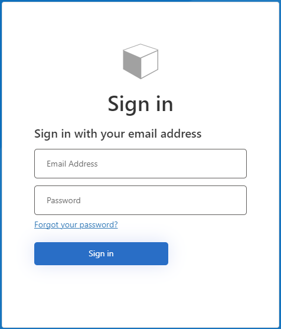

After logging in, the dashboard page is displayed (discussed in the subsequent section). The user can check their role and log out by clicking on the user icon in the top-right of the page.

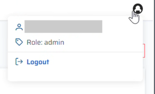

## Digital Thread Dashboard

The dashboard of the application is as shown in the images below. The numbered callouts in the image highlight the features described below.

1.  Six dot menu -- This expands to display options for Template Management, Rule Management, and User Management pages.

2.  User icon -- This expands to display user information and log out options.

3.  Project Monitoring Hub -- All Digital Thread Projects are displayed in this section.

4.  Create New Project -- This option will create a new Digital Thread project. Creating, editing, and deleting a project is covered in the subsequent sections.

5.  Details page - This button will be redirected to Digital Thread Project details page.

6.  Three dots menu -- This expands to display options for editing and deleting project operations.

7.  Edit Integration status -- This will allow user to update the integration status

  ----------------------------------------------------------------------------------------------------------------------------------------------------------------------------------------------------------------------------------------------------------------------------------------------------------------------------------------------------------------------------------------------------------------------------------------------------------------

## Creating New Project

Clicking on \'Create New Project\' option on the dashboard launches a pop-up window where the user is prompted to provide the following details regarding the project.

-   Project Title: Enter the name of your project in the designated field.

-   Description: Provide a brief description of the project.

-   Industry: Select the relevant industry from the dropdown menu (e.g., Aerospace and Defense).

-   System to Integrate: Choose the systems to be integrated, such as Teamcenter, SAP S4HANA, JIRA, MATLAB, Polarion, Cameo and SAP NetWeaver, from the dropdown list.

-   Status: Set the project status (e.g., Active) using the dropdown menu.

After all the required fields are filled, you can proceed to review your entries and save the project.

The new Digital Thread Project will be created and automatically added to the list of existing projects displayed in the dashboard. You can now view and manage your project alongside others in the Project Monitoring Hub.\
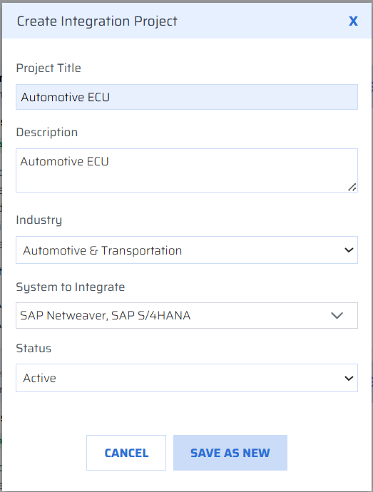

## 

# 

## Editing and Deleting Projects

Clicking on the three-dot menu on the project tile displays the Edit and Delete options.

-   **Edit**: A pop-up window is displayed with editable fields for all project attributes. Click the Save option to apply your changes. The updated project details will be saved, and the project will be refreshed in the list of existing projects within the application dashboard.

> 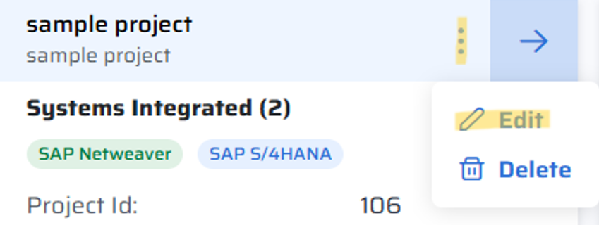
-   **Delete**: A pop-up window is displayed asking the user to confirm the deletion. Note that deleting a project is irreversible.

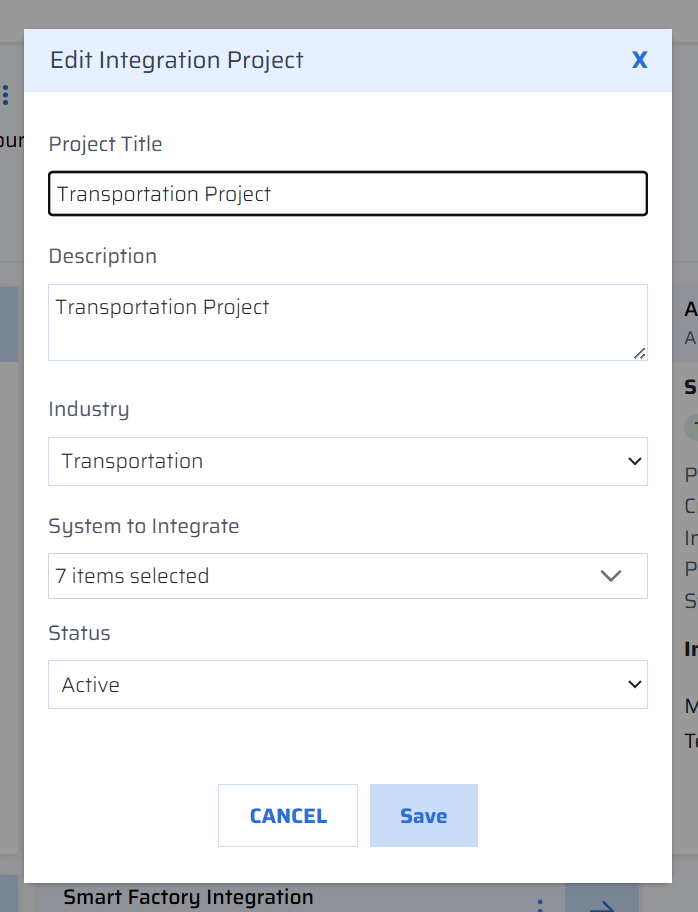

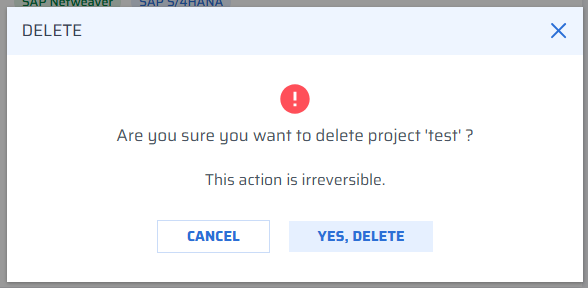

## Project Details page

Clicking on the project tile launches the project details page which is organized into tabs---the System Integration tab, along with tabs for all the platforms connected to the project.

In this example, there are four tabs, as three platforms (Teamcenter, Polarion, and MATLAB) are connected to the project.

-   System Integration tab -- This tab displays a centralized view of all platforms connected to a Digital Thread project, making it easy to monitor and manage system connectivity.

-   System tabs -- These tabs display the integration details for the individual systems such as actionable information about the connection status and integration of health of the selected system.

The following images depict the interface of the two types of tabs available on the page.

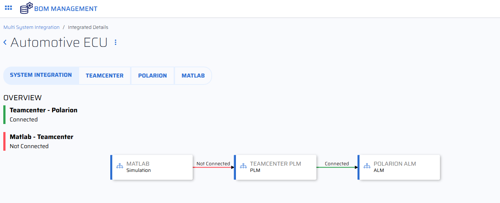

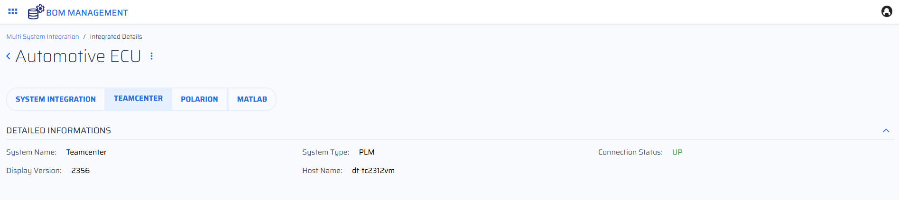

## 

# BOM Management Solutions Hub

The BOM Management Solutions hub can be accessed from the side menu and provides access to several key use cases, such as BOM Conversion, BOM Comparison, and Data Quality Check.

Each use case tile displays a brief description of the use case and the latest activity time stamp. Clicking the tile navigates to a dedicated dashboard tailored for that specific use case.

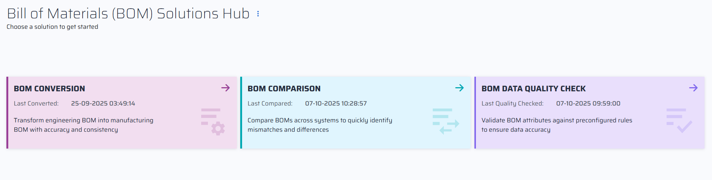

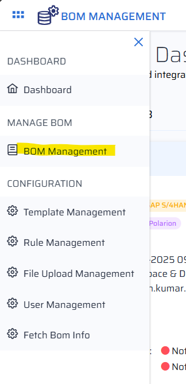

## 

# BOM Conversion

### Conversion Dashboard Page

The BOM Conversion dashboard provides a comprehensive view of all MBOM conversions that have been performed. Each entry in the conversion history includes key details such as the Conversion ID, the associated EBOM ID, the Template ID and Template Name used for the conversion, as well as the Rule IDs applied during the process. The dashboard also displays the name of the user who performed the conversion and the exact date and time when each conversion was created, making it easy to track and audit conversion activities.

For every converted MBOM, the current status is clearly indicated---such as Failure, In-Progress, Completed, or Approved---allowing users to quickly identify which conversions require attention or further action. Next to each status, there is a \"Details\" or \"Review\" button. When a user clicks this button, they are redirected to the Review Details page for that particular Conversion ID. This page provides an in-depth view of the selected conversion, including all relevant information and options for further review or action.

Additionally, the dashboard features an option to start a new conversion at any time, streamlining the workflow for users who need to initiate fresh MBOM conversions. Navigation controls are provided to browse through multiple pages of conversion records, ensuring users can efficiently locate and manage their conversion history.

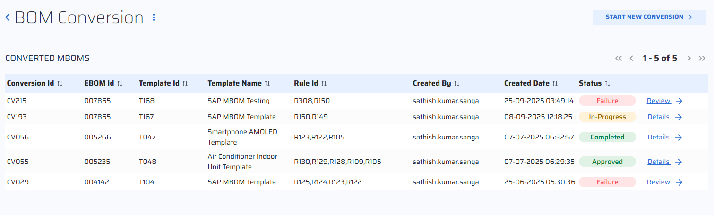

[]\{#_Toc214551564 .anchor\}

### Review Details Page

The Review Details Page provides authorized users with a comprehensive interface to review, manage, and act on MBOM conversions.

1.  Authorized users can take specific actions based on the MBOM\'s status. The available actions include:

-   Approve**:** Finalizes the MBOM conversion as approved. (Changes the MBOM status to *Approved)*

-   Reject**:** Marks the MBOM as rejected, preventing further processing. (Changes the MBOM status to *Rejected)*

-   Delete**:** Removes the MBOM conversion from the system.

> Note that these options are available depending on the MBOM status. Approve, reject and delete are available for MBOMs successfully converted (status: Ready). For MBOMs with \'Failure\' status, no actions for further processing are available.

2.  General Information Section: This section displays key details related to the MBOM conversion process, such as the conversion ID, Template Name, Template ID created date, created by, EBOM ID, Rule ID, Status, and Remarks. Remarks (notes) can be added/updated by using the text box at the end of the section.

3.  The BOM Information section provides details about the source EBOM and the converted MBOM. Users can click on individual EBOM parts or MBOM Parts to check their conversion status.

-   Blue Highlight -- Indicates that the EBOM part has been successfully converted to the MBOM.

-   Red Highlight -- Indicates that the EBOM part is not available in the MBOM.

> After approving the converted MBOM, the user can transmit to the designated target system for further processing by clicking on the \'Push to Target System\' option.

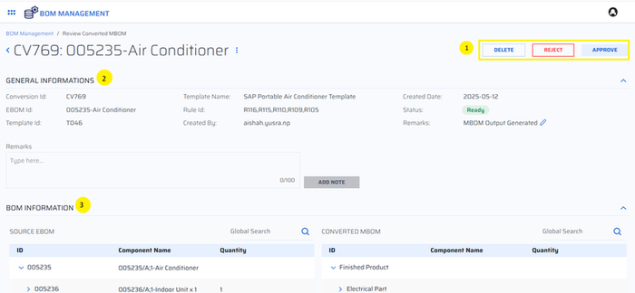

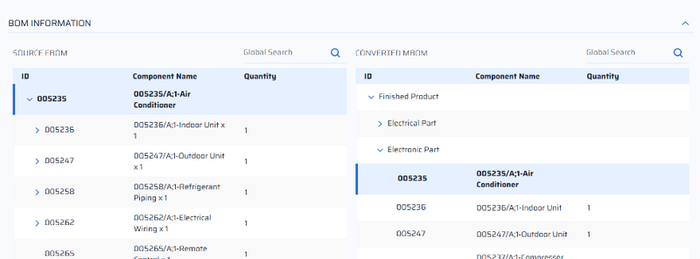

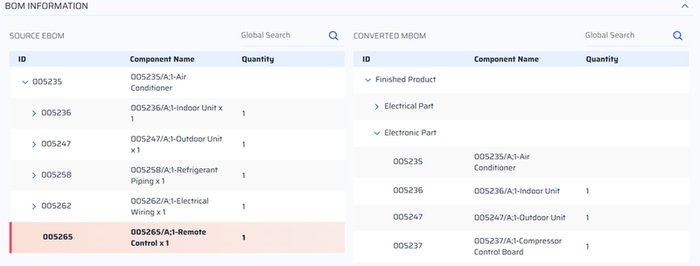

Pushing the MBOM to the target system will change the MBOM status to Completed.

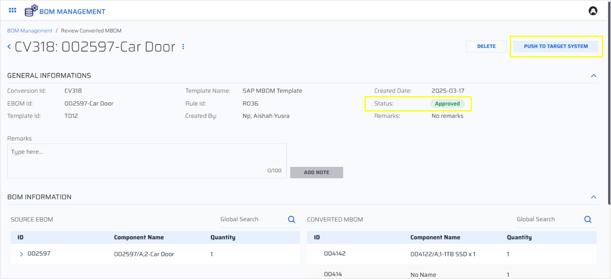

### 

## MBOM Conversion Process

When the user clicks \"Start Conversion\" from dashboard, they are taken to the Conversion Process screen.

The left side of the screen displays a step-by-step navigation menu with the following steps:

1.  EBOM Selection

2.  MBOM Template Selection

3.  Configuration

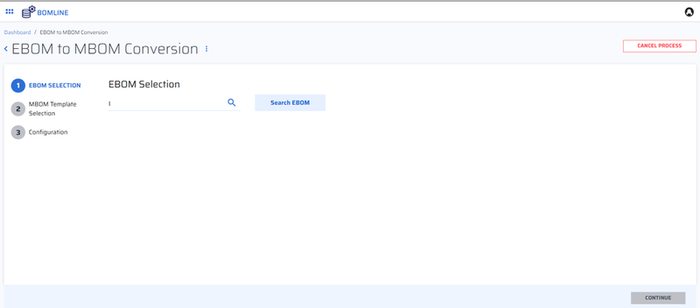

#### Step 1 -- EBOM Selection

1.  The EBOM can be browsed by using the Search Bar by typing in the EBOM name, ID, or other attributes.

2.  Search results appear in a table with columns such as BOM ID, Name, and Status.

3.  The table can be further filtered using the search and filter options. Pagination and view options are also available to enable further navigation through the EBOMs listed in the BOM List table.

4.  Clicking on the BOM ID navigates to the EBOM Details page. This is described further in the subsequent section.

5.  Checkboxes enable selection of single and multiple EBOMs to use as template.

6.  The Cancel Process option cancels the conversion process and returns the user to the dashboard.

7.  The Continue option is enabled when an EBOM is selected. Clicking on this navigates to the next step.

> 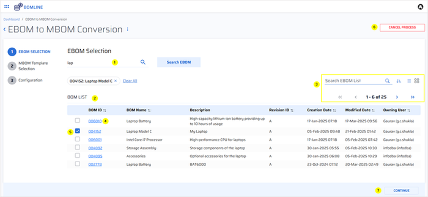

#####  EBOM Details Page 

The EBOM Details Page provides an in-depth view of the selected EBOM.

1.  General Information: This section provides key details about EBOM, including BOM ID, BOM Name, BOM Revision ID, Description, Creation Date, and Status.

2.  Expand/Collapse: All sections can be expanded/collapsed using this option.

3.  Associated Documents: If there are any linked documents related to this EBOM, they are listed here.

4.  Components: This section displays the hierarchical structure of the EBOM components in a table format. A search bar is available to filter the components.

5.  SELECT THIS BOM option allows the user to select this EBOM for conversion and proceed to the MBOM selection step.

> 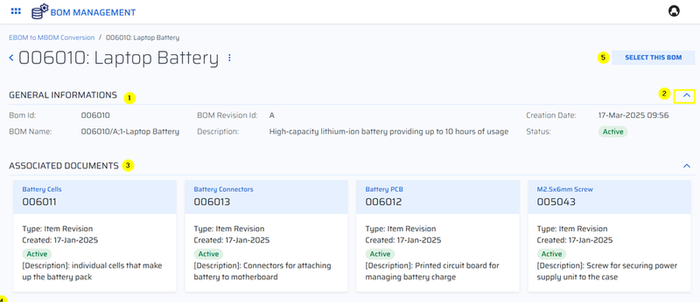
>
> 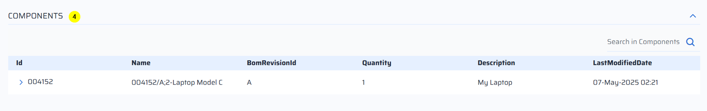
#### 

### Step 2 - MBOM Template Selection

1.  The list of available MBOM templates is displayed as a table with columns that provide the template ID. Template type.

2.  Options to search for and filter the template list are available.

3.  Clicking on the MBOM Template ID navigates to the MBOM Template Details page. This is discussed further in the subsequent section.

4.  Checkboxes enable selection of single or multiple MBOM templates.

5.  Cancel Process option cancels the conversion and returns user to the Dashboard.

6.  The Back option navigates to the previous step (EBOM Selection).

7.  Continuing option is enabled when MBOMs are selected. Clicking on this navigates to the Configuration (Transformation Rules) step.

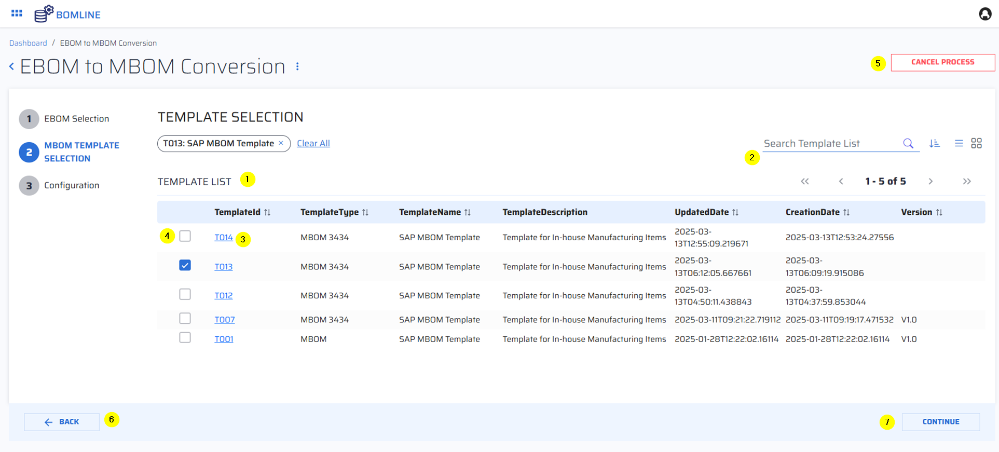

##### 

##### MBOM Details Page 

The MBOM Details Page provides a structured view of the selected MBOM template.

1.  General Information: This section provides key details about the MBOM, including BOM ID, BOM Name, Description, Creation Date, and Status.

2.  MBOM Template section: This section displays the MBOM template components in a hierarchical tree structure.

3.  Users can expand/collapse the structure to view different levels.

4.  Users can use the search bar to filter components within the MBOM.

5.  Select This MBOM option allows the user to select this MBOM template for conversion and proceed to the transformation rule selection step.

> 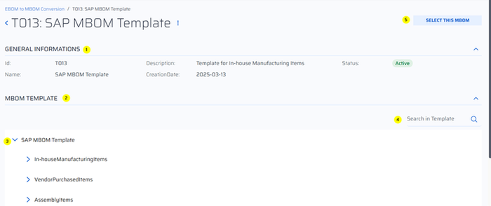
#### 

### Step 3 - Configuration (Transformation Rules)

In this step, the user can define transformation rules that determine how the selected EBOM is converted into an MBOM.

1.  The page displays the Transformation Rules section where the user can add and delete transformation rules as required.

2.  The Selected EBOM details and Selected MBOM template details are also displayed as a table for verification.

3.  After verifying the selections and configuring rules, click on Confirm button, the application processes the conversion.

After successful conversion, the user is redirected to the Dashboard and the converted MBOM is displayed in a table.

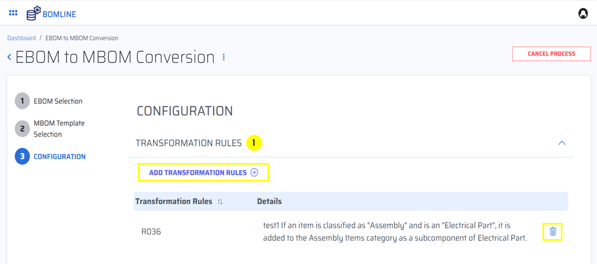

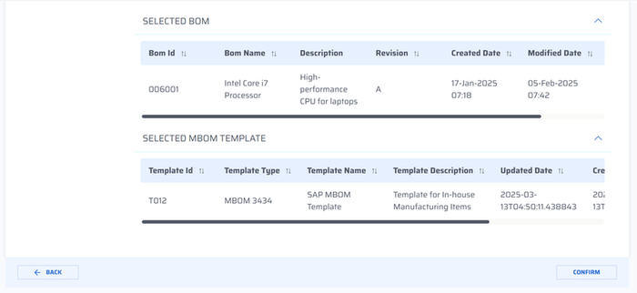

The following image shows the table of the converted MBOMs.

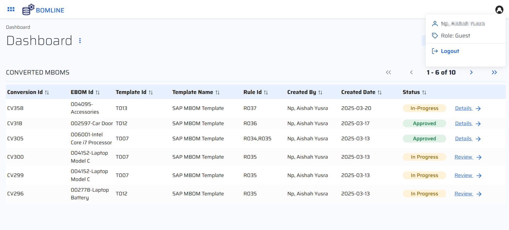

## 

# BOM Comparison 

### Comparison Dashboard Page

The BOM Comparison dashboard displays a comprehensive list of all BOMs that have been compared previously. Each entry in the list includes important details such as the Comparison ID, Source Folder Name, Destination Folder Name, Status, Creator, and the Date and Time when the comparison was performed. Users can easily review the status of each comparison, with \`completed\` comparisons clearly indicated. For every previously compared BOM, there is a direct link to access its details page, enabling users to view in-depth information about that specific comparison. The interface also provides an option to initiate a new BOM comparison at any time, making it convenient for users to start fresh analyses as needed. Navigation controls are available to browse through multiple pages of comparison records, ensuring users can efficiently locate and manage their BOM comparison history.

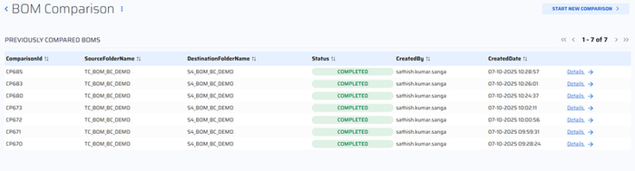

### 

## EBOM Comparison Details Page 

The EBOM Comparison page can be navigated to from the dashboard by clicking on the BOM Actions menu \&gt; Start New Comparison.

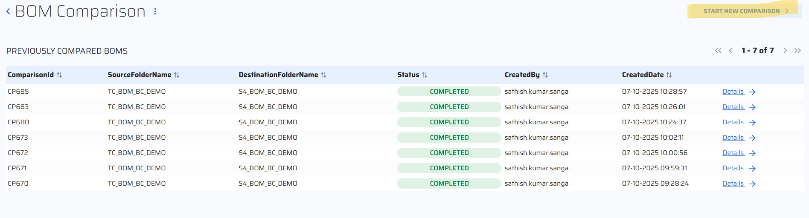

The EBOM Comparison page displays the comparison between two types of BOM data---typically a source and a destination (for instance, Teamcenter and SAP) to identify differences in components, structure, or attributes. The user can select the source folder (1) and the destination folder (2) and then click on \'Compare\' to begin the comparison.

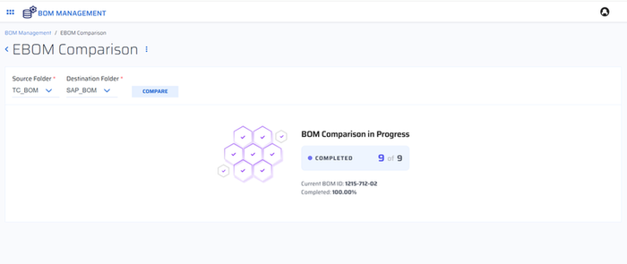

The system imposes certain limits, allowing users to run multiple comparisons in parallel only when slots are available. If all slots are occupied and a user tries to start another comparison, a popup notification will appear indicating that the maximum concurrency limit has been reached.

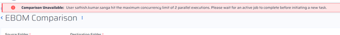

When the comparison is complete, the results are visualized as pie charts and line charts. The comparison results consist of:

-   Total BOMs Compared

-   Total Count of Items

-   Mismatch Types (e.g., missing parts, attribute differences)

> 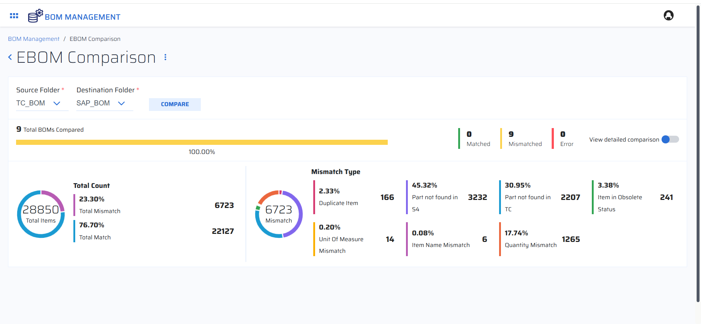
Detailed comparison results can be viewed by toggling the \'View Detailed Comparison\' option. The results displayed are in the form of a table that displays the BOM ID and BOM Name color-coded as per source and destination. The comparison results are sorted in the following columns:

-   Status (Match/Mismatch)

-   Match percentage

-   Mismatch percentage

An Action column with a \"Details\" link which navigates to the file-level comparison for that row.

> 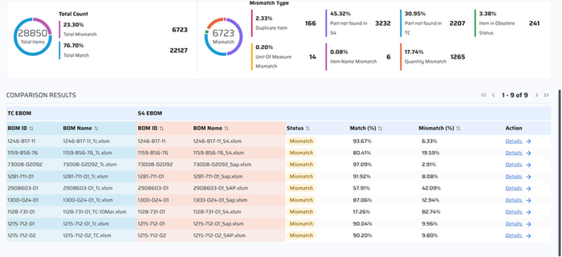
### 

## File-Level Comparison

Clicking the Details link launches a file-level comparison, i.e., a detailed comparison between the corresponding source and destination file.

The visualizations (1) display comparison metrics: Total Items Compared, Total Line Items (Bi-directional), and Mismatch Types. The comparison table (2) displays BOM attributes (e.g. part numbers, quantities, descriptions, etc.), status (match/mismatch) and a reason for mismatch (e.g. missing parts, value differences, etc.). The table can be filtered by discrepancies by matches or mismatches (3), and discrepancy reports can be generated and exported (4).

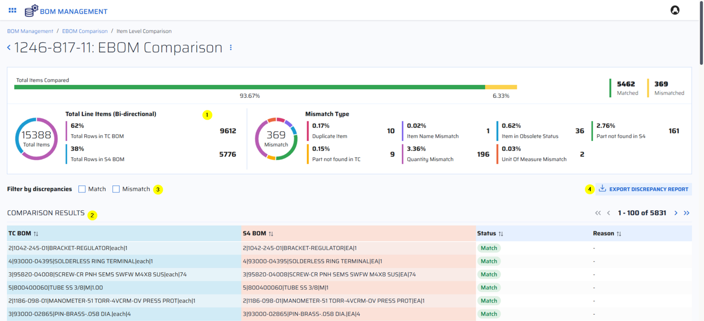

## BOM Data Quality Check

### Data Quality Check Dashboard Page

The BOM Data Quality Check dashboard provides users with a clear overview of all BOMs that have undergone quality checks in the past. Each entry in the list displays essential information, including the Quality Check ID, the folder name where the BOM is stored, the status of the check, the creator, and the date and time when the quality check was completed. This organized view allows users to quickly identify which BOMs have already been validated for data quality.

For every previously quality checked BOM, there is a convenient link to access its details page. By clicking on this link, users can review in-depth results and insights related to the specific quality check performed on that BOM. This feature ensures that users can easily revisit and analyze the outcomes of past quality checks whenever needed.

Additionally, the dashboard includes an option to initiate a new data quality check at any time. This makes it simple for users to start the validation process for new BOMs or revalidate existing ones as requirements evolve. Navigation controls are also provided, enabling users to browse through multiple pages of quality check records and efficiently manage their BOM data quality history.

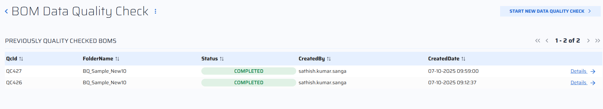

### 

## EBOM Data Quality Page 

The EBOM Data Quality page can be navigated to from the dashboard by clicking on the BOM Actions menu \&gt; Data Quality Check

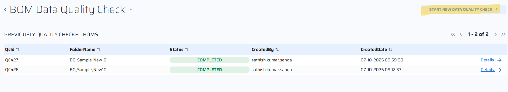

On this page, the user can:

-   Select BOM Folder

-   Run Quality Check

-   View Data Quality Results

The source folder can be selected from the dropdown. Click on \'Run Quality Check\' option to begin the Data Quality Check.

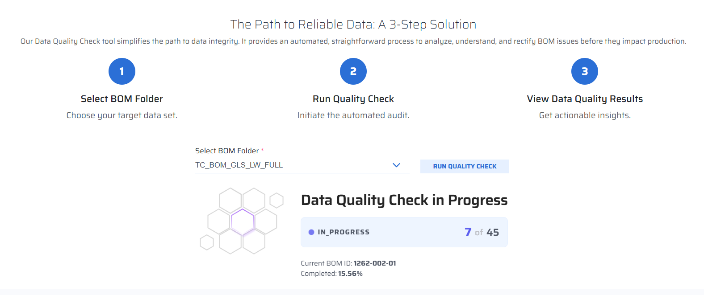

The system imposes certain limits, allowing users to run multiple quality checks in parallel only when slots are available. If all slots are occupied and a user tries to start another data quality check, a popup notification will appear indicating that the maximum concurrency limit has been reached.

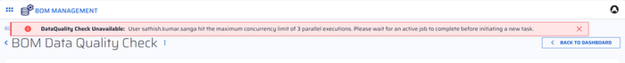

When the Data Quality Check is complete, the results are visualized as pie charts and line charts. The Data Quality results consist of:

-   Total BOMs Checked

-   Total Count of Items

-   Invalid Types (e.g., child status empty, item is obsolete)

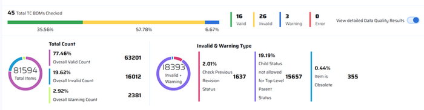

Detailed Data Quality results can be viewed by toggling the \'View Detailed Data Quality Check\` option. The results displayed are in the form of a table that displays the BOM ID and BOM Name color-coded. The Data Quality results are sorted in the following columns:

-   Status (Valid/Invalid)

-   Valid percentage

-   Invalid percentage

An Action column with a \"Details\" link which navigates to the file-level Data Quality Results for that row.

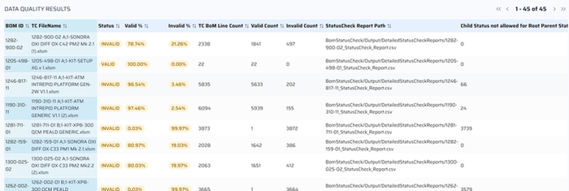

#### 

### File-Level Data Quality Results

Clicking the Details link launches a file-level Data Quality Check, i.e., detailed data quality results for that file.

The visualizations display data quality metrics: Total Items, invalid type with reasons (e.g. Child status is empty; item is obsolete etc.). The Data Quality Results table displays BOM attributes (e.g. parent id, parent release status, child id, child release status, etc.), status (Allowed/Not Allowed). The table can be filtered by discrepancies by Allowed or Not Allowed, and discrepancy reports can be generated and exported.

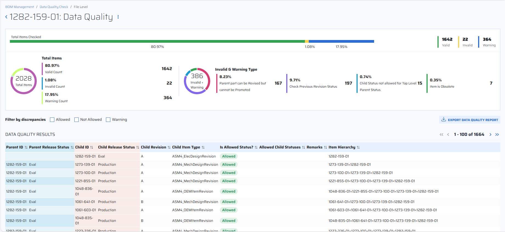

## MBOM Template Management Page 

The Template Management page is accessed from the sidebar menu. This page enables users to upload, edit, clone, delete, and download MBOM templates.

1.  Upload New JSON MBOM template. A template can be uploaded from your local directory. Drag-and-drop is also supported. Maximum file size is 10 MB. Note that only one file can be uploaded at a time.

2.  Download MBOM template format

3.  Clone MBOM template. The user can create a new MBOM template by cloning an existing template from the list of templates available in the application.

4.  MBOM Templates. Tabular view of existing templates. Users can view, edit, and delete existing templates. Note that the recently uploaded template is displayed at the top of the table, however, the templates can be sorted by clicking on the arrows next to each column.

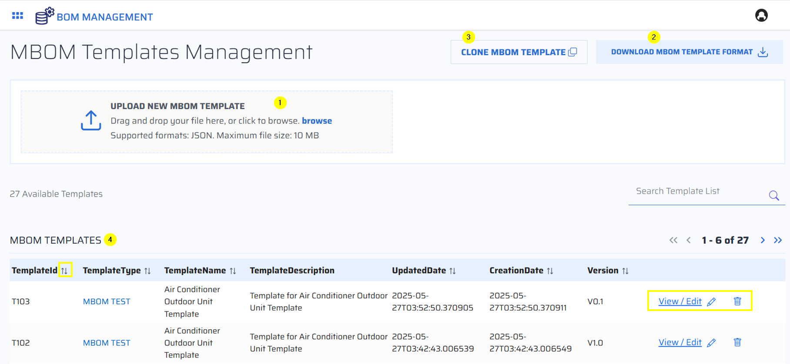

### Cloning MBOM Templates

Templates can be cloned to minimize the effort of creating templates that have similar configurations to existing templates.

To clone a template, select any row from the template list table and click on the \'Clone MBOM Template\' option.

A popup window is displayed with details of the selected template: Template type, name, description, and version. Edit the fields as necessary and click on \'Save as New\' to create the new template.

The cloned template is displayed at the top of the table, by default.

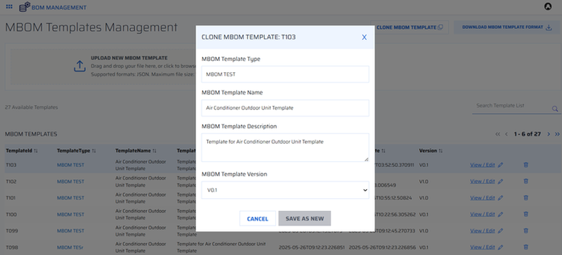

### Editing MBOM Templates

When the user clicks the View/Edit option on a specific template row, the Template Details page is launched.

The General Information section (1) displays details such as ID, description, Status, Name, and Creation Date.

The MBOM Template section (2) displays the template structure in a hierarchal tree format.

The EDIT TEMPLATE option will display this page in edit mode.

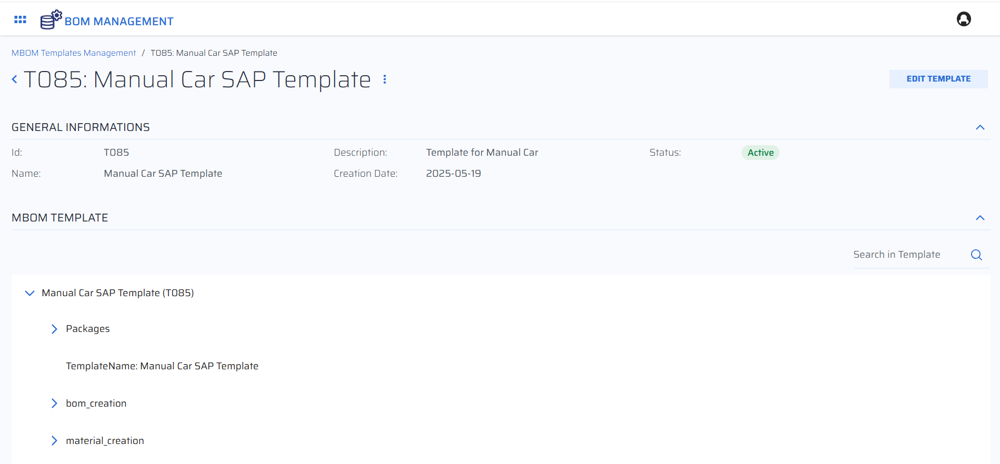

All fields except for the Creation Date field can be edited in the General Information section.

The nodes can be renamed by typing in the updated name.

New nodes can be added using the plus (+) icon and a node can be deleted by using the (-) icon. Nodes can be reordered by dragging and dropping them between levels, as required.

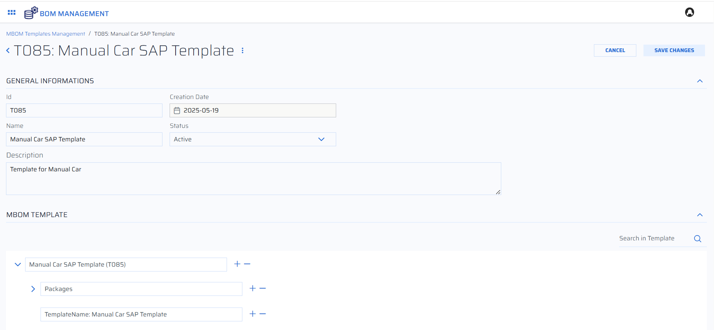

## 

# Rules Management Page

The Rule Management page enables users to upload, manage, clone, edit, and delete BOM comparison rules. The points below correspond to the numbered callouts in the following image.

1.  Upload New Rules. Users can upload new rules in the form of a JSON file of maximum size 10 MB from their local directory. Drag and drop method is also supported.

2.  Clone Rule. An existing rule can be cloned to create a new rule with similar configurations.

3.  Download Rule Template Format. Users can download and use this template file to provide their rules in the correct format.

4.  Rules list. All uploaded rules and their details are displayed as a table, with options to view, edit, and delete available.

> 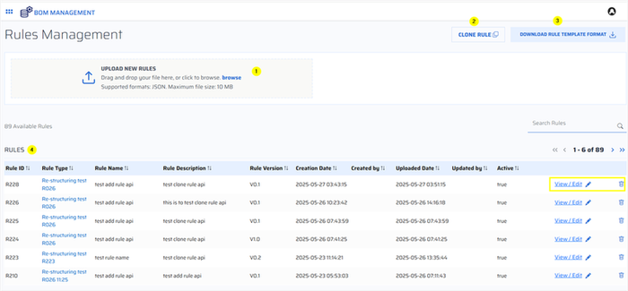

### Cloning Rules

To clone a rule, select an existing rule from the Rules list table and then click on the \'Clone Rule\' option. A popup window is displayed with the option to edit the details of the rule. The details available to edit are Rule Type, Rule Name, Rule Description, Rule Version, and Active (status).

After editing the fields, click on \'Save as New\' to create the new template.

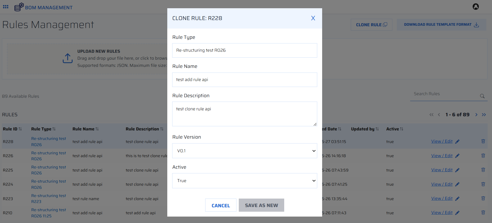

### 

## Editing Rules

When the user clicks the View/Edit icon on a specific row, the Rule Details page is displayed.

This page displays the details of the selected rules such as the rule ID, rule name, rule type, description, version, sequence, status, and other metadata fields.

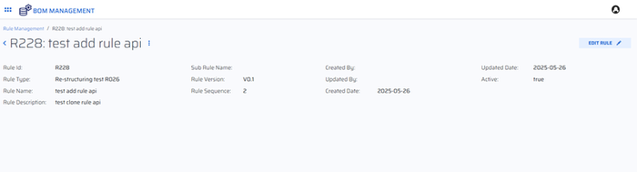

Clicking on the \'Edit Rule\' option displays this page in edit mode. All fields are editable except for the Rule ID and certain metadata fields such as created date, created by, updated date, and updated by.

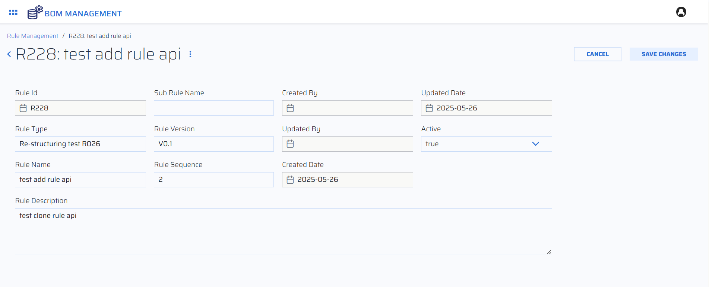

## User Management Page

The User Management page is available for only admin users, and it enables them to manage other users and their roles.

On accessing this page, the user list table (1) is displayed, which provides details such as the user ID, username, email, role, creation date, and the last login date.

New users can be added using the \'Add User\' option (2). The details of an existing user can be viewed, edited, and deleted using the corresponding options available at the end of each row (3).

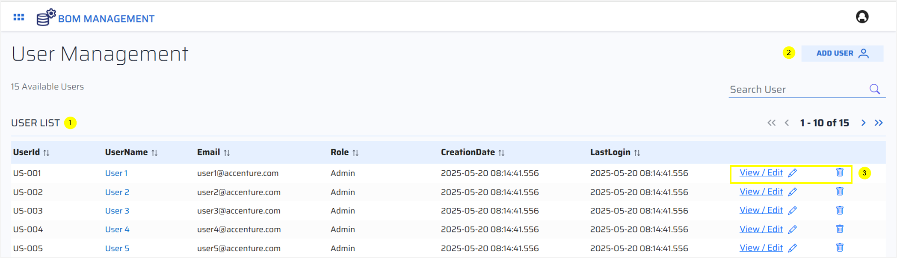

## 

# File Upload Management Page

The File Upload Management module provides a user-friendly interface for uploading and managing files used in BOM Comparison and Data Quality Check processes.

Supported file formats are XLSM, CSV files with maximum size of 20 MB

Radio buttons (1) are available to select which use case the files are intended for.

Users can select an existing folder for upload from the \'Select a Folder\' dropdown (2) or create a new folder. Specify the folder name in the \'Create New Folder\' text field (3). Ensure that naming guidelines, if any, are followed when naming the folder.

After the upload is complete, a success message (4) is displayed.

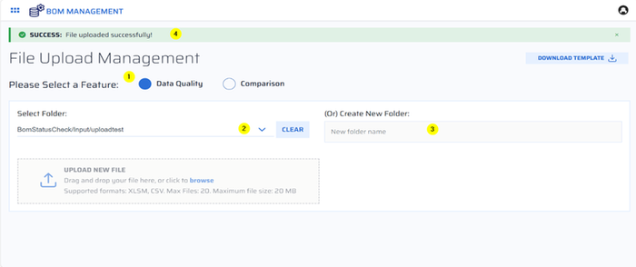

## 

# Fetch BOM Info

This option is available under the Configuration section of the sidebar menu. Using this functionality, users can fetch BOM data from Teamcenter (TC) and SAP systems for the purpose of exporting it.

The interface provides a dropdown menu to select the system and two options -- to fetch specific BOM data via BOM IDs/details or bulk export, i.e., export all BOM data.

When fetching specific BOM data, there are two fetch types:

-   Single / Multiple BOMs: Select this to fetch data for individual BOMs or a custom list of BOM IDs.

-   Range (Min - Max): Select this to fetch BOMs within a specified range of IDs.

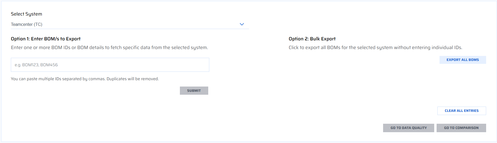

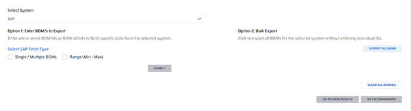

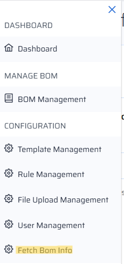

After the required data is fetched, the user can proceed to the corresponding use case module (Go to Data Quality, Go to Comparison).
