

Digital Thread Foundations

HTTP Source and Sink Connector

INTEGRATION GUIDE

Release Version: 1.2

## Introduction

A digital thread refers to the continuous and consistent flow of information throughout the entire lifecycle of a product or system -- from design and development to operation and maintenance. It enables the integration of data from different stages and sources, allowing effective traceability, seamless collaboration, and efficient decision-making by unleashing the power of sleeping data. The digital thread is considered a key aspect of Industry 4.0 and the digital transformation of the manufacturing industry. It is the core of what we call the Enterprise Operating System (EOS). Digital Thread is a communication framework that helps integrate various enterprise systems involved in the engineering and manufacturing product life cycle.

Part of Digital Thread Foundations, the HTTP Source Connector plays a crucial role in facilitating this integration by enabling the continuous flow of real-time data from diverse HTTP endpoints into Kafka. By leveraging Kafka Connect, which is designed for connecting Kafka with external systems, the HTTP Source Connector allows organizations to pull data from various HTTP sources and publish it to Kafka topics. This capability enhances traceability and collaboration across the product lifecycle, ensuring that relevant information is readily accessible for informed decision-making. Ultimately, the HTTP Source Connector supports the overarching goal of the digital thread by integrating and streamlining data flows throughout the manufacturing process.

In addition to source connectors, sink connectors play a vital role in the data integration process by allowing data to flow out of Kafka and into external systems, such as databases or analytics platforms. This two-way data flow, facilitated by both source and sink connectors, ensures that organizations can not only ingest data but also utilize it effectively for operational insights and decision-making. Together, these connectors support the overall objectives of the digital thread in optimizing manufacturing processes.

### Purpose

The document describes the setup and testing of HTTP REST source and sink connectors.

### Target Audience

Software architects, developers, and integrators with IT backgrounds.

### Related Links

-   [Digital Thread Foundations Connectors](https://industryxdevhub.accenture.com/assetdetails/97)

-   [GitHub -- Kafka Connector](https://github.com/castorm/kafka-connect-http)

### Business Contacts

-   [florian.tournier@accenture.com](mailto:florian.tournier@accenture.com)

-   [laura.mosconi@accenture.com](mailto:laura.mosconi@accenture.com)

-   [karthik.ramachandra@accenture.com](mailto:karthik.ramachandra@accenture.com)

### Technical Contacts

-   [laura.mosconi@accenture.com](mailto:laura.mosconi@accenture.com)

-   [stefano.giacco@accenture.com](mailto:stefano.giacco@accenture.com)

### Prerequisites

-   Access to the IX Digital Development environment -- can be requested from the Technical Contacts.

-   Download [kafka_2.12-3.5.1](https://archive.apache.org/dist/kafka/3.5.1/kafka_2.12-3.5.1.tgz)

-   Copy jar files from the source code lib folder to the Kafka libs folder

-   Copy jar files from the source code plugins folder to the Kafka libs folder

-   Copy only config-distributed.properties to the Kafka config folder

-   connect-distributed.bat ../../config/connect-distributed.properties

-   Registering connector by running the local app in Postman for HTTPS connector

-   Monitor Kubernetes logs in the cloud shell, access to run below commands in the cloud shell

    -   kubectl get pods -n prod

    -   kubectl logs ix-kafka-debezium-6fc5fb8f79-zhg2q -n prod

-   Connect with Azure VPN. Access can be requested from [IX_DT_DEVOPS_INFRA@accenture.com](mailto:IX_DT_DEVOPS_INFRA@accenture.com).

### Technology Stack

| **Tools** | **Repository** |
| --- | --- |
| - Kafka 2.12-3.5.1 | - Git branch name: dev |
| - Azure EventHub | - Git folder link: [kafka-connect-http - Repos (azure.com)](https://dev.azure.com/IXDigitalThread/IXThreadComponents/_git/ix-thread-components?path=/cdc/kafka-connect-http) |
| - Azure ADX |  |
| - Kubernetes |  |
| - JWT |  |
| - Postman |  |

## 

# HTTP Source Connector 

An HTTP Source Connector reads data from an HTTP endpoint (REST API) and streams it into Kafka topics. It periodically polls the specified HTTP endpoint to retrieve data and publishes that data as messages in Kafka.

Change Data Capture (CDC) process leveraging Kafka components and an HTTP Source Connector. This connector retrieves data from an HTTP endpoint and streams it into Kafka topics, enabling real-time data integration.[]\{#_Toc199265714 .anchor\}

### Key Components

-   KafkaConnectWorker: This worker is part of the Kafka Connect framework and is responsible for running connectors that either send data to or fetch data from Kafka.

-   HttpRestSourceConnector: This source connector interacts with the HTTP endpoint, periodically fetching data and sending it to Kafka topics.

-   HttpRestEndpoint: Represents the HTTP API endpoint from which data is fetched, providing the source data to be ingested into Kafka.

-   KafkaCluster: The Kafka cluster receives the data fetched by the HTTP source connector, where it is published as messages in Kafka topics.

### Flow Description

-   **Start HTTP Source Connector:** The process begins with the KafkaConnectWorker initializing and starting the HttpRestSourceConnector. The connector sets up an offset timestamp to track the latest processed data.

-   **Polling Data:** The connector enters a loop, periodically polling the HTTP endpoint for new data changes, using the offset timestamp to ensure only new changes since the last fetch are retrieved.

-   **Retrieve Changes**: Changes are retrieved from the HTTP endpoint and sorted by timestamp to maintain data order.

-   **Apply Filtering Criteria:** The connector applies any specified filtering criteria to the retrieved data, filtering out irrelevant information. It then calculates the next offset timestamp based on the latest processed data to avoid re-fetching the same data in the next interval.

-   **Publish Data to Kafka Topic:** After filtering, the connector publishes the data to the specified Kafka topic in the KafkaCluster.

-   **Acknowledgment:** The Kafka cluster acknowledges data reception, confirming the successful processing and publication of the data.

-   **Waiting Interval:** The connector waits for the next polling interval before repeating the process of polling, retrieving, and publishing changes.

-   **Stop HTTP Source Connector:** The KafkaConnectWorker may eventually stop the HTTP Source Connector, terminating the process.

-   **Loop:** This process repeats periodically, fetching new data from the HTTP REST API, applying filters, and publishing it to Kafka.

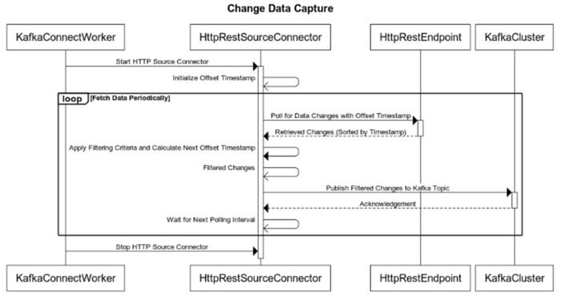

## 

# HTTP Sink Connector 

Conversely, an HTTP Sink Connector writes data from Kafka topics to an HTTP endpoint (REST API). It takes messages from Kafka topics and sends them to a configured HTTP endpoint. which integrates Kafka Connect with an HTTP REST endpoint to transfer data from Kafka topics to an HTTP destination.

### Key Components

-   Kafka Connect: A platform designed to connect Kafka topics to external systems (both source and sink). It facilitates scalable and reliable data movement between Kafka and target endpoints.

-   Kafka Topic: A messaging topic within Kafka that stores records (messages) consumed by the HTTP Sink Connector and sent to the target system.

-   HTTP Sink Connector: Serves as a bridge between Kafka topics and an HTTP-based endpoint. It retrieves records from the Kafka topic and forwards them to the HTTP REST endpoint, applying optional filters and transformations as needed.

HTTP REST Endpoint: A target system, such as a REST API, that receives data sent by the HTTP Sink Connector from Kafka topics. The endpoint processes the records according to the configured HTTP request (e.g., POST or PUT).

### Flow Description

-   **Configuration Setup:** The system is configured to establish connections between Kafka, the Sink Connector, and the HTTP endpoint.

-   **Polling for New Records:** The HTTP Sink Connector continuously polls Kafka topics to check for new messages.

-   **Retrieved Records:** If new records are available, the connector retrieves them from the Kafka topic.

-   **Send Records to Sink:** The retrieved records are forwarded to the HTTP Sink Connector for further processing.

-   **Loop (For Each Record):** For each record retrieved from the Kafka topic:

-   **Apply Filters and Transformations:** Optional logic is applied to filter or modify the data before forwarding it.

-   **Send Record Data:** The connector sends the processed data to the HTTP REST endpoint through an HTTP request.

-   **Response Status:** The HTTP endpoint responds with a status (e.g., success, failure, or error), that the Sink Connector captures.

-   **Report Success/Failure:** The outcome of the record transmission (whether successful or not) is reported back to Kafka Connect, completing the process.

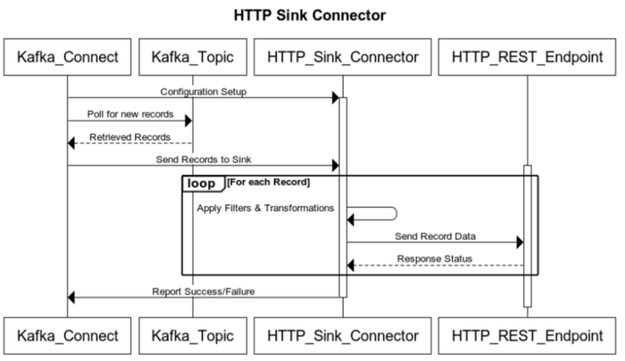

## 

# Connector Setup

Ensure that Kafka Connect is properly installed and running. This is typically part of Kafka installation and can be started using the provided scripts as mentioned in the prerequisites.

### Connector Configuration

Create a configuration file for the HTTP Source Connector. The configuration requires the values of the endpoint, header, Ocp-Apim-Subscription-Key, and the bearer token to run and create the connector in Postman. The script for connector creation and token update can be referred to [here](https://ts.accenture.com/:t:/r/sites/GlobalDocTemplates/Published%20Documents/IX%20Thread/Linked%20Files/HTTP_Source_Connector_Create_Update_Script.txt).

Below are the API details of the POST Create Connector used to create and configure the connectors. A sample request and response for the configuration are depicted in the following image.

| PROTOCOL | HTTP |
| --- | --- |
| DEV ENDPOINT |  |
| QA ENDPOINT |  |
| METHOD | POST |
| CONTENT TYPE | application / json |
| Parameter | Value/Description |
| Ocp-Apim-Subscription-Key | 969ffc37d81444809de9xxxxx5d5756e |
| transaction-id | 1234 |
| Authorization | Bearer \{token\} Sample Body [HTTP Source Connector Sample Body](https://ts.accenture.com/:t:/r/sites/GlobalDocTemplates/Published%20Documents/IX%20Thread/Linked%20Files/HTTP_Source_Connector_Sample_Body.txt) [HTTP Sink Connector Sample Body](https://ts.accenture.com/:t:/r/sites/GlobalDocTemplates/Published%20Documents/IX%20Thread/Linked%20Files/HTTP_Sink_Connector_Sample_Body.txt) 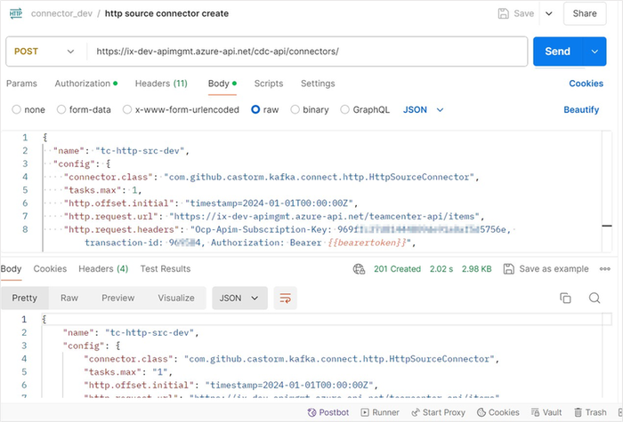
[]\{#OLE_LINK13 .anchor\} |

### 

## Connector Status Monitoring

The connector creation can be monitored in Postman by checking the connectors list in Kafka. For this, the GET Connectors API is called, as depicted in the corresponding images.

To monitor the status, the GET Connector Status API is called.

| PROTOCOL | HTTP |
| --- | --- |
| DEV ENDPOINT | [https://ix-dev-apimgmt.azure-api.net/cdc-api/connectors/\{connector name\}/status](https://ix-dev-apimgmt.azure-api.net/cdc-api/connectors/%7bconnector%20name%7d/status) |
| QA ENDPOINT | [https://ix-qa-apimgmt.azure-api.net/cdc-api/connectors/\{connector name\}/status](https://ix-qa-apimgmt.azure-api.net/cdc-api/connectors/%7bconnector%20name%7d/status) |
| METHOD | GET |
| CONTENT TYPE | application / json |
| Parameter | Value/Description |
| Ocp-Apim-Subscription-Key | 969ffc37d81444809de9xxxxx5d5756e |
| transaction-id | 1234 |
| Authorization | Bearer \{token\} 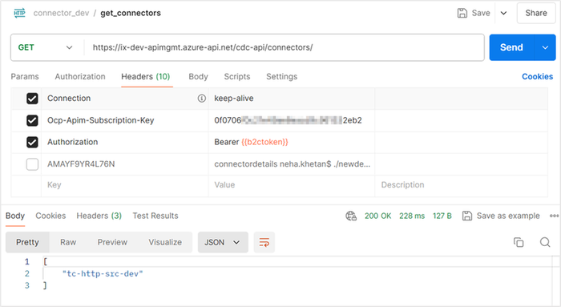
**Sample Response** &gt; \{ &gt; &gt; \"name\": \"tc-http-src-dev\", &gt; &gt; \"connector\": \{ &gt; &gt; \"state\": \"RUNNING\", &gt; &gt; \"worker_id\": \"connect:8083\" &gt; &gt; \}, &gt; &gt; \"tasks\": \[ &gt; &gt; \{ &gt; &gt; \"id\": 0, &gt; &gt; \"state\": \"RUNNING\", &gt; &gt; \"worker_id\": \"connect:8083\" &gt; &gt; \} &gt; &gt; \], &gt; &gt; \"type\": \"source\" &gt; &gt; \} 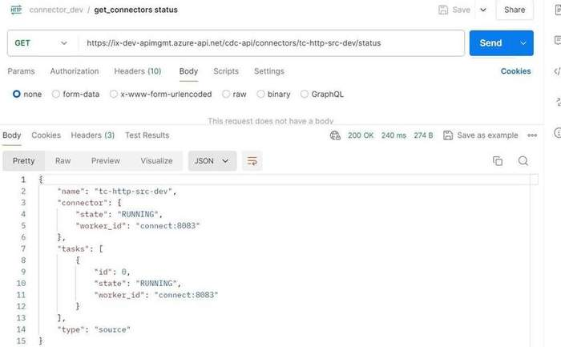
|  |

### 

## Check Topics

To retrieve topics by connector, the GET Topics by Connector API is called.

| PROTOCOL | HTTP |
| --- | --- |
| DEV ENDPOINT |  |
| QA ENDPOINT |  |
| METHOD | GET |
| CONTENT TYPE | application / json To verify that data received from the source is being published to the specified Kafka topic, check connector logs (Kubernetes logs) in Azure EventHub using the commands below. &gt; kubectl get pods -n prod &gt; &gt; kubectl logs kafka_pod_name_listed_in_above_step -n prod The logs display the details fetched in the HTTP source configured and the offset information until the connector creation is processed. They also show the items received from eventhub cdc-dev, which are then sent to the endpoint configured. To view an example for the logs, click [here](https://ts.accenture.com/:i:/r/sites/GlobalDocTemplates/Published%20Documents/IX%20Thread/Linked%20Files/HTTP_Source_Connector_Logs_1.jpg). The HTTP endpoint configured in the connector running and receiving the messages from the sink connector is shown below. 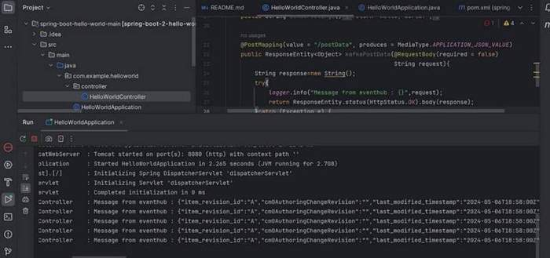
|  |

### 

## Verify Events

The topic cdc-dev is configured in the http-connector configuration, which can be checked in EventHub via the event message sent from the connector by clicking on \'Analyze data (preview)\'.

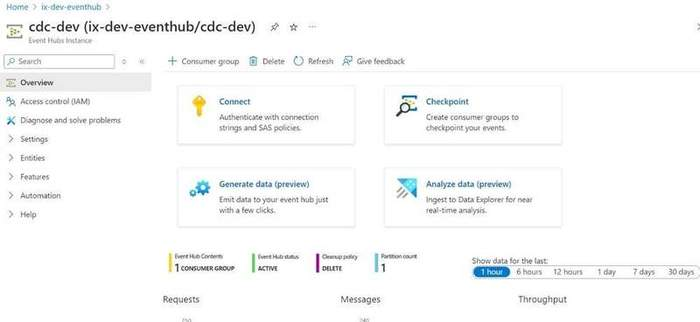

Enter the fields (ingest properties) as shown below then click Next Source. []\{#_Toc199265724 .anchor\}

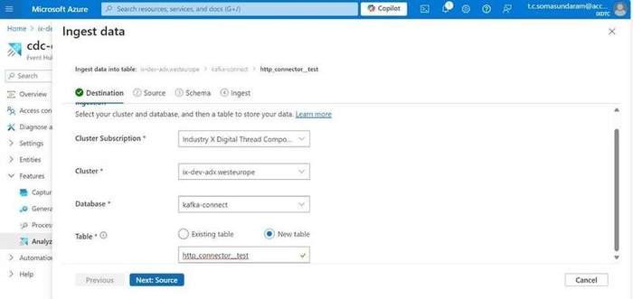

The data is displayed in a tabular format.

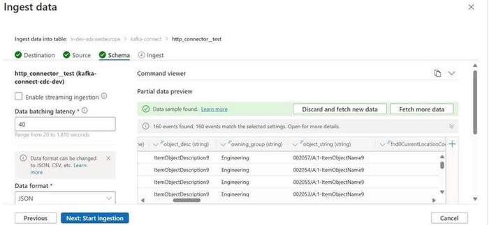

## 

# Local Setup

1.  Download kafka\_2.12-3.5.1.

2.  Clone [ix-kafka - Repos (azure.com)](https://dev.azure.com/IXDigitalThread/IXThreadComponents/_git/ix-thread-components?path=/cdc/ix-kafka)

3.  Copy jar files from the ix-kafka lib folder to the Kafka libs folder.

4.  Copy jar files from the ix-kafka plugins folder to the Kafka libs folder.

5.  Copy only ix-kafka/config/connect-distributed.properties to the Kafka config folder.

6.  Update below properties in connect-distributed.properties:

> bootstrap.servers=ix-dev-eventhub.servicebus.windows.net:9093
>
> plugin.path=C:/SW/kafka/libs (kafka_installation_path/lib)
>
> Update the password in sasl.jaas.config, producer.sasl.jaas.config, consumer.sasl.jaas.config with Connection string--primary key available in EventHub config.
>
> 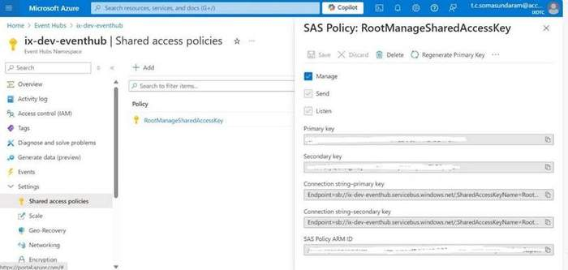
7.  Open cmd from kafka_installation_path\\bin\\windows and run the below commands one by one in separate cmd windows in order:

> zookeeper-server-start.bat ../../config/zookeeper.properties
>
> kafka-server-start.bat ../../config/server.
>
> connect-distributed.bat ../../config/connect-distributed.properties.

8.  Register the connector by running the local app in Postman for the HTTPS connector.

    a.  Local connector endpoint 

    b.  Configuration can be referred to [here](https://ts.accenture.com/:t:/r/sites/GlobalDocTemplates/Published%20Documents/IX%20Thread/Linked%20Files/HTTP_Source_Connector_Configuration.txt).

9.  Test with the logs in the cmd prompt, Open the cmd where connect-distributed.bat is running, it should show logs like the Kubernetes logs depicted previously in the document.

## Update and Delete Connector

### Update Connector

By calling the PUT Update Connector Config API in Postman the configuration of an existing connector can be updated.

The API details are in the table below and the image can be referred for the sample request and response.

| PROTOCOL | HTTP |
| --- | --- |
| DEV ENDPOINT | [https://ix-dev-apimgmt.azure-api.net/cdc-api/connectors/\{connector name\}/config](https://ix-dev-apimgmt.azure-api.net/cdc-api/connectors/%7bconnector%20name%7d/config) |
| QA ENDPOINT | [https://ix-qa-apimgmt.azure-api.net/cdc-api/connectors/\{connector name\}/config](https://ix-qa-apimgmt.azure-api.net/cdc-api/connectors/%7bconnector%20name%7d/config) |
| METHOD | PUT |
| CONTENT TYPE | application / json 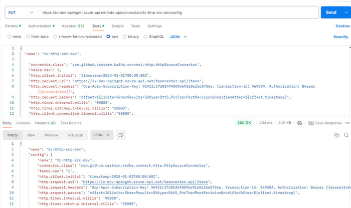
|  |

### 

## Delete Connector

By calling the DELETE CONNECTOR API, a connector can be deleted.

| PROTOCOL | HTTP |
| --- | --- |
| DEV ENDPOINT |  |
| QA ENDPOINT |  |
| METHOD | DELETE |
| CONTENT TYPE | application / json |
| Parameter | Value |
| Ocp-Apim-Subscription-Key | 969ffc37d81444809de9xxxxx5d5756e |
| transaction-id | 1234 |
| Authorization | Bearer \{token\} 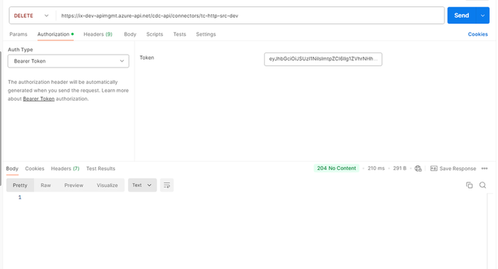
|  |

## 

# Result 

| HTTP Code | Result Description |
| --- | --- |
| 200 | OK: The request has succeeded |
| 201 | Created: Connector is created successfully |
| 204 | No Content: deleted connector successfully |

## Error Details

| HTTP Code | Error Error Description |
| --- | --- |
| 400 | Bad Request Server does not understand the request due to invalid syntax |
| 401 | Unauthorized User Authentication required |
| 403 | Forbidden Does not have permission to access |
| 404 | Not Found Server could not find the requested resource |
| 500 | Internal Server Error Server encountered an unexpected condition |
