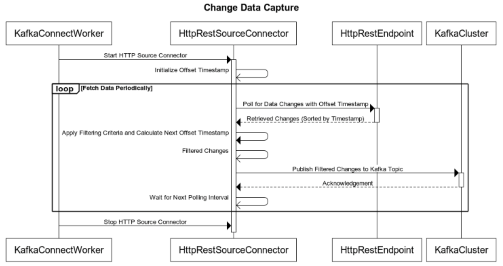
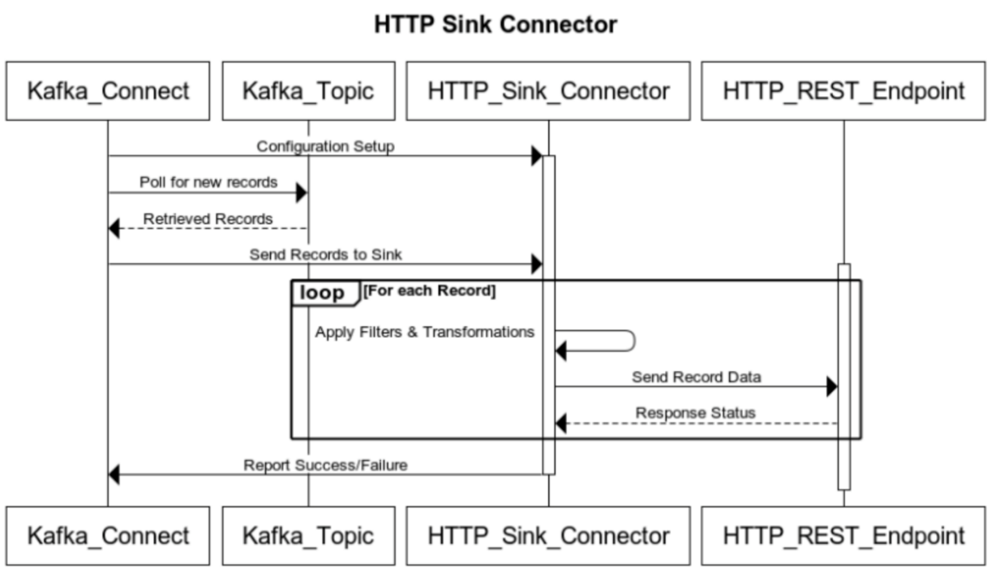
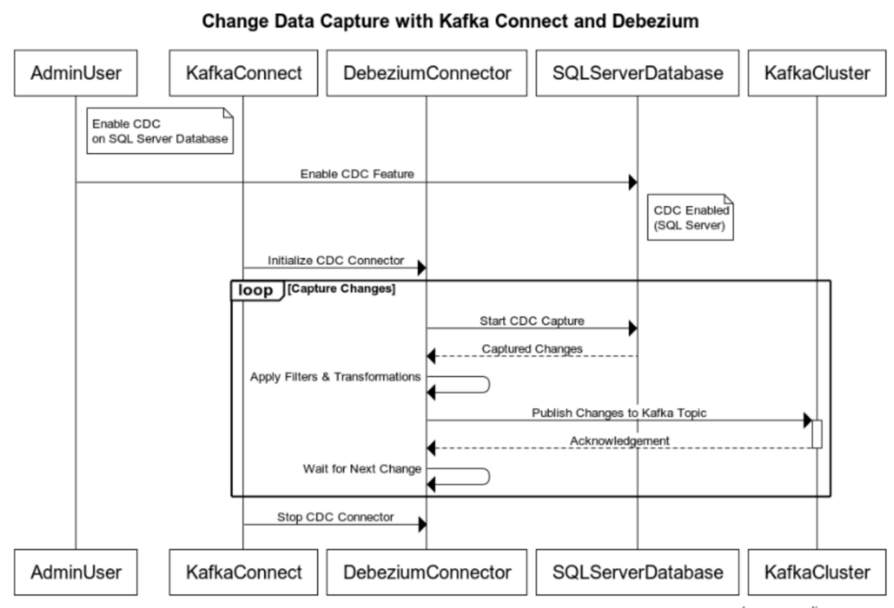

Digital Thread Foundations

Kafka Connectors for CDC

CONFIGURATION GUIDE

Release Version: 1.2

## Introduction

A digital thread refers to the continuous and consistent flow of information throughout the entire lifecycle of a product or system -- from design and development to operation and maintenance. It enables the integration of data from different stages and sources, allowing effective traceability, seamless collaboration, and efficient decision-making by unleashing the power of sleeping data. The digital thread is considered a key aspect of Industry 4.0 and the digital transformation of the manufacturing industry. It is the core of what we call the Enterprise Operating System (EOS). Digital Thread is a communication framework that helps integrate various enterprise systems involved in the engineering and manufacturing product life cycle.

### Purpose

This document describes the design and implementation of connecting an HTTP REST source to Kafka Connect for data ingestion into Azure Event Hub.

### Target Audience

Software architects, developers, and integrators with IT backgrounds.

### Prerequisites

-   Apache Kafka and Kafka Connect must be installed and configured.

-   For Debezium, the SQL server database must be set up with CDC enabled.

### Related Links

-   [IX Digital Thread Foundations Documentation](https://industryxdevhub.accenture.com/asset-home;search_text=IX%20Digital%20Thread)

-   [HTTP Source Connector](https://github.com/castorm/kafka-connect-http)

-   [HTTP Sink Connector](https://github.com/university-of-auckland/kafka-http-sink-connector)

-   [Debezium Official Documentation](https://debezium.io/documentation/reference/stable/connectors/sqlserver.html)

### Business Contacts

-   [florian.tournier@accenture.com](mailto:florian.tournier@accenture.com)

-   [laura.mosconi@accenture.com](mailto:laura.mosconi@accenture.com)

-   [karthik.ramachandra@accenture.com](mailto:karthik.ramachandra@accenture.com)

### Technical Contacts

-   [laura.mosconi@accenture.com](mailto:laura.mosconi@accenture.com)

-   [stefano.giacco@accenture.com](mailto:stefano.giacco@accenture.com)

## 

# Background

Kafka Connect is a framework for connecting Kafka with external systems such as databases, key-value stores, search indexes, and file systems, using *Connectors*. Kafka Connectors help import data from external systems into Kafka topics and export data from Kafka topics into external systems. The framework\'s existing connectors are used in the implementation of common data sources and sinks, as well as in the implementation of DT\'s connectors. There are two major types of connectors:

A **source connector** collects data from a system. Source systems can be entire databases, stream tables, or message brokers. A source connector can also collect metrics from application servers into Kafka topics, making the data available for stream processing with low latency.

A **sink connector** delivers data from Kafka topics into other systems, which might be indexed such as Elasticsearch, batch systems such as Hadoop, or any kind of database.

In Kafka Connect, various types of connectors fall under the above-mentioned categories and serve different purposes in data integration. Below are the types of connectors that are used in in IX Thread:

| **Connector** | **Description** |
| --- | --- |
| HTTP Source Connector | An HTTP Source Connector reads data from an HTTP endpoint (REST API) and streams it into Kafka topics. It periodically polls the specified HTTP endpoint to retrieve data and publishes that data as messages in Kafka. |
| HTTP Sink Connector | An HTTP Sink Connector writes data from Kafka topics to an HTTP endpoint (REST API). It takes messages from Kafka topics and sends them to a configured HTTP endpoint. |
| Debezium Connector | Debezium connectors are used for change data capture (CDC) from database systems. Debezium captures the changes (inserts, updates, deletes) that occur in a database and streams them as events into Kafka topics. This allows the user to react to database changes in real time. Each connector type serves a distinct purpose in integrating data between systems/applications and Kafka. They might have different configurations, capabilities, and requirements based on their use case. |

## 

# Connector Setup

To set up a Connector on Kafka Connect for IX Thread, follow these general steps:

### Prerequisites

-   Kafka and Kafka Connect are installed and working.

-   Plugins have been implemented if needed. Examples include:

    -   HTTP Source

    -   HTTP Sink

    -   Debezium

-   Connector JAR files must exist in the appropriate directory (plugin.path) where Kafka Connect can discover them.

### Configuration and Installation

Each connector has specific configuration requirements and serves different data integration purposes within the Kafka ecosystem.

###### HTTP Source Connector Configuration

Create a configuration file (JSON or properties format) for the HTTP Source Connector. Specify settings such as the HTTP endpoint URL, polling frequency, topic name, and any necessary authentication details.**HTTP Sink Connector Configuration**

Create a configuration file for the HTTP Sink Connector, detailing settings like the target HTTP endpoint URL, topic name, and possibly authentication details.

###### Debezium Connector Configuration

Create a configuration file for the Debezium Connector, specifying the database connection details, capture settings, Kafka topics, and any transformations required.

These configurations are described in detail later in the document.

### Starting Kafka

1.  Navigate to the Kafka Installation Directory.

2.  Start Kafka Connect using the connect-distributed.sh script.

> Command: ./bin/connect-distributed.sh config/connect-distributed.properties

### Verify Kafka Status

1.  Check the status of Kafka running successfully.

    a.  Example:curl [link](http://localhost:8083)

    b.  Output:\{\"version\":\"3.6.0\",\"commit\":\"60e845626d8a465a\",\"kafka_cluster_id\":\"ix-dev-eventhub.servicebus.windows.net\"\}

### Configuration Updates

When something changes in a connector, such as passwords or event hub parameters, the configuration of that connector must be updated without disrupting the data flow. The following steps may be used as a general guideline to connector changes in Kafka to ensure a smooth transition without any disruptions.

1.  Safely stop the Kafka connector to prevent any disruptions in data processing or potential errors during the update.

2.  Update Connector Configuration as follows:

    a.  Locate the configuration file associated with the Kafka connector (e.g., properties or JSON file).

    b.  Find the parameter that holds the changes and update it (e.g., password, depending on the connector).

3.  Restart the Kafka connector using the appropriate command or script, ensuring that the connector picks up the modified configuration and establishes connections using the new password.

4.  Using one of the following methods, verify that the connector restarts successfully and establishes connections using the updated changes.

    a.  connector logs

    b.  Kafka Connect REST API

    c.  Command-line tools

5.  During the change process, ensure that data consistency is maintained, and no messages are lost or duplicated in the Kafka topics.

6.  Before implementing changes in a production environment, test the password update process in a non-production environment.

It is important to handle connector changes carefully to prevent service disruption. Please refer to the specific documentation (from [Related Links](#related-links)) of the Kafka connector you are using for detailed instructions on handling changes, as the process may vary based on the connector type and version.

## 

# CDC Support Requirements

### Source

To support the CDC, the source connector must:

-   Extract the last unique offset/timestamp from the HTTP response.

-   Keep track of what was the last unique offset/timestamp delivered to Kafka.

-   Feed the last delivered unique offset/timestamp into the next HTTP request.

### Sink

To support CDC, the sink connector must:

-   Extract the data from the EventHub

-   Call the configured HTTP REST Endpoint with the data.

-   Check the response to determine if the transfer of data is successful or not.

### OSS Packages

The current selections for HTTP source and sink connectors are based on the OSS principle in which compatible open-source http source/sink connectors are used from maven or any other OSS and built upon the other requirements.

**HTTP Source Connector**

-   Apache 2.0 license

**HTTP Sink Connector**

-   MIT License

Note that the open-source connectors were chosen for this POC because the alternate fully managed Kafka Connect connectors for HTTP source and sink require commercial licensing.

## 

# HTTP REST Source Connector

### Architecture

The integration involves the following components:

-   **HTTP REST Source:** The external system exposing RESTful APIs from which data needs to be fetched.

-   **Kafka Connect:** The framework for connecting external systems to Kafka using connectors.

-   **Kafka Cluster:** The cluster where Kafka brokers are running and are responsible for storing the ingested data.

-   **Kafka Connect Worker(s):** The instances running Kafka Connect connectors are responsible for managing the data transfer between the HTTP REST source and Kafka.

### Workflow

The workflow involves preparation, configuration, error handling, and monitoring.

1.  **Preparation** **--** Use the following example to define the Kafka Connect worker properties including bootstrap servers, converters, and connector configurations.

> File: connect-distributed.properties
>
> \# A list of host/port pairs to use for establishing the initial connection to the Kafka cluster.
>
> bootstrap.servers=digitalthread-datapipeline.servicebus.windows.net:9093
>
> key.converter=org.apache.kafka.connect.json.JsonConverter
>
> value.converter=org.apache.kafka.connect.json.JsonConverter
>
> plugin.path= /ix_thread/cdc/kafka-http-sink-connector/target/ ...
>
> \# required EH Kafka security settings
>
> security.protocol=SASL_SSL
>
> sasl.mechanism=PLAIN
>
> sasl.jaas.config=org.apache.kafka.common.security.plain.PlainLoginModule required username=\"\$ConnectionString\" password=\"Endpoint=sb://digitalthread-datapipeline.servicebus.windows.net/;SharedAccessKeyName=RootManageSharedAccessKey;SharedAccessKey=K9B6o8/CH6e7/SLfktPlNj752VYq2aaBQ+AEhA6ph+A=\";
>
> producer.security.protocol=SASL_SSL
>
> producer.sasl.mechanism=PLAIN
>
> producer.sasl.jaas.config=org.apache.kafka.common.security.plain.PlainLoginModule required username=\"\$ConnectionString\" password=\"Endpoint=sb://digitalthread datapipeline.servicebus.windows.net/;SharedAccessKeyName=RootManageSharedAccessKey;SharedAccessKey=K9B6o8/CH6e7/SLfktPlNj752VYq2aaBQ+AEhA6ph+A=\";
>
> consumer.security.protocol=SASL_SSL
>
> consumer.sasl.mechanism=PLAIN
>
> consumer.sasl.jaas.config=org.apache.kafka.common.security.plain.PlainLoginModule required username=\"\$ConnectionString\" password=\"Endpoint=sb://digitalthread-datapipeline.servicebus.windows.net/;SharedAccessKeyName=RootManageSharedAccessKey;SharedAccessKey=K9B6o8/CH6e7/SLfktPlNj752VYq2aaBQ+AEhA6ph+A=\";

2.  **Connector Configuration**

    -   Choose and configure the Castorm Kafka Connect HTTP REST connector. Castorm is an OSS package for the HTTP source connector. URL: 

    -   Define connector-specific settings such as polling intervals, HTTP methods (GET, POST, etc.), headers, and data transformation.

> curl \--location \--request POST \'http://localhost:8083/connectors/\' \\
>
> \--header \'Content-Type: application/json\' \\
>
> \--data-raw \'\{
>
> \"name\": \"tc-rest-src\",
>
> \"config\": \{
>
> \"connector.class\": \"com.github.castorm.kafka.connect.http.HttpSourceConnector\",
>
> \"tasks.max\": 1,
>
> \"http.offset.initial\": \"timestamp=2023-10-10T00:07:00Z\",
>
> \"http.request.url\": \"http://127.0.0.1:5000/get_response\",
>
> \"http.request.headers\": \"Accept: application/json\",
>
> \"http.request.params\": \"modifiedafter=\$\{offset.timestamp\}\",
>
> \"http.timer.interval.millis\": \"30000\",
>
> \"http.timer.catchup.interval.millis\": \"10000\",
>
> \"http.response.list.pointer\": \"/dataInstances/0/instances\",
>
> \"http.response.record.offset.pointer\": \"key=/item_id, timestamp=/last_mod_date\",
>
> \"http.record.filter.factory\" : \"com.github.castorm.kafka.connect.http.record.OffsetFieldRecordFilterFactory\",
>
> \"key.converter.schemas.enable\": \"false\",
>
> \"key.converter\": \"org.apache.kafka.connect.storage.StringConverter\",
>
> \"value.converter.schemas.enable\": \"false\",
>
> \"value.converter\": \"org.apache.kafka.connect.storage.StringConverter\",
>
> \"ixthread.exclude.field\": \"object_string\",
>
> \"ixthread.condition.equals\" : \"dtt5_color=\'\\\'\'White\'\\\'\'\",
>
> \"kafka.topic\": \"tc-items\",
>
> \"transforms\": \"ExtractKey,ExtractValue\",
>
> \"transforms.ExtractKey.type\": \"org.apache.kafka.connect.transforms.ExtractField\$Key\",
>
> \"transforms.ExtractKey.field\": \"key\",
>
> \"transforms.ExtractValue.type\": \"org.apache.kafka.connect.transforms.ExtractField\$Value\",
>
> \"transforms.ExtractValue.field\": \"value\"
>
> \}
>
> \}\'

3.  **Verify Connector Status**

-   Use the Kafka Connect REST API or command-line tools to inspect the status, configurations, and tasks of the running connectors:

> Get list of connectors: curl -X GET 
>
> Get Connector Status: curl -X GET [http://localhost:8083/connectors/\{connectorName\}/status](http://localhost:8083/connectors/%7bconnectorName%7d/status)

4.  **Data Ingestion Process**

-   Kafka Connect periodically polls the HTTP REST endpoint based on the defined configuration.

-   Retrieved data from the REST source is converted and published as Kafka messages into specified Kafka topics.

5.  **Error Handling and Monitoring**

-   Implement error-handling mechanisms to manage failures during data ingestion.

-   Monitor Kafka Connect logs for any errors or issues related to the connector.

### Sequence

The following diagram illustrates the incorporation of timestamp-based offset initialization, sorting of retrieved changes, and subsequent offset calculation within the CDC workflow using an HTTP Source Connector.

-   The sequence starts when the Kafka Connect worker initiates the HTTP Source Connector to start the change data capture (CDC) process.

-   The HTTP Source Connector is activated and enters a loop for periodic data fetching.

-   With each iteration, the connector polls the HTTP REST endpoint to retrieve any changes since the last poll based on the timestamp.

-   After fetching data from the HTTP REST endpoint, the connector receives changes sorted by timestamp. The response is sorted based on the timestamp, the latest being the first item.

-   The connector then applies filtering criteria and calculates the next offset timestamp based on the retrieved data to determine the starting point for the next API call.

-   Filtered changes are sorted and calculated with the next offset and then published to the Kafka topic within the Kafka cluster.

-   The connector waits for the next polling interval before initiating the next data fetch cycle.

-   Subsequent steps involve acknowledging successful publication and waiting for the next polling interval.

-   Finally, the Kafka Connect worker stops the HTTP Source Connector.

> 
## 

# HTTP REST Sink Connector

### Architecture

The integration involves the following components:

1.  **Kafka Connect Framework**

    a.  Serves as the backbone for connectors within the Kafka ecosystem.

    b.  Manages the configuration, execution, and coordination of connectors.

2.  **HTTP REST Sink Connector**

    a.  Acts as a bridge between Kafka topics and an external HTTP REST endpoint.

    b.  Handles the configuration to write data from Kafka topics to the specified HTTP RESTful service.

3.  **Data Transformation (Optional)**

    a.  Provides optional facilities for transforming data before sending it to the REST endpoint.

    b.  Allows modification, filtering, or enrichment of Kafka records to match the expected format of the REST API.

4.  **HTTP REST Endpoint**

    a.  Represents the target RESTful service or API where the data from Kafka topics is sent.

    b.  Includes HTTP methods (POST, PUT, etc.), endpoints, authentication mechanisms, and required headers.

### Workflow

1.  **Connector Configuration:**

    a.  Choose and configure the Kafka Connect HTTP REST Sink connector.

    b.  Define connector-specific settings like polling intervals, HTTP methods (GET, POST, etc.), headers, and data transformation.

> curl \--location \--request POST \'http://localhost:8083/connectors\' \\
>
> \--header \'Content-Type: application/json\' \\
>
> \--data-raw \'\{
>
> \"name\": \"http-sink-test\",
>
> \"config\":\{
>
> \"connector.class\": \"nz.ac.auckland.kafka.http.sink.HttpSinkConnector\",
>
> \"tasks.max\": 1,
>
> \"callback.request.url\": \"http://localhost:8081/postData\",
>
> \"topics\": \"tc-items\",
>
> \"value.converter\": \"org.apache.kafka.connect.storage.StringConverter\",
>
> \"value.converter.schemas.enable\": \"false\",
>
> \"key.converter\": \"org.apache.kafka.connect.storage.StringConverter\",
>
> \"header.converter\": \"org.apache.kafka.connect.storage.StringConverter\",
>
> \"callback.request.method\": \"POST\",
>
> \"callback.request.headers\": \"Content-Type:application/json\",
>
> \"retry.backoff.sec\": 560120300600,
>
> \"exception.strategy\": \"PROGRESS_BACK_OFF_DROP_MESSAGE\",
>
> \"ixthread.exclude.field\": \"dtt5_color,last_mod_date\"
>
> \}
>
> \}\'

2.  

3.  **Verify Connector Status**

    a.  Use the Kafka Connect REST API or command-line tools to inspect the status, configurations, and tasks of the running connectors.

    b.  Example:

        i.  Get list of connectors: curl -X GET 

        ii. Get Connector Status: curl -X GET [http://localhost:8083/connectors/\{connectorName\}/status](http://localhost:8083/connectors/%7bconnectorName%7d/status)

4.  **Data Sending Process:**

    a.  The connector establishes and manages connections to the REST API endpoint.

    b.  It crafts HTTP requests using the Kafka topic records and transmits them to the REST API endpoint, managing data transmission and error handling.

5.  **Error Handling and Monitoring:**

    a.  Implement error-handling mechanisms to manage failures during data ingestion.

    b.  Monitor Kafka Connect logs for any errors or issues related to the connector.

### Sequence

The sequence diagram for the HTTP REST Sink connector is as follows. It illustrates the transfer of data from the configured Event Hub to the configured REST endpoint.

-   Kafka Connect initializes and configures the HTTP REST Sink Connector with necessary properties, including the HTTP endpoint URL and other settings.

-   Kafka Connect initiates data polling from the Kafka Topic that the HTTP REST Sink Connector is configured to monitor.

-   Kafka Topic responds by providing the retrieved records to the HTTP REST Sink Connector.

-   These records may contain messages or data to be sent to the external HTTP REST endpoint.

-   The HTTP REST Sink Connector establishes connections with the specified HTTP REST Endpoint.

-   For each retrieved record, the connector transforms, filters, and formats the data according to the REST API\'s requirements and sends an HTTP request (e.g., POST) to the endpoint.

-   The REST API processes the incoming HTTP requests and returns responses to the HTTP REST Sink Connector.

-   These responses signify the success or failure of data transmission.

-   The HTTP REST Sink Connector might handle response codes or errors received from the REST API.

-   It reports back the success or failure of the HTTP calls to Kafka Connect or may perform logging/audit activities.

## 

# Debezium - CDC

Change Data Capture (CDC) is a mechanism for tracking and capturing database changes in real time. Debezium is an open-source CDC platform and plays a pivotal role in streaming these changes.

Debezium architecture is built on Kafka Connect and simplifies the process of capturing and delivering change events from various databases (SQL Server) to message brokers like Apache Kafka. The setup process involves configuring the Debezium SQL Server Connector by initializing connections, specifying schemas, and tables for inclusion/exclusion, and implementing filters to select desired data changes.

Debezium leverages snapshot and log-based capture mechanisms connect to SQL Server\'s transaction logs, captures change events, and streams them to Kafka topics.

### Workflow

1.  **Preparation** **--** Define the Kafka Connect worker properties including bootstrap servers, converters, and connector configurations. The following example shows Azure Event hub properties being collected from the Azure portal.

> File: connect-distributed.properties
>
> \# A list of host/port pairs to use for establishing the initial connection to the Kafka cluster.
>
> bootstrap.servers=digitalthread-datapipeline.servicebus.windows.net:9093
>
> key.converter=org.apache.kafka.connect.json.JsonConverter
>
> value.converter=org.apache.kafka.connect.json.JsonConverter
>
> plugin.path= /ix_thread/cdc/kafka-http-sink-connector/target/ ...
>
> \# required EH Kafka security settings
>
> security.protocol=SASL_SSL
>
> sasl.mechanism=PLAIN
>
> sasl.jaas.config=org.apache.kafka.common.security.plain.PlainLoginModule required username=\"\$ConnectionString\" password=\"Endpoint=sb://digitalthread-datapipeline.servicebus.windows.net/;SharedAccessKeyName=RootManageSharedAccessKey;SharedAccessKey=K9B6o8/CH6e7/SLfktPlNj752VYq2aaBQ+AEhA6ph+A=\";
>
> producer.security.protocol=SASL_SSL
>
> producer.sasl.mechanism=PLAIN
>
> producer.sasl.jaas.config=org.apache.kafka.common.security.plain.PlainLoginModule required username=\"\$ConnectionString\" password=\"Endpoint=sb://digitalthread datapipeline.servicebus.windows.net/;SharedAccessKeyName=RootManageSharedAccessKey;SharedAccessKey=K9B6o8/CH6e7/SLfktPlNj752VYq2aaBQ+AEhA6ph+A=\";
>
> consumer.security.protocol=SASL_SSL
>
> consumer.sasl.mechanism=PLAIN
>
> consumer.sasl.jaas.config=org.apache.kafka.common.security.plain.PlainLoginModule required username=\"\$ConnectionString\" password=\"Endpoint=sb://digitalthread-datapipeline.servicebus.windows.net/;SharedAccessKeyName=RootManageSharedAccessKey;SharedAccessKey=K9B6o8/CH6e7/SLfktPlNj752VYq2aaBQ+AEhA6ph+A=\";

2.  **Database Setup and Permissions --** Configure the source database where change data capture will occur. Ensure the database user account used by Debezium has appropriate permissions to read the necessary data from the database\'s transaction logs or replication stream. For example, when using Debezium with SQL Server, ensure that Change Data Capture (CDC) is properly set up on the SQL Server database you intend to capture changes from. CDC is a feature within SQL Server that tracks changes made to user tables, making it possible to capture and replicate those changes through Debezium.

3.  

4.  **Connector Configuration** -- As shown in the example:

    a.  Configure the Debezium connector.

    b.  Define connector-specific settings like database name, table intervals, HTTP methods (GET, POST, etc.), headers, and data transformation.

> curl \--location \--request POST \'http://localhost:8083/connectors/\' \\
>
> \--header \'Content-Type: application/json\' \\
>
> \--data-raw \' \{
>
> \{
>
> \"name\": \"avevames\",
>
> \"config\": \{
>
> \"connector.class\": \"io.debezium.connector.sqlserver.SqlServerConnector\",
>
> \"tasks.max\": \"1\",
>
> \"database.hostname\": \"teamcenter-digitalthread.database.windows.net\",
>
> \"database.port\": \"1433\",
>
> \"database.dbname\": \"MESDB\",
>
> \"database.server.name\": \"mes\",
>
> \"database.user\": \"ix_azsqladmin_admin\",
>
> \"database.password\": \"\*\*\*\*\*\*\*\*\*\*\*\*\*\*\*\*\",
>
> \"database.names\": \"MESDB\",
>
> \"database.encrypt\": true,
>
> \"database.trustServerCertificate\": true,
>
> \"topic.prefix\": \"avevames\",
>
> \"table.include.list\": \"dbo.util_history\",
>
> \"column.include.list\": \"dbo.util_history.reas_cd,dbo.util_history.ent_id,dbo.util_history.event_time_utc,dbo.util_history.category1,dbo.util_history.raw_reas_cd\",
>
> \"driver.trustServerCertificate\": true,
>
> \"schema.include.list\":\"dbo\",
>
> \"schema.history.internal.kafka.bootstrap.servers\": \"digitalthread-datapipeline.servicebus.windows.net:9093\",
>
> \"schema.history.internal.kafka.topic\": \"history.avevames\",
>
> \"schema.history.internal.consumer.security.protocol\": \"SASL_SSL\",
>
> \"schema.history.internal.store.only.captured.tables.ddl\": true,
>
> \"schema.history.internal.consumer.sasl.mechanism\": \"PLAIN\",
>
> \"schema.history.internal.consumer.sasl.jaas.config\": \"org.apache.kafka.common.security.plain.PlainLoginModule required username=\\\"\$ConnectionString\\\" password=\\\"Endpoint=sb://digitalthread-datapipeline.servicebus.windows.net/;SharedAccessKeyName=RootManageSharedAccessKey;SharedAccessKey=K9B6o8/CH6e7/SLfktPlNj752VYq2aaBQ+AEhA6ph+A=\\\";\",
>
> \"schema.history.internal.producer.security.protocol\": \"SASL_SSL\",
>
> \"schema.history.internal.producer.sasl.mechanism\": \"PLAIN\",
>
> \"schema.history.internal.producer.sasl.jaas.config\": \"org.apache.kafka.common.security.plain.PlainLoginModule required username=\\\"\$ConnectionString\\\" password=\\\"Endpoint=sb://digitalthread-datapipeline.servicebus.windows.net/;SharedAccessKeyName=RootManageSharedAccessKey;SharedAccessKey=K9B6o8/CH6e7/SLfktPlNj752VYq2aaBQ+AEhA6ph+A=\\\";\",
>
> \"skip.messages.without.change\":true,
>
> \"key.converter\":\"org.apache.kafka.connect.json.JsonConverter\",
>
> \"value.converter\":\"org.apache.kafka.connect.json.JsonConverter\",
>
> \"key.converter.schemas.enable\":false,
>
> \"value.converter.schemas.enable\":false,
>
> \"max.batch.size\": \"5000\",
>
> \"request.timeout.ms.config\": \"60000\",
>
> \"transforms\": \"filter\",
>
> \"transforms.filter.type\": \"io.debezium.transforms.Filter\",
>
> \"transforms.filter.language\":\"jsr223.groovy\",
>
> \"transforms.filter.condition\": \"after.reas_cd == 69\"
>
> \}
>
> \}
>
> \'

5.  

6.  **Verify Connector Status**

> Use the Kafka Connect REST API or command-line tools to inspect the status, configurations, and tasks of the running connectors.:
>
> Get list of connectors: curl -X GET 
>
> Get Connector Status: curl -X GET [http://localhost:8083/connectors/\{connectorName\}/status](http://localhost:8083/connectors/%7bconnectorName%7d/status)

7.  **Data Ingestion Process**:

> Debezium listens to the transaction logs of the SQL server, retrieves the change events, and publishes them into specified Kafka topics.

8.  **Error Handling and Monitoring:**

    a.  Implement error-handling mechanisms to manage failures during data ingestion.

    b.  Monitor Kafka Connect logs for any errors or issues related to the connector.

### Sequence Diagram

This sequence diagram shows the interaction between Kafka Connect and Debezium in the CDC process. Kafka Connect initiates and stops the CDC connector provided by Debezium, allowing it to capture changes from the SQL Server database and publish them to Kafka for further processing. Adjust the configurations and interactions based on your specific use case and requirements.

-   Enable CDC Feature: An administrator or user with appropriate privileges enables the CDC feature in the SQL Server database.

-   CDC Enabled (SQL Server): The SQL Server database now has CDC enabled, allowing it to track and capture changes in data.

-   Configuration Setup: Both Kafka Connect and Debezium are configured separately for their respective roles in the CDC process.

-   Initialize CDC Connector: Kafka Connect initializes the CDC connector by communicating with Debezium.

-   Capture Changes: Debezium starts capturing changes from the SQL Server database based on Kafka Connect initialization.

-   Apply Filters &amp; Transformations: Debezium applies filters and transformations to the captured changes.

-   Publish to Kafka: Transformed changes are published to a Kafka topic within the Kafka cluster.

-   Acknowledgment: Debezium receives an acknowledgment from Kafka upon successful publication.

-   Stop CDC Connector: Kafka Connect instructs Debezium to stop the CDC connector.

