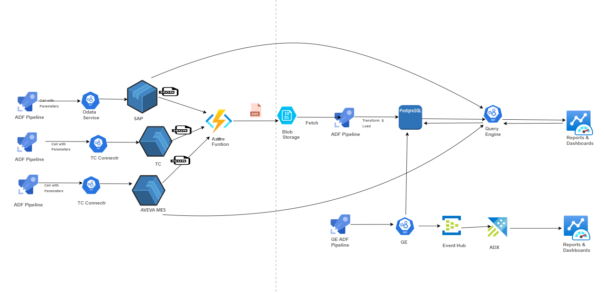

Digital Thread Foundations

DATA CATALOG

API REFERENCE

Release Version: 1.2

| **Field** | **Value** |
| --- | --- |
| **Asset / Solution Name** | Digital Thread |
| **Domain / Area** | Engineering |
| **Owner (Team/Person)** | Karthik Ramachandra |
| **Reviewers** | Karthik Ramachandra |
| **Status** | Approved / Complete |
| **Confidentiality** | Internal / Confidential |
| **Source of Truth** | [link](https://dev.azure.com/IXAssets/IXAssetsProject/\_git/ixassets) |
| **Related Assets / Alternatives** | AOT / Engineering Orchestration / Engineering Agents |

## Introduction

A digital thread refers to the continuous and consistent flow of information throughout the entire lifecycle of a product or system - from design and development to operation and maintenance. It enables the integration of data from different stages and sources, allowing effective traceability, seamless collaboration, and efficient decision-making by unleashing the power of sleeping data. The digital thread is considered a key aspect of Industry 4.0 and the digital transformation of the manufacturing industry. It is the core of what we call the Enterprise Operating System (EOS). Digital Thread is a communication framework that helps integrate various enterprise systems involved in the engineering and manufacturing product life cycle.

A data catalog is a centralized repository that organizes and stores metadata about an organization\'s data assets, making it easier for users to discover, understand, and utilize data effectively. It provides detailed descriptions, including data source, structure, lineage, and usage information, ensuring a comprehensive view of the data landscape. By enabling robust search and discovery capabilities, a data catalog enhances productivity and decision-making, allowing users to quickly find relevant data for analysis and reporting. It also supports data governance by managing access controls and ensuring compliance with regulatory standards. Additionally, a data catalog promotes collaboration by allowing users to annotate, rate, and discuss data assets, fostering a data-driven culture within the organization. Overall, it streamlines data management, improves data quality, and maximizes the value derived from data assets.

### Purpose

This document serves as an API reference for IX Digital Thread\'s Data Catalog application.

### Target Audience

Developers, Business Analysts, and Accenture teams deploying the Data Catalog application.

### Prerequisites

-   Readers must be familiar with Azure Purview Catalog.

-   Query engine development environment must be set up.

-   Access to the query engine APIs and other connector APIs is required.

### Contacts

-   [karthik.ramachandra@accenture.com](mailto:karthik.ramachandra@accenture.com)

-   [sathish.kumar.sanga@accenture.com](mailto:sathish.kumar.sanga@accenture.com)

-   [d.choukse@accenture.com](mailto:d.choukse@accenture.com)

-   [r.rajendra.revankar@accenture.com](mailto:r.rajendra.revankar@accenture.com)

### Related Links

-   [Data Catalog Documentation](https://industryxdevhub.accenture.com/assetdetails/102)

-   [IX Digital Thread Documentation](https://industryxdevhub.accenture.com/asset-home;search_text=ix%20digital%20thread)

### 

## 

### Technology Stack

#### Tools

-   graphql-mesh/json-schema 0.97.4

-   graphql 16.8.0

-   graphql-mesh/graphql 0.95.0

-   graphql-mesh/transform-filter-schema 0.95.2

-   graphql-mesh/transform-rename 0.95.2

-   graphql-mesh/plugin-prometheus 0.95.11

-   envelop/core 5.0.0

-   envelop/operation-field-permissions 6.0.0

-   graphql-mesh/cli 0.87.1

-   angular - 16.1.0

-   bootstrap - 5.2.0-beta1

-   primeng - 16.9.1

-   graphql - 16.8.1

-   ng2-charts - 5.0.4

-   swimlane/ngx-graph - 8.0.2\'

-   azure/msal-angular - 3.0.9

-   rxjs - 7.8.0

#### Repository

-   Git branch name: dev

-   Git folder path:

> Git -\&gt; Repos -\&gt; ix-thread-components-\&gt; data-catalog -\&gt; ix-data-catalog-ui
>
> Git -\&gt; Repos -\&gt; ix-thread-components-\&gt; data-federation/ix-query-engine-api

-   Git folder links:

> [Query Engine - Repos (azure.com)](https://dev.azure.com/IXDigitalThread/IXThreadComponents/_git/ix-thread-components?path=/data-federation/ix-query-engine-api)
>
> [Data Catalog UI - Repos (azure.com)](https://dev.azure.com/IXDigitalThread/IXThreadComponents/_git/ix-thread-components?path=/data-catalog/ix-data-catalog-ui)

## 

# Data Catalog Architecture 

The data catalog architecture is designed to integrate multiple source systems. It comprises several essential components and processes to manage and utilize data effectively. At its core are diverse data sources such as databases, big data platforms, cloud storage, data lakes, applications, and APIs. The ingestion layer employs ETL/ELT tools and data pipelines to extract data from these sources. Metadata harvesting tools, both automated and manual, collect detailed metadata, including schemas, data types, relationships, and data lineage, which are then stored in a metadata repository. The catalog management layer organizes this metadata with indexing engines, business glossaries, and data lineage trackers, providing a structured and accessible repository. User interface and access layers offer search and discovery tools, data profiling, collaboration features, and visualization aids, enabling users to find, understand, and collaborate on data assets seamlessly. Security and governance layers ensure data is used securely and in compliance with regulatory standards through access controls, audit trails, and compliance management. An integration layer, equipped with APIs and connectors, allows the catalog to interface with other systems and tools within the organization, ensuring seamless data management and utilization. This architecture not only centralizes data management but also enhances data discovery, quality, governance, and collaborative efforts across the organization. The following diagram depicts the components discussed.

## 

# API Specifications

The data catalog UI uses a set of APIs to perform its functions and support its UI. They fetch data from the system via the Query Engine API.

| Type | API |
| --- | --- |
| Dashboard APIs | POST System Count POST Collection Count POST Glossary Count POST Policy Count POST Business Asset Count POST Technical Asset Count POST Onboarded Asset Count |
| Search Bar APIs | POST Asset Suggestion POST Autocomplete |
| Search Screen APIs | POST Search Details |
| Filter APIs | POST Technical Asset Type API POST Business Asset Type API POST Data Source and Assigned Term Option POST Collection API POST Classification API POST Applying or Removing Filters POST Custom Filter Option |
| Business Asset APIs | POST Business Asset Overview Tab Details POST Business/Technical Asset Overview Collection Path Details POST Business/Technical Asset Overview Tab Glossary Terms Details POST Asset Glossary Terms Inner Page Overview Tab Details POST Asset Glossary Terms Inner Page Overview Tab Catalog Assets Count Details POST Asset Glossary Terms Inner Page Related Tab Details POST Business Asset Metadata Tab Details POST Business Asset Related Tab Details POST Business Asset Data Quality Tab Details |
| Technical Asset APIs | POST Technical Asset Overview Tab Details POST Technical Asset Schema Tab Details POST Technical Asset Lineage Tab Details POST Technical Asset Lineage Tab Nodes Details POST Technical Asset Related Tab Details POST Domain |
| BOM View APIs | POST BOM View API details |
### 

## Dashboard APIs

#### POST - System Count

This microservice is a POST call to the Query Engine server hosted at the backend to get details of the system data count.

| PROTOCOL | HTTPS |
| --- | --- |
| PATH (Public Exposure) |  |
| METHOD | POST |
| CONTENT TYPE | application / json |
| Sample JSON Request | Query Parameter: Subscription-key of the application (example, query engine) |
##### Input Header

| Parameter | Description M/O\* Type |
| --- | --- |
| Authorization | Token acquired from Azure B2C based on the user credentials for further API calls. M String |
| Content-Type | Length of content. M String \*Mandatory / Optional |
##### Output Header

| Parameter | Description Type |
| --- | --- |
| Server | Contains information about how the server handles requests \[e.g., Werkzeug/2.1.2 Python/3.9.7\] String |
| Content-Type | Length of the content String |
| Date | Date of operation execution e.g. - \[Tue, 17 May 2022 06:30:16 GMT\] Datetime |
| Content-Length | Length of the content Bytes |
##### Result

| HTTP Code | Result Description |
| --- | --- |
| 200 | Successful Operations |
##### Error Management

| HTTP Code | Error Code Error Description |
| --- | --- |
| 500 | 500 Invalid Data |
| 400 | 400 Unauthorized User or Header Token could be missing |
| 400 | 400 Bad Request |
##### Sample JSON Response

\{

\"data\": \{

\"purviewDashboard\": \{

\"\_AT_search_count\": 815,

\"\_AT_search_facets\": null,

\"\_\_typename\": \"query_purviewDashboard\"

\}

\}

\}

##### 

#### Output Request Body

| Operation name | Query | Variable |
| --- | --- | --- |
| purviewDashboard | query purviewDashboard( | variables\": \{ \"version\": \"2023-10-01-preview\", \"payload\": \{ \"keywords\": null, \"limit\": 1, \"filter\": \{ \"and\": \[ \{ \"attributeName\": \"Generic_System_Attributes.System Technical Name\", \"operator\": \"eq\", \"attributeValue\": \"Siemens Teamcenter\" \}, \{ \"not\": \{ \"classification\": \"MICROSOFT.SYSTEM.TEMP_FILE\" \} \}, \{ \"not\": \{ \"or\": \[ \{ \"entityType\": \"AtlasGlossary\" \} \] \} \}, \{ \"not\": \{ \"or\": \[ \{ \"attributeName\": \"size\", \"operator\": \"eq\", \"attributeValue\": 0 \}, \{ \"attributeName\": \"fileSize\", \"operator\": \"eq\", \"attributeValue\": 0 \} \] \} \} \] \} \} \} |
#### 

### POST - Collection Count

This microservice is a POST call to the Query Engine server hosted at the backend to get details of the collectionID length count.

| PROTOCOL | HTTPS |
| --- | --- |
| PATH (Public Exposure) |  |
| METHOD | POST |
| CONTENT TYPE | application / json |
| Sample JSON Request | Query Parameter: Subscription-key of the application (example, query engine) |
##### Input Header

| Parameter | Description M/O\* Type |
| --- | --- |
| Authorization | Token acquired from Azure B2C based on the user credentials for further API calls. M String |
| Content-Type | Length of content. M String \*Mandatory / Optional |
##### Output Header

| Parameter | Description Type |
| --- | --- |
| Server | Contains information about how the server handles requests \[e.g., Werkzeug/2.1.2 Python/3.9.7\] String |
| Content-Type | Length of the content String |
| Date | Date of operation execution e.g. - \[Tue, 17 May 2022 06:30:16 GMT\] Datetime |
| Content-Length | Length of the content Bytes |
##### Result

| HTTP Code | Result Description |
| --- | --- |
| 200 | successful operation |
##### Error Management

| HTTP Code | Error Code Error Description |
| --- | --- |
| 500 | 500 Invalid Data |
| 400 | 401 Unauthorized User or Header Token could be missing |
| 400 | 400 Bad request |
##### Sample JSON Response

\{

\"data\": \{

\"purviewDashboard\": \{

\"\_AT_search_count\": 8418,

\"\_AT_search_facets\": \{

\"collectionId\": \[

\{

\"count\": 3703,

\"value\": \"ix-dev-purview\"

\},

\{

\"count\": 2851,

\"value\": \"n28vvq\"

\},

\{

\"count\": 446,

\"value\": \"test_collection\"

\},

\{

\"count\": 50,

\"value\": \"tctest\"

\},

\]

\},

\"\_\_typename\": \"query_purviewDashboard\"

\}

\}

\}

##### Output Request Body

| Operation name | Query | Variable |
| --- | --- | --- |
| purviewDashboard | query purviewDashboard( | \"variables\": \{ \"version\": \"2022-08-01-preview\", \"payload\": \{ \"keywords\": null, \"limit\": 1, \"filter\": \{ \"and\": \[ \{ \"not\": \{ \"classification\": \"MICROSOFT.SYSTEM.TEMP_FILE\" \} \}, \{ \"not\": \{ \"or\": \[ \{ \"entityType\": \"AtlasGlossary\" \} \] \} \}, \{ \"not\": \{ \"or\": \[ \{ \"attributeName\": \"size\", \"operator\": \"eq\", \"attributeValue\": 0 \}, \{ \"attributeName\": \"fileSize\", \"operator\": \"eq\", \"attributeValue\": 0 \} \] \} \} \] \}, \"facets\": \[ \{ \"facet\": \"collectionId\", \"count\": 200 \} \] \} \} |
#### 

### POST - Glossary Count

This microservice is a POST call to the Query Engine server hosted at the backend to get details of the collectionID length count.

| PROTOCOL | HTTPS |
| --- | --- |
| PATH (Public Exposure) |  |
| METHOD | POST |
| CONTENT TYPE | application / json |
| Sample JSON Request | Query Parameter: Subscription-key of the application (example, query engine) |
| Sample JSON Response | [Link](https://ts.accenture.com/:t:/r/sites/GlobalDocTemplates/Published%20Documents/IX%20Thread/Linked%20Files/Data%20Catalog/POST_Glossary_Count_JSON_Response.txt) |
##### Input Header

| Parameter | Description M/O\* Type |
| --- | --- |
| Authorization | Token acquired from Azure B2C based on the user credentials for further API calls. M String |
| Content-Type | Length of content. M String \*Mandatory / Optional |
##### Output Header

| Parameter | Description Type |
| --- | --- |
| Server | Contains information about how the server handles requests \[e.g., Werkzeug/2.1.2 Python/3.9.7\] String |
| Content-Type | Length of the content String |
| Date | Date of operation execution e.g. - \[Tue, 17 May 2022 06:30:16 GMT\] Datetime |
| Content-Length | Length of the content Bytes |
##### Result

| HTTP Code | Result Description |
| --- | --- |
| 200 | successful operation |
##### Error Management

| HTTP Code | Error Code Error Description |
| --- | --- |
| 500 | 500 Invalid Data |
| 400 | 401 Unauthorized User or Header Token could be missing |
| 400 | 400 Bad request |
##### 

#### Output Request Body

| Operation name | Query | Variable |
| --- | --- | --- |
| purviewDashboard | query purviewDashboard( | \"variables\": \{ \"version\": \"2022-08-01-preview\", \"payload\": \{ \"keywords\": null, \"facets\": \[ \{ \"facet\": \"glossary\", \"count\": 10, \"sort\": \{ \"count\": \"desc\" \} \} \], \"filter\": \{ \"and\": \[ \{ \"not\": \{ \"glossaryType\": \"AtlasGlossary\" \} \} \] \}, \"limit\": 0 \} \} |
#### 

### POST - Policy Count

This microservice is a POST call to the Query Engine server hosted at the backend to get details of the collectionID length count.

| PROTOCOL | HTTPS |
| --- | --- |
| PATH (Public Exposure) |  |
| METHOD | POST |
| CONTENT TYPE | application / json |
| Sample JSON Request | Query Parameter: Subscription-key of the application (example, query engine) |
##### Input Header

| Parameter | Description M/O\* Type |
| --- | --- |
| Authorization | Token acquired from Azure B2C based on the user credentials for further API calls. M String |
| Content-Type | Length of content. M String \*Mandatory / Optional |
##### Output Header

| Parameter | Description Type |
| --- | --- |
| Server | Contains information about how the server handles requests \[e.g., Werkzeug/2.1.2 Python/3.9.7\] String |
| Content-Type | Length of the content String |
| Date | Date of operation execution e.g. - \[Tue, 17 May 2022 06:30:16 GMT\] Datetime |
| Content-Length | Length of the content Bytes |
##### Result

| HTTP Code | Result Description |
| --- | --- |
| 200 | successful operation |
##### Error Management

| HTTP Code | Error Code Error Description |
| --- | --- |
| 500 | 500 Invalid Data |
| 400 | 401 Unauthorized User or Header Token could be missing |
| 400 | 400 Bad request |
##### Sample JSON Response

\{

\"data\": \{

\"getPolicies\": \{

\"result\": \[

\{

\"id\": \"authz/tc_policies/airbag.rego\",

\"\_\_typename\": \"opa_query_getPolicies_oneOf_0_result_items\"

\}

\],

\"\_\_typename\": \"opa\_\_200Result\"

\}

\}

\}

##### 

#### Output Request Body

| Operation name | Query | Variable |
| --- | --- | --- |
| MyQuery | query MyQuery( | \"variables\": \{ \"ocp_apim_subscription_key\": \"cecf16b8bed7416c881dcc95c1e2d375\", \"pretty\": true \} |
#### 

### POST -Business Asset Count

This microservice is a POST call to the Query Engine server hosted at the backend to get details of technical asset count from AssetType.

| PROTOCOL | HTTPS |
| --- | --- |
| PATH (Public Exposure) |  |
| METHOD | POST |
| CONTENT TYPE | application / json |
| Sample JSON Request | Query Parameter: Subscription-key of the application (example, query engine) |
##### Input Header

| Parameter | Description M/O\* Type |
| --- | --- |
| Authorization | Token acquired from Azure B2C based on the user credentials for further API calls. M String |
| Content-Type | Length of content. M String \*Mandatory / Optional |
##### Output Header

| Parameter | Description Type |
| --- | --- |
| Server | Contains information about how the server handles requests \[e.g., Werkzeug/2.1.2 Python/3.9.7\] String |
| Content-Type | Length of the content String |
| Date | Date of operation execution e.g. - \[Tue, 17 May 2022 06:30:16 GMT\] Datetime |
| Content-Length | Length of the content Bytes |
##### Result

| HTTP Code | Result Description |
| --- | --- |
| 200 | successful operation |
##### Error Management

| HTTP Code | Error Code Error Description |
| --- | --- |
| 500 | 500 Invalid Data |
| 400 | 401 Unauthorized User or Header Token could be missing |
| 400 | 400 Bad request |
##### 

#### Sample JSON Response

\{

\"data\": \{

\"purviewDashboard\": \{

\"\_AT_search_count\": 1620,

\"\_AT_search_facets\": \{

\"assetType\": \[

\{

\"count\": 1620,

\"value\": \"Purview Business\"

\}

\],

\"objectType\": \[

\{

\"count\": 232,

\"value\": \"CHTC_ItemRevision\"

\},

\{

\"count\": 214,

\"value\": \"CHTC_Dtt5_RotatngPartRevision\"

\},

\{

\"count\": 1,

\"value\": \"BST6_vendorContract\"

\}

\]

\},

\"\_\_typename\": \"query_purviewDashboard\"

\}

\}

\}

##### 

#### Output Request Body

| Operation name | Query | Variable |
| --- | --- | --- |
| purviewDashboard | query purviewDashboard( | \"variables\": \{ \"version\": \"2022-08-01-preview\", \"payload\": \{ \"keywords\": null, \"limit\": 25, \"offset\": 0, \"facets\": \[ \{ \"facet\": \"objectType\", \"count\": 300,\"sort\": \{ \"count\": \"desc\" \} \}, \{ \"facet\": \"assetType\", \"count\": 300, \"sort\": \{ \"count\": \"desc\" \} \} \], \"filter\": \{ \"and\": \[ \{ \"assetType\": \"Purview Business\" \}, \{ \"not\": \{ \"objectType\": \"Glossary terms\" \} \}, \{ \"not\": \{ \"classification\": \"MICROSOFT.SYSTEM.TEMP_FILE\"\} \}, \{ \"not\": \{ \"or\": \[ \{ \"entityType\": \"AtlasGlossary\" \}\] \} \}, \{ \"not\": \{ \"or\": \[ \{ \"attributeName\": \"size\", \"operator\": \"eq\", \"attributeValue\": 0 \}, \{ \"attributeName\": \"fileSize\", \"operator\": \"eq\", \"attributeValue\": 0 \} \] \} \} \] \} \} \} |
#### 

### POST - Technical Asset Count

This microservice is a POST call to the Query Engine server hosted at the backend to get details of the Technical asset count.

| PROTOCOL | HTTPS |
| --- | --- |
| PATH (Public Exposure) |  |
| METHOD | POST |
| CONTENT TYPE | application / json |
| Sample JSON Request | Query Parameter: Subscription-key of the application (example, query engine) |
##### Input Header

| Parameter | Description M/O\* Type |
| --- | --- |
| Authorization | Token acquired from Azure B2C based on the user credentials for further API calls. M String |
| Content-Type | Length of content. M String \*Mandatory / Optional |
##### Output Header

| Parameter | Description Type |
| --- | --- |
| Server | Contains information about how the server handles requests \[e.g., Werkzeug/2.1.2 Python/3.9.7\] String |
| Content-Type | Length of the content String |
| Date | Date of operation execution e.g. - \[Tue, 17 May 2022 06:30:16 GMT\] Datetime |
| Content-Length | Length of the content Bytes |
##### Result

| HTTP Code | Result Description |
| --- | --- |
| 200 | successful operation |
##### Error Management

| HTTP Code | Error Code Error Description |
| --- | --- |
| 500 | 500 Invalid Data |
| 400 | 401 Unauthorized User or Header Token could be missing |
| 400 | 400 Bad request |
##### 

#### Sample JSON Response

\{

\"data\": \{

\"purviewDashboard\": \{

\"\_AT_search_count\": 7104,

\"\_AT_search_facets\": \{

\"objectType\": \[

\{

\"count\": 5331,

\"value\": \"Tables\"

\},

\{

\"count\": 1078,

\"value\": \"Files\"

\},

\{

\"count\": 216,

\"value\": \"Data pipelines\"

\},

\{

\"count\": 120,

\"value\": \"Folders\"

\},

\{

\"count\": 61,

\"value\": \"Glossary terms\"

\},

\{

\"count\": 3,

\"value\": \"Stored procedures\"

\}

\]

\},

\"\_\_typename\": \"query_purviewDashboard\"

\}

\}

\}

##### 

#### Output Request Body

| Operation name | Query | Variable |
| --- | --- | --- |
| purviewDashboard | query purviewDashboard( | \"variables\": \{ \"version\": \"2023-10-01-preview\", \"payload\": \{ \"keywords\": null, \"facets\": \[ \{ \"facet\": \"objectType\", \"count\": 100, \"sort\": \{\"count\": \"desc\"\} \} \], \"filter\": \{ \"and\": \[ \{ \"not\": \{ \"assetType\": \"Purview Business\" \} \}, \{ \"not\": \{ \"classification\": \"MICROSOFT.SYSTEM.TEMP_FILE\"\} \}, \{ \"not\": \{ \"or\": \[ \{\"entityType\": \"AtlasGlossary\" \} \] \} \}, \{ \"not\": \{ \"or\": \[ \{ \"attributeName\": \"size\", \"operator\": \"eq\", \"attributeValue\": 0 \}, \{ \"attributeName\": \"fileSize\", \"operator\": \"eq\", \"attributeValue\": 0 \} \] \} \} \] \}, \"limit\": 1 \} \},\}, |
#### 

### POST - Onboarded Asset Count

The POST onboarded asset count is part of the Data Catalog. This microservice is a POST call to the Query Engine server hosted at the backend to get details of the onboarded asset count.

| PROTOCOL | HTTPS |
| --- | --- |
| PATH (Public Exposure) |  |
| METHOD | POST |
| CONTENT TYPE | application / json |
| Sample JSON Request | Query Parameter: Subscription-key of the application (example, query engine) |
##### Input Header

| Parameter | Description M/O\* Type |
| --- | --- |
| Authorization | Token acquired from Azure B2C based on the user credentials for further API calls. M String |
| Content-Type | Length of content. M String \*Mandatory / Optional |
##### Output Header

| Parameter | Description Type |
| --- | --- |
| Server | Contains information about how the server handles requests \[e.g., Werkzeug/2.1.2 Python/3.9.7\] String |
| Content-Type | Length of the content String |
| Date | Date of operation execution e.g. - \[Tue, 17 May 2022 06:30:16 GMT\] Datetime |
| Content-Length | Length of the content Bytes |
##### Result

| HTTP Code | Result Description |
| --- | --- |
| 200 | successful operation |
##### Error Management

| HTTP Code | Error Code Error Description |
| --- | --- |
| 500 | 500 Invalid Data |
| 400 | 401 Unauthorized User or Header Token could be missing |
| 400 | 400 Bad request |
##### 

#### Sample JSON Response

\{

\"data\": \{

\"purviewDashboard\": \{

\"\_AT_search_count\": 8724,

\"\_AT_search_facets\": \{

\"assetType\": \[

\{

\"count\": 2862,

\"value\": \"SQL Server\"

\},

\{

\"count\": 2080,

\"value\": \"SAP ECC\"

\},

\{

\"count\": 218,

\"value\": \"Azure Data Factory\"

\}

\],

\"objectType\": \[

\{

\"count\": 5331,

\"value\": \"Tables\"

\},

\{

\"count\": 216,

\"value\": \"Data pipelines\"

\},

\{

\"count\": 214,

\"value\": \"CHTC_Dtt5_RotatngPartRevision\"

\}

\]

\},

\"\_\_typename\": \"query_purviewDashboard\"

\}

\}

\}

##### 

#### Output Body

| Operation name | Query | Variable |
| --- | --- | --- |
| purviewDashboard | query purviewDashboard( | \"variables\": \{ \"version\": \"2022-08-01-preview\", \"payload\": \{ \"keywords\": null, \"limit\": 25, \"facets\": \[ \{\"facet\": \"objectType\", \"count\": 10, \"sort\": \{\"count\": \"desc\" \} \}, \{ \"facet\": \"assetType\",\"count\": 10, \"sort\": \{ \"count\": \"desc\" \} \} \], \"filter\": \{ \"and\": \[ \{ \"not\":\{\"classification\": \"MICROSOFT.SYSTEM.TEMP_FILE\"\} \}, \{ \"not\": \{ \"or\": \[ \{ \"entityType\": \"AtlasGlossary\" \} \] \} \}, \{ \"not\": \{ \"or\": \[ \{ \"attributeName\": \"size\", \"operator\": \"eq\", \"attributeValue\": 0 \}, \{ \"attributeName\": \"fileSize\", \"operator\": \"eq\", \"attributeValue\": 0 \} \] \} \} \] \} \} \}, |
### 

## Search Bar APIs 

#### POST - Asset Suggestion

The POST Asset suggestion for searching suitable asset wrt entered keyword is part of the Data Catalog. This microservice is a POST call to the Query Engine server hosted at the backend to get details of asset suggestions.

| PROTOCOL | HTTPS |
| --- | --- |
| PATH (Public Exposure) |  |
| METHOD | POST |
| CONTENT TYPE | application / json |
| Sample JSON Request | Query Parameter: Subscription-key of the application (example, query engine) |
| Sample JSON Response | [Link](https://ts.accenture.com/:t:/r/sites/GlobalDocTemplates/Published%20Documents/IX%20Thread/Linked%20Files/Data%20Catalog/POST_Asset_Suggestion_JSON_Response.txt) |
##### Input Header

| Parameter | Description M/O\* Type |
| --- | --- |
| Authorization | Token acquired from Azure B2C based on the user credentials for further API calls. M String |
| Content-Type | Length of content. M String \*Mandatory / Optional |
##### Output Header

| Parameter | Description Type |
| --- | --- |
| Server | Contains information about how the server handles requests \[e.g., Werkzeug/2.1.2 Python/3.9.7\] String |
| Content-Type | Length of the content String |
| Date | Date of operation execution e.g. - \[Tue, 17 May 2022 06:30:16 GMT\] Datetime |
| Content-Length | Length of the content Bytes |
##### Result

| HTTP Code | Result Description |
| --- | --- |
| 200 | successful operation |
##### Error Management

| HTTP Code | Error Code | Error Description |
| --- | --- | --- |
| 500 | 500 | Invalid Data |
| 400 | 401 | Unauthorized User Header Token could be missing |
| 400 | 400 | Bad request |
##### 

#### Output Request Body

| Operation name | Query | Variable |
| --- | --- | --- |
| MyQuery | query MyQuery(\$version: String!, \$payload: queryInput_purviewAssetSuggestion_input_Input) \{\ | \"variables\": \{ \"version\": \"2023-02-01-preview\", \"payload\": \{ \"keywords\": \"Doc\" \} \}, |
#### 

### POST - Autocomplete

This microservice is a POST call to the Query Engine server hosted at the backend to get details of auto-complete suggestions for the entered search keyword.

| PROTOCOL | HTTPS |
| --- | --- |
| PATH (Public Exposure) |  |
| METHOD | POST |
| CONTENT TYPE | application / json |
| Sample JSON Request | Query Parameter: Subscription-key of the application (example, query engine) |
##### Input Header

| Parameter | Description M/O\* Type |
| --- | --- |
| Authorization | Token acquired from Azure B2C based on the user credentials for further API calls. M String |
| Content-Type | Length of content. M String \*Mandatory / Optional |
##### Output Header

| Parameter | Description Type |
| --- | --- |
| Server | Contains information about how the server handles requests \[e.g., Werkzeug/2.1.2 Python/3.9.7\] String |
| Content-Type | Length of the content String |
| Date | Date of operation execution e.g. - \[Tue, 17 May 2022 06:30:16 GMT\] Datetime |
| Content-Length | Length of the content Bytes |
##### Result

| HTTP Code | Result Description |
| --- | --- |
| 200 | successful operation |
##### Error Management

| HTTP Code | Error Code Error Description |
| --- | --- |
| 500 | 500 Invalid Data |
| 400 | 401 Unauthorized User or Header Token could be missing |
| 400 | 400 Bad request |
##### 

#### Sample JSON Response

\{

\"data\": \{

\"purviewAutoComplete\": \{

\"value\": \[

\{

\"queryPlusText\": \"rev\",

\"text\": \"rev\",

\"\_\_typename\": \"query_purviewAutoComplete_value_items\"

\},

\{

\"queryPlusText\": \"rev unique idx\",

\"text\": \"rev unique idx\",

\"\_\_typename\": \"query_purviewAutoComplete_value_items\"

\},

\{

\"queryPlusText\": \"rev object desc\",

\"text\": \"rev object desc\",

\"\_\_typename\": \"query_purviewAutoComplete_value_items\"

\}

\],

\"\_\_typename\": \"query_purviewAutoComplete\"

\}

\}

\}\}

##### Output Request Body

| Operation name | Query | Variable |
| --- | --- | --- |
| MyQuery | query MyQuery(\$version: String!, \$payload: queryInput_purviewAutoComplete_input_Input) \{\ | \"variables\": \{ \"version\": \"2023-02-01-preview\", \"payload\": \{ \"keywords\": \"rev\" \} \}, |
### 

## Search Screen APIs 

#### POST - Search Details

The POST Asset suggestion is used for searching the suitable assets as per the entered keyword in the search bar. It is a POST call to the Query Engine server hosted at the backend to get details of asset suggestions.

| PROTOCOL | HTTPS |
| --- | --- |
| PATH (Public Exposure) |  |
| METHOD | POST |
| CONTENT TYPE | application / json |
| Sample JSON Request | Query Parameter: Subscription-key of the application (example, query engine) |
| Sample JSON Response | [Link](https://ts.accenture.com/:t:/r/sites/GlobalDocTemplates/Published%20Documents/IX%20Thread/Linked%20Files/Data%20Catalog/POST_Search_Details_JSON_Response.txt) |
##### Input Header

| Parameter | Description M/O\* Type |
| --- | --- |
| Authorization | Token acquired from Azure B2C based on the user credentials for further API calls. M String |
| Content-Type | Length of content. M String \*Mandatory / Optional |
##### Output Header

| Parameter | Description Type |
| --- | --- |
| Server | Contains information about how the server handles requests \[e.g., Werkzeug/2.1.2 Python/3.9.7\] String |
| Content-Type | Length of the content String |
| Date | Date of operation execution e.g. - \[Tue, 17 May 2022 06:30:16 GMT\] Datetime |
| Content-Length | Length of the content Bytes |
##### Result

| HTTP Code | Result Description |
| --- | --- |
| 200 | successful operation |
##### Error Management

| HTTP Code | Error Code Error Description |
| --- | --- |
| 500 | 500 Invalid Data |
| 400 | 401 Unauthorized User or Header Token could be missing |
| 400 | 400 Bad request |
##### 

#### Output Request Body

| Operation name | Query | variables |
| --- | --- | --- |
| purviewDashboard | query purviewDashboard(\$version: String!, \$payload: queryInput_purviewDashboard_input_Input) \{\ | \"variables\": \{ \"version\": \"2023-09-01\", \"payload\": \{ \"keywords\": \"doc\", \"limit\": 25, \"offset\": 0, \"facets\": \[ \{facet\":\"collectionId\",\"count\": 1000,\"sort\": \{\"count\": \"desc\"\} \}, \{\"facet\": \"assetType\", \"count\": 50, \"sort\": \{\"count\": \"desc\" \} \}, \{\"facet\": \"termGuid\", \"count\": 50, \"sort\": \{ \"count\": \"desc\" \}\}, \{\"facet\": \"contactId\", \"count\": 50, \"sort\": \{ \"count\": \"desc\"\} \}, \{\"facet\": \"classification\", \"count\": 50,\"sort\": \{\"count\": \"desc\"\} \}, \{\"facet\": \"tag\", \"count\": 20, \"sort\": \{\"count\": \"desc\" \} \} \], \"filter\": \{ \"and\": \[ \{ \"not\":\{\"classification\":MICROSOFT.SYSTEM.TEMP_FILE\" \} \}, \{ \"not\": \{ \"or\": \[ \{ \"entityType\": \"AtlasGlossary\" \}\] \} \}, \{ \"not\": \{ \"or\": \[ \{\"attributeName\":\"size\",\"operator\":\"eq\",\"attributeValue\": 0 \}, \{ \"attributeName\":\"fileSize\",\"operator\":\"eq\", \"attributeValue\": 0 \} \] \} \} \] \} \} \}, |
### 

## Filter APIs

#### POST - Technical Asset Type 

This microservice is a POST call to the Query Engine server hosted at the backend to get the list of technical asset types for the filter option under asset type.

| PROTOCOL | HTTPS |
| --- | --- |
| PATH (Public Exposure) |  |
| METHOD | POST |
| CONTENT TYPE | application / json |
| Sample JSON Request | Query Parameter: Subscription-key of the application (example, query engine) |
##### Input Header

| Parameter | Description M/O\* Type |
| --- | --- |
| Authorization | Token acquired from Azure B2C based on the user credentials for further API calls. M String |
| Content-Type | Length of content. M String \*Mandatory / Optional |
##### Output Header

| Parameter | Description Type |
| --- | --- |
| Server | Contains information about how the server handles requests \[e.g., Werkzeug/2.1.2 Python/3.9.7\] String |
| Content-Type | Length of the content String |
| Date | Date of operation execution e.g. - \[Tue, 17 May 2022 06:30:16 GMT\] Datetime |
| Content-Length | Length of the content Bytes |
##### Result

| HTTP Code | Result Description |
| --- | --- |
| 200 | successful operation |
##### Error Management

| HTTP Code | Error Code Error Description |
| --- | --- |
| 500 | 500 Invalid Data |
| 400 | 401 Unauthorized User or Header Token could be missing |
| 400 | 400 Bad request |
##### 

#### Sample JSON Response

\{

\"data\": \{

\"purviewMetadata\": \[

\{

\"category\": \"ENTITY\",

\"guid\": \"d00f735e-aefd-2d8a-8996-f172650b2c66\",

\"name\": \"Purview_Database\",

\"serviceType\": \"Purview Data\",

\"\_\_typename\": \"query_purviewMetadata_items\"

\},

\{

\"category\": \"ENTITY\",

\"guid\": \"9e8d0137-b19b-017e-0c83-3023b1a5711c\",

\"name\": \"Purview_File\",

\"serviceType\": \"Purview Data\",

\"\_\_typename\": \"query_purviewMetadata_items\"

\]

\]

##### Output Request Body

| Operation name | Query | Variable |
| --- | --- | --- |
| purviewMetadata | Query purviewMetadata(\$api_version:JSON!, \$servicetype: String!, \$type: String!) \{\ | \"variables\": \{ \"api_version\": \"2023-09-01\", \"servicetype\": \"Purview Data\", \"type\": \"ENTITY\" \}, |
#### 

### POST - Business Asset type

This microservice is a POST call to the Query Engine server hosted at the backend to get the list of business asset types for the filter option under asset type.

| PROTOCOL | HTTPS |
| --- | --- |
| PATH (Public Exposure) |  |
| METHOD | POST |
| CONTENT TYPE | application / json |
| Sample JSON Request | Query Parameter: Subscription-key of the application (example, query engine) |
##### Input Header

| Parameter | Description M/O\* Type |
| --- | --- |
| Authorization | Token acquired from Azure B2C based on the user credentials for further API calls. M String |
| Content-Type | Length of content. M String \*Mandatory / Optional |
##### Output Header

| Parameter | Description Type |
| --- | --- |
| Server | Contains information about how the server handles requests \[e.g., Werkzeug/2.1.2 Python/3.9.7\] String |
| Content-Type | Length of the content String |
| Date | Date of operation execution e.g. - \[Tue, 17 May 2022 06:30:16 GMT\] Datetime |
| Content-Length | Length of the content Bytes |
##### Result

| HTTP Code | Result Description |
| --- | --- |
| 200 | successful operation |
##### Error Management

| HTTP Code | Error Code Error Description |
| --- | --- |
| 500 | 500 Invalid Data |
| 400 | 401 Unauthorized User or Header Token could be missing |
| 400 | 400 Bad request |
##### 

#### Sample JSON Response

\{

\"data\": \{

\"purviewMetadata\": \[

\{

\"category\": \"ENTITY\",

\"guid\": \"374de410-e7ca-fd0b-530b-2c346dfc3007\",

\"name\": \"Purview_DataDomain\",

\"serviceType\": \"Purview Business\",

\"\_\_typename\": \"query_purviewMetadata_items\"

\},

\{

\"category\": \"ENTITY\",

\"guid\": \"8b776c71-35e9-f43e-0a23-4b8088be82cd\",

\"name\": \"BTT5_ChangeRequest\",

\"serviceType\": \"Purview Business\",

\"\_\_typename\": \"query_purviewMetadata_items\"

\} \]

\}

\}

##### Output Request Body

| Operation name | Query | Variable |
| --- | --- | --- |
| purviewMetadata | Query purviewMetadata(\$api_version:JSON!, \$servicetype: String!, \$type: String!) \{\ | \"variables\": \{ \"api_version\": \"2023-09-01\", \"servicetype\":\"Purview Business\", \"type\": \"ENTITY\" \}, |
#### 

### POST - Data Source and Assigned Term Option

This API is used for searching suitable assets as per the entered keyword. It is a POST call to the Query Engine server hosted at the backend to get details of the data source type and assigned term per the Search Details API.

| PROTOCOL | HTTPS |
| --- | --- |
| PATH (Public Exposure) |  |
| METHOD | POST |
| CONTENT TYPE | application / json |
| Sample JSON Request | Query Parameter: Subscription-key of the application (example, query engine) |
| Sample JSON Response | [Link](https://ts.accenture.com/:t:/r/sites/GlobalDocTemplates/Published%20Documents/IX%20Thread/Linked%20Files/Data%20Catalog/POST_Data_Source_and_Assigned_Term_Option_JSON_Response.txt) |
##### Input Header

| Parameter | Description M/O\* Type |
| --- | --- |
| Authorization | Token acquired from Azure B2C based on the user credentials for further API calls. M String |
| Content-Type | Length of content. M String \*Mandatory / Optional |
##### Output Header

| Parameter | Description Type |
| --- | --- |
| Server | Contains information about how the server handles requests \[e.g., Werkzeug/2.1.2 Python/3.9.7\] String |
| Content-Type | Length of the content String |
| Date | Date of operation execution e.g. - \[Tue, 17 May 2022 06:30:16 GMT\] Datetime |
| Content-Length | Length of the content Bytes |
##### Result

| HTTP Code | Result Description |
| --- | --- |
| 200 | successful operation |
##### Error Management

| HTTP Code | Error Code Error Description |
| --- | --- |
| 500 | 500 Invalid Data |
| 400 | 401 Unauthorized User or Header Token could be missing |
| 400 | 400 Bad request |
##### 

#### Output Request Body

| Operation name | Query | variables |
| --- | --- | --- |
| urviewDashboard | query purviewDashboard(\$version: String!, \$payload: queryInput_purviewDashboard_input_Input) \{\ | \"variables\": \{ \"version\": \"2023-09-01\", \"payload\": \{ \"keywords\": \"doc\", \"limit\": 25, \"offset\": 0, \"facets\": \[ \{facet\":\"collectionId\",\"count\": 1000,\"sort\": \{\"count\": \"desc\"\} \}, \{\"facet\": \"assetType\", \"count\": 50, \"sort\": \{\"count\": \"desc\" \} \}, \{\"facet\": \"termGuid\", \"count\": 50, \"sort\": \{ \"count\": \"desc\" \}\}, \{\"facet\": \"contactId\", \"count\": 50, \"sort\": \{ \"count\": \"desc\"\} \}, \{\"facet\": \"classification\", \"count\": 50,\"sort\": \{\"count\": \"desc\"\} \}, \{\"facet\": \"tag\", \"count\": 20, \"sort\": \{\"count\": \"desc\" \} \} \], \"filter\": \{ \"and\": \[ \{ \"not\":\{\"classification\":MICROSOFT.SYSTEM.TEMP_FILE\" \} \}, \{ \"not\": \{ \"or\": \[ \{ \"entityType\": \"AtlasGlossary\" \}\] \} \}, \{ \"not\": \{ \"or\": \[ \{\"attributeName\":\"size\",\"operator\":\"eq\",\"attributeValue\": 0 \}, \{ \"attributeName\":\"fileSize\",\"operator\":\"eq\", \"attributeValue\": 0 \} \] \} \} \] \} \} \}, |
#### 

### POST - Collection

This microservice is a POST call to the Query Engine server hosted at the backend to get the list of technical asset types for filter options under asset type.

| PROTOCOL | HTTPS |
| --- | --- |
| PATH (Public Exposure) |  |
| METHOD | POST |
| CONTENT TYPE | application / json |
| Sample JSON Request | Query Parameter: Subscription-key of the application (example, query engine) |
##### Input Header

| Parameter | Description M/O\* Type |
| --- | --- |
| Authorization | Token acquired from Azure B2C based on the user credentials for further API calls. M String |
| Content-Type | Length of content. M String \*Mandatory / Optional |
##### Output Header

| Parameter | Description Type |
| --- | --- |
| Server | Contains information about how the server handles requests \[e.g., Werkzeug/2.1.2 Python/3.9.7\] String |
| Content-Type | Length of the content String |
| Date | Date of operation execution e.g. - \[Tue, 17 May 2022 06:30:16 GMT\] Datetime |
| Content-Length | Length of the content Bytes |
##### Result

| HTTP Code | Result Description |
| --- | --- |
| 200 | successful operation |
##### Error Management

| HTTP Code | Error Code Error Description |
| --- | --- |
| 500 | 500 Invalid Data |
| 400 | 401 Unauthorized User or Header Token could be missing |
| 400 | 400 Bad request |
##### 

#### Sample JSON Response

\{

\"data\": \{

\"purviewEntityDef\": \{

\"classificationDefs\": \[

\{

\"category\": \"CLASSIFICATION\",

\"guid\": \"40e64bd9-55f3-4a09-9bd6-1db18dced9dd\",

\"createdBy\": \"admin\",

\"updatedBy\": \"admin\",

\"createTime\": 1716773705964,

\"updateTime\": 1716773705964,

\"version\": 1,

\"name\": \"MICROSOFT.GOVERNMENT.CYPRUS.TAX.IDENTIFICATION.NUMBER\",

\"description\": \"Cyprus Tax Identification Number\",

\"typeVersion\": \"1.0\",

\"attributeDefs\": \[\],

\"superTypes\": \[

\"MICROSOFT.BASE.CLASSIFICATION\"

\],

\"entityTypes\": \[\],

\"searchable\": false,

\"options\": \{

\"displayName\": \"Cyprus Tax Identification Number\"

\}

\}

\],

\"\_\_typename\": \"purview_entity_response\"

\}

\}

##### Output Request Body

| Operation name | Query | Variable |
| --- | --- | --- |
| purviewMetadata | query purviewEntityDef \{\ | \"variables\": \{ \}, |
#### 

### POST - Classification

This microservice is a POST call to the Query Engine server hosted at the backend to get the list of technical asset types for filter options under asset type.

| PROTOCOL | HTTPS |
| --- | --- |
| PATH (Public Exposure) |  |
| METHOD | POST |
| CONTENT TYPE | application / json |
| Sample JSON Request | Query Parameter: Subscription-key of the application (example, query engine) |
| Sample JSON Response | [Link](https://ts.accenture.com/:t:/r/sites/GlobalDocTemplates/Published%20Documents/IX%20Thread/Linked%20Files/Data%20Catalog/POST_Classification_JSON_Response.txt) |
##### Input Header

| Parameter | Description M/O\* Type |
| --- | --- |
| Authorization | Token acquired from Azure B2C based on the user credentials for further API calls. M String |
| Content-Type | Length of content. M String \*Mandatory / Optional |
##### Output Header

| Parameter | Description Type |
| --- | --- |
| Server | Contains information about how the server handles requests \[e.g., Werkzeug/2.1.2 Python/3.9.7\] String |
| Content-Type | Length of the content String |
| Date | Date of operation execution e.g. - \[Tue, 17 May 2022 06:30:16 GMT\] Datetime |
| Content-Length | Length of the content Bytes |
##### Result

| HTTP Code | Result Description |
| --- | --- |
| 200 | successful operation |
##### Error Management

| HTTP Code | Error Code | Error Description |
| --- | --- | --- |
| 500 | 500 | Invalid Data |
| 400 | 401 | Unauthorized User Header Token could be missing |
| 400 | 400 | Bad request |
##### Output Request Body

| Operation name | Query |
| --- | --- |
| purviewEntityDef | Query purviewEntityDef\{\ purviewEntityDef\{\ classificationDefs\ \_\_typename\ \}\ \} |
#### 

### POST - Applying and Removing of Filters

This microservice is a POST call to the Query Engine server hosted at the backend to get the list of technical asset types for the filter option under asset type.

| PROTOCOL | HTTPS |
| --- | --- |
| PATH (Public Exposure) |  |
| METHOD | POST |
| CONTENT TYPE | application / json |
| Sample JSON Request | Query Parameter: Subscription-key of the application (example, query engine) |
| Sample JSON Response | [Link](https://ts.accenture.com/:t:/r/sites/GlobalDocTemplates/Published%20Documents/IX%20Thread/Linked%20Files/Data%20Catalog/POST_Applying_Removing_Filters_JSON_Response.txt) |
##### Input Header

| Parameter | Description M/O\* Type |
| --- | --- |
| Authorization | Token acquired from Azure B2C based on the user credentials for further API calls. M String |
| Content-Type | Length of content. M String \*Mandatory / Optional |
##### Output Header

| Parameter | Description Type |
| --- | --- |
| Server | Contains information about how the server handles requests \[e.g., Werkzeug/2.1.2 Python/3.9.7\] String |
| Content-Type | Length of the content String |
| Date | Date of operation execution e.g. - \[Tue, 17 May 2022 06:30:16 GMT\] Datetime |
| Content-Length | Length of the content Bytes |
##### Result

| HTTP Code | Result Description |
| --- | --- |
| 200 | successful operation |
##### Error Management

| HTTP Code | Error Code Error Description |
| --- | --- |
| 500 | 500 Invalid Data |
| 400 | 401 Unauthorized User or Header Token could be missing |
| 400 | 400 Bad request |
##### 

#### Output Request Body

| Operation Name | Query | variables |
| --- | --- | --- |
| purviewDashboard | query purviewDashboard(\$version: String!, \$payload: queryInput_purviewDashboard_input_Input) \{\ | \"variables\":\{\"version\":\"2023-09-01\", \"payload\": \{\"keywords\": \"\",\"limit\":25, \"offset\":0,\" facets\": \[\{\"facet\":\"collectionId\",\"count\":1000,\"sort\":\{\"count\":\"desc\"\}\},\{\"facet\":\"assetType\",\"count\":50,\"sort\":\{\"count\":\"desc\"\}\},\{\"facet\":\"termGuid\",\"count\":50,\"sort\":\{\"count\":\"desc\"\}\},\{\"facet\":\"contactId\",\"count\":50,\"sort\":\{\"count\":\"desc\"\}\},\{\"facet\":\"classification\",\"count\":50,\"sort\":\{\"count\":\"desc\"\}\},\{\"facet\":\"tag\",\"count\":20,\"sort\":\{\"count\":\"desc\"\}\}\],\" filter\": \{\"and\":\[\{\"or\":\[\{\"collectionId\":\"ix-dev-purview\"\},\{\"collectionId\":\"n28vvq\"\}\]\},\{\"and\":\[\{\"updateTime\":\"LAST_30D\"\}\]\},\{\"not\":\{\"classification\":\"MICROSOFT.SYSTEM.TEMP_FILE\"\}\},\{\"not\":\{\"or\":\[\{\"entityType\":\"AtlasGlossary\"\}\]\}\},\{\"not\":\{\"or\":\[\{\"attributeName\":\"size\",\"operator\":\"eq\",\"attributeValue\":0\},\{\"attributeName\":\"fileSize\",\"operator\":\"eq\",\"attributeValue\":0\}\]\}\}\]\}\}\} |
#### 

### POST - Custom Filter Option 

This microservice is a POST call to the Query Engine server hosted at the backend to get the list of business attributes for a custom filter.

| PROTOCOL | HTTPS |
| --- | --- |
| PATH (Public Exposure) |  |
| METHOD | POST |
| CONTENT TYPE | application / json |
| Sample JSON Request | Query Parameter: Subscription-key of the application (example, query engine) |
| Sample JSON Response | [Link](https://ts.accenture.com/:t:/r/sites/GlobalDocTemplates/Published%20Documents/IX%20Thread/Linked%20Files/Data%20Catalog/POST_Custom_Filter_Option.txt) |
##### Input Header

| Parameter | Description M/O\* Type |
| --- | --- |
| Authorization | Token acquired from Azure B2C based on the user credentials for further API calls. M String |
| Content-Type | Length of content. M String \*Mandatory / Optional |
##### Output Header

| Parameter | Description Type |
| --- | --- |
| Server | Contains information about how the server handles requests \[e.g., Werkzeug/2.1.2 Python/3.9.7\] String |
| Content-Type | Length of the content String |
| Date | Date of operation execution e.g. - \[Tue, 17 May 2022 06:30:16 GMT\] Datetime |
| Content-Length | Length of the content Bytes |
##### Result

| HTTP Code | Result Description |
| --- | --- |
| 200 | successful operation |
##### Error Management

| HTTP Code | Error Code | Error Description |
| --- | --- | --- |
| 500 | 500 | Invalid Data |
| 400 | 401 | Unauthorized User Header Token could be missing |
| 400 | 400 | Bad request |
##### Output Request Body

| Operation name | Query | Variable |
| --- | --- | --- |
| MyQuery | query MyQuery(\$type: String!) \{\ | \"variables\": \{ \"type\": \"BUSINESS_METADATA\" \}, |
### 

## Business Asset APIs

#### POST - Business Asset Overview Tab API Details

This microservice is a POST call to the Query Engine server hosted at the backend to get the details of the business summary of the particular asset instance.

| PROTOCOL | HTTPS |
| --- | --- |
| PATH (Public Exposure) |  |
| METHOD | POST |
| CONTENT TYPE | application / json |
| Sample JSON Request | Query Parameter: Subscription-key of the application (example, query engine) |
| Sample JSON Response | [Link](https://ts.accenture.com/:t:/r/sites/GlobalDocTemplates/Published%20Documents/IX%20Thread/Linked%20Files/Data%20Catalog/POST_Business_Asset_Overview_Tab_JSON_Response.txt) |
##### Input Header

| Parameter | Description M/O\* Type |
| --- | --- |
| Authorization | Token acquired from Azure B2C based on the user credentials for further API calls. M String |
| Content-Type | Length of content. M String \*Mandatory / Optional |
##### Output Header

| Parameter | Description Type |
| --- | --- |
| Server | Contains information about how the server handles requests \[e.g., Werkzeug/2.1.2 Python/3.9.7\] String |
| Content-Type | Length of the content String |
| Date | Date of operation execution e.g. - \[Tue, 17 May 2022 06:30:16 GMT\] Datetime |
| Content-Length | Length of the content Bytes |
##### Result

| HTTP Code | Result Description |
| --- | --- |
| 200 | successful operation |
##### Error Management

| HTTP Code | Error Code Error Description |
| --- | --- |
| 500 | 500 Invalid Data |
| 400 | 401 Unauthorized User or Header Token could be missing |
| 400 | 400 Bad request |
##### 

#### Sample JSON Response

\{

\"data\": \{

\"purviewBulkEntities\": \{

\"referredEntities\": \{\},

\"entity\": \{

\"typeName\": \"WCHL_WTPartMaster\",

\"attributes\": \{

\"defaulttracecode\": \"serial\",

\"createddate\": \"02/12/2023 03:02:00AM\",

\"qualifiedName\": \"WCHL_WTPartMaster://MASTER/10111/SOURCE2\",

\"defaultunit\": \"each\",

\"modifieddate\": \"02/15/2023 03:02:00AM\",

\"type\": \"mechanical\",

\"collapsible\": \"0\",

\"Name\": \"var stator arm 2\",

\"phantom\": \"0\",

\"objectnumber\": \"515\",

\"enditem\": \"0\",

\"series\": \"wt.series.HarvardSeries\",

\"name\": \"var stator arm 2\",

\"container_organization_name\": \"Accenture\"

\},

\"guid\": \"21ced9c3-86ca-4fee-ac06-dad11f9dcaa8\",

\"createTime\": 1717066651865,

\"updateTime\": 1717066923985,

\"labels\": \[\],

\"displayText\": \"var stator arm 2\",

\"proxy\": false

\},

\"\_\_typename\": \"query_purviewBulkEntities\"

\}

\}

\}

##### Output Body

| Operation name | Query | Variable |
| --- | --- | --- |
| purviewBulkEntities | query purviewBulkEntities(\$guid: String!) \{ | variables: \{ \"guid\":\"21ced9c3-86ca-4fee-ac06-dad11f9dcaa8\" \}, |
#### 

### POST - Business/Technical Asset Overview Collection Path Details 

This microservice is a POST call to the Query Engine server hosted at the backend to get the details of a particular asset collection path.

| PROTOCOL | HTTPS |
| --- | --- |
| PATH (Public Exposure) |  |
| METHOD | POST |
| CONTENT TYPE | application / json |
| Sample JSON Request | Query Parameter: Subscription-key of the application (example, query engine) |
##### Input Header

| Parameter | Description M/O\* Type |
| --- | --- |
| Authorization | Token acquired from Azure B2C based on the user credentials for further API calls. M String |
| Content-Type | Length of content. M String \*Mandatory / Optional |
##### Output Header

| Parameter | Description Type |
| --- | --- |
| Server | Contains information about how the server handles requests \[e.g., Werkzeug/2.1.2 Python/3.9.7\] String |
| Content-Type | Length of the content String |
| Date | Date of operation execution e.g. - \[Tue, 17 May 2022 06:30:16 GMT\] Datetime |
| Content-Length | Length of the content Bytes |
##### Result

| HTTP Code | Result Description |
| --- | --- |
| 200 | successful operation |
##### Error Management

| HTTP Code | Error Code Error Description |
| --- | --- |
| 500 | 500 Invalid Data |
| 400 | 401 Unauthorized User or Header Token could be missing |
| 400 | 400 Bad request |
##### 

#### Sample JSON Response

\{

\"data\": \{

\"purviewCollections\": \{

\"count\": 33,

\"value\": \[

\{

\"name\": \"ix-dev-purview\",

\"description\": \"The default container.\",

\"friendlyName\": \"ix-dev-purview\",

\"parentCollection\": null,

\"\_\_typename\": \"query_purviewCollections_value_items\"

\},

\{

\"name\": \"WCHL\",

\"description\": null,

\"friendlyName\": \"WCHL\",

\"parentCollection\": \{

\"referenceName\": \"ix-dev-purview\",

\"\_\_typename\": \"query_purviewCollections_value_items_parentCollection\"

\},

\"\_\_typename\": \"query_purviewCollections_value_items\"

\},

\],

\"\_\_typename\": \"query_purviewCollections\"

\}

\}

\}

##### Output Request Body

| Operation name | Query | Variable |
| --- | --- | --- |
| purviewCollections | query purviewCollections(\$version: String!) \{ | \"variables\": \{ \"version\": \"2019-11-01-preview\", \}, |
#### 

### POST - Business/Technical Asset Overview Tab Glossary Terms

This microservice is a POST call to the Query Engine server hosted at the backend to get the details of the asset glossary terms, which are business terms used to ensure a consistent understanding of data across the organization.

| PROTOCOL | HTTPS |
| --- | --- |
| PATH (Public Exposure) |  |
| METHOD | POST |
| CONTENT TYPE | application / json |
| Sample JSON Request | Query Parameter: Subscription-key of the application (example, query engine) |
##### Input Header

| Parameter | Description M/O\* Type |
| --- | --- |
| Authorization | Token acquired from Azure B2C based on the user credentials for further API calls. M String |
| Content-Type | Length of content. M String \*Mandatory / Optional |
##### Output Header

| Parameter | Description Type |
| --- | --- |
| Server | Contains information about how the server handles requests \[e.g., Werkzeug/2.1.2 Python/3.9.7\] String |
| Content-Type | Length of the content String |
| Date | Date of operation execution e.g. - \[Tue, 17 May 2022 06:30:16 GMT\] Datetime |
| Content-Length | Length of the content Bytes |
##### Result

| HTTP Code | Result Description |
| --- | --- |
| 200 | successful operation |
##### Error Management

| HTTP Code | Error Code Error Description |
| --- | --- |
| 500 | 500 Invalid Data |
| 400 | 401 Unauthorized User or Header Token could be missing |
| 400 | 400 Bad request |
##### 

#### Sample JSON Response

\{

\"data\": \{

\"purviewBulkEntities\": \{

\"entity\": \{

\"typeName\": \"mssql_table\",

\"guid\": \"45ae6ad6-d38d-40cf-b380-8bf6f6f60000\",

\"relationshipAttributes\": \{

\"meanings\": \[

\{

\"guid\": \"b279b21d-07a7-4fd7-b82d-ec8042ccde31\",

\"typeName\": \"AtlasGlossaryTerm\",

\"entityStatus\": \"ACTIVE\",

\"displayText\": \"Windchill_WTPart\",

\"relationshipType\": \"AtlasGlossarySemanticAssignment\",

\"relationshipGuid\": \"246173f2-c4c6-4992-b927-cd7bcf5bbfe9\",

\"relationshipStatus\": \"ACTIVE\",

\},

\{

\"guid\": \"2f19d466-37aa-4399-907b-1142cb8174bd\",

\"typeName\": \"AtlasGlossaryTerm\",

\"entityStatus\": \"ACTIVE\",

\"displayText\": \"PLM_part\",

\"relationshipType\": \"AtlasGlossarySemanticAssignment\",

\"relationshipGuid\": \"414f1dae-62d4-457c-8832-5be10cb3a1f7\",

\"relationshipStatus\": \"ACTIVE\",

\}

\],

\},

\"displayText\": \"PPART\",

\},

\"\_\_typename\": \"query_purviewBulkEntities\"

\}

\}

\}

##### Output Body

| Operation name | Query | Variable |
| --- | --- | --- |
| purviewBulkEntities | query purviewBulkEntities(\$guid: String!) \{ | variables: \{ \"guid\":\"1e1749c8-3c7e-40a8-8c7d-30f6f6f60000\" \}, |
#### 

### POST - Glossary Terms Inner Page Overview Tab Details 

This microservice is a POST call to the Query engine server hosted at the backend to get the details of the asset glossary term summary.

| PROTOCOL | HTTPS |
| --- | --- |
| PATH (Public Exposure) |  |
| METHOD | POST |
| CONTENT TYPE | application / json |
| Sample JSON Request | Query Parameter: Subscription-key of the application (example, query engine) |
| Sample JSON Response | [Link](https://ts.accenture.com/:t:/r/sites/GlobalDocTemplates/Published%20Documents/IX%20Thread/Linked%20Files/Data%20Catalog/POST_Asset_Glossary%20Terms_Inner_Page_Overview_Tab_JSON_Response.txt) |
##### Input Header

| Parameter | Description M/O\* Type |
| --- | --- |
| Authorization | Token acquired from Azure B2C based on the user credentials for further API calls. M String |
| Content-Type | Length of content. M String |
##### Output Header

| Parameter | Description Type |
| --- | --- |
| Server | Contains information about how the server handles requests \[e.g., Werkzeug/2.1.2 Python/3.9.7\] String |
| Content-Type | Length of the content String |
| Date | Date of operation execution e.g. - \[Tue, 17 May 2022 06:30:16 GMT\] Datetime |
| Content-Length | Length of the content Bytes \*Mandatory / Optional |
##### Result

| HTTP Code | Result Description |
| --- | --- |
| 200 | successful operation |
##### Error Management

| HTTP Code | Error Code Error Description |
| --- | --- |
| 500 | 500 Invalid Data |
| 400 | 401 Unauthorized User or Header Token could be missing |
| 400 | 400 Bad request **Sample JSON Response** \{ \"data\": \{ \"purviewBulkEntities\": \{ \"entity\": \{ \"typeName\": \"AtlasGlossaryTerm\", \"attributes\": \{ \"longDescription\": \"Windchill System\", \"qualifiedName\": \"Windchill@Glossary\", \"nickName\": \"Windchill\", \"name\": \"Windchill\", \"resources\": null, \}, \"guid\": \"e897f0e4-1fa5-4eb6-b753-ae8d6b2d627b\", \"createTime\": 1708596505726, \"updateTime\": 1718953323190, \"hierarchyInfo\": \[ \{ \"guid\": \"e897f0e4-1fa5-4eb6-b753-ae8d6b2d627b\", \"typeName\": \"AtlasGlossaryTerm\", \"properties\": \{ \"nickName\": \"Windchill\" \} \} \], \"displayText\": \"Windchill\", \}, \} \} \} |
##### Output Body

| Operation name | Query | Variable |
| --- | --- | --- |
| purviewBulkEntities | query purviewBulkEntities(\$guid: String!) \{ | variables: \{ \"guid\":\"e897f0e4-1fa5-4eb6-b753-ae8d6b2d627b\" \}, |
#### 

### POST - Asset Glossary Terms Catalog Assets Count Details

The POST asset glossary term\'s catalog assets count details are part of the Data Catalog. This microservice is a POST call to the Query Engine server hosted at the backend to get details of the glossary term\'s catalog assets count.

| PROTOCOL | HTTPS |
| --- | --- |
| PATH (Public Exposure) |  |
| ETHOD | POST |
| CONTENT TYPE | application / json |
| Sample JSON Request | Query Parameter: Subscription-key of the application (example, query engine) |
| Sample JSON Response | [Link](https://ts.accenture.com/:t:/r/sites/GlobalDocTemplates/Published%20Documents/IX%20Thread/Linked%20Files/Data%20Catalog/POST_Asset_Glossary_Terms_Inner_Page_Overview_Tab_Catalog_Assets_Count_Details_JSON_Response.txt) |
##### Input Header

| Parameter | Description M/O\* Type |
| --- | --- |
| Authorization | Token acquired from Azure B2C based on the user credentials for further API calls. M String |
| Content-Type | Length of content. M String \*Mandatory / Optional |
##### Output Header

| Parameter | Description Type |
| --- | --- |
| Server | Contains information about how the server handles requests \[e.g., Werkzeug/2.1.2 Python/3.9.7\] String |
| Content-Type | Length of the content String |
| Date | Date of operation execution e.g. - \[Tue, 17 May 2022 06:30:16 GMT\] Datetime |
| Content-Length | Length of the content Bytes |
##### Result

| HTTP Code | Result Description |
| --- | --- |
| 200 | successful operation |
##### Error Management

| HTTP Code | Error Code Error Description |
| --- | --- |
| 500 | 500 Invalid Data |
| 400 | 401 Unauthorized User or Header Token could be missing |
| 400 | 400 Bad request |
##### 

#### Output Body

| Operation name | Query | Variable |
| --- | --- | --- |
| purviewDashboard | query purviewDashboard( | variables: \{ \"version\": \"2023-09-01\", \"payload\": \{ \"keywords\": null, \"filter\": \{ \"and\": \[ \{ \"termGuid\":\"f7e67f83-5a82-4918-a5cf-27c86c5aa019\" \}, \{ \"not\": \{ \"classification\": \"MICROSOFT.SYSTEM.TEMP_FILE\" \} \}, \{ \"not\": \{ \"or\": \[ \{ \"entityType\": \"AtlasGlossary\" \} \] \} \}, \{ \"not\": \{ \"or\": \[ \{ \"attributeName\": \"size\", \"operator\": \"eq\", \"attributeValue\": 0 \}, \{ \"attributeName\": \"fileSize\", \"operator\": \"eq\", \"attributeValue\": 0 \} \] \} \} \] \} \} \} , |
#### 

### POST - Asset Glossary Terms Related Tab Details 

This microservice is a POST call to the Query Engine server hosted at the backend to get details of the glossary terms related tab.

| PROTOCOL | HTTPS |
| --- | --- |
| PATH (Public Exposure) |  |
| METHOD | POST |
| CONTENT TYPE | application / json |
| Sample JSON Request | Query Parameter: Subscription-key of the application (example, query engine) |
##### Input Header

| Parameter | Description M/O\* Type |
| --- | --- |
| Authorization | Token acquired from Azure B2C based on the user credentials for further API calls. M String |
| Content-Type | Length of content. M String \*Mandatory / Optional |
##### Output Header

| Parameter | Description Type |
| --- | --- |
| Server | Contains information about how the server handles requests \[e.g., Werkzeug/2.1.2 Python/3.9.7\] String |
| Content-Type | Length of the content String |
| Date | Date of operation execution e.g. - \[Tue, 17 May 2022 06:30:16 GMT\] Datetime |
| Content-Length | Length of the content Bytes |
##### Result

| HTTP Code | Result Description |
| --- | --- |
| 200 | successful operation |
##### Error Management

| HTTP Code | Error Code Error Description |
| --- | --- |
| 500 | 500 Invalid Data |
| 400 | 401 Unauthorized User or Header Token could be missing |
| 400 | 400 Bad request |
##### 

#### Sample JSON Response

\{

\"data\": \{

\"purviewDashboard\": \{

\"\_AT_search_count\": 1,

\"\_AT_search_facets\": null,

\"\_\_typename\": \"query_purviewDashboard\"

\}

\}

\}

##### Output Body

| Operation name | Query | Variable |
| --- | --- | --- |
| purviewGlossaryTerm | query MyQuery(\$guid:String!, \$termHierarchy:Boolean!) \{ | variables: \{ \"guid\": \"f7e67f83-5a82-4918-a5cf-27c86c5aa019\", \"termHierarchy\": true \} , |
#### 

### POST - Business Asset Metadata Tab Details 

This microservice is a POST call to the Query Engine server hosted at the backend to get details of managed attribute groups including generic data attributes and generic system attributes that are present for the asset.

| PROTOCOL | HTTPS |
| --- | --- |
| PATH (Public Exposure) |  |
| METHOD | POST |
| CONTENT TYPE | application / json |
| Sample JSON Request | Query Parameter: Subscription-key of the application (example, query engine) |
| Sample JSON Response | [Link](https://ts.accenture.com/:t:/r/sites/GlobalDocTemplates/Published%20Documents/IX%20Thread/Linked%20Files/Data%20Catalog/POST_Business_Asset_Metadata_Tab_Details_JSON_Response.txt) |
##### Input Header

| Parameter | Description M/O\* Type |
| --- | --- |
| Authorization | Token acquired from Azure B2C based on the user credentials for further API calls. M String |
| Content-Type | Length of content. M String \*Mandatory / Optional |
##### Output Header

| Parameter | Description Type |
| --- | --- |
| Server | Contains information about how the server handles requests \[e.g., Werkzeug/2.1.2 Python/3.9.7\] String |
| Content-Type | Length of the content String |
| Date | Date of operation execution e.g. - \[Tue, 17 May 2022 06:30:16 GMT\] Datetime |
| Content-Length | Length of the content Bytes |
##### Result

| HTTP Code | Result Description |
| --- | --- |
| 200 | successful operation |
##### Error Management

| HTTP Code | Error Code Error Description |
| --- | --- |
| 500 | 500 Invalid Data |
| 400 | 401 Unauthorized User or Header Token could be missing |
| 400 | 400 Bad request |
##### Output Body

| Operation name | Query | Variable |
| --- | --- | --- |
| purviewBulkEntities | query purviewBulkEntities(\$guid: String!) \{ | variables: \{ \"guid\":\"1e1749c8-3c7e-40a8-8c7d-30f6f6f60000\" \}, |
#### 

### POST - Business Asset Metadata Tab API for empty attribute

This microservice is a POST call to the Query Engine server hosted at the backend to get missing details of managed attribute groups including generic data attributes and generic system attributes that are present for the asset.

| PROTOCOL | HTTPS |
| --- | --- |
| PATH (Public Exposure) |  |
| METHOD | POST |
| CONTENT TYPE | application / json |
| Sample JSON Request | Query Parameter: Subscription-key of the application (example, query engine) |
| Sample JSON Response | [Link](https://ts.accenture.com/:t:/r/sites/GlobalDocTemplates/Published%20Documents/IX%20Thread/Linked%20Files/Data%20Catalog/POST_Business_Asset_Metadata_Tab_API_for_empty_attribute_JSON_Response.txt) |
##### Input Header

| Parameter | Description M/O\* Type |
| --- | --- |
| Authorization | Token acquired from Azure B2C based on the user credentials for further API calls. M String |
| Content-Type | Length of content. M String \*Mandatory / Optional |
##### Result

| HTTP Code | Result Description |
| --- | --- |
| 200 | successful operation |
##### Error Management

| HTTP Code | Error Code Error Description |
| --- | --- |
| 500 | 500 Invalid Data |
| 400 | 401 Unauthorized User or Header Token could be missing |
| 400 | 400 Bad request |
##### Output Body

| Operation name | Query Variable |
| --- | --- |
| purviewEntityDef | query purviewEntityDef(\$name: String!) \{ purviewEntityDef(name: \$name) \{ entityDefs \_\_typename\}\} variables:\{name: \" BSP091_purchasingHeader\"\} |
#### 

### POST - Business Asset Related Tab Details 

This microservice is a POST call to the Query Engine server hosted at the backend to get all the related details of the specified instance including different databases, schema, tables, glossary, or other relevant data entities.

| PROTOCOL | HTTPS |
| --- | --- |
| PATH (Public Exposure) |  |
| METHOD | POST |
| CONTENT TYPE | application / json |
| Sample JSON Request | Query Parameter: Subscription-key of the application (example, query engine) |
##### Input Header

| Parameter | Description M/O\* Type |
| --- | --- |
| Authorization | Token acquired from Azure B2C based on the user credentials for further API calls. M String |
| Content-Type | Length of content. M String \*Mandatory / Optional |
##### Output Header

| Parameter | Description Type |
| --- | --- |
| Server | Contains information about how the server handles requests \[e.g., Werkzeug/2.1.2 Python/3.9.7\] String |
| Content-Type | Length of the content String |
| Date | Date of operation execution e.g. - \[Tue, 17 May 2022 06:30:16 GMT\] Datetime |
| Content-Length | Length of the content Bytes |
##### Output Body

| Operation name | Query | Variable |
| --- | --- | --- |
| purviewRelationship | query purviewRelationship(\$guid: String!) \{ | variables: \{ \"guid\": \"613cd3a5-014b-45c5-bcad-adf2d785a8e1\" \}, |
##### Result

| HTTP Code | Result Description |
| --- | --- |
| 200 | successful operation |
##### Error Management

| HTTP Code | Error Code | Error Description |
| --- | --- | --- |
| 500 | 500 | Invalid Data |
| 400 | 401 | Unauthorized User Header Token could be missing |
| 400 | 400 | Bad request |
##### 

#### Sample JSON Response

\{

\"data\": \{

\"purviewAssetRelationship\": \{

\"relationship\": \{

\"typeName\": \"WCHL_WTPartMaster_has_WTPart_WCHL_WTPart\",

\"lastModifiedTS\": \"1\",

\"guid\": \"613cd3a5-014b-45c5-bcad-adf2d785a8e1\",

\"provenanceType\": 0,

\"end1\": \{

\"guid\": \"21ced9c3-86ca-4fee-ac06-dad11f9dcaa8\",

\"typeName\": \"WCHL_WTPartMaster\",

\"uniqueAttributes\": \{

\"objectnumber\": \"515\",

\"qualifiedName\": \"WCHL_WTPartMaster://MASTER/10111/SOURCE2\"

\}

\},

\"end2\": \{

\"guid\": \"74647f55-39f7-436f-ac44-b8785282bfa9\",

\"typeName\": \"WCHL_WTPart\",

\"uniqueAttributes\": \{

\"qualifiedName\": \"WCHL_WTPart://PART/10111/SOURCE2\",

\"parttype\": \"component\"

\}

\},

\"label\": \"r:WCHL_WTPartMaster_has_WTPart_WCHL_WTPart\",

\"status\": \"ACTIVE\",

\"createdBy\": \"e4e56a69-583c-459b-aefb-954f1a4508d1\",

\"updatedBy\": \"e4e56a69-583c-459b-aefb-954f1a4508d1\",

\"createTime\": 1717066651865,

\"updateTime\": 1717066651865,

\"version\": 0,

\"propagatedClassifications\": \[\]

\},

\"\_\_typename\": \"query_purviewAssetRelationship\"

\}

\}

\}

#### 

### POST - Business Asset Data Quality Tab Details 

This microservice is a POST call to the Query Engine server hosted at the backend to get comprehensive insights into the quality of data for a specified instance.

| PROTOCOL | HTTPS |
| --- | --- |
| PATH (Public Exposure) |  |
| METHOD | POST |
| CONTENT TYPE | application / json |
| Sample JSON Request | Query Parameter: Subscription-key of the application (example, query engine) |
| Sample JSON Response | [Link](https://ts.accenture.com/:t:/r/sites/GlobalDocTemplates/Published%20Documents/IX%20Thread/Linked%20Files/Data%20Catalog/POST_Business_Asset_Data_Quality_Tab_Details_JSON_Response.txt) |
##### Input Header

| Parameter | Description M/O\* Type |
| --- | --- |
| Authorization | Token acquired from Azure B2C based on the user credentials for further API calls. M String |
| Content-Type | Length of content. M String \*Mandatory / Optional |
##### Output Header

| Parameter | Description Type |
| --- | --- |
| Server | Contains information about how the server handles requests \[e.g., Werkzeug/2.1.2 Python/3.9.7\] String |
| Content-Type | Length of the content String |
| Date | Date of operation execution e.g. - \[Tue, 17 May 2022 06:30:16 GMT\] Datetime |
| Content-Length | Length of the content Bytes |
##### Result

| HTTP Code | Result Description |
| --- | --- |
| 200 | successful operation |
##### Error Management

| HTTP Code | Error Code Error Description |
| --- | --- |
| 500 | 500 Invalid Data |
| 400 | 401 Unauthorized User or Header Token could be missing |
| 400 | 400 Bad request |
##### Output Body

| Operation name | Query | Variable |
| --- | --- | --- |
| allDataqualityInfosList | query dataquality(\$condition:DataqualityInfoCondition) \{ | variables: \{ \"condition\": \{ \"datasetName\": \"C19_ProblemReportRevision\", \} \}, |
### Technical Asset APIs

#### POST - Technical Asset Overview Tab Details

This microservice is a POST call to the Query Engine server hosted at the backend to get details of the technical summary of the particular asset instance.

| PROTOCOL | HTTPS |
| --- | --- |
| PATH (Public Exposure) |  |
| METHOD | POST |
| CONTENT TYPE | application / json |
| Sample JSON Request | Query Parameter: Subscription-key of the application (example, query engine) |
| Sample JSON Response | [Link](https://ts.accenture.com/:t:/r/sites/GlobalDocTemplates/Published%20Documents/IX%20Thread/Linked%20Files/Data%20Catalog/POST_Technical_Asset_Overview_Tab_Details_JSON_Response.txt) |
##### Input Header

| Parameter | Description M/O\* Type |
| --- | --- |
| Authorization | Token acquired from Azure B2C based on the user credentials for further API calls. M String |
| Content-Type | Length of content M String \*Mandatory / Optional |
##### Output Header

| Parameter | Description Type |
| --- | --- |
| Server | Contains information about how the server handles requests \[e.g., Werkzeug/2.1.2 Python/3.9.7\] String |
| Content-Type | Length of the content String |
| Date | Date of operation execution e.g. - \[Tue, 17 May 2022 06:30:16 GMT\] Datetime |
| Content-Length | Length of the content Bytes |
##### Output Body

| Operation name | Query | Variable |
| --- | --- | --- |
| purviewBulkEntities | query purviewBulkEntities(\$guid: String!) \{ | variables: \{ \"guid\":\"1e1749c8-3c7e-40a8-8c7d-30f6f6f60000\" \}, |
##### Result

| HTTP Code | Result Description |
| --- | --- |
| 200 | successful operation |
##### Error Management

| HTTP Code | Error Code Error Description |
| --- | --- |
| 500 | 500 Invalid Data |
| 400 | 401 Unauthorized User or Header Token could be missing |
| 400 | 400 Bad request |
#### 

### POST - Technical Asset Schema Tab Details

This microservice is a POST call to the Query Engine server hosted at the backend to get details of the structure of the dataset associated with the instance.

| PROTOCOL | HTTPS |
| --- | --- |
| PATH (Public Exposure) |  |
| METHOD | POST |
| CONTENT TYPE | application / json |
| Sample JSON Request | Query Parameter: Subscription-key of the application (example, query engine) |
| Sample JSON Response | [Link](https://ts.accenture.com/:t:/r/sites/GlobalDocTemplates/Published%20Documents/IX%20Thread/Linked%20Files/Data%20Catalog/POST_Technical_Asset_Schema_Tab_Details_JSON_Response.txt) |
##### Input Header

| Parameter | Description M/O\* Type |
| --- | --- |
| Authorization | Token acquired from Azure B2C based on the user credentials for further API calls. M String |
| Content-Type | Length of content. M String \*Mandatory / Optional |
##### Result

| HTTP Code | Result Description |
| --- | --- |
| 200 | successful operation |
##### Error Management

| HTTP Code | Error Code Error Description |
| --- | --- |
| 500 | 500 Invalid Data |
| 400 | 401 Unauthorized User or Header Token could be missing |
| 400 | 400 Bad request |
##### Output Header

| Parameter | Description Type |
| --- | --- |
| Server | Contains information about how the server handles requests \[e.g., Werkzeug/2.1.2 Python/3.9.7\] String |
| Content-Type | Length of the content String |
| Date | Date of operation execution e.g. - \[Tue, 17 May 2022 06:30:16 GMT\] Datetime |
| Content-Length | Length of the content Bytes |
##### Output Body

| Operation name | Query | Variable |
| --- | --- | --- |
| purviewBulkEntities | query purviewBulkEntities(\$guid: String!) \{ | variables: \{ \"guid\":\"45ae6ad6-d38d-40cf-b380-8bf6f6f60000 \" \}, |
#### 

### POST - Technical Asset Lineage Tab Details

This microservice is a POST call to the Query Engine server hosted at the backend to get details of the data flow and transformations between data sources and destinations.

| PROTOCOL | HTTPS |
| --- | --- |
| PATH (Public Exposure) |  |
| METHOD | POST |
| CONTENT TYPE | application / json |
| Sample JSON Request | Query Parameter: Subscription-key of the application (example, query engine) |
| Sample JSON Response | [Link](https://ts.accenture.com/:t:/r/sites/GlobalDocTemplates/Published%20Documents/IX%20Thread/Linked%20Files/Data%20Catalog/POST_Technical_Asset_Lineage_Tab_Details_JSON_Response.txt) |
##### Input Header

| Parameter | Description M/O\* Type |
| --- | --- |
| Authorization | Token acquired from Azure B2C based on the user credentials for further API calls. M String |
| Content-Type | Length of content. M String \*Mandatory / Optional |
##### Result

| HTTP Code | Result Description |
| --- | --- |
| 200 | successful operation |
##### Error Management

| HTTP Code | Error Code Error Description |
| --- | --- |
| 500 | 500 Invalid Data |
| 400 | 401 Unauthorized User or Header Token could be missing |
| 400 | 400 Bad request |
##### Output Header

| Parameter | Description Type |
| --- | --- |
| Server | Contains information about how the server handles requests \[e.g., Werkzeug/2.1.2 Python/3.9.7\] String |
| Content-Type | Length of the content String |
| Date | Date of operation execution e.g. - \[Tue, 17 May 2022 06:30:16 GMT\] Datetime |
| Content-Length | Length of the content Bytes |
##### 

#### Output Body

| Operation name | Query | Variable |
| --- | --- | --- |
| purviewBulkEntities | query MyQuery(\$guid: String!) \{ | variables: \{ \"guid\":\"000c528f-f8b6-4fbe-91c6-06f6f6f60000\" \}, |
#### 

### POST - Technical Asset Lineage Tab Nodes Details

This microservice is a POST call to the Query Engine server hosted at the backend to get details of technical asset lineage nodes as data sources and destinations.

| PROTOCOL | HTTPS |
| --- | --- |
| PATH (Public Exposure) |  |
| METHOD | POST |
| CONTENT TYPE | application / json |
| Sample JSON Request | Query Parameter: Subscription-key of the application (example, query engine) |
##### Input Header

| Parameter | Description M/O\* Type |
| --- | --- |
| Authorization | Token acquired from Azure B2C based on the user credentials for further API calls. M String |
| Content-Type | Length of content. M String \*Mandatory / Optional |
##### Output Header

| Parameter | Description Type |
| --- | --- |
| Server | Contains information about how the server handles requests \[e.g., Werkzeug/2.1.2 Python/3.9.7\] String |
| Content-Type | Length of the content String |
| Date | Date of operation execution e.g. - \[Tue, 17 May 2022 06:30:16 GMT\] Datetime |
| Content-Length | Length of the content Bytes |
##### Result

| HTTP Code | Result Description |
| --- | --- |
| 200 | successful operation |
##### Error Management

| HTTP Code | Error Code | Error Description |
| --- | --- | --- |
| 500 | 500 | Invalid Data |
| 400 | 401 | Unauthorized User Header Token could be missing |
| 400 | 400 | Bad request |
***Output Body***

| Operation name | Query | Variable |
| --- | --- | --- |
| purviewBulkEntities | query purviewBulkEntities(\$guid: String!) \{ | variables: \{ \"guid\":\"000c528f-f8b6-4fbe-91c6-06f6f6f60000\" \}, |
**Sample JSON Response**

\{

\"data\": \{

\"purviewBulkEntities\": \{

\"referredEntities\": \{\},

\"entity\": \{

\"typeName\": \"Process\",

\"attributes\": \{

\"owner\": null,

\"qualifiedName\": \"mssql://query1106\",

\"displayName\": null,

\"name\": \"query1106\",

\"description\": null,

\},

\"guid\": \"4c854b12-8048-483c-acca-3c61ade70533\",

\"createTime\": 1714628185772,

\"updateTime\": 1714628185772,

\"version\": 1,

\"isIndexed\": true,

\"labels\": \[\],

\"displayText\": \"query1106\",

\"proxy\": false

\},

\}

\}

\}

#### 

### POST - Technical Asset Related Tab Details

This microservice is a POST call to the Query Engine server hosted at the backend to get details of technical asset-related or linked assets and their connections within the source.

| PROTOCOL | HTTPS |
| --- | --- |
| PATH (Public Exposure) |  |
| METHOD | POST |
| CONTENT TYPE | application / json |
| Sample JSON Request | Query Parameter: Subscription-key of the application (example, query engine) |
| Sample JSON Response | [Link](https://ts.accenture.com/:t:/r/sites/GlobalDocTemplates/Published%20Documents/IX%20Thread/Linked%20Files/Data%20Catalog/POST_Technical_Asset_Related_Tab_Details_JSON_Response.txt) |
##### Input Header

| Parameter | Description M/O\* Type |
| --- | --- |
| Authorization | Token acquired from Azure B2C based on the user credentials for further API calls. M String |
| Content-Type | Length of content. M String \*Mandatory / Optional |
##### Result

| HTTP Code | Result Description |
| --- | --- |
| 200 | successful operation |
##### Error Management

| HTTP Code | Error Code Error Description |
| --- | --- |
| 500 | 500 Invalid Data |
| 400 | 401 Unauthorized User or Header Token could be missing |
| 400 | 400 Bad request |
##### Output Header

| Parameter | Description Type |
| --- | --- |
| Server | Contains information about how the server handles requests \[e.g., Werkzeug/2.1.2 Python/3.9.7\] String |
| Content-Type | Length of the content String |
| Date | Date of operation execution e.g. - \[Tue, 17 May 2022 06:30:16 GMT\] Datetime |
| Content-Length | Length of the content Bytes |
##### Output Body

| Operation name | Query | Variable |
| --- | --- | --- |
| purviewBrowse | query MyQuery( | variables: \{ \"version\": \"2021-05-01-preview\", \"payload\": \{ \"limit\": 100, \"offset\": null, \"path\": \"/mssql_instance#tc-training13%2FMSSQLSERVER/mssql_db#tc/mssql_schema#dbo\" \} \}, |
#### POST - Domain 

This microservice is a POST call to the Query Engine server hosted at the backend to get details of technical asset lineage nodes as data sources and destinations when the user accesses overall asset information and selects the browse by domain options.

| PROTOCOL | HTTPS |
| --- | --- |
| PATH (Public Exposure) |  |
| METHOD | POST |
| CONTENT TYPE | application / json |
| Sample JSON Request | Query Parameter: Subscription-key of the application (example, query engine) |
##### Input Header

| Parameter | Description M/O\* Type |
| --- | --- |
| Authorization | Token acquired from Azure B2C based on the user credentials for further API calls. M String |
| Content-Type | Length of content. M String |
##### Output Body

| Operation name | Query | Variable |
| --- | --- | --- |
| purviewDashboard | query purviewDashboard(\$version: String!, \$payload: queryInput_purviewDashboard_input_Input) \{purviewDashboard(version: \$version, input: \$payload) \{ \_AT_search_count | \"variables\":\{\"version\":\"2023-10-01-preview\",\"payload\":\{\"keywords\":null,\"limit\":1,\"filter\":\{\"and\":\[\{\"entityType\":\"Purview_Asset\",\"includeSubTypes\":true\},\{\"not\":\{\"classification\":\"MICROSOFT.SYSTEM.TEMP_FILE\"\}\},\{\"not\":\{\"or\":\[\{\"entityType\":\"AtlasGlossary\"\}\]\}\},\{\"not\":\{\"or\":\[\{\"attributeName\":\"size\",\"operator\":\"eq\",\"attributeValue\":0\},\{\"attributeName\":\"fileSize\",\"operator\":\"eq\",\"attributeValue\":0\}\]\}\}\]\},\"facets\":\[\{\"facet\":\"domainId\",\"count\":200\}\]\}\} |
##### Sample JSON Response

\{

\"data\": \{

\"purviewDashboard\": \{

\"\_AT_search_count\": 16531,

\"\_AT_search_facets\": \{

\"domainId\": \[

\{

\"count\": 16531,

\"value\": \"ix-dev-purview\"

\}

\]

\},

\"\_\_typename\": \"query_purviewDashboard\"

\}

\}

\}

### 

## BOM View API

#### POST - BOM View API details

This microservice is a POST call to the Query Engine server hosted at the backend to get details of the BOM (Bill of Material) instance.

| PROTOCOL | HTTPS |
| --- | --- |
| PATH (Public Exposure) |  |
| METHOD | POST |
| CONTENT TYPE | application / json |
| Sample JSON Request | Query Parameter: Subscription-key of the application (example, query engine) |
| Sample JSON Response | [Link](https://ts.accenture.com/:t:/r/sites/GlobalDocTemplates/Published%20Documents/IX%20Thread/Linked%20Files/Data%20Catalog/POST_BOM_View_API_details_JSON_Response.txt) |
##### Input Header

| Parameter | Description M/O\* Type |
| --- | --- |
| Authorization | Token acquired from Azure B2C based on the user credentials for further API calls. M String |
| Content-Type | Length of content. M String \*Mandatory / Optional |
##### Result

| HTTP Code | Result Description |
| --- | --- |
| 200 | successful operation |
##### Error Management

| HTTP Code | Error Code | Error Description |
| --- | --- | --- |
| 500 | 500 | Invalid Data |
| 400 | 401 | Unauthorized User Header Token could be missing |
| 400 | 400 | Bad request |
##### Output Body

| Operation | Query | Variable |
| --- | --- | --- |
| tcDataRefreshness | [Link](https://ts.accenture.com/:t:/r/sites/GlobalDocTemplates/Published%20Documents/IX%20Thread/Linked%20Files/Data%20Catalog/POST_BOM_View_API_details_Query.txt) | variables: \{ Ocp_Apim_Subscription_Key:bomApimSubscriptionKey, transaction_id:123456, itemId: \'000295\', revId: \'A\' \}, |