

Digital Thread Foundations

Data Catalog

UI GUIDE

Release Version: 1.2

Metadata Table

| **Field** | **Value** |
| --- | --- |
| **Asset / Solution Name** | Digital Thread |
| **Domain / Area** | Engineering |
| **Owner (Team/Person)** | Karthik Ramachandra |
| **Reviewers** | Karthik Ramachandra |
| **Status** | Approved / Complete |
| **Confidentiality** | Internal / Confidential |
| **Source of Truth** | [link](https://dev.azure.com/IXAssets/IXAssetsProject/\_git/ixassets) |
| **Related Assets / Alternatives** | AOT / Engineering Orchestration / Engineering Agents |
| # | \{#section .TOC-Heading\} |

## Introduction

A digital thread refers to the continuous and consistent flow of information throughout the entire lifecycle of a product or system -- from design and development to operation and maintenance. It enables the integration of data from different stages and sources, allowing effective traceability, seamless collaboration, and efficient decision-making by unleashing the power of sleeping data. The digital thread is considered a key aspect of Industry 4.0 and the digital transformation of the manufacturing industry. It is the core of what we call the Enterprise Operating System (EOS). Digital Thread is a communication framework that helps integrate various enterprise systems involved in the engineering and manufacturing product life cycle.

A data catalog is a centralized repository that allows organizations to discover, manage, and understand their data assets across various data sources. It provides a unified view of the data, enabling better data governance, data management, and data discovery. It provides detailed descriptions, including data source, structure, lineage, and usage information, ensuring a comprehensive view of the data landscape. By enabling robust search and discovery capabilities, a data catalog enhances productivity and decision-making, allowing users to quickly find relevant data for analysis and reporting. It also supports data governance by managing access controls and ensuring compliance with regulatory standards. Overall, it streamlines data management, improves data quality, and maximizes the value derived from data assets.

For IX Digital Thread, the Data Catalog application is implemented as Micro Frontends (MFE) based on Angular 16.

###  Purpose

This document explains the features of IX Digital Thread's Data Catalog user interface.

### Related Links

-   [IX Digital Thread Documentation](https://industryxdevhub.accenture.com/asset-home;search_text=ix%20digital%20thread)

-   [Data Catalog UI](https://ix-digitalthread-components-dev.accenture.com/dataCatalog/)

-   [Data Catalog Documentation](https://industryxdevhub.accenture.com/assetdetails/102)

### Target Audience

-   Data Analyst

-   Data Stewards and Data Managers

-   Business Analyst

### Contacts

-   [karthik.ramachandra@accenture.com](mailto:karthik.ramachandra@accenture.com)

-   [sathish.kumar.sanga@accenture.com](mailto:sathish.kumar.sanga@accenture.com)

-   [r.rajendra.revankar@accenture.com](mailto:r.rajendra.revankar@accenture.com)

### Prerequisites

-   Access to the Data Catalog UI.

    -   [[sandipkumar.d.parmar@accenture.com]](mailto:sandipkumar.d.parmar@accenture.com)

    -   [[tanushri.sharma@accenture.com]](mailto:tanushri.sharma@accenture.com)

-   Query engine API and its dependencies must be deployed.

-   Chrome or Edge must be installed.

## 

# Sign In

Ensure that all prerequisites have been met before attempting to sign in.

1.  Connect to the [Global Protect VPN](https://vpn.accenture.com).

2.  Open the Data Catalog UI [URL](https://ix-digitalthread-components-dev.accenture.com/dataCatalog/).

3.  Enter your email address and password.

4.  Open the Microsoft Authenticator app on your mobile device and scan the QR code.

5.  Use the six-digit Authenticator code to gain access.

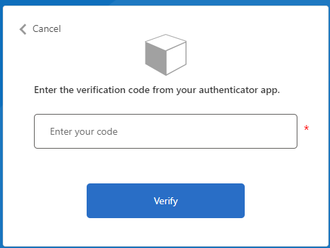

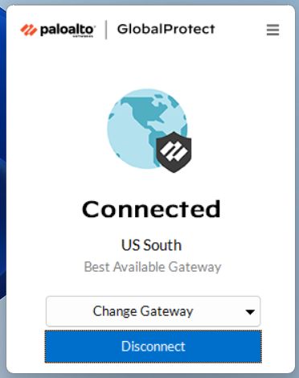

## 

# Dashboard

The dashboard is the landing page after logging in. It gives a summary of asset counts in all the source systems connected to the Digital Thread. The following table explains the features highlighted by numbered callouts in the corresponding image of the dashboard page.

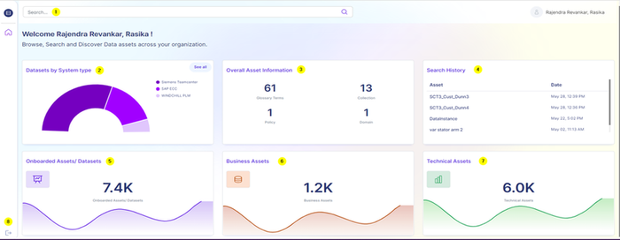

| \# | Feature |
| --- | --- |
| 1 | Search bar to search for assets in the system. |
| 2 | A Semi-doughnut chart that represents visual comparisons of the proportions of various system-type datasets. |
| 3 | Overall asset information widget. It contains counts of Glossary Terms, Collection, Policy, and Domain. |
| 4 | Search History. This provides the user's asset search history with time. Clicking on the asset name navigates to the asset. |
| 5 | Onboarded asset count. This is an aggregate count of Business Assets and Technical Assets. |
| 6 | Business Asset Count. Business assets are elements in the data catalog that provide a high-level, user-friendly view of data, focusing on the business context and utility. |
| 7 | Technical Asset Count. Technical assets are elements in the data catalog that provide a detailed, technical view of data, focusing on the structure, storage, and processing. |
| 8 | Logout Button |

## 

# Overall Asset Information

The overall asset information tile provides an overview of asset information and aggregates counts for each asset category.

| \# | Asset Category Description |
| --- | --- |
| 1 | Glossary Terms Glossary Terms are business terms that are used to ensure a consistent understanding of data across the organization. |
| 2 | Collection Collections, in the context of data management and organization, serve as containers that group various data assets along with their related metadata. |
| 3 | Policy Policies are essential in defining how data should be accessed, used, and protected within data management. |
| 4 | Domain Domains, in the context of data management, refer to broad categories that encapsulate related data assets and metadata. Clicking on the asset categories (except for Policy) expands to show more details and features. These are discussed in the subsequent sections. 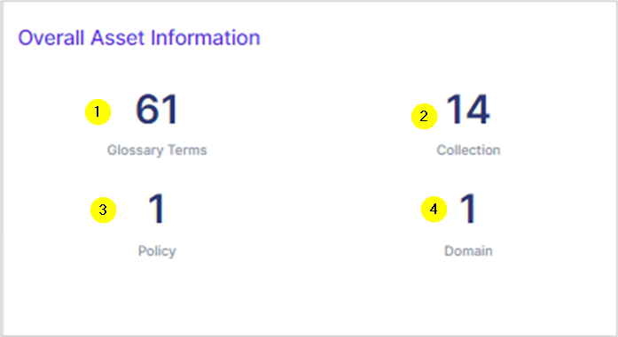
|  |

### 

## Glossary Terms

Glossary terms encompass a standardized set of definitions for key terms used within an organization, while collection refers to the grouping or categorization of related data assets for management and analysis purposes. Glossary terms displayed depend on the source systems connected. In this example, the glossary terms are, Glossary and SAP.

Clicking on them navigates to a page where all associated glossary terms are displayed as a table with sharing, exporting, and sorting options.\
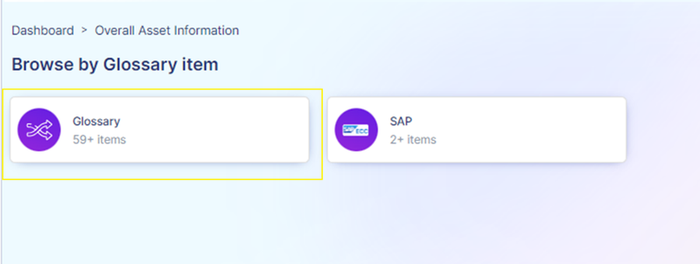

#### 

### Glossary Page

The following image displays the Glossary page. Note that the SAP page has similar features.

| \# | Feature |
| --- | --- |
| 1 | Filters. Using keywords and alphabets, the glossary items can be filtered. To view assets filtered by alphabet, click on that alphabet. If there are no assets available under that alphabet, that alphabet is greyed out. |
| 2 | Glossary items (results) count |
| 3 | The glossary items are displayed in the form of a table, organized as per name, parent term, description, and update date. Checkboxes are present to select assets for sharing and exporting. |
| 4 | The share option enables sharing the assets to specified email addresses. |
| 5 | The export option enables exporting the assets and their data in Excel (CSV) format. |
| 6 | The sort dropdown enables sorting the glossary items as per name, relevance, and recently updated. |

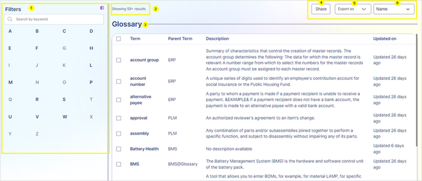

#### Glossary Term Page

By clicking on any glossary term, i.e., the asset, the details of that term are displayed. This page has two tabs, Overview and Related.

##### Overview Tab

The Overview tab provides the formal name of the glossary term, definition, acronym, catalog assets, last updated date, created date, resources, and term hierarchy. The term hierarchy provides information on the parent terms, if any, and clicking on them navigates to the details page of that term.

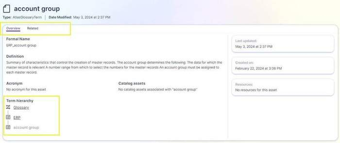

##### Related Tab

The Related tab displays synonyms, related terms, and child terms.

1.  Synonyms: Existing glossary terms that are synonymous with the selected term.

2.  Related Terms: Existing glossary terms that are related i.e., have a relationship/dependency to the selected glossary term.

3.  Children: Existing glossary terms that are children of the selected glossary term.

Clicking on any of these expands their details in the table on the right (4). Clicking on the name (5) displays further details of that item, which is in a similar format to the Glossary Term page.

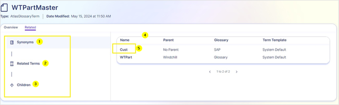

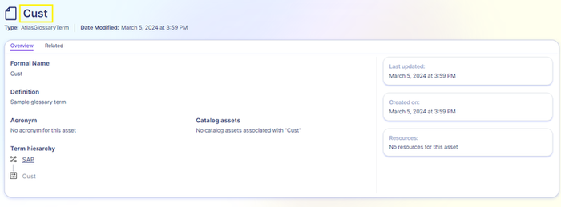

### Collection

When the Collection count is clicked on the Overall Asset Information tile, the Collection details page is displayed.

1.  Using a keyword, collections can be searched.

2.  The collections are sorted into a table, which is organized as per Name, Description, number of Assets in the collection, and Parent Collection.

3.  Clicking on the name of the collection displays assets of that collection and their details filtered by the Collection selected.

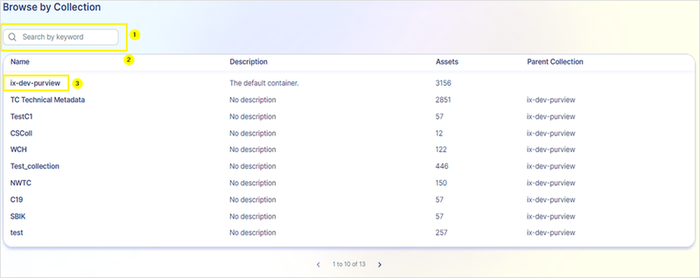

As shown in the image below, the assets are filtered by the selected collection. The interface features are similar to that of the Glossary page with options to select assets, share and export them, and sort them as per name, relevance, and recently modified. Additional filter options are available on the left to further filter by asset type, data source type, classification, and assigned term. If the data does not apply to a filter, that option will appear greyed out.

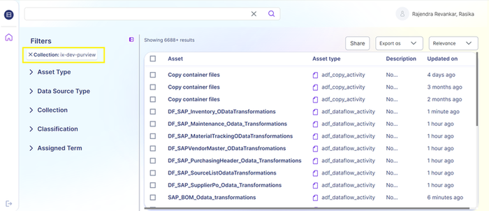

### 

## Domain

Clicking on the Domains count in the Overall Asset Information tile, launches the Domain details page. This page displays the domains available and the item count.

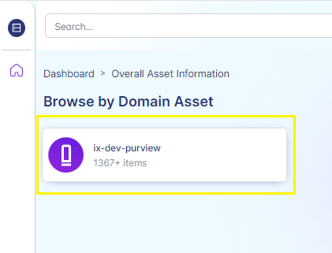

Clicking on the domain name launches a page that displays the assets and their details filtered by that domain. The interface is similar to that of the Glossary page, with checkboxes to select assets and options to share, export, and sort by name, relevance, and recently modified.

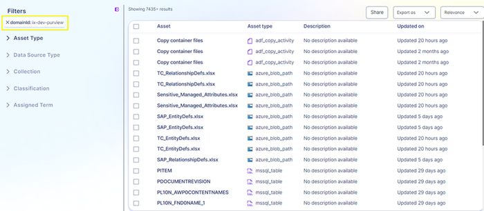

## Asset Search and Filter

The search bar is used to search for assets present in the Data Catalog system. When the search keyword is entered, suggestions are shown below in the search panel. There are two types of suggestions displayed: Search Suggestions and Asset Suggestions.

Search suggestions are search keywords based on the keyword entered. Asset suggestions are assets that match the keyword entered.

When the keyword does not match any suggestions, the search panel is blank.

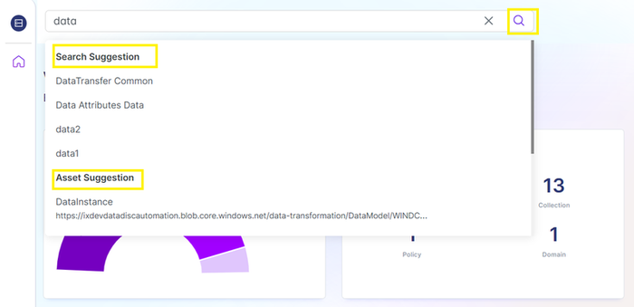

### 

## 

### Search Details Screen

This screen displays the asset search results for the searched keyword.

| \# | Feature |
| --- | --- |
| 1 | Options to filter search results by Asset Type, Data Source, Collection, Classification, and Assigned Term. |
| 2 | Option to collapse and expand the filter panel. |
| 3 | Share (invite an email address), export (as Excel/CSV), and sort (by name, relevance, recently updated) options. 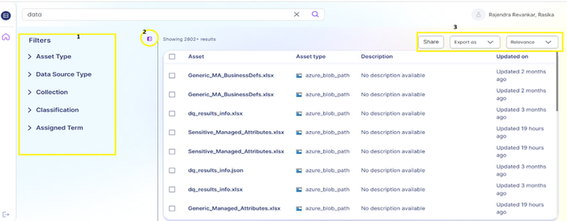
|  |

### 

## Filter Options

The assets can be filtered by Asset Type, Data Source, Collection, Classification, and Assigned Term. When a filter is applied, further filtering options are available as shown in the following image.

Each filtering category is collapsable according to the asset data available. As shown in the example, the assets can be filtered by Collection, and then further filtered by a specific collection (1).

The applied filters are visible and can be expanded by clicking on 'SHOW MORE' (2). The expanded filters are shown in a pop-up window (3).

The 'CLEAR ALL' option (4) removes all filters whereas the (x) option next to the applied filter removes that filter. The 'ADD FILTER' option is used to add a custom filter, which is explained in the next section.

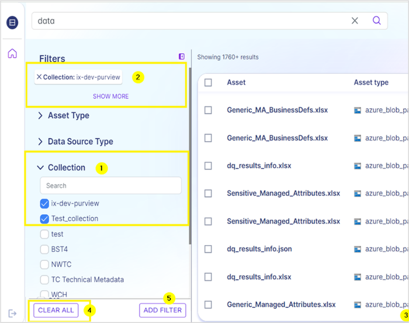

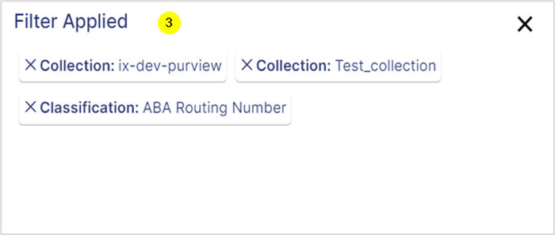

### 

## Custom Filter

By using the 'ADD FILTER' option, custom filters based on business data attributes can be applied.

A pop-up window is displayed which contains three mandatory fields that enable applying a custom filter.

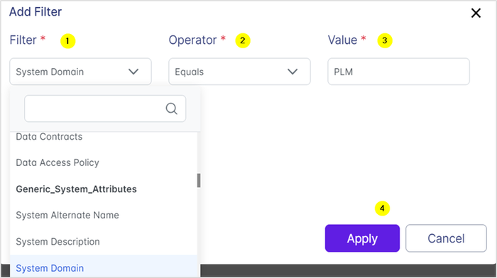

| \# | Feature |
| --- | --- |
| 1 | Filter dropdown. Contains business attributes as options for filtering. |
| 2 | Operator dropdown. The options available are: - equals to - does not equal to - contains word - starts with |
| 3 | Value. This is an input field to enter the value that the operator value checks for. For example: System Domain -- Equals to -- PLM, where PLM is the value entered. |
| 4 | Apply button is enabled after all the fields are selected. |

If an 'Activity within filter', for example, a 'Created Within' filter (5) is chosen for (1), then the Operator dropdown is removed as it is not needed to apply this filter. The Value field instead contains time ranges as options (6).

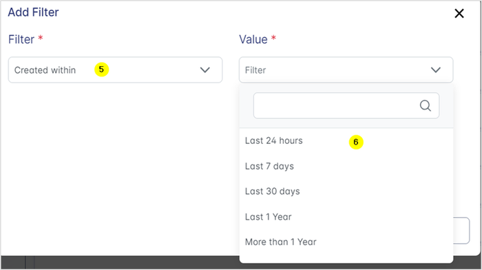

### 

## Asset Details Page

When an asset in the search results is clicked, the asset details page showing either business or technical metadata is loaded.

#### Business Metadata Asset 

The following table explains the tabs and their features.

| Name | Feature |
| --- | --- |
| Overview | Displays a description, glossary terms, collection path, properties, data owner, data stewards, source system, and data quality status. |
| Metadata | This tab displays the managed attribute groups including generic data attributes and generic system attributes, with search and filter options (search bar and 'show attributes without values' checkbox). |
| Related | Displays the related details of the asset such as different databases, schema, tables, glossary, and other relevant data entities as a flow. On clicking on any element (related asset) of the flow, the information is expanded in a pop-up window. |
| Data Quality | Displays metrics for uniqueness, completeness, and validity, and provides an option to filter data according to the rule type. |

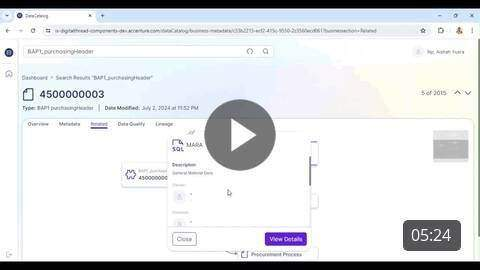

#### 

### 

#### Technical Metadata Asset 

The technical metadata asset page has the following tabs.

| Name | Feature |
| --- | --- |
| Overview | The technical metadata is organized and displayed under the following categories. - Asset Description, - Properties, A View More enables viewing additional properties and details about the asset. - CreateTime, - ModifiedTime, - QualifiedName, - Classifications, - Schema Classifications, - Fully Qualified Name, - Collection Path. This feature is clickable and enables viewing more details about the collection and navigating to the search results. - Glossary Terms. A clickable feature that enables viewing detailed information about each glossary term. |
| Schema | This tab displays the structure of the dataset. It displays the table\'s column name, classification, sensitivity label, glossary, data types, and description associated with the dataset. |
| Lineage | This tab shows the data flow and transformations between data sources and destinations. It provides a visual representation of how data moves and changes from its origin to its final form. Clicking on any of the instances of the flow expands their details in a pop-up window. A 'View Details' link navigates to the overview page of that instance. |
| Related | This tab lists linked tables, views, schemas, and other entities within the same data source. Clicking the data structure on the left reveals expanded details on the right. Details include: - Databases present on the server. - Schemas available in the database. - Details of tables and views present in the current schema. Note that 4c is the default view/landing page of the related tab. - Item name. Clicking on this launches the details of the item in a similar format. |

Click on the image to play a video that shows all tabs of the Technical Metadata page.

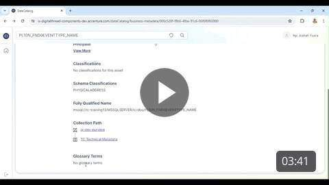
