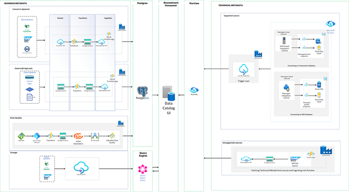
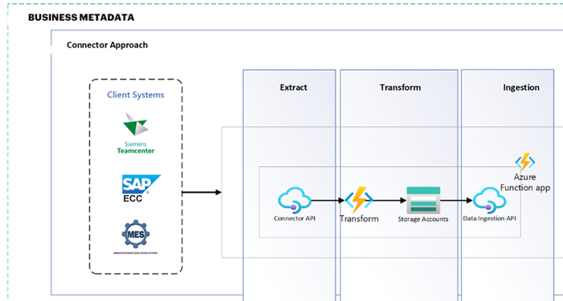
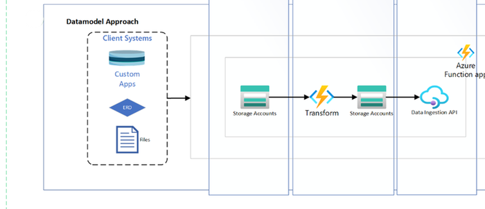
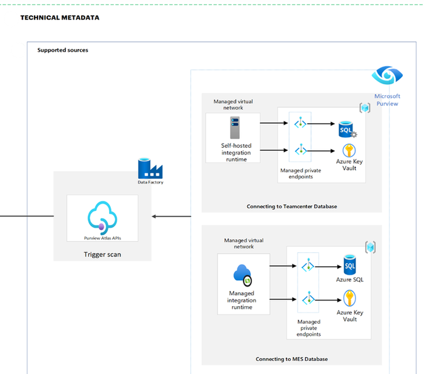
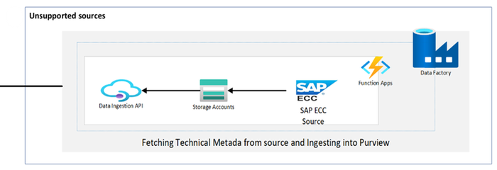
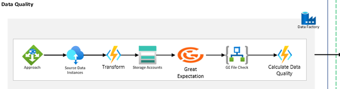
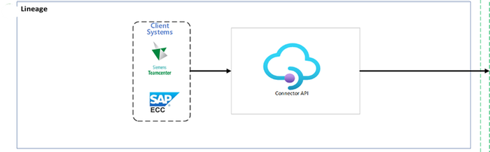

Digital Thread Foundations

Data Discovery Automation

ARCHITECTURE OVERVIEW

Release Version: 1.2

Metadata Table

| **Field** | **Value** |
| --- | --- |
| **Asset / Solution Name** | Digital Thread |
| **Domain / Area** | Engineering |
| **Owner (Team/Person)** | Karthik Ramachandra |
| **Reviewers** | Karthik Ramachandra |
| **Status** | Approved / Complete |
| **Confidentiality** | Internal / Confidential |
| **Source of Truth** | [link](https://dev.azure.com/IXAssets/IXAssetsProject/\_git/ixassets) |
| **Related Assets / Alternatives** | AOT / Engineering Orchestration / Engineering Agents |
| # | Introduction A digital thread refers to the continuous and consistent flow of information throughout the entire lifecycle of a product or system - from design and development to operation and maintenance. It enables the integration of data from different stages and sources, allowing effective traceability, seamless collaboration, and efficient decision-making by unleashing the power of sleeping data. The digital thread is considered a key aspect of Industry 4.0 and the digital transformation of the manufacturing industry. It is the core of the Enterprise Operating System (EOS). Digital Thread is a communication framework that helps integrate various enterprise systems involved in the engineering and manufacturing product life cycle. Data Discovery Automation (DDA) is the process of employing advanced technologies to automatically locate, categorize, and analyze digital assets across an organization\'s data ecosystem. DDA is implemented for IX Digital Thread Foundations project framework to streamline the ingestion of business and technical metadata into a Data Catalog thereby enabling comprehensive data governance and discovery capabilities across various data sources within the organization. |

### Purpose

This document provides an overview of IX Digital Thread\'s Data Discovery Automation architecture.

### Target Audience

-   Data Management and Governance Team

-   Interface Developers

-   Data Engineers

-   Application Support Team

###  Prerequisites

-   [Download](https://www.python.org/downloads/release/python-3118/) and [install](https://www.datacamp.com/blog/how-to-install-python) Python (3.11)

-   [Download](https://code.visualstudio.com/download) and [install](https://www.geeksforgeeks.org/how-to-install-visual-studio-code-on-windows/) Visual Studio Code (1.92.0)

-   [Data-[IX-Thread Infra team](mailto:IX_DT_DEVOPS_INFRA@accenture.com)](https://dev.azure.com/IXDigitalThread/IXThreadComponents/_git/ix-thread-components?path=/data-catalog/ix-azure-functions/ix-data-discovery&amp;version=GBdev&amp;_a=contents) (provided by the IX-Thread Infra team)

### Contacts

-   [karthik.ramachandra@accenture.com](mailto:karthik.ramachandra@accenture.com)

-   [a.b.palaniappan@accenture.com](mailto:a.b.palaniappan@accenture.com)

-   [sathish.kumar.sanga@accenture.com](mailto:sathish.kumar.sanga@accenture.com)

-   [dhana.chevveti@accenture.com](mailto:dhana.chevveti@accenture.com)

### Related Links

-   [IX Digital Thread Documentation](https://industryxdevhub.accenture.com/asset-home;search_text=ix%20digital%20thread)

### Technology Stack

| **Tools and Libraries** | **Repository** |
| --- | --- |
| - Azure Data Factory | - Git branch name: dev |
| - Logic App | - Git folder path: Git -\&gt; Repos -\&gt; ix-thread-components-\&gt; data-catalog -\&gt; ix-data-discovery |
| - Azure Function App | - Git folder link:\ [Data Discovery Automation-Repos(azure.com)](https://dev.azure.com/IXDigitalThread/IXThreadComponents/_git/ix-thread-components?path=/data-catalog/ix-azure-functions/ix-data-discovery&amp;version=GBdev&amp;_a=contents) |
| - Microsoft Purview |  |
| - Azure Blob Storage |  |
| - Postgres database |  |
| - Query Engine (Graphql) |  |
| - API Management |  |
| - Azure Key Vault |  |
| - azure-functions 1.18.0 |  |
| - requests 2.31.0 |  |
| - openpyxl 3.1.2 |  |
| - azure.storage.blob 12.17.0 |  |
| - configparser 7.0.0 |  |
| - pandas 2.1.4 |  |
| - psycopg2-binary 2.9.9 |  |
| - xlsxwriter 3.2.0 |  |

## 

# Background

IX Digital Thread Foundations is equipped with a Data Catalog. The data catalog serves as a central repository that organizes and stores metadata, namely two types of metadata- Business and Technical metadata. To enhance and automate metadata discovery methods, Data Discovery Automation (DDA) has been implemented and it provides a comprehensive solution for managing metadata across diverse data sources by enabling:

-   Efficient maintenance of the data catalog of available datastore from disparate systems such as PLM, MES, and ERP.

-   Swift onboarding of new data sources into the Digital Thread\'s framework.

-   A dynamic view of all data availability and lineage across source systems.

-   Visibility into data for business analysts and application developers via the Data Catalog.

Metadata management of the business and technical metadata is described below.

### Business Metadata

For metadata extraction and ingestion, DDA uses a connector approach for sources with APIs, such as Teamcenter and SAP, and a data model approach for sources without APIs, such as ER diagrams. Metadata is extracted from these sources, transformed, and then ingested into Postgres. Ingestion status is tracked for auditing purposes using Azure blob storage.

A dedicated data quality pipeline supports the implementation of the Great Expectations (GE) API, enabling data validations on ingested data. The pipeline also calculates custom data quality metrics, stores the results of quality checks in PostgreSQL, and integrates with the Query Engine API to visualise the data.

Automatic lineage tracking is implemented across systems using system-specific lineage APIs to fetch relationship data. All lineage information can be visualised within the Data Catalog user interface.

###  Technical Metadata

For technical metadata, Purview\'s native integration manages extraction from supported sources. For sources that are unsupported, custom extraction and transformation logic is applied. Data ingestion APIs are then used to ingest technical metadata into Purview. There is no dedicated data quality pipeline or lineage tracking described for technical metadata.

## 

# DDA Architecture

This architecture enables efficient metadata extraction, transformation, and ingestion while maintaining data quality, security, and governance across the organization\'s data landscape.\
It separates business metadata (including data quality and lineage) from technical metadata, providing a more accurate representation of the metadata management structure.\
The following diagram depicts the DDA architecture. Click on the image to launch a maximized view. The components depicted in the architecture are described in the subsequent table.

### Architecture Diagram Components

| Component | Description Purpose |
| --- | --- |
| Azure Data Factory | Cloud-based data integration service orchestrates and automates the movement and transformation of data. Orchestration of data workflows |
| Azure Function Apps | Event-driven serverless compute platform that allows you to run code in response to events. Transformation and ingestion of data |
| Azure Key Vault | Service to securely store and manage secrets, keys, and certificates. Secrets and keys management |
| Purview Atlas APIs | APIs for managing metadata in Purview. To trigger data source scan to ingest technical metadata into Purview. |
| Managed Virtual Network | Azure Virtual Network securely connects Azure resources and connects to on-premises networks. Secure connectivity to databases |
| Data Ingestion APIs | Custom APIs for ingesting data into Microsoft Purview. To Ingest the data into Purview |
| Blob Storage | Object storage solution for the cloud. Temporary storage for extracted and transformed data |
| Data Catalog UI | Custom User interface for browsing and managing metadata. Metadata cataloging and management |
| Self-hosted Integration Runtime | Facilitates data integration and movement across different network environments. Data integration with on-premises and other network environments |
| Managed Integration Runtime | Azure service that facilitates secure data integration and movement. Connect securely to Azure data sources. |
| Great Expectations | Open-source data quality framework. Data quality checks |
| Postgres | Open-source relational database management system. Storing business metadata quality results |
| Query Engine | Gateway facilitates interaction between the user and external source systems. Integrated with Postgres data quality table and used in the Data Catalog UI |
| Connector API | Responsible for extracting data from external systems or data sources. Fetch the data from data sources |

### Extraction and Ingestion 

The system is designed to extract, transform, and ingest business metadata from various sources into Postgres, ensuring comprehensive metadata management and data governance across the organization. Business metadata and technical metadata extraction and ingestion methods vary.

####  Business Metadata

For business metadata, two distinct approaches are employed to handle different types of data sources: the Connector Approach and the Data model Approach. Both approaches ultimately feed data into Postgres for centralized metadata management and integrate with Azure services for processing and storage.

##### 

#### Connector Approach

The Connector Approach is designed to handle structured data from enterprise systems such as Teamcenter, SAP, and other client systems that expose APIs for data extraction. The process begins with data extraction, utilizing multiple connector APIs to fetch metadata information, relationships, and data instances from source systems. This data is retrieved in JSON format. The next step involves data transformation, where the JSON responses are transformed into the required metadata formats. This conversion includes creating separate formats for metadata, relationships, and instance data, with the transformed data formatted into Excel files. These Excel files are then stored in Azure Blob Storage. The ingestion process is handled by Azure Function apps, which use SQL insert commands to ingest the stored Excel files into Postgres. Throughout this process, the ingestion status for each component (metadata, relationships, instances) is saved in separate files in Blob Storage for tracking and auditing purposes.\

| **Key Component** | **Description** |
| --- | --- |
| Client Systems (TC, SAP) | These are the source systems from which business metadata is extracted. They typically have APIs or other interfaces that allow for data extraction. Each system may have its data structure and access methods, requiring custom connectors. |
| Connector APIs | This component interfaces with the client systems to extract data. It is designed to handle the specific protocols and data formats of each source system, translating them into a standardized JSON format for further processing. |
| Transform | The Transform component is responsible for converting the JSON data obtained from the Connector API into the required Purview metadata formats. It applies business rules, data mapping, and any necessary transformation requirements. |
| Storage Accounts: | Azure Storage Accounts are used to store the transformed data in Excel format. This serves as a staging area before the data is ingested into Purview, allowing for data persistence and potential reprocessing if needed. |
| Azure Function App | This serverless computing service orchestrates the data flow. It triggers the data extraction, coordinates the transformation process, and manages the ingestion of data. It also handles error logging and status updates. |
| Data Ingestion API | This component interfaces with Purview to ingest the processed metadata. It ensures that the transformed data is correctly formatted and submitted to Purview, handling any authentication and error handling required during the ingestion process. |
| ADF Pipeline | An orchestration service that automates data movement and transformation. The ADF pipeline is responsible for triggering the metadata extraction process from registered data sources, coordinating the data flow, and ensuring that the extracted metadata is processed and ready for ingestion into Purview. |
| Azure Key Vault | A secure storage solution for credentials required to access data sources. By storing and managing these access credentials, Azure Key Vault ensures that the data extraction processes remain secure and compliant with organizational security policies. |

##### Data Model Approach

The Data model Approach is designed for sources where direct API connectivity is not available or practical, such as ER diagrams or custom file formats. The process flow for this approach begins with data extraction from ER diagrams or custom files. The extracted data is then converted into the required Excel formats for metadata, relationships, and instances. Like the Connector Approach, these individual Excel files are stored in Azure Blob Storage. The ingestion process uses Azure Function apps with SQL insert commands to ingest the stored CSV files into Postgres. The ingestion status for each component is also saved in separate files in Blob Storage.

| **Key Component** | **Description** |
| --- | --- |
| Client Systems (custom apps, files) | In this approach, the source \"systems\" are typically static data models, ER diagrams, or custom file formats that contain metadata information. These might be manually created or exported from design tools. |
| Storage Accounts | Like the Connector Approach, Azure Storage Accounts are used here to store the input files (e.g., ER diagrams, custom files) and the processed Excel files ready for ingestion. |
| Transform | In the Data model Approach, the Transform component is responsible for parsing the input files (ER diagrams, custom formats) and converting them into the required Excel formats for metadata, relationships, and instances. This may involve more complex logic to interpret diagrams or custom file structures. |
| Azure Function App | The Function App in this approach manages the overall process flow. It detects new files in the Storage Account, triggers the transformation process, and manages the ingestion into Postgres. It also handles error logging and status tracking. |
| Data Ingestion API | This component functions similarly to its counterpart in the Connector Approach, interfacing with Purview to ingest the processed metadata from the Excel files. |
| ADF Pipeline | An orchestration service that automates data movement and transformation. The ADF pipeline is responsible for triggering the metadata extraction process from registered data sources, coordinating the data flow, and ensuring that the extracted metadata is processed and ready for ingestion into Postgres. |
| Azure Key Vault | A secure storage solution for credentials required to access data sources. By storing and managing these access credentials, Azure Key Vault ensures that the data extraction processes remain secure and compliant with organizational security policies. |

#### Technical Metadata

Digital Thread\'s technical metadata management is capable of handling diverse data sources. Sources that are supported by Microsoft Purview are extracted via Purview, and for sources that are not supported by Purview (non-supported sources), an ADF pipeline is directly integrated with the source system.

##### Extraction of Supported Sources 

For supported sources, the native integration capabilities of Microsoft Purview are leveraged. The process begins with registering the data source in Purview. For example, for Teamcenter, an Integration Runtime on a virtual machine is created to facilitate the connection. Security is paramount, so all necessary credentials are stored in Azure Key Vault.

The metadata extraction itself is orchestrated through an Azure Data Factory (ADF) pipeline. This pipeline, configured with Teamcenter\'s specific details, triggers Purview to scan the registered source. During the scan, Purview uses the installed Integration Runtime to access Teamcenter, extract the technical metadata, and automatically ingest it into its Data Catalog.

This approach offers several advantages. It ensures comprehensive metadata capture, automates the extraction process, and enhances security through centralized credential management. The native integration with Purview also guarantees that the full range of metadata that Purview supports is captured.

| **Key Component** | **Description** |
| --- | --- |
| Data Sources | Enterprise systems or databases with native integration support in Microsoft Purview. These data sources are registered in Purview to facilitate seamless metadata extraction and management (e.g., Teamcenter, MES). |
| Integration Runtime | A runtime environment that is installed on the source system\'s virtual machine. This component enables secure connections and data transfers between the source systems and Purview, ensuring that the metadata is accurately and securely extracted. |
| Azure Key Vault | A secure storage solution for credentials required to access data sources. By storing and managing these access credentials, Azure Key Vault ensures that the data extraction processes remain secure and compliant with organizational security policies. |
| ADF Pipeline | An orchestration service that automates data movement and transformation. The ADF pipeline is responsible for triggering the metadata extraction process from registered data sources, coordinating the data flow, and ensuring that the extracted metadata is processed and ready for ingestion into Purview. |
| Purview Scan | A scanning mechanism within Purview that extracts metadata from registered data sources. Utilizing the Integration Runtime, the Purview Scanner performs the actual extraction of metadata, ensuring that it is comprehensive and aligned with Purview\'s schema. |
| Purview Data Catalog | A centralized repository for storing and managing extracted metadata. The Purview Data Catalog ingests and catalogs the metadata extracted by the Purview Scanner, providing a unified view of all metadata within the organization for easy access and management. 
|  |

##### Extraction of Non-supported Sources 

Not all data sources can be integrated seamlessly via Purview, For such non-supported sources, there are high integration requirements and other limitations, and thus an alternative approach is implemented to integrate these sources. SAP is a prime example of such a source due to its high integration runtime requirement.

The integration method for unsupported sources is also centered around an ADF pipeline. However, instead of triggering a Purview scan, this pipeline connects directly to the source system. For SAP, SAP OData services are utilized to fetch the relevant technical metadata.

Once extracted, the metadata undergoes a transformation process within the ADF pipeline. We\'ve developed a custom component that converts this raw metadata into a format compatible with Purview\'s requirements. This often involves mapping SAP-specific structures to Purview\'s metadata model.

Finally, Purview\'s Data Ingestion APIs are used to programmatically ingest this transformed metadata into the Purview catalog. This approach provides the flexibility to integrate sources that would otherwise be excluded from the general metadata management system.\

| Key Component | Description |
| --- | --- |
| Data Sources | Data sources require custom extraction processes to gather metadata, as they cannot be directly registered and scanned by Purview (e.g., SAP). |
| ADF Pipeline | Like the pipeline used for supported sources but configured to handle unsupported sources. This pipeline connects directly to the source systems, extracting metadata using custom configurations tailored to each source\'s specific requirements. |
| Custom Extraction Logic | These are custom components within the ADF pipeline that are designed to handle the extraction of metadata from unsupported sources. This logic includes custom code and processes to interact with source systems like SAP OData services, ensuring accurate and efficient metadata extraction. |
| Transformation Component | A module within the ADF pipeline that is responsible for converting raw metadata into a format compatible with Purview. This component applies necessary transformations to ensure that the extracted metadata aligns with Purview\'s schema requirements, making it ready for ingestion. |
| Data Ingestion API | An API provided by Microsoft Purview for programmatically ingesting metadata. This component submits the transformed metadata to the Purview Data Catalog, ensuring that it is correctly formatted and stored within Purview for centralized management and access. |

### Data Quality Pipeline

The Data Quality Pipeline is designed to ensure that the data retrieved from various sources undergoes validation and quality checks before being used downstream. This pipeline now supports two approaches for data retrieval: the Connector approach and the Data Model approach. Both approaches follow similar steps for data extraction, transformation, validation, and reporting, but differ in how and where the data is sourced from.

In the Connector approach, data is fetched from various external source systems, such as SAP or other integrated systems. This approach is particularly useful when working with traditional data sources that have established APIs or connectors. The data instances retrieved are based on specified entity types and collection names, which are set as parameters in the pipeline. The extracted data is then processed by Azure Functions, which transform the data into the required format before storing it in Azure Blob Storage for further operations. After the transformation, the pipeline performs data quality checks using the Great Expectations library, which validates the data against predefined expectations. Custom organization-specific quality metrics are then applied to assess the data\'s correctness, completeness, and consistency. Finally, the data quality results are stored in a PostgreSQL database for historical tracking and analysis, and downstream systems can access the data quality information through the Query Engine API for reporting and visualization.

The Data Model approach, on the other hand, retrieves data from ER Diagrams or custom files, which are typically used when the data is structured based on the organization\'s internal modelling standards. This approach is ideal when dealing with data that is defined through custom architectures or business processes, rather than through external source systems. The data instances are extracted from these models, which could include formats such as XML, CSV, JSON, or other proprietary structures. Similar to the Connector approach, the data is processed and transformed by Azure Functions, then stored in Azure Blob Storage. The same validation steps using Great Expectations are applied to ensure that the data meets the required quality standards. Custom quality checks are also executed to assess the accuracy and completeness of the data based on its specific model. The results of the quality checks are then stored in the PostgreSQL database, and the data quality information is made available for downstream systems to access via the Query Engine API.

By supporting both approaches, the Data Quality Pipeline can handle a wide range of use cases, from traditional source systems to custom internal data models. Both methods help ensure that only high-quality, validated data is passed downstream, supporting reliable decision-making and business operations.

| **Key Component** | **Description** |
| --- | --- |
| Great Expectations | A tool for validating, documenting, and profiling data |
| Logic app File Check | This logic app checks if the Great Expectation response file is generated or not. |
| Calculate Data Quality | A custom process for computing various data quality metrics. |
| PostgreSQL | A database used to store the results of data quality checks. |
| ADF Pipeline | An orchestration service that automates data movement and transformation. The ADF pipeline is responsible for triggering the metadata extraction process from registered data sources, coordinating the data flow, and ensuring that the extracted metadata is processed and ready for ingestion into Postgres. |
| Azure Key Vault | A secure storage solution for credentials required to access data sources. By storing and managing these access credentials, Azure Key Vault ensures that the data extraction processes remain secure and compliant with organizational security policies. |

### 

## Lineage

In addition to metadata extraction and ingestion, the system now includes an Automatic lineage tracking functionality. This feature provides a comprehensive view of data lineage across various systems, enhancing data governance and traceability. The process begins when a user clicks on the Lineage tab on any data instance page of the Data Catalog UI. This action automatically triggers the corresponding system lineage API based on the instance being viewed. The system name is determined from the generic system attributes group associated with the instance, which contains a specific attribute indicating the system (e.g., SAP, Teamcenter, etc.). The Data Catalog UI then sends the necessary inputs, including the asset type and instance ID, to the Query Engine. Based on the system name, the Query Engine determines which connector lineage API to call.

The Query Engine then calls the appropriate connector lineage API, passing the asset type and instance ID. Finally, the aggregated lineage data is sent back to the Data Catalog UI, which presents the information to the user in a visual format, typically as a graph showing the relationships and data flow between different assets across various systems.

This functionality offers several benefits, including enhanced data governance, improved impact analysis capabilities, and increased data trust. Users can trace data lineage from different systems, providing a holistic view of data flow within the organization. This supports a better understanding of data origins, transformations, and dependencies, which is crucial for compliance and data quality initiatives. Users can easily identify changes/revisions that happened for the instance IDs, facilitating impact analysis for proposed changes.

| **Key Component** | **Description** |
| --- | --- |
| Connector Lineage APIs | Lineage APIs are implemented for all major systems including SAP, Teamcenter (TC), and Manufacturing Execution Systems (MES). These APIs are responsible for extracting lineage information from their respective systems. |
| Query Engine | The query engine interfaces with the connector lineage APIs, processing requests and aggregating lineage data from multiple sources. |
| Data Catalog UI | The user interface where lineage information is displayed and interacted with by users. |

## 

# Implementation Considerations

When implementing the **business** **metadata** management system, several key considerations should be addressed:

-   Data Source Variability: Given the diverse nature of data sources, it\'s crucial to develop flexible connectors and transformation logic that can adapt to different data structures and formats.

-   Scalability: As the number of data sources grows, the system must be able to scale efficiently. This may involve optimizing Azure Function Apps and Data Factory pipelines to handle increased loads.

-   Data Quality and Validation: Implement robust data validation checks during the transformation process to ensure the quality and consistency of metadata before ingestion into Postgres.

-   Error Handling and Logging: Develop comprehensive error handling mechanisms and logging processes to facilitate troubleshooting and maintain system reliability.

-   Security and Compliance: Ensure that all data extraction, transformation, and ingestion processes comply with organizational security policies and data governance standards.

-   Performance Optimization: Regularly monitor and optimize the performance of connectors, transformation processes, and ingestion pipelines to minimize processing time and resource utilization.

When implementing **technical** **metadata**, both approaches require careful consideration in their implementation. For supported sources, optimization of the scanning process and secure credential management must be considered. The scan settings are regularly reviewed and updated to ensure all relevant metadata is captured.

With unsupported sources, maintaining accurate metadata mappings, implementing robust error handling, and considering incremental update strategies for efficiency are prioritized. A regular review process is established to ensure the custom extraction and transformation logic is adaptable to all changes in the source systems.
