

Digital Thread Foundations

Data Discovery Automation

PIPELINES OVERVIEW

Release Version: 1.2

Metadata Table

| **Field** | **Value** |
| --- | --- |
| **Asset / Solution Name** | Digital Thread |
| **Domain / Area** | Engineering |
| **Owner (Team/Person)** | Karthik Ramachandra |
| **Reviewers** | Karthik Ramachandra |
| **Status** | Approved / Complete |
| **Confidentiality** | Internal / Confidential |
| **Source of Truth** | [link](https://dev.azure.com/IXAssets/IXAssetsProject/\_git/ixassets) |
| **Related Assets / Alternatives** | AOT / Engineering Orchestration / Engineering Agents |

## Introduction

A digital thread refers to the continuous and consistent flow of information throughout the entire lifecycle of a product or system - from design and development to operation and maintenance. It enables the integration of data from different stages and sources, allowing effective traceability, seamless collaboration, and efficient decision-making by unleashing the power of sleeping data. The digital thread is considered a key aspect of Industry 4.0 and the digital transformation of the manufacturing industry. It is the core of the Enterprise Operating System (EOS). Digital Thread is a communication framework that helps integrate various enterprise systems involved in the engineering and manufacturing product life cycle.

Data Discovery Automation (DDA) is the process of employing advanced technologies to automatically locate, categorize, and analyze digital assets across an organization\'s data ecosystem. DDA is implemented for IX Digital Thread\'s project framework to streamline the ingestion of business and technical metadata into a Data Catalog, thereby enabling comprehensive data governance and discovery capabilities across various data sources within the organization.

Data Discovery Automation Pipelines streamline the process of identifying, categorizing, and documenting both business and technical metadata across diverse data ecosystems. These pipelines leverage advanced technologies like Azure Data Factory, Azure Functions, and Microsoft Purview to automate the complex task of metadata management at scale. There are two primary categories of pipelines, Business Metadata and Technical Metadata pipelines.

### Purpose

This document provides an overview of the pipeline framework utilized by IX Digital Thread to implement Data Discovery Automation.

### Target Audience

-   Data Management and Governance Team

-   Interface Developers

-   Data Engineers

-   Application Support Team

### Contacts

-   [karthik.ramachandra@accenture.com](mailto:karthik.ramachandra@accenture.com)

-   [a.b.palaniappan@accenture.com](mailto:a.b.palaniappan@accenture.com)

-   [sathish.kumar.sanga@accenture.com](mailto:sathish.kumar.sanga@accenture.com)

-   [dhana.chevveti@accenture.com](mailto:dhana.chevveti@accenture.com)

###  Technology Stack

**Tools and Libraries**

-   Azure Data Factory

-   Logic App

-   Azure Function App

-   Microsoft Purview

-   Azure Blob Storage

-   Query Engine (Graphql)

-   API Management

-   Azure Key Vault

-   azure-functions 1.18.0

-   requests 2.31.0

-   openpyxl 3.1.2

-   azure.storage.blob 12.17.0

-   configparser 7.0.0

-   pandas 2.1.4

-   psycopg2-binary 2.9.9

-   xlsxwriter 3.2.0

**Repository**

-   Git branch name: dev

-   Folder path: Git-\&gt;Repos-\&gt;ix-thread-components-\&gt;data-catalog-\&gt;ix-data-discovery

-   Folder: Data Discovery Automation-Repos(azure.com)

### Related Links

-   [Digital Thread Foundations Release Notes](https://industryxdevhub.accenture.com/assetdetails/84)

-   [Digital Thread Foundations Documentation](https://industryxdevhub.accenture.com/asset-home;search_text=ix%20digital%20thread)

## 

# Prerequisites

The following prerequisites must be met before initiating the respective pipelines.

#### 

## General Prerequisites

-   [Download](https://www.python.org/downloads/release/python-3118) and [install](https://www.datacamp.com/blog/how-to-install-python) (3.11)

-   [Download](https://code.visualstudio.com/download) and [install](https://www.geeksforgeeks.org/how-to-install-visual-studio-code-on-windows/) Visual Studio Code (1.92.0)

-   Data Discovery Automation repository access (provided by the IX-Thread Infra team)

###  Business Metadata Prerequisites

-   ADF instance must be set up and appropriate permissions must be acquired to create and manage the pipelines.

-   Microsoft Purview account and Postgres database must be set up with the appropriate permissions to ingest metadata and data instances.

-   Source systems for both metadata and data instances must be properly configured and appropriate permissions must be in place to access these source systems.

-   Azure Blob Storage containers must be set up for data transformation and data ingestion and ensure ADF has permission to read and write to these containers.

-   Input files with information on glossary terms, managed attributes and technical metadata must be available. They can be generated from templates available.

-   Azure Functions for metadata and data instance ingestion must be deployed and configured.

###  Technical Metadata Prerequisites

-   Integration Runtime (IR) Setup:

    1.  Install the Self-hosted Integration Runtime on the virtual machine hosting your source system (e.g., Teamcenter VM).

    2.  This IR acts as a bridge between Purview and your on-premises data sources, enabling secure data transfer.

    3.  Ensure the IR is configured with the necessary permissions to access your data source.

    4.  For Azure-related publicly accessible resources, Azure Auto directly resolves integration runtime.

-   Azure Key Vault Configuration:

    1.  Set up an Azure Key Vault to securely store credentials for your data sources.

    2.  Create secrets in the Key Vault for usernames, passwords, and connection strings.

    3.  Configure Purview to access the Key Vault using a managed identity or service principal.

-   Network Configuration:

    1.  Ensure necessary firewall rules and network security groups are configured to allow communication between your on-premises network, Azure, and Purview.

-   Purview Setup:

    1.  Verify that your Purview account is properly set up and the necessary permissions to create and manage scans are in place.

### 

# End-to-End Data Catalog Bundle Pipeline

The PL_DDA_EndtoEnd_DataCatalog_Bundle pipeline is a comprehensive framework designed to unify and optimize metadata ingestion into Microsoft Purview and a PostgreSQL database. It ensures seamless integration of business metadata, technical metadata, data quality results, and glossary terms from various sources, enhancing data governance and enabling advanced search capabilities.\
The bundle comprises six sequential pipelines, each performing a critical function.

1.  Business Metadata Execution Check

2.  Business Data Instance Execution Check

3.  Technical Metadata Execution Check for SAP Systems

4.  Technical Metadata Execution Check for Purview-Supported Systems

5.  Glossary Execution Check

6.  Data Quality Execution Check

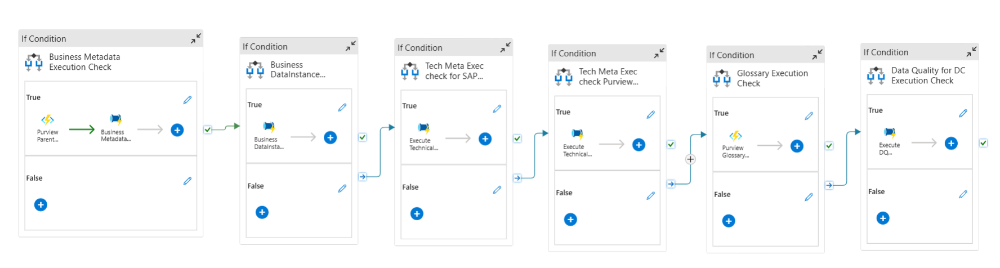

### Parameters

The following parameters are used to decide the flow and invoke the pipelines accordingly:

| **Parameter Name** | **Type** **Description** **Default Value** **Mandatory Field** |
| --- | --- |
| Source System | String Specifies the source system from which metadata and data instances are ingested. SAP Yes |
| BM_Entity_Prefix | String Defines a prefix for entities, used for naming and identification purposes. BST3 No |
| BM_Collection_Name | String Indicates the collection name to which the ingested data belongs. SAP Yes |
| BM_Limit | Int Sets a limit on the number of records to be ingested. A value of 0 means no limit. 100 Yes |
| BM_ModifiedAfter | String Filters records to ingest only those modified after the specified date. If set to \'none\', no filtering is applied. 03-02-2024 No |
| Business_Metadata_Approach | String Determines the approach used for metadata ingestion, with options including \'Connector\' and \'Datamodel\'. Connector Yes |
| TM_Purview_Scan_name | String Specifies a custom name for the scan to be created. Scan-TC1 Yes |
| TM_Purview_Data_source | String Defines the data source name configured in Purview. SqlServer-kfa Yes |
| TM_Purview_Scan_level | String Specifies the type of scan in Purview (e.g., Full or Incremental). Full Yes |
| TM_SAP_Instance_Name | String Provides the name of the custom SAP instance. ECC_033 Yes |
| TM_Purview_Account_Name | String Specifies the Purview account name. ix-dev-purview Yes |
| TM_SAP_Packages | String Lists the SAP package names to ingest into Purview. MG Yes |
| Execute_Technical_Metadata | String Specifies whether to execute the technical metadata pipeline. Yes Yes |
| Execute_Business_Metadata | String Specifies whether to execute the business metadata pipeline. Yes Yes |
| Execute_Business_DataInstance | String Specifies whether to execute the business data instance pipeline. Yes Yes |
| Execute_DataQuality | String Specifies whether to execute the data quality pipeline. Yes Yes |
| Execute_Glossary | String Specifies whether to execute the glossary pipeline. Yes Yes |

### 

## Business Metadata Execution Check

This pipeline is used to ingest business metadata into Purview. If the input parameter Execute_Business_Metadata is Yes, then it will trigger this pipeline.

**Parameters**

| **Parameter Name** | **Type** **Description** **Default Value** |
| --- | --- |
| Execute_Business_Metadata | String If yes, it will trigger asset type API to ingest parent Entity types Yes 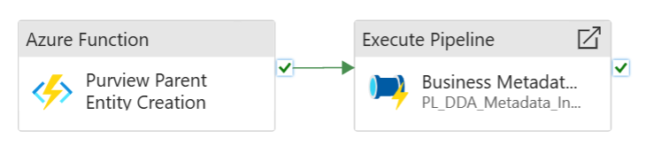
|  |

#### **Purview Parent Entity Creation**

The function app is used to ingest super types in Purview. It fetches parent type details from input templates and then it uses data ingestion APIs such as Asset Type APIs, to ingest parent types into Purview.

-   Verify that the ingestion is complete and accurate.

-   Ensure that the Pipeline is configured to access the necessary data.

#### Super Types Template

Super types, also known as parent types, define hierarchical relationships between various data asset types, grouping related assets under broader categories for better organization and understanding.

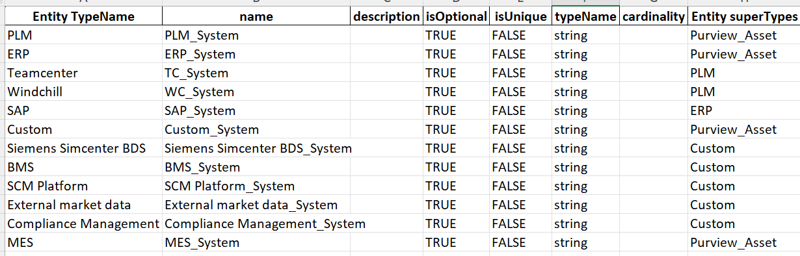

#### 

### Business Metadata Pipeline

The PL_DDA_Metadata_Ingestion pipeline is designed to ingest metadata essential for data management in Microsoft Purview. It serves as the initial step in triggering the Metadata Pipeline, which extracts metadata from various sources and loads it into the system. The ingested metadata includes critical details such as entity types, managed attributes, and relationships between entity types required for cataloguing in Purview.\
The key considerations are:

-   Ensure that metadata sources are accurately configured and accessible.

-   Verify that the Metadata Pipeline is properly set up and has the necessary permissions to retrieve and process data from the defined sources.

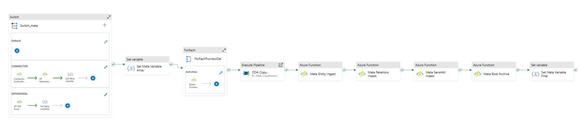

##### Parameters

| **Parameter Name** | **Type** **Description** **Default Value** |
| --- | --- |
| Source System | String Specifies the source system from which metadata and data instances are ingested. SAP |
| Entity Prefix | String Defines a prefix for entities, used for naming and identification purposes. BST3 |
| Metadata Approach | String Determines the approach used for metadata ingestion. Options include \'Connector\' and \'Data model\'. Connector |

##### 

#### 

##### Execution

The Metadata Pipeline consists of several activities that work together to process and ingest metadata.

Each activity is described below.

##### 

#### Switch / Switch Meta

###### 

##### Purpose

Determine the appropriate metadata ingestion approach based on the input parameter and convert the Json response into required metadata formats.

###### Functionality

-   Evaluates the \"Metadata Approach\" parameter to decide which branch of the pipeline to execute.

-   Supports multiple approaches such as Connector, and Data Model.

-   Using custom Azure function converts the specified approach Json response into required purview metadata formats and stores it in a data transformation container in Azure blob storage.

######  Importance

-   Allows for flexible metadata ingestion strategies depending on the data source and requirements.

-   Enables the pipeline to handle various metadata formats and sources efficiently.

######  Configuration

-   Set up cases for each approach in the Switch activity.

-   Ensure that the default case is properly configured to handle unexpected inputs.

##### 

#### 

##### ForEach / Entity Types Deletion

> 
>
> **Purpose**
>
> Delete the input entity types that are already present in Microsoft Purview to avoid duplication or conflicts during ingestion.
>
> **Functionality**

-   Iterates through all input entity types specified in the metadata.

-   For each entity type, call Purview\'s built-in deletion APIs to remove the corresponding entity types from Purview.

-   Ensures that the system is clean and prepared for fresh metadata ingestion.

> **\
> Importance**

-   Prevents duplication or inconsistencies in the metadata catalog caused by re-ingestion of existing entity types.

-   Ensures metadata ingestion processes start with a clean slate.

> **\
> Configuration**

-   A list of input entity types to be deleted is provided as part of the metadata ingestion input.

-   For each activity loops through the list of input entity types.

-   Configured to handle the deletion of each entity type independently.

**Execute Pipeline / Copy Container (PL_DDA_Copyfrommultiplecontainer)**

###### 

##### Purpose 

Transfer metadata from the source container i.e. data transformation to the destination container i.e. data ingestion in Azure blob storage.

###### Functionality 

-   Copies metadata files from the Data Transformation container to the Data Ingestion container in Azure Blob Storage.

-   Ensures that the processed metadata is in the correct location for ingestion Copies metadata files from the Data Transformation container to the Data Ingestion container in Azure Blob Storage.

-   Ensures that the processed metadata is in the correct location for ingestion

######  Importance 

-   Acts as a crucial intermediary step, separating the transformation and ingestion processes.

-   Allows for potential validation or additional processing before final ingestion.

######  Configuration 

-   Set up the source and destination-linked services for Azure Blob Storage.

-   Configure the copy activity to handle the specific file formats used for metadata.

**Business Metadata Ingestion / Azure Functio****n**

###### Purpose 

Ingest the prepared metadata (entity types, relationships, managed sensitive attributes) into Microsoft Purview.

###### Functionality 

-   Calls a custom Azure Function that interfaces with Purview\'s Data Ingestion APIs.

-   Processes the metadata files from the Data Ingestion container and ingests the respective metadata into purview.

-   After ingestion, the input metadata files from the blob data ingestion container will be archived into the archive container.

######  Importance 

-   Serves as the core integration point between ADF and Purview.

-   Handles the complexities of Data ingestion API, including authentication and data mapping.

######  Configuration 

-   Develop and deploy the Azure Function with proper error handling and logging.

-   Ensure the function has the necessary permissions to access both Azure Blob Storage and Purview.

**Set Variable / Meta Variable**

###### Purpose 

Update a pipeline variable with the result of the metadata ingestion.

###### 

##### Functionality 

-   Captures the metadata output from the DI Metadata Ingest function.

-   Sets the value of \"MetaVariable4\" for potential use in subsequent pipeline steps or for logging purposes.

######  Importance 

-   Enables pipeline orchestration based on the success or failure of metadata ingestion.

-   Provides a mechanism for passing information between pipeline activities.

######  Configuration 

-   Define the variable \"MetaVariable4\" at the pipeline level.

-   Configure the Set Variable activity to capture the relevant output from the Azure Function.

######  Use Cases 

-   Conditional execution of subsequent steps based on metadata ingestion results.

-   Logging and monitoring of pipeline execution status.

-   Passing metadata ingestion details to the data instance ingestion process.

[]\{#_Toc208492793 .anchor\}

#### Approach-Specific Activities

###### 

#### Connector Approach

###### Execute Connector

-   Fetches metadata (entity types, relationships) from source systems using appropriate connectors.

-   Configures and executes the specific connector based on the source system type.

-   Handles authentication and connection management with the source system.

-   Prepare additional details like managed sensitive attributes for respective sources.

###### Data Transformation

-   Deletes the input entity types that are already present in Microsoft Purview to avoid duplication or conflicts during ingestion.

-   Convert the metadata responses into purview-supported metadata formats.

-   Prepares the corresponding metadata files for ingestion into Purview.

###### Data Ingestion

-   Using Data ingestion APIs ingest the prepared business metadata into purview.

#####  Data Model Approach

###### DT Data model

-   Fetches metadata (entity types, relationships) from ER diagrams or external files.

-   Adds additional details managed attributes, relationships templates.

###### Data Transformation

-   Deletes the input entity types that are already present in Microsoft Purview to avoid duplication or conflicts during ingestion.

-   Convert the metadata responses into purview-supported metadata formats.

-   Prepares the corresponding metadata files for ingestion into Purview.

###### Data Ingestion

-   Using Data ingestion APIs ingest the prepared business metadata records into Purview.

### 

## Business Data Instance Execution Check

**Purpose:** To ingest data instances into Postgres using the ingested metadata.

**Pipeline Name:** PL_DDA_DataInstance_Ingestion

**Description:** This step triggers the Data Instance Pipeline. It ingests actual data instances into the Postgres database, leveraging the previously ingested metadata for accurate registration and management.

**User Actions:**

-   Verify that the metadata ingestion is complete and accurate.

-   Ensure that the Data Instance Pipeline is configured to access the necessary data instances.

-   Monitor the pipeline execution to confirm the successful ingestion of data instances.

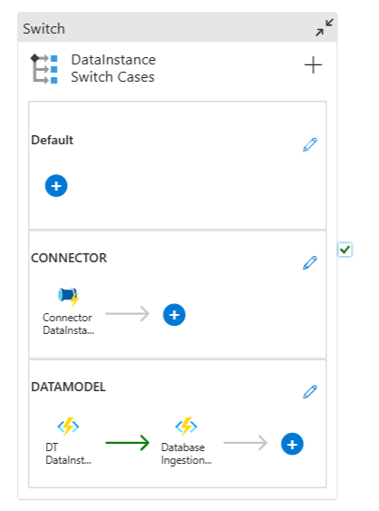

#### Parameters

| **Parameter Name** | **Type** **Description** **Default Value (SAP)** |
| --- | --- |
| Source System | String The source system from which the metadata will be extracted. SAP |
| Entity Prefix | String A prefix that is added to the entity names during metadata ingestion. BST3 |
| Collection Name | String The name of the collection to be used for metadata ingestion. BST3 |
| Data Instance Approach | String Approach to data instance ingestion. Possible values are \"Connector\", \"DataModel\", \"Connector and Data Mode\", \"Bulk Exports\" Connector |
| List Of Entities | String A comma-separated list of entities to be ingested. Customer, ListOfServices |
| Entities Array | Array An array of entity objects. Each object can have properties like name, type, and description. Customer, ListOfServices |
| Modified After | String The datetime after which the data instances will be ingested. 50 |
| Limit | Int The maximum number of records to be retrieved during data instance ingestion. 0 |

#### Execution

The Data Instance Pipeline consists of several activities that work together to process and ingest data instances. Each activity is described below:

##### Switch / DataInstance_Switch_Cases

###### Purpose

Determines the appropriate data instance ingestion approach based on the input parameter and converts the Json response into the required bulk entities format.

###### Functionality

-   Evaluates the \"DataInstance_Approach\" parameter to decide which branch of the pipeline to execute.

-   Supports multiple approaches such as Connector, and Data Model Approaches.

-   Convert the specific approach Json response into required bulk Entities format, due to dependency adding the additional details like respective source technical relations, managed attributes, and related glossary terms from lookup tables and store into data transformation container of azure blob storage.

-   Copies data instance files from the Data Transformation container i.e. data transformation to the Data Ingestion container i.e. data ingestion in Azure Blob Storage.

-   Ensures that the processed data instances are in the correct location for ingestion.

######  Importance

-   Allows for flexible data instance ingestion strategies depending on the data source and requirements.

-   Enables the pipeline to handle various data formats and sources efficiently.

######  Configuration

-   Set up cases for each supported approach in the Switch activity.

-   Ensure that the default case is properly configured to handle unexpected inputs.

-   Set up the source and destination-linked services for Azure Blob Storage.

-   Implement error handling and logging for the copy process.

##### Data Instance Ingestion

###### Purpose 

Ingest the prepared data instances into Postgres.

###### Functionality 

-   Calls a custom Azure Function that interfaces with Postgres insertion commands.

-   Processes the data instance files from the Data Ingestion container.

-   Imports the data instances into Postgres, associating them with the correct metadata entities.

######  Importance 

Serves as the core integration point between ADF and Postgres for data instance ingestion.

######  Configuration 

-   Develop and deploy the Azure Function with proper error handling and logging.

-   Ensure the function has the necessary permissions to access both Azure Blob Storage and Postgres.

-   Implement retry logic for resilience against transient failures.

#####  Lookup Tables

The lookup tables for adding additional details to each business data instance are described below.

These tables help enrich each business data instance with additional, structured information, ensuring consistency and improving data governance.

-   **Assign Glossary Terms Table:** Links business data instances to relevant glossary terms. This helps maintain consistency and clarity by referencing predefined business terminologies

-   **Technical Metadata Table:** Links business data instances to respective technical metadata. It Contains a table structure of business data instances.

-   **Managed Attributes Table:** Contains predefined sensitive attribute information that can be associated with business data instances.

###### Technical Metadata Relations

| **Connector based TC Entities** | **Equivalent Technical Table** |
| --- | --- |
| Dtt5_SealingRevision | PDTT5_SEALINGREVISION |
| Dtt5_ElectriPartRevision | PDTT5_ELECTRIPARTREVISION |
| Dtt5_LubricantRevision | PDTT5_LUBRICANTREVISION |
| Dtt5_RotatngPartRevision | PDTT5_ROTATNGPARTREVISION |
| Dtt5_PwrTranPartRevision | PDTT5_PWRTRANPARTREVISION |
| Dtt5_FastenerPrtRevision | PDTT5_FASTENERPRTREVISION |
| Dtt5_EngMfgPartRevision | PDTT5_ENGMFGPARTREVISION |
| Item | PITEM |
| ItemRevision | PITEMREVISION |
| ProblemReport | \- |
| ChangeRequestRevision | \- |
| ChangeRequest | \- |
| Part | PPART |
| PartRevision | PPART_0_REVISION_ALT |
| ChangeNotice | \- |
| ChangeNoticeRevision | \- |
| EPMTask | PEPMTASK |
| DocumentRevision | PDOCUMENTREVISION |
| ##### | Assign Glossary Terms |
| **typeName** | **name** **\[Relationship\] meaning** |
| workflow | WorkflowStatus PLM_workflow |
| vendorPartNumber | Product Family ID PLM_product family |
| vendorPartNumber | Part Number PLM_part |
| task | ApprovalQuorrom PLM_approval |
| supplier | Product Family ID PLM_product family |
| requirements | Product Family ID PLM_product family |
| productGrouping | Product Family ID PLM_product family |
| product | Product Family ID PLM_product family |
| problemReportRevision | Revision PLM_revision |
| partRevision | PartID PLM_part |
| partRevision | Revision PLM_revision |
| part | AssemblyIndicator PLM_assembly |
| Form | FormDefinitionFile PLM_form |
| feature | Product Family ID PLM_product family |
| ebom | FindNumber PLM_find number |
| ebom | ReferenceDesignator PLM_reference designator |
| DrawingRevision | Revision PLM_revision |
| documentRevision | DocumentID PLM_document |
| documentRevision | Revision PLM_revision |

###### Managed Attributes

| **category** | **group name** **description** **attribute description** **attribute name** **typeName** **applicableEntityTypes** |
| --- | --- |
| BUSINESS_METADATA | Sensitive_Attributes Identifier linking the test to a specific manufacturing batch batchid batchid string BLI1_labTest |
| BUSINESS_METADATA | Sensitive_Attributes Identifier linking the sample to a specific manufacturing batch batchid batchid string BLI1_labSamples |
| BUSINESS_METADATA | Sensitive_Attributes Identifier linking the result to a specific test conducted testid testid string BLI1_labTestResults |
| BUSINESS_METADATA | Sensitive_Attributes Unique identifier for each test result resultid resultid string BLI1_labTestResults |
| BUSINESS_METADATA | Sensitive_Attributes Specific parameters or conditions defined for the analysis analysisparameters analysisparameters string BLI1_labTestAnalysis |

#### 

### Approach-Specific Activities

##### 

#### Connector Approach 

###### Execute Connector: 

-   Fetches data instances from source systems using appropriate connectors.

-   Configures and executes the specific connector based on the source system type.

-   Handles authentication and connection management with the source system.

###### Data Transformation: 

-   Adds additional details like managed attributes, relationships, and technical relationships from the lookup table.

-   Performs any necessary data cleansing or formatting.

-   Prepares the data for ingestion into Postgres.

###### Data Ingestion: 

-   Using Data ingestion APIs ingest the prepared instance records into the Postgres database.

#####  Data Model Approach 

###### DT Data model: 

-   Fetches instances from ER diagrams or external files.

-   Parses and interprets the data model information.

-   Extracts relevant data instance information from the model.

###### Data Transformation: 

-   Adds additional details managed attributes, and relationships, and prepares data for ingestion.

-   Maps the extracted data to the required bulk entities format.

###### Data Ingestion: 

-   Using Data ingestion APIs ingest the prepared instance records into Postgres.

#### Troubleshooting

When encountering issues with the end-to-end metadata and data instance ingestion process, follow these troubleshooting steps.

##### Pipeline Execution Failures:

-   Review the ADF pipeline run logs for detailed error messages.

-   Check if all prerequisites are met and source systems are accessible.

-   Verify that all pipeline parameters are correctly set.

##### Metadata Ingestion Issues:

-   Ensure that the metadata sources are properly configured and accessible.

-   Check the output of the Metadata Pipeline for any error messages or warnings.

##### Data Instance Ingestion Problems:

-   Confirm that the metadata ingestion was successful before attempting data instance ingestion.

-   Check the source system connectivity and ensure all required permissions are in place.

-   Verify that the data instance format matches the ingested metadata schema.

#####  Azure Function Errors:

-   Review Azure Function logs for detailed error messages and stack traces.

-   Ensure all necessary configuration settings (connection strings, API endpoints) are correctly set.

-   Test functions locally using Azure Functions Core Tools for more detailed diagnostics.

##### Performance Issues:

-   Analyze pipeline execution times and look for activities that are taking longer than expected.

-   Consider optimizing data extraction queries or increasing resource allocation if necessary.

-   Monitor Azure resource utilization and scale up resources if they are consistently at high utilization.

##### Ingestion Status Reporting Issues: 

-   Verify that the Azure Blob Storage container for status reporting is accessible and properly configured.

-   Check permissions for writing to the Excel file in the blob container.

-   Review the Excel file contents to ensure data is being correctly appended and not overwritten.

-   If status updates are missing, check the logging in the corresponding pipeline steps for any errors in writing to the Excel file.

### 

## Tech Meta Exec check for SAP Ingest

The PL_DDA_TechMeta_SAP_Ingestion pipeline is used to ingest the technical metadata for sources that are not supported or have heavy requirements to register in purview. For data sources not directly supported by Purview, we employ a custom approach using ADF pipelines and Azure Functions to extract, transform, and ingest technical metadata.

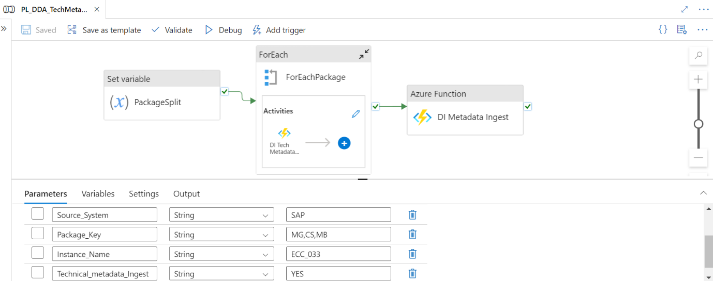

#### ADF Pipeline Flow

The ADF pipeline for unsupported sources involves several steps to process and ingest metadata from sources like SAP ECC. Each step is explained below.

| Step | Purpose Process |
| --- | --- |
| Set Variable - Package Split | Prepare the input data for processing by splitting the package key. This activity takes the input Package Key parameter (e.g., MG, CS, MB). It splits this string into an array of individual package components. The resulting array is stored in a variable for use in subsequent steps. |
| For Each - For Each Package | Iterate through each package component to process its metadata individually. This activity loops through the array created in the previous step. For each package component, it triggers a nested activity. |
| Nested Activity - Azure Function - DI Tech Metadata | Extract and process technical metadata for the current package. This function connects to the source system (e.g., SAP ECC) using appropriate connectors or APIs. It extracts relevant technical metadata based on the package details. The function then transforms this metadata into a format compatible with Purview\'s data model. Processed metadata is returned to the ADF pipeline for further handling. |
| Azure Function - DI Metadata Ingest | Ingest the processed metadata into Purview using Data Ingestion APIs. This function takes the processed metadata from the previous steps as input. The function retrieves Data Ingestion API credentials from Azure Key Vault. It then uses these credentials to obtain an access token from Azure Active Directory. It authenticates with the access token. The function then uses Data Ingestion APIs to ingest the technical metadata. It handles any necessary error checking and retries. Upon successful ingestion, it returns a status report to the ADF pipeline. |

#### 

### Execution

Follow these detailed steps to set up and execute the pipeline for unsupported sources:

##### Set Up Pipeline Parameters: 

-   In the Azure portal, navigate to your ADF instance and open the pipeline PL_DDA_TechMeta_SAP_Ingestion.

-   Go to the \'Parameters\' tab and configure the following:

    -   Source_System: Specify the source system type (e.g., SAP)

    -   Package_Key: Enter the package key components, separated by commas (e.g., MG, CS, MB)

    -   Instance_Name: Provide the instance name of your source system (e.g., ECC_033)

    -   Technical_metadata_Ingest: Set this to \'YES\' to enable technical metadata ingestion.

#####  Run the Pipeline: 

-   After configuring the parameters, click \'Debug\' or \'Trigger Now\'.

-   In the run dialog, review and confirm the parameter values.

-   Click \'OK\' to start the pipeline execution.

#####  Monitor Ingestion Progress: 

-   While the pipeline is running, monitor its progress in the ADF monitoring view.

-   Pay attention to the execution of each activity, especially the Azure Functions.

-   Once the ADF pipeline is completed, verify the successful execution of all steps.

-   Log in to the Purview portal and navigate to the \'Assets\' section.

-   Search for the ingested metadata using relevant identifiers from your source system.

-   Verify that the technical metadata has been correctly ingested and classified in Purview.

### 

## 

### Tech Meta Exec check Purview Trigger

The PL_DDA_Trigger_TechMeta_Scan triggers the registered data sources scan to ingest technical metadata of the corresponding source into purview. This provides comprehensive guidance on triggering data source scans to ingest technical metadata into purview using purview atlas APIs.

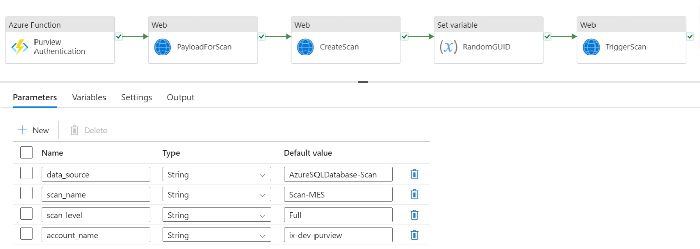

#### ADF Pipeline Flow for Supported Sources

The ADF pipeline for supported sources orchestrates the process of authenticating with Purview, preparing scan payloads, and triggering scans. Each step is described below.

| **Step** | **Name** **Purpose** **Process** |
| --- | --- |
| 1 | Azure Function - Purview Authentication Securely authenticate with Purview to ensure authorized access for subsequent operations. The function retrieves Purview credentials from Azure Key Vault. It then uses these credentials to obtain an access token from Azure Active Directory. The access token is returned for use in subsequent steps. |
| 2 | Web Activity - Payload for Scan Prepare the necessary payload for initiating a scan in Purview. It uses the authentication token. This activity constructs a JSON payload containing scan details such as Data source name and type, Scan rule set name, and Scan schedule (if applicable). The payload is formatted according to Purview\'s API requirements. |
| 3 | Web Activity - create Scan Use the prepared payload to create a new scan definition in Purview. This activity makes an HTTP POST request to Purview\'s API. It uses the authentication token from step 1 and the payload from step 2. The API response, including the scan ID, is captured for use in subsequent steps. |
| 4 | Set Variable - Random GUID Generate a unique identifier for the scan run. This step uses an expression to generate a random GUID (Globally Unique Identifier). The GUID ensures that each scan run can be uniquely identified and tracked. |
| 5 | Web Activity - Trigger Scan Initiate the actual scan process in Purview using the created scan definition. This activity makes an HTTP POST request to Purview\'s scan trigger API. It includes the scan ID from step 3 and the GUID. The API response confirms the successful triggering of the scan. |

#### 

### Execution

Follow the steps below to set up and execute the pipeline for supported sources.

1.  **Set Up Pipeline Parameters**:

    A.  Navigate to ADF pipeline PL_DDA_Trigger_TechMeta_Scan in the Azure portal.

    B.  Locate the \'Parameters\' tab and configure the following:

        1.  data source: Specify the type of data source (e.g., Azure SQL Database-Scan)

        2.  scan name: Provide a descriptive name for your scan (e.g., Scan-MES)

        3.  scan level: Choose the depth of the scan (e.g., Full)

        4.  account name: Enter your Purview account name (e.g., ix-dev-purview)

2.  **Run the Pipeline**:

    A.  Once parameters are configured, navigate to the \'Author\' tab in ADF.

    B.  Locate your pipeline and click \'Debug\' or \'Trigger Now\' to execute it.

    C.  Confirm the parameter values in the run dialog and initiate the pipeline.

3.  **Monitor Scan Progress**:

    A.  While the pipeline is running, you can monitor its progress in the ADF monitoring view.

    B.  Once the ADF pipeline is completed, log in to the Purview portal.

    C.  Navigate to the \'Data sources\' section and find your registered data source.

    D.  Check the \'Scans\' tab to view the status and results of your triggered scan.

    E.  You can also view detailed scan logs and any discovered assets in the respective Purview sections.

#### 

### Troubleshooting

When encountering issues with the technical metadata ingestion process, follow these troubleshooting steps:

##### 

#### Scan Failures for Supported Sources

1.  Verify integration runtime status

    A.  Check if the IR is running and can communicate with both the source system and Azure.

    B.  Review IR logs for any connection or authentication errors.

2.  Validate connection settings

    A.  Ensure all connection strings and credentials in Key Vault are correct and up to date.

    B.  Test the connection directly from the IR to isolate network or firewall issues

3.  Check Purview permissions and verify that the service principal or managed identity used has appropriate permissions in Purview.

##### API Ingestion Issues for Unsupported Sources

1.  Verify payload format

    A.  Review the JSON payload being sent to Data Ingestion APIs.

    B.  Ensure all required fields are present and correctly formatted

2.  Check authentication

    A.  Confirm that the authentication token used in API calls is valid and not expired.

    B.  Verify that the account used has the necessary permissions in Purview.

##### Azure Function Errors

1.  Review function logs

    A.  Check Azure Function logs for detailed error messages and stack traces.

    B.  Look for any exceptions related to data processing or API calls.

2.  Verify function app settings

    A.  Ensure all necessary configuration settings (connection strings, API endpoints) are correctly set.

    B.  Test functions locally

3.  Use the Azure Functions Core Tools to run and debug functions locally for more detailed diagnostics.

#####  ADF Pipeline Failures

1.  Analyze pipeline run details

    A.  In the ADF monitoring view, drill down into failed activities for error details.

    B.  Check if failures are consistent or intermittent.

2.  Verify dataset connections:

    A.  Ensure all linked services and datasets in ADF are correctly configured.

    B.  Test connections directly from ADF to isolate any connectivity issues.

3.  Check activity timeout settings and adjust timeout settings for long-running activities if necessary.

##### Performance Problems

1.  Analyze pipeline execution times:

    A.  Look for activities that are taking longer than expected.

    B.  Consider optimizing data extraction queries or increasing resource allocation.

2.  Monitor Azure resource utilization:

    A.  Check CPU, memory, and I/O metrics for Azure Functions and ADF.

    B.  Scale up resources if they are consistently at high utilization.

##### Purview-specific Issues

1.  Check Purview scan logs and review detailed scan logs in Purview for any errors or warnings.

2.  Verify asset model and ensure the Purview asset model is correctly set up for your metadata

3.  Test API connectivity and use API testing tools like Postman to verify connectivity and permissions.

### 

## Glossary Execution Check

The Glossary Execution Check Pipeline is designed to manage the ingestion of glossary terms into Microsoft Purview and to trigger the corresponding Glossary Pipeline. This pipeline is responsible for handling glossary term ingestion by fetching the required terms from predefined input templates and utilizing Purview\'s Data Ingestion APIs, such as the Glossary-Terms API, to populate the Purview catalog with these terms.

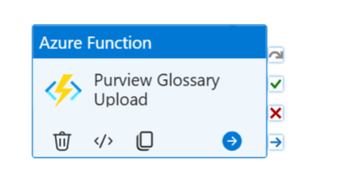

#### Parameters

| **Parameter Name** | **Type** **Description** **Default Value** |
| --- | --- |
| CreateGlossary | String If yes, it will trigger glossary terms API to ingest glossary terms Yes |

#### Glossary Terms Template

Glossary terms represent business vocabulary shared across the organization, standardizing the language used to describe data assets and making it easier for different teams and stakeholders to communicate effectively.

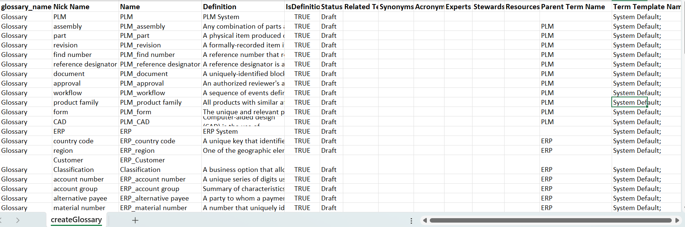

#### Execution

-   **Input Template Validation**

    -   Validate the format and structure of the input templates containing glossary terms.

    -   Ensure templates are placed in the correct source location (e.g., Azure Blob Storage).

-   **Fetch Glossary Terms**

    -   Extract glossary terms from the input templates using appropriate activities in the pipeline (e.g., Lookup or Copy activities).

    -   Parse the glossary term details to match the schema requirements for ingestion.

-   **Transform Glossary Data**

    -   If necessary, transform glossary data (e.g., mapping attributes to Purview-specific fields) to align with the Glossary-Terms API\'s expected format.

    -   Save the transformed data into an intermediate storage container (e.g., Data Transformation container).

-   **Ingest Glossary Terms into Purview**

    -   Call the Glossary-Terms API for each glossary term in the transformed dataset.

    -   Use a loop or batch process to ingest all terms while ensuring API limits are respected.

    -   Capture API responses (success/failure) for each term and store logs for further analysis.

-   **Verify Ingestion**

    -   Validate that all glossary terms have been ingested successfully by querying Purview.

    -   Cross-check the ingested terms against the input template to ensure completeness.

####  Troubleshooting

-   **Validate Input Template**:

-   Ensure the input template contains all required fields like term name, description, and other relevant metadata.

-   **Check API Authentication**:

-   Ensure the service principal or authentication token used in the pipeline has the necessary permissions.

-   Confirm that the authentication credentials are valid and not expired.

-   **Verify Glossary Term Ingestion**:

-   After the ingestion step, confirm that all glossary terms are visible in Purview.

-   If terms are missing, verify the data being passed to the ingestion API is complete and formatted correctly.

-   **Inspect Pipeline Execution Logs**:

-   Review the pipeline execution logs to identify any errors or failures during the execution.

-   Check for any skipped activities or misconfigurations in the pipeline setup.

### 

## Data Quality for DC Execution Check

Purpose: To extract, transform, validate, and analyze data quality

Pipeline Name: PL_DQ_datacatalog_LogicApp

Description: The pipeline integrates various Azure services and open-source tools to extract, transform, validate, and analyze data quality at every stage.

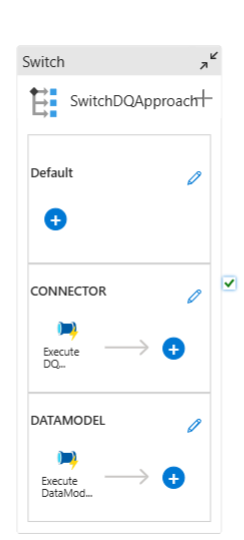

####  Connector

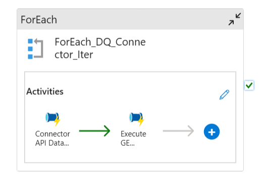

####  Data Model

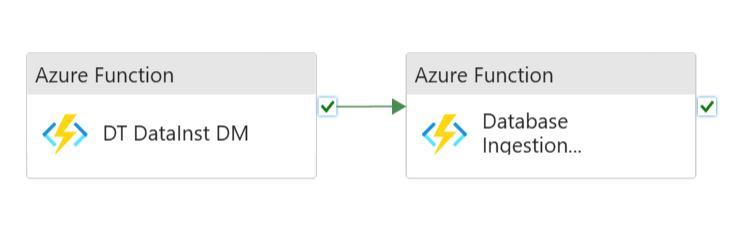

#### 

### Parameters

The table below is an example of the values for an SAP Data quality validation for Bom Header.

| **Parameter Name** | **Type** **Description** **Default Value** |
| --- | --- |
| sourcesystem | String Specifies the source system from which metadata and data instances are ingested. SAP |
| entitytypes | String Defines the types of entities involved in the data quality check. bomHeader |
| entityprefix | String Defines a prefix for entities, used for naming and identification purposes. BST3 |
| collectionname | String Indicates the collection name to which the ingested data belongs. BST3 |
| checkpointname | String Specifies the name of the checkpoint used in data ingestion to track progress or state. ix_dt_datainstance_bomheader |

#### Execution

1.  Switch DQ Approach - Determines the appropriate approach based on the input parameter

2.  Data Extraction - Based on the approach it will extract the data instances from connector source systems or custom data model files.

3.  Data Transformation

    A.  Azure Functions process and transform the extracted data.

    B.  Transformed data is stored in Azure Blob Storage.

4.  Data Quality Checks

    A.  Great Expectations library performs data validation based on predefined \"expectations\".

        1.  Parameter: checkpoint name (default: ix_dt_datainstance_bomheader)

        2.  Logic App tracks the generation of Great Expectations response files.

    B.  Custom Quality Metrics: The \"Calculate Data Quality\" step applies organization-specific quality assessments.

    C.  Quality Metrics Storage: Results from data quality checks are stored in a PostgreSQL database for historical tracking and analysis.

    D.  Monitoring and Reporting: Query Engine API allows downstream systems to access and visualize data quality information.

#### 

### Approach-Specific Activities

##### Connector Approach

###### Data Extraction

> The Connector API securely fetches data from the source system (e.g., SAP, TC, and MES).

###### Data Transformation

> Azure Functions process the retrieved data and transform it into the desired format. The transformed data is then stored in Azure Blob Storage for further processing.

###### Data Quality Checks

> The pipeline applies Great Expectations to perform data validation against predefined expectations.

###### Custom Quality Metrics

> The organization\'s specific data quality assessments are applied to ensure that the data is aligned with business requirements.

###### Monitoring and Reporting

> The Query Engine API allows downstream systems to access the data quality information for further analysis and visualization.

#####  Data Model Approach

###### Data Extraction

> Data instances are extracted from the ER Diagram or custom files. This can include structured data representations such as XML, CSV, JSON, or any proprietary format that adheres to the organization\'s modeling conventions.

###### Data Transformation

> Azure Functions process and transform the raw data, converting it into a standardized format that can be evaluated for quality. The transformed data is then stored in Azure Blob Storage.

###### Data Quality Checks

> Like the Connector approach, Great Expectations is used to validate the data against predefined expectations based on the data model and its expected structure.

###### Custom Quality Metrics

> Organization-specific data quality checks are applied to evaluate the correctness, completeness, and consistency of the data based on the data model.

###### Monitoring and Reporting

> As with the Connector approach, the Query Engine API ensures that downstream systems have access to the data quality information for ongoing monitoring and reporting.

#### Troubleshooting

1.  Connector Issues - Verify source system availability and credentials validity.

2.  Transformations errors - Check Azure function logs for detailed error messages and corresponding resolution.

3.  Quality Check Failures - Review Great Expectations results and custom quality metric outputs to identify specific data quality issues.

4.  Storage Problems - Ensure sufficient capacity in the Azure Blob Storage and PostgreSQL database.

5.  Quality Assurance Review -

    A.  After pipeline completion, review the data quality metrics stored in the PostgreSQL database.

    B.  Utilize the Query Engine API to visualize and analyze the data quality trends over time.

6.  Issue Resolution -

    A.  Investigate source data and transformation processes for failed quality checks.

    B.  Update \"expectations\" or custom quality metrics as needed to reflect evolving data quality standards.

#### 

### Automatic Lineage Tracking

Our system includes an advanced Automatic Lineage Tracking feature, designed to enhance data governance and traceability across various systems. This functionality provides users with a comprehensive view of data lineage, making it easier to understand data flow, origins, transformations, and dependencies within the organization.

##### Usage

-   **Accessing Lineage Information:**

    -   Navigate to any data instance page within the Data Catalog UI.

    -   Click on the Lineage tab.

-   **Triggering Lineage Tracking:**

    -   The system automatically triggers the corresponding system lineage API based on the instance being viewed.

    -   The system name is determined from the generic system attributes group associated with the instance, which contains a specific attribute indicating the system (e.g., SAP, Teamcenter).

-   **Sending Inputs to Query Engine:**

    -   The Data Catalog UI sends the necessary inputs, including the asset type and instance ID, to the Query Engine.

-   **Calling the Connector Lineage API:**

    -   The Query Engine determines which connector lineage API to call based on the system name.

    -   It then calls the appropriate connector lineage API, passing the asset type and instance ID.

-   **Presenting Lineage Data:**

    -   The aggregated lineage data is sent back to the Data Catalog UI.

    -   The information is presented to the user in a visual format, typically as a graph, showing relationships and data flow between different assets across various systems.
