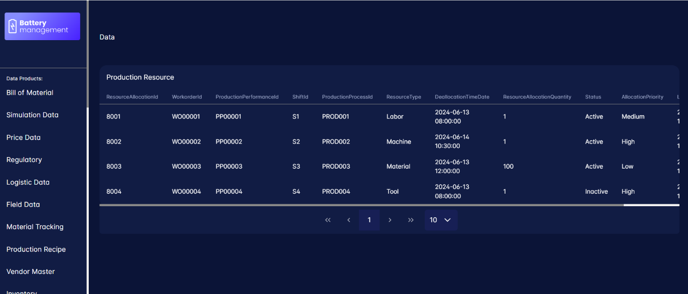
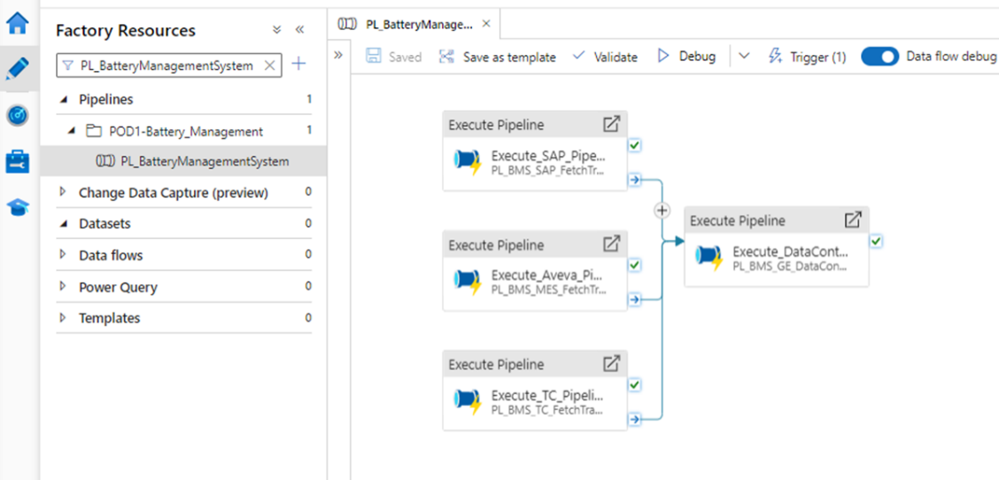

Digital Thread Foundations

Data Products

OVERVIEW

Release: 1.2

Metadata Table

| **Field** | **Value** |
| --- | --- |
| **Asset / Solution Name** | Digital Thread |
| **Domain / Area** | Engineering |
| **Owner (Team/Person)** | Karthik Ramachandra |
| **Reviewers** | Karthik Ramachandra |
| **Status** | Approved / Complete |
| **Confidentiality** | Internal / Confidential |
| **Source of Truth** | [link](https://dev.azure.com/IXAssets/IXAssetsProject/\_git/ixassets) |
| **Related Assets / Alternatives** | AOT / Engineering Orchestration / Engineering Agents |

## Introduction

A digital thread refers to the continuous and consistent flow of information throughout the entire lifecycle of a product or system - from design and development to operation and maintenance. It enables the integration of data from different stages and sources, allowing effective traceability, seamless collaboration, and efficient decision-making by unleashing the power of sleeping data. The digital thread is considered a key aspect of Industry 4.0 and the digital transformation of the manufacturing industry. It is the core of what we call the Enterprise Operating System (EOS). Digital Thread is a communication framework that helps integrate various enterprise systems involved in the engineering and manufacturing product life cycle.

A data product is a digital product that supplies information or knowledge to clients, usually in an organized and uniform structure. Data products are created to satisfy specific business requirements or to address particular issues, and they can serve as the foundation for decision-making, operational enhancement, or the generation of new revenue streams. IX Digital Thread Foundations enables the creation of reliable and efficient data products.

The data products created for Digital Thread Foundations enable the creation of an end-to-end data management system by ingesting data from various sources, virtualizing, and exposing them via APIs for consumption by client applications or dashboards.

The solution provides real-time or near-real-time data updates, ensures data quality and security through data governance policies, and tracks data lineage.

The benefits include:

-   Unified view of data (such as battery-related data) from multiple sources

-   Real-time data updates and monitoring

-   Improved data quality and security

-   Enhanced decision-making

-   Increased efficiency through automated data pipelines and APIs

-   Better data management and governance

Overall, the solution aims to provide a comprehensive system that leverages the capabilities of IX Thread foundations to integrate data from various sources, ensure data quality and security, and enable predictive modeling for informed decision-making.

###  Purpose

This document provides a component-based overview of IX Digital Thread\'s data products.

### Target Audience

Software architects, developers, and integrators with IT backgrounds.

### Related Links

-   [Digital Thread Foundations Documentation](https://industryxdevhub.accenture.com/asset-home;search_text=ix%20digital%20thread)

### Business Contacts

-   [[florian.tournier@accenture.com]](mailto:florian.tournier@accenture.com)

-   [[laura.mosconi@accenture.com]](mailto:laura.mosconi@accenture.com)

-   [[karthik.ramachandra@accenture.com]](mailto:karthik.ramachandra@accenture.com)

### Technical Contacts

-   [[laura.mosconi@accenture.com](mailto:laura.mosconi@accenture.com)]

-   [[janos.puskas@accenture.com](mailto:janos.puskas@accenture.com)]

-   [[zsolt.tofalvi@accenture.com](mailto:zsolt.tofalvi@accenture.com)]

-   [[stefano.giacco@accenture.com](mailto:stefano.giacco@accenture.com)]

## Background

### Challenges

The following challenges exist today:

-   Industrial software systems such as PLM, ERP, MES, etc. currently function in silos

-   Lack of interaction and real-time coherence in the flow of data among them

-   Considerable manual effort is required to create a consolidated view of data residing across various systems

### Impact

The impact of the above challenges includes:

-   Considerable amount of time and effort spent in data management

-   Negative impact on operations and profitability

-   Inefficient change management

-   Lack of reusability of data present across systems

-   Decreased product quality due to limited control

-   Loss of real-time information change update

-   Increased time and effort searching for the right data on the right system

**\
**

### Solution

Digital Thread\'s data product use cases will include the following key features to optimize data management and operations:

-   Real-time data change on source systems like ERP, PLM, MES, etc., to be conveyed accurately across the data thread

-   A consolidated view of data availability across the different software systems, their interactions, and interrelationships

-   Highly flexible and scalable solution to serve a variety of industries and data objects with robust connectivity

-   Providing end-users the capability of utilizing combined and structured bodies of data for various purposes, one of them being building dashboards and visualizations of the industrial data

### Value

The solution delivers the following business KPIs:

-   A leaner organization with optimized data management saving time, effort, and cost across the life cycle

-   Economies of scale and scope by end-to-end data workflow and transformation consolidation

## Data Contracts 

To create a data product, data from various source systems such as Siemens Teamcenter (PLM), SAP ECC (ERP), AVEVA MES, and various other industrial platforms is retrieved and shown in the data catalog through data pipelines. The end-user examines the metadata, schema, and overall information available on the data catalog to match their data needs with the resources provided by these source systems via IX Digital Thread. Thus, it is imperative to outline a user or client\'s data needs by creating a data contract.

A data contract constitutes of

-   Data attribute requirements

-   System specification for the said attributes

-   Data quality check terms and conditions

An example data contract for a data product created by IX Digital Thread (Battery Management System use case) is depicted below.

1.  Data Refresh: Data needs to be refreshed every 2 hours.

2.  BOM ID Validation: BOM ID must not be NULL or empty in any record in PLM or ERP systems. Records with NULL part numbers shall be flagged as errors and addressed during data validation.

3.  Transaction Status Validation: Indicate the material transaction status be either Completed, Pending, or Cancelled. No other value should be accepted in this field.

4.  Required Attributes:

| Category | System Data Attribute Description |
| --- | --- |
| Field Data | BMS/Battery Data Real-time Cell Voltage Actual voltage of the battery during operation |
| BMS/Battery Data | Real-time Cell Temperature Actual temperature of the battery during operation |
| BMS/Battery Data | Real-time Cell Current Actual current flowing into or out of the battery |

## Data Product Definition

A data product is a digital product that supplies information or knowledge to clients, usually in an organized and uniform structure. Data products are created to satisfy specific business requirements or to address particular issues, and they can serve as the foundation for decision-making, operational enhancement, or the generation of new revenue streams.

The key features of data products include:

-   Data: The data products are made up of information collected from different sources including databases, APIs, files, and outside providers. In this case, it is the external source systems as specified.

-   Standardization: Normally, data products have standardized formats enabling convenient consumption by clients as well as easier integration into their systems.

-   Structure: The organization of most data products includes well-defined structures that comprise such things as data models, schemas, or ontologies.

-   Metadata: Metadata provides context information about the data; its origin, quality status, and evolution.

-   Value-added processing: Most data products undergo value-adding processes like cleansing, transformation, aggregation, or analysis.

-   Reusability: Data products should always be reusable; this means a customer could use them across various applications or situations. Documentation: User instructions are typically packaged with most data products

Once the data product requirements are specified by the user, IX DT gets to work performing the necessary steps to form the data product and provide it to the end user. The screenshot below shows a sample data product (battery management system) as fetched from the endpoint API from an end-user perspective.

## Query Engine - GraphQL Mesh

A Query Engine is a software that is used to search and retrieve appropriate information from data sources and storage. Therefore, the primary function of this engine is to interpret, optimize, and execute queries across various data sources including databases, data warehouses, or data lakes.

The steps that the Query Engine follows to perform the function are outlined as follows:

1.  Query Reception: The Query Engine receives a query from a user or application, typically in a structured query language (SQL) or a custom query language.

2.  Query Parsing: The Query Engine breaks down the query into smaller components, such as keywords, identifiers, and operators, to understand its structure and intent.

3.  Query Optimization: The Query Engine analyzes the query to identify the most efficient execution plan, considering factors like data distribution, indexing, and available resources.

4.  Query Execution: The Query Engine executes the optimized query plan on the underlying data source, retrieving or manipulating data as required.

5.  Data Retrieval: The Query Engine fetches the requested data from the data source, which may involve scanning, indexing, or joining data.

6.  Data Processing: The Query Engine performs any necessary data processing, such as filtering, sorting, aggregating, or transforming data.

7.  Result Generation: The Query Engine generates the final result set, formatting the data according to the query specifications.

8.  Result Return: The Query Engine returns the result set to the user or application, completing the query execution process.

## Source Systems

The build for Digital Thread\'s data products is generically usable for any data residing on the source systems it is made compatible with, such as:

-   Siemens Teamcenter- PLM data e.g. BOM, Material Properties

-   SAP ECC- ERP data, e.g. Supplier Purchase Order, Material Tracking, etc

-   AVEVA MES- Instead of the actual system, we have an SQL server emulating the data storage of an MES database. We have datasets like Production Performance, Production Schedule, Manufacturing Batch etc.

-   For certain other systems that are not yet integrated with IX DT e.g. BMS, LIMS, etc, the corresponding datasets have been stored in tables created in a PostgreSQL database.

**\
**

## Fetching Data from Source Systems

Data from the source systems are fetched as per the query executed from the query engine based on the client data product requirements.

-   The Teamcenter connector built within Digital Thread is being used to fetch PLM data.

-   Similarly, the MES connector is being used to fetch the MES-specific data from the replica database.

-   For SAP, Odata services capable of fetching different datasets have been facilitated which perform the fetch functionality.

-   When it comes to the data stored in Postgres directly, Query Engine fetches the data directly from the database if those data attributes are a part of the end-user requirements.

## Data Product Formation

Once the necessary data has been fetched, the required data product(s) is formed and provided to the end user via a URL.

This URL is wrapped on top of the APIM URL the query engine is building to generate the necessary query in line with the data product requirements. So, the URL exposing the data product to the end-user remains simple with a complex mechanism unfolding within it.

Some examples of how data products can be enlisted are as follows-

-   A single dataset from a single source system

-   A combination of datasets from a single source system

-   A combination of datasets from different sources

-   A combination of different attributes across entities from the same source system

-   A combination of different attributes from different sources

## 

# ADF Pipelines for Postgres Storage and Data Freshness

Azure Data Factory (ADF) pipelines are responsible for periodically fetching and storing all source system data corresponding to each data product requirement onto tables populated for the same on the Postgres database.

The need to facilitate this function stems from the requirement to run data quality checks on the data being provided for creating data products.

ADF pipelines fetch the required table attributes in sync with the data freshness interval (elaborated on later) as per client specifications and store them in Postgres after performing a basic set of transformations. If the data freshness interval is stipulated to be 2 hours for a certain data product, the ADF pipelines will fetch the attributes every 2 hours from its last run and replace any updated data onto the Postgres tables.

This same data is used to run data quality checks using the data quality tool integrated with IX Digital Thread.

## Integration with Great Expectations

As mentioned earlier, the business user defines a set of quality checks the data being used to form the data product should satisfy. In addition to that, from the provider i.e. IX DT end itself, a set of generic quality checks are being defined for sourced data to adhere to.

Examples include-

-   Data freshness interval- Data must be refreshed every x hrs/y mins

-   Attribute value must not be NULL or empty in any record

-   Indicate the transaction status for a check run as either Completed, Pending, or Cancelled

Such rules are outlined in the data quality tool called Great Expectations (GX) on a GX suite.

This suite is executed onto the tables stored on Postgres by ADF pipelines to perform the quality checks on said data. This data quality check execution is triggered as per the data freshness interval i.e. if the data freshness interval is stipulated to be 2 hours for a certain data product, as soon as ADF pipelines update the data on the Postgres tables, the GX suite will get triggered to run another round of quality checks on said tables.

The results of this check are published onto the monitoring dashboard via Event Hub and ADX for the business user\'s perusal to take further decisions regarding any entries that violate the quality and contract terms.
