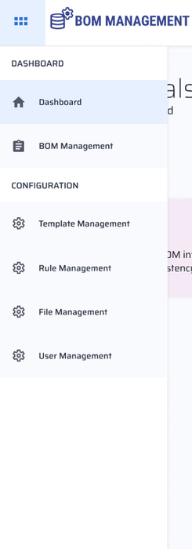
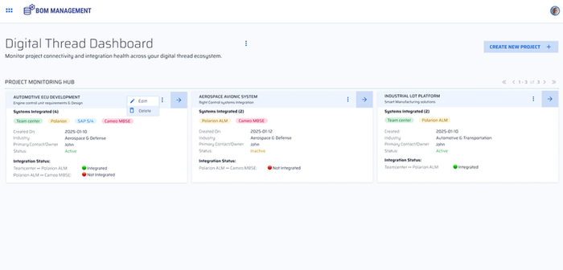
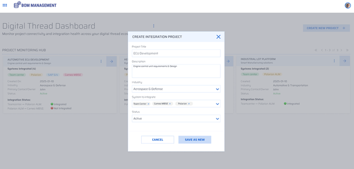
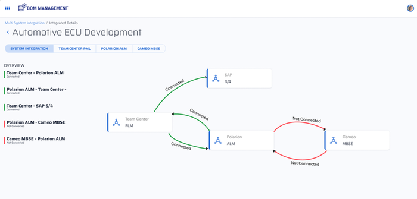
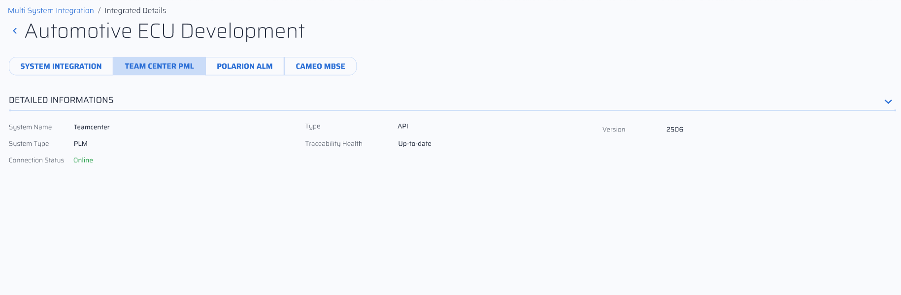

Digital Thread Foundations

Digital Thread Dashboard

FUNCTIONAL OVERVIEW

Release Version:1.2

Metadata Table

| **Field** | **Value** |
| --- | --- |
| **Asset / Solution Name** | Digital Thread |
| **Domain / Area** | Engineering |
| **Owner (Team/Person)** | Karthik Ramachandra |
| **Reviewers** | Karthik Ramachandra |
| **Status** | Approved / Complete |
| **Confidentiality** | Internal / Confidential |
| **Source of Truth** | [link](https://dev.azure.com/IXAssets/IXAssetsProject/\_git/ixassets) |
| **Related Assets / Alternatives** | AOT / Engineering Orchestration / Engineering Agents |

## Introduction

Industry X Digital Thread Foundations delivers industry-agnostic building blocks that create a virtualization layer over connected products, operations, and services. It provides a communication framework that connects different systems across the product lifecycle, enabling seamless data sharing and driving improvements in industrial and manufacturing processes. IX Digital Thread goes beyond data exchange to provide end-to-end, asset-relevant information that enhances efficiency and business value.

The Digital Thread Dashboard is the central command hub within the IX Digital Thread Foundations platform. It provides real-time visibility into the health, performance, and status of digital threads across integrated enterprise systems (e.g., PLM, ERP, ALM). The dashboard streamlines project monitoring, accelerates decision-making, and improves operational execution by consolidating data into a single, unified interface.

The Digital Thread Dashboard acts as the central nervous system for managing digital initiatives across enterprise systems. By consolidating project, system, and integration data into one view, it enables faster deployment, reduces risk, and drives cross-functional collaboration.

### Purpose

This document provides an overview of the Digital Thread Dashboard.

###  Target Audience

-   Project Managers

-   System Integrators

-   Solution Architects

-   Product Data Managers

-   IT Administrators

### Prerequisites

-   BOM Management Application should be deployed.

-   Appropriate role-based access to the BOM Management application (provided by [IX_DT_DEVOPS_INFRA@accenture.com](mailto:IX_DT_DEVOPS_INFRA@accenture.com)).

### Contacts

-   [karthik.ramachandra@accenture.com](mailto:karthik.ramachandra@accenture.com)

-   [vamsi.konambhotla@accenture.com](mailto:vamsi.konambhotla@accenture.com)

-   [riju.dhar@accenture.com](mailto:riju.dhar@accenture.com)

### Related Links

-   [Release Notes](https://industryxdevhub.accenture.com/assetdetails/84)

-   [IX Developer Hub Resources](https://industryxdevhub.accenture.com/asset-home;search_text=digital%20thread%20foundations)

### 

## 

### Glossary

| **Term** | **Definition** |
| --- | --- |
| Digital Thread | A virtualization layer connecting products, operations, and services across the product lifecycle, enabling seamless data sharing and process improvement. |
| Digital Thread Dashboard | The central command hub, which provides real-time visibility into the health, performance, and status of digital threads across enterprise systems. |
| PLM (Product Lifecycle Management) | A system for managing the entire lifecycle of a product from inception, through engineering design and manufacturing, to service and disposal. |
| ERP (Enterprise Resource Planning) | Integrated management of main business processes, often in real-time and mediated by software and technology. |
| ALM (Application Lifecycle Management) | The supervision of a software application from its initial planning through retirement. |
| Thread Creation | The process of defining the scope, systems, and metrics for a new digital thread project. |
| System Integration | Connecting different enterprise systems to enable unified data flow and monitoring. |
| Holistic Monitoring | Real-time, unified overview of project statuses and system health across all integrated platforms. |
| Integration KPIs | Key performance indicators such as data throughput, flow, and consumption used to assess integration performance. |
| Project Monitoring Hub | A dashboard feature providing aggregated, real-time views of project and system health. |
| Data Governance | Centralized control of user access and data security to ensure consistency and compliance. |
| Connector | A reusable integration component that links different systems for data exchange and monitoring. |
| Role-Based Access | User management approach where permissions are assigned based on roles within the organization. |
| Deployment Readiness | Objective, data-driven metrics indicating whether systems and projects are prepared for launch. |
| Asset-Relevant Information | Data that is directly related to specific assets, enhancing operational efficiency and business value. |
## 

# Background

Managing complex industrial environments with multiple platforms often results in fragmented visibility, inefficient workflows, and delayed issue resolution.

Key pain points addressed by the dashboard include:

-   **Fragmented Visibility**: Manual status gathering from disparate systems.

-   **Complex User Management**: Decentralized permission administration.

-   **Inefficient Integration Management**: Rigid, custom integrations with poor scalability.

-   **Delayed Issue Detection**: Lack of real-time insights leads to cascading failures.

The Digital Thread Dashboard resolves these challenges by centralizing monitoring, integration management, and user control in one interface and provides the following benefits.

-   Accelerated project go-lives

-   Centralized issue detection and resolution

-   Unified visibility for all stakeholders

-   Streamlined administration and governance

-   Scalable foundation for enterprise-wide digital transformation

###  Business Value

The dashboard transforms disconnected system data into actionable intelligence, enabling:

-   **Faster Deployments**: Real-time system readiness reduces delays and risks during go-live.

-   **Reduced Risk**: Proactive alerts and monitoring enable early issue detection.

-   **Improved Collaboration**: A single dashboard aligns all stakeholders with shared data.

-   **Stronger Data Governance**: Centralized user and access control ensures consistency and security.

-   **Increased Operational Efficiency**: Automation and visibility reduce manual work and decision latency.

-   **Scalable Architecture**: Connector-driven design supports easy expansion and avoids vendor lock-in.

### Unique Features

#### Thread Creation and System Integration

-   Guided Thread Creation: Step-by-step process to define scope, systems, and metrics.

-   Dynamic System Integration: Add or remove systems anytime during a project lifecycle without disruption.

#### Holistic Monitoring

-   Active Project Overview: Real-time snapshot of project statuses for quick assessment.

-   Dynamic Status Aggregation: Automated calculation of unified project health from system inputs.

#### System and Integration Insights

-   Individual System Health: View uptime, alerts, and performance per system.

-   System Drill-Down: Access detailed logs, success/failure rates, and API call history.

-   Integration Overview: Visualize data flow between systems, active connections, and error points.

### 

## 

### Comparison to Traditional Approaches

| Aspect | Traditional Digital Thread Dashboard |
| --- | --- |
| Project Visibility | Fragmented, manual reporting Unified, real-time overview |
| Issue Detection | Reactive, often delayed Proactive, real-time alerts |
| Integration Management | Custom-coded, isolated Centralized, reusable connectors |
| User Management | Manual, multi-system Centralized role-based access |
| Deployment Readiness | Subjective and scattered Objective, data-driven metrics |
## Core Functionalities

The following two are the core functionalities of the Digital Thread Dashboard.

### 

## Project Monitoring Hub

Provides a high-level, real-time overview of all active digital thread projects.

#### Project Status

> Aggregated view of overall project health (e.g., Active, Inactive), derived from the status of integrated systems.

#### System Status

> Operational status of each connected system used to identify points of potential failure.

#### Individual Health Status

> Granular view of each integration point (e.g., Integrated, Not Integrated).

#### Integration KPIs

> Metrics such as data throughput, flow, and consumption to assess performance and detect bottlenecks.

###  Digital Thread Management

Supports key lifecycle operations for digital threads:

#### Create

> Define a new thread, its purpose, and add systems.

#### Update

> Modify configurations, systems, or project metadata.

#### Delete

> Remove threads to maintain a clean environment.

## 

# User Flow 

### Access the Dashboard

After logging into the BOM management application, the user can access features on the top left, including the Dashboard, which leads to the Digital Thread Dashboard for project and thread management.

On the dashboard, users view project tiles and have the options to edit and delete them. Using the \'Create New Project\' option, new projects can be created.

### Project Creation

Clicking the \"Create New Project\" option launches a pop-up window in which the user can fill in the project name, description, industry, and selects systems to integrate. After completing the form, the user clicks \"Save as New\" to proceed.

### 

## View Project Details and Metrics

The project which is created is saved in the backend with the provided details and information. A graphic view of its key information and metrics can be viewed on the dashboard.

The System Integration Status of the formed Digital Thread is presented in a visualized format, alongside the status of each Individual Connected System.

