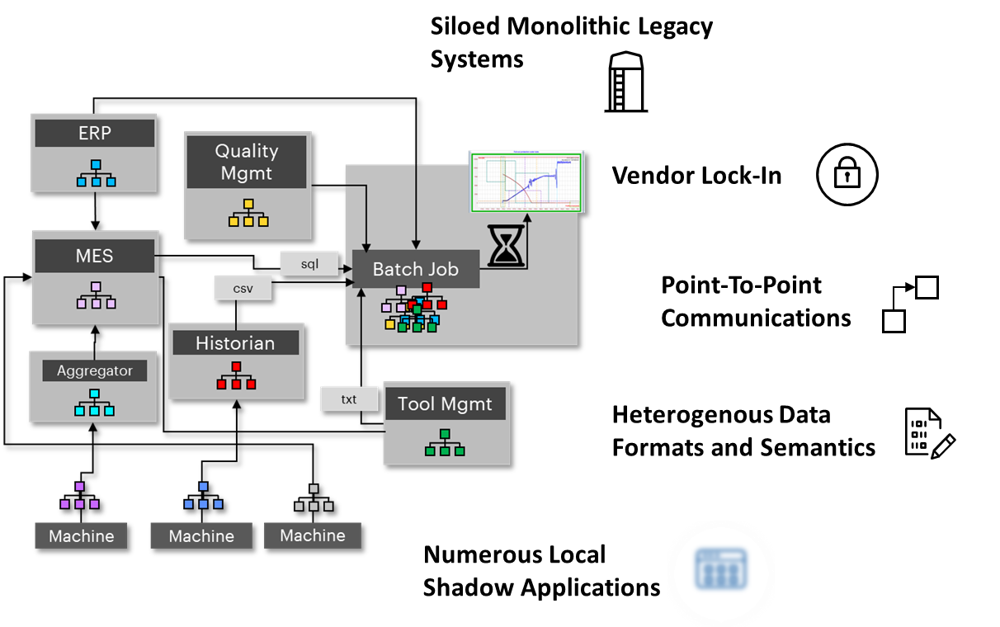
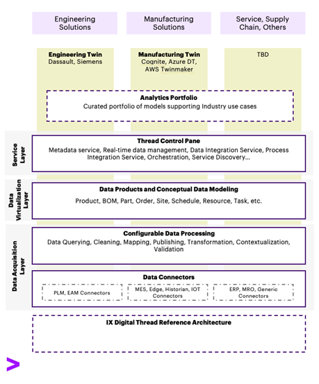
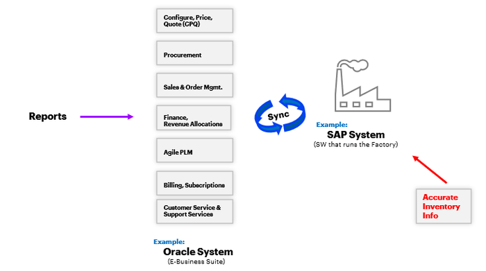

Digital Thread Foundations

FUNCTIONAL OVERVIEW

Release Version: 1.2

## Introduction

Industry X Digital Thread Foundations delivers industry-agnostic building blocks that create a virtualization layer over connected products, operations, and services. It provides a communication framework connecting different systems involved in the product lifecycle so that data can be shared, thus leading to improvements in industrial and manufacturing processes. IX Digital Thread goes beyond just the data. It provides end-to-end information that is relevant to an asset and thus drives efficiency and value for a business.

### Purpose

This document provides an overview of the key functionalities of IX Digital Thread Foundations.

### Target Audience

Software architects, developers, and integrators with IT backgrounds.

### Related Links

-   [Architecture Blueprint](https://industryxdevhub.accenture.com/assetdetails/85)

-   [Release Notes](https://industryxdevhub.accenture.com/assetdetails/84)

### Business Contacts

-   [florian.tournier@accenture.com](mailto:florian.tournier@accenture.com)

-   [laura.mosconi@accenture.com](mailto:laura.mosconi@accenture.com)

-   [karthik.ramachandra@accenture.com](mailto:karthik.ramachandra@accenture.com)

### Technical Contacts

-   [laura.mosconi@accenture.com](mailto:laura.mosconi@accenture.com)

-   [janos.puskas@accenture.com](mailto:janos.puskas@accenture.com)

-   [zsolt.tofalvi@accenture.com](mailto:zsolt.tofalvi@accenture.com)

-   [stefano.giacco@accenture.com](mailto:stefano.giacco@accenture.com)

## 

## Glossary

| Term | Definition |
| --- | --- |
| Digital Thread | The integrated framework of data, metadata, aggregation, and contextualization that connects distinct systems, ensuring synchronous and accessible information across the product lifecycle. |
| ETL (Extract, Transform, Load) | A process in data management that involves extracting data from different sources, transforming it into a suitable format or structure, and loading it into a target system. |
| Operational Technology (OT) | Hardware and software that detects or causes changes through direct monitoring and control of physical devices, processes, and events in industrial environments. |
| Lean Business Practices | Strategies focused on maximizing value and minimizing waste within manufacturing systems. |
| Value Chain | The sequence of activities that a company performs to deliver a valuable product or service to the market, including suppliers, manufacturers, and distributors. |
| Total Cost of Ownership | The overall cost of acquiring, operating, and maintaining a system, including data storage, system maintenance, and licensing fees. |
| Ingestion | Process of collecting, transforming, and loading data from various sources into a system for storage or analysis. |
| Cloud Native | Technologies and practices (e.g., containers, microservices) used to build scalable, resilient applications in modern cloud environments. |
| Data Contextualization | Adding metadata or context (e.g., time, location, user info) to raw data to make it more meaningful and useful. |
| CDC | Technique for detecting and capturing data changes so downstream systems stay synchronized. |
| PLM | Management of a product\'s lifecycle from design through manufacturing to end‑of‑life. |
| ERP | Integrated system that unifies core business functions such as finance, HR, and supply chain. |
| ALM | End to end management of an application\'s lifecycle-from requirements to maintenance. |
| MES | System that manages and monitors real‑time manufacturing operations on the shop floor. |
## 

# Background

Industry 4.0, or the trend toward automation and data exchange, is disrupting the industrial and manufacturing landscape. Data is the driver of this disruption. The digital thread is defined as the data, metadata, aggregation, contextualization, services, and information technology (IT) and operational technology (OT) framework that governs the data and transforms it into information. The digital thread goes beyond just the data. It provides end-to-end information, relevant to an asset, which drives efficiency and value for a business. Simply put, Digital Thread as a platform aims at connecting two isolated or different systems and performing various extraction, transformation, and loading (ETL) functions on them. The objective of Digital Thread is to have synchronous data across systems.

With Industry 4.0, labor efficiency, quality, and development time have all been improved. Additionally, with the increase in computing power and advancement in artificial intelligence and machine learning, advanced analytics have dramatically pushed value levers and have optimized business efficiency.

Lean business practices have squeezed the efficiency levers for many companies to the point where their products and processes are already approaching maximum efficiency, leading to diminishing returns on continued streamlining. The next wave of value production comes with the digitization of the entire product lifecycle process - from design to engineering, manufacturing, and service. Synthesizing a product in a digital world and evaluating and modeling its efficiency and effectiveness before purchasing materials or parts, building, or manufacturing any physical product, will dramatically reduce errors and rework and drive additional value creation. Once manufactured, automatically receiving information about the manufacturing process and subsequently, the performance of the asset once sold will decrease the amount of time and resources required to support and improve the asset.

This concept does not stop at the manufacturer. It extends to others in the value chain, such as suppliers, servicers, raw material producers, and shippers. When multiple parties begin to share information on the digital thread, more efficiency (and therefore more value) can be realized by all. The digital thread concept starts expanding well beyond \'just the data.\' While the data is the underpinning of the thread, scaffolding around the data is also essential to provide the interconnectedness between data, systems, and stakeholders. This creates value through the dissemination of information where and when needed to make critical business decisions.

### 

## Challenges

As illustrated in the diagram below, many manufacturing plants have some direct integration, but the operator is required to manually access the system front end to get the information needed because the systems in place are misaligned.

The related consequences include:

-   High total cost of ownership due to data storage, complex system maintenance, and licenses.

-   Performance problems due to complex, inefficient logic.

-   Complex serviceability due to high local customizations and different system versions.

-   Complex system evolution due to monolithic structure.

-   High effort required to extract and correlate information from current heterogeneous data silos.

These limitations mostly affect the Production level, but similar pain points can be found in the other phases of Product management.

Let us add the view of the complexity of the full product life cycle management considering a single Product Development Process. A Product usually consists of Mechanical, Electronical, and Software Parts that need to be designed, produced, and eventually assembled. Some of them will be produced in-house, but others will be outsourced to an external supplier. The global and regional network of components and suppliers is extremely complex by itself, and one single change in the design can affect the design and manufacturing of multiple components in the value chain. Such changes propagation, many times are manual and in a point-to-point way, reducing the possibility of real-time alignment, making hard traceability, and delegating to the individual the collaboration across the departments.

##### Business Challenges

-   Provide Data transparency and enable collaboration through product lifecycle.

-   Build an application that integrates real-time changes to:

    -   Engineering Bill of Materials (eBOM)

    -   Manufacturing Bill of Materials (mBOM)

    -   Software Bill of Materials (sBOM)

-   Track and trace data end to end across systems.

-   Create and share full Product lifecycle context from engineering to manufacturing to services.

-   Provide Flexibility of vendor selection and work with brownfield environments.

-   Derive Insights and business events from Thread data and build applications / use cases.

##### Technical Challenges

-   Connect data from multiple systems across engineering, manufacturing, supply chain, and service.

-   Data integrity and Data Quality across Systems.

-   Work across vendor systems and outside predefined point-point or vendor-centric integrations.

-   Manage OT / IT / ET data, supporting both batch and real-time.

-   Lack of Standards on OT Systems and proliferation of proprietary protocols.

-   Enable data extraction, cataloging, and change management.

-   Enable consistent data security and policy across company.

To overcome such a situation, the digital thread can act as a distributed framework that connects the siloed external systems and seamlessly processes and transforms system data with minimal human interaction.

## 

# Solution Strategy

While early releases will rely on Azure Cloud and Services, the design has been done to have an easy portability to the other Cloud or on-Premises Solutions and support a distributed computation approach.

### Key Concepts

Rather than combining data from all the different systems into a single, central datastore or data lake, Accenture\'s approach to a Digital Thread architecture employs a virtualization layer that leverages the Data Catalog and enables various teams to access the required data directly at the source in a self-serve mode. In this decentralized data management approach, data mapping is critical, and the source system will guarantee the quality and freshness of the data.

### Goals

The main goal of the Digital Thread is to connect siloed systems using the Thread Framework. The connection, depending on the use cases, will be both Physical (data ingestion and sync and implying data transfer) and Virtual (accessing the data, maintaining it at the source). Secondary goals are listed below.

-   Product and value chain knowledge: The basis to create value in our clients\' value chain is to have a deep understanding of it. Core know-how of our clients\' product development processes, manufacturing technology, and deep supply chain know-how is key. The core of a running digital thread is basically a smart flow of product information (e.g., bill of materials - hybrid of hardware and software) along the complete lifecycle. Deep industry know-how is key for that.

-   IT System integration knowledge: Along with the product value chain, there goes the knowledge of how to integrate an IT System along the complete value chain. Frequent challenges include missing data integrity, data governance, and interoperability of existing legacy systems based on different technologies. And finally, and most importantly, data silos, which are not connected. Furthermore, data security is key to protecting enterprise OS information.

-   OT System Integration: Integrating OT (Operational Technology) with a Digital Thread is complex. This is because specialized protocols are needed to connect to machines and equipment.

-   Process, knowhow, organization, and people: A running digital thread is always a smart combination of smart product and system architecture along the lifecycle together with our clients\' people and organization. Running IT, OT, or ET system alone is not effective if your operational people are still running on the shop floor with their printed Excel spreadsheet (XLS) files. To overcome the disconnect between digital strategy and operational reality is key.

-   Industrial Standard: The lack of standards makes it difficult to build integration with legacy systems and their proprietary protocols.

-   Simplified App Building: Allow the building of applications with standard localization and translation (LC) tools.

### 

## Cloud-Native Approach

Accenture\'s Digital Thread Foundations architecture is designed to follow a Cloud Native approach. It relies heavily on Platform as a Service (PaaS) compute infrastructure and managed services, allowing the underlying infrastructure to be treated as disposable-provisioned within minutes and automatically resized, scaled, or decommissioned as needed. New services and applications are developed using a microservice architectural style, creating an ecosystem of small, independent, interoperable, and business‑specific services that communicate through standard protocols. Each microservice is self‑contained, encapsulating its own data storage technology, dependencies, and programming platform; when combined with containerization, this structure ensures portability and consistent behavior across environments. The architecture also takes advantage of managed backing services such as storage, monitoring, and access management, treating them as attached, dynamically bound resources configured at runtime. This allows backing services to be added or removed without requiring code changes, improving both cloud and framework portability.

### Validation through POC

Although custom code is important, it\'s often better to use existing frameworks instead of building new services from scratch. The team will use POCs to compare open-source, PaaS, and enterprise solutions based on technical and business requirements.

### IT-OT Integration

An event-driven architecture (EDA), featuring a Distributed Architecture Pattern/Style, is employed for IT-OT system integration to address the limitations of the traditional ISA95 layered data flow model, which primarily supports bottom-up communication-from sensors to PLCs, PLCs to SCADA or MES systems, and occasionally to ERP systems. The choice of Event Broker, such as Kafka or Event Hub, will be determined by the complexity of the use case and will facilitate the integration of lightweight protocols like MQTT for efficient data acquisition from machines and sensors.

### Unified Domain or Meta Model

In the designed architecture, any node in the network ecosystem can act both as a generator and/or consumer of data. Considering that each system has its own data semantic and data service exposure, we have considered using a Data Catalog to:

-   Create a Unified Domain or Meta Model across the different Layers to identify the Data source of truth, Data Meaning, and Relationship. The Metamodel will map Business Entity Relationship with the Related Technical Entity and Data Asset. In case the same Business Entity is used in different Domains/Systems it will be possible to define differences in the semantic aspect and technical aspect.

-   Create a Data Glossary to explain the meaning of the system\'s entity.

-   Speed up data searching and data discovery across the system and data domains.

-   Enable data lineage to track how the data is transformed across the systems.

### 

## Distributed Query Management

Data migration to the cloud is not the only solution; a Query Engine Framework allows data processing and querying at the source. This framework can integrate with system data sources or use the DT Connector Framework, enabling data composition and providing unified access for applications or users.

#### Deployments Approach

Each custom component is built as a modular, independently deployable service (e.g., a package with its connector and dependencies), enabling deployment of only what\'s needed for each project. Modules feature interfaces for integration into the Digital Thread Ecosystem and depend on shared framework services for security, monitoring, DevOps, and governance.

Containerization will be used where applicable, for both custom and third-party solutions. The development team follows Infrastructure as Code best practices to automate provisioning and deployment and applies software engineering standards like testing and versioning to DevOps.

#### Development Approach

All custom modules provided by the DT will adhere to established Cloud Native, Data Management, and Architectural standards. To support this approach, specific Development Guidelines have been developed and distributed to the development team.

Every custom module will be designed as an extensible microservice, pre-integrated with systems for Monitoring, Access Management, and Data Governance. Regardless of the technology or programming language, each module will offer APIs-documented according to the OpenAPI standard-to ensure seamless interaction within the Ecosystem.

If a third-party solution or PaaS/FaaS service is incorporated, it will be adapted to meet the Framework Guidelines for Security and Traceability.

For connectors specifically, they will all be created using a shared connector framework featuring standardized, published interfaces with which every connector must comply. The framework provides common functions such as instantiation, configuration, logging, and monitoring. To speed up the development of new connectors, a Java-based SDK is available, complete with templates, build scripts, deployment resources, test scripts, and documentation. Once custom connectors pass a defined certification process, they can be added to the integrated catalog for use across projects.

#### Data Management Approach

The main goal of data management is to improve data quality and access control, reduce complexity, reduce operating cost, and enhance analytics capabilities. Each DT module must provide technical capabilities to be compliant with the established Digital Thread Data Governance and Security Guidelines, to enable a homogeneous implementation of data governance, data retention, data access, and data security.

The scope of Digital Thread Data Governance and Security Guidelines covers all applications that handle personally identifiable information (PII) and has been defined to facilitate compliance with data-related regulatory requirements like GDPR. The guideline applies to all stages of the data lifecycle, encompassing data collection, storage, access, transfer, and disposal within the application environment.

## Use Cases

Users of Digital Thread Foundations can use the platform for:

-   **Data and Metadata Discovery** - Users consume the Data Virtualization API to fetch both data and metadata previously stored in the persistent layer by the data processing processes. The Data Federation module must be properly configured to extract the requested data.

-   **Distributed Query** - Users can query with a single request multiple data sources (i.e., persistent storages, external systems exposing query-able API) configured on the Data Federation modules and compose each distinct data source response into a unified response by aggregating data. Data aggregation logic is configured on the Data Federation module.

-   **External Frameworks Alignment** - Users can create new data points into the external systems by triggering the Connector API. Connector API can be exposed directly to the User interface (through the API Management component) or through the Data Virtualization component.

-   **Part Rationalization** - This use case demonstrates how it is possible to combine the different horizontal services provided by the Platform to solve a problem: in this case both connector, data pipelines, and the ML framework are used to review Part Data coming from a Product Lifecycle Management (PLM) system, validate the data quality, suggest classification and optimization.

-   **SDK** - Developer can use the Java SDK to create their custom Connector aligned with DT Guidelines and already integrated with the supported Logging, Monitoring, and Access Management (API Exposure).

-   **Change Data Capture** - Source and Sink Connectors will be available to get Source System Changes and Distribute them real-time to the interested consumers or to store them in well-defined DBs or storage where they can be easily retrieved.

## 

# Functionality

A central concept of IX Thread is that it relies on core services (IX Thread Foundations), structured in three layers (Data Acquisition Layer, Data Virtualization Layer, and Service Layer). These layers interoperate to integrate data from multiple sources across systems, perform transformations, and make it available as high-level services to domain applications (e.g., Analytics, Twin, Solutions).

The overall concept is outlined in the diagram below. The three layers and their major components are discussed further in the subsequent sections.

### Virtualization Layer

The notion of a centralized data model for the enterprise may not work for the use cases that IX Digital Thread is trying to solve. They require a more flexible approach to querying the data without moving it into a common database/model because of the sheer number of different domains and use cases they cater to. Idempotency is important while making sure we are not driving duplication of data. Another drawback of the centralized data model approach is that as more data gets accumulated over time, relevance decreases.

Instead, IX Thread replaces the centralized data model with a discovery process that will output a \"Conceptual\" data model or a logical data model. It will capture a high-level map of the enterprise\'s data and process landscape, including different departments that will share the data ownership, contracts between them, different tools, and applications, how they are related to each other, and various data flows.

The Conceptual Data model will sit atop multiple systems such as SAP, Enterprise Resources Planning (ERP), and Agile Product Lifecycle Management (PLM). Each has its own well-defined data models/objects and often have Application Programming Interfaces (APIs) that allow external systems to read and write to them.

The process of conceptual data modeling enables the following:

-   Integrate domain/business-driven interactions with the individual data models inside these siloed systems.

-   Allow extending or customizing the individual data models to enable two or more systems to talk to each other. Allow support for extendable schemas.

-   Create dynamic data structures that facilitate data exchange between systems, whether it is for sharing data with downstream systems, or for operational or analytics use cases.

-   Allow tailoring of dynamic data structures towards harmonizing the various, siloed data sources, rate at which data changes, and store the history of change.

Rather than creating a common data model, it should focus on creating a distributed model with common interfaces for data exchange.

### 

## Data Acquisition Layer

Since most engineering and manufacturing data is stored in disparate systems, the first order of business for IX Thread is to leverage this data. The goal of the Data Acquisition layer is to bring data from heterogeneous data systems together. It will enable us to use cases such as Demand Forecasting, which require integrating procurement data, supply chain data, operations data, and sales/order data.

This layer consists of two parts,

-   Ingestion Layer

-   Configurable Data Processing Layer

### Ingestion Layer

The Ingestion Layer handles sourcing data from multiple sources.

Connectors are available to create deployable connections to data sources to read and write data from the underlying source systems in a homogeneous way. They will support data ingestion using both streaming (Real-time) and batch modes from various federated data sources. For example, the ingestion layer would allow ingesting high-frequency sensor data from machines in real time as well as reading product inventory data from an SAP system. AOT Connectors should have the following key aspects:

-   Configurable self-contained and independently deployable component

-   Adheres to and exposes a single standard interface

-   Is pluggable, and uses an adapter framework

-   Is deployable anywhere

-   Able to perform CRUD operations on the underlying data source

-   Supports events and real-time data

-   Manages authentication and authorization

-   Manages the connection to the source system

-   Manages any requests for data

-   Manages error handling

-   Is performant

### Data Processing Layer

The configurable Data Processing layer is focused on the integration and transformation of data. It is about enabling an integrated view of data that is ingested (from the layer below) and consumed (in the layers above). This view is a domain-specific view.

The Data Acquisition layer is oriented more towards a Schema on Read approach rather than the typical Schema on Write approach followed by most traditional data stores. This approach allows you to dynamically define the schema(s) to use when you query the data. This ability is crucial when you want to consolidate data from disparate data sources and share it with multiple downstream systems with differing data requirements. You are not forced to identify every system or every data contract in advance and define a data model that satisfies all use cases. A one-size-fits-all/monolithic data model that would cover all Digital Thread use cases is not beneficial here.

This layer enables different systems (consumers) to structure the data according to their own needs. Hence, the name Configurable Data Processing Layer. This layer is different from typical ETL pipelines because it supports the entire life cycle of data from ingestion, transformation, and publishing into other enterprise systems such as PLM and ERP.

One of the main advantages of this layer is extensibility. This layer can extend core components like connectors, or data transformation pipelines with customizations driven by use-case or domain. It should come with a catalog of transformation templates that are already developed and a framework for writing your own connector or custom transformation templates.

To understand the implementation of the data processing layer, consider this example: To build a Risk Analysis application on top of IX Digital Thread, that will easily identify part numbers that are at Risk (obsolescence) across the thousands of Bills of Material (BOM) within an organization, a client team will need to handle data across hundreds of datasheets, compliance databases, product lifecycle updates from PLM systems, available inventory, etc. Through the Configurable Data Processing layer, they can build the data structure that makes sense for the use case that we are trying to build. The Data Processing Layer should have the following key aspects:

-   Configurable self-contained components

-   Loosely coupled with Connector and Mesh layers

-   Use low-code/no-code tools and frameworks to build pipelines and processes to query, clean, and transform data to populate data products/entities

-   Provides the translation layer between data products/entities and connectors

-   Supports CRUD operations

-   Supports real-time and batch data

-   Supports events

-   Adheres to all governance and security policies

### 

## Service Layer: Control Pane

The goal of the Control Pane or service layer is to create a communication framework that connects different systems in the Product Lifecycle so that data can be shared, leading to improvements in the Industrial or Manufacturing processes. It also facilitates unified governance with easy movement of data across systems. The building blocks of the Control Pane are described in the pages that follow.

#### Metadata Store/Service

Metadata plays a crucial role in the Digital Thread framework because it provides the context of data, right from the ingestion of data until the last step in the product life cycle. The Metadata service helps build a scalable Thread framework by:

-   Capturing metadata about data that is stored in various enterprise systems such as PLM and SAP.

-   Facilitating the discovery, monitoring, and observability of data as it flows through the Thread.

-   Orchestrating data processing, whether it is in the ETL pipelines or later in downstream systems.

The three pillars of the Metadata component are described in the table below.

| **Pillar** | **Purpose** |
| --- | --- |
| Metadata Store | Helps to input and add context to data (for example, whether the data pertains to marketing, supply chain, ERP, SAP, finance, etc.). |
| Metadata API | Create APIs that provide metadata about data entities from various domains using a standard interface (query interface). |
| Metadata Service | This is a service that is always running in the background and constantly collecting metadata from data and events flowing through the Thread. This kind of data is called active metadata. As an example, data lineage is about capturing the journey of data as it moves through the system, i.e., when ingesting data from a source system, when copying data from one enterprise system to another, and when transforming data from one form to another. This service will automatically update the lineage service when data is extracted, transformed, or consumed by applications. The metadata service will help answer questions like *how many Panoramic Cameras do we have in inventory?* To answer that query, the following must be known: |
| - | Where is that information stored? |
| - | In which system (SAP or PLM, etc.)? |
| - | Which table or database? |
| - | Do I need to combine data from multiple systems? |
| - | Is this the latest data? Or is the data stale? |
| - | How do I access it? Do I need to write an SQL query? Is there a dashboard created, or is there an API? |
| - | Do I have permission/rights to query this data? If not, who do I talk to? Below are some examples of the data that will be stored in the Metadata store and will be accessible by the Metadata API. |
| - | Applications/Enterprise systems Metadata |
| - | Source System Information |
| - | Target Systems |
| - | Business Context |
| - | Operational Metadata |
| - | Pipeline steps results |
| - | Security, Governance policies, etc. |
| - | Data Catalog |
| - | Data Sources |
| - | Entities, Relationships, Ownership, Transformations/ Pipelines |
#### Data Integration Services

One of the core principles of Thread is to help connect multiple systems that play a role in the product lifecycle, manufacturing, or industrial scenarios. This integration happens at two levels: Data Integration and Process Integration.

**Data Integration** is about managing the flow of data from multiple source systems to consuming applications. This will include services that enable the exchange of data between multiple systems. Some important facets of these services are:

-   This layer ensures the consistency of data across systems via the *sync* service.

-   Consistency is possible only when we have the *context* of data, thus integration with the data contextualization service/Metadata service is ensured.

-   The aggregation and contextualization of data from different Manufacturing systems (such as ERP, CAD, PLM, MES, and CRM) is possible and thus a unified view/connected view of data can be obtained.

-   *Interoperable* data can be obtained*.*

This service plays an important role in helping maintain a single source of truth (data) across all systems. Whenever data is accessed, users are not presented with obsolete data, maintain duplicate data, or lose data.

The positive impact of this service is highlighted in the scenario above, where we are trying to get an inventory of Panoramic cameras as shown in the figure below. This kind of inventory information is most accurate and real-time in the SAP system, which is closest to the factory. But the analysts from the Supply chain / Procurement department who run these reports and queries typically do not have access to SAP systems and so run their data reports against Agile PLM systems. Hence, inventory data must be accurate, real-time, and refreshed across these systems.

**Process Integration** enables two or more enterprise systems to exchange information with each other. Systems like SAP and PLM have their own well-defined object models, processes, and workflows. These workflows are usually tailored to suit their domain/scope and are not built to enable collaboration with external systems. This service enables combining individual workflows or creating a custom workflow that spans multiple applications or systems.

One example might be a workflow that automates the task of setting the effective date on an Engineering Change Order (ECO) based on supply chain availability, thereby integrating workflows across Agile PLM and SAP. Another example would be the task of calculating the ETA of a part number by adding the lead time (procurement systems) with the transit times (shipping systems) and finally releasing the purchase orders based on that ETA.

The diagram below shows both data integration and process integration.

#### 

### Data Catalog and Security Service

All applications or solutions need data that is relevant, clean, and consistent. Digital Thread is no exception. It will need to handle the many interactions between various systems that play a role in the product lifecycle. Systems will talk to each other using data and control messages.

Data such as BOMs, CAD files, sub-assemblies, and Specifications are in siloed systems that make it difficult to access and share. One of the things that the Control Pane needs to do is catalog all the relevant data stored in various systems like SAP, PLM, CRM, etc., and make it easily accessible (sharable), while ensuring all the security privileges and data access control rules are enforced. Thus, a Data Catalog is an important part of this layer, especially considering the vast amount of heterogeneous data that needs to be managed. A data catalog helps in the discoverability of data (search interface) and helps map the existing inventory of data to the requirements of different use cases.

A simple, easy-to-use, global data discovery or search interface that helps users get access to this data place needs to be included as part of this layer.

When we are providing easy access to data, security should be the topmost priority. Basic tenets like encryption in transit and at rest, fine-grained access control, and application and network-level security should be incorporated across all services at this layer. Otherwise, it can get cost-prohibitive to deploy the Thread since entities such as enterprise-grade VPN services will have to be incorporated. By implementing end-to-end encryption, this can be avoided.

This layer will incorporate foundational security elements like:

-   Shared identity and access management (IDM) across tools/systems

-   Unified interface for governance and policies across tools/systems

For example, staying with the same supply-chain example involving the Panoramic cameras, if a user wants to balance the factory output based on supply-demand forecasting, access to real-time inventory and accurate demand forecasting (AI model) is needed. The Thread enables querying for supply and demand data across all systems, including real-time inventory in the factory. Since they are all integrated, unified data access policies can be applied across data sources and applications such as supply-demand dashboards can be consumed.

As shown in the table below, cost data is flagged as sensitive data, and this classification (at a global level) ensures that any application or dashboard/report will not expose this data, unless they have explicit permissions. So, they can query real-time inventory (Quantity on Hand) and open Purchase Orders (PO) but not cost details.

| Part Number | ACN00675 |
| --- | --- |
| Description | Panoramic Camera |
| Part Type | Finished Good |
| Cost | \$172.60 Flagged: Sensitive Data |
| Quantity on Hand | 1720 |
| Purchase Orders (PO) Open | 890 |
#### 

### Digital Twin Interoperability

Digital Twin is defined in the industry as a digital representation of an asset, a product, or a service. Although these twins (engineering, manufacturing, operations, etc.) are represented in the application space, they are deeply intertwined with the Thread and are built on top of thread services such as data acquisition, contextualization, and orchestration.

Digital Twins working with Thread can significantly enhance worker efficiency, plant manufacturing efficiency, safety, etc., by bringing together disconnected data (both real-time and historical) and facilitating improved decision making.

Important facets of this Twin-Thread integration are:

-   Integration into the data ingestion and acquisition services that bring in IoT and time-series data or enterprise data (hydrating the twin).

-   Integrated 3D models representing real-world environments such as plants, equipment, or processes, and thereby providing an integrated view of the assets both in the physical world as well as the virtual world.

-   Common, integrated contextualization services and data (Org / plant / equipment / process hierarchy, unified data, etc.).

-   Built-in integration with analytics tools and AI/ML services.

-   Ability to author / create / manage Twins (UIs).

#### AI/ML Service 

By using advanced capabilities like Artificial Intelligence (AI) and Machine Learning (ML), industrial organizations are optimizing functions such as order management, supply-demand forecasting, inventory tracking, and supply-chain planning.

The AI/ML component of Thread is responsible for the deployment and integration of assets like AI models and analytics tools into the Digital Thread, which in turn leads to automated decision making and optimization.

#### Workflow Service

Workflows are a way to make business processes, or flows (control sequences) automated and repeatable. This has two components that are listed in the table below.

| **Component** | **Description** |
| --- | --- |
| Authoring Tools | UIs with the ability to create, deploy, and monitor complex workflows. |
| Workflow Service | This is the backend service or the execution environment that executes the workflows. The Workflow service component comes with a set of pre-built workflows that are ready-to-use as well as customizable and can create a custom workflow from scratch. Since connectors to enterprise systems are commonly used in several workflow steps, integration with the ingestion/Data Acquisition layer is needed. |
#### 

### Change Data Capture (CDC) 

Change Data Capture (CDC) is a process that tracks data changes in systems/applications and provides real-time or near-real-time information when they occur.

A crucial part of real-time data management is the task of incorporating CDC frameworks into the ingestion pipelines. This ensures all the heterogeneous data sources are synchronized. Thus, with CDC, Thread has access to the entire history of data changes across all systems, whether it is a change in the sales BOM in PLM or inventory updates in SAP. It helps maintain consistency of data across systems and enables users to act on real-time updates to data.

#### Orchestration Engine

Another important component of the stack is the Job Orchestration engine, which is responsible for scheduling and managing jobs, workflows, and other processes across systems. The Orchestration Engine provides:

-   Workflow as a service to the control pane.

-   Authoring tools to manage creating, executing, and monitoring jobs

-   Support for popular constructs like parameterized execution, conditional branching, sequential, parallel, scheduled execution, queue-based, and custom logic.

#### Service Discovery

For all the components described above, whether it is the multiple-source data systems, tools, and services in the data acquisition layer, conceptual data models, or the services in the control pane, a service discovery component is needed. The table below lists the two components of service discovery.

| **Component** | **Description** |
| --- | --- |
| Service description language | Standards-based language for describing the various services in the systems. |
| Service discovery framework | For registration, publishing, discovery, and invocation of different services. |